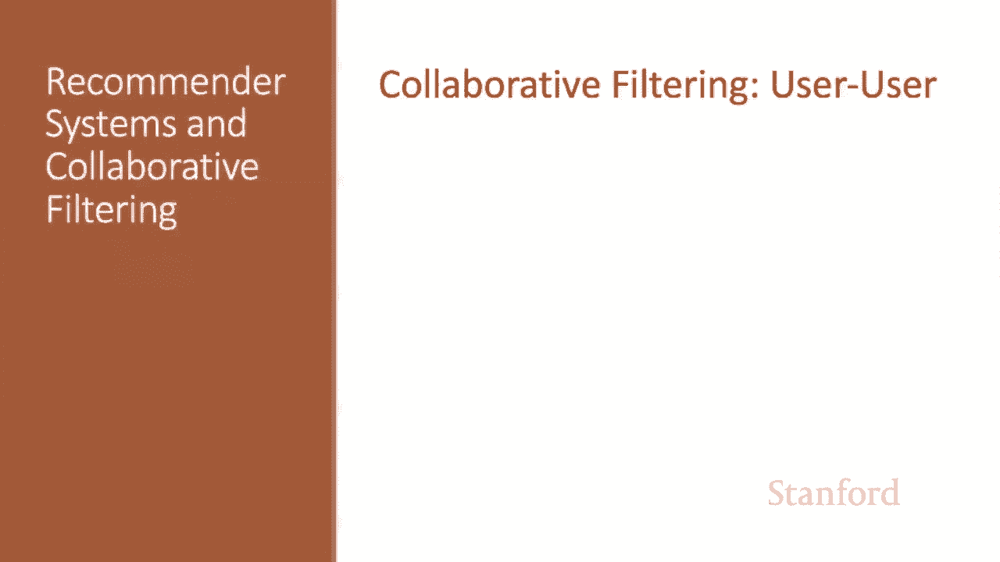
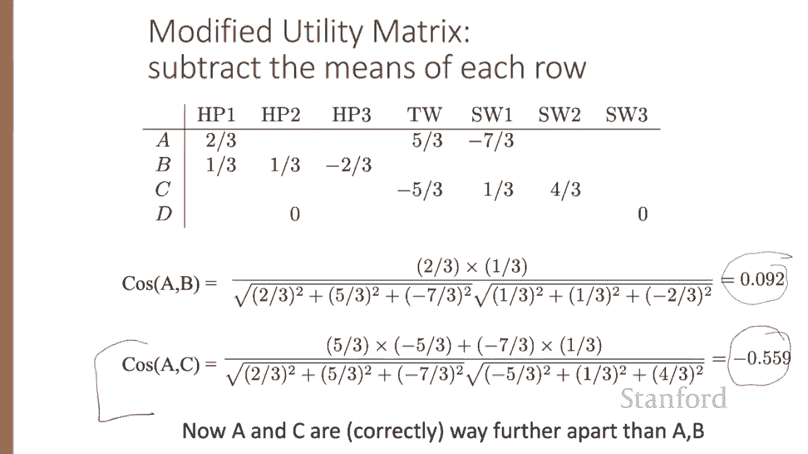
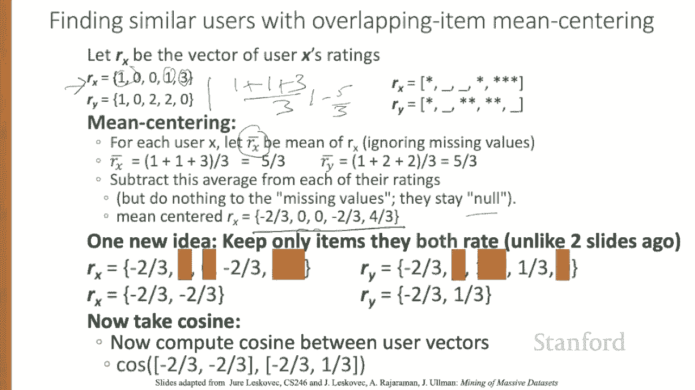
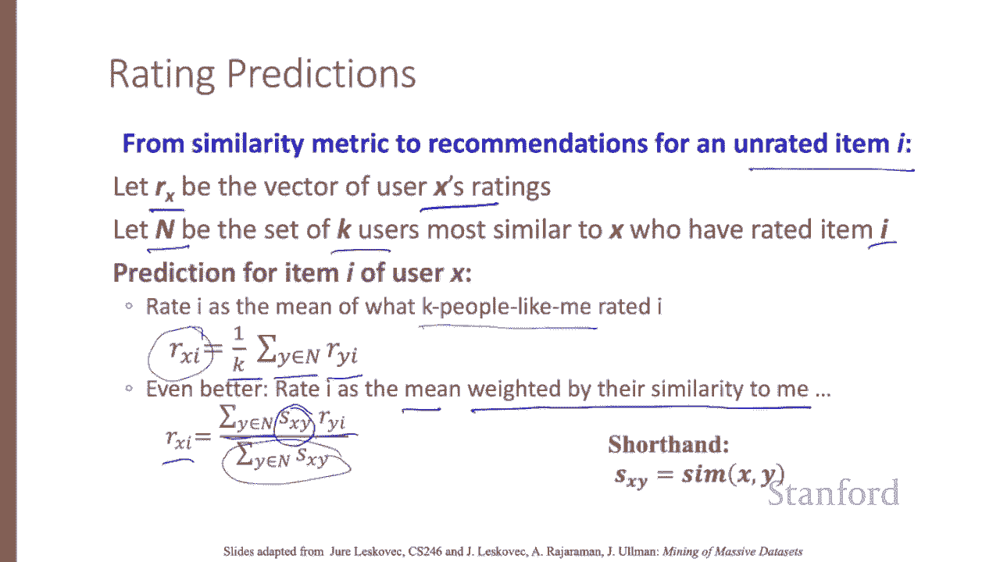
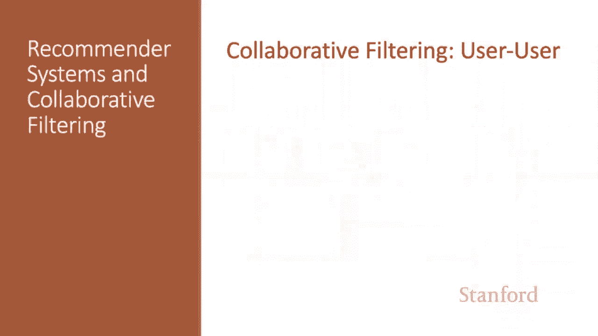

# 74：L12.3 - 基于用户的协同过滤 👥

在本节课中，我们将要学习协同过滤，并首先介绍其基于用户的版本。协同过滤不依赖于物品的内容特征进行推荐，而是通过寻找相似用户，并推荐这些用户喜欢的物品来实现。

## 从内容过滤到协同过滤 🔄

上一节我们介绍了基于内容的推荐方法。本节中，我们来看看协同过滤，特别是基于用户的协同过滤。

在协同过滤中，我们不再使用物品的内容特征来决定推荐什么。我们将找到相似的用户，并推荐他们喜欢的物品。

## 基于用户的协同过滤原理 🧠

让我们看看基于用户的协同过滤是如何工作的。

假设我们有一个用户 X，以及一个他尚未评分的物品 I。我们已经从用户 X 对其他物品的评分中了解了他的偏好。

现在，我们找到一组 N 个其他用户，他们的评分模式与用户 X 相似。然后，我们基于这组 N 个用户的评分，来估计用户 X 对物品 I 的未知评分。

因此，我们需要找到相似的用户，并推荐他们喜欢的物品。

## 如何定义用户相似度？ 📊

为了找到相似用户，我们将每个用户表示为效用矩阵中的一行向量。如果两个用户的向量相似，我们就认为他们相似。

例如，用户 A 和 B 可能相似，因为他们都喜欢《哈利·波特1》。而用户 A 和 C，我们希望他们不相似，因为 A 喜欢《暮光之城》，C 喜欢《星球大战》，并且他们都讨厌对方喜欢的电影。

## 基础余弦相似度的问题 ⚠️

让我们将评分转化为向量。假设两个用户对五个物品有如下星级评分：用户 X 对物品1评1星，对物品5评3星，对物品2和3没有评分。暂时，我们用0来表示空白评分。

现在我们可以用余弦相似度来计算相似性。但这种表示方法存在问题，会导致不直观的结果。

再次考虑我们的效用矩阵。直观上，我们希望 A 与 B 非常相似，而与 C 非常不同。A 和 C 的意见完全相反。但余弦相似度并不将1星视为负面评价，也没有正确处理缺失评分（将其视为无信息），而是将0视为与1非常接近。

我们希望 A 与 B 的相似度远大于 A 与 C 的相似度。但实际上，如果我们计算余弦相似度，两者的相似度非常接近。A 与 B 的相似度确实比与 C 的相似度稍高，但仅高一点点。

余弦相似度的问题在于，它没有真正捕捉到 A 与 C 的对立关系。另一个问题是，我们希望针对评分者进行标准化。例如，评分者 D 对所有物品的评分都一样，他的评分信息量不大。

## 解决方案：均值中心化 ✅

我们希望有一种方法能将0视为无信息，将低分视为负面评价，并将对所有物品评分一致的人视为没有帮助。解决方案是对用户进行均值中心化处理，即从每一行中减去该用户的平均评分。

以下是具体步骤：
1.  计算每个用户（行）的平均评分（忽略缺失值）。
2.  将该平均评分从该用户的每个已有评分中减去。
3.  不处理缺失值，它们最终仍保持为0。

经过均值中心化后，0表示没有信息。0的出现可能是因为完全没有评分，也可能是因为评分者信息量不足。请注意，评分者 D 对所有物品的评分都一样，现在他对这些电影的看法不再具有信息量。一个很低的评分变成了负值。相反的意见则反映在符号相反的向量中，这些向量将指向不同的方向。

这种均值中心化在处理自然语言和数据的许多问题中都很有用，特别是当我们有一个像评分或情感这样在直觉上具有正负两端的尺度，并且存在未评分值时。

## 改进的相似度算法 📈

现在，如果我们在均值中心化的效用矩阵中计算余弦相似度，会发现 A 和 C 的值相反，他们的向量非常不同。实际上，他们的余弦相似度为负值。

一个快速的术语说明：减去均值称为“均值中心化”，而不是“归一化”。“归一化”通常指除以一个范数以将其转化为概率。但教科书和常见用法有时会重载“归一化”这个术语，所以你有时会看到这也被称为归一化。

让我们看看我们将要使用的余弦相似度的最终修改版本，我们还要做一项更改。

假设我们有用户评分向量。对于每个用户，我们计算其平均评分（忽略缺失值）。例如，用户 X 的平均分是 `(1+1+3)/3 = 5/3`，用户 Y 的平均分计算结果相同。然后我们从他们的每个评分中减去这个平均值，不处理缺失值，缺失值保持为0。

现在，对用户 X 进行均值中心化，我们得到 `1 - 5/3 = -2/3`，依此类推。我们不改变0值。

现在我们要增加一项更改：我们只保留两个用户都评过分的物品。因此，我们将移除这三个未被两个用户同时评分的物品，得到两个较短的向量，然后计算这两个较短向量之间的余弦相似度。

以下是该算法的总结：

**均值中心化重叠项余弦相似度算法**（用于计算用户-用户相似度）：
*   我们只查看用户 X 和用户 Y 都评过分的物品。
*   对于每一个这样的物品，我们减去相应用户的平均评分。
*   然后计算这些均值中心化后的向量的余弦相似度。

顺便提一下，均值中心化重叠项余弦相似度是皮尔逊相关系数的一个轻微变体。

## 如何进行预测推荐？ 🎯

现在我们有了相似度函数，可以看看如何为用户 X 的某个未评分物品 I 做出推荐预测。

设 **R_X** 为用户 X 的评分向量，**N** 为与 X 最相似的 K 个用户的集合，且这些用户已对物品 I 评分。

对用户 X 关于物品 I 的预测，我们可以简单地说：取这 K 个“像我一样的人”的评分的平均值。

更优的方法是，我们可以将 I 的评分预测为这些相似用户评分的加权平均值。具体公式如下：

**预测评分公式：**
`预测评分 = Σ (相似度_Y * 评分_Yi) / Σ (相似度_Y)`

其中，求和遍历所有相似邻居 Y，`相似度_Y` 是用户 Y 与用户 X 的相似度，`评分_Yi` 是用户 Y 对物品 I 的评分。通过除以相似度之和来进行归一化。

## 总结 📝

本节课中，我们一起学习了基于用户的协同过滤方法。

我们了解到，协同过滤通过寻找相似用户来产生推荐，而不是分析物品内容。核心步骤包括：
1.  **计算用户相似度**：使用改进的**均值中心化重叠项余弦相似度**，它比基础余弦相似度更能反映用户偏好的异同。
2.  **生成预测评分**：根据最相似的 K 个邻居对目标物品的评分，进行**加权平均**来预测目标用户对该物品的评分。

这种方法能够有效地利用用户群体的集体智慧，为用户发现他们可能喜欢但尚未接触过的物品。

