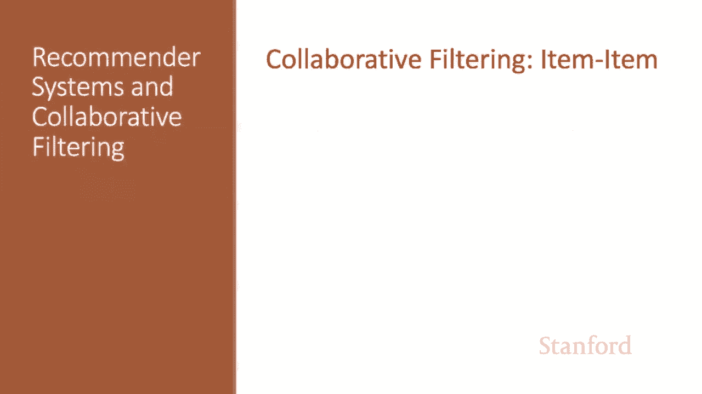
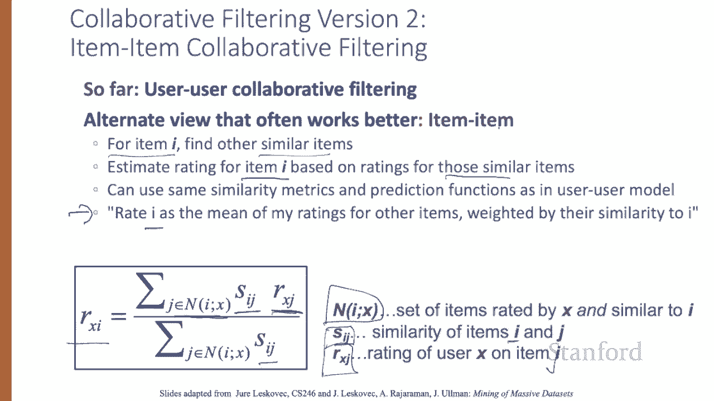
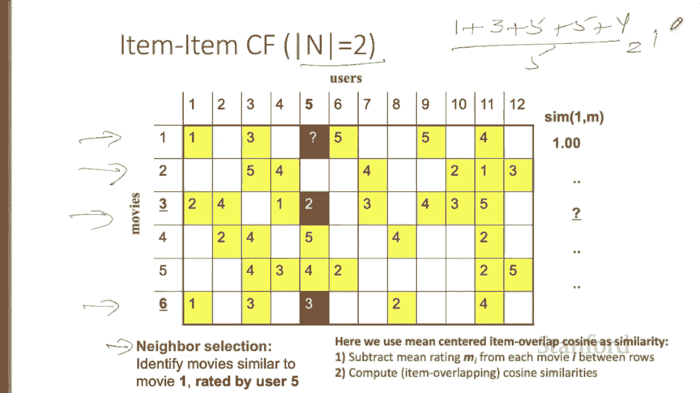
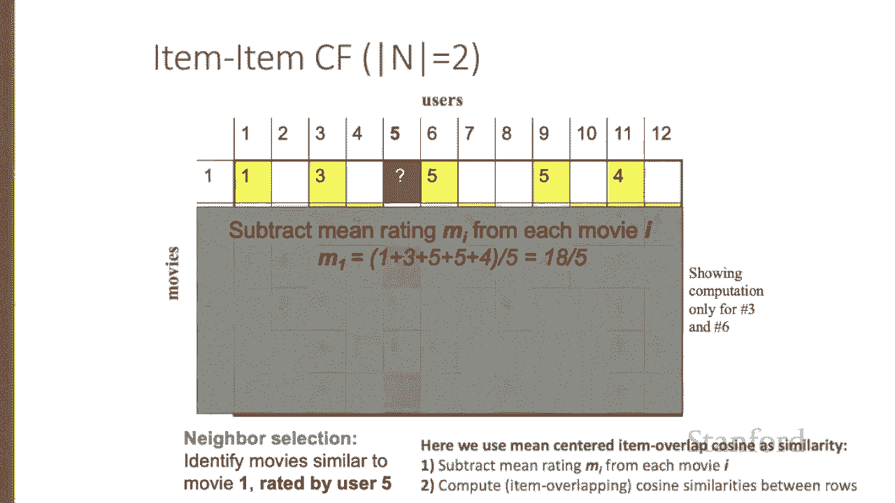
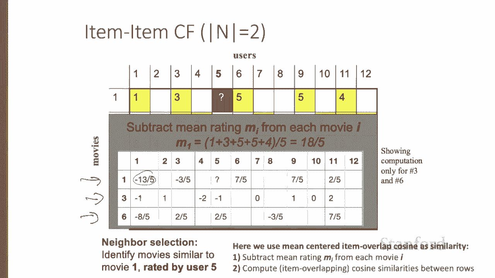
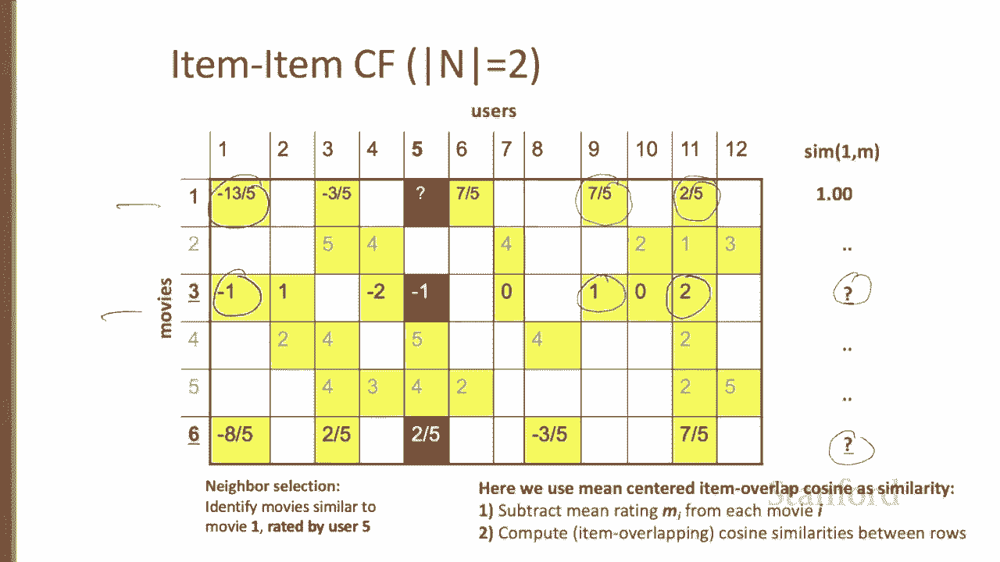
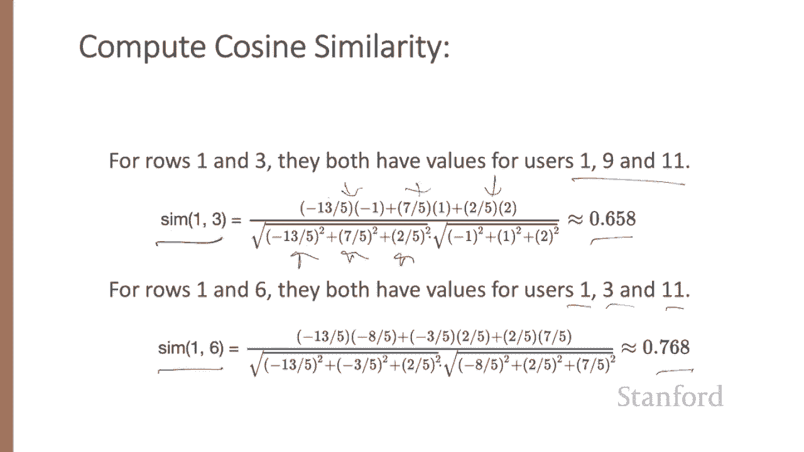
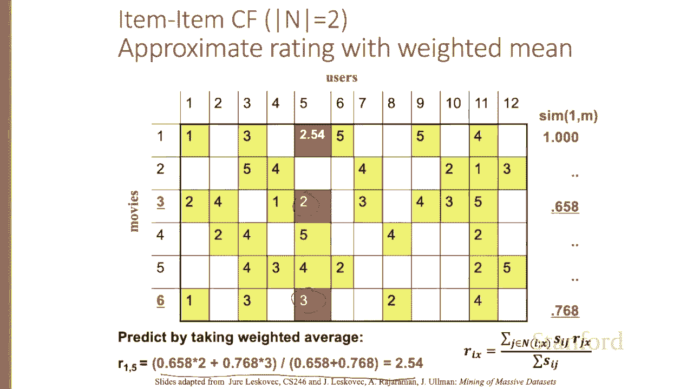
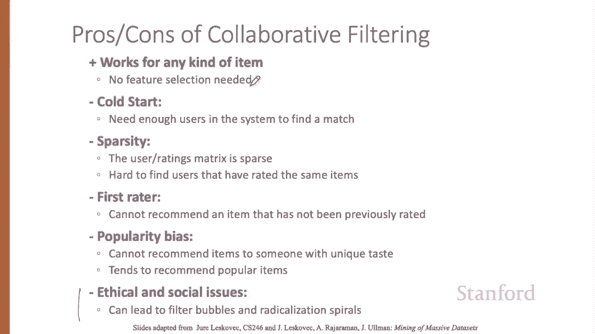

# 75：L12.4 - 基于物品的协同过滤 🎬

在本节课中，我们将要学习协同过滤的另一个版本，称为基于物品的协同过滤。我们将了解其核心算法、计算步骤，并通过一个具体例子来演示其工作原理。最后，我们会讨论该方法的优缺点。

上一节我们介绍了基于用户的协同过滤算法，它通过寻找与你相似的用户来为你推荐物品。本节中，我们来看看一个通常效果更好的替代视角，即基于物品的协同过滤。

这种方法的核心思想是：对于一个给定的未评分物品 **I**，我们推荐那些与你喜欢的物品相似的物品。具体来说，我们会找到与物品 **I** 相似的物品，然后根据你对这些相似物品的评分，来估算你对 **I** 的评分。其使用的相似度度量和预测函数，可以与基于用户的模型完全相同。

算法可以描述为：将一个未评分物品 **I** 的预测评分，计算为我已评分的、与 **I** 相似的其他物品评分的加权平均值。

更正式地，假设我们有一个集合 **N**，包含了我已评分且与这个未评分物品 **I** 相似的物品。对于集合 **N** 中的每一个相似物品 **J**，我们拥有我的评分 **r_{i, J}**，以及该物品 **J** 与目标物品 **I** 的相似度 **sim(I, J)**。

那么，我对物品 **I** 的预测评分 **\hat{r}_{i, I}** 的**公式**如下：

**\hat{r}_{i, I} = \frac{\sum_{J \in N} (sim(I, J) \times r_{i, J})}{\sum_{J \in N} |sim(I, J)|}**

这本质上就是我对其他与 **I** 相似的物品的评分，以它们与 **I** 的相似度为权重的加权平均值。

现在，让我们通过一个例子来逐步理解这个过程。这里有一个用户对电影评分的效用矩阵，我们设定 **n=2**，这意味着我们将通过平均该用户评分的、与目标电影最相似的两部电影，来预测其对未评分电影的评分。

假设我们想知道用户5对电影1（Mo1）的看法，即我们需要填充矩阵中的这个单元格。

首先，我们需要进行邻居选择。目标是找到与电影1最相似、且被用户5评分过的两部电影（因为 n=2）。我们将使用均值中心化的物品重叠余弦相似度来计算。

以下是计算步骤：

1.  计算每部电影（每一行）的平均评分。
2.  从该行的每个评分中减去这个平均分，进行均值中心化处理。
3.  计算行与行之间的物品重叠余弦相似度，以找出哪些电影与电影1最相似。

为了节省时间，这里直接给出提示：最相似的两部电影是电影3（Mo3）和电影6（Mo6）。接下来我们演示这两部的计算。

首先，为每部电影做均值中心化。以电影1（第一行）为例，其评分是 [1, 3, 5, 5, 4]。平均分为 (1+3+5+5+4)/5 = 18/5 = 3.6。从每个评分中减去3.6，得到新的向量：[-2.6, -0.6, 1.4, 1.4, 0.4]。

这是整理后的结果。

我们对所讨论的三部电影（未评分的电影1，以及其最近邻电影3和电影6）都进行同样的操作。分别计算电影3和电影6的平均分并减去，这样低评分（如1分）就会变为负值。

现在，我们需要计算这些电影与电影1的余弦相似度。为了避免视频过长，我们仅计算电影3和电影6与电影1的相似度。

对于电影1和电影3，我们计算物品重叠余弦相似度。这需要计算点积，意味着我们将对两个向量中都存在的用户评分元素进行相乘。电影1和电影3的共同评分用户是用户1、用户9和用户11。因此，我们将这两个向量视为在这三个维度上的向量。

这是电影1和电影3的余弦相似度计算过程。它们在这三个用户（1，9，11）上都有值。我们使用这三个值进行计算。

对于电影1和电影6，它们的共同评分用户是用户1、用户3和用户11。我们同样计算得到余弦相似度。

最终，我们得到电影3与电影1的相似度约为 **0.658**，电影6与电影1的相似度约为 **0.786**。

在实际操作中，我们需要计算所有电影与电影1的相似度，才能找出最相似的两部。但这里我们已知其他电影的相似度估计值都更小，因此我们只需要这两部最相似的电影（因为 n=2）。

现在，我们取用户5对电影3的评分（2分）和对电影6的评分（3分），以它们的相似度为权重，计算加权平均值，来填充电影1的预测评分。

如果使用非加权平均，(2+3)/2 = 2.5。但加权平均的结果略有不同，如下方计算所示。加权平均通常效果稍好。基本上，它表明电影6比电影3与电影1更相似一点，因此电影6的评分（3分）在计算中会获得稍高的权重。

在实践中，基于物品的方法通常优于基于用户的方法。原因如下：

以下是基于物品协同过滤的主要优势：

*   **物品分类更简单**：物品往往可以用简单的术语分类。例如，音乐通常属于单一流派。很难想象一首歌同时属于碧昂丝的风格和巴赫的巴洛克风格。
*   **物品属性稳定**：物品是相对恒定的。一首巴赫的赋格曲始终是巴赫的赋格曲。
*   **用户兴趣动态变化**：而人是动态的，他们的品味会发生变化。

其结果是，发现相似的物品比发现相似的用户更容易。

总结来说，协同过滤适用于任何类型的物品，我们不需要预先定义描述物品的特征集。然而，协同过滤也有一些缺点。

以下是协同过滤面临的一些挑战：

*   **冷启动问题**：无论是物品相似还是用户相似，都需要系统中有足够多的用户才能找到匹配项。
*   **稀疏性问题**：用户评分矩阵非常稀疏，很难找到对相同物品集进行过评分的用户。
*   **首次评分者问题**：难以推荐一个尚未被任何人评分过的物品。
*   **流行度偏见**：难以向具有独特品味的人推荐物品，系统倾向于推荐热门物品，这可能导致诸如信息茧房和观点极端化等问题。

本节课中，我们一起学习了协同过滤的两种主要实现方式：基于用户的方法和基于物品的方法。我们重点剖析了基于物品协同过滤的算法原理、计算示例，并对比了其相对于基于用户方法的优势与仍然存在的普遍挑战。