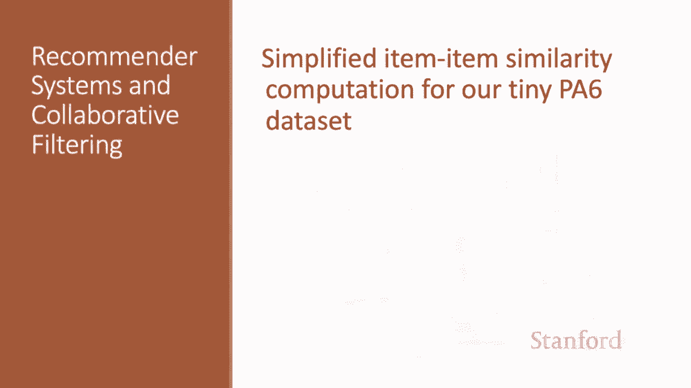
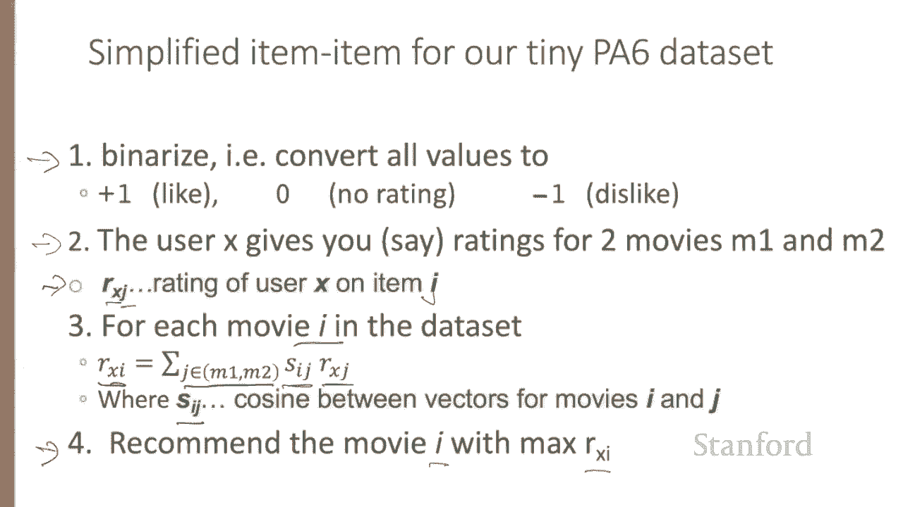

# 76：L12.5 - 在PA6数据集上实现简化的物品协同过滤 📚 

在本节课中，我们将学习如何在编程作业6（PA6）的数据集上实现一个简化版本的物品协同过滤算法。这个简化版本在我们的小型数据集上表现更好。

---

## 🎯 概述

在编程作业6中，我们将实现一个简化的物品协同过滤算法。这个算法之所以被简化，是因为它恰好在我们的小型数据集上效果更佳。

---

## 🔄 数据预处理

首先，我们需要对数据进行预处理。具体来说，我们将把所有评分值转换为+10和-1。

因此，原本的用户-电影效用矩阵会发生变化。转换后，所有“喜欢”的评分变为1，“无评分”变为0，“不喜欢”的评分变为-1。

假设我们已经按照上述方式完成了数据转换，助教们推荐了一些技巧，这些技巧在我们的小型数据集上效果更好。

---

## ⚙️ 算法调整建议

以下是针对我们小型数据集的一些算法调整建议：

1.  **不要对用户评分进行均值中心化**：直接使用原始的+10和-1值。
2.  **不要进行归一化**：在计算预测评分时，不要除以相似度的总和。
3.  **使用简单的余弦相似度**：计算物品相似度时，使用普通的余弦相似度，而不是经过均值中心化的物品重叠余弦相似度。

---

## 📝 简化算法步骤

综上所述，以下是我们为小型数据集设计的简化算法步骤：

1.  用户X对电影M1和M2给出了评分。
2.  对于数据集中的每一部电影I，我们计算用户X对它的预测评分。
3.  预测评分的计算公式为：  
    **R_x(I) = Σ [ rating(X, J) * sim(I, J) ]**  
    其中，求和遍历用户X已评分的所有电影J，`rating(X, J)`是用户X对电影J的评分，`sim(I, J)`是电影I和J之间的相似度。
4.  相似度`sim(I, J)`使用普通的余弦相似度计算。
5.  最后，我们推荐预测评分`R_x(I)`最高的电影I给用户X。

---

## 💎 总结

本节课中，我们一起学习了如何在PA6的小型数据集上实现一个简化的物品协同过滤算法。我们了解了数据预处理（将评分转换为+10和-1），掌握了针对小数据集的算法调整技巧（不进行均值中心化和归一化，使用普通余弦相似度），并明确了简化的预测评分计算步骤。这个简化版本的计算过程比标准版本更加直接明了。