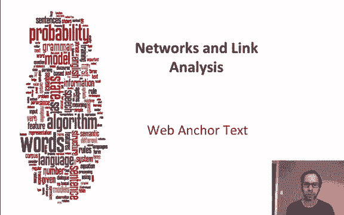
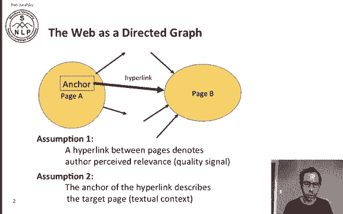
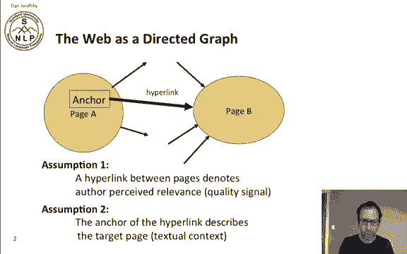
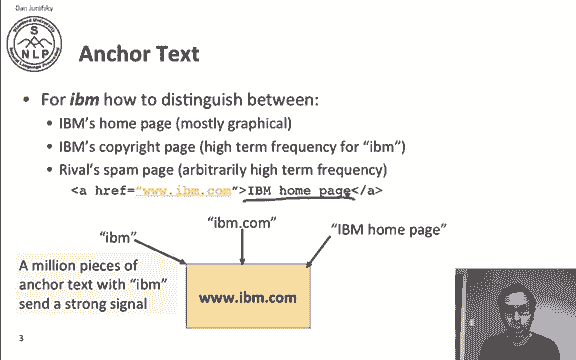
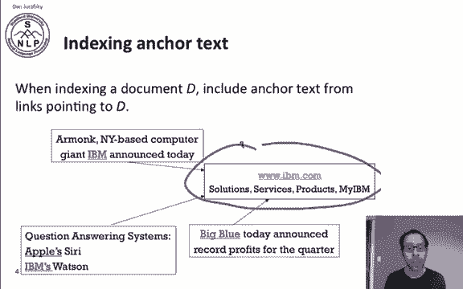
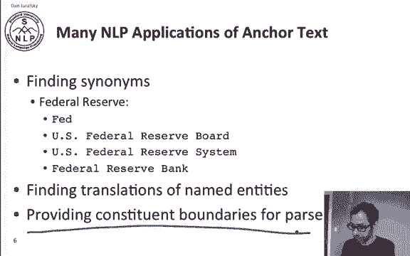
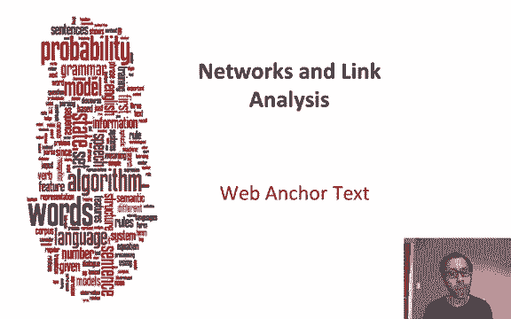

# 77：L13.1 - 网络锚点文本 📚 

在本节课中，我们将要学习网络与链接中的一个核心概念：锚点文本。我们将探讨锚点文本如何帮助搜索引擎理解网页内容，以及它在信息检索和其他语言处理任务中的重要作用。

---

## 🌐 锚点文本简介

上一节我们介绍了网络与链接的基本概念，本节中我们来看看锚点文本的具体作用。

我们可以将网络视为一个有向图，其中每个页面都可以通过链接指向另一个页面，而链接的实现方式就是通过其锚点文本。

关于锚点文本在决定搜索页面相关性时所扮演的角色，我们可以做出两个基本假设。

第一个假设是：页面之间的超链接表明作者认为第二个页面与第一个页面相关。因此，超链接可以被视为一个页面向另一个页面投出的“一票”，表明目标页面是相关的。

第二个假设是：超链接的锚点文本及其周围的文本，是对目标页面的描述。

---

## 🔍 锚点文本示例

为了更好地理解锚点文本的作用，让我们来看一个具体的例子。

假设我们正在尝试寻找IBM的官方网站。IBM的主页本身可能主要由图形和徽标构成，文本内容很少。可能还有一个版权页面，上面布满了“IBM”这个词。此外，可能还存在一个垃圾页面，它通过人为地高频率重复“IBM”这个词来试图干扰搜索结果。

那么，我们如何找到真正的IBM官网呢？直觉告诉我们，来自数百万个不同页面的锚点文本都指向IBM官网，这会发出一个强烈的信号。这些锚点文本可能包括“IBM”、“IBM公司”或“IBM主页”等。

例如，一个链接的锚点文本是“IBM主页”，这提示我们该链接指向的是IBM。如果我们汇总所有指向该页面的链接的锚点文本，就能获得一个非常强大的线索，帮助我们判断哪个页面是真正相关且优质的。

---

## 📇 索引中的锚点文本

在索引文档时，我们会将所有指向该文档的链接的锚点文本，一并纳入该文档的索引中。

以下是具体操作方式：

*   我们有一个IBM页面，网址是 `www.ibm.com`。
*   有些链接称它为“IBM”，有些称它为“IBM的”，还有些称它为“蓝色巨人”。
*   我们将所有这些锚点文本都添加到 `www.ibm.com` 这个URL（即这个文档）的索引中。

这样，即使目标页面本身文本内容不多，其索引也会因为汇集了大量外部描述而变得信息丰富，有助于搜索引擎更准确地理解该页面的主题。

---

## ⚠️ 锚点文本的副作用与解决方案

然而，索引锚点文本也可能带来副作用，例如“谷歌炸弹”现象。这种现象是指外部人员创建大量指向某个页面的链接，但这些链接的锚点文本却暗示该页面是关于其他内容的。

我们可以通过以下方法解决部分问题：根据链接来源页面（即锚点所在页面）的权威性，为锚点文本赋予不同的权重。

具体来说，如果一个页面（例如来自 `cnn.com` 或 `yahoo.com` 这类我们认定为权威的网站）指向另一个页面，那么我们可以更信任来自该页面的锚点文本。其公式可以简化为：
**锚点文本权重 = f(来源页面权威度)**

---

## 💡 锚点文本的其他应用

除了信息检索，锚点文本还有许多其他有价值的应用。

以下是锚点文本的几个重要应用场景：

*   **寻找同义词**：锚点文本是发现同义词的绝佳途径。例如，如果一个页面指向“美国联邦储备银行”，我们可以查看所有指向它的页面的锚点文本。这些文本可能包括“美联储”、“美国联邦储备委员会”或“联邦储备银行”等，这告诉我们这些词都是“美国联邦储备银行”的同义词。
*   **跨语言翻译**：我们不仅可以在一种语言内进行此操作，还可以跨多种语言。例如，我们可以看到其他语言的链接指向联邦储备银行的网站，从而获得“Federal Reserve”在外语中的翻译，这非常方便。
*   **辅助句法分析**：甚至在单个页面内部，锚点文本也能通过为解析器提供成分边界来帮助我们。锚点文本通常描述一个名词短语，因此通过观察锚点文本的边界，可以帮助我们的解析器更好地分析包含该锚点文本的句子结构。

---

## 📝 课程总结

本节课中，我们一起学习了网络锚点文本的核心概念与应用。

我们了解到，锚点文本不仅是网页之间投票和描述的重要载体，能极大地增强搜索引擎索引和理解页面的能力，还在同义词发现、跨语言翻译和句法分析等语言处理任务中发挥着重要作用。同时，我们也认识到需要谨慎处理锚点文本可能带来的问题，例如通过加权策略来应对“谷歌炸弹”等滥用情况。

总而言之，网络锚点文本是网络信息检索和语言处理中一个非常有用的工具。

