# 78：L13.2 - PageRank：简介与马尔可夫链 📚 

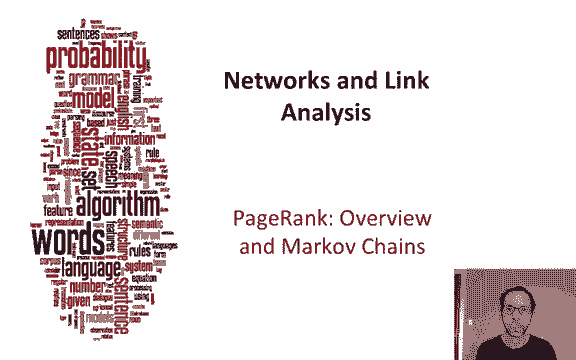

在本节课中，我们将学习 PageRank 算法的基本思想，并了解其背后的数学模型——马尔可夫链。PageRank 是链接分析中最重要的应用之一，它通过分析网页之间的链接关系来衡量网页的重要性。

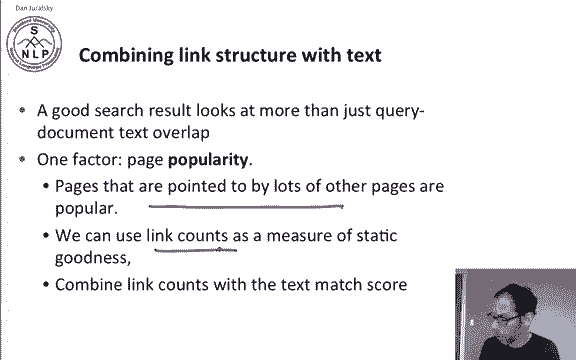

## 🔗 链接分析的重要性

在信息检索中，我们经常讨论查询与文档之间在词汇上的重叠，例如使用 TF-IDF 等技术。然而，判断一个网页是否优质，除了词汇匹配度，还有其他因素。一个直观的想法是：一个非常受欢迎的网页很可能是一个好网页。那么如何衡量受欢迎程度呢？一个简单的衡量标准是查看有多少其他网页指向该网页。被许多网页指向的页面，很可能是一个好页面。

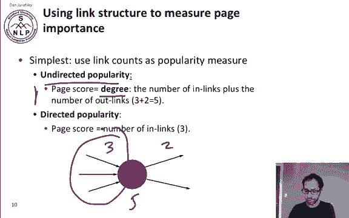

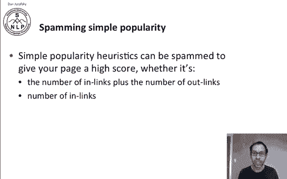

以下是两种使用链接计数来衡量页面受欢迎程度的简单方法：
*   **无向受欢迎度**：也称为节点的度（Degree），计算公式为 **`度 = 入链数 + 出链数`**。例如，页面 B 有 3 个入链和 2 个出链，则其度为 5。
*   **有向受欢迎度**：仅使用入链数。例如，页面 B 的入链数为 3。

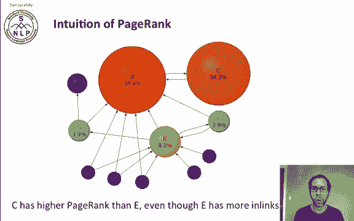

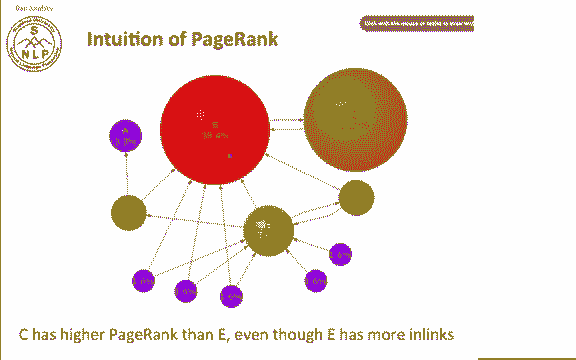

## ⚠️ 简单链接计数的问题

简单链接计数方法的一个主要问题是容易被操纵（Spam）。无论是使用节点的度还是仅使用入链数，都存在这个问题。

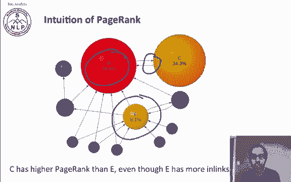

## 💡 PageRank 的核心思想

PageRank 的直觉是：一个链接的重要性，取决于它来自的页面本身的重要性。我们不仅仅计算入链的数量，还要考虑这些入链的来源。如果一个链接来自一个非常重要的页面，那么这个链接的权重就应该更高。

我们将设计一个迭代算法来测量页面的重要性，并将这种重要性沿着链接传递出去。

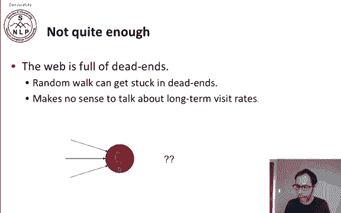

## 🚶 随机游走模型

我们可以想象一个浏览器在网页上进行随机游走。我们从随机一个页面开始，在每一步，我们以均等的概率沿着当前页面上的一个链接前进。例如，如果一个页面有三个链接，那么每个链接被点击的概率都是三分之一。

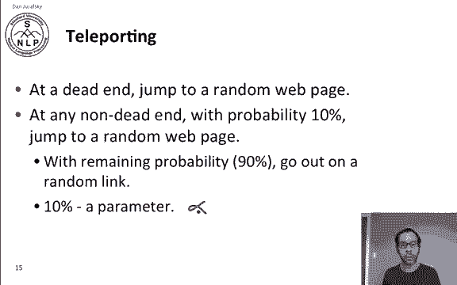

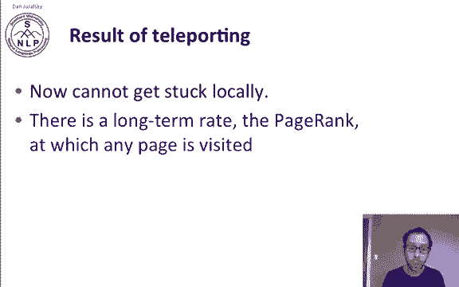

PageRank 的直觉是：在经过大量游走达到稳定状态后，每个页面都有一个长期的访问率。我们将使用这个长期访问率作为页面的得分，即该页面的 PageRank。

然而，纯粹的随机游走还不够好，因为网络上充满了“死胡同”（Dead Ends）。如果一个页面没有出链，随机游走到达该页面后就会被困住。

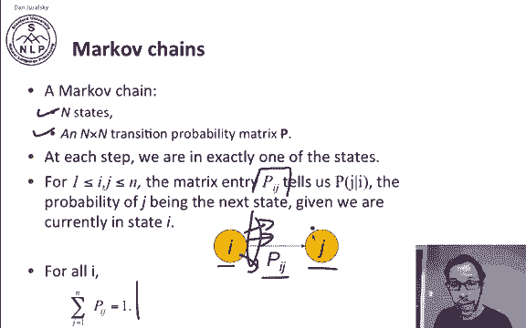

## 🪂 引入“传送”机制

为了解决死胡同问题，我们引入了“传送”（Teleporting）机制。其工作原理如下：
*   当我们到达一个死胡同时，我们直接跳转到整个网页集合中的任意一个随机页面。
*   即使我们不在死胡同，我们也有一个固定的概率（例如 10%）跳转到随机页面。这个概率参数我们称之为 **`α`**。
*   在剩余的概率（例如 90%）下，我们仍然会沿着当前页面的一个随机出链前进。

通过引入传送机制，我们解决了局部被困的问题，并且可以计算每个页面被访问的长期稳定概率，即 PageRank。

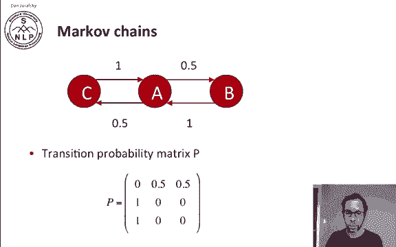

## 🔄 马尔可夫链

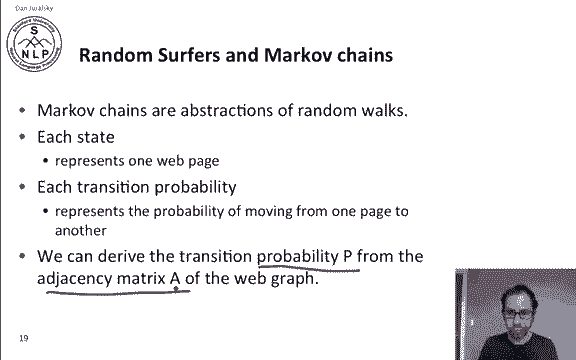

为了计算 PageRank，我们需要从马尔可夫链开始。马尔可夫链是对随机游走的一种抽象，我们将用它来模拟网络冲浪者的行为。

一个马尔可夫链包含一组状态和一个 **`n × n`** 的转移概率矩阵 **`P`**。在马尔可夫链的每一步，我们处于某个状态。矩阵 **`P`** 中的元素 **`P(i, j)`** 表示在状态 **`i`** 的条件下，下一步转移到状态 **`j`** 的概率。对于给定的状态 **`i`**，转移到所有可能状态 **`j`** 的概率之和必须为 1。

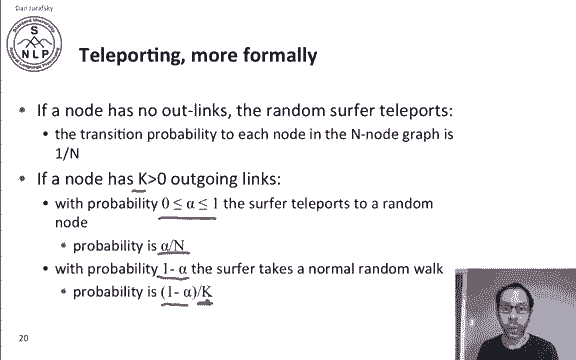

在我们的模型中，每个状态代表一个网页，转移概率代表从一个页面跳转到另一个页面的概率。我们可以从网络的邻接矩阵生成这个转移概率矩阵 **`P`**。

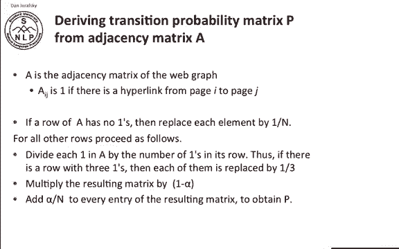

## 📊 构建转移概率矩阵

更正式地，我们这样构建转移概率矩阵 **`P`**：

1.  **邻接矩阵**：设 **`A`** 为网络的邻接矩阵，如果存在从页面 **`i`** 到页面 **`j`** 的超链接，则 **`A(i, j) = 1`**，否则为 0。
2.  **处理死胡同**：如果节点 **`i`** 是一个死胡同（没有出链），那么其对应的行（在 **`A`** 中全为 0）在 **`P`** 中将被替换为 **`1/n`**，其中 **`n`** 是网页总数。这意味着从该页面跳转到任何其他页面的概率均等。
3.  **处理有出链的节点**：对于有出链的节点（假设有 **`k`** 个出链，**`k > 0`**）：
    *   首先，将邻接矩阵 **`A`** 的对应行归一化，使该行元素之和为 1（即每个出链的初始概率为 **`1/k`**）。
    *   然后，将这个归一化的行向量乘以 **`(1 - α)`**。这代表了以概率 **`(1 - α)`** 沿着随机出链前进的部分。
    *   最后，给矩阵 **`P`** 的每一个元素都加上 **`α / n`**。这代表了以概率 **`α`** 进行随机传送的部分。

**公式化描述**：对于每个页面 **`i`** 到页面 **`j`** 的转移概率 **`P(i, j)`**，可以计算为：
**`P(i, j) = α * (1/n) + (1 - α) * (A(i, j) / k_i)`**
其中，**`k_i`** 是页面 **`i`** 的出链总数（如果 **`k_i = 0`**，则公式中第二部分视为 0，并令 **`P(i, j) = 1/n`**）。

## 📝 示例计算

假设我们有一个包含 3 个节点（1, 2, 3）的小型网络，其邻接矩阵 **`A`** 和对应的出链情况如下：
*   页面 1 -> 页面 2
*   页面 2 -> 页面 1, 3
*   页面 3 -> 页面 2

**情况一：α = 0（无传送）**
我们只需将 **`A`** 的每一行归一化，得到转移概率矩阵 **`P`**。

**情况二：α = 0.5**
以页面 1 为例进行计算：
*   传送部分：概率 **`α = 0.5`**，跳转到任一页面的概率为 **`1/3`**。向量为 `[1/3, 1/3, 1/3]`。
*   链接部分：概率 **`(1 - α) = 0.5`**，页面 1 只有一个出链指向页面 2，所以概率向量为 `[0, 1, 0]`。
*   最终行向量：`0.5 * [1/3, 1/3, 1/3] + 0.5 * [0, 1, 0] = [1/6, 2/3, 1/6]`。

对每个页面重复此计算，即可得到完整的转移概率矩阵 **`P`**。

## 🎯 本节总结

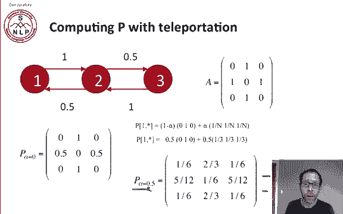

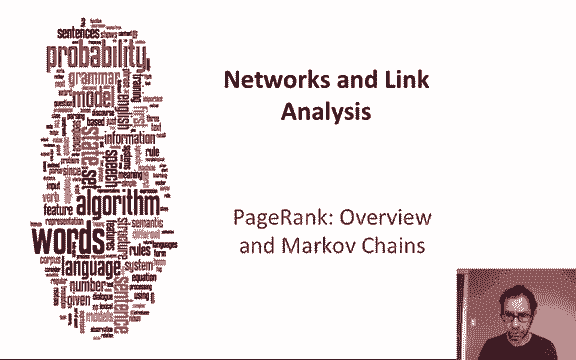

本节课中，我们一起学习了 PageRank 算法的基本直觉，它通过模拟随机冲浪者的行为（结合随机游走和传送）来衡量网页的重要性。我们引入了马尔可夫链作为其数学模型，并详细讲解了如何根据网页的链接结构（邻接矩阵）和传送概率 **`α`** 来构建转移概率矩阵。在下一节中，我们将探讨如何实际计算 PageRank 值本身。