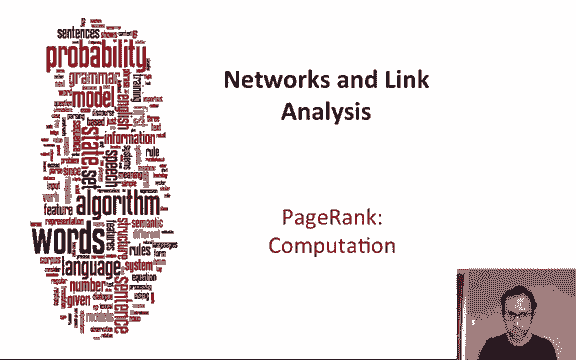
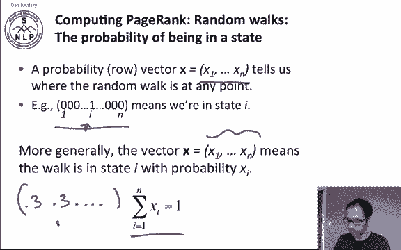
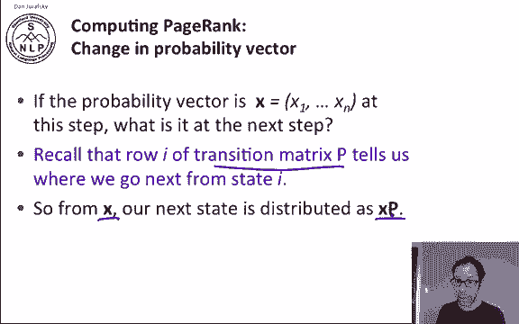
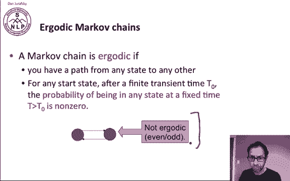
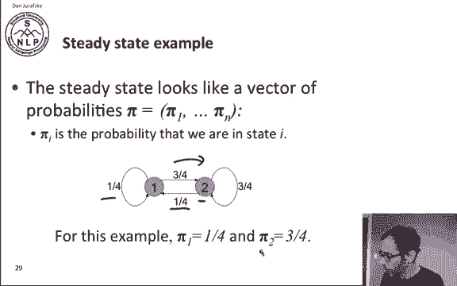
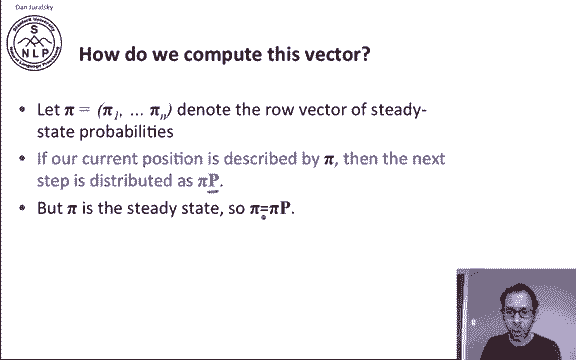
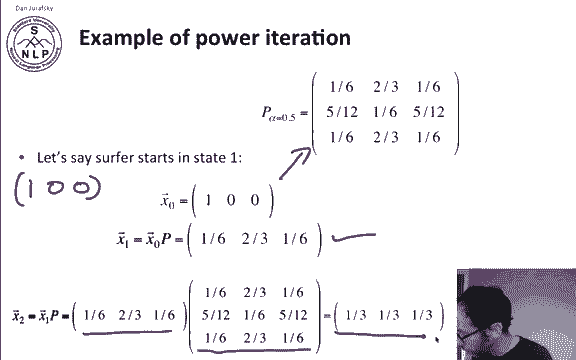
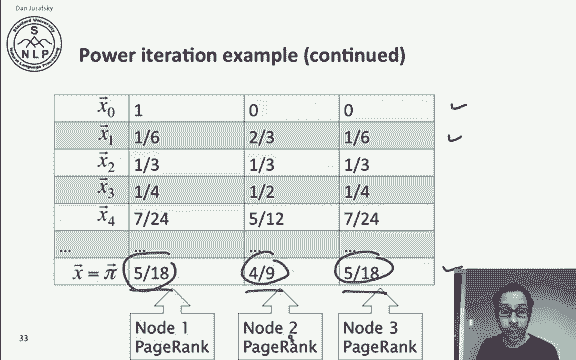
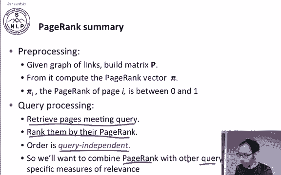
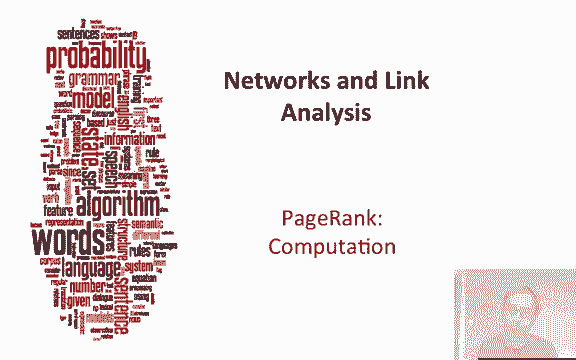

# 79：L13.3 - PageRank 计算方法 📊 



在本节课中，我们将学习如何计算 PageRank。PageRank 是衡量网页重要性的核心算法，其核心思想是通过模拟一个随机冲浪者在网络中的随机游走来评估每个网页的长期访问概率。

---

## 🧭 概率向量与随机游走

为了计算 PageRank，我们首先需要理解随机游走的含义。为此，我们引入一个概率向量。

概率向量是一个行向量 **X**，它描述了随机游走在任意时刻所处的位置。假设网络中有 **n** 个节点（或状态），向量 **X** 的每个元素 **xᵢ** 表示当前时刻处于状态 **i** 的概率。

一个简单的初始状态可以是：**X = [0, 0, ..., 1, ..., 0]**，其中只有位置 **i** 为 1，表示我们从状态 **i** 开始。更一般地，**X** 中的元素可以是任意概率值，但所有元素之和必须为 1，即 **∑ xᵢ = 1**。



---

## 🔄 状态转移与转移矩阵

上一节我们介绍了描述当前位置的概率向量。本节中，我们来看看如何计算下一步的位置。

转移矩阵 **P** 正是为此设计的。矩阵 **P** 的第 **i** 行描述了从状态 **i** 出发，下一步转移到各个状态的概率。



如果当前状态的概率分布是向量 **X**，那么下一步的状态分布就是 **X** 乘以转移矩阵 **P**，即：

**X_next = X · P**

这个公式告诉我们，通过一次矩阵乘法，就能得到随机游走下一步的概率分布。



---

## ⚖️ 马尔可夫链与稳态

并非所有随机游走都能收敛到一个稳定的状态分布。这里需要引入“遍历性”的概念。

一个马尔可夫链是**遍历的**，需要满足两个条件：
1.  从任何状态出发，都存在一条路径到达任何其他状态。
2.  从任何初始状态开始，经过一段有限的过渡时间 **T₀** 后，在任意固定时间 **T** 处于任意状态的概率都大于零。

如果一个网络不满足这些条件（例如，一个在奇偶时间步访问不同节点的网络），则不是遍历的。

对于遍历的马尔可夫链，存在一个唯一的长期访问率，即**稳态概率分布 π**。

**π = [π₁, π₂, ..., πₙ]**



其中，**πᵢ** 表示长期来看，随机游走处于状态 **i** 的概率。这个 **πᵢ** 正是状态 **i** 的 PageRank 值。重要的是，无论我们从哪里开始，最终都会收敛到这个稳态分布 **π**。

---

## 🧮 计算稳态分布：特征向量法

从直觉上理解了稳态分布后，我们来看看如何计算它。



我们有一个稳态概率行向量 **π**。根据定义，如果当前状态分布是 **π**，那么下一步的分布 **π · P** 应该仍然等于 **π**，因为稳态分布不会改变。

因此，我们得到关键方程：

**π = π · P**

这意味着，稳态分布 **π** 是转移概率矩阵 **P** 的**左特征向量**，对应的特征值为 **1**（转移概率矩阵的最大特征值总是 1）。因此，**π** 就是 **P** 的主左特征向量。

---

## ⚡ 计算方法：幂迭代法

理论上，我们可以通过求解特征向量方程得到 **π**。但在实践中，更常用的是**幂迭代法**。

由于稳态分布与初始状态无关，我们可以从任意概率分布 **X⁽⁰⁾** 开始（例如，从状态1开始：**[1, 0, 0, ...]**）。然后反复乘以转移矩阵 **P**：

**X⁽¹⁾ = X⁽⁰⁾ · P**
**X⁽²⁾ = X⁽¹⁾ · P = X⁽⁰⁾ · P²**
...
**X⁽ᵏ⁾ = X⁽⁰⁾ · Pᵏ**

当 **k** 足够大时，**X⁽ᵏ⁾** 将收敛于稳态分布 **π**。我们只需迭代计算，直到两次迭代的结果变化非常小为止。

以下是幂迭代法的一个计算示例：
假设我们有一个包含3个节点的小网络，其转移矩阵 **P**（已包含0.5的随机跳转概率）如下：



```
P = [[0.33, 0.33, 0.33],
     [0.25, 0.50, 0.25],
     [0.33, 0.33, 0.33]]
```

我们从状态1开始：**X⁽⁰⁾ = [1, 0, 0]**
-   第一次迭代：**X⁽¹⁾ = X⁽⁰⁾ · P = [0.33, 0.33, 0.33]**
-   第二次迭代：**X⁽²⁾ = X⁽¹⁾ · P = [0.30, 0.40, 0.30]**
-   ... 持续迭代 ...
-   最终收敛到：**π ≈ [0.278, 0.444, 0.278]** （即 5/18， 4/9， 5/18）



这个 **π** 向量就是三个节点的 PageRank 值。

---

## 📝 PageRank 算法流程总结

本节课中我们一起学习了 PageRank 的计算全过程，现在我们来总结一下：

1.  **预处理阶段**：
    *   获取网络的链接关系（邻接矩阵）。
    *   根据选定的随机跳转概率（如 0.15），构建完整的转移概率矩阵 **P**。
2.  **计算阶段**：
    *   使用幂迭代法等算法，计算转移矩阵 **P** 的主左特征向量 **π**。
    *   **π** 中的每个值 **πᵢ** 就是页面 **i** 的 PageRank 分数，它是一个介于 0 和 1 之间的数。
3.  **查询应用阶段**：
    *   当用户提交查询时，系统首先检索出所有匹配的页面。
    *   然后，**结合**这些页面的 PageRank 分数（衡量权威性）和其他查询相关度分数（如 TF-IDF、余弦相似度等），对结果进行综合排序。



需要注意的是，PageRank 是**与查询无关的**，它只反映网页链接结构的静态重要性。因此，在实际的搜索引擎排名中，PageRank 需要与那些能够理解查询内容的相关性度量方法结合使用，才能为用户提供最相关、最权威的结果。



PageRank 是评估网页重要性的一个基石性方法，也是将网络链接结构量化用于信息检索的关键创新。