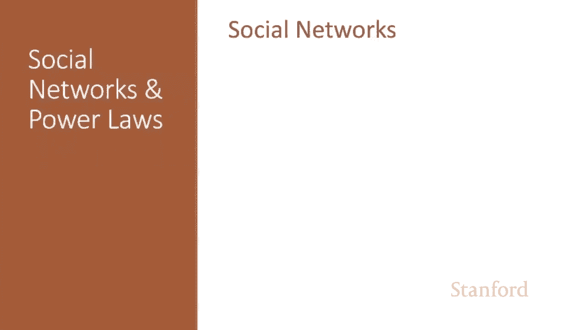
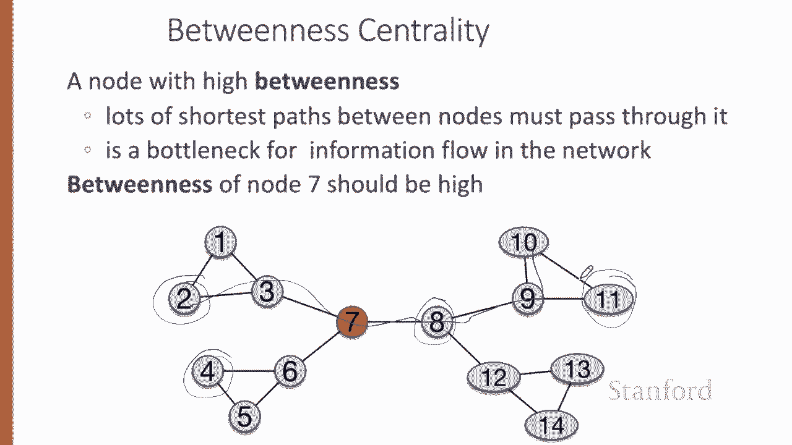
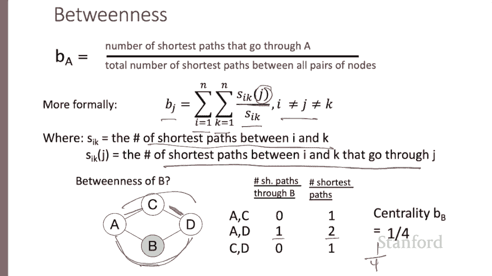
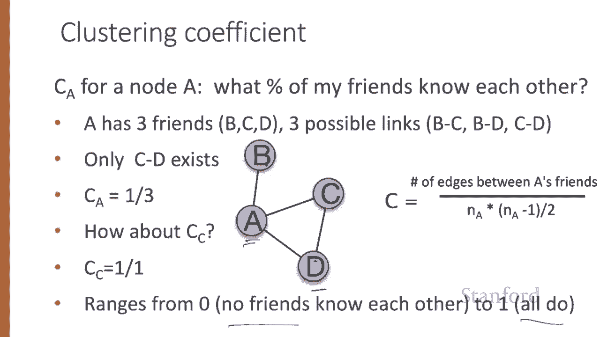

# 80：L14.1 - 社交网络基础 🕸️



在本节课中，我们将学习社交网络的一些基本属性和度量指标。我们会介绍什么是社交网络，以及如何用图论来抽象地表示它。接着，我们将探讨节点的几个核心度量指标：度、中介中心性和聚类系数。

***

## 什么是社交网络？🤔

“社交网络”一词通常指代连接人们的公司或应用程序。但在这里，我们指的是一个更抽象的概念，即用于研究一群人之间关系的图论隐喻。

在图论中，图的节点或顶点代表个人。人与人之间的各种具体关系则由节点之间的边或链接来表示。因此，由人和关系构成的整个系统就是网络或图，它包含了这些顶点和边。

例如，可以构建一个图，其中节点是演员，边是他们共同出演的电影。或者，节点是人，边是诸如兄弟或朋友这样的社会关系。但对于许多研究问题，我们可以抽象地只关注由四个节点和四条边构成的结构本身，例如节点1和2、2和3、1和3之间有链接，但节点3和4之间没有链接。

***

## 无向网络与有向网络 ↔️

上一节我们介绍了社交网络的基本概念，本节中我们来看看网络的两种基本类型。

网络可以是无向的，也可以是有向的。在无向网络中，节点之间的边是对称的。例如，Facebook上的好友关系、演员合作或Twitter上的对话关系。

然而，在有向网络中，边是不对称的，它们是具有特定方向的箭头。例如，在引文图中，节点是论文。如果论文2引用了论文1，那么边就从论文2指向论文1。在Twitter或Instagram上关注某人，也是一种有向关系。

***

## 节点的重要性度量 📊

我们已经了解了网络的类型，现在我们来学习衡量图中节点重要性的两种度量指标：度和中介中心性。我们还将介绍一个非常重要的概念——聚类系数。

### 节点的度

在无向图中，节点 `i` 的度是与该节点相连的边的数量。例如，在下图中，节点2有四条边与之相连，因此节点2的度为4。节点1和3都只有一条边，节点4和5则各有两条边。



```python
# 示例：计算节点2的度
# 假设图结构为邻接表
graph = {
    1: [2],
    2: [1, 3, 4, 5],
    3: [2],
    4: [2, 5],
    5: [2, 4]
}
degree_of_node_2 = len(graph[2])  # 结果为 4
```

在有向图中，我们可以分别度量节点的入度和出度。入度是指向该节点的边的数量，出度是该节点指向其他节点的边的数量。例如，在下图中，节点2和节点4的入度均为2。节点1和节点5的入度均为1。节点3的入度为0。

### 节点的中介中心性

另一种衡量节点中心性的指标是中介中心性。如果一个节点位于许多节点对之间的最短路径上，那么它的中介中心性就高。例如，在下图中，节点7的中介中心性很高，因为许多节点对（如节点2和节点11，或节点4和节点8）之间的最短路径都必须经过节点7。

节点 `A` 的中介中心性（我们也可以计算边 `AB` 的中介中心性）的计算公式是：经过 `A`（或边 `AB`）的最短路径数量，除以所有节点对之间存在的总最短路径数量。换句话说，在所有节点对之间的所有最短路径中，有多少条经过了指定的节点或边？

我们可以定义节点 `J` 的中介中心性 `b_J` 为：对所有非 `J` 的节点对 `(I, K)` 求和，计算经过 `J` 的最短路径数量占 `I` 和 `K` 之间总最短路径数量的比例。

让我们以计算下图中节点 `B` 的中介中心性为例：
*   对于节点对 `(A, C)`：`A` 和 `C` 之间只有一条最短路径，且不经过 `B`。比例为 0/1。
*   对于节点对 `(A, D)`：`A` 和 `D` 之间有两条长度相同的最短路径。其中一条经过节点 `B`。比例为 1/2。
*   对于节点对 `(C, D)`：`C` 和 `D` 之间只有一条最短路径，且不经过 `B`。比例为 0/1。
*   将所有比例相加：0 + 0.5 + 0 = 0.5。或者，从路径总数来看，在所有不包含 `B` 的节点对（共3对）产生的4条最短路径中，有1条经过 `B`，因此中介中心性为 1/4 = 0.25。

### 节点的聚类系数



最后，我们来介绍节点的一个非常重要的属性——聚类系数。节点的聚类系数衡量的是其邻居节点（即通过边与其相连的节点，可以非正式地称为“朋友”）之间的关系紧密程度。

节点 `A` 的聚类系数 `C_A` 衡量的是“我的朋友之间彼此也是朋友的比例”，即我的邻居节点之间也存在边的比例。

让我们计算下图中节点 `A` 的聚类系数：
*   `A` 有三个朋友：`B`、`C`、`D`。
*   在这些朋友之间，可能存在 `BC`、`BD`、`CD` 这三条边。
*   实际上，只有 `CD` 这条边存在。
*   因此，节点 `A` 的聚类系数是 1/3。

再来计算节点 `C` 的聚类系数：
*   `C` 有两个邻居：`A` 和 `D`。
*   在它们之间，可能存在 `AD` 这一条边。
*   实际上，这条边是存在的。
*   因此，节点 `C` 的聚类系数是 1/1 = 1。

聚类系数的取值范围从0（所有朋友互不认识）到1（所有朋友彼此都认识）。我们可以用以下公式来描述：

**C_A = (邻居节点间实际存在的边数) / (邻居节点间可能存在的最大边数)**

其中，如果 `n_A` 是节点 `A` 的邻居数量，那么这些邻居之间可能存在的最大边数为 `n_A * (n_A - 1) / 2`。聚类系数就是实际存在的边数占这个最大可能边数的百分比。

***



## 总结 📝

本节课中，我们一起学习了社交网络的基础知识。我们了解了社交网络在图论中的抽象表示，区分了无向网络和有向网络。更重要的是，我们深入探讨了衡量节点重要性的三个核心度量指标：**度**（衡量连接数量）、**中介中心性**（衡量在信息传播中的枢纽作用）以及**聚类系数**（衡量邻居群体的紧密程度）。这些指标是分析和理解社交网络结构的基础工具。