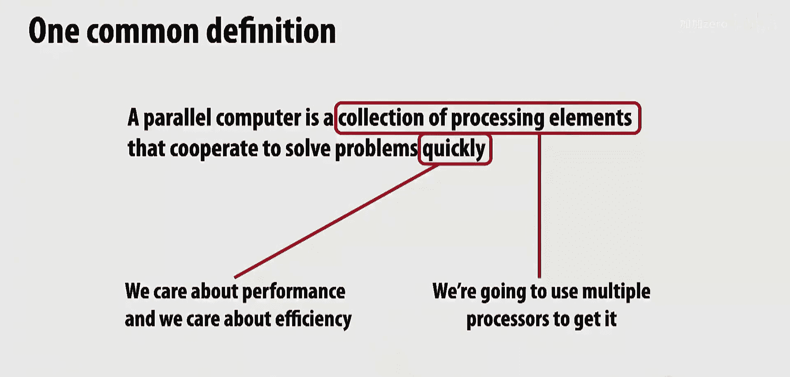
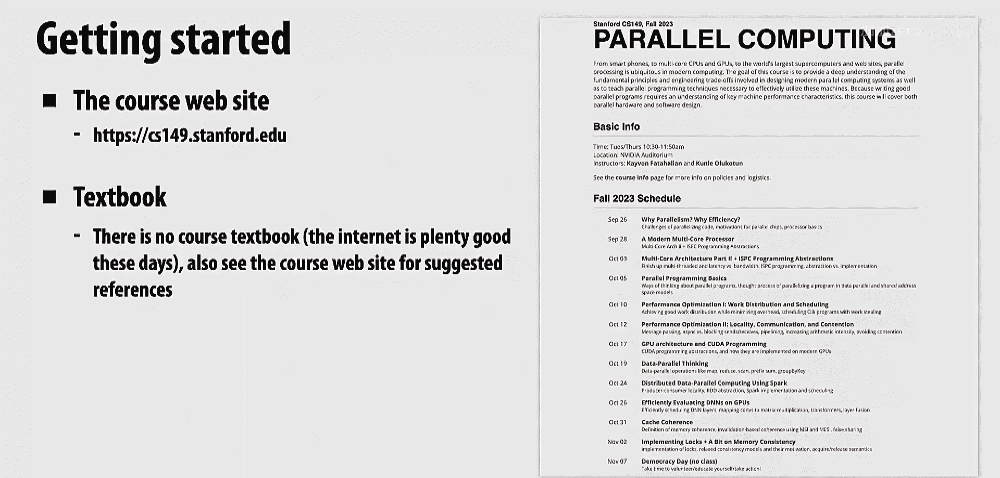
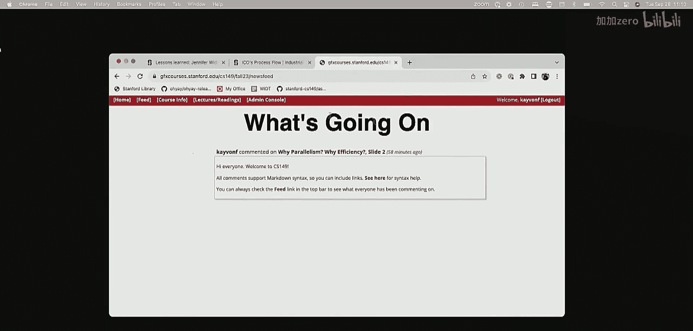
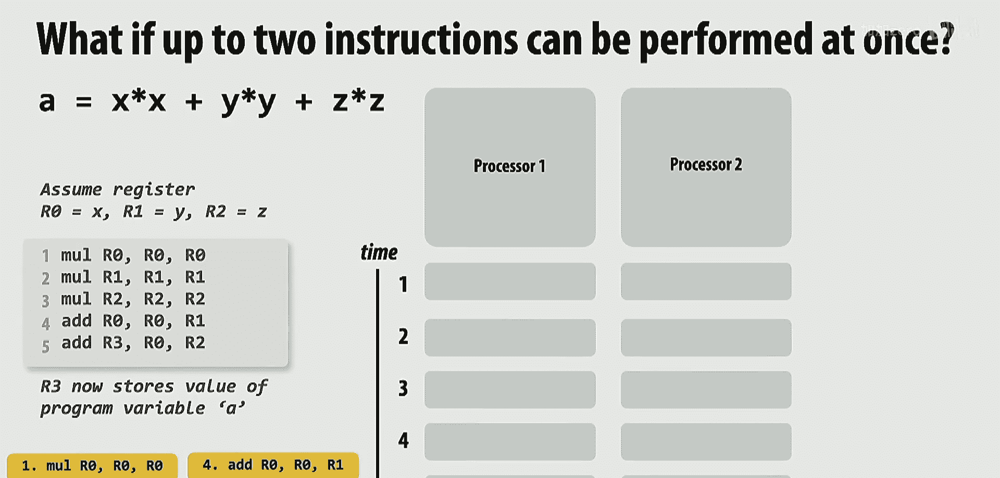
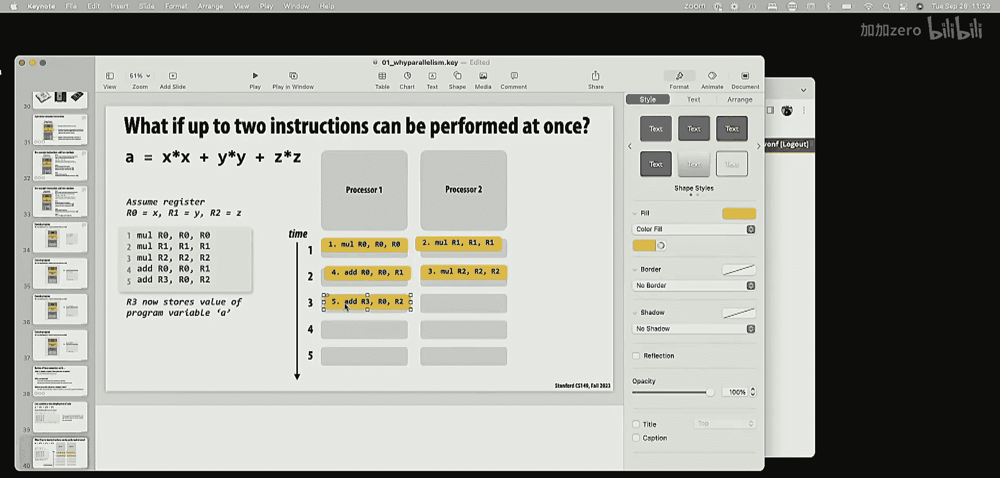
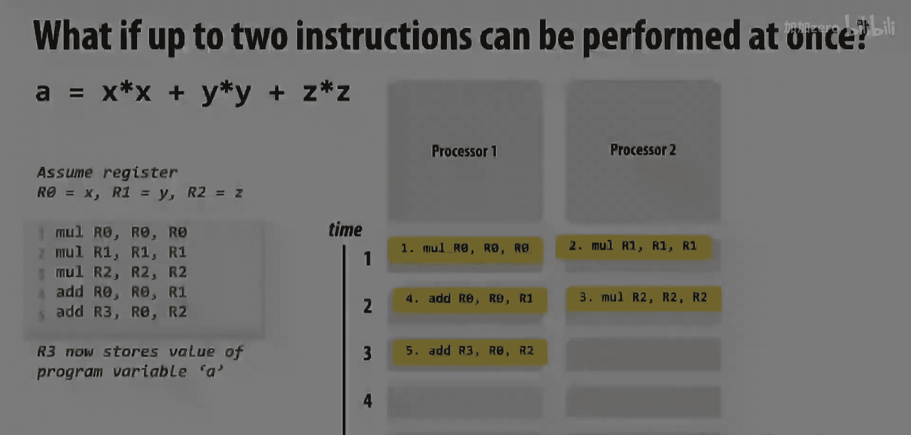
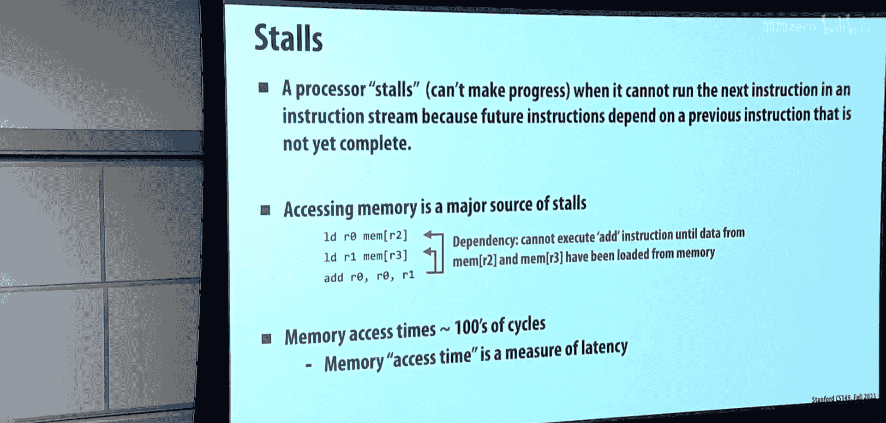
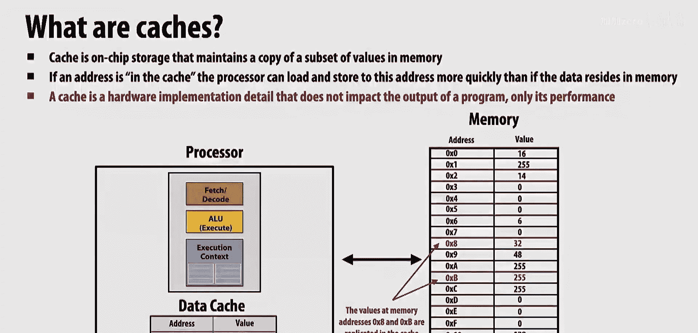
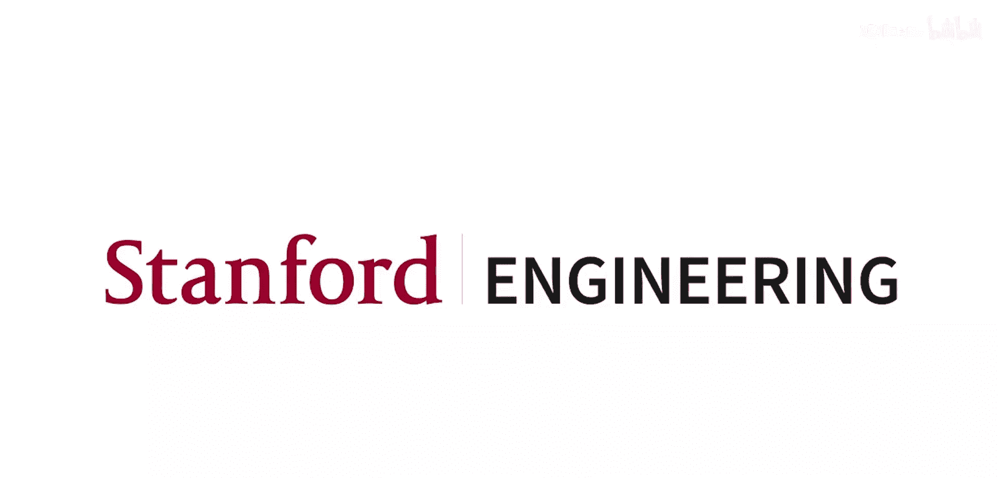

# 001：为什么需要并行？为什么需要效率？

## 概述
在本节课中，我们将探讨并行计算的核心动机：为什么我们需要并行处理，以及为什么效率与并行性同等重要。我们将通过互动演示来理解并行化的挑战，并介绍计算机程序、处理器和内存的基本概念。

## 课程内容

### 欢迎与课程介绍
欢迎来到CS149课程。我是Cavon，另一位讲师是Kunle。Cavon主要负责软件相关的讲座，而Kunle作为硬件专家，将在课程后半部分深入讲解硬件工作原理。本课程旨在为来自硬件架构、软件编程、机器学习和图形学等不同背景的学生提供支持。

### 互动演示：并行化的挑战
为了直观理解并行计算，我们进行了一个课堂活动：计算一系列数字的总和。

首先，一位同学（Tina）被要求顺序相加16个数字，耗时约40秒。

接下来，我们尝试使用两位同学并行计算。尽管资源翻倍，但总耗时约为41.7秒，几乎没有提升。原因在于**通信开销**：一位同学完成计算后，需要将部分和传递给另一位同学进行最终求和，这个传递过程消耗了大量时间。

然后，我们尝试使用四位同学。他们采用了“工作池”策略：将所有数字卡片放入一个公共池，每位同学从中取出一张进行计算，最后汇总部分和。这次耗时约19秒。分析发现，前12秒四位同学并行完成了所有计算，但随后花费了7秒来汇总部分和。这再次凸显了**负载均衡**和**最终同步**的开销。

最后，我们挑战用全班约160人来统计总人数。大家提出了多种策略（如按行计数、分组计数等），但实际执行时，**数据移动**和**协调同步**的复杂性使得整个过程远慢于预期。这个练习表明，即使有大量并行资源，通信和同步的成本也可能抵消并行带来的收益。

### 并行与效率的核心主题
本课程不仅关注并行性，更强调**效率**。有时，一个高效的串行算法可能优于一个通信开销巨大的并行算法。

例如，在工作中，如果你使用10核处理器仅将程序加速2倍，这未必是坏事。如果这2倍的加速显著提升了用户体验（如网站响应速度或游戏帧率），或者抵消了使用更多硬件的成本，那么它就是有价值的。硬件设计师同样关注效率，他们希望在满足性能目标的前提下，使用最少的硬件以控制成本。

### 计算机程序与处理器基础
为了理解如何实现效率和并行，我们需要回顾一些基础知识。

**什么是计算机程序？**
从计算机的视角看，程序就是一个**指令序列**。这些指令最终会被编译或解释为处理器能够执行的基本命令。

**处理器是做什么的？**
处理器**执行指令**。执行一条指令意味着：
1.  **执行运算**（如算术操作）。
2.  **改变状态**：更新处理器寄存器或内存中的值。

我们可以用一个简化的模型来理解处理器：它包含**控制单元**（决定执行哪条指令）、**执行单元**（执行算术运算）和**执行上下文**（寄存器和内存的状态）。

### 性能提升的历史与挑战
过去，处理器性能的提升主要依靠两种技术：
1.  **增加时钟频率**：让处理器每秒执行更多指令。
2.  **指令级并行（ILP）**：通过超标量、乱序执行等技术，在单个处理器内自动发现并并行执行多条不存在数据依赖的指令，而程序员无需修改代码。

然而，这两种方式都遇到了瓶颈：
*   **频率墙**：提升频率会导致功耗呈平方级增长，产生难以解决的热量问题。
*   **ILP墙**：研究表明，典型程序中可自动提取的并行度有限，通常只能有效利用3-4个执行单元，增加更多单元收益甚微。

### 现代解决方案：显式并行与异构计算
由于无法通过提升频率或自动提取更多ILP来获得性能增长，唯一的出路是要求**程序员显式地编写并行程序**，以利用多核处理器。

现代设备，从手机到超级计算机，都包含多个处理核心（CPU和GPU）。例如，NVIDIA RTX 4090 GPU拥有超过1.8万个浮点运算单元。要充分利用这些硬件，必须编写并行代码。

此外，为了追求极致效率，**异构计算**和**专用处理器**成为趋势。例如，手机SoC中除了通用CPU核心，还集成了用于图像处理、神经网络推理等任务的专用硬件单元。谷歌的TPU、各大公司的AI加速器都是这一方向的体现。

### 内存层次结构：效率的关键
在并行计算中，**数据移动**往往是最大的瓶颈。这引出了对内存系统的理解。

**什么是内存？**
内存提供了一个抽象：一个按地址访问的字节数组。处理器可以通过加载（load）和存储（store）指令与内存交互。

**内存的挑战：延迟**
访问内存（尤其是DRAM）可能需要数百个处理器周期，速度很慢。如果一条指令需要等待从内存中加载数据，处理器将会空转。

**解决方案：缓存**
为了减少访问延迟，处理器内部设置了**缓存**。缓存是一小块高速存储，保存着最近使用过的内存数据副本。其设计基于**局部性原理**：
*   **时间局部性**：最近被访问的数据很可能再次被访问。
*   **空间局部性**：访问一个数据时，其相邻的数据也很可能被访问。

当处理器需要数据时，它首先检查缓存。如果数据在缓存中（命中），则访问速度极快；如果不在（缺失），则需从更慢的主存中加载，并通常会载入一个连续的数据块（缓存行）。

缓存形成了层次结构（L1、L2、L3等），离处理器越近，容量越小、速度越快。管理好数据在缓存中的位置，对于编写高效程序至关重要。

## 总结
本节课我们一起学习了：
1.  **并行化的动机与挑战**：通过课堂活动，我们亲身体验了通信、同步和负载均衡如何影响并行程序的性能。
2.  **效率的重要性**：并行不是目的，提升效率才是。有时串行算法或适度的并行加速更具实际价值。
3.  **程序与处理器的基础**：程序是指令序列，处理器通过执行指令、改变状态来运行程序。
4.  **性能提升的历史瓶颈**：时钟频率和指令级并行（ILP）的提升已面临物理和理论限制。
5.  **现代并行计算路径**：必须依靠程序员编写显式并行代码来利用多核/众核处理器，并趋向于采用异构和专用计算单元以提高效率。
6.  **内存层次结构的核心地位**：数据移动的成本巨大，理解缓存及其局部性原理是优化程序性能的关键。

在接下来的课程中，我们将深入探讨如何编写并行程序，如何理解硬件以提升效率，以及如何驾驭复杂的内存系统。