# 003：多核架构第二部分 + ISPC 编程抽象


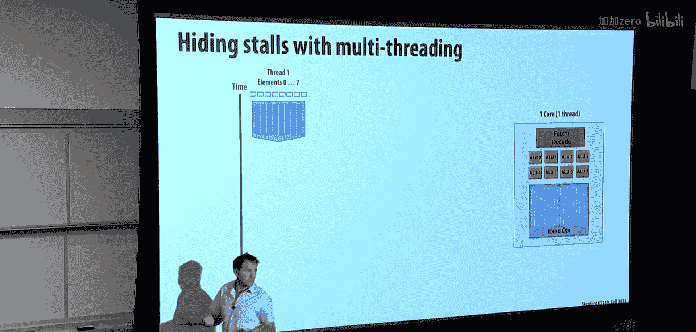

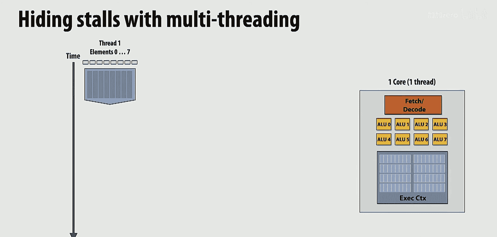


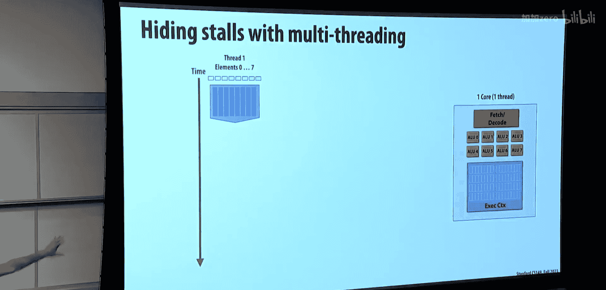


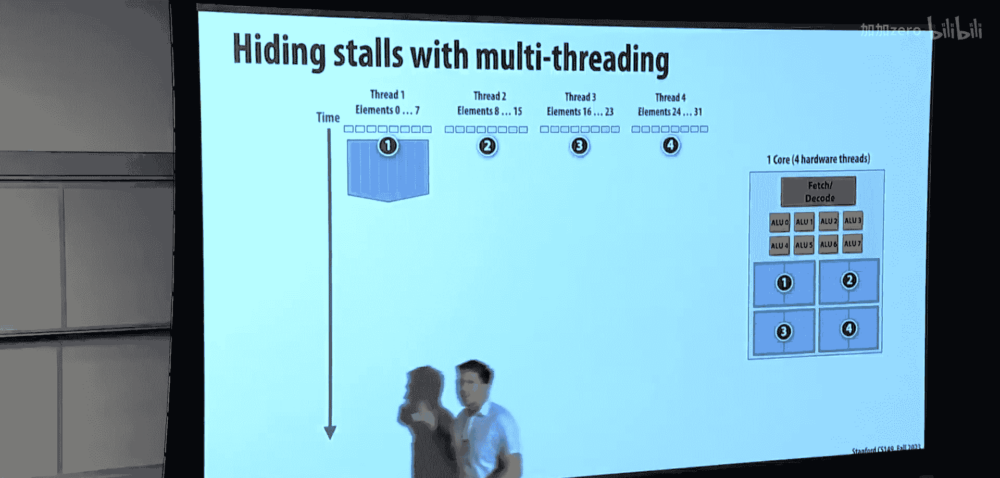

在本节课中，我们将深入学习硬件多线程的核心概念，并探讨如何通过ISPC编程语言来应用这些并行计算思想。我们将从回顾上一讲的关键概念开始，然后深入理解内存带宽与延迟的区别，最后通过ISPC的编程模型来具体实践这些理论。

## 硬件多线程回顾

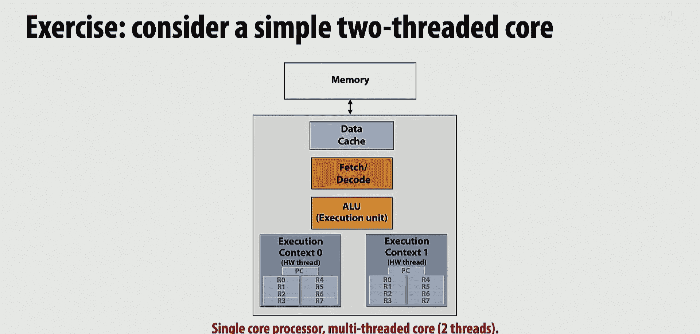

上一节我们介绍了多核执行和SIMD执行。本节中，我们来看看如何通过硬件多线程更有效地利用处理器资源。


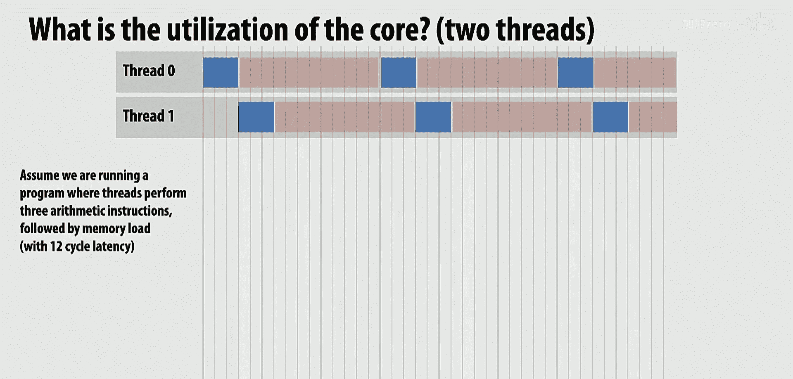

核心思想是：**当处理器因等待某项操作（如内存访问）而无法继续执行当前指令流时，它不应该空闲等待，而是切换到另一个就绪的指令流去执行工作**。这就像在办公室答疑时，当一个学生需要时间去思考时，教授不会干等，而是去帮助队列中的下一个学生。


### 多线程执行模型

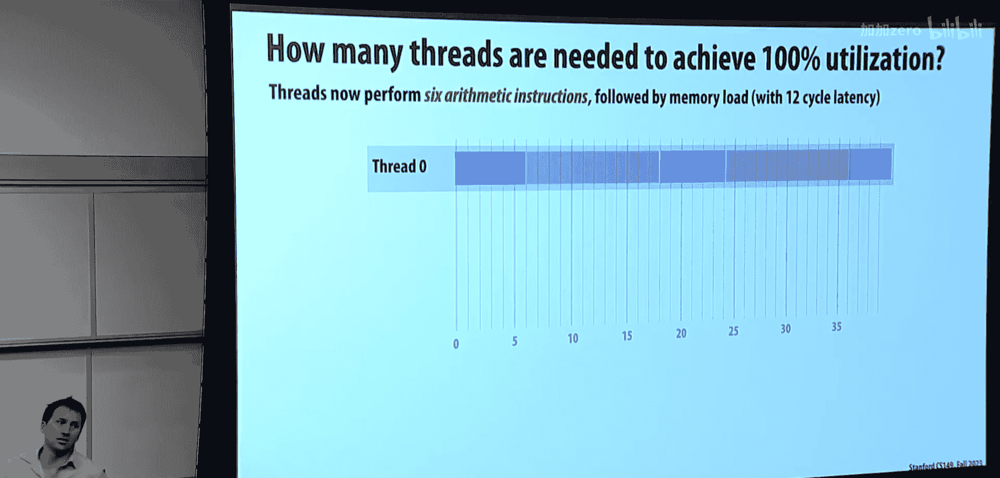

考虑一个简单的处理器核心，它每个时钟周期只能执行一条标量指令。我们为其添加管理多个线程状态（如程序计数器和寄存器）的能力。虽然它一次仍只执行一个线程的一条指令，但当该线程因内存访问等原因停滞时，硬件可以立即切换到另一个就绪线程的指令。

**公式**：假设一个程序模式为：执行 **M** 个算术指令，然后发生一次停滞 **L** 个周期。
*   单线程时，处理器利用率 = **M / (M + L)**。
*   要隐藏停滞，达到100%利用率，所需线程数 ≈ **(M + L) / M**。

因此，程序中计算与内存访问的比率，决定了有效隐藏延迟所需的最小线程数量。硬件多线程并未提高处理器的峰值吞吐量，而是提高了其资源利用率。

## 带宽与延迟：系统的吞吐瓶颈

理解了如何通过多线程隐藏延迟后，我们需要认识现代计算中另一个更根本的约束：**内存带宽**。

### 高速公路类比

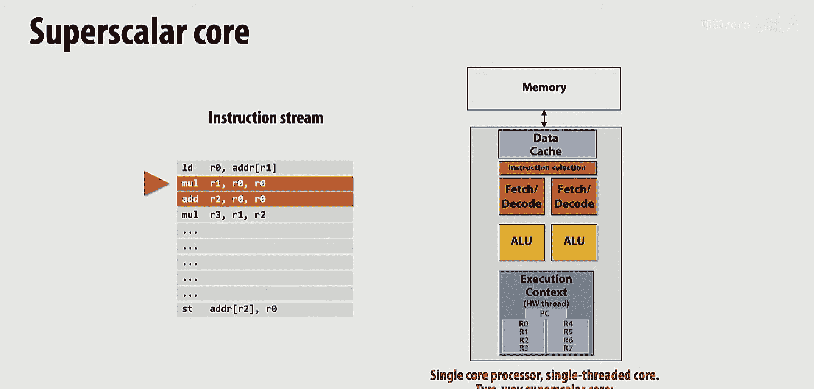

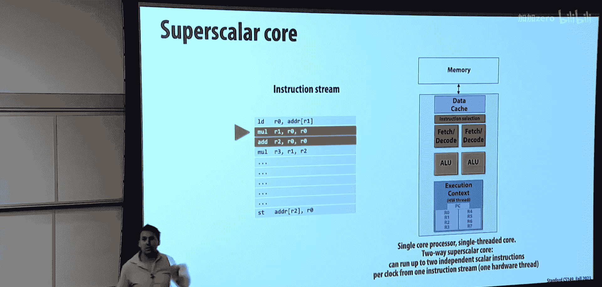

考虑从旧金山开车到斯坦福（距离50公里）。
*   **延迟**：以100公里/小时的速度，单程需要0.5小时。
*   **带宽（吞吐量）**：如果规定高速公路上同时只能有一辆车，那么吞吐量是2辆车/小时。
提高吞吐量的方法有：
1.  **提高速度（降低延迟）**：车速提高到200公里/小时，延迟降至0.25小时，吞吐量升至4辆车/小时。
2.  **增加车道（增加带宽）**：保持100公里/小时，但增加为4车道，吞吐量升至8辆车/小时。
3.  **提高道路使用效率（流水线）**：保持单车道和100公里/小时，但允许车辆以1公里间距行驶，形成“流水线”，吞吐量可大幅提升。

在计算机中，**延迟**是完成一次操作所需的时间（如从内存读取数据），而**带宽**是单位时间内可以完成的操作数量（如每秒可从内存传输的字节数）。

### 计算与带宽的失衡

现代处理器（尤其是GPU）拥有极其强大的计算单元。例如，一个拥有5000个ALU的GPU，在1.6GHz频率下，理论峰值算力约为 **8万亿次操作/秒**。假设每个操作需要读取2个操作数和写入1个结果（共12字节），那么需要 **~100 TB/s** 的内存带宽来“喂饱”这些ALU。

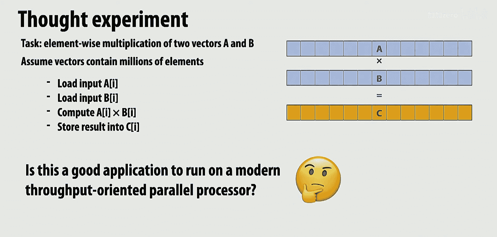


然而，即便是最先进的内存系统，其带宽也仅在 **~1 TB/s** 量级。这导致了严重的失衡：计算管道的“吞吐能力”远高于数据供给管道的“带宽能力”。

**结论**：对于像 `C[i] = A[i] + B[i]` 这样简单的数组相加操作（计算与内存访问比为1:12），它在现代处理器上的运行效率会极低（约1%），因为它完全受限于内存带宽，而非计算能力。缓存对此类“流式访问”且无数据重用的程序帮助有限。提升性能的关键在于优化算法，提高**每字节内存访问所执行的计算操作数**。

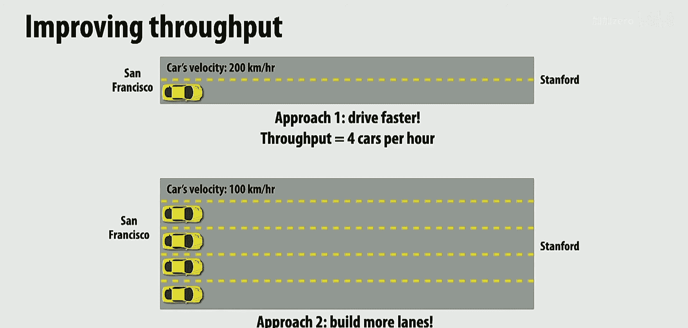

## ISPC 编程模型实践


为了将上述并行概念应用于实际编程，我们引入ISPC（Intel SPMD Program Compiler）语言。它提供了一个清晰的抽象，帮助我们思考并行执行。


### ISPC 核心概念：程序实例组

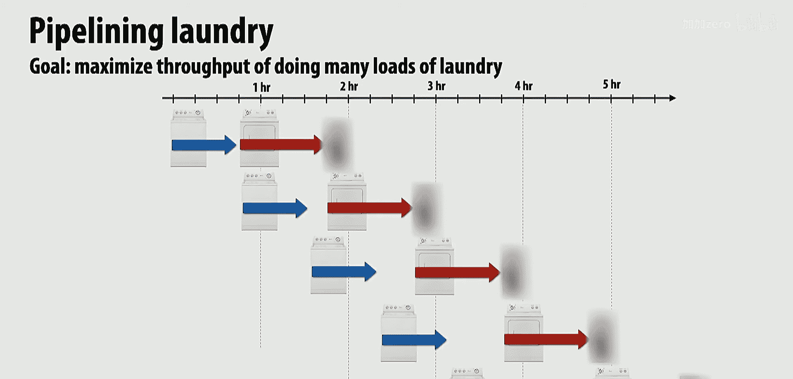

ISPC 采用 **SPMD（单程序多数据）** 模型。当一个ISPC函数从C代码中被调用时，它会启动一个包含多个 **程序实例** 的“组”。每个实例独立执行相同的函数代码，但拥有自己的局部变量和唯一的 `programIndex`。

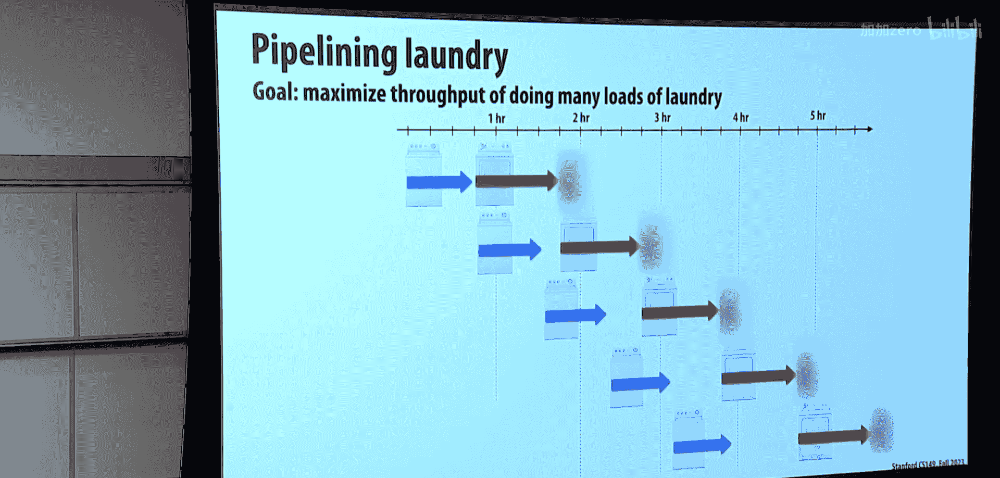

**代码**：基本的ISPC函数结构
```c
// ISPC 函数
export void sine_ispc(uniform float* x, uniform float* result, uniform int n) {
    // 每个程序实例都会执行这个循环
    for (uniform int i = programIndex; i < n; i += programCount) {
        result[i] = sin(x[i]);
    }
}
```
*   `programCount`: 当前组中程序实例的总数。
*   `programIndex`: 当前实例在组中的索引（0 到 `programCount-1`）。

在上面的例子中，每个程序实例以“交错”的方式处理数组元素：实例0处理元素0, 8, 16...；实例1处理元素1, 9, 17...，以此类推。所有实例协作完成整个数组的计算。

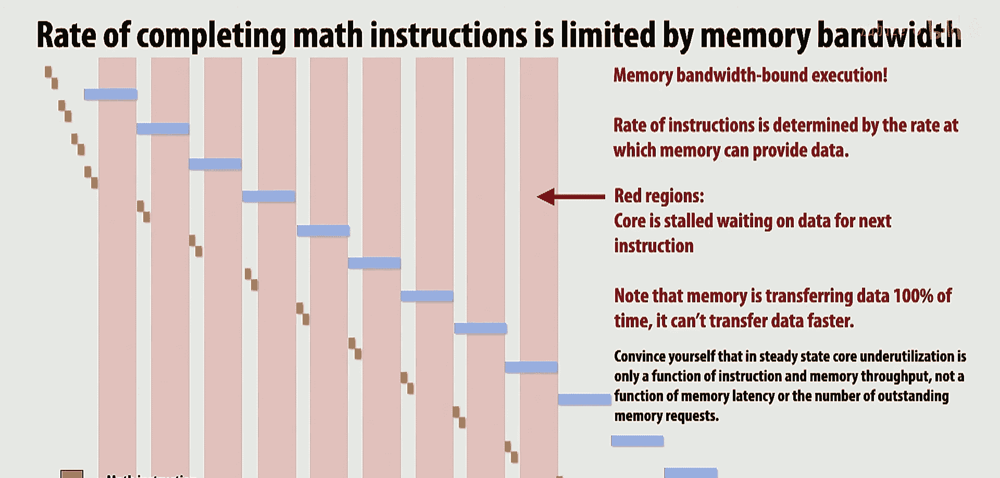


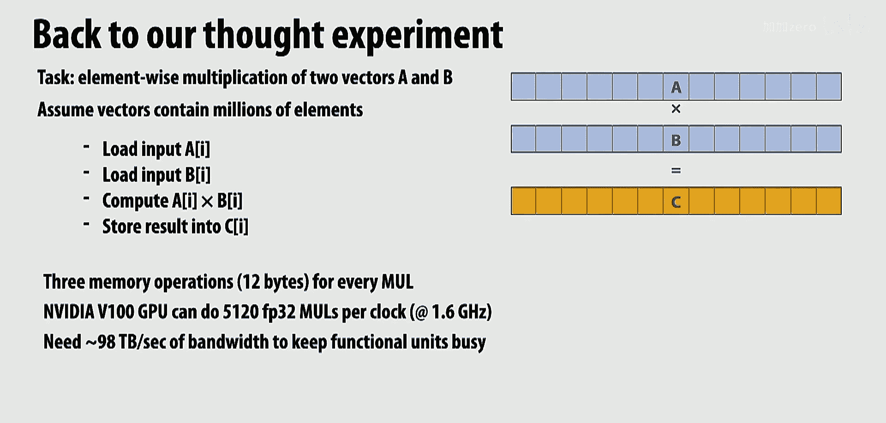


### `foreach` 循环：委托任务分配

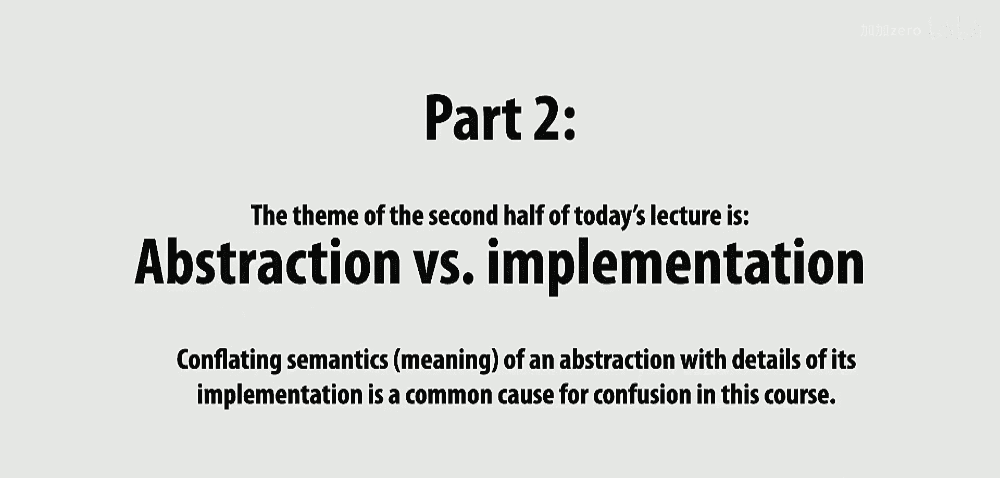

手动通过 `programIndex` 和 `programCount` 来划分工作是一种方式。ISPC 提供了更高级的 `foreach` 循环抽象，程序员只需声明循环迭代是独立的，系统会自动将迭代分配给各个程序实例执行。


**代码**：使用 `foreach` 循环
```c
export void sine_ispc_foreach(uniform float* x, uniform float* result, uniform int n) {
    // 系统自动将迭代 i 分配给某个程序实例执行
    foreach (i = 0 ... n) {
        result[i] = sin(x[i]);
    }
}
```
`foreach` 的语义是：确保所有迭代最终都被执行完毕，但系统可以自由决定执行顺序和分配方式。这为编译器优化和运行时调度提供了灵活性。

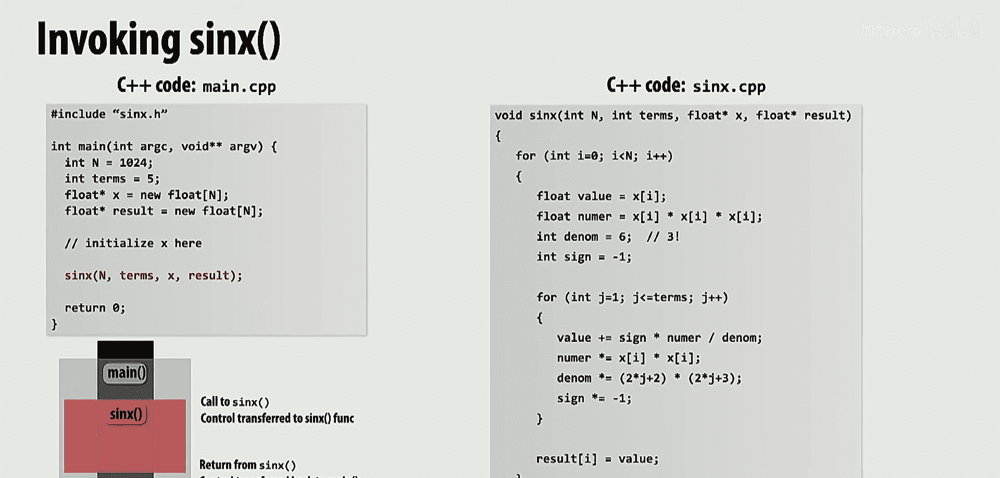

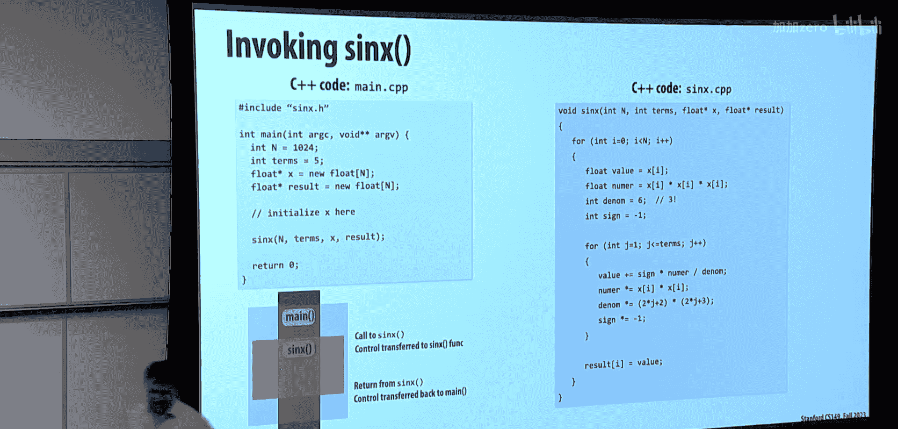


以下是 `foreach` 语义的一些有效实现方式：
*   **交错分配**：实例0: i=0,4,8...；实例1: i=1,5,9...
*   **块状分配**：实例0: i=0,1,2,3；实例1: i=4,5,6,7...
*   **动态分配**：实例在完成当前迭代后，从共享任务池中获取下一个迭代。

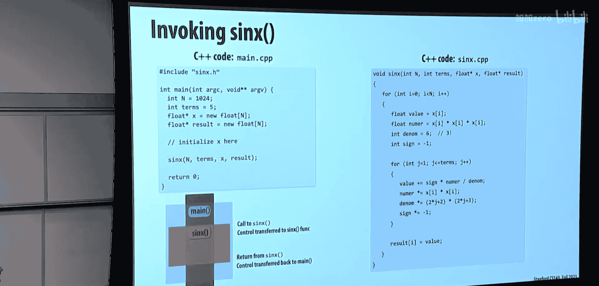

关键在于，无论系统选择哪种实现方式，只要保证了每个迭代都被执行一次，程序的最终结果就是正确的。这清晰地区分了 **程序语义（做什么）** 和 **执行策略（如何做）**。

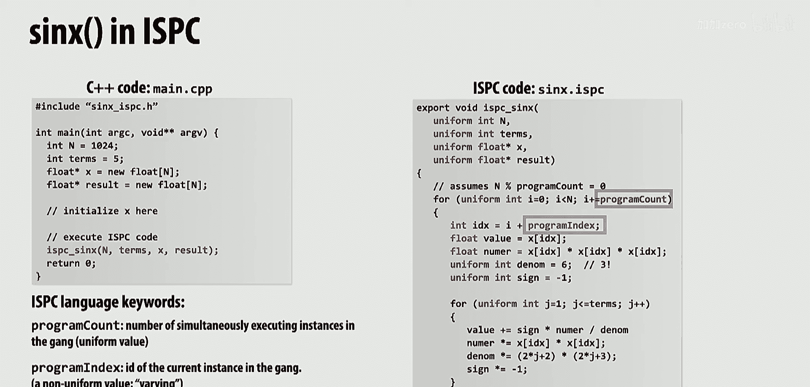

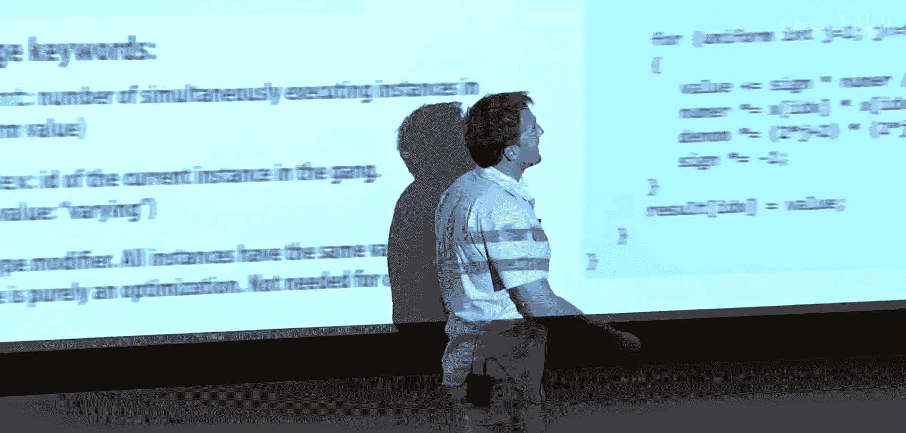

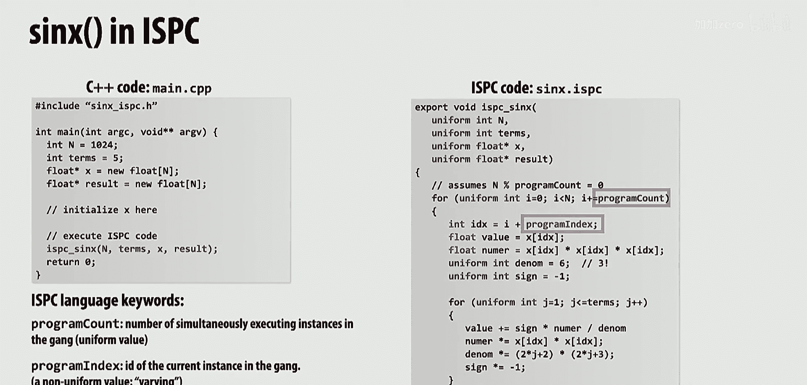

## 总结

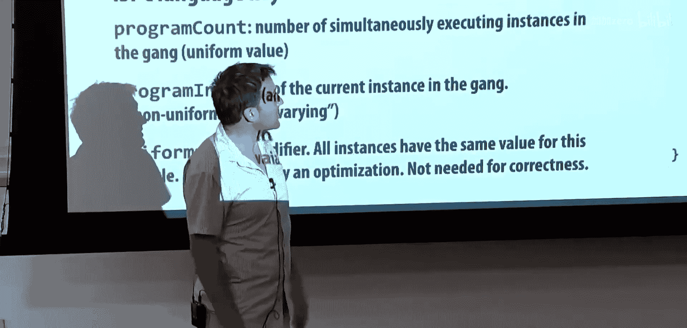

本节课中我们一起学习了：
1.  **硬件多线程** 通过在线程间快速切换来隐藏操作延迟（如内存访问），从而提高处理器单元的利用率，但并未增加其峰值性能。
2.  **内存带宽** 是现代并行计算的关键瓶颈。许多简单操作受限于数据从内存传输到计算单元的速度，而非计算本身。算法设计需要关注计算与内存访问的比率。
3.  **ISPC编程模型** 通过SPMD模型和清晰的程序实例抽象，帮助我们编写并行代码。`foreach` 结构进一步将工作分配的逻辑委托给系统，允许编译器进行多种有效的并行化实现。


理解这些概念——延迟隐藏、带宽限制以及并行抽象——是设计和优化高效并行程序的基础。