# 004：并行编程基础


## 概述
在本节课中，我们将要学习并行编程的基础概念，特别是通过ISPC编程模型来理解如何将工作分解、分配给多个执行单元，并协调它们以正确、高效地完成任务。我们将从理解程序语义开始，逐步深入到实现细节和性能考量。

## 理解ISPC程序语义

上一节我们介绍了并行计算的基本思想，本节中我们来看看ISPC编程模型的具体语义。

ISPC函数与普通C函数不同。调用一个ISPC函数意味着创建多个（由`gang size`定义）该函数的副本并运行它们。每个副本被称为一个**程序实例**，它们都执行相同的指令序列，但每个实例拥有一个不同的`programIndex`值，用于区分各自的工作。

例如，对于一个`gang size`为8的ISPC函数调用，会创建8个程序实例。从语义上讲，这等同于用一个`for`循环顺序执行该函数8次，每次循环设置不同的`programIndex`值。此时我们尚未讨论任何具体的并行实现。

**核心概念**：ISPC函数调用创建多个程序实例。
```c
// 语义上等同于：
for (int i = 0; i < programCount; i++) {
    programIndex = i;
    // 执行函数体
}
```

## 工作映射与`foreach`结构

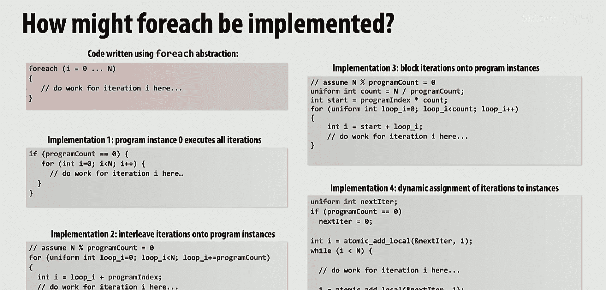

理解了程序实例的概念后，我们需要考虑如何将总工作量分配给这些实例。程序员可以显式地编写代码来映射工作，也可以使用更高级的抽象。

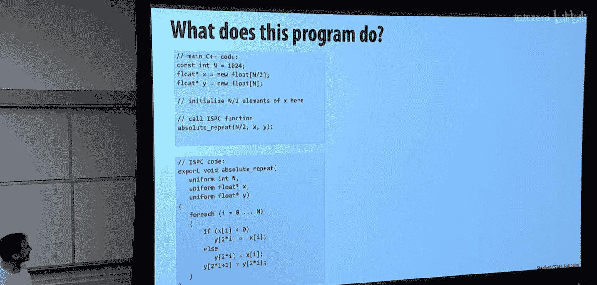

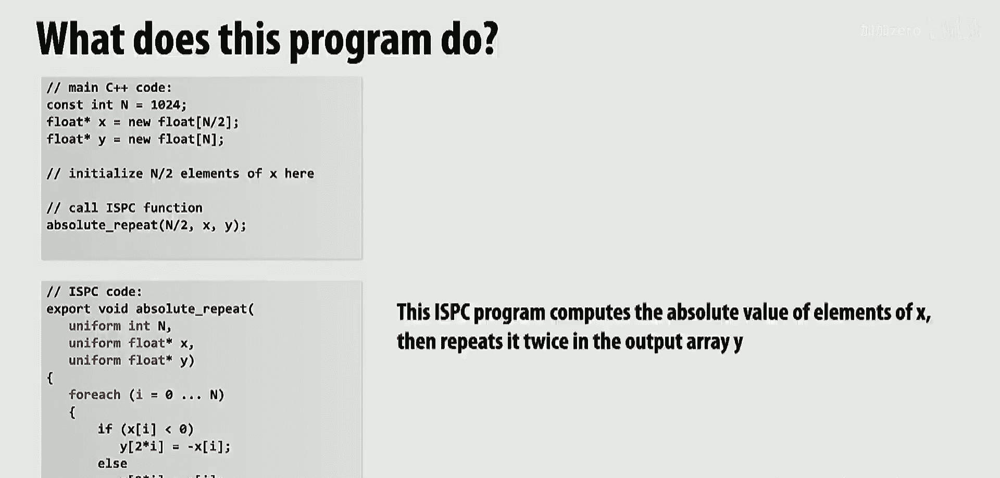

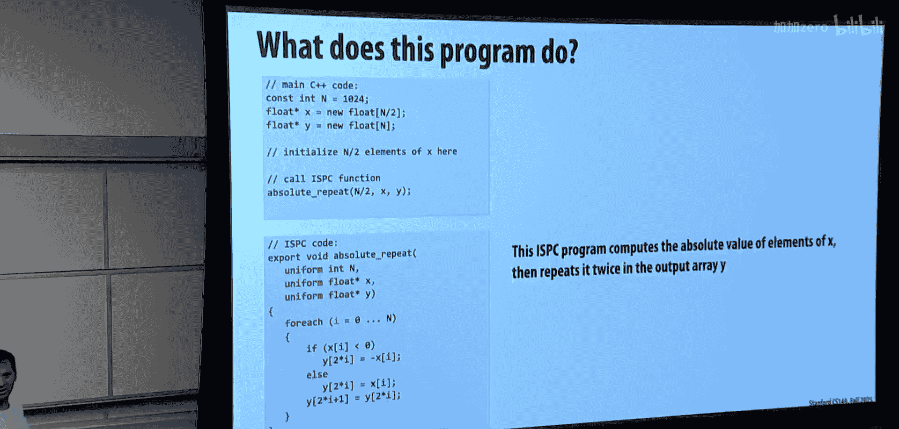

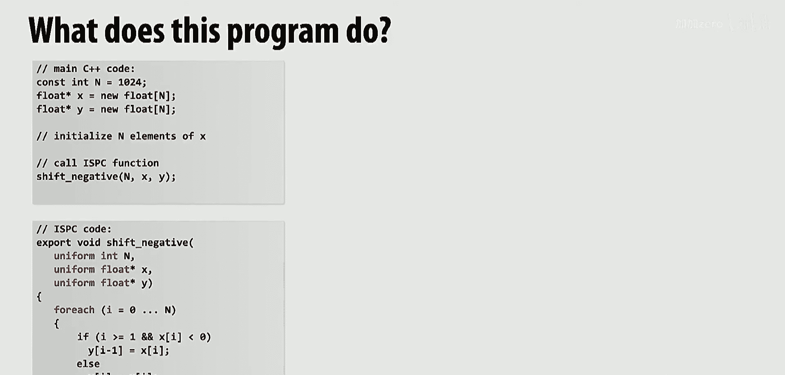

以下是两种常见的工作分配模式：
*   **交错映射**：在循环的每次迭代中，所有程序实例处理内存中连续的数据块。这有利于利用缓存局部性。
*   **分块映射**：每个程序实例负责处理数据中连续的一大块。在某些需要减少实例间通信的场景下可能更优。

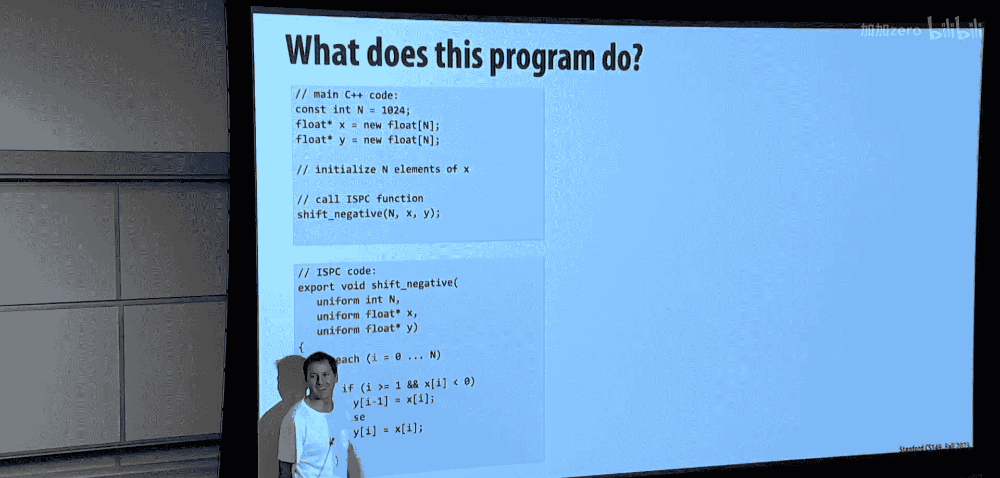

ISPC提供了`foreach`结构，这是一种更高级的抽象。使用`foreach`时，程序员只需声明需要并行执行的总迭代次数，而将具体的实例到迭代的映射工作交给ISPC编译器决定。编译器通常会选择高效的映射策略（如交错映射以优化内存访问）。

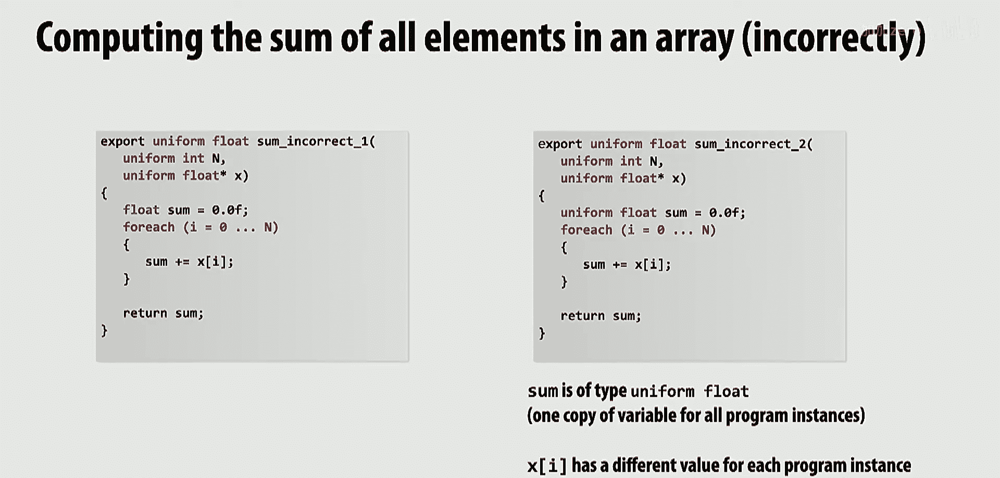

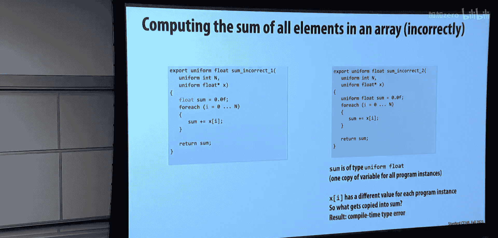

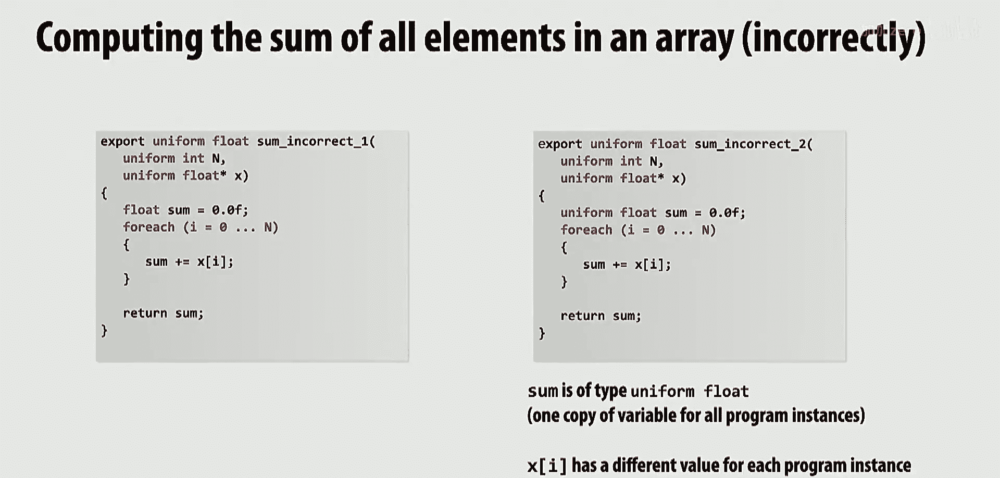

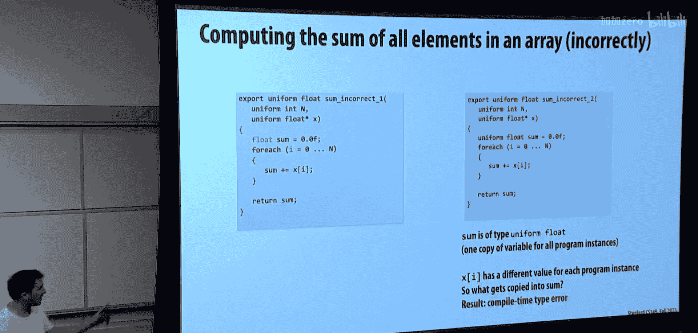

**核心概念**：`foreach`将迭代分配到程序实例，具体策略由编译器决定。
```c
foreach (i = 0 ... n) {
    // 并行处理第 i 个元素
}
```


## 数据竞争与正确的并行模式

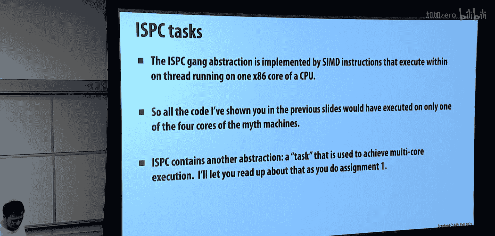

当我们把工作分配给多个并行执行单元时，必须注意它们对共享数据的访问。不正确的访问会导致**数据竞争**，产生未定义的结果。

考虑以下有问题的ISPC程序，它试图计算数组所有元素的和：
```c
uniform float sum = 0; // uniform 变量在所有实例间共享
foreach (i = 0 ... n) {
    sum += values[i]; // 错误！多个实例同时写入 sum，发生数据竞争
}
```
这个程序是错误的，因为多个程序实例可能同时读取和更新`sum`变量，导致更新丢失。

正确的做法是让每个程序实例先计算局部和，然后再安全地合并这些局部和。ISPC提供了跨实例操作符（如`reduce_add`）来完成安全的归约操作。

**核心概念**：避免对共享变量进行非同步的读写操作。使用局部变量和归约操作。
```c
float partial = 0; // 每个实例有自己的 partial
foreach (i = 0 ... n) {
    partial += values[i];
}
// 安全地将所有实例的 partial 值相加
uniform float sum = reduce_add(partial);
```

## 任务与线程池

`foreach`处理的是在一个线程内（通过向量指令）的并行。ISPC的`task`概念则用于在多个CPU线程（即多核）间分配工作。创建大量细粒度任务时，为每个任务创建一个操作系统线程是极其低效的，因为线程创建和上下文切换开销巨大。

高效的实现会使用**线程池**：预先创建与机器核心数相匹配的若干工作线程。当有任务需要执行时，将这些任务分配给线程池中空闲的线程。这避免了频繁的线程生命周期管理开销。

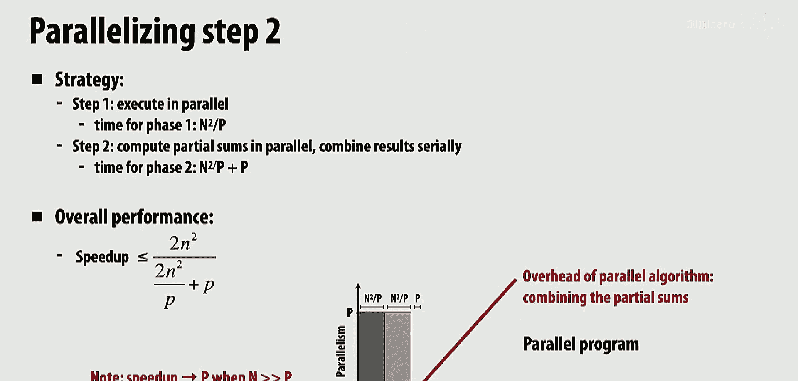

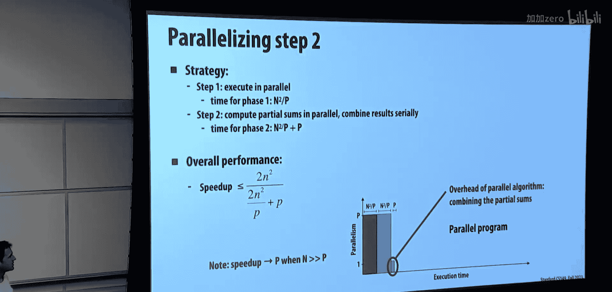

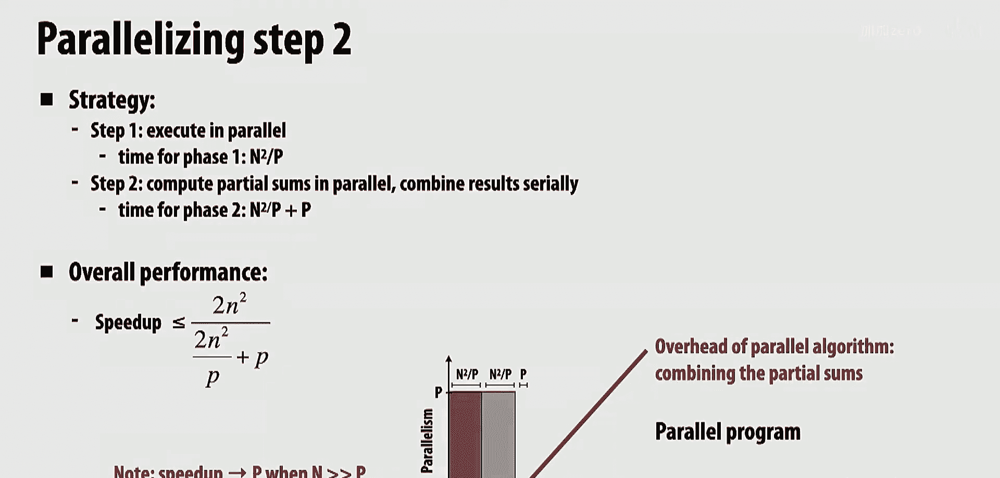

**核心概念**：使用线程池管理任务，而非为每个任务创建新线程。
```
线程池 (例如 8 个线程)
    |
    |-- 分配任务
    |-- 分配任务
    |-- ...
```

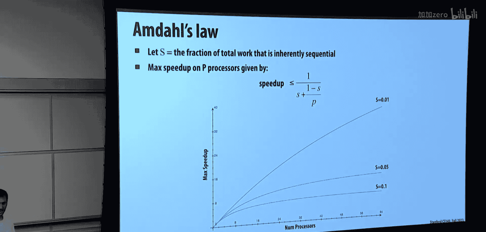

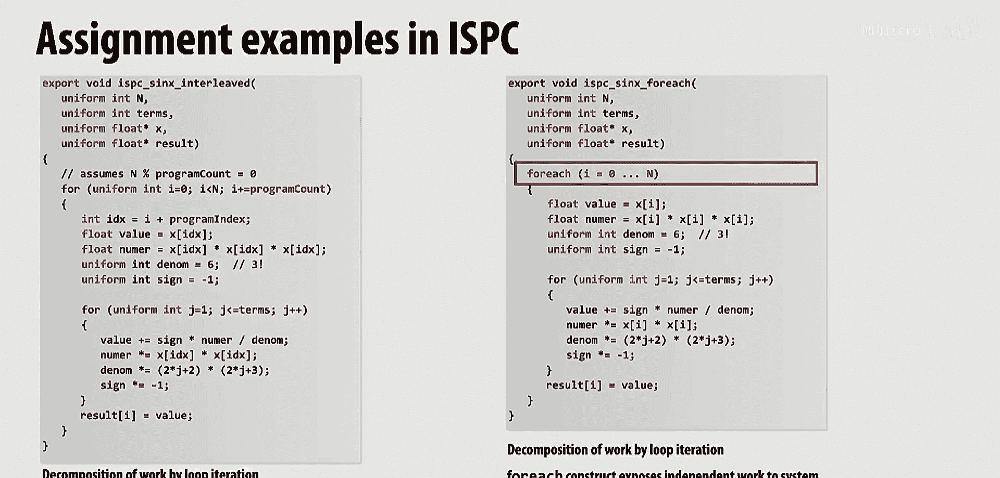

## 并行化策略与阿姆达尔定律

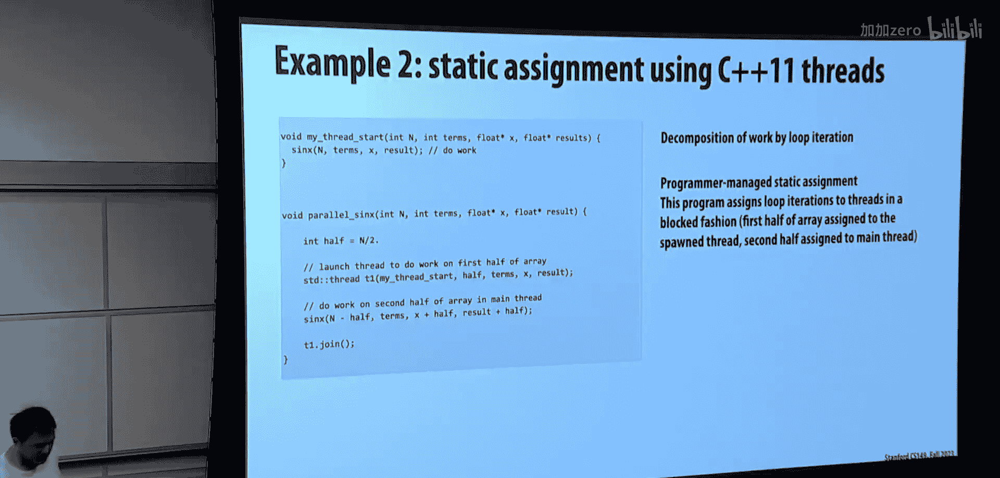

在实际并行化程序时，我们通常遵循几个步骤：**分解**（识别独立工作）、**分配**（将工作分配给执行单元）、**协调**（同步和通信）以及**映射**（将执行单元映射到硬件）。

一个关键的限制是**阿姆达尔定律**。该定律指出，如果一个程序的某一部分（比例为 **S**）必须串行执行，那么无论使用多少处理器，最大加速比不会超过 **1/S**。

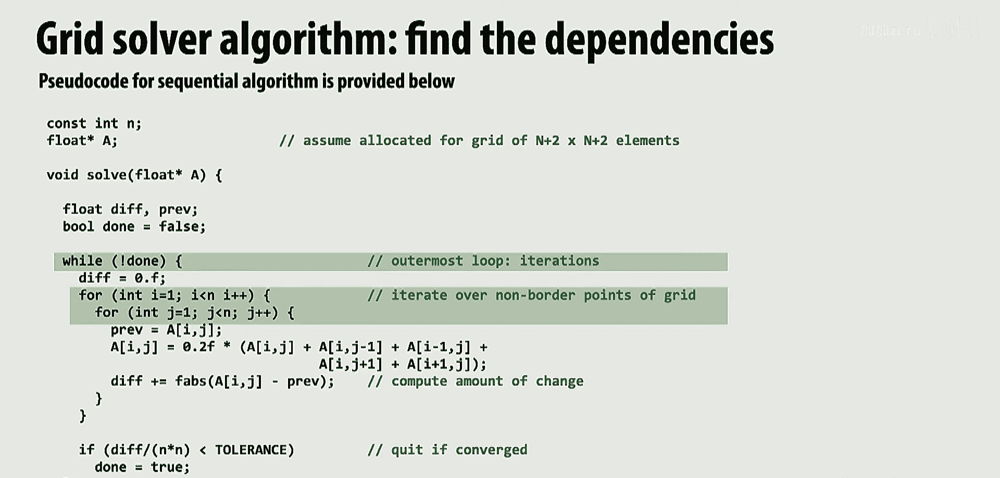

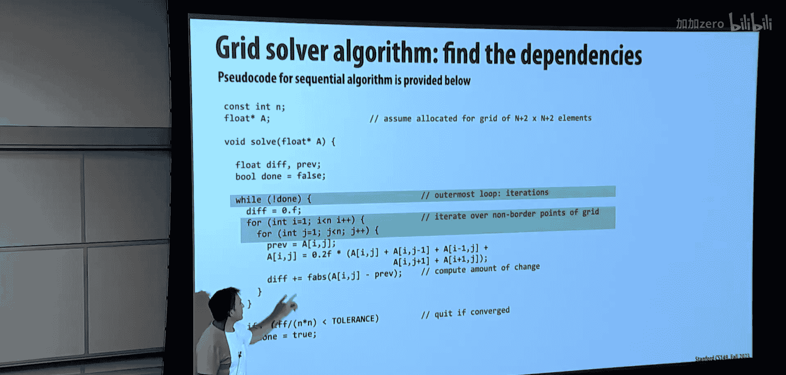

**核心公式**：最大加速比 ≤ 1 / S，其中S是串行部分的比例。

例如，即使程序95%的部分可以被完美并行化（S=5%），在100个处理器上的最大加速比也不会超过20倍。因此，努力减少串行部分至关重要。

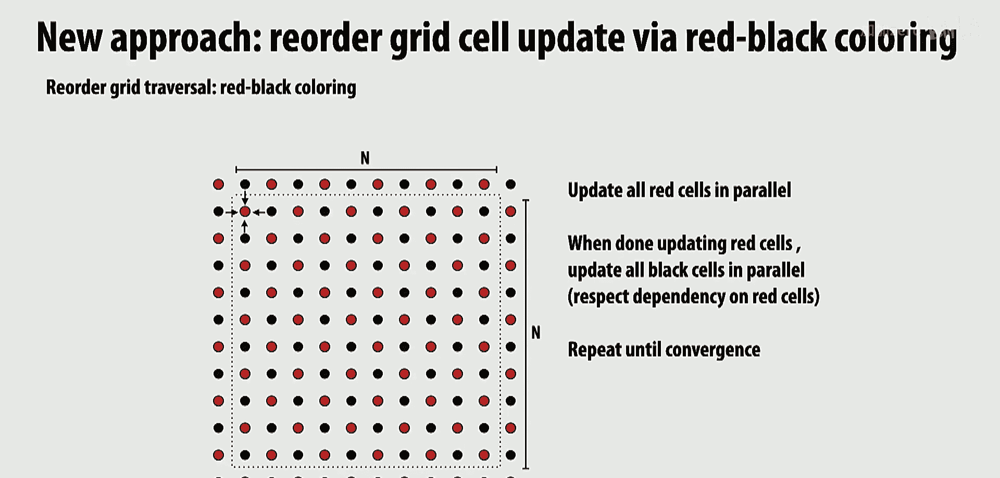

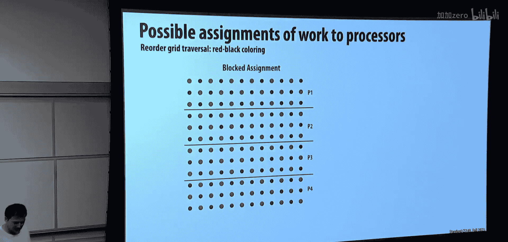

## 案例研究：网格求解器

让我们通过一个具体的例子——迭代网格求解器（如雅可比迭代）——来应用这些概念。原始算法中，每个网格点的新值依赖于其邻居的旧值，这导致强烈的数据依赖，难以并行。

我们可以改变算法，采用**红黑排序**的变体：
1.  并行更新所有红色网格点（基于黑色点的值）。
2.  同步。
3.  并行更新所有黑色网格点（基于上一步已更新的红色点的值）。
4.  重复直到收敛。

这种算法改变牺牲了一些收敛速度，但换来了巨大的并行潜力。


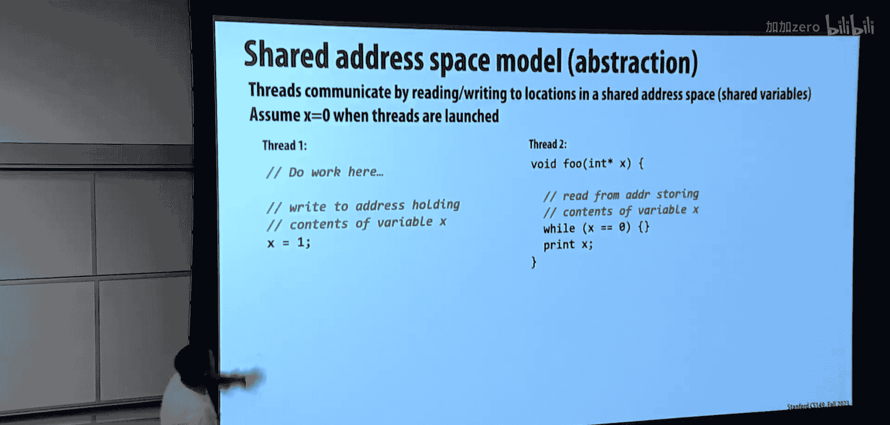

在实现这个并行算法时，我们需要处理同步问题。例如，所有线程完成当前颜色点的更新后，必须进行**同步**（使用**屏障**），才能确保所有新值对下一步可见，然后才能安全地检查全局收敛条件或开始下一轮迭代。

**核心概念**：有时需要改变算法以获得更好的并行性。使用屏障进行阶段同步。

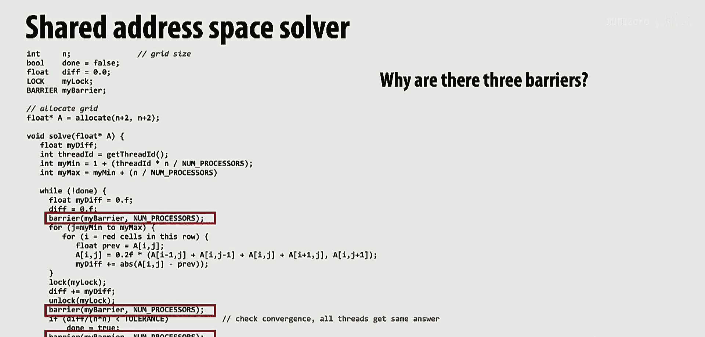

## 总结

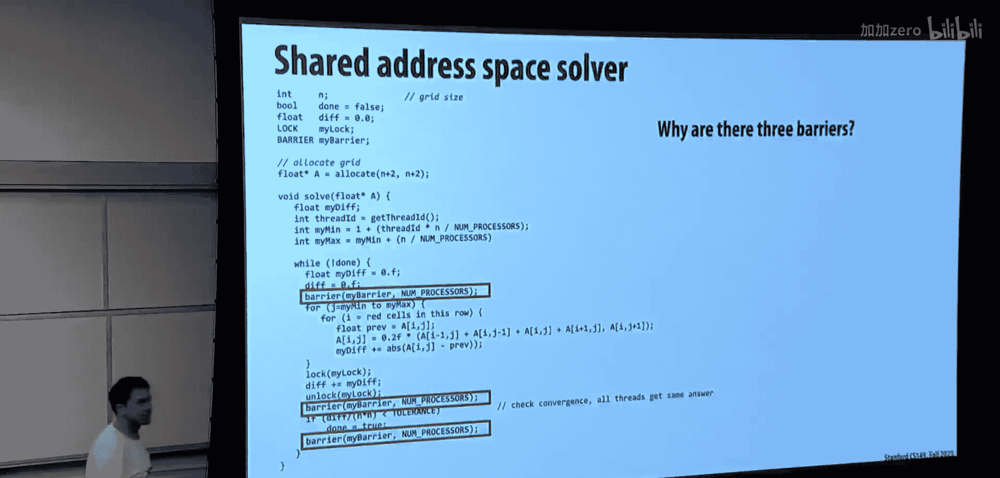


本节课中我们一起学习了并行编程的基础。我们从ISPC的程序实例和`foreach`抽象开始，理解了工作分配的概念。我们强调了避免数据竞争的重要性，并介绍了使用局部变量和归约操作的正确模式。我们还探讨了使用线程池高效管理任务，以及阿姆达尔定律对并行加速的根本限制。最后，通过网格求解器的案例，我们实践了算法转换、工作分配和同步（如锁和屏障）的使用。记住，编写正确、高效的并行程序需要仔细考虑工作分解、数据访问模式和执行单元间的协调。