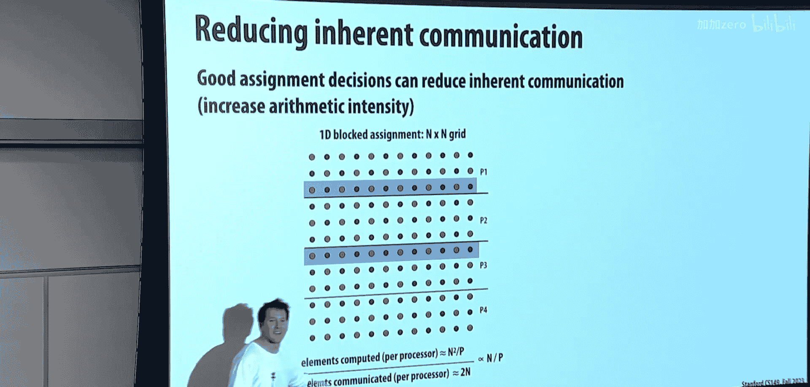
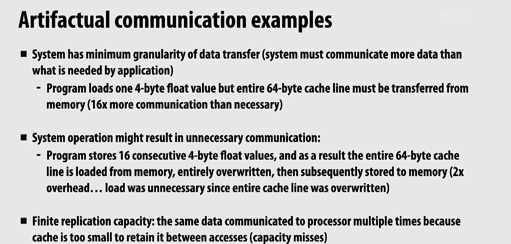

# 006：性能优化 II - 局部性、通信与争用 🚀

## 概述
在本节课中，我们将学习性能优化的第二部分，重点关注如何通过优化数据局部性和通信来提升并行程序的性能。我们将探讨共享内存与消息传递两种通信模型，分析通信开销的来源，并学习减少固有通信和人为通信的技术。

---

## 课程进度与展望 📅

上一节我们讨论了任务调度，今天我们将加入通信和同步开销的考量。

我们即将结束性能优化部分的讲座。下周的讲座将涉及GPU和GPU编程，而第8讲将是数据并行编程和思维。

之后课程内容将有所转变。在前几讲中，我主要讲解软件和性能优化，接下来Kunle将为大家介绍硬件等相关知识。

---

## 回顾：从调度到通信 🔄

在周二的课程中，我们讨论了调度。我们探讨了当拥有一定数量的线程或处理器以及大量待处理工作时，如何确保工作负载均匀分配到所有工作单元上，同时避免分配过程中产生过多开销的基本策略。

今天的课程将增加额外的考量：性能优化不仅仅是良好的工作负载平衡，通常还涉及减少通信和同步开销。因此，今天的内容将更多地围绕通信展开。

我将讨论如何降低处理器间的通信成本，这些是作为软件开发者可能使用的技术。最后，如果有时间，我想介绍一些通用的程序优化技巧，这些技巧不一定与你们的作业直接相关，但鉴于你们已经有了很多背景知识，讨论这类内容会很有帮助。

---

## 共享内存的复杂性 🧠

到目前为止，在本课程以及你们将要完成的所有作业中，我们基本上都假设所有处理器都连接到某个共享内存系统。换句话说，存在一个单一的地址空间，所有线程都可以读写该地址空间中的变量。

我已经给出了一些提示：尽管这个概念很简单，但所有处理器都能读写所有变量的实际底层实现其实相当复杂。例如，如果你的多核CPU中，数据可能全部存储在DRAM中，但该数据的许多副本存储在各个缓存中。

Kunle下周首先要讲的内容（或者下周晚些时候会开始涉及）就是：当一个核心复制了某些数据，另一个核心复制了相同地址的数据，并且它们都进行写入时会发生什么。现在，系统中不同的参与方写入同一个地址，这些副本可能有不同的值，这很快就会变得一团糟。

因此，我们将简要介绍现代系统如何保持一切**一致性**。以如今标准的英特尔CPU为例，它有几个核心，同一芯片上还有GPU。有一个网络连接所有这些核心，并将它们连接到同一个内存系统。

这些网络可能非常复杂。例如，在英特尔架构中，所有不同的处理器实际上通过一个**环**连接在一起并连接到内存。

所以，我们只是将其视为对值X的加载和存储，但从这里的处理器加载和存储值X（比如这四个核心）实际上是在这个环上发送一个请求，该请求最终被路由到内存。在这个环的不同部分，例如，如果是缓存命中，它实际上可能转到缓存的一部分并从缓存中获取数据。这实际上可能是一件相当复杂的事情。

有趣的一点是：你是否注意到所有不同的核心都以某种方式连接？如果你把这看作是一个核心加上它的L3缓存部分，请注意所有东西都连接到环上两次。你知道他们为什么这样做吗？

首先，是的，这是为了**降低延迟**。其次，它简化了设计：如果你总是按顺时针顺序发送消息，那么像死锁之类的问题就不太成问题。如果你想降低延迟，如果你有两个连接点，那么如果你要去左边的邻居或右边的邻居，而你只能向右发送，你实际上可以更快地到达那里。

这是另一个处理器（指Sun UltraSPARC T1/T2）。Kunle在这项技术的初始设计中发挥了重要作用。这是由当时尚存的Sun公司完成的，后来被Oracle收购。这是首批主流多线程芯片之一。在这个例子中，它有八个核心，每个核心都有多个线程。但所有这些核心都通过一个**交叉开关**连接到主内存。CCX就是交叉开关。交叉开关意味着每个核心实际上都物理连接到其他每一个核心，就像N个核心需要N²条线。

有趣的是，如果你看芯片图，一个处理器核心的实际面积（占位面积）大约与网络的面积相同。因此，这些在所有处理器之间提供高带宽连接的网络极其昂贵且复杂。

即使在……顺便说一下，如果我转到这个（指环形总线），实际上意味着根据你所在的核心、地址是什么、它实际在哪里以及L3缓存的哪个分片，L3缓存命中的成本可能不同。所以，这就像一个**分片缓存**，不同的地址去往不同的地方。

另一个例子是：如果你去买一个主板，上面有两个插槽用于两个物理CPU。假设有两个不同的四核CPU。有一个片上网络（那个环）连接着核心，就是我展示的那个。然后，在双插座主板上还有走线连接出去。

在那个图中，从核心1到地址X的加载或存储，可能比从核心8到地址X的加载或存储快很多，无论缓存行为如何。

因此，在现代系统中，随着系统变得越来越大（这在现代GPU等设备中表现得尤为明显），情况不仅仅是“数据要么在内存中，要么在缓存中”那么简单。实际上，这其中有很多细微差别，我们在编程时不一定需要考虑，因为那样会让我们的思维爆炸。但如果你真的想优化，你会意识到这种数据放置的重要性。

所以，尽管我们喜欢简单地认为计算机就是一大堆核心连接到一个共享内存，但不同线程通信的加载和存储操作，其成本可能**非常非常不同**。如果你是高手，你实际上会问：“这个地址在这台机器中的哪个位置？”并且你可能根据这个成本采取不同的操作。

---

## 消息传递模型：显式通信 📨

一种更容易推理通信的方式是考虑其他设计，其中数据移动更加**显式**。我想花点时间谈谈一种不同的计算模型，称为**消息传递**。如果你在Web环境中编写过任何分布式程序，你们所有人都应该熟悉它。

在互联网上，你并不是简单地说“我想要这个内存地址的数据”，然后互联网上的所有计算机都能访问一个统一的地址空间。当我们在分布式系统中通信时，我们通过发送消息来实现，可能是HTTP GET或POST请求之类的。

关键在于，我有两台不同的计算机或两个不同的线程，现在每个线程都在自己的地址空间中工作。

因此，线程1地址空间中的地址X，与线程2地址空间中的地址X**不是同一个地址**。它们是不同的地址空间。交换信息的唯一方式是**显式地发送消息**。

在这个例子中，我们不说HTTP请求，而是抽象地说：线程1将发送其地址X的内容给线程2，并用一个ID D标记消息，以便接收方知道它收到的是什么。

相应地，线程2将发布一个接收操作，表示“我想从线程1接收带有此ID的消息”。当我们收到数据时，我们将把该数据存储为我们自己地址空间中地址Y的内容。

因此，这些消息指明了：如何识别我地址空间中的数据，它要发送给谁，以及是否存在一个抽象的ID，以便对方知道监听什么。

在消息传递环境中，可以这样理解：共享内存就像一个公告板，任何人都可以在不询问的情况下发布消息，任何人都可以在不传递消息的情况下阅读该消息；而消息传递则更像发送实体邮件：你将数据打包在信封里，将其寄往特定地址，然后有人负责将其送达该地址。

当然，任何消息传递系统基本上都会有某种寻址机制。例如，这需要发送到哪里。区别在于：是在互联网规模上完成，还是在单台计算机内的线程规模上完成，或者可能是在小型计算机集群规模上完成，抑或是在大型机架等大规模上完成。如何识别接收者、数据如何移动（是TCP/IP还是UDP）可能有不同的机制。但概念上的区别是：

*   在基于共享地址的系统中，我们都谈论相同的地址，并且我们都拥有直接的读写访问权限。
*   在消息传递系统中，我们都在自己的地址空间中操作，我们发送消息，意思是说：“嘿，这是一些数据。去复制一份并放到你的地址空间里。”

---

## 示例：在消息传递中实现网格求解器 🧮

如果我们回到上次讨论的那个例子，我想这会变得更加明确。再次提醒大家，工作负载是：对于每个红色单元格，根据周围邻居的值更新红色单元格的值。如果尚未收敛，基本上再用黑色单元格重复此过程。

我想让你们思考一下，在比如说一个**集群**（而不是双核机器）上实现这个程序。假设是两台不同的计算机，我只能像互联网流量那样交换消息，比如通过以太网。

这是我的新型简单计算机：我有一个处理器及其自己的内存（DRAM），它实现了自己的地址空间。我有一个网络（无论是互联网、以太网还是信鸽），有一种方法可以将信息从一个内存传输到另一个内存。

重申一下，我只有发送和接收这两个操作。

首先，我必须**在所有处理器之间划分数据**，必须跨这些处理器对网格进行分区。

以前的情况是：我有一个大数组，就像我们在作业1中做的那样。然后程序代码会说：线程0或线程1，你应该访问这些地址；线程2，你应该访问这些地址。

现在情况有点不同了。我们没有共享地址空间，对吧？所以现在集群中的每个线程或每台机器（我突然跳到四台机器，只是为了让它更容易一些）都拥有数组一部分的**自己的副本**。

现在，在这四个不同的地址空间中有四个不同的分配，保存着每个工作单元负责的数据。

你看到了概念上的区别：以前我们有一个共享的分配，我们都只是接触自己负责的部分。现在，我们有四个不同的地址空间。图中的线程3无法直接说“加载这里的值”，就像你宿舍里的计算机和我办公室里的计算机一样，我无法从我的计算机发出加载/存储指令来将数据存储到你的计算机。

现在，要计算，假设我想计算这里这个元素的值，我需要什么信息？我需要左边的邻居、右边的邻居，以及下面的邻居。下面的邻居没问题，因为线程3拥有所有这些信息，但我还需要当前存储在我无法访问的地址空间中的信息。

因此，几乎所有消息传递系统中的做法都是：我需要能够访问这些数据，但我不能，因为它不在我的地址空间中。所以我要**复制一份**，并在我自己的地址空间中保留一个副本。

所以我现在实际上在每个节点上做的是**过度分配**。我分配了比我负责的部分多一行和少一行的额外空间。

我需要请求我的邻居通过消息发送我应该存储在这一行中的值。如果你看图中右侧的代码，这是每个线程正在执行的逻辑。请注意，它分配了一个比它负责的数据大两行的缓冲区。

一些术语：例如，在线程2中，有一个额外的过度分配，对应于保存这些数据的副本。这种额外的过度分配，即存储该线程不拥有或不负责更新的数据，你经常会听到它被称为**幽灵行**、**幽灵单元格**或**幽灵值**，这是科学计算中常见的东西。

---

## 消息传递求解器的完整迭代实现 🔄

现在，让我们看一下求解器应用程序一次迭代的完整实现，以消息传递的方式编写，而不是以加载和存储的方式。字体有点小，但请看一下，给它一些思考时间。

这段代码由每个线程执行，是一种SPMD的方式。每个线程根据其线程ID（这里是`tid`）执行操作。我给你们一分钟左右的时间，它某种程度上是有注释的，但请讨论一下，确保你们都理解这里的流程。

我想确保每个人都理解这个。这值得讨论。这个东西在做什么？有一个发送和接收数据的阶段，有一个执行你应该做的工作的阶段，有一个将更新后的数据发送给其他人的阶段，然后有一个确定我们是否完成以及是否需要再次重复的阶段。

好的，我们回来吧。我想大多数人的讨论已经达成一致了。让我们开始讲解，确保每个人都理解。

有一个关于发送和接收如何工作的问题，我故意没有澄清，因为我打算稍后更深入地讨论。如果一个线程调用`receive`，那么当某个其他线程发送了数据时，该调用才会返回。从某种意义上说，当那个调用返回时，数据现在就在我的地址空间里了。所以从技术上讲，如果我调用`receive`而没有人发送任何东西给我，我就会永远等在那里。

让我们看看这段代码，挑出一些细节。更有趣的事情之一是顶部的分配。我有这个变量`local_a`，它只是我这个线程对整个概念网格某一部分的本地副本，`local_a`分配了`rows_per_thread + 2`行。所以它是我负责的数组部分加上顶部一行和底部一行。

请注意，这些发送和接收调用中的`if`语句只是：如果我是第一个线程，我左边没有东西，所以我不需要。但请注意，它们将数据存储到`local_a`的第一行或最后一行。这样，当我迭代时，我就不必区分什么是幽灵行，什么不是幽灵行。在那个时候，我只是把所有数据放在它应该在的地方。所以我的代码很简单。

看起来第一轮也应该……我的意思是，它们都分配了相同的空间。在这种情况下，最后一个线程下面没有幽灵行，对吧？所以数据被分配了，但那里永远不会写入任何东西。只是为了保持代码简单，我不想在分配周围加条件。

中间会发生什么？顶部和底部的行将被访问到。我搞错了吗？我从`rows_per_thread`开始……我想我只是没有正确地保护它。抱歉。因为如果你看这个例子，现在我只显示了线程3的幽灵行。但正如你指出的，这里会有一个幽灵行，这里也会有一个幽灵行。老实说，如果你回想一下我们之前的代码，它只会从`i=1`迭代到我们计算值的最后一行（比如这一行）。这是问题的定义，对吧？

另一个有趣的事情是：记得上次在共享地址空间中，我们有锁和屏障。但这里没有锁，也没有屏障。那么这段消息传递代码如何确定我们是否应该继续？

看这里，它说如果线程ID不是线程0，那么每个线程（除了线程0）都发送它的`local_diff`。如果你是线程0，你等待接收所有其他线程的`local_diff`。你进行计算以确定我们是否完成。线程0确定这个计算，然后实际上将布尔值`done = true`发送给其他每个线程，然后被其他每个线程在这里接收。

当然，我们可以只计算总和并将总和值发送回去，然后每个人都可以独立计算是否完成。但这就是我在这段代码中的做法。

为什么这段代码里没有锁？因为没有什么东西是共享的，所以没有什么需要维护互斥。同步的唯一方式就是通过这些消息。因此，我们创造了一种情况：每个人都向一个线程（这里的一个参与者）发送部分和，一个线程完成所有数学计算，然后将结果返回给其他所有人。

为什么这里看不到任何屏障？本质上，屏障内嵌在我所做的这种通信模式中。由于每个人都有自己的`done`变量副本（因为没有共享地址空间），所以不用担心有人将来开始并覆盖别人收到的内容。

因此，通信在这些发送和接收中非常**显式**。

总结一下：注意，现在所有的数组计算都是相对的。如果我回到这里，请记住，所有线程现在都在自己的本地数组部分上迭代相同的索引，而之前在共享地址空间中，我做了一些数学计算以确保每个人都在迭代不同的索引。这是另一个例子：索引是相对的。

通信通过发送和接收执行。在这种情况下，我们决定一次发送许多元素，为了效率，进行一次发送而不是一堆小的发送。

同步不是通过锁和屏障完成的，同步体现在我们如何构造消息中。

---

## 阻塞式发送/接收与死锁风险 ⚠️

有一个问题触及了这一点：等等，让我们确保理解在所谓的**阻塞式发送和接收**中事情发生的顺序。

我们刚刚展示的发送和接收，我们都假设：如果发送方调用`send(foo)`，那么发送方地址空间中变量`foo`的数据将被复制到网络中。网络将传输消息。假设接收方已经在其自己的本地变量`bar`上调用了`receive`，接收方将收到消息，将消息中的任何内容复制到本地变量中。

当接收方完成复制数据并拥有该数据时，它可能会向发送方发送一个确认，然后发送方的`send`调用返回。一旦我们保证接收方拥有数据，这就是**阻塞式发送**。

类似地，**阻塞式接收**：当接收方在其地址空间的相应变量中拥有数据时，`receive`返回。

如果数据永远不到达怎么办？例如，如果网络出现故障。在这种简单的阻塞式发送和接收定义中，接收方永远不会返回（目前是这样）。发送方也不会收到确认，发送方也永远不会返回。所以你在考虑它时，就像我在一个网络分布式程序环境中。故障会发生。我需要对其具有鲁棒性。

现在，假设你买了一台16核计算机，从一个核心到L3缓存的一条消息无法送达……你会把它扔掉，对吧？或者，协议的所有可靠性……如果我们谈论的是片上网络，所有故障重传都将在硬件层面处理。所以，如果一个处理器存储到内存时出错，你会把机器扔掉。这就是我现在希望你们思考的方式。或者，你应该认为在这个API之下有一些东西，可能是某些系统软件，它会进行所有重试，并一直重试直到那件事发生。

显然，你可以考虑替代的API，比如发送可能失败。例如，假设硬件返回一些错误代码。API可能会说，嗯，它没有发送成功，它会返回一个错误代码之类的。但是相信我，如果你正在编写这样的代码，你不会检查内存是否工作正常之类的错误代码。

---

## 代码中的致命错误：死锁 💀

你们都讨论过了，并且正确地告诉了我上一张幻灯片上的代码是如何工作的。但没有人告诉我代码中有一个**致命错误**。让我们回到代码。我想让你们再看一眼。我想让你们告诉我，如果我使用阻塞式发送和接收运行这段代码会发生什么。

我想让每个人都花15-20秒思考一下。我的提示是：它会像刚才关于内存不工作的评论一样糟糕。

看起来有些人的眼睛亮起来了。有人想告诉我哪里错了吗？想象一下，你们在这个房间里，每个处理器就像房间里的一行。所以你们所有人要做的第一件事是向后看（或者发送向后）。这就是你们正在做的。你们向后发送，只有当后面的人确认或进行匹配的接收时，你们的发送才会完成。但是后面的人做了什么？他们也在向后看。他们也在向后发送。所以他们永远不会进行那个接收。

我们如何修复这个问题，同时仍然只使用阻塞式发送？一个简单的解决方案是**根据行的奇偶性将每个人配对**。所以第一行向后发送，下一行首先向前接收。然后你可以……这是一种做法。如果你仔细看，有些人有时会说，第一行不发送任何东西，难道不会工作吗？实际上，它甚至不工作，因为第一行如果不向后发送，它会向前发送。所以每个人都会在发布第一个接收之前进行发送。这在任何情况下都会**死锁**。这是一种死锁形式：你根本没有取得任何进展，因为你正在等待另一个同样无法取得任何进展的人。

所以，继续前进，一种可能的实现是根据奇偶性配对。你说，好吧，我要有一个伙伴。对于每个伙伴，一个人先发送，一个人先接收，依此类推。

一个小小的错误就可能导致你的程序挂起，绝对是这样。

---

## 异步发送/接收：避免死锁 🚀

我们也可以朝不同的方向发展，我们可以朝通信是**异步**的方向发展。上次我们讨论任务时，我谈到了异步函数调用，一个可以与调用者潜在并发执行的函数调用。消息发送也可以被认为是异步函数调用。

这是**异步发送和接收**。现在，当一个线程调用`send`时，更像是“我希望这条消息在未来的某个时间点被发送”。所以发送方调用`send`，但`send`立即返回。此时你（线程）不知道数据是否已经发送。通常，API会返回一个句柄。它只是说，嘿，如果你需要知道这个是否完成，这是你可以用来检查的ID。我在这里称之为`h1`。

所以，在未来的某个时间点，消息库会开始将数据复制到网络并推送出去。在未来的某个时间点，接收方会实际进行接收。一旦我们知道数据已被接收，我们可以探测系统，我们可以说“你完成了吗？”，我在这里写的是检查发送状态。检查该消息的发送状态，如果返回`true`，我现在保证数据已经发送，我可以删除`foo`或修改`foo`。

请注意，如果我在这个点和这个确认之间对`foo`做任何事情，我不能保证消息传递库已经获取数据并将其发送到线路上。这就像我把一个包裹放在门廊上，告诉UPS来取，然后我在UPS出现之前更改包裹的内容。修改后的消息将被发送，对吧？或者如果我把包裹从门廊拿走，UPS会说你让我来取，但这里什么都没有。

另一方面，在接收端，这是**异步接收**。如果我说“我希望你接收一条我期望的消息”，它会立即返回一个句柄。然后接收方可以在稍后的某个时间点说，嘿，它到了吗？它到了吗？如果到了，我知道此时可以接触`bar`中的数据。如果我在这个时候读取`bar`，我不清楚会得到什么数据。

这就是这些操作的异步版本。异步版本可以使实现某些事情（比如我刚才谈到的）变得更容易，因为你不需要那么担心死锁。

一个很好的观点是：如果这个发送和接收是一个库（通常就是这样），如果你是这个库的实现者，你肯定会在`send`和`receive`内部放置各种所谓的**内存屏障**或其他东西，这样编译器就不会围绕这些指令重新排序。我将在后面关于实现同步的讲座中稍微谈谈这个。

确认将是通信传输机制的一个底层细节，因此它们不会特意出现在幻灯片上。从线程（消费者）的角度来看，我可以使用的是：我发起一个发送，我基本上得到一个跟踪号（即句柄），我可以通过该跟踪号稍后检查发送是否完成（是或否，或者可能是否失败）。网络层如何在底层实现可靠传输，那是一个完全不同的故事，超出了本课程的范围。

如果你有两个连续的发送，会怎样？在这张幻灯片上，如果我说`send(foo)`，`foo`是我要发送的本地地址空间中的变量。如果我再在这里`send(foo)`一次，并且这些都是异步的，那么会发生什么是相当不确定的，因为不能保证这两条消息的发送顺序，它们实际上都在发送同一个本地变量的内容。所以，你是说，如果我有`send(foo)`，然后是另一个`send(fizz)`之类的？我的意思是，我只是发送两条消息。所以除非库给出状态保证，否则没有根本原因保证它们会以相同的顺序到达接收方。除非消息传递API上有一些配置，说明如果你设置了这个标志，我们保证顺序相同。

一种方法是忙等待。另一种方法，你知道，有些库可能设计成你注册回调或其他东西。例如，在异步JavaScript中，更像是本质上将那个AJAX请求放入队列，当它完成时你会被调用。

如果发送是按顺序进行的，那么接收的顺序呢？我认为之前也有一个消息ID D。我这样做的方式是：我发送`foo`，ID为D，随便什么。然后接收时，你可以明确接收带有此ID的消息，或者你只是发布一个接收并说“我正在接收”。然后，一旦你检查了接收，你说，哦，消息在这里，这是它的ID。然后你的程序可能是：如果是ID 43，我这样做；如果是ID 42，我那样做。所以，每条消息都应该被认为有一个ID，发送或等待或接收可以是“等待任何消息”、“等待来自此发送者的消息”、“等待带有此ID的消息”。这些都是你的消息传递机制的参数和细节。

---

## 通信的抽象视角与内存延迟 🌐

尽管我将其设置为想象这些是不同的计算机在通信，但我希望你们记住，通信有许多不同的类型。因此，如果我们在谈论核心与其内存之间的通信，或者同一芯片上两个不同核心之间的通信，或者不同宿舍中两台不同计算机之间的通信，在概念上没有区别。抽象地说，我们可以在任何事物之间发送消息，对吧？通信可以发生在处理器与其寄存器之间、其本地L1或L3之间、我自己计算机的DRAM之间、别人计算机的DRAM之间，或者谷歌的DRAM之间。所以，我希望你们将通信视为抽象的概念。

一旦你开始思考这个，就像我在前几讲中展示的那些图表，我说想象一个处理器发出加载指令，然后有一些内存延迟，然后数据必须实际开始移动回我。现在，希望你对所有这些内存延迟的来源有了一点感觉，对吧？比如L1缓存查找、L2缓存查找。可能你实际上有一个TLB未命中（因为操作系统之类的）。可能你发送一条消息到内存说“我想要这个地址的数据”。在某个时间点，内存开始将数据发送回你。

如果你有B比特/秒的带宽，你开始在那个蓝色区域以B比特/秒的速度接收数据。

这就是为什么当我画这个图时，我画了一个像这样的例子：有一个程序执行两条指令，然后进行一次内存事务。就像：数学、数学、读取、数学、数学、读取、数学、数学、读取。

这个图表的主要思想是，如果我们仔细观察，首先，即使读取不会立即返回，只要处理器有一些能力来隐藏延迟（比如多线程之类的），我们实际上并不那么关心延迟。我们实际上最关心的是蓝色条的长度。

所以，仔细观察这个图表，再次说服自己：内存总是忙碌的，而处理器并不总是忙碌的。我画了这些黄色条来显示内存总是忙碌的，粉色条是处理器不执行指令的时间，因为它正在等待下一块数据从内存返回。

你可以把这个蓝色条想象成一个缓存行，比如64字节。如果每次读取都是一个唯一的缓存行。

---

## 消息传递与共享内存：对比与应用场景 ⚖️

问题：消息传递是我们上次讨论的工作队列的替代方案吗？它们如何协同工作？消息传递只是线程之间交换数据的一种方式。在线程之间传递数据的另一种方式是每个人都读写一个共享地址空间。

我提出消息传递的原因，除了让大家熟悉消息传递的概念外，还因为在消息传递的背景下思考通信很有帮助，因为你在程序中字面上能看到它：这里就是通信发生的地方。

而我们在作业1中讨论的，或者我在作业1中用作带宽限制问题的例子，通信在哪里？通信就是加载和存储。但那个加载和存储实际上是关于向内存发送请求并取回数据。因此，基于共享地址的程序中的通信，在内存的实现中是**隐式**的。

所以，你知道，我只是想说，有……但我可以在一个没有共享地址空间的集群中的一堆机器上，使用消息传递来实现共享工作队列。我可以很容易地用不同的队列进行动态工作窃取，只是现在窃取工作是向另一台计算机发送消息并取回工作，而不是直接访问它们的数据结构。

如果你在一个实际系统上编写程序（不是集群，而只是一个处理器），是否有理由使用消息传递而不是共享内存？肯定可以有，因为在某种意义上，消息传递迫使你思考所有的通信。

所以很多人实际上在多核共享内存系统上使用消息传递模型编写代码，只是因为锁很难。比如，如果消息就像把东西扔进消息队列让另一边捡起来，这实际上可能是一种更容易推理并发的方式。例如，在大多数多进程系统中，你可能会向另一个进程发送消息，而不是将地址空间内存映射到两个进程中。

因此，消息传递是一种高度结构化的通信形式，它迫使你努力使其正确，但一旦你弄对了，通信就非常明确，你大致知道任何停顿可能在哪里，可能更容易调试和性能调优。

共享内存只是一种不同的机制，它根本不强迫你有任何纪律。所以可能更容易让你的第一个程序运行起来，也许你只是在整个东西周围放一个大全局锁之类的。但是，当你开始进行性能调优时，你可能得不到那么多的结构或帮助。有不同的原因你可能想使用不同的东西。

关于消息传递还有一个问题：似乎当我们进行消息传递时，有一个额外的写入操作，你必须先写入网络，有一个副本。有办法绕过这个吗？有很多方法可以绕过这个。让我们回到这里。

在现代高性能网络中，比如现代数据中心，你有一堆机器。假设你正在运行一个需要分布在多台机器上的键值存储。人们对降低发送消息的延迟和成本非常感兴趣。所以很可能这个`send(foo)`，这个`foo`是一个变量，这是一个指针。唯一发生的事情是这个指针被发送到你的网卡，你的网卡自己直接从内存中读取数据并通过线路推送出去。因此，有一些非常高性能的网络实现，不一定意味着数据被不必要地复制。

但即使在该实现中，直到数据在某个时间点被复制，数据必须被复制。这必须被复制到网络中。在该复制发生之前，调用线程对`foo`的任何修改实际上都可能在该复制之前更改位，这意味着即使你认为你发送的是调用时`foo`的内容，你实际上发送的是后来`foo`的内容。这将是一个错误。

所以，异步的，你知道，突然间，如果是同步的，你永远不会考虑调用和消息传输之间的并发性。异步的，正如所建议的，可能是一种更容易做事的方式，但也可能是一种更困难的方式：现在你在程序中引入了更多的并发性，你可能有更多的问题。

---

## 带宽限制与算术强度 📊

好的，让我们看看这里。我几讲前讲过这个，但我想再放一张幻灯片。这是我希望你们课后思考的东西。当你们看这张图时，我希望你们能够说，是的，那个程序是**带宽限制**的。它基本上是内存和处理器之间的通信限制。

我希望你们能够回答所有这些问题。例如，如果你增加内存延迟（意味着增加从这里到这里的距离），利用率或效率会改变吗？你的答案应该是否定的，只要你能隐藏那个延迟。

如果你增加系统的带宽会发生什么？蓝色条应该缩小。如果蓝色条缩小，意味着我在粉色区域的停顿更少。如果我增加每个蓝色内存请求的数学操作数量，利用率会上升。这些都是我希望你们能够思考清楚的事情。

归根结底，如果我们不担心延迟，如果我们有能力隐藏延迟（无论是多线程、预取数据还是其他什么），那么问题的关键就归结为**算术强度**，即每读取单位数据所执行的数学操作数量。

有些人喜欢称之为**通信计算比**，这是它的倒数。我喜欢算术强度，因为A听起来更酷，B更高更好，这对我来说更直观。

---

## 固有通信与人为通信 🧩

你会发现，将通信以两种方式分开是有帮助的：一种是**固有通信**，由于算法的性质而必须发生；另一种是**人为通信**，源于机器的实际工作方式。

第一个称为固有通信。第二个称为人为或人工通信，它来自于计算机如何工作的真实细节，并且存在这些细节的产物。让我在这里给你们一个例子。

在这个网格求解器应用程序中，我无法完成应用程序，除非我将这些数据移动到这个线程。这是计算**固有**的。所以这是必须发生的通信。我必须以某种方式支付那个成本。

我们上次稍微谈了一下，有多少通信？让我们看看这个。如果我在我的处理器之间划分工作（抱歉，在本讲中我交替使用P1和T1，处理器和线程对我来说是一样的）。

我们做了多少通信？对于每个我们处理的元素，处理元素的数量与发生的通信量之比是多少？让我们考虑一个线程。

如果数据总量是N²，并且我们在P个处理器之间划分，每个处理器做多少工作？N² / P，对吧？每个处理器做多少通信？2N，对吧？所以如果我们有N² / P的工作量（我会去掉常数），我有2N的通信。那么我的算术强度是N / P，对吧？

如果我采用这种交错分配，并考虑消息传递程序。我做了多少计算？仍然是N² / P。我移动了多少数据？另一种思考方式是：对于我计算的每一行，我必须移动多少数据？2行数据，对吧？所以现在我的算术强度从N / P（假设N可能比P大很多）变成了1/2。

所以，如果我回到那个图表，我的利用率将是……我在这里做N个操作，每通信P个元素；在那里，我每通信两个元素做一个操作。与左边的方案相比，我更有可能在右边的方案中受到带宽限制。

有人能想到如何做得更好吗？左边比右边好得多。你能比左边做得更好吗？算术强度基本上是区域面积与其周长的比值。在这种情况下，创建一个具有最高面积周长比的形状的方法是什么？是正方形，对吧？

让我们看看这个。让我们以这种方式划分工作。我必须在这里创建更多的处理器，只是为了让图表更明显一些。现在假设我有9个核心。

同样，我有N²个元素，P个处理器。每个处理器的工作量仍然是N² / P，没有改变。通信量是多少？每个这些边界是√N / √P，对吧？所以通信的元素数量基本上是4 * (N / √P)。因为我基本上，我划分了宽度为N的东西。我总共有P个处理器，所以一行有√P个处理器。

现在，我之前的算术强度是N / P。现在，它是N / √P，这是一个更大的值，如果我的P很大（在多核机器上），这可能非常重要。

因此，这种以**瓦片格式**（而不是行块）重新分配工作的技巧，意味着我有更高的算术强度，我每发送一个字节做更多的操作。我可以在较低的内存带宽下保持全速运行，或者如果我在一台有很多核心的机器上，我能在更长时间内保持更高的利用率。

最小化……嗯，我的意思是，你可以，但请继续。这取决于你。如果你受到带宽限制（通信限制），你为增加算术强度所做的任何事情都会转化为性能提升。

现在，你知道，你想把它切成圆形。你会怎么处理里面的区域？我不太确定，你可能要浪费很多数学计算来弄清楚你在做什么，以至于它可能不会更快。但是，这是一个相当大的改进。

换句话说，这样想：想象你在一台64核机器或16核机器上运行。√P与P的差异是4倍。使用这个方案，你可以用四倍少的带宽保持峰值利用率。这可能是一件大事。

---

## 缓存行为与人为通信：缓存分块 🧱

好的，这是一个减少固有通信的优化例子，因为那是必须移动的数据。

通常，我们正在与一堆固有或人为通信作斗争，这源于我们从未在计算机中移动一块数据。我们总是移动一个缓存行，或者最小数据包大小可能是一千字节之类的。所以总是有机器如何工作的细节，让你觉得“哦，那个通信不应该那么糟糕”，然后你又说“哦，天哪，那真的很糟糕”。

让我给你们一个常见的例子，那就是**缓存**。这就是为什么我们在本课程中教授缓存。

想想网格求解器的缓存行为。想象我有一个缓存，缓存行大小是四个元素。所以每个蓝色东西是四个点宽。所以是四个元素。想象我有一个缓存，有6行或总共24个网格元素。

所以想象一下，当我计算那个红点时，作为计算那个红点的结果，我读取了四个基本方向的邻居。希望你们同意，这些将是加载的缓存行。

因此，在产生那个红点之后，这些将是缓存行。我水平移动一个元素。会有任何缓存未命中吗？不，实际上，它们都是缓存命中。现在想象一下，我们水平方向进行，当我们到达行尾时，我已经计算了所有这些元素，这就是我的缓存状态。记住，我的缓存可以容纳6行。

现在，我想让你们思考一下，当我回到这里时会发生什么。我想处理这个红点。我的缓存中有蓝色区域的数据，但不久前，我拥有所有我需要的数据（除了红点下面的行）在缓存中。现在它不在那里了。所以我会再次在所有东西上未命中。

这有点像是人为通信，对吧？理论上，我加载了那个数据。如果我有某种神奇的缓存，我不会再次将其通信回处理器。但如果你实际看这个程序，你会说，不，每次我接触数据时，我都会遇到所有这些缓存未命中。

所以如果你仔细观察，这个程序每输出四个元素，我加载三个新的缓存行。这是一种思考方式。在这里可能更容易看到。

如果我继续……一旦我进入稳定状态。注意这里，第一个元素，三个缓存行；第二个元素，没有新缓存行；第三个元素实际上会加载三个更多的缓存行。但在整个过程中处于稳定状态时，我每加载三个缓存行做四个红点。

所以这是我的算术强度：每三个缓存行四个输出元素。这是工作与带宽的比率。

有很多人为通信的例子，比如缓存行、有限大小的缓存，或者必须在16字节边界上传输的网络流量等等。

---

## 减少人为通信：缓存分块技术 🧩

我的分块例子（瓦片化）是改变工作分配给处理器以减少固有通信的例子。我将世界划分为瓦片，我说，好吧，如果我做不同的工作负载平衡，你本质上会通信更少。

现在，让我给你们一个减少人为通信的技术。或者，实际上，也许你可以想出一种技术，而不是像这样遍历数组。有没有办法可以改变程序来增加其算术强度？

是的。固有通信是……给定方案，实际上有多少数据必须在处理器之间移动才能完成工作。在这个例子中，实际上，我去掉了并行性。所以假设这一切都在一个线程内进行。

所以现在我说，即使在一个工作单元内部，之前有跨处理器或跨工作单元的通信。这是工作单元内部处理器与其自身内存之间的通信。我能做得更好吗？

也许如果你像这样穿过顶部，然后只是向下移动……或者从左到右像锯齿形模式。所以我这里的目标是：当我回到左边时，我想足够快地回来，在数据从缓存中掉出之前。这就是正在发生的事情。

所以，如果我改变迭代这个数组的顺序，我计算出相同的答案。我只是要以不同的顺序迭代。这又与并行性无关。这只是关于通信。

现在，每当我回到这里时，我已经访问过的一些数据仍然有效并在我的缓存中。我只需要加载下面这一条新线。

如果你展开这种模式，以前是每三个加载的行四个输出。这种新模式是每两个加载的行六个输出元素。所以我再次相当大地增加了我的算术强度。

这被称为**缓存分块**。这可能是你在任何涉及张量和矩阵的代码中会做的最重要的技术。因此，任何现代矩阵乘法、任何现代张量操作，KNN如此之快的原因是因为选择了非常好的顺序来遍历数据。

以相反的顺序跨行迭代怎么样？比如一直跨过去，然后一直回来？那在这里也是一个合理的方案吗？实际上，如果你看这个图表，但想象N非常宽，它在这里不是一个合理的方案。如果N非常宽，当然你在两端得到一点重用，但你又回到了中间的故障模式。所以，是的，在这个图表上，你会看着它说，是的，两端的重用是关于一切的。但现在我假设N是1000。对于我们的参数，比如我们的L1缓存是16K或32K之类的。是的，我认为是32K。一个矩阵可能非常大，比如一个2K x 2K的矩阵会超出你的L3缓存。

但是，我们是从角落算出来的吗？没有我们，会想，哦嘿，这有点像正在发生的事情，这正好是缓存的东西。

如果我像我们一样通过性能剖析来弄清楚呢？性能剖析会告诉你你的算术强度是多少。比如，工具可以说你受到带宽限制。它们会告诉你这一点，但它们不会告诉你如何修复它。

---

## 循环融合：另一个提高算术强度的例子 🔄

这是另一个经常出现在你们生活中的例子。这是一个可能看起来像C语言的程序，但它很像你们可能在NumPy或类似东西中运行的代码，对吧？所以我有一堆用于数组乘法或加法的库函数。它非常像作业1中的`saxpy`。

但通常，如果你有那个库，你可能通过在数组上执行一些表达式来进行更复杂的计算，我在这里用C代码写了。所以，