# 007：GPU架构与CUDA编程 🚀


在本节课中，我们将学习现代GPU（图形处理器）的架构以及如何使用CUDA（Compute Unified Device Architecture）进行编程。我们将从GPU的历史发展讲起，了解其如何从专用于图形渲染的芯片演变为强大的通用并行计算平台。接着，我们将深入探讨CUDA编程模型的核心概念，并将其与我们已学的ISPC等并行编程模型进行对比。最后，我们将剖析现代GPU（以NVIDIA V100为例）的内部架构，理解其如何高效地执行成千上万个CUDA线程。

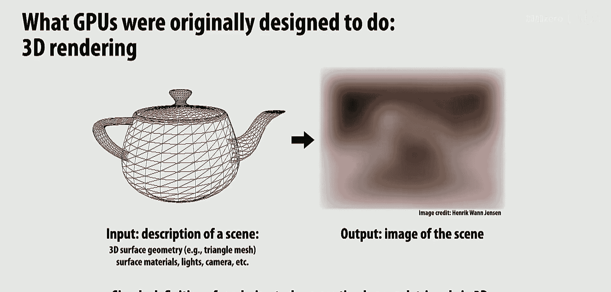

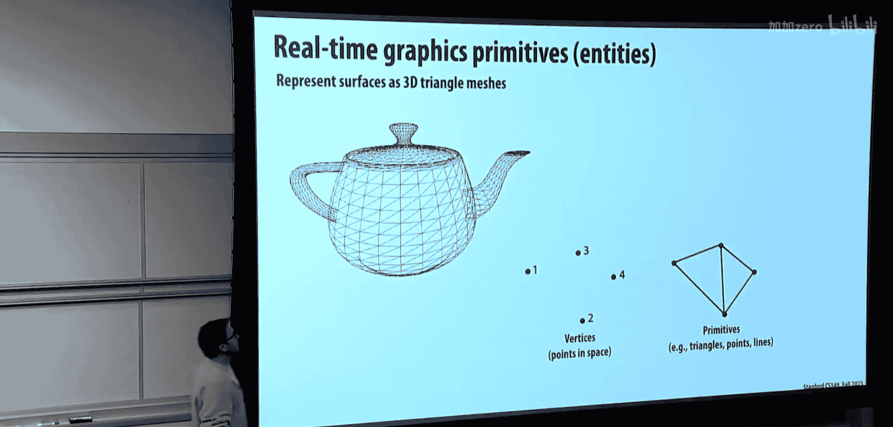

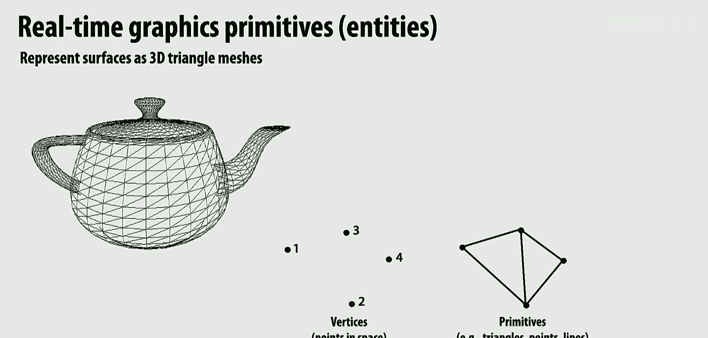

---

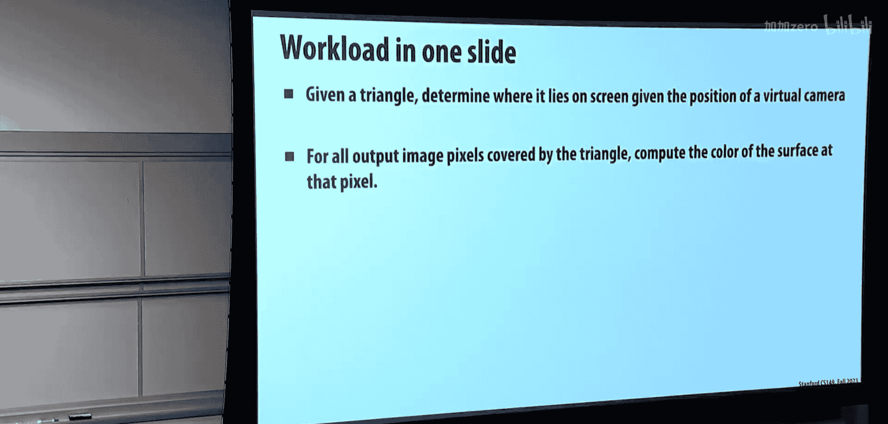

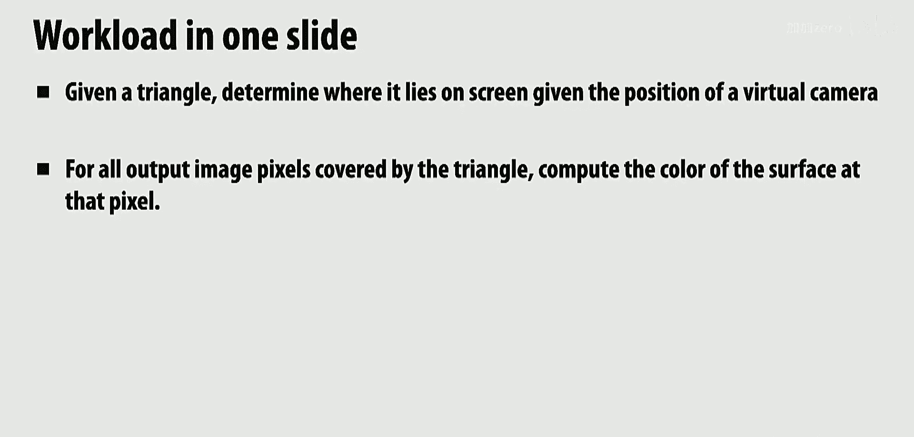

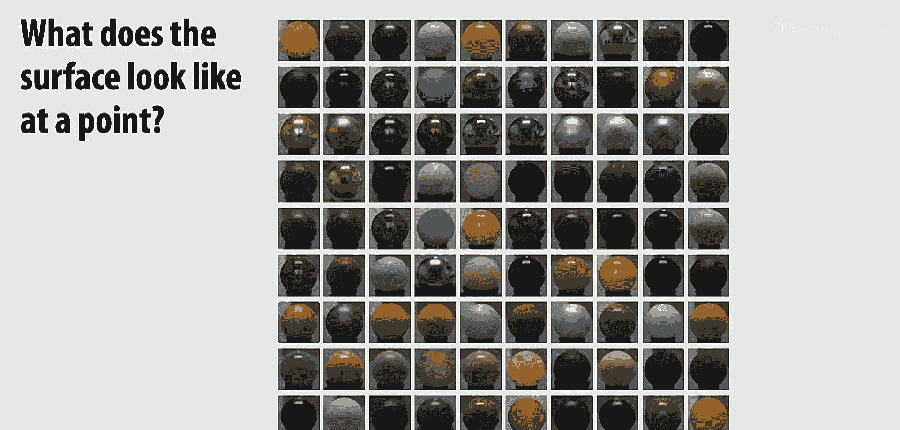

## 从图形处理器到通用计算处理器 🎮➡️💻

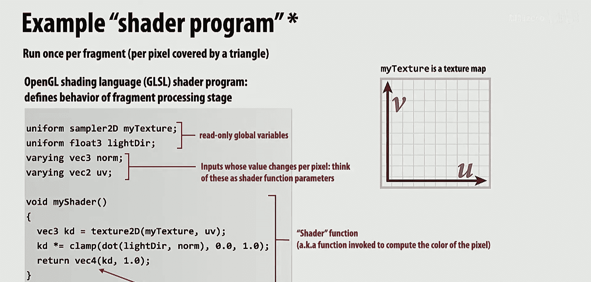

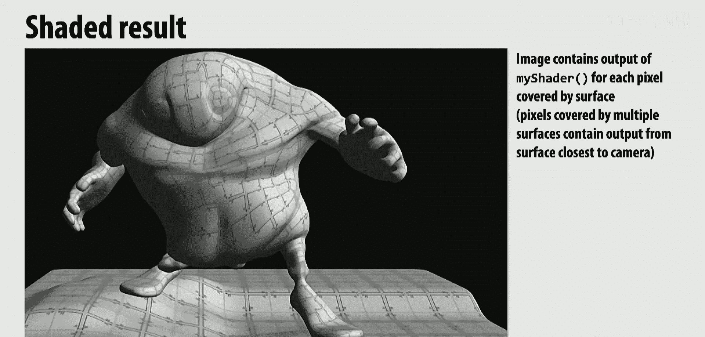

上一节我们回顾了多核、SIMD和多线程等并行计算的基本思想。本节中，我们来看看这些思想是如何在GPU上以更大规模实现的。

最初的GPU设计是为了解决一个特定问题：根据场景的数学描述（几何表面、光源、虚拟相机位置），模拟光线传播和材质交互，最终生成一张图像。这个过程被称为**图形渲染管线**。

为了实现实时渲染（例如每秒60帧），GPU需要处理数百万甚至数十亿像素。因此，制造商开始不断增加更多的处理核心和算术逻辑单元（ALU），以并行计算每个像素的颜色。这本质上是一种**数据并行**计算：对每个像素独立地运行相同的着色器程序。

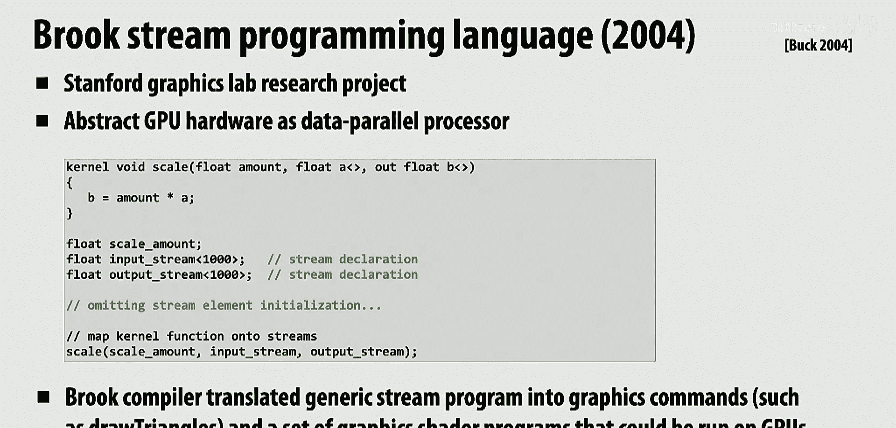

大约20年前，当CPU单线程性能提升遇到瓶颈时，研究人员开始思考：既然GPU拥有如此多的核心且能运行程序，能否将其用于图形渲染之外的计算？于是出现了早期的“黑客”方法：程序员会渲染两个覆盖整个屏幕的三角形，从而触发GPU为每个像素调用着色器程序，但在着色器程序中，他们并不计算颜色，而是执行物理模拟、蛋白质折叠等通用计算任务。

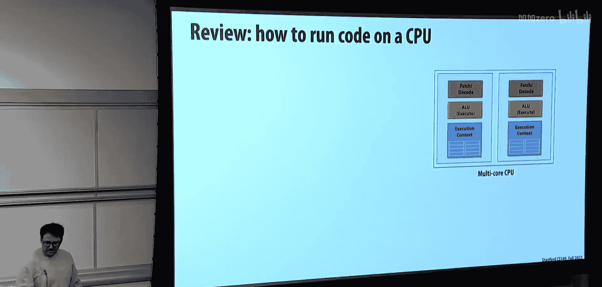

受此类研究的启发，NVIDIA意识到需要提供一个更正式的编程接口，让开发者能直接编写通用目的代码来利用GPU的强大算力，而无需借助图形API的“障眼法”。这直接催生了**CUDA**的诞生。

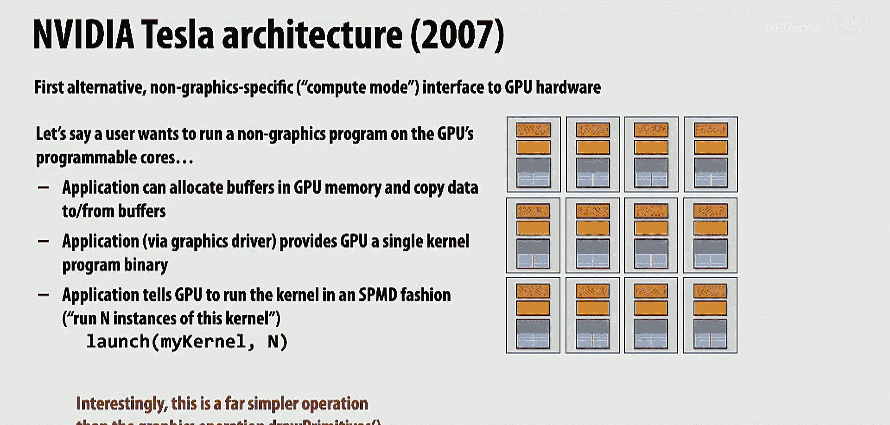

---

## CUDA编程模型 🧑‍💻

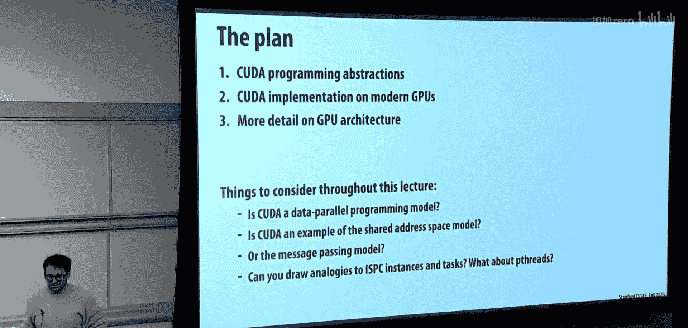

CUDA的编程模型与我们之前学习的ISPC非常相似，它是一种**SPMD（单程序多数据）**模型。这意味着你编写一个内核函数，然后指定启动大量该函数的副本（即线程）来并行处理数据。

### 核心概念：线程、线程块与网格

在CUDA中，执行的基本单位是**线程**。但与CPU线程不同，CUDA线程是轻量级的，并且通常以**线程块**的形式组织。多个线程块又构成一个**网格**。

以下是一个简单的CUDA矩阵加法示例，展示了如何启动内核：

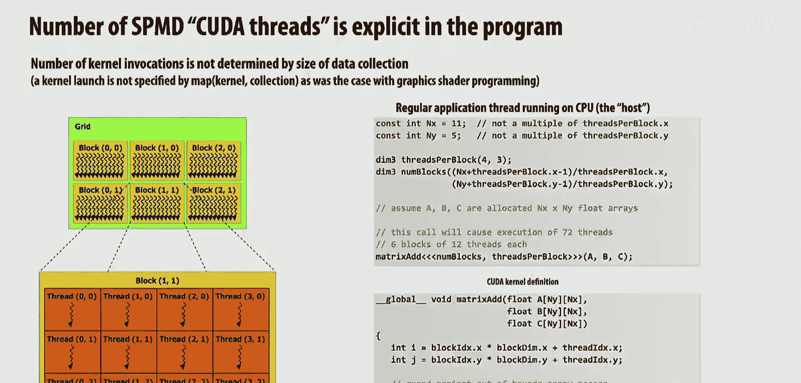

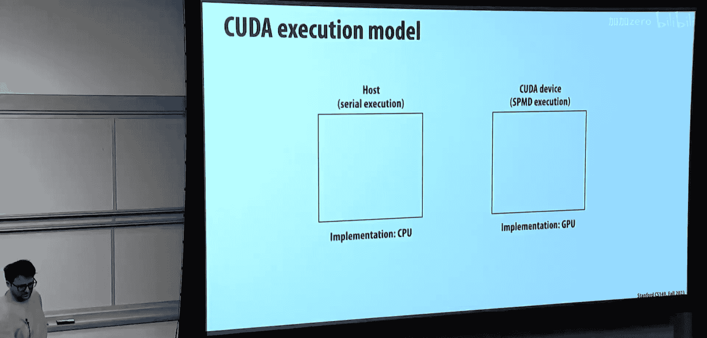

```c
// 主机（CPU）代码
int main() {
    // ... 分配内存等初始化操作 ...
    // 定义网格和线程块的维度
    dim3 threadsPerBlock(4, 3); // 每个线程块有4x3=12个线程
    dim3 numBlocks(12/4, 6/3); // 网格由多个线程块组成
    // 启动内核
    matrixAdd<<<numBlocks, threadsPerBlock>>>(dev_A, dev_B, dev_C);
    // ... 后续操作 ...
}

// 设备（GPU）内核函数
__global__ void matrixAdd(float* A, float* B, float* C) {
    // 计算当前线程负责的矩阵元素索引
    int i = blockIdx.x * blockDim.x + threadIdx.x;
    int j = blockIdx.y * blockDim.y + threadIdx.y;
    // 执行加法
    C[i * N + j] = A[i * N + j] + B[i * N + j];
}
```

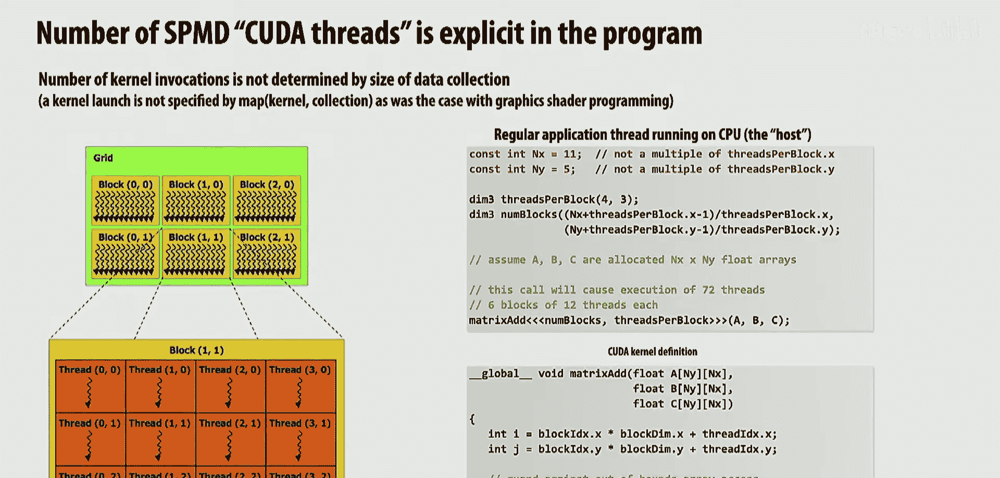

代码解析：
*   `__global__`：声明这是一个CUDA内核函数，将从主机调用，在设备上执行。
*   `<<<numBlocks, threadsPerBlock>>>`：这是CUDA特有的语法，用于配置内核启动的参数。它指定了网格中线程块的数量以及每个线程块中的线程数量。
*   `blockIdx`, `threadIdx`, `blockDim`：这些是CUDA内置的变量，分别表示线程块索引、线程在线程块内的索引以及线程块的维度。内核函数中的每个线程通过这些变量来确定自己唯一的工作项。

### 内存模型

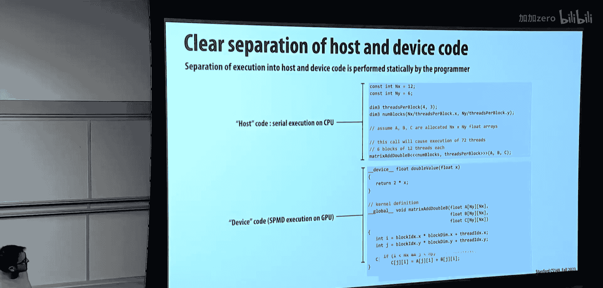

CUDA采用**分离的地址空间**模型：
1.  **主机内存**：由CPU代码（如`malloc`）分配，CPU可访问。
2.  **设备全局内存**：由CUDA API（如`cudaMalloc`）在GPU上分配，所有CUDA线程均可访问。
3.  **共享内存**：每个线程块内部共享的一块高速内存，用于线程间协作，由`__shared__`关键字声明。
4.  **本地内存**：每个线程私有的内存（如局部变量）。

数据需要在主机内存和设备全局内存之间显式拷贝（使用`cudaMemcpy`）。共享内存的访问速度远高于全局内存，因此巧妙利用共享内存是优化CUDA程序性能的关键。

### 一个优化示例：1D卷积

考虑一个一维卷积操作，每个输出元素是其周围三个输入元素的平均值。一个简单的实现是每个线程直接从全局内存读取三个所需的值。

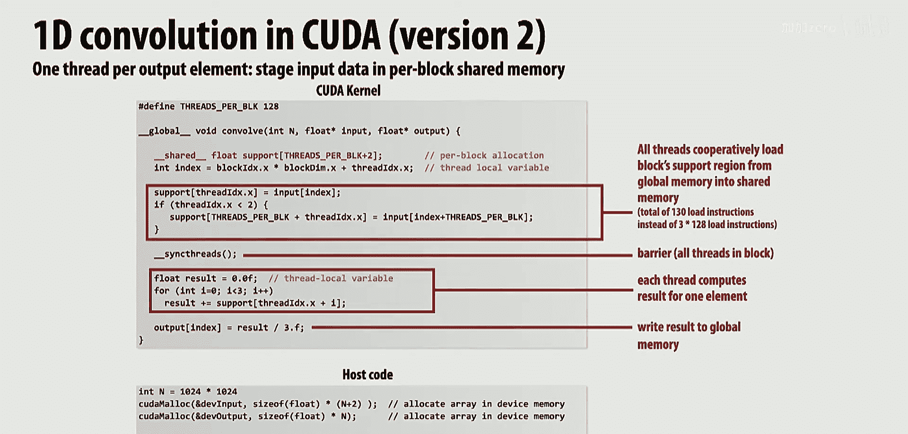

```c
__global__ void convolveSimple(float* input, float* output, int N) {
    int i = blockIdx.x * blockDim.x + threadIdx.x;
    if (i >= 1 && i < N - 1) { // 处理边界
        output[i] = (input[i-1] + input[i] + input[i+1]) / 3.0f;
    }
}
```

然而，相邻的线程会读取重叠的输入数据（例如，线程i和线程i+1都会读取`input[i]`），导致对全局内存的重复访问。

我们可以利用**共享内存**进行优化：让一个线程块内的所有线程协作，先将该块计算所需的所有输入数据加载到共享内存中，然后再进行计算。这样，每个输入元素从全局内存只被读取一次。

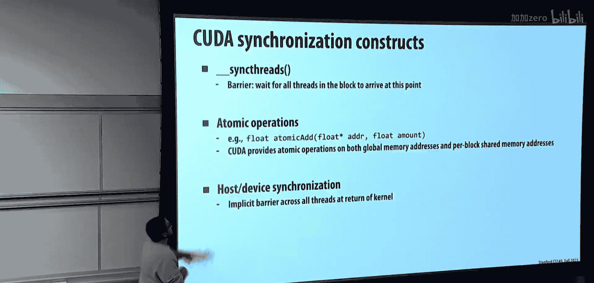

```c
__global__ void convolveOptimized(float* input, float* output, int N) {
    __shared__ float s_data[BLOCK_SIZE + 2]; // 共享内存，大小比线程块多2
    int globalIdx = blockIdx.x * blockDim.x + threadIdx.x;
    int localIdx = threadIdx.x;

    // 协作加载数据到共享内存
    s_data[localIdx + 1] = input[globalIdx]; // 加载主数据
    if (localIdx < 2) { // 边界线程加载额外数据
        s_data[localIdx == 0 ? 0 : BLOCK_SIZE + 1] = input[globalIdx + (localIdx == 0 ? -1 : BLOCK_SIZE)];
    }
    __syncthreads(); // 确保所有数据已加载到共享内存

    // 从共享内存中读取数据进行计算
    if (globalIdx >= 1 && globalIdx < N - 1) {
        output[globalIdx] = (s_data[localIdx] + s_data[localIdx+1] + s_data[localIdx+2]) / 3.0f;
    }
}
```

代码解析：
*   `__shared__ float s_data[...]`：在共享内存中声明一个数组。
*   `__syncthreads()`：这是一个线程块级别的屏障同步。它确保线程块内的所有线程都执行到此位置后，才继续向下执行。在上面的代码中，它保证了在所有线程完成数据加载到`s_data`之前，没有线程开始执行卷积计算，从而避免读取未初始化的数据。

---

## GPU架构揭秘 🏗️

现在，让我们看看GPU硬件是如何执行这些CUDA线程的。我们将以NVIDIA Volta V100架构为例。

### 核心构建块：流式多处理器

GPU由许多称为**流式多处理器**的核心组成。每个SM是一个功能强大的多线程处理器，内部包含：
*   **多个CUDA核心**：用于执行算术运算。实际上，这些核心以**SIMD**方式组织。
*   **大量寄存器文件**：为成千上万个CUDA线程提供执行上下文。
*   **共享内存/L1缓存**：供线程块内部使用的高速可编程内存。
*   **指令调度单元**：负责从多个线程中获取和解码指令。

### 关键概念：线程束

GPU硬件将32个连续的CUDA线程分组为一个**线程束**。这是调度和执行的基本单位。
*   **隐式SIMD**：线程束中的所有线程执行相同的指令。如果这32个线程的**程序计数器**相同，硬件会以SIMD方式在32个CUDA核心上同时执行该指令。这与CPU上编译器显式生成SIMD指令不同，GPU硬件是动态检测并执行SIMD的。
*   **线程束发散**：如果线程束内的线程由于条件分支而执行不同的路径（例如`if-else`），GPU会串行化执行所有路径，并禁用不活跃线程的通道。这会导致性能下降，应尽量避免。

### 大规模多线程与调度

一个SM可以同时驻留多个线程块（例如V100的SM可驻留多达32个线程块），管理上千个CUDA线程。硬件调度器会从所有驻留的线程束中选择就绪的线程束，并将其指令分派到执行单元。

这种**大规模多线程**的设计主要目的是**隐藏延迟**。当一些线程束因为等待内存访问而停顿时，调度器可以立即切换到其他就绪的线程束，从而保持执行单元的繁忙，最大化硬件利用率。

### 资源限制与线程块调度

当启动一个内核网格时，GPU工作调度器会为每个线程块分配资源，包括：
1.  **执行上下文**：线程块中每个线程所需的寄存器。
2.  **共享内存**：线程块声明的共享内存大小。

调度器会将线程块分配到有足够可用资源的SM上。只有当线程块执行完毕，释放其资源后，该SM才能调度新的线程块。因此，编写内核时，需要合理设置线程块大小和共享内存使用量，以最大化SM的占用率，从而提升性能。

---

## 重要约束与总结 🎯

本节课中我们一起学习了GPU和CUDA编程。最后强调几个关键约束：

1.  **线程块内的线程并发执行**：线程块被设计为在一个SM上并发执行。因此，线程块的大小不能超过目标GPU的SM所能支持的最大线程数。否则程序将无法启动。
2.  **线程块间的独立性**：不同线程块之间**没有**执行顺序的保证，也不能通过全局内存的屏障进行同步。它们可以通信（例如通过原子操作），但必须假设它们以任意顺序执行。线程块间的依赖或同步可能导致死锁或未定义行为。
3.  **线程块内的协作**：线程块内的线程可以通过共享内存和`__syncthreads()`屏障进行高效协作。这是CUDA编程中进行优化和数据重用的主要手段。


总而言之，CUDA提供了一种基于**大规模数据并行**和**层次化线程组织**的编程模型。通过将计算任务分解为大量可并行执行的线程，并利用线程块内的协作以及GPU硬件的大规模多线程和SIMD能力，我们能够极大地加速适合并行处理的计算密集型应用。