# 008：数据并行思维 🧠


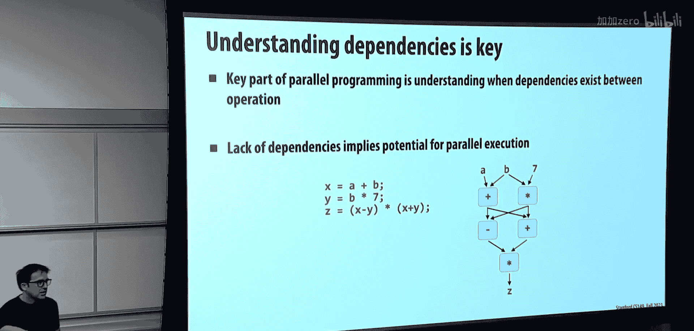

在本节课中，我们将学习一种不同的并行编程思维方式。到目前为止，课程主要围绕线程展开。今天，我们将深入探讨**数据并行**思维，即通过一组丰富的、已知具有高度并行实现的**原语操作**来表达计算，而不是直接管理线程和依赖关系。

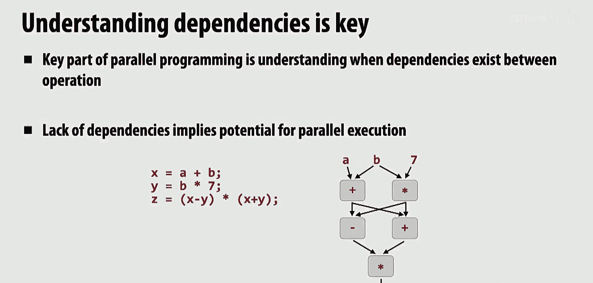

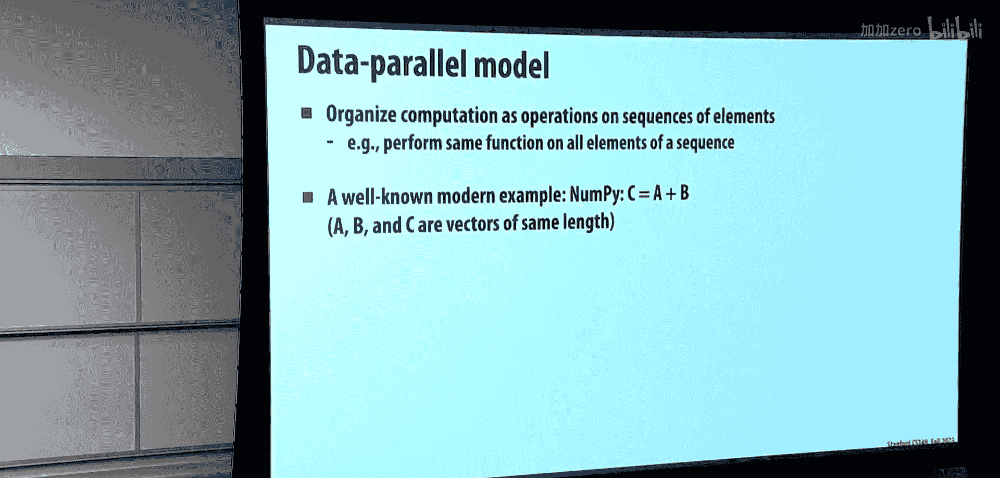

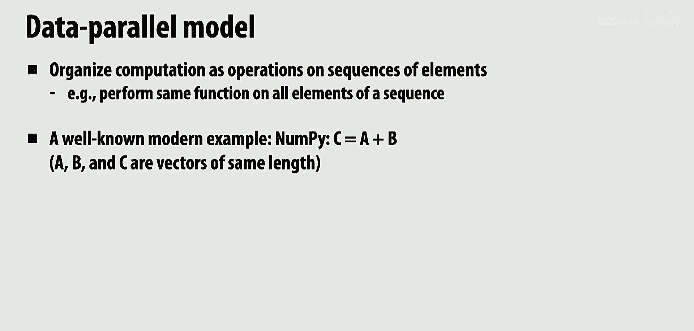

## 从线程思维到数据并行思维 🔄

上一节我们介绍了GPU等硬件需要大量并行任务（例如数十万级别）才能充分利用其计算能力。本节中，我们来看看如何通过更高层次的抽象来组织和表达这种大规模并行性。

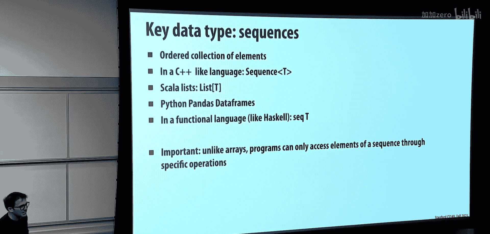

到目前为止，我们编写的代码大多可以归结为对数组的循环操作。数据并行思维的核心是：**将计算表达为对数据集合（序列）的一系列标准操作**，并假设这些操作本身已有高效的并行实现。

## 核心原语操作 ⚙️

以下是数据并行编程中几个最核心的原语操作。

### 映射 (Map) 🗺️

映射操作将一个函数应用到输入序列的每个元素上，产生一个输出序列。这是我们最熟悉的操作。

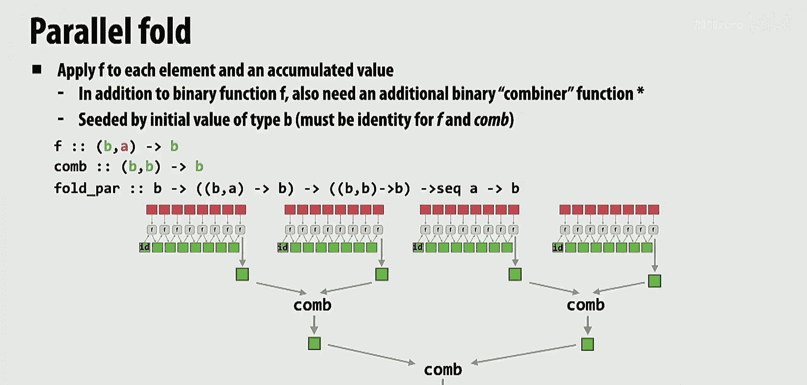

**定义：**
`map :: (A -> B) -> Seq A -> Seq B`

**代码示例 (伪代码)：**
```python
# 函数 f: x -> x + 10
输入序列 A = [1, 2, 3, 4]
输出序列 B = map(f, A) # 结果为 [11, 12, 13, 14]
```

**并行性分析：**
映射操作是**天然并行**的，因为每个元素的处理相互独立，没有依赖关系。实现时，可以将序列分割成多个子序列，分配给不同的处理器或线程并行处理。

### 折叠 (Fold) 📦

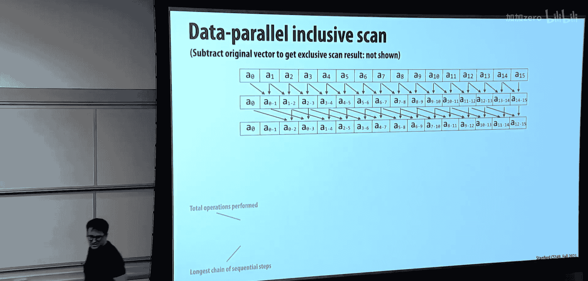

折叠操作（也称为归约）将一个二元结合操作符重复应用于序列的所有元素，最终产生一个单一的结果，例如求和、求最大值。

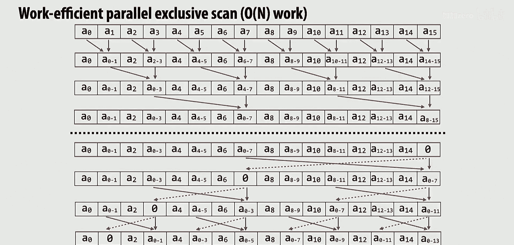

**定义：**
`fold :: (B -> A -> B) -> B -> Seq A -> B`

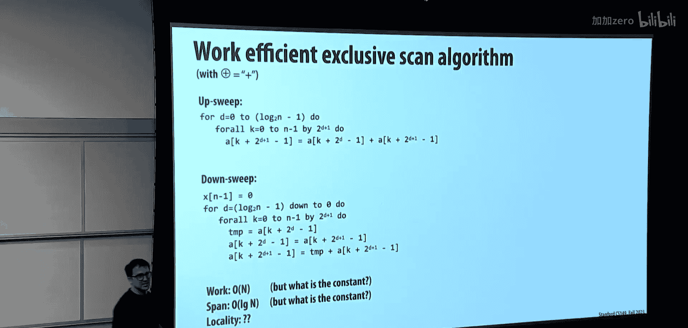

**代码示例 (求和)：**
```python
输入序列 A = [1, 2, 3, 4]
初始值 init = 0
二元操作 f = add # 加法
结果 = fold(f, init, A) # 计算 0+1+2+3+4 = 10
```

**并行性分析：**
折叠操作的并行化需要满足条件：**二元操作符必须是可结合的 (Associative)**。例如，加法 `(a+b)+c = a+(b+c)` 满足结合律，因此可以并行求和。实现时，可以将序列分割，各线程计算局部和，然后再合并这些局部和。

### 扫描 (Scan) 🔍

扫描操作是折叠的“扩展”版本，它计算并输出所有“前缀”结果，而不仅仅是最终结果。例如，前缀和 (Prefix Sum)。

**定义 (包含性扫描)：**
`scan :: (A -> A -> A) -> Seq A -> Seq A`
对于序列 `[a0, a1, a2, ...]`，输出 `[a0, a0⊕a1, a0⊕a1⊕a2, ...]`，其中 `⊕` 是二元操作符。

**代码示例 (前缀和)：**
```python
输入序列 A = [1, 2, 3, 4]
二元操作 f = add
输出序列 = scan(f, A) # 结果为 [1, 3, 6, 10]
```

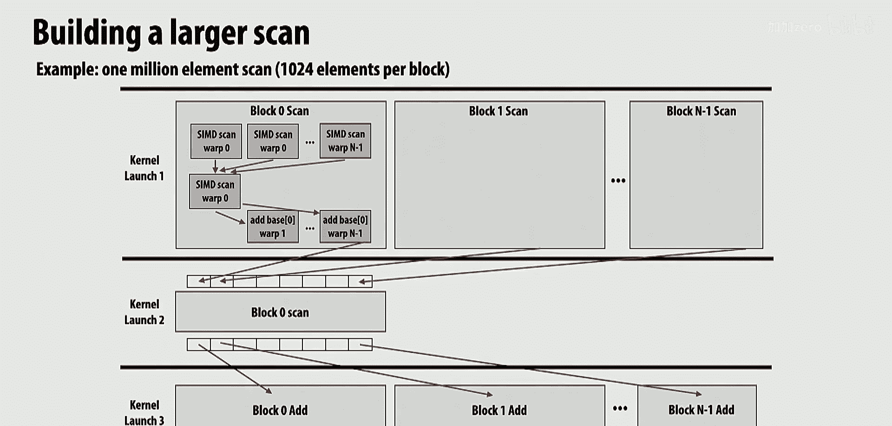

**并行性分析：**
扫描的并行化比折叠更复杂，因为元素间存在依赖关系。存在经典的并行扫描算法（如Blelloch算法），其工作复杂度为 O(n)，并行跨度 (Span) 为 O(log n)。该算法分为“上扫”(Upsweep)和“下扫”(Downsweep)两个阶段，通过树形结构高效计算所有前缀。

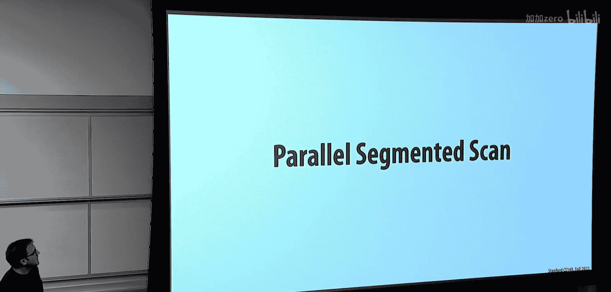

**实现考量：**
算法的选择取决于硬件。在SIMD架构（如GPU warp）上，简单的 O(n log n) 算法可能因为指令一致性反而更快。而在多核CPU上，可能采用分块后混合并行与顺序的策略。

### 分段扫描 (Segmented Scan) 🧩

分段扫描是扫描的泛化，用于处理**序列的序列**（例如，图的邻接表、文档的词列表）。它对每个子序列独立进行扫描操作。

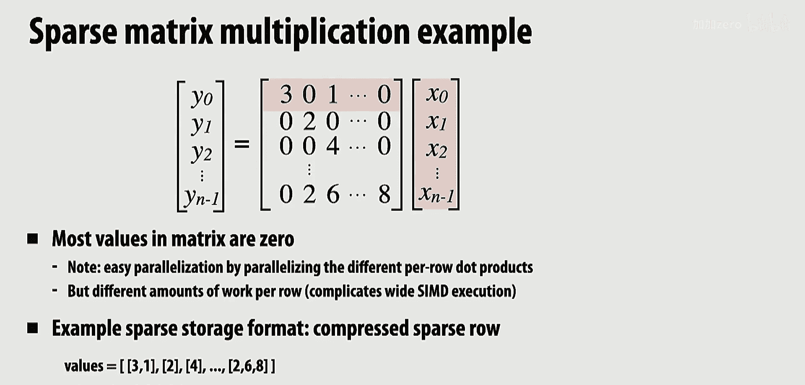

**定义：**
给定一个主序列和标记子序列起始位置的标志序列，对每个子序列进行扫描。

**应用示例：**
稀疏矩阵向量乘法 (SpMV)。使用分段扫描可以高效地并行计算矩阵每一行与向量的点积，即使每行的非零元素数量不同。

### 聚集与散播 (Gather & Scatter) 📥📤

这两个是数据移动原语。
*   **聚集 (Gather)**：根据索引序列，从源数据序列中收集对应位置的元素，形成一个新的密集序列。
*   **散播 (Scatter)**：根据索引序列，将数据序列中的元素放置到目标序列的指定位置。

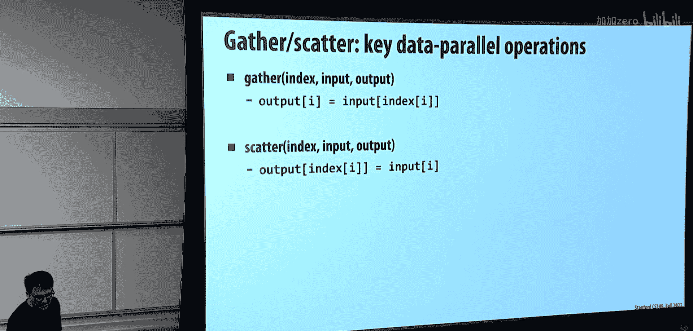

**硬件支持：**
现代CPU的SIMD指令集（如AVX2）支持向量化聚集操作。高效的散播实现更具挑战性，有时可以通过排序、分段扫描等原语组合来实现。

## 数据并行思维的应用实例：粒子网格构建 🎯

上一节我们介绍了一系列数据并行原语。本节中，我们来看看如何运用这些原语解决一个实际问题：为大量粒子构建空间网格索引。

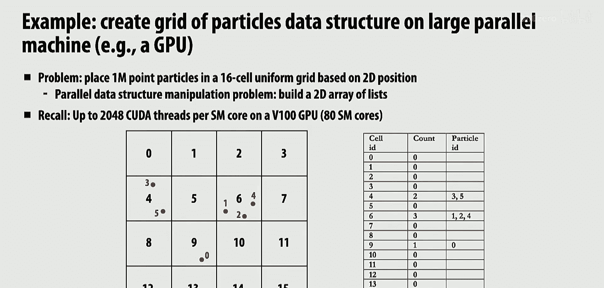

**问题描述：**
将空间划分为网格（例如4x4=16个单元格），对于数百万个粒子，需要快速构建一个数据结构，使得对于每个网格单元格，我们能立即获取位于其中的所有粒子列表。

**传统线程化方法的挑战：**
如果为每个粒子分配一个线程，并尝试将其添加到对应单元格的列表中，会导致对共享列表或锁的激烈竞争，可扩展性差。

**数据并行解决方案：**
以下是使用数据并行原语的解决步骤：
1.  **Map**：为每个粒子并行计算其所属的网格单元格ID。
2.  **Sort**：根据单元格ID对粒子索引进行排序。排序后，属于同一单元格的粒子在序列中连续排列，实现了“分组”(Group By)的效果。
3.  **Map**：再次并行遍历排序后的序列，通过比较相邻元素的单元格ID，找出每个单元格组的起始位置。
4.  **输出数据结构**：现在我们得到了两个数组：`cell_starts` 和 `cell_ends`。对于单元格 `i`，`particles[cell_starts[i] : cell_ends[i]]` 就是位于其中的所有粒子索引。

这个方案完全并行，并行度与粒子数量成正比，且避免了锁竞争和重复遍历。

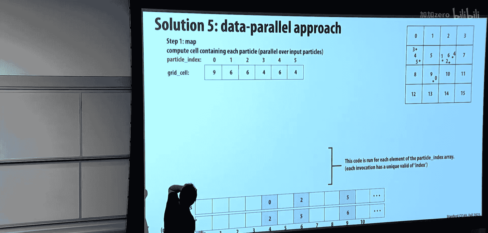

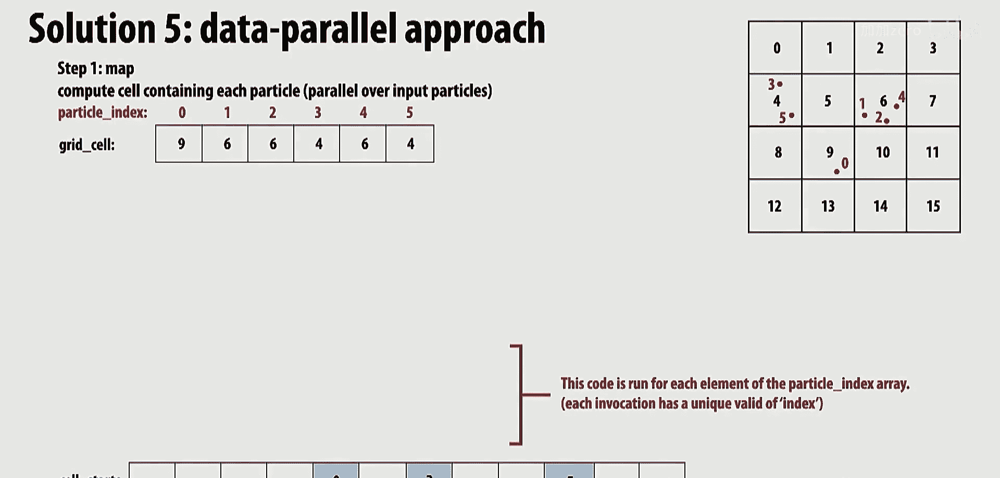

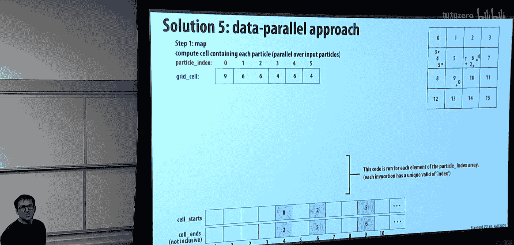

## 总结与延伸 📚

本节课中我们一起学习了数据并行编程思维。其核心思想是将复杂算法分解为 `map`、`fold`、`scan`、`sort` 等已知可高效并行实现的原语操作。通过这种方式，程序员可以从繁琐的线程管理和依赖分析中解放出来，专注于算法逻辑，并能自然地获得良好的可扩展性。

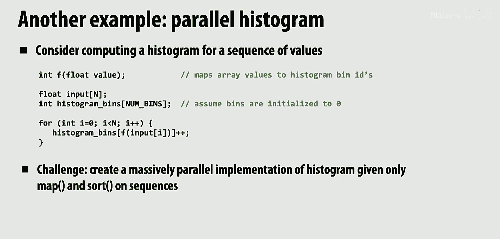

这种范式被广泛应用于许多现代并行框架中：
*   **GPU编程**：NVIDIA的Thrust库提供了类似的数据并行原语集合。
*   **分布式计算**：Apache Spark的核心抽象RDD (Resilient Distributed Dataset) 及其操作（如 `map`、`reduceByKey`）正是基于这一思想，从而实现了跨集群的并行、容错的数据处理。

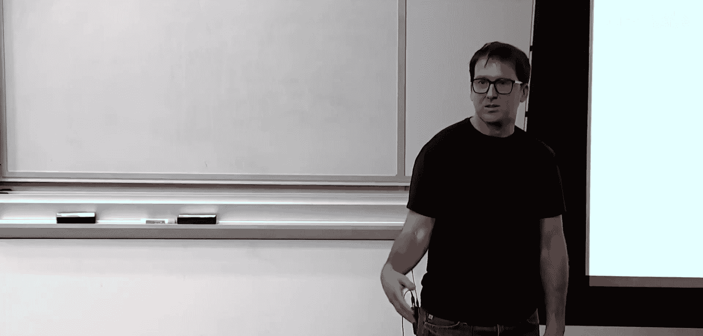

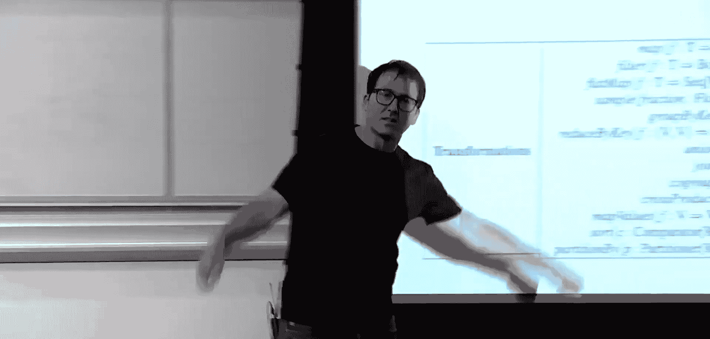

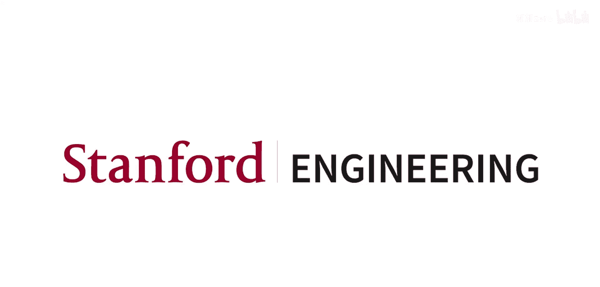

在接下来的编程作业中，你将有机会实践这些概念，例如实现并行扫描算法，并体验数据并行思维如何简化并行程序的设计。