# 009：使用 Spark 进行分布式数据并行计算


在本节课中，我们将要学习如何使用 Spark 进行分布式计算。我们将探讨如何将数据并行编程思想应用于由多个独立操作系统实例组成的分布式计算机系统，并理解 Spark 编程模型的核心概念。

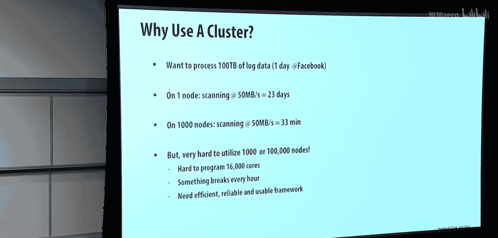

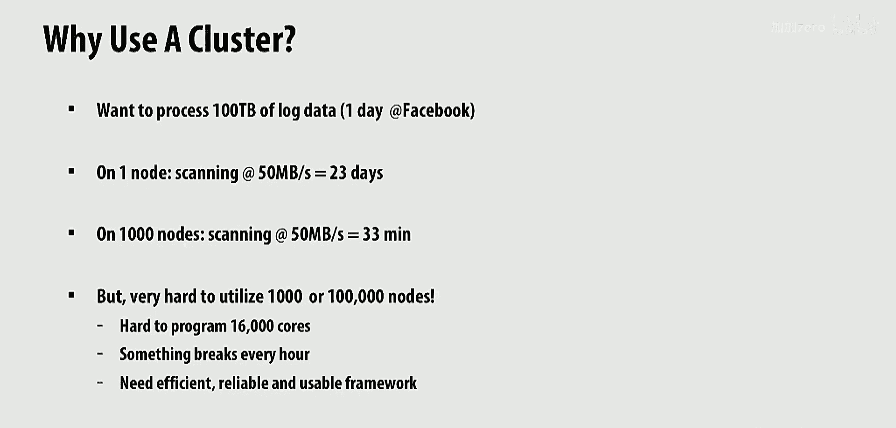

## 概述：分布式计算与 Spark

在之前的课程中，我们学习了如何优化单芯片多核的并行性能，以及如何使用 CUDA 编写拥有成千上万线程的数据并行程序。今天，我们将思考如何利用数据并行编程思想来编程一个分布式计算机系统，即由多个独立操作系统实例组成的计算机。

我们将要讨论的主要编程模型是 **Spark**。我们的目标是理解如何让数据并行编程模型扩展到数十万个核心，并高效地处理故障和内存使用问题。

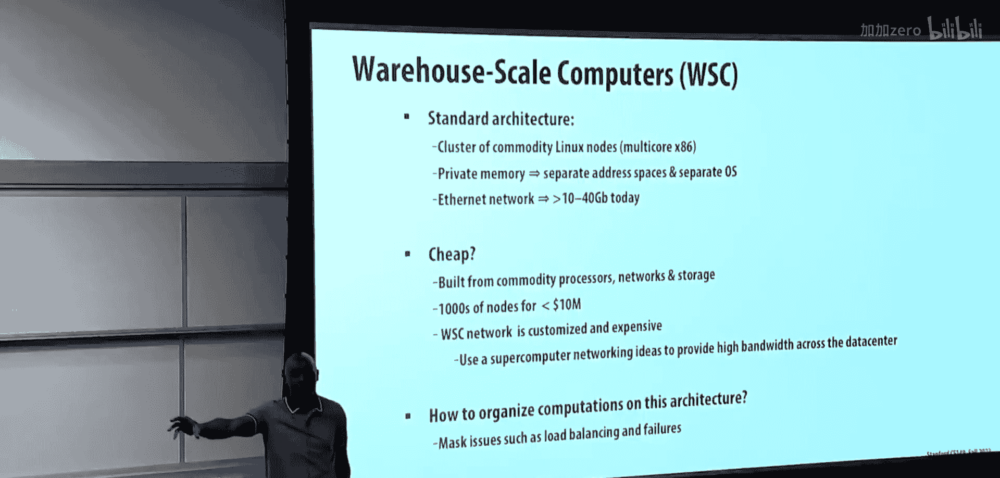


## 为什么需要分布式集群？

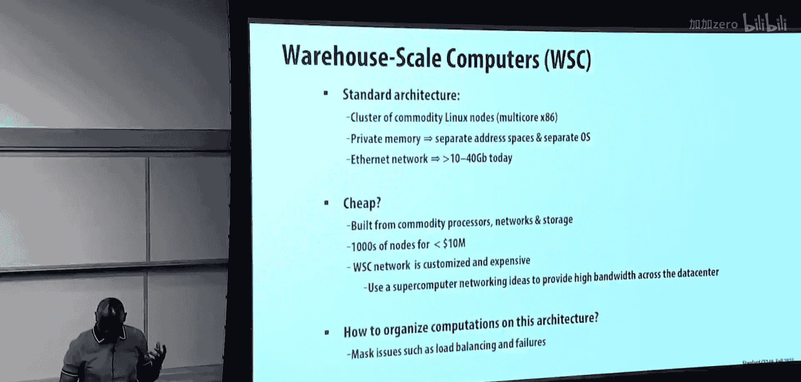

使用机器集群而非单机的主要动机在于处理海量数据。例如，处理像 Facebook 这样大型网站的日志数据，可能涉及数百 TB 的数据。如果使用单节点处理，其性能将受限于磁盘 I/O 带宽。假设 I/O 速率为 50 MB/s，处理这些数据可能需要 23 天。然而，如果使用 1000 个节点，存储系统的带宽将提升一千倍，处理时间可缩短至 33 分钟。

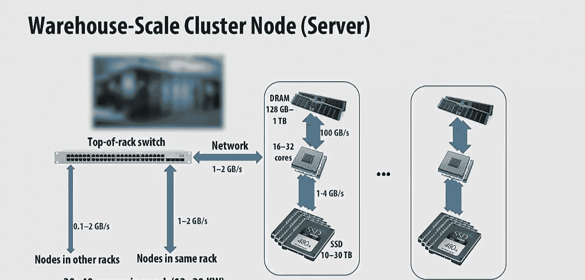

因此，使用集群的一个关键原因是为了获得足够的 **I/O 带宽**。但随之而来的挑战是如何编程管理这数十万个核心，并处理系统中可能出现的故障。

## 仓库级计算机

集群的概念已发展为 **仓库级计算机**，这是谷歌、Facebook、亚马逊等大型网站背后的计算基础设施。这些系统由成千上万的计算机通过网络连接组成一个统一的计算环境。

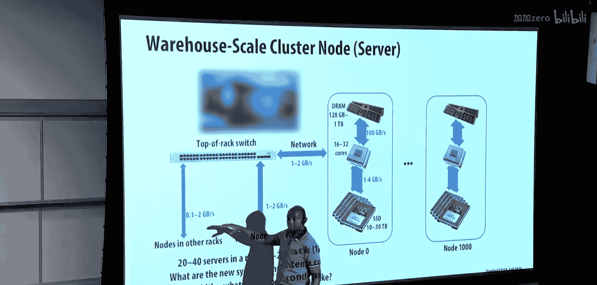

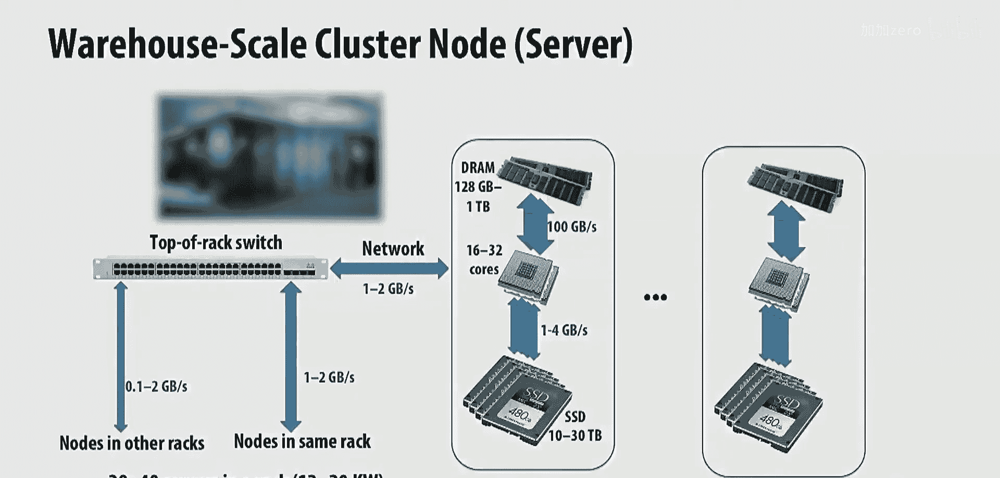

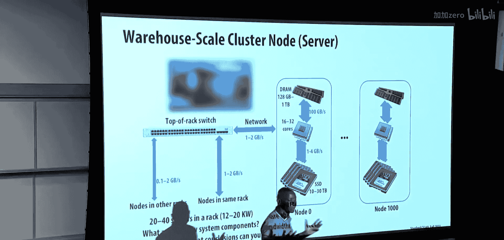

最初，集群由通过以太网连接的商用 PC 组成，成本相对较低。但随着应用发展，人们发现网络性能是区分集群与超级计算机的关键。因此，现代的仓库级计算机开始采用定制化的高性能网络，其成本也逐渐接近高性能计算领域。

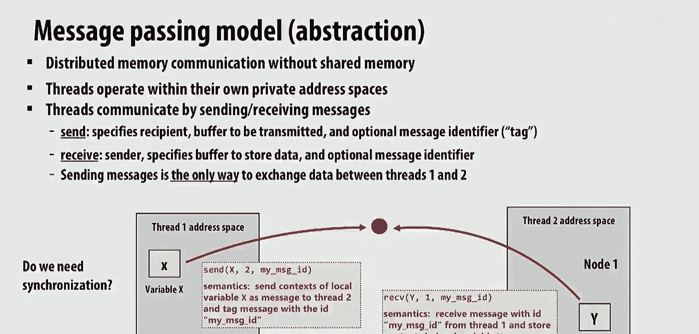

## 系统架构与节点组织

在仓库级计算机中，计算机被组织成机架。每个机架顶部有一个 **机架顶部交换机**，用于连接系统中的其他机架。机架内则堆叠着 20 到 40 台服务器。

单个节点的典型配置如下：
*   **CPU**： 可能包含两个 CPU 插槽，每个芯片有 16 到 32 个核心。
*   **内存**： 连接到 DDR 芯片，提供 128 GB 到 2 TB 的主内存，带宽约为 100-200 GB/s。
*   **存储**： 固态硬盘，提供 10 到 30 TB 的存储空间。
*   **网络**： I/O 接口连接到网络。

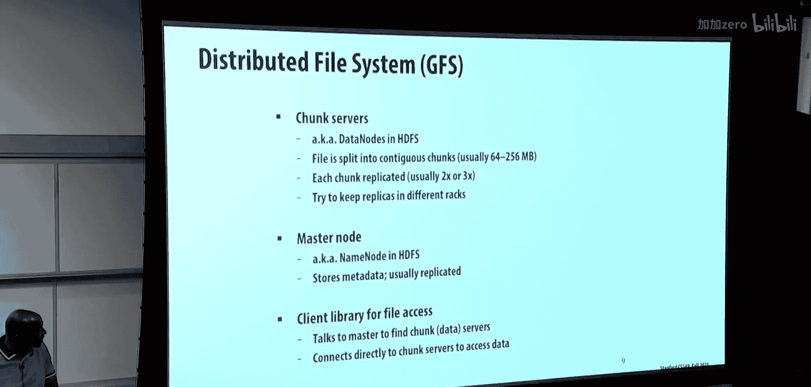

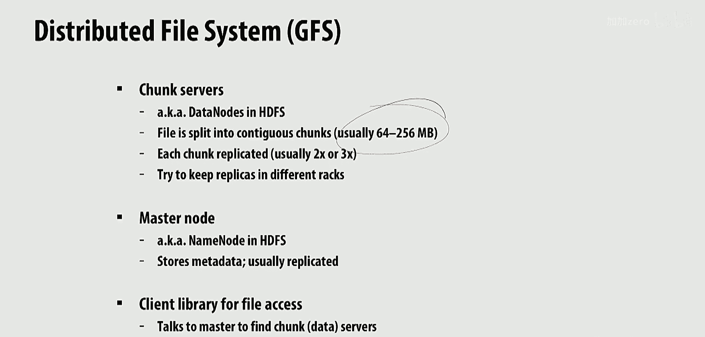

一个重要的观察是，**内存带宽**（100-200 GB/s）远高于**网络带宽**（早期可能只有 0.1 GB/s，现代可达 2 GB/s）和**磁盘带宽**（约 2 GB/s）。随着网络带宽提升，从远程节点磁盘获取数据的带宽可能与访问本地磁盘相当。

## 节点间通信：消息传递

由于集群中的每个节点运行着独立的操作系统，它们**无法共享内存**。节点间的通信需要通过 **消息传递** 机制。

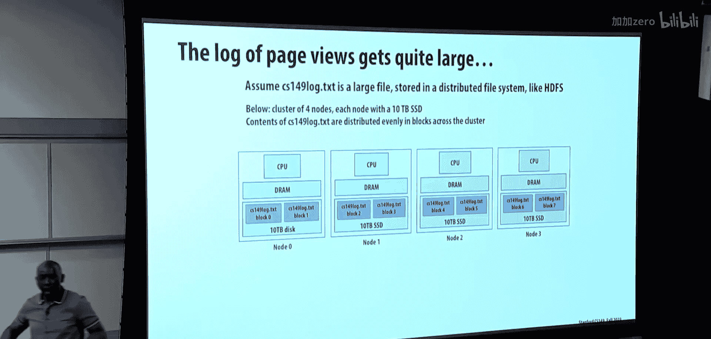

消息传递的抽象过程如下：
1.  一个线程在其地址空间中有变量 `X`。
2.  它发起一个 `send` 调用，指定变量 `X` 的地址和目标线程。
3.  消息通过网络发送。
4.  运行在不同节点上的目标线程执行 `receive` 操作，将消息存入其本地地址空间的变量 `Y` 中。


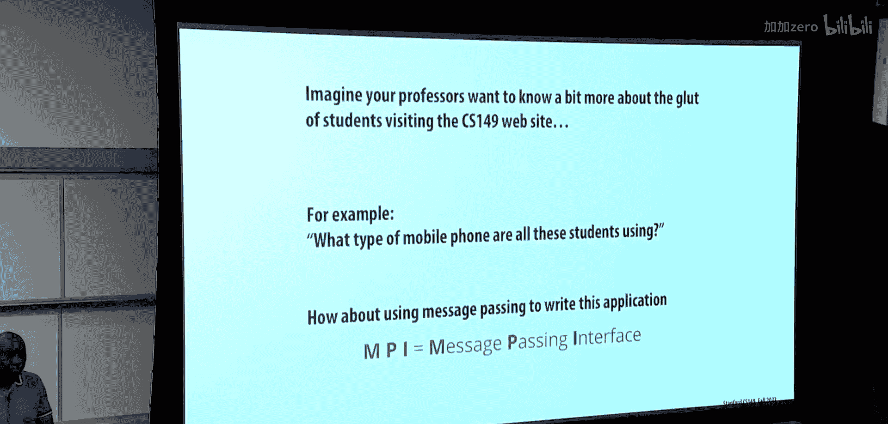

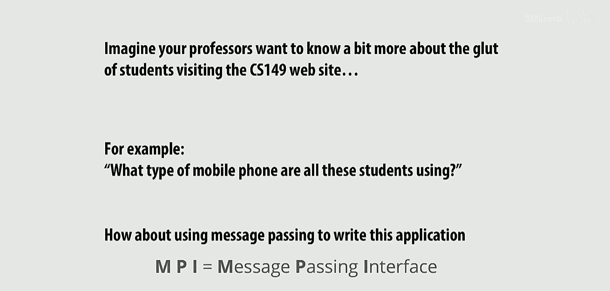

消息传递本身包含了同步语义，因此通常不需要额外的显式同步，但需要注意避免死锁。

## 数据持久化：分布式文件系统

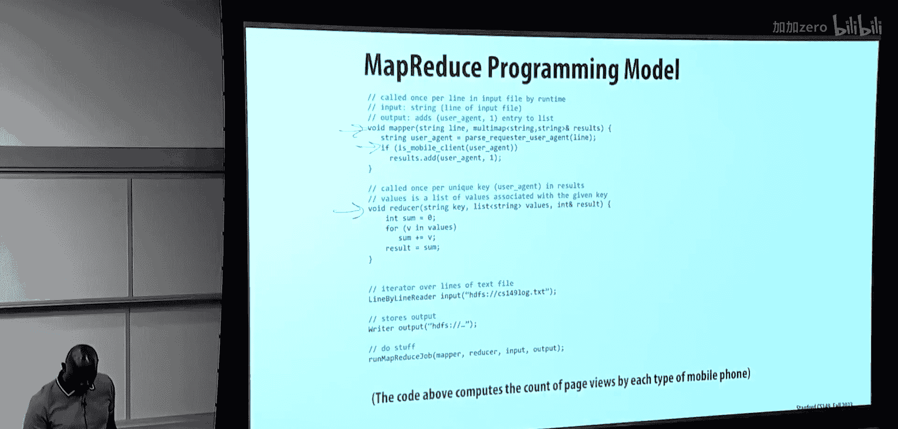

为了确保在组件故障时不丢失数据，我们使用 **分布式文件系统**，例如谷歌的 GFS 或其开源版本 Hadoop HDFS。

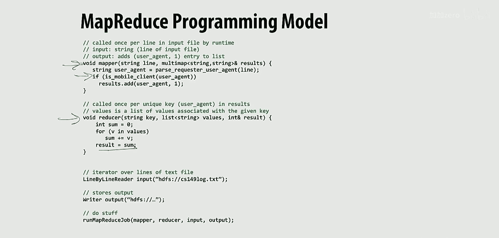

分布式文件系统的设计基于特定的使用模式：
*   **大文件**： 文件大小可达数百 TB。
*   **访问模式**： 主要是读取和追加写入，很少原地更新（例如日志数据）。

其核心思想是将大文件分割成 **块**（通常为 64-256 MB），并在不同机架上 **复制** 这些块，以防止单个机架故障导致数据丢失。一个 **主节点**（NameNode）负责管理所有块的元数据（位置信息）。客户端读取文件时，先向主节点查询块的位置，然后直接从存有该块的数据节点读取。

## 编程挑战与 MapReduce 模型

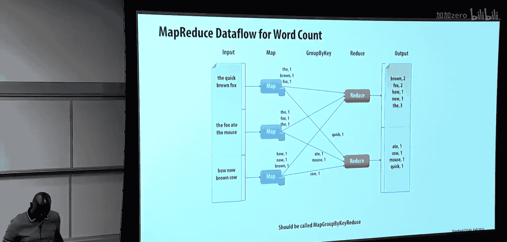

假设我们要分析课程网站的页面访问日志，了解用户使用的设备类型。我们可以将日志文件分割成块，并分布在集群的四个节点上。

虽然可以使用消息传递接口（如 MPI）来编写分析程序，但这通常很复杂且不易处理容错。因此，我们回顾 **数据并行函数式原语**，特别是 **Map** 和 **Reduce** 模型。

**Map** 操作接收一个类型为 A 的序列，并通过对每个输入元素应用一个函数，产生一个类型为 B 的序列。其重要特性是：
*   **易于并行化**： 元素间无依赖。
*   **无副作用**： 不改变输入数据。

**Reduce** 操作接收一个类型为 A 的序列，并通过一个归约函数产生一个类型为 B 的单个元素。

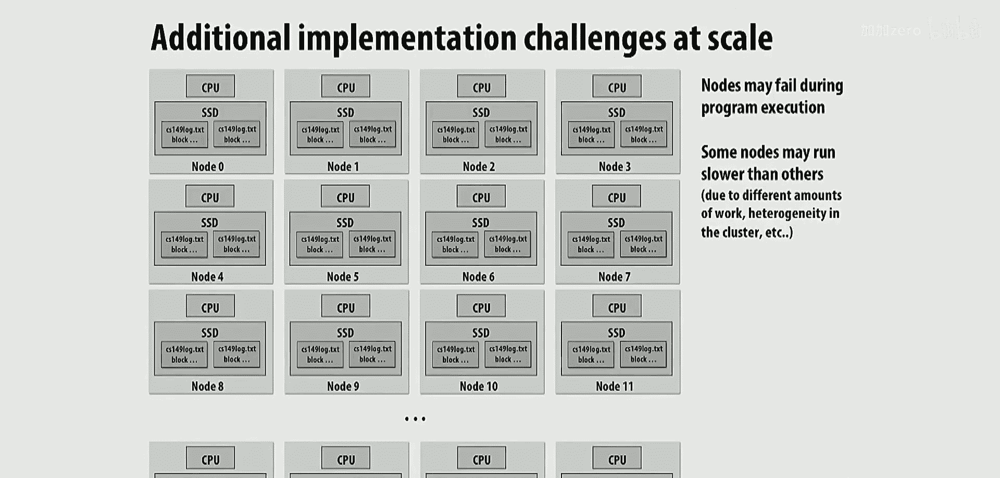

MapReduce 编程模型的核心是 **Mapper 函数** 和 **Reducer 函数**。以词频统计为例：
*   **Mapper**： 每个 Map 任务处理输入文件的一个块，读取每一行，并为每个单词生成一个键值对 `(word, 1)`。
*   **Shuffle/Sort**： 系统根据键对中间结果进行分组，确保相同键的数据被发送到同一个 Reducer。
*   **Reducer**： 每个 Reducer 任务处理分配给它的键，对相同键的所有值进行求和。

## MapReduce 的执行与容错

**任务调度**：
*   **Map 任务**： 通常调度在存储有对应输入数据块的节点上执行，以利用数据本地性，减少网络传输（特别是在网络带宽较低的早期）。
*   **Reduce 任务**： 通过哈希函数将键映射到不同的 Reducer 节点，以实现并行。调度器会考虑将 Reducer 任务分配在拥有大部分相关中间数据的节点附近，以最小化数据移动。

**容错与慢节点处理**：
*   **节点故障**： 主节点通过心跳检测节点故障。如果 Map 节点故障，调度器会在其他拥有数据块副本的节点上重新运行该 Map 任务。由于 Map 函数是无副作用的，重算安全。Reducer 节点故障处理类似。
*   **慢节点（Straggler）**： 调度器可以启动相同任务的备份副本，哪个先完成就采用哪个的结果，并终止另一个。

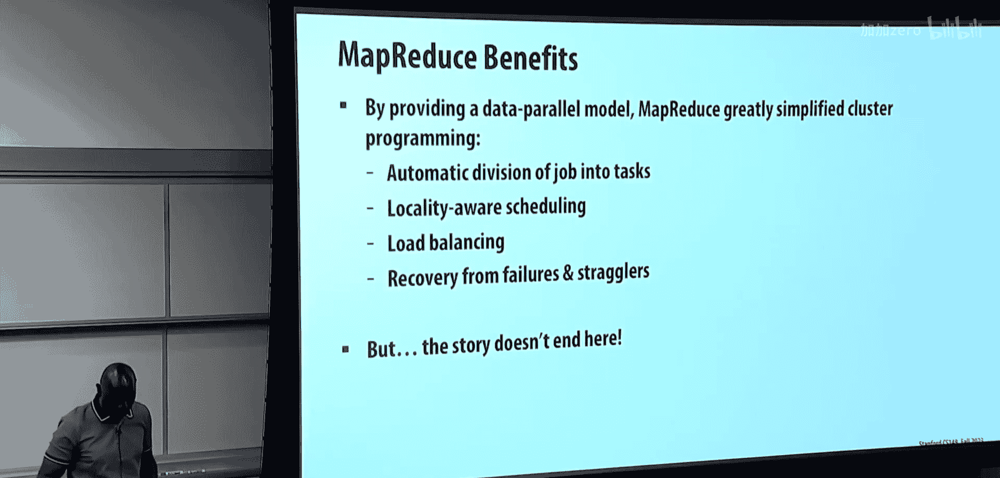

MapReduce 模型的优势在于提供了简单易懂的数据并行编程抽象，自动进行任务划分、负载均衡、本地性感知调度，并能优雅地处理故障和慢节点。

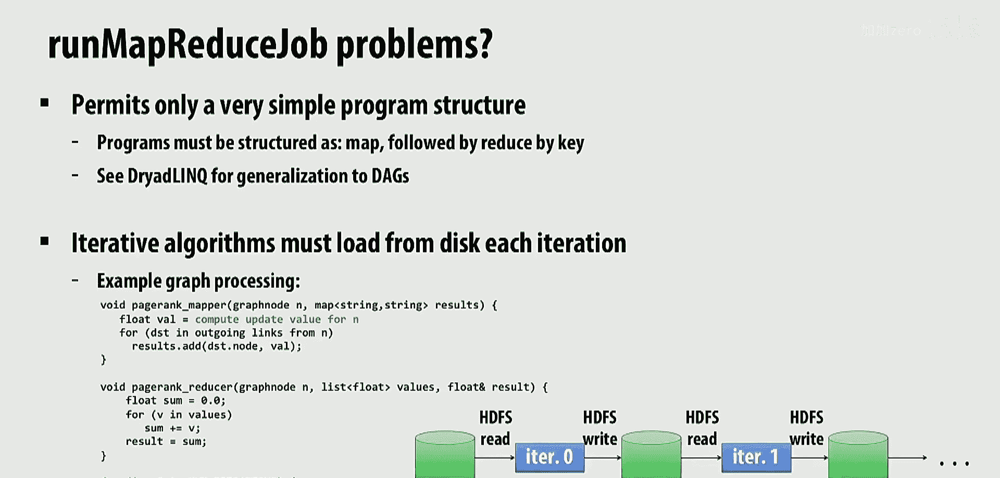

## MapReduce 的局限性与 Spark 的动机

尽管 MapReduce 影响深远，但它存在一些局限：
1.  **编程模型简单**： 仅限于 Map 后接 Reduce 的线性组合，限制了应用表达。
2.  **迭代算法低效**： 例如 PageRank 算法，每次迭代都需要从分布式文件系统读写中间数据，I/O 开销大。
3.  **交互式查询低效**： 每次即席查询都需要访问文件系统。

关键问题在于，MapReduce 严重依赖低带宽的存储I/O路径，而未能充分利用高带宽的**内存**。研究表明，许多大数据应用的工作集可以完全放入内存。因此，我们希望有一个新的编程模型，能像 MapReduce 一样友好，但能更密集地利用内存。

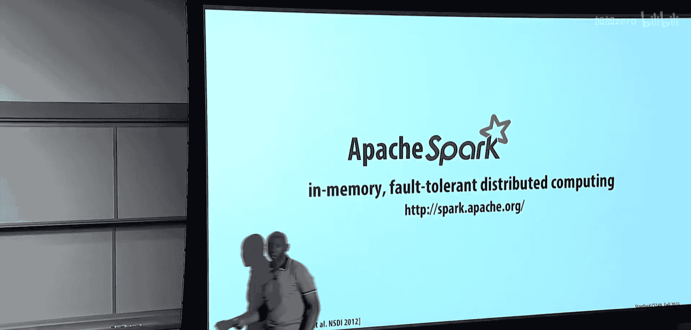

挑战在于如何实现 **内存中的、容错的分布式计算**。传统的容错方法（如检查点、日志记录）可能带来高性能开销。MapReduce 通过将中间结果写入文件系统来实现容错，但这正是性能瓶颈所在。

## Spark 的核心抽象：弹性分布式数据集

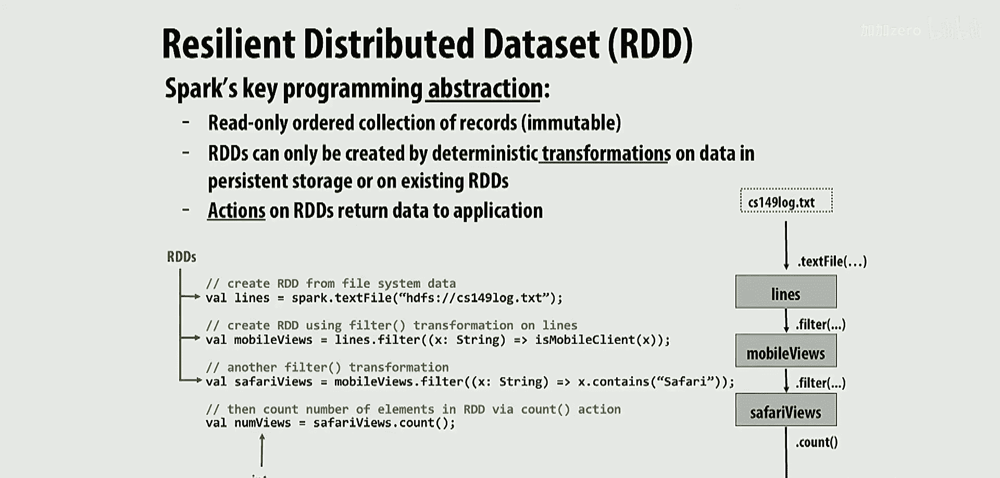

Spark 引入了核心编程抽象——**弹性分布式数据集**。RDD 是一个**只读的、分区的记录集合**，它是不可变的。RDD 只能通过两种方式创建：
1.  从持久化存储（如分布式文件系统）转换而来。
2.  通过对其他 RDD 进行**转换操作**而来。

例如，分析日志的 Spark 程序可能如下：
```scala
val lines = spark.textFile("hdfs://...") // 从文件创建 RDD
val mobileViews = lines.filter(_.contains("Mobile")) // 转换：过滤出移动端访问
val safariViews = mobileViews.filter(_.contains("Safari")) // 转换：过滤出 Safari 浏览器
val count = safariViews.count() // 动作：触发计算并返回结果
```
这里，`lines`、`mobileViews`、`safariViews` 都是 RDD。创建 RDD 的一系列操作称为 **血统**。

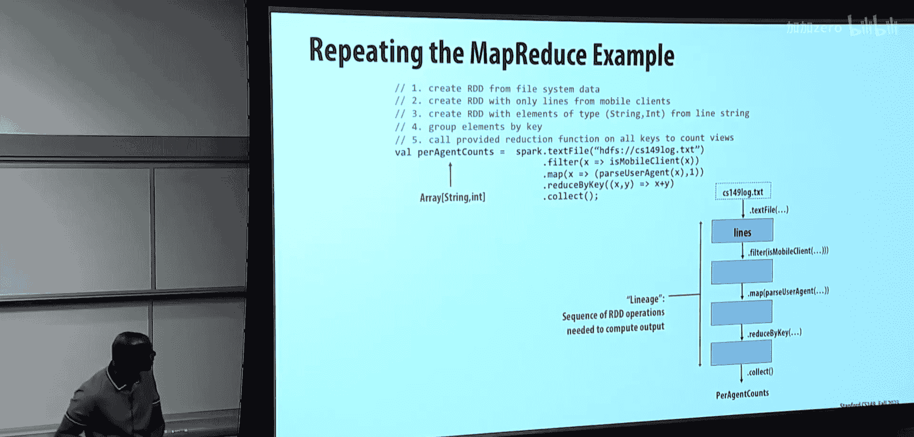

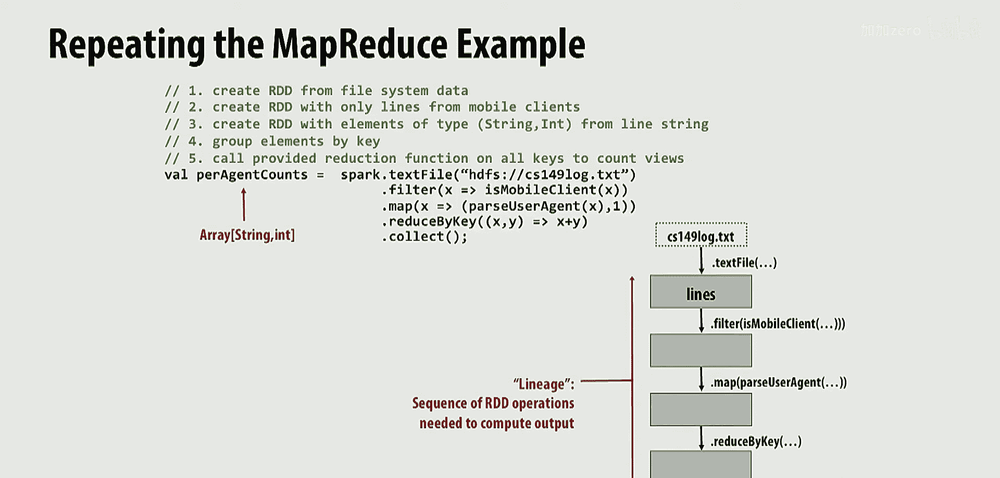

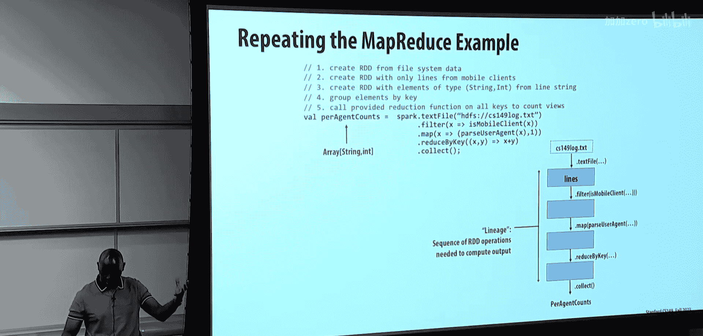

## Spark 的优化与执行

Spark 程序通过 **转换** 和 **动作** 来构建。转换（如 `map`, `filter`, `join`）是惰性的，它们只记录血统图，并不立即计算。只有当遇到 **动作**（如 `count`, `collect`, `save`）时，才会触发实际计算。

为了优化性能，Spark 允许用户将频繁使用的 RDD **持久化**在内存中：
```scala
mobileViews.persist()
```
这样，当多次使用 `mobileViews` RDD 时，就无需重新计算或从磁盘读取。

在实现层面，Spark 可以通过分析 RDD 之间的 **依赖关系** 来进行自动优化：
*   **窄依赖**： 父 RDD 的每个分区最多被子 RDD 的一个分区使用（如 `map`, `filter`）。这允许在单个节点上流水线化执行，类似于循环融合。
*   **宽依赖**： 父 RDD 的一个分区可能被子 RDD 的多个分区使用（如 `groupByKey`, `join`）。这需要数据洗牌，是更昂贵的操作。

通过利用这些高层语义信息，Spark 运行时可以自动应用诸如**融合**和**分块**等优化策略，从而减少内存使用并提高性能。

## 总结


本节课我们一起学习了分布式数据并行计算。我们从为什么需要集群开始，探讨了仓库级计算机的架构和消息传递机制。我们深入分析了 MapReduce 编程模型，包括其执行、调度和容错机制，也认识了它在迭代计算和交互式查询方面的局限性。最后，我们介绍了 Spark 及其核心抽象 RDD，了解了它如何通过内存计算、血统和依赖关系分析来提供更高效、更灵活的分布式数据处理能力，同时保持容错性。Spark 代表了在利用高层语义进行自动优化方面的重要进展。