# 010：在 GPU 上高效评估深度神经网络

在本节课中，我们将学习如何将深度神经网络的计算高效地映射到现代 GPU 和 CPU 上。我们将从理解 DNN 的基本计算模式开始，探讨如何通过算法优化、软件实现和硬件特性来提升性能。

## 课程概述与作业说明

课程进度正在加快，但每节课引入的新概念数量可能有所减少。目前阶段的核心是完成作业3，并通过实践练习来巩固对实际材料的理解。

作业3包含多个部分。前两部分是热身练习，我们会提供一个算法，你需要用 CUDA 实现它，目的是学习如何编译代码、创建线程等基本操作。作业的核心部分是最后的渲染任务。

与大多数其他系统课程不同，这个作业不仅要求实现高性能，还需要设计出能够实现并行化的算法。

以下是作业需要解决的问题：渲染一张图片。为了简化（因为这不是计算机图形学课程），图片中只能绘制圆形。

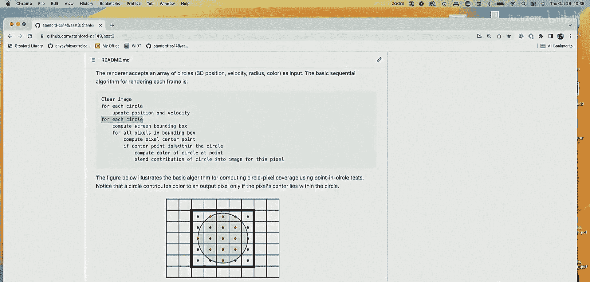

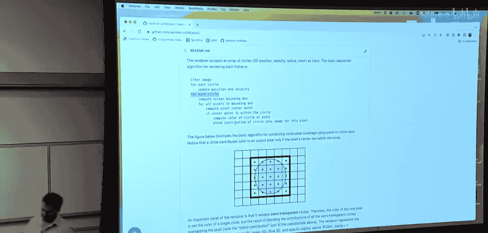

我们提供每个圆的中心坐标 (X, Y)、半径和颜色。所有图像都是由圆形构成的。

渲染的基本循环非常简单：对于给定的每个圆，计算其边界框，然后遍历边界框内的每个像素。如果像素中心位于圆内，则根据圆的颜色更新该像素的颜色。这是最简单的圆形绘制算法。

挑战在于这些圆形是半透明的。例如，一个50%透明的红色圆叠加在蓝色圆上，与蓝色圆叠加在红色圆上的效果不同，因为透明度的影响。

问题的关键在于，我们会按特定顺序（例如从后到前）提供一个圆形数组。你必须按照这个顺序处理圆形。这个顺序约束使得问题变得有趣。

例如，蓝色在绿色之上，绿色在红色之上，与不同的叠加顺序会产生不同的结果。错误的顺序会导致错误的渲染结果。

因此，游戏规则是：如果你只是顺序地执行这个嵌套循环，这是一个有效的算法。但如果你尝试并行化这个循环（例如，为每个圆分配一个不同的线程并行处理），就会得到错误答案。

第一步是确认这种并行化确实会得到错误答案，然后进行修改。在“数据并行思维”课程中，我们讨论过一些可能性。这类似于“每个粒子属于哪个格子”的问题。

关键要记住的是，只有当圆重叠且处理顺序错误时，才会得到错误答案。如果圆不重叠，处理顺序无关紧要。

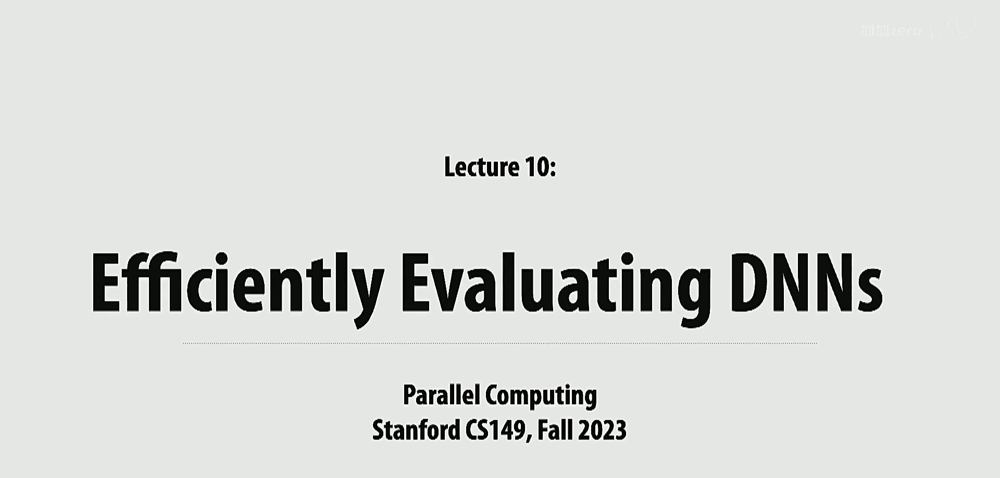

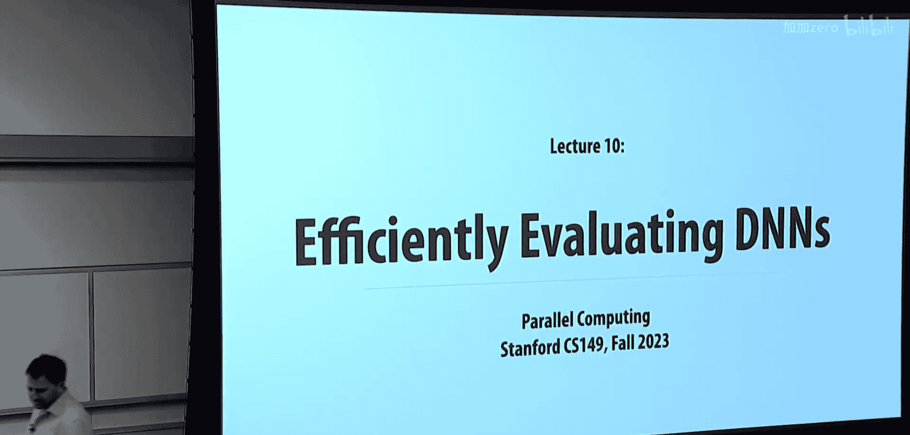

因此，第一步应该是修改代码以获得正确的答案。这个正确的答案将是并行的，但可能非常慢。然后，你的任务就是逐步优化，使其变得正确、并行且快速。这就是作业的流程。

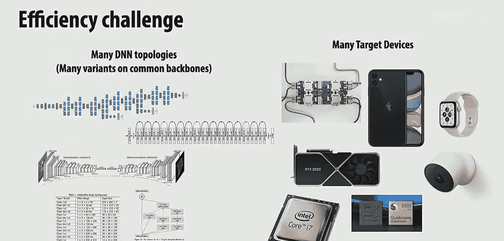

换句话说，如果你能知道每个像素可能被哪些圆覆盖，问题就基本解决了。如果你有一个神奇的数据结构，能为屏幕上的每个像素提供一个可能重叠的圆形列表，你就可以安全地并行处理每个像素。

## 深度神经网络工作负载简介

由于课程安排原因，我们今天讨论高效评估 DNN 的主题，这对作业4会很有用。考虑到如今大家都在使用各种深度神经网络，我认为这个话题会相当有趣。

我将主要讨论如何在现代 GPU 和 CPU 上高效优化和运行深度神经网络。在课程最后，我会简要提及正在兴起的、用于 DNN 加速的专用硬件，但这部分内容将留到关于专用硬件的讲座中详细讨论。

今天的内容是关于将 DNN 映射到 GPU 和 CPU。

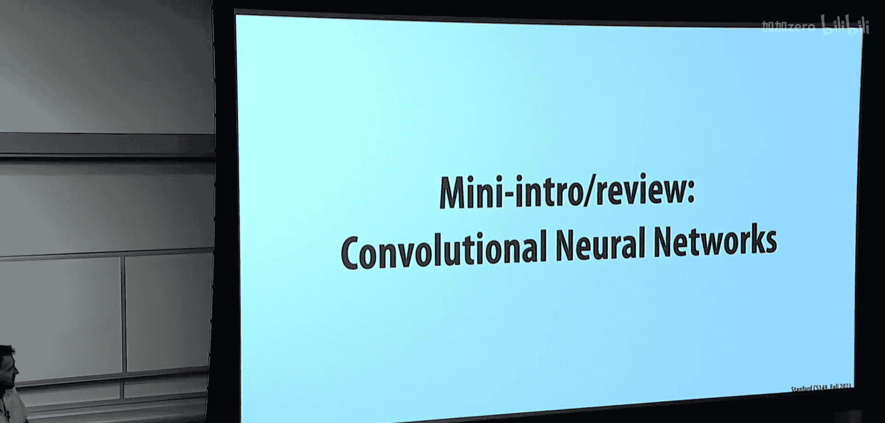

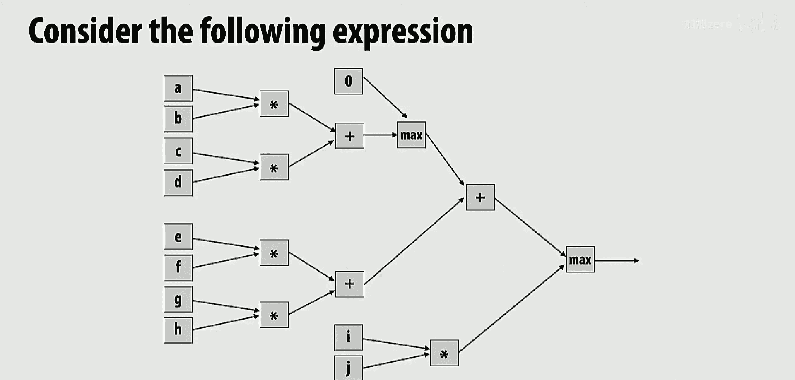

首先，为了确保所有人都熟悉 DNN 的工作负载，我需要介绍一下基础知识。我们可以用很少的数学知识来思考这个问题，这对本课程很有帮助。

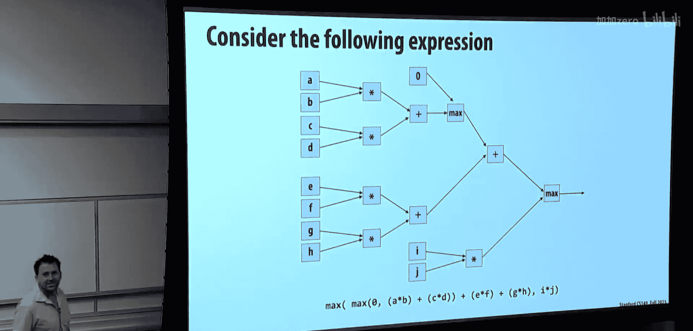

### 从计算图到神经元

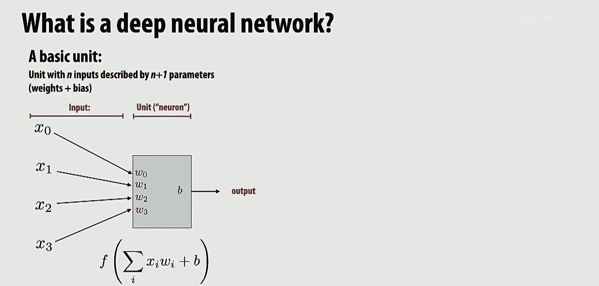

你在这门课中见过计算图。例如，在讨论超标量执行时，如果给你一个任务图，你现在就知道如何执行它。

考虑一个表达式。它基本上对应这里展示的计算：计算一些值的乘积，然后求和。仔细看，这实际上就是一个点积。

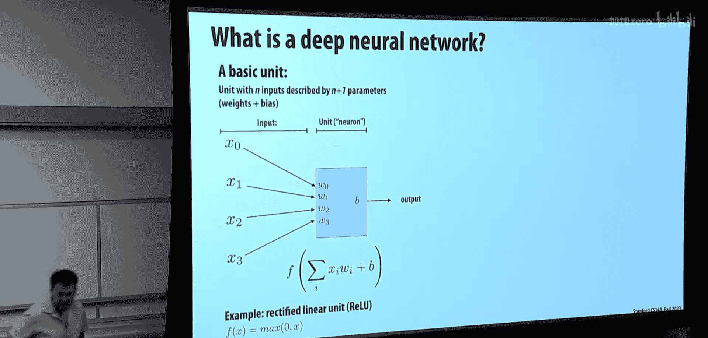

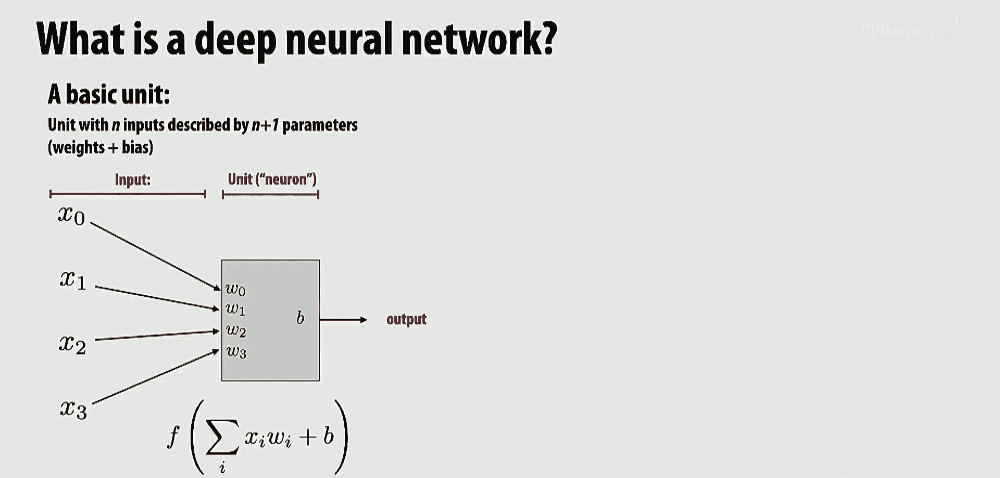

然后对这个点积的结果取最大值（max(0, value)）。如果你上过早期的深度学习课程，你会看到一个类似下图的图表，他们称之为现代深度神经网络中的一个“神经元”。

本质上，它只是一个执行特定操作的电路。在这个神经元内部，有一组权重（一个向量）和一些输入（也是一个向量）。目前我们不需要考虑这些权重的具体含义。

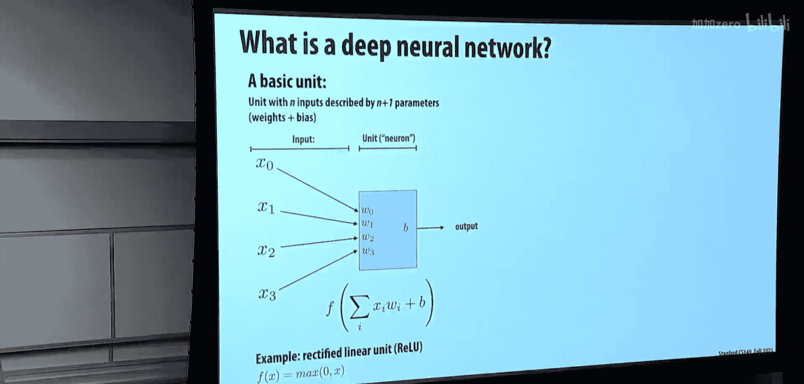

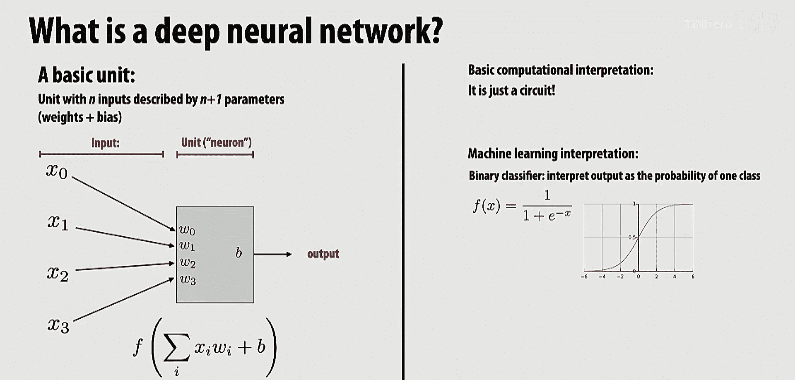

这个神经元的输出可以看作是一个函数：它计算两个向量的点积，可选地加上一个偏置向量，然后通过某个非线性函数。在本课程中，我们将使用的非线性函数是 max(0, x)。在深度学习中，你可能听说它叫“修正线性单元”，但在这里它就是 max 函数。

因此，我们今天感兴趣的是将这个整体计算（即对一个大型矩阵代数运算结果应用非线性函数 F）重复多次。

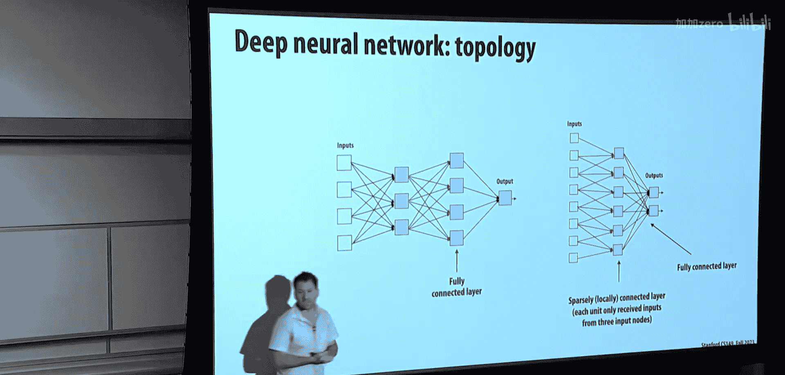

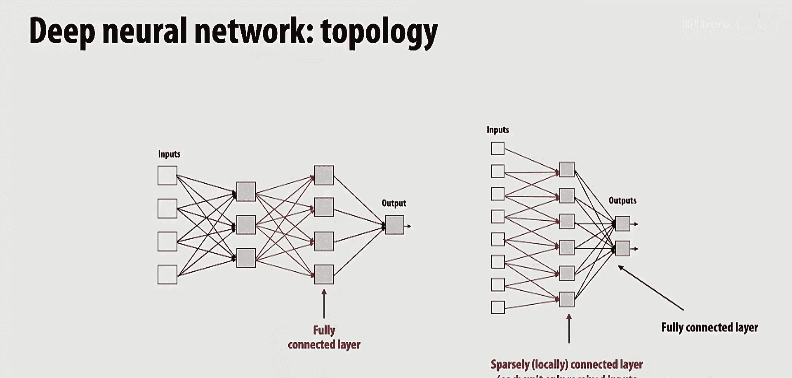

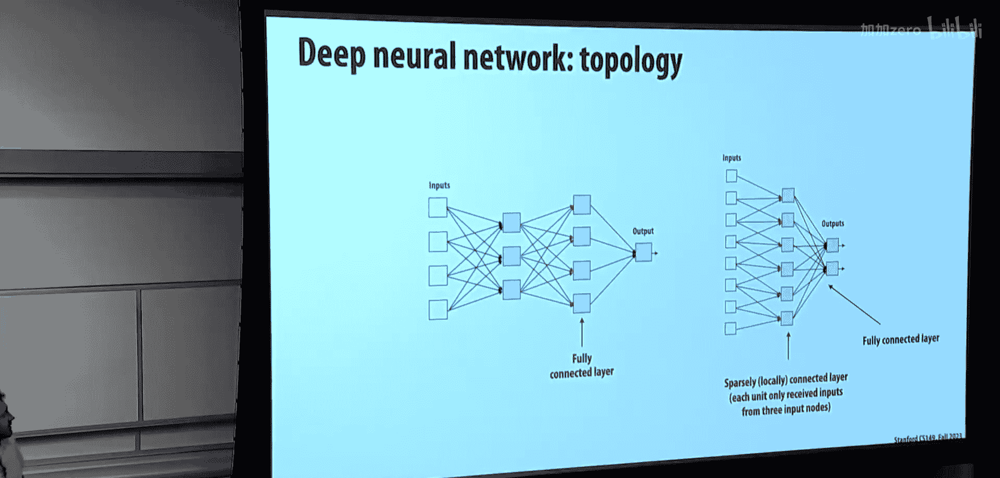

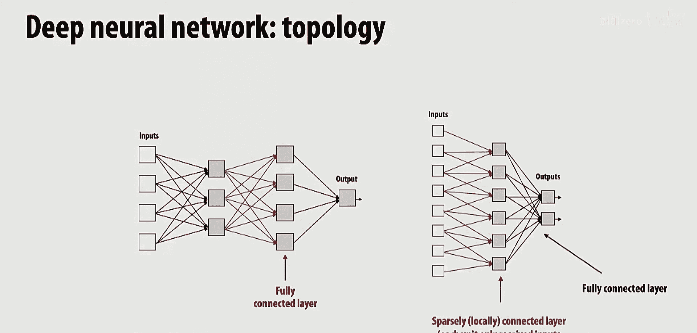

你可以把这个神经元看作一个简单的二元分类器（从机器学习角度理解）：如果输出大于0，表示“是”；小于0，表示“否”。作为计算机科学家，我们可以将这个简单函数连接起来，构建更复杂的函数。

### 网络层与连接方式

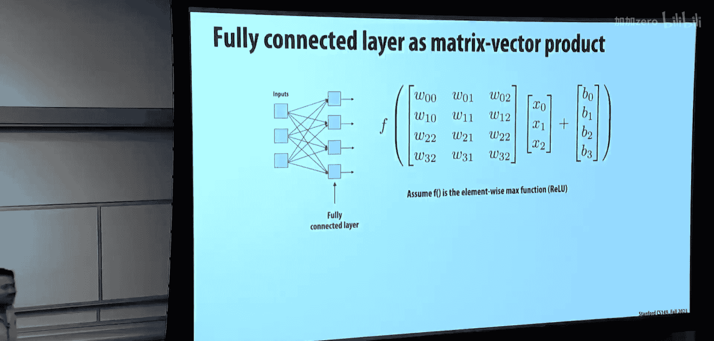

通常，这些网络以相当规则的方式排列。每一层都有一定数量的神经元，层的定义是：该层所有神经元的输出成为下一层神经元的输入。

在左侧图表中，你会看到一个全连接层的例子，意味着第 I 层的每个输出都是第 I+1 层每个神经元的输入。

在右侧图表中，你会看到一个非全连接层。实际上，这是一个一维卷积层，其中每三个输入（滑动窗口）连接到下一个神经元。

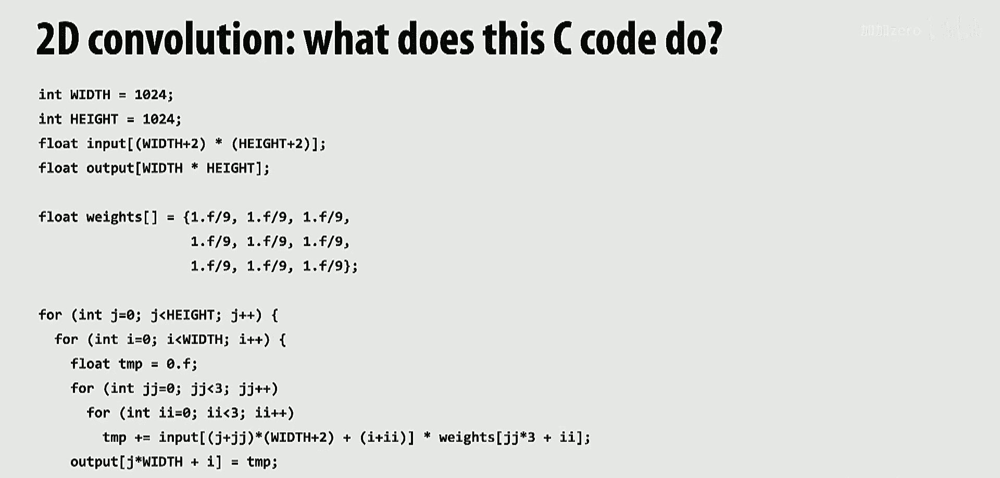

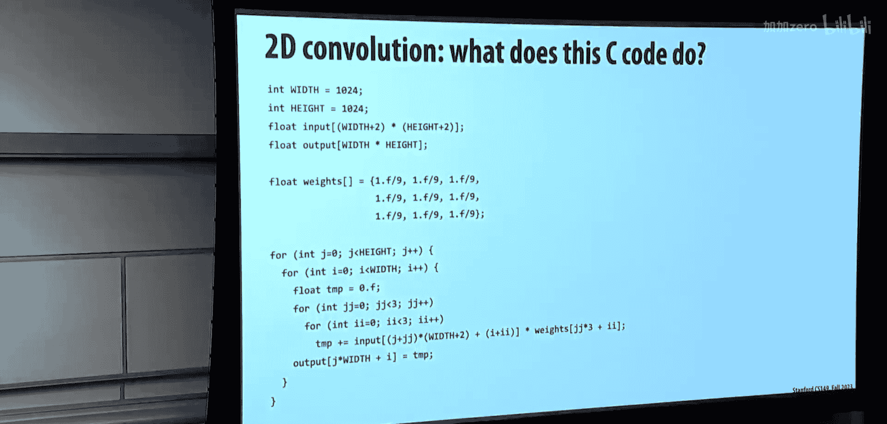

### 线性代数表示法

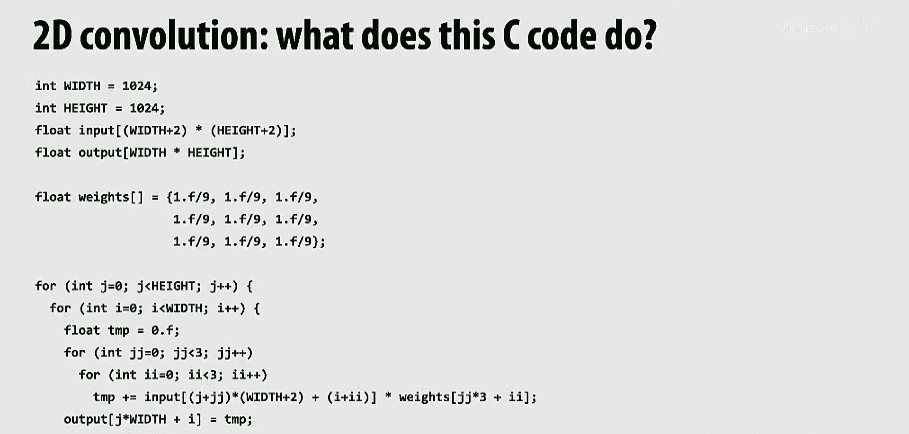

让我们换一种方式书写，使用线性代数符号，而不是视觉图表。

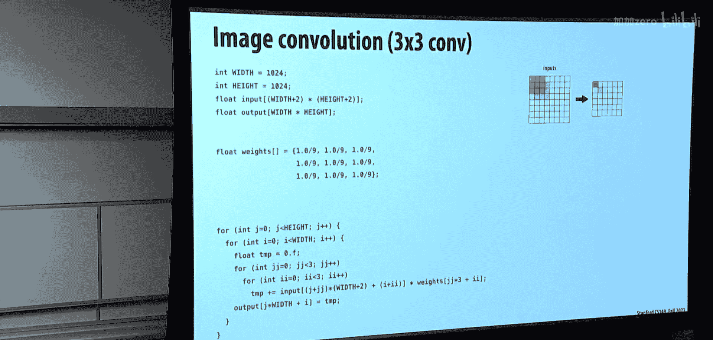

假设我有四个神经元，每个神经元有三个权重。输入向量 X 有三个值。计算输出的过程就是一个矩阵向量乘法。

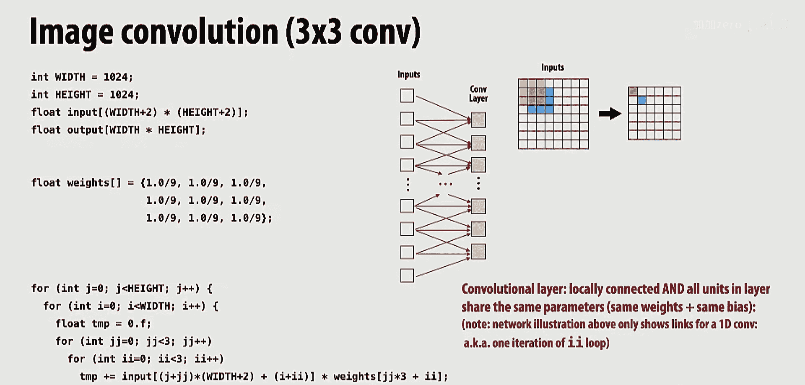

当然，结果还要通过那个非线性函数 F。因此，所有这些花哨的图表很快就可以归结为密集的矩阵代数运算。

### 卷积操作

另一种思考方式是卷积。观察这段 C 代码：有一个宽度 x 高度的输入图像（实际上宽度+2 x 高度+2，考虑边界条件），输出是一个宽度 x 高度的图像。有一些权重。对于输出的每个像素，操作涉及输入图像中周围的像素。

这段代码做了什么？有些人可能会说它执行了2D卷积。那么2D卷积又是什么意思？

假设有一个输入图像，输出图像看起来是什么样子？它是模糊的。因为每个输出像素本质上是周围像素的平均值。

想象一个场景：一个白色输入像素周围是非常暗的像素。卷积会使这个白像素的值降低到平均值，同时使周围的黑像素值升高到平均值。所以，在这张图像上运行这段代码，你会得到一张模糊的图像。这是一个卷积的例子。

### 从卷积到神经元

在脑海中思考这个图像：如果我们把每个输出像素看作一个神经元，它的输出是9个输入的加权组合（在这个例子中，权重固定为 1/9）。这就是为什么我画了这张图，显示每个神经元有三个输入（在2D情况下是9个输入）。

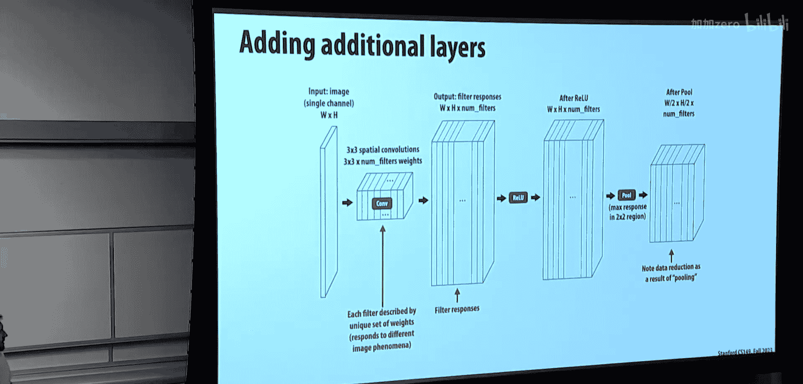

如果我改变这些权重，使其中一些为负值，会发生什么？突然之间，这个计算不再是平均每个像素，而是说：我想要这些像素的正缩放值减去那些像素的值。这突然变成了一个有限差分计算，一个梯度计算。

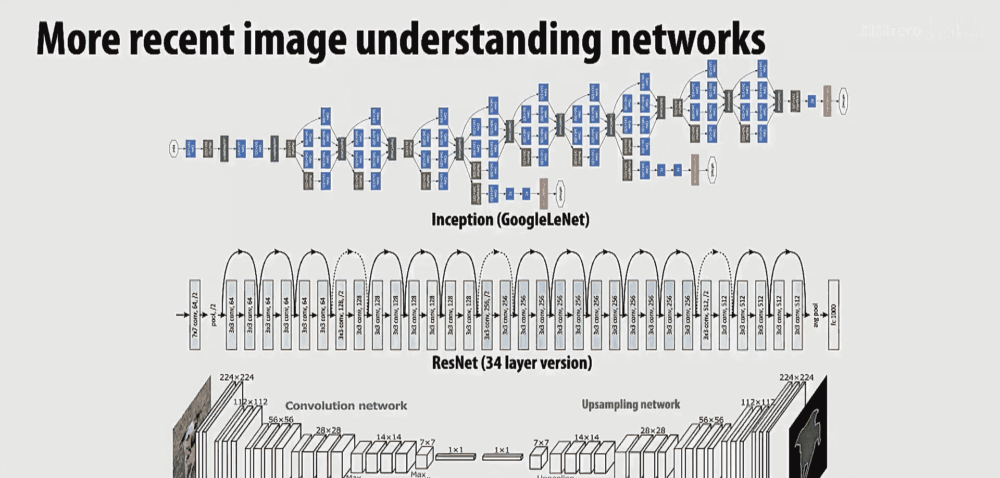

因此，使用不同的权重，我的卷积不再模糊图像，而是在检测水平梯度或垂直梯度。

至少在图像处理中，本讲座前半部分将重点讨论这些卷积操作（在图像处理中很常见）。后半部分会提到 Transformer。但所有这些常见的网络（如 ConvNets）都包含大量卷积层，只不过权重不是由我给定的，而是通过学习得到的。

### 卷积网络与张量

这是一个经典 ImageNet 权重的例子：这里可视化了许多不同滤波器的权重。这是一个 11x11 的卷积。每个输出需要输入的 121 个元素。有 96 个不同版本的这些卷积。

如果用这些滤波器处理输入图像，你会得到不同的输出。可以说，不同的滤波器在图像的不同部分被“激活”，它们检测不同的特征。

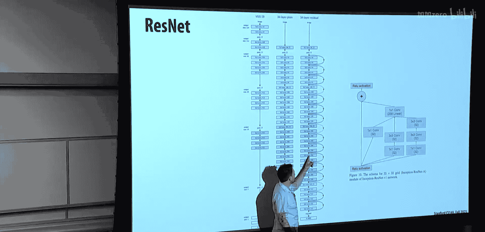

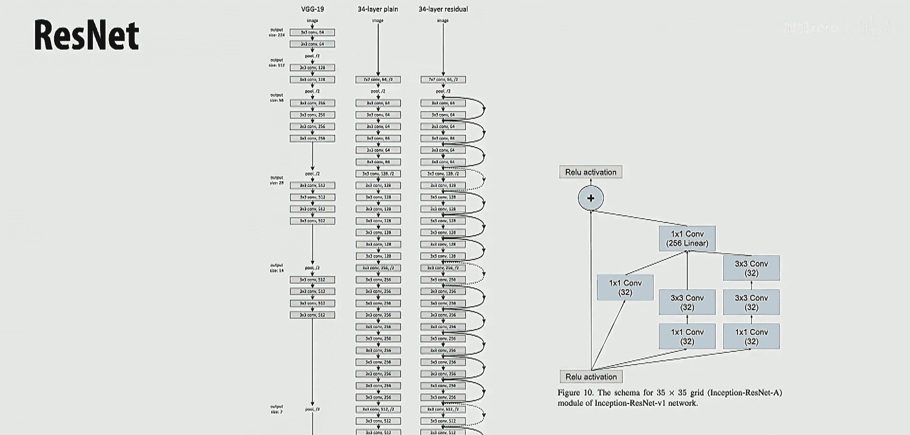

因此，我希望你把这个计算看作是：对一堆具有不同权重的不同滤波器重复执行这段代码。这就是我们要处理的任务的核心。

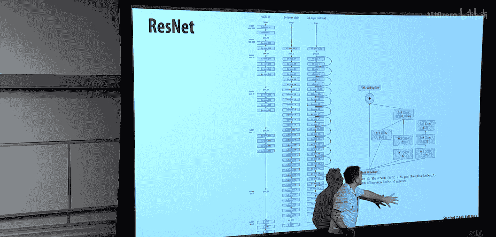

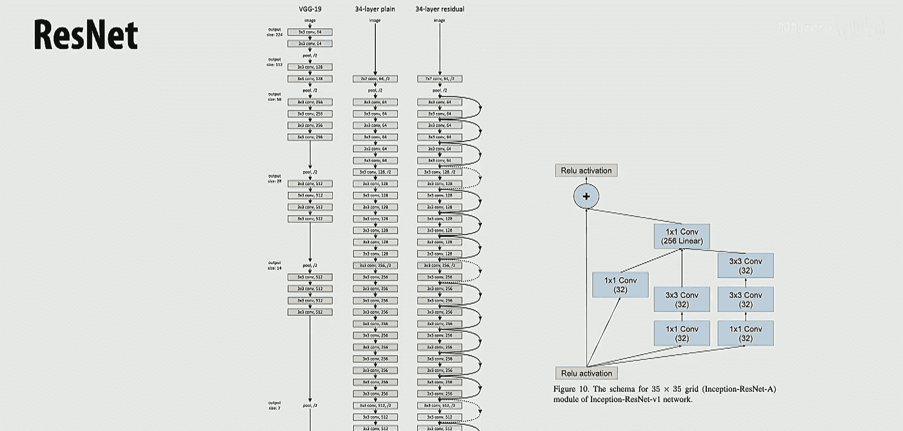

可视化这些东西的常见方式是考虑这些 N 维张量。假设你有一个宽度 x 高度的输入图像，所以是 宽度 x 高度 x 1。然后想象我有所有这些不同的滤波器（例如 3x3 的值矩阵）。如果我有 num_filters 个滤波器，为了方便，我会将它们堆叠成一个张量，即 3 x 3 x num_filters。

如果我对输入进行 num_filters 次卷积，我应该得到 宽度 x 高度 x num_filters 的输出。然后我们将一遍又一遍地重复这个过程，产生一堆滤波器，将其通过函数 F（例如将值限制在0以上），可能还会进行一些其他计算（如最大池化，本质上是下采样）。

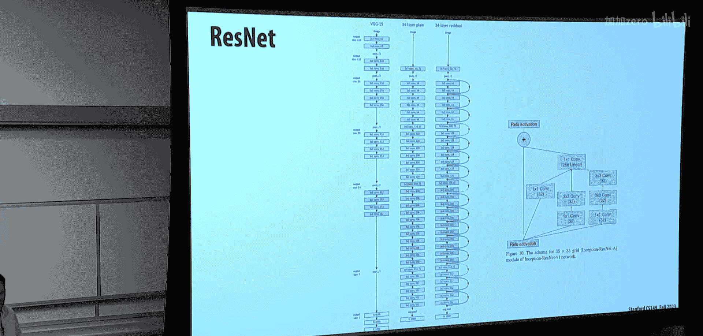

当你看到所有这些花哨的图表时，本质上，每个块主要就是这一系列卷积操作（至少是计算的核心部分），只是以不同的方式连接起来。例如，这里有 ResNet，这里有 Google 的 Inception 架构。

至此，我希望你明白：能够在一堆输入图像上执行大量卷积操作，产生一堆输出图像，然后在这些输出上再次执行卷积，这很重要。这就是你需要了解的工作负载。

## 加速 DNN 的途径

现在，让我们思考如何加速这些计算。在本课程中，这是一个很好的节点来讨论我们的途径，主要有三种：

### 途径一：算法与架构设计

第一种方式是我们上机器学习课时考虑的：设计更好的网络架构。例如，ResNet 和 Inception 所需的浮点运算次数和内存比早期现代深度学习浪潮中一些著名的 ConvNets 要少得多。显著的算法和拓扑设计改进减少了所需的内存和计算量。

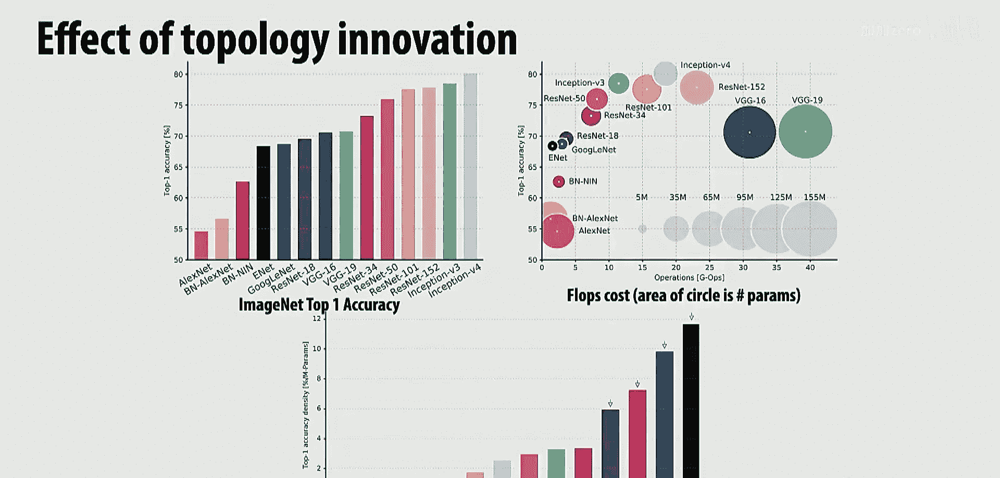

这与我在本课程中教授的技能无关。这需要你去上机器学习课，思考诸如：“随机梯度下降的方式……我觉得通过跳跃连接在几层之间传递信息很有价值”（这是 ResNet 的一大创新），或者“我不需要很多卷积，只需要几个，但必须以特定方式连接它们”。

例如，来自 Inception-ResNet 模块的设计：如果你思考需要什么，你可能会觉得需要几条 3x3 卷积路径来处理这种空间范围的特征。可能需要几级串联。可能还需要一条具有更广泛特征的路径。作为这些网络的设计师，你会思考这类事情。

如果你在 Google 设计这些网络，并且要求让它们能在手机上运行，你可能会花两年时间尝试各种组合，最终得出一个看起来像 MobileNet 的架构。这是在 2017 年左右的设计。

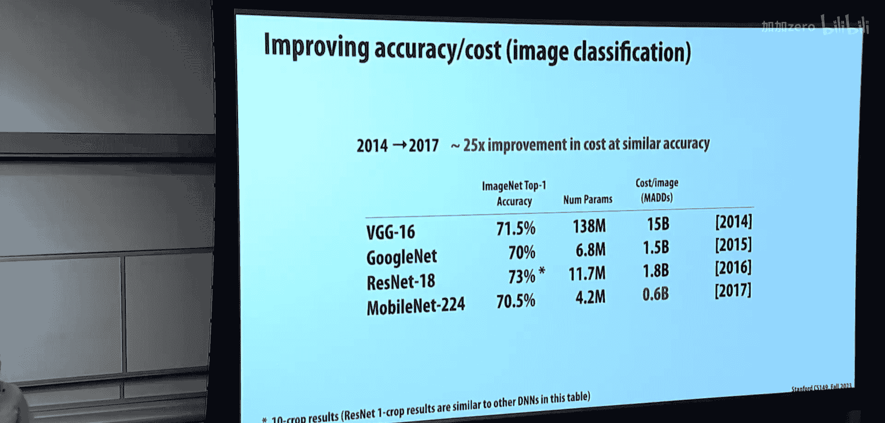

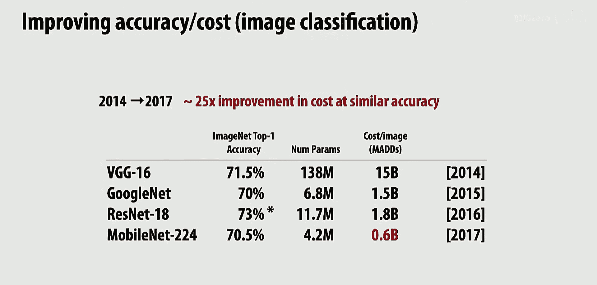

关键是，首先，许多系统课程将当下最好的架构视为给定，并尝试优化它。但我想让你记住，在算法方面，一直有巨大的创新和迭代。

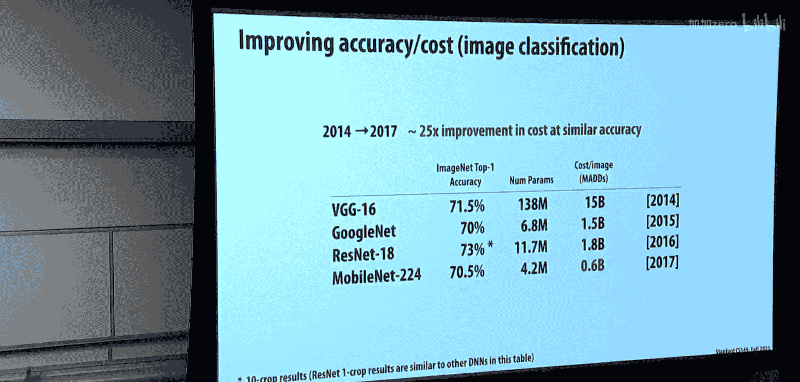

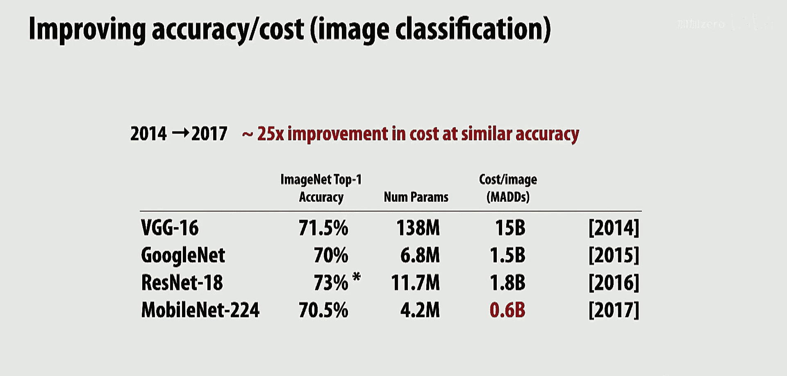

以图像分类任务为例（这很大程度上推动了深度学习的兴起）。这些是研究中人们设计的不同网络。基本上，它们的准确率随时间提高。这张图的 Y 轴是准确率（如图像中物体分类的准确度），下方图表是准确率与计算开销的比值。

更好的拓扑结构实际上是关于效率的。那张图实际上是单位成本准确率的二维图，你希望处于图的左上角。

如果我只看其中几个网络，每年都有变化。当时的准确率大致相同，但如果你看权重的数量（大致是滤波器的大小），存储模型所需的内存有显著下降，计算所需的数学运算量也有几乎相应的下降。

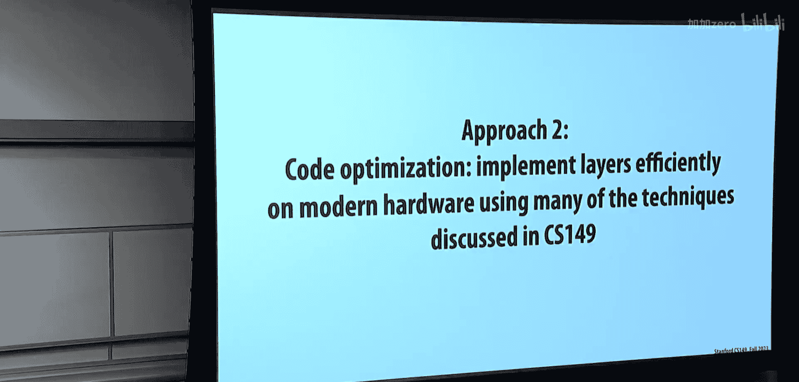

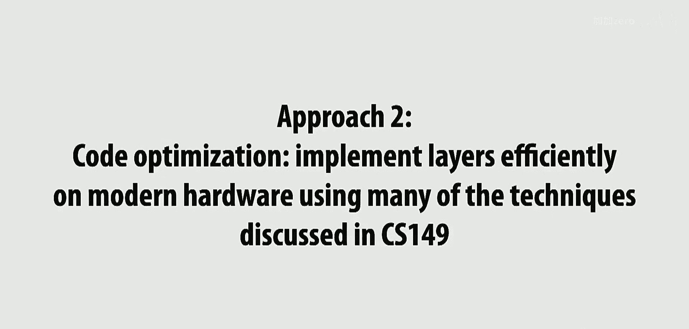

在大约四年时间里，算法带来了约 25 倍的提升。硬件不可能在四年内快 25 倍。

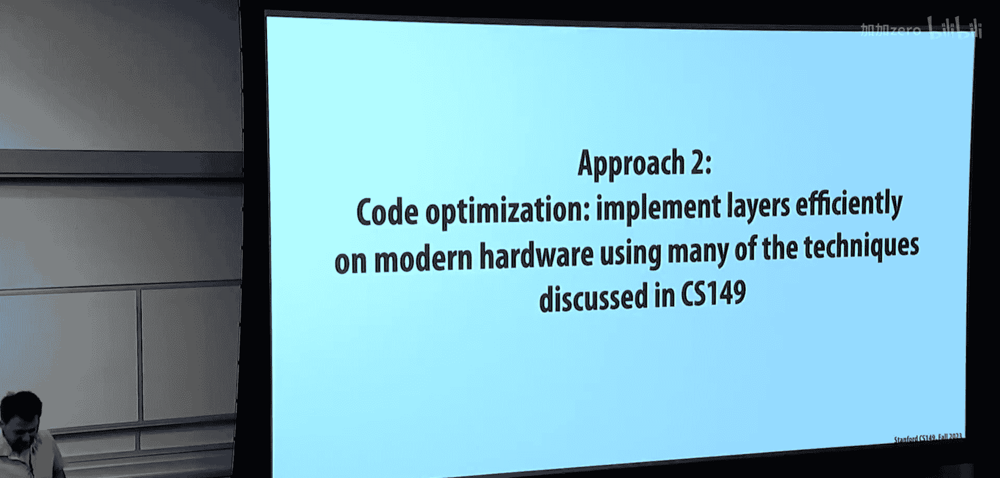

因此，如果你为某个网络设计了一个算法，当网络架构变化时，你可能已经偏离了最优路径。一个好的机器学习系统工程师必须跟踪这些前沿进展。

对于如今的大型语言模型和 Transformer，由于缩放定律，存在构建越来越大模型的巨大推动力。但在达到一定质量水平后，过去6到12个月里，随着 LLaMA 等模型的出现，工程师们开始大幅缩小这些模型。这使得“你的系统应该为什么而设计”成为一个复杂的问题。

### 途径二：在给定硬件上高效执行

第二种方式与本课程高度相关：在某个时刻，我们确定了要使用的架构和拓扑，我们需要让它在现有机器上高效执行。在本课程中，机器指的是多核 CPU 或 GPU。

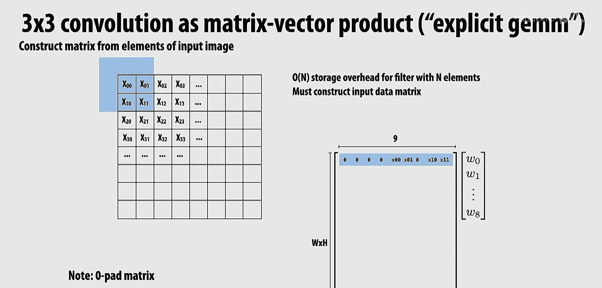

让我以 3x3 卷积为例，稍微修改 C 代码来更详细地讨论。

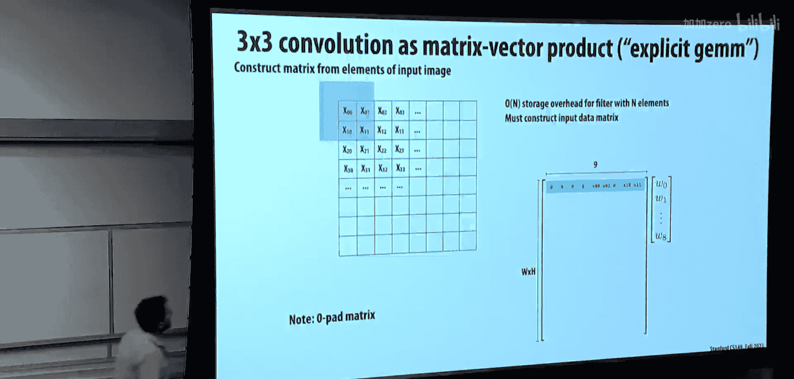

首先，现在有 7 层循环。最外层是遍历图像批次（batch size）。通常我们会一次性将多个图像输入网络。然后是遍历每个滤波器。对于每个滤波器，我们需要遍历输出像素 I 和 J。但输入图像有多个通道深度，所以你实际上是在遍历所有像素和所有 RGB 或 512 个通道等。所以这是一个3D卷积，或者说是在3D输入上的2D卷积，针对每个滤波器，每个输出像素。

因此，这里有 7 层循环。实现起来并不难，但性能可能不会很好。

现在，问题在于卷积和矩阵代数之间的联系。

让我展示一个快速技巧。你可以使用 NumPy 或你喜欢的库调用矩阵乘法。你可以假设，无论是 MATLAB、PyTorch 还是 NumPy，如果你调用矩阵乘法，已经有人花时间很好地实现了它。

所以，如果你能把某些操作归结为矩阵运算，你可能就处于一个不错的状态。

事实证明，将卷积视为矩阵乘法非常容易。早期的一些卷积层实现就是这样做的。

想象我有一个输入图像（每个 X, Y 位置有一个值）和一个 3x3 卷积（有9个权重）。每个输出像素只是这些权重与输入像素某个子集的点积。

我将把相应的输入像素复制到一个矩阵中，这个矩阵有 宽度 x 高度 行，9 列。所以这个矩阵是原始图像的9倍大。

我只是复制数据，使得输出行（或该行与此行的点积）是卷积的第一个像素。

幻灯片上展示的是如何复制值。然后考虑下一行并复制这些值。最清楚的情况可能是在没有边界条件的地方：要产生输出坐标 (1,1) 的像素，我需要输入的那9个像素，我把它们复制到这里。

卷积的输出就是那里的点积。

至此，我希望你能看到，通过适当的填充和数据复制，我可以将卷积实现为矩阵向量乘积。

检查一下你的理解：现在，想象我想用多个滤波器进行卷积，而不仅仅是一个。我的设置如何改变？这个列向量（一个卷积的权重），我只需要堆叠更多的列，它就变成了一个矩阵。所以，如果我想一次性对输入图像进行多个卷积，我只需将图像复制到左侧矩阵，我的权重作为多个滤波器的列放在那里，现在我就有了矩阵矩阵乘积。

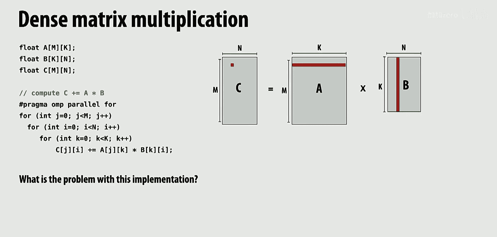

所以，如果你给我一个矩阵乘法库，我知道如何填充这个矩阵来产生输出。

再检查一下你的理解：想象输入张量不是单通道图像（每个 X, Y 只有一个值），而是有多个值（一个多维张量）。假设它有 512 个值。我的计算如何改变？因为现在每个卷积将是 3x3x512。这个设置如何改变？这会乘以 512，并且我需要 3x3x512 的权重放在下面。所以我会得到大得多的矩阵。

现在，如果你给我地球上最快的矩阵乘法，我可以为你生成输入，或者用它来执行一个卷积层。

因此，如果你有一个快速的矩阵乘法库，你可以使用我上一张幻灯片告诉你的转换来执行卷积层。

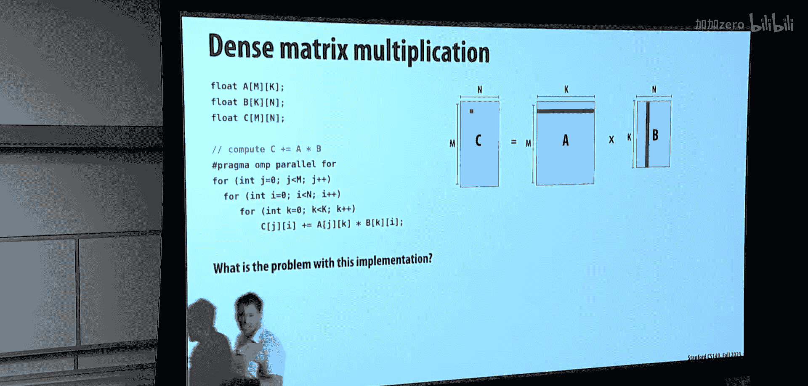

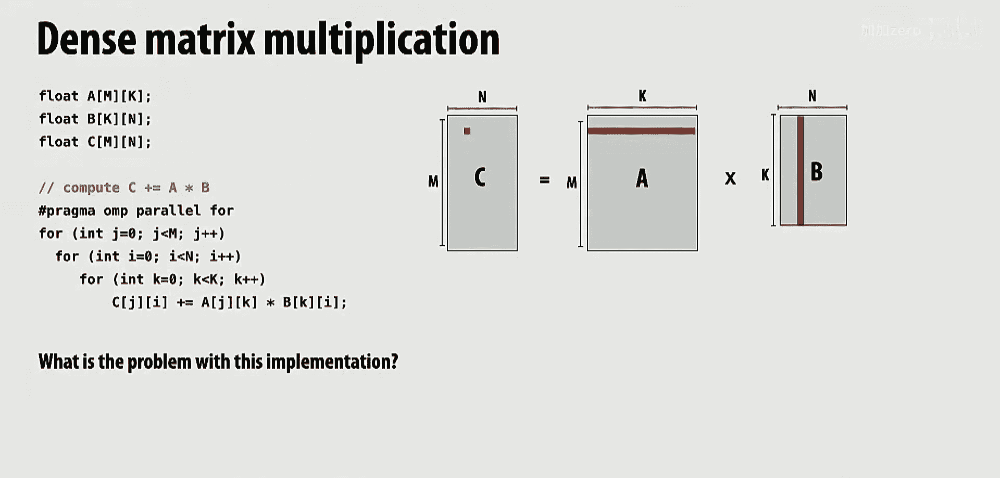

### 实现快速矩阵乘法

但也许我们应该简要讨论一下，如果你想成为那些整天在这些库上工作的疯狂黑客，你该如何实现矩阵乘法。

矩阵乘法实际上更简单。我展示了一个7层循环嵌套，而矩阵乘法只是一个简单的三层循环嵌套。

思考一下：假设我有一个 M x K 矩阵乘以一个 K x N 矩阵。为简单起见，假设所有维度都是 N。我们最终会接触多少数据？3 * N^2。我们会做多少工作？N^3，因为有三层 N 循环。

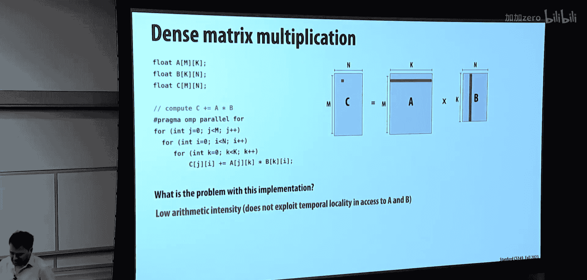

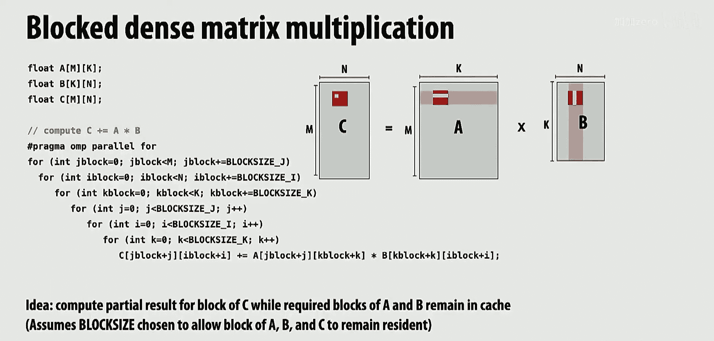

这个实现的问题在于，对于大的 N（因为我们设置的 N 可能很大，例如 512*7*7，这些可能是 GB 大小的矩阵），考虑到你对计算机工作原理的了解，你认为问题是什么？

最内层循环读取 A 的一行和 B 的一列来输出 C 的一个元素。我们会有非常糟糕的缓存局部性。

让我们更详细地思考：我们正在按行读取 A，我们对此特别担心吗？不完全是，因为这可能是你能做到的最连贯的内存访问。对于 B，如果数据是行优先存储，我们访问的每个元素在地址空间中都相距很远，位于不同的缓存行上。对于 C，实际上是最好的情况，因为我只是读写同一个值，它会留在缓存中。

但退一步思考，如果你回想作业中的带宽限制问题，这实际上并不比作业中的问题好多少。因为我们要读取 A 和 B，对 B 的访问非常糟糕，然后只是累加到 C。所以你实际上只做一两次数学运算（乘加），却要读取两个值。这是经典的带宽限制场景。

这有点奇怪，因为矩阵乘法，你告诉我，是 N^3 的工作量，N^2 的数据访问，所以本质上它的算术强度应该是 O(N)。但你给我的东西算术强度像是 O(1)。你（或者说我写的代码）给出了一个带宽限制问题。

然而，如果我能正确地进行，你会告诉我：“哦，只要把矩阵 A、B 和 C 放在缓存里就行了。”那么算术强度应该是 O(N)，N^3 的工作量对应 N^2 的数据。但我不能把 A 和 B 放在缓存里的原因是什么？它们太大了，可能是 GB 级别的矩阵。所以，低算术强度看起来不是根本问题，但至少按我现在写代码的方式，我搞砸了。

我们怎样才能做得更好？

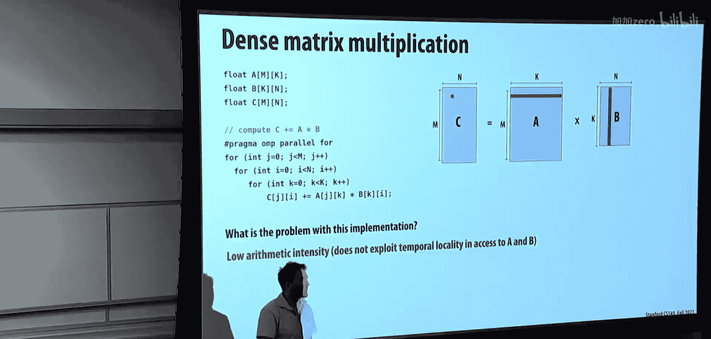

一个关键见解是：我可以将矩阵乘法表示为分块矩阵乘法，而不是对矩阵的单个元素进行操作。我可以分层表达矩阵乘法，即在一系列子矩阵块上进行矩阵乘法。

我将这样重写代码：将最外层循环以下的整个部分视为两个子块的矩阵乘法。最外层循环是在块上进行矩阵乘法。

思考一下：取 A 的一个块和 B 的一个块，将它们加载到缓存中，相乘这些矩阵，得到一个输出矩阵（C 的一部分）。然后移动到 A 的下一个块和 B 的下一个块，相乘这些矩阵，并以与之前将元素累加到 C 相同的方式，将得到的子块结果累加到正在计算的 C 块中。

现在我的算术强度是多少？对于每一步，我必须加载的数据量大约是 B^2，我做的工作量是 B^3。所以我的算术强度是 B，而不是 N。随着块大小 B 增大到 N，我得到 O(N) 的算术强度；随着块大小减小到 1，我得到 O(1) 的算术强度。

因此，选择块大小的思路应该是：尽可能大。“可能”在这里意味着：我不能让块大小大到开始在缓存中产生容量缺失。你需要知道缓存大小，选择块大小使得 A、B、C 的块能放入缓存，然后以这种方式组织代码。

如果你在 C 中实现这个，对于许多 MB 或 GB 大小的矩阵，速度差异可能达到 1000 倍，非常惊人。

所以，如果你像这样在大型矩阵上实现矩阵乘法，你将以带宽为限。如果你进行分块，速度会快得多。

在普通 CPU 上，缓存只是存储地址空间中的行。即使我选择的块大小是缓存行大小乘以缓存行大小，A 块所需的缓存行在地址空间中也不是连续的。缓存会找到地方存放它们。在 CPU 上，缓存的整个要点是软件程序员不需要管理它。

但在 GPU 的共享内存上，我们会有所不同。我们会明确地让 CUDA 线程从地址空间加载数据，并将其放入共享内存的连续分配中。这就是缓存和“暂存器”之间的区别。暂存器是一个不同的地址空间，而缓存只是同一地址空间上的一个实现细节。

无论如何，假设我们可以将这些块放入缓存。对于每个子步骤，我们将加载 B^2 个元素（A块），加载 B^2 个元素（B块），忽略重用，再加载 B^2 个元素（C块？实际上 C 是累加，初始可能为0或读取后累加），然后进行矩阵乘法，做 B^3 的工作。所以，对于每 B^2 的 I/O，我们做 B^3 的工作。

另外，请记住，任何现代系统（至少 CPU）都会有 L1、L2、L3 缓存。你可能还会分块到寄存器。所以我的代码可以很快增加循环。我现在只是选择不同的块大小，使得块能放入 L3 缓存，然后将其划分为能放入 L2 缓存的子矩阵乘法，依此类推。你几乎肯定希望为 L1 缓存分块，但一级分块就能完成大部分工作，也许再多一两级分块能带来额外提升。

当然，这只是一个使用 `+=` 的算法。我甚至还没有讨论 SIMD。多线程似乎很简单，我可能只是并行化最外层循环。但 SIMD 可能有点棘手，因为有专业的黑客一直在研究这些东西。

让我们稍微思考一下 SIMD。假设我决定用内部函数写这个。现在，我的图不是整个矩阵，我在思考如何相乘这些块。注意维度现在是块大小。

我可以这样思考：我应该从 B 取一个向量，从 A 取一个元素，复制那个 A 元素四次。现在我的点积实际上同时产生 C 的多个输出。这有点意思。但我仍然在浪费这个广播指令。我不喜欢我仍然不是按行优先顺序遍历 B。我不喜欢这里的每条指令都依赖于前一条指令（因为我在做点积），这可能会损害 ILP 等。

因此，设计空间变得有趣而复杂。例如，我可以预先转置 B 的块。如果我预先转置了 B 的块，那么我实际上一直在做直接的 SIMD 点积。或者，我可以预先转置 A 而不是 B，产生转置的 C，然后在最后重新转置。

我不会深入任何细节。这取决于你的 SIMD 指令集和机器。我的观点是：如果我想让你们做，这很容易成为一个为期两周的编程作业，你们可以尝试所有这些不同的方法。

请记住，策略可能是块大小或矩阵维度的函数。不同的块大小可能适合不同的策略。

如果我们回头看看这个特定的网络，这里是你的输入矩阵大小，每一层都不同。所以，如果你真的想要一个好的实现，你可能需要为不同的层使用不同的矩阵乘法实现。如果你只实现一种，对于像上面那种奇怪的长矩阵，你可能会有些次优。

这些东西变得很棘手，人们已经在 cuBLAS 和这些矩阵乘法例程上投入了大量工作。

### 隐式矩阵乘法与内存占用

另外，还有一个大问题。我有一个输入图像或几个输入图像。我做了什么？我基本上取了每个元素，并复制了很多次来创建这个矩阵。我取了一个可能只有几百 MB 的数据集，实际上通过数据复制生成了可能几 GB 的矩阵。特别是考虑到一定的批次大小，如果你上过机器学习课，知道在反向传播期间需要保留额外信息，你的内存会很快耗尽，这些小矩阵突然让你的内存占用达到 16 GB。

所以，要记住的一点是，一种非常现代的做法是：我们将其视为矩阵乘法，但在需要时从原始数据源动态获取数据来构建这些块。

因此，实际数据将来自原始张量。如果你看这个，这是一个矩阵乘法（为简单起见，这里没有分块）。但元素 A 不是来自 `X[i*width + j]`，而是来自一个访问器，该访问器通过计算来找出原始输入张量中（而不是我创建的矩阵中）该矩阵单元所需值的位置。

换句话说，他们在内层循环中通过计算地址（作为张量维度的函数）来换取不将数据解压缩到这些大矩阵中。

那么缓存效率呢？现在可能不对，因为我们没有考虑连续性。你是对的。这个感觉像是在迭代矩阵一行的点积，实际上是在整个原始图像上跳跃访问。但别太担心，因为记住，这本来就很糟糕。这将会被分块。

你应该这样想：当你将数据从 DRAM 加载到缓存或共享内存时，你会在那个时刻进行复制。你不是将其复制到 DRAM 中的新位置，然后再加载进来。这是一个很大的区别。

这就是你在“隐式 GEMM”中会看到的。另外，还有一件事：好的实现会预先计算从宽度、高度、张量数量、批次大小到地址的所有数学运算。你实际上会制作一个查找表，消耗一点内存来换回地址计算，这对于较大的张量可能非常重要。

NVIDIA 有一个叫做 cuTLASS 的库。如果你想成为一个相当厉害的黑客，但又不想完全自己用 PTX 在 GPU 上实现矩阵乘法，你可能会使用 cuTLASS。它让你能够访问非常快的矩阵乘法库，这些库适合共享内存，并且能够从不同位置获取数据。所以，这介于编写自己的优秀 CUDA 汇编代码和使用高级框架如 TensorFlow 之间。

### 性能考量与批次大小

请记住，所有这些至少在大型 CPU 或 GPU 上是在相当大的设备上运行的。每个 SM 核心可能正在处理一个子块矩阵乘法。你仍然需要相当大的矩阵来填满这个 GPU。这就是为什么在机器学习中，当批次大小为1时，性能可能会下降，因为没有足够的工作。

这里有一些图表，我改变 N（输出大小 P 和 Q，滤波器大小 R 和 S：1x1, 3x3, 5x5）。请注意，对于不同的批次大小，你必须使输出图像尺寸足够大，GPU 才有足够的工作来保持忙碌。

当人们说“天哪，用这些大型神经网络，我只能运行批次大小2或3，否则内存会耗尽”时，他们会在性能上付出代价，因为当这些东西变小时，你将无法让这个大处理器满负荷运行。

Y 轴是吞吐量（每秒浮点运算次数，TFLOPS），越高越好。这三条线是三种不同的模型大小（输出张量尺寸 P 和 Q）。右边这张图（实际上可能是左边）今天更相关，因为现在很少使用很宽的卷积。

### 直接实现与循环分块

当然，我也可以回到我最初的卷积代码（6层或7层循环）。我刚刚花了15分钟讨论优化一个三层循环的矩阵乘法有多难。你也可以直接开始对这些循环进行分块。

如果你想自己做一个直接的实现并做好，你当然也可以。如今，有很多兴趣在于将这些信息交给一个好的编译器，让它为我生成分块策略树。例如 Google 的 XLA 或 OpenAI 的新 Triton。他们正在尝试这样做。

但总的来说，我仍然认为这些核心内层循环最好还是由人类手工完成。

让我再展示一些其他技巧，这些技巧实际上很有趣。请记住，我们可以将卷积视为一组权重作为右侧，与一个来自输入张量元素的矩阵进行矩阵向量乘积。

仔细观察，你可以将其视为 M1 + M2 + M3。M1 是这个乘积，M2 是这个乘积，M3 是那个乘积。如果我们仔细观察，这里面有一些公共子表达式。我们可以利用这些公共子表达式进行一些早期计算，然后将输出计算为这些公共子表达式的函数。

在这个例子中，这实际上是所谓的“Winograd 滤波器”的本质。你可能听说过 Winograd 卷积，因为我采用了直接卷积，以前需要6次乘法和4次加法，现在我实际上用了少得多的乘法，但多了很多加法。这是否是一个好的权衡，取决于你的机器等因素。

最常见的可能是信号处理中的技巧：卷积可以表示为傅里叶变换、逐点乘法和逆傅里叶变换。快速傅里叶变换基本上就是运用这类技术，利用公共子表达式来减少工作量。所以你可以把这看作是应用傅里叶变换的思想。

### 供应商库与算法选择

所有大型供应商都有自己的深度学习库，如 cuDNN（NVIDIA）或 Intel 的 oneAPI。如果你使用 PyTorch 或 TensorFlow，你可能熟悉可用的不同层类型库。我们讨论过2D卷积（今天讨论的），但其他类型更简单。

如果你在 PyTorch 或 TensorFlow 中使用这些，底层的这些操作会被编译成 cuDNN 等供应商特定的低级库。如果我们打开 cuDNN 的 API（NVIDIA 的核心库），查看卷积前向传播的参数，你会看到一堆有趣的算法或参数。

不仅仅是输入张量 X、权重 W 和输出 Y，你还会得到输入张量的描述符，以及算法选择。现在看这些算法应该更有意义了。

这里有“隐式 GEMM”。GEMM 是通用矩阵乘法。默认算法是隐式 GEMM，意思是：将我的张量视为一个大矩阵乘法，但永远不要实际创建这些大矩阵，只是在执行矩阵乘法时通过循环索引来查找值。

这里有“前向算法直接”。这就像是：直接使用我那个7层循环嵌套的分块版本来做卷积。

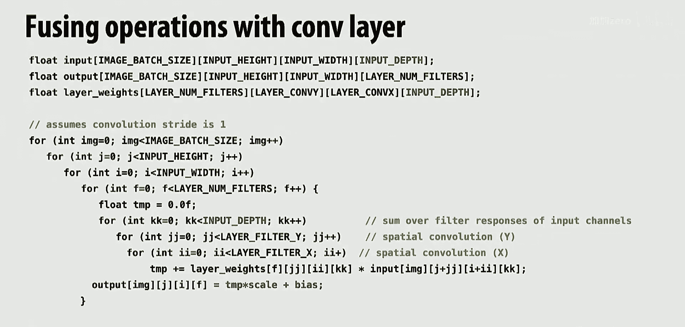

还有其他各种选项，比如 GEMM 但非隐式（实际将数据复制到大矩阵中，作为普通矩阵乘法执行）。还有 Winograd 选项、FFT 选项（通过 FFT 变换等）。所以，你基本上就是告诉 API，根据我对情况的了解，我希望你这样执行。

### 层融合与内存带宽优化

到目前为止，我们讨论的是如何实现矩阵乘法（本质上是如何实现卷积层）。顺便说一下，全连接层也是矩阵乘法，所以这也适用。

我们完全没有讨论的是，这些层是连续堆叠的，可能多达数百层。请记住，我刚告诉你，其中一层的输出可能是一个巨大的矩阵（巨大的张量），可能达到几十 MB 或几百 MB。

让我们思考一下卷积层的基本序列：我们可能进行这个大矩阵乘法，输出一个 宽度 x 高度 x N x K 的输出张量，将其存储在内存中。然后立即将其读回，进行像添加偏置这样的操作，再存储到内存。然后再读回，进行最大池化。

这个张量在内存中反复进出。对于卷积层或许可以分块，但缩放和偏置添加不行（你只是将每个元素乘以一个数字）。最大池化也没有太多计算（只是取每个 2x2 区域的最大值输出）。所以这些东西严重受带宽限制。

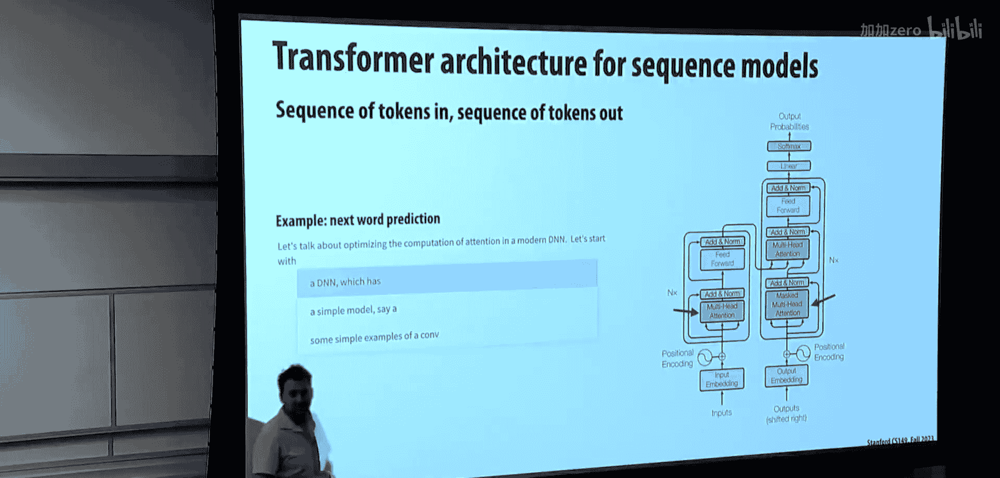

我们希望能够一次性完成所有这些操作，然后再将张量送出到内存。例如，一旦矩阵乘法完成，我就可以立即进行缩放和偏置。这节省了数百 MB 的内存往返。

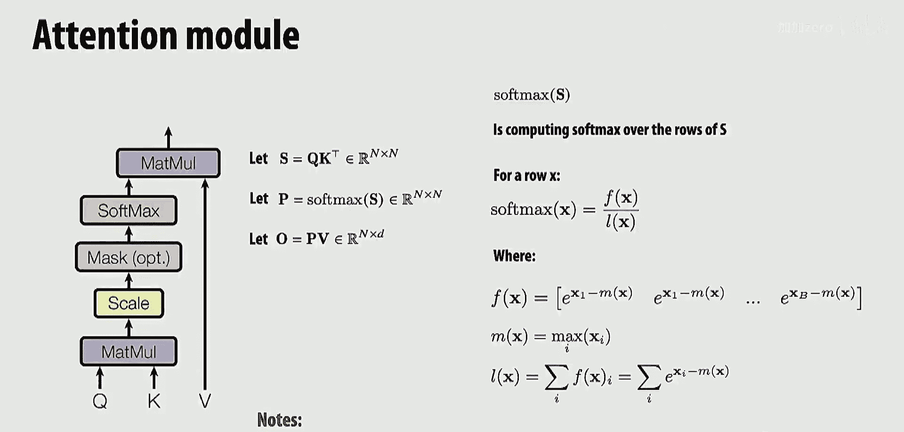

一个有趣的问题是：如果你想内联进行最大池化，你会如何重写代码？这并不难，虽然代码会变得复杂，但概念上不难。你只需要确保块大小是倍数。想象这是分块的：我产生了一个输出块放在缓存中，我应该在那时立即进行最大池化，然后再写回。这样我不仅节省了存储和加载，而且我存储的数据比我产生的要小四倍。所以这里有巨大的收益。

事实证明，这些东西真的很重要。当你的层类型变得复杂时，没有编译器支持的情况下，TensorFlow 开始出现像 `conv2d_fused_batch_norm` 这样的 API 入口点。API 变得庞大，因为他们觉得“这个序列很慢，我们需要为它做一个特例”。

如今，人们希望借助 JAX 和 Triton 这样的工具，如果编译器了解这些操作，可以为你进行一些融合。但这仍然不完美。让我告诉你为什么。

### Flash Attention：一个融合优化案例

我想告诉你一个大约一年半前在斯坦福发明的很酷的技巧，它显著提高了 Transformer 层在大语言模型中的性能。退一步看，这个技巧基本上是任何上过 CS149 的同学，如果给你一个 Transformer 层，你看了之后都会说“你绝对应该这样做”的东西。

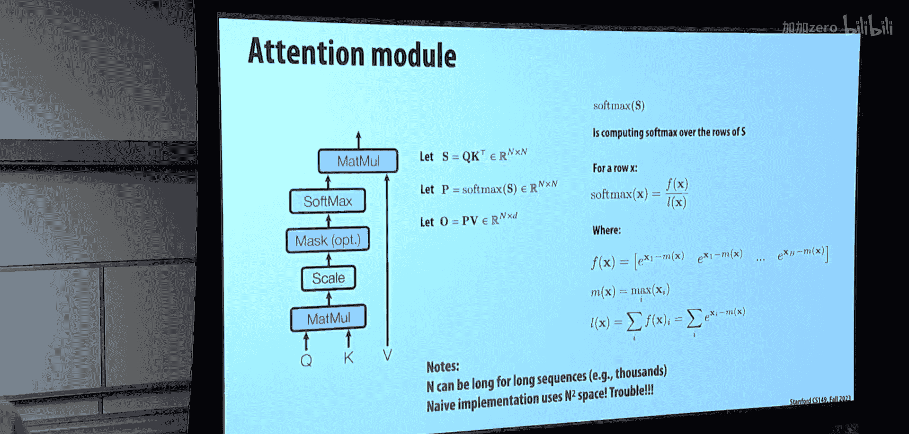

我快速转向 Transformer，不再讨论卷积模型。我想谈谈序列到序列的 Transformer。例如，输入可能是一个令牌序列（也许是一系列单词），模型的输出是产生下一个单词（自回归地）。具体应用无关紧要，重要的是工作负载。

当我们查看这个神经网络的关键部分（称为“注意力”的方框）时，输入是一堆张量：三个张量 Q、K 和 V。我可以给你一个解释：Q 是查询，K 是查询匹配的键，V 是值。你可以说，对于输入序列中的每个元素，我将其视为在一个数据库中查找匹配的其他令牌，基于匹配情况影响输出。但现在，就把它看作我有三个嵌入向量：Q、K 和 V，它们是 N 维数组，数组的每个点有一个 D 维嵌入。

这个注意力层基本上计算查询、键和值之间的交互。换句话说，我们将取查询向量 Q 和键向量 K 的外积。如果它们是 N x D，我的输出将是一个 M x N 矩阵。然后，对于该矩阵的每一行，我将执行一个称为 softmax 的操作。

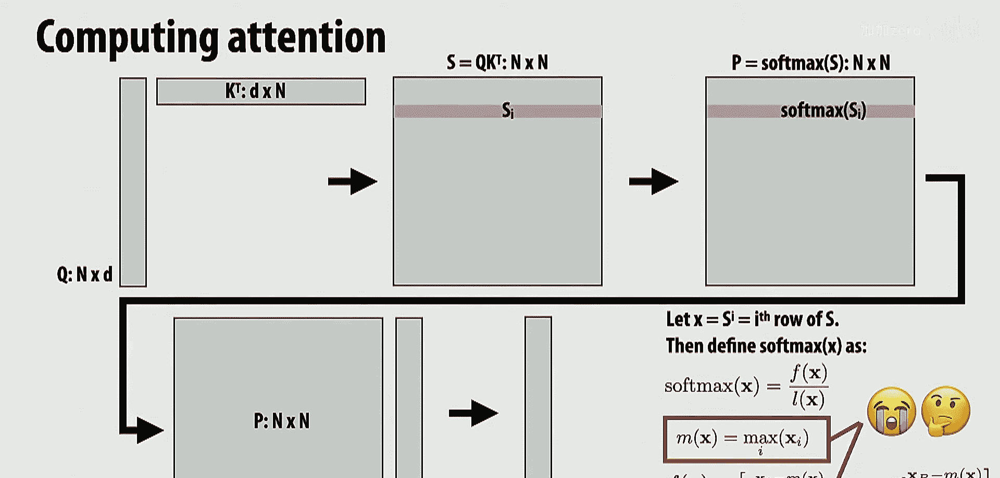

如果你不知道 softmax 是什么，没关系。让我告诉你重要的是什么：softmax(X)（X 是向量的一行）只是对所有元素进行缩放，但该缩放取决于向量中的最大元素。为什么这很重要？因为在我计算完整个向量之前，我不知道向量的最大元素是什么。这就像是说：计算数组中所有元素的和，然后用和来归一化所有元素。

问题是：我进行矩阵乘法，产生一个 M x N 矩阵。然后对于矩阵的每一行，我必须计算最大元素，然后使用该最大元素进行新的计算（另一个矩阵向量乘积）。

让我为你画出来：我有 Q 和 K 向量（N x D），将它们相乘得到一个 N x N 矩阵。N 很大（如果考虑数万个令牌的序列，N 为 10000 时，N^2 就是一个巨大的多 GB 矩阵）。然后对于该矩阵的每一行，我计算 softmax（同样，你可以理解为计算向量中所有元素的和或最大值）。我用该和归一化所有行，然后进行矩阵向量乘积来计算最终结果。

问题是这个矩阵太大了。你可以进行分块矩阵乘法来高效计算这个矩阵，但你仍然必须将其存储到内存，然后逐行读回以计算 softmax，再读回以计算矩阵向量乘积。我还没有展示其他一些步骤（如掩码操作）。你需要多次读入它。

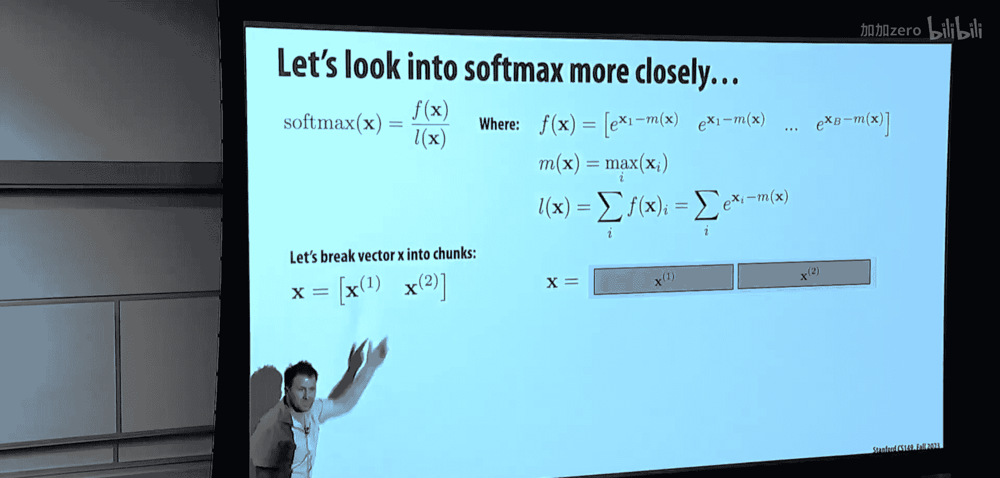

Transformer 中的计算成本就在这里。实际上这里计算量不大，这才是问题。

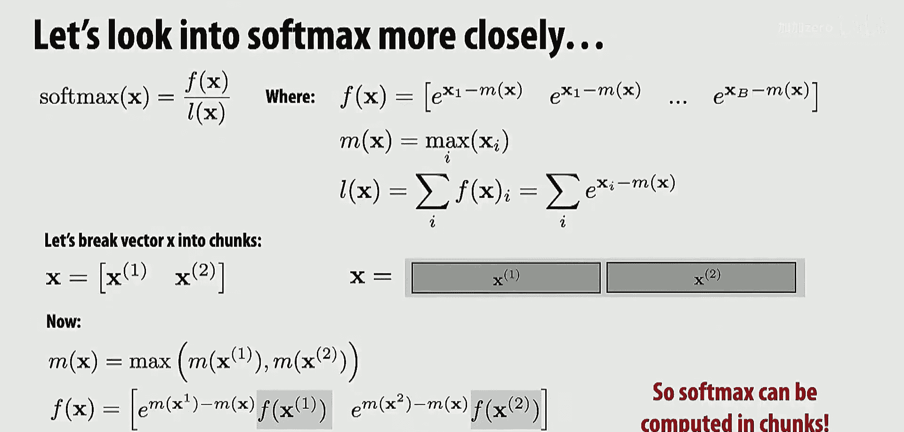

技巧在于：我们能否以块为单位完成整个序列？你刚告诉我如何在卷积中间进行最大池化。这里的问题是一样的：我们能否融合通过这个 softmax？它看起来像是需要矩阵的每个元素才能继续。

一些人看了看说，softmax 的数学是这样的：对于向量 X 的每个元素，我们将其缩放为 e^(x - max(x))，然后除以总和。我必须计算那个最大值和总和才能知道如何缩放。

事实证明，你可以分解这个计算，并分块进行。

细节我们可以线下讨论，但大致思路是：将 X 视为前半部分和后半部分。X 的最大值显然是 x1 和 x2 最大值的最大值。计算 F(X) 时，如果我知道最大值，我可以在前半部分计算 F，然后通过已知的因子重新缩放。

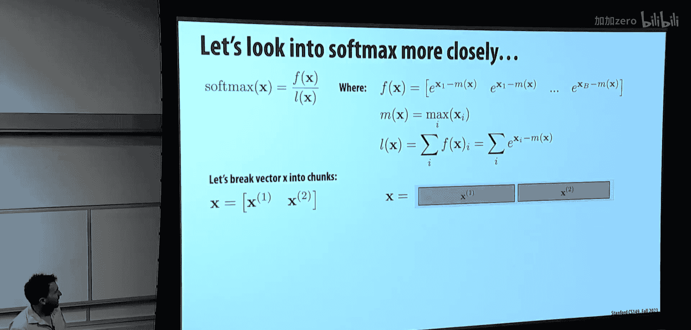

我不指望实时跟上这些数学推导。但经过10分钟的数学运算，你会注意到在这个项里面有 e^{x1}，这些项会抵消，一切都会成立。关键是：softmax 可以分块计算，只要你保持一个运行的最大值和总和。

因此，我可以融合整个流程：加载一个 Q 块、一个 K 块、一个 V 块，计算子矩阵乘法，计算整个行的一个块（子行）的 softmax，然后进行矩阵乘法，最后累加到输出 O 中。

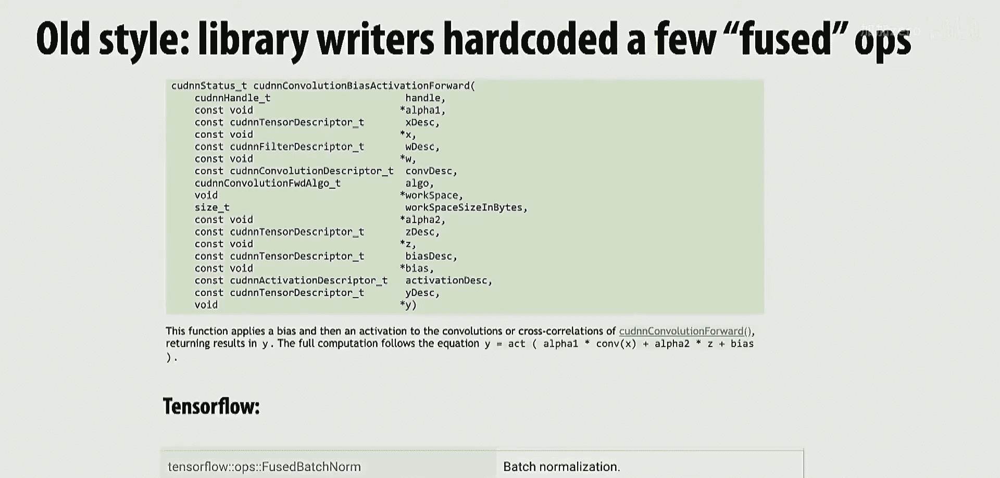

突然之间，我的内存需求从 N^2 减少到块大小的平方，这意味着我可以在 GPU 芯片上容纳更多的数据，从而可以处理更长的序列。并且因为我在某些情况下不受带宽限制，我可以运行得更快。

速度提升是适度的（我认为是几个小的常数因子），但内存占用大幅减少，这使我们能够处理的序列长度从 8000 增加到 32000 等。我相信 GPT-4 就受益于这样的优化。

这是基本的生产者-消费者局部性优化。你可以想象，编译器很难进行数学分析来发现这是可能的。但一些研究人员做到了。一旦你知道如何分块 softmax，你就可以分块处理整个流程。这本质上只是在这里那里重新排序一些循环，但却是一个非常大的变化。

### 融合的重要性与编译器支持

这些类型的事情最重要。一旦你有了一个好的矩阵乘法实现，这些类型的事情就很有趣。我之前提到过，大约八九年前，人们说“哦，你需要融合，但我们不知道怎么做。所以那些实现了好的矩阵乘法的人会去实现一个融合了批归一化的矩阵乘法，或者融合了调整大小、填充、卷积2D，最后可能还加杯咖啡”。这基本上就是当时的情况。

CUDA 一直有这种模板化的融合能力：任何卷积操作后跟一个“逐点操作”（逐点操作就像 map 函数），再跟另一个逐点操作，任何符合这种模式的，他们会尝试将逐点操作融合到矩阵乘法中。考虑到 MaxPool 等的好解决方案在5秒内就被提出来，这在智力上并不难。难的是在任意的张量程序上做到这一点。

所以，当你看到像 JAX 这样的框架时（它现在是一个相当复杂和成熟的框架），它们现在开始分析你的张量循环嵌套，并说“是的，我们知道如何融合这个，并为你生成代码”。所以情况正在好转。

事实证明，你需要两者：一个优秀的卷积或矩阵乘法实现，以及出色的智能，使得深度网络中其他所有带宽受限的部分不会拖慢一切。你需要这两种优化才能有一个好的网络实现。

### 其他优化技术

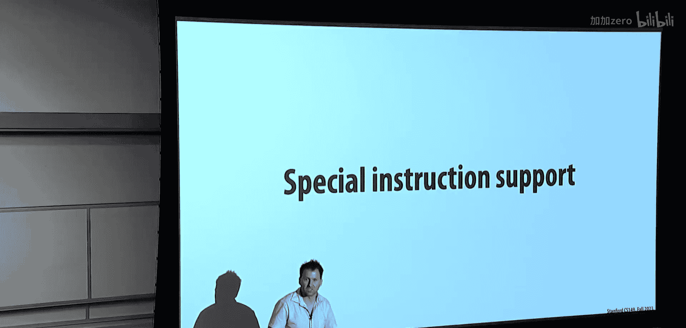

在我结束之前，我想谈谈还有很多其他技术。例如，加速的下一件事是停止使用常规精度数学，转而使用低精度数学。人们正在将其推向极致，我认为 NVIDIA GPU 现在开始使用大约4位精度的数学。

所以技术空间包括：首先，你需要从好的算法开始。如果你是一个系统人员，忽略了算法创新，你将会落后。有很多初创公司因为只看到“一切都要更大”的曲线而落后，我认为那个阶段已经过去了。

然后，你需要运用 CS149 的原则和好的编译器原则来优化这些模型，使其在现代硬件上运行良好。我们今天没有太多讨论近似计算（如低精度和稀疏性），但这些技术也存在。

### 硬件平台：GPU 与专用加速器

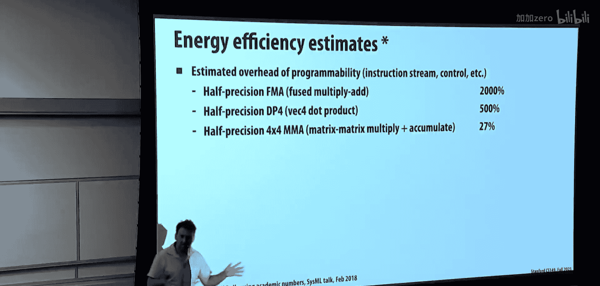

最后一块拼图是你在什么硬件上运行这些东西。让我们用最后一分半钟来结束这个话题。

根据你所知，为什么我们说 GPU 是运行深度神经网络计算的好平台？有哪些特性？并行性：这些是巨大的矩阵乘法操作。还有什么？如果你做得正确，算术强度很高。所以我们有很多好的算法和排序优化来提高算术强度，从而利用所有计算能力。GPU 有很多 CUDA 核心，并且这些处理器本来就有大量用于图形处理的算术单元，所以它们恰好在十多年前赶上了机器学习的浪潮。这就是为什么每个人都喜欢 GPU。

另一方面，为什么 GPU 可能是 DNN 评估的次优平台？因为 GPU 是一个任意的通用处理器，而大部分工作都是这些非常简单的矩阵乘法（也许是矩阵向量乘法）操作。

我们会有专门的一节课讨论这个，但我想现在稍微提一下，以便那些上 229 课程或做作业的同学思考：SIMD 指令的动机是什么？为什么架构师要在处理器中加入 SIMD 指令？是为了分摊非数学工作（指令流控制、数据访问等）的成本。

我们不必止步于 SIMD 指令。我们可以添加像点积这样的指令，这对矩阵乘法计算非常有帮助（例如一个4元素点积，做四次数学运算并将它们相加）。或者我们可以说，一个执行 4x4 矩阵乘法（一个小矩阵乘法）的指令怎么样？我知道如何使用