# 011：缓存一致性


在本节课中，我们将要学习缓存一致性的概念、问题以及解决方案。首先，我们会完成对Spark分布式计算系统的讨论，然后深入探讨在多处理器系统中，当多个核心拥有私有缓存时，如何确保内存数据的一致性。

## 完成Spark讨论

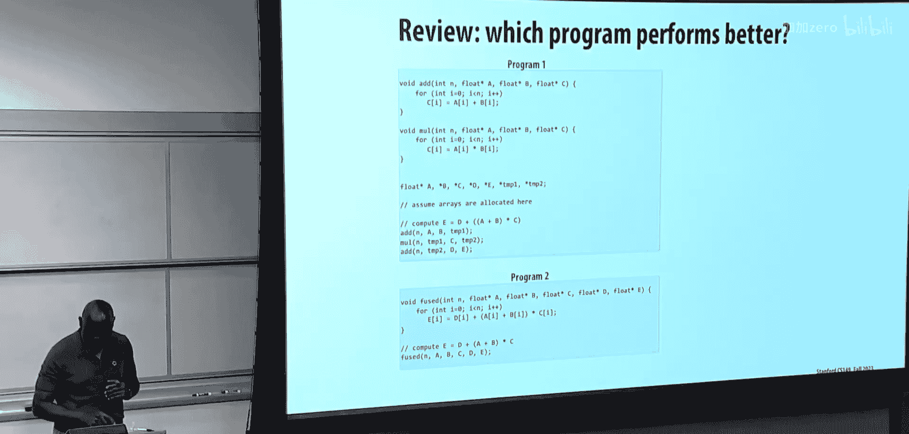

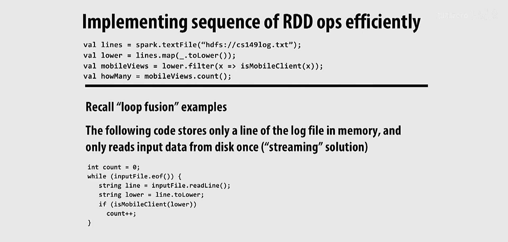

上一节我们介绍了Spark中用于实现容错和高性能内存计算的关键抽象——弹性分布式数据集。本节中我们来看看Spark如何通过转换操作的依赖关系来优化计算，以及如何实现容错。

Spark运行时系统可以分析RDD之间的转换操作，以优化执行。当转换操作之间存在窄依赖时，系统可以进行操作融合，从而避免不必要的中间数据存储和节点间通信。

以下是窄依赖的示例：
*   `lower`分区0仅依赖于`lines`分区0。
*   `mobileViews`分区0仅依赖于`lower`分区0。

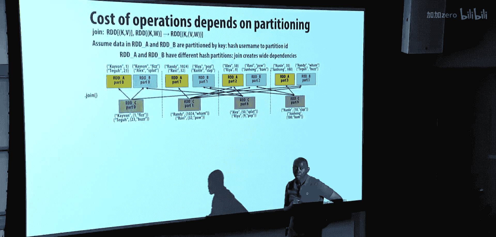

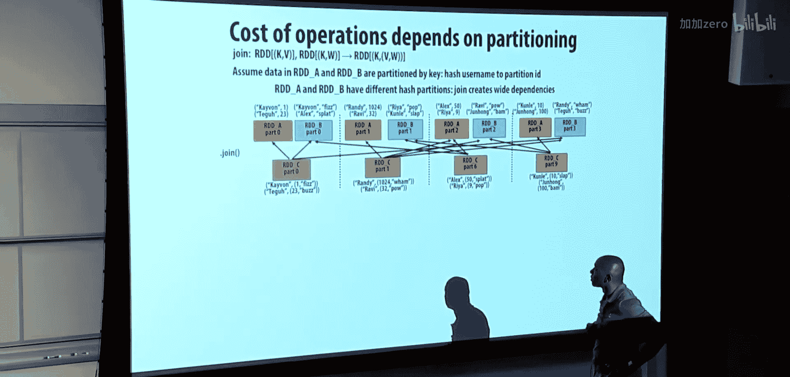

在这种情况下，所有转换都可以融合在一起，在一个节点内高效执行，无需跨节点通信。


然而，某些转换会产生宽依赖，例如`groupByKey`操作。为了计算RDD B的分区0，可能需要从系统中所有其他节点获取不同分区的数据。这会导致大量的节点间通信，且无法进行完全的融合优化。

另一个例子是`join`操作。如果参与连接的两个RDD使用相同的哈希分区器进行分区，并且键的分布使得连接键只存在于对应的分区中，那么依赖关系也可以是窄的，从而允许优化。

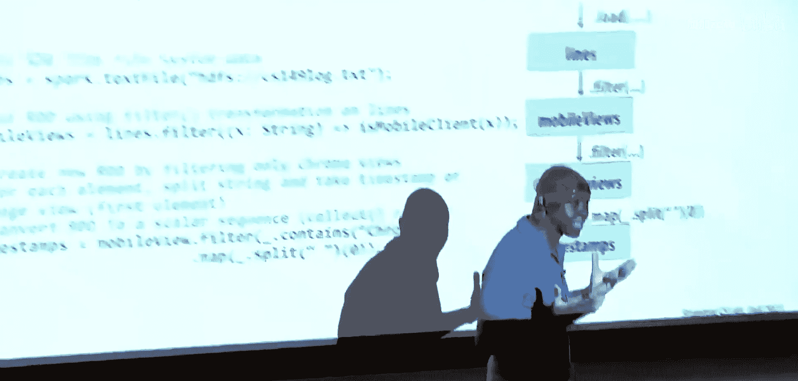

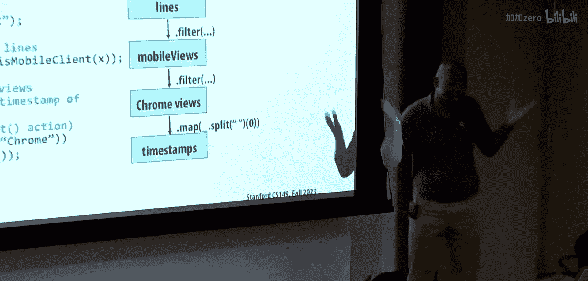

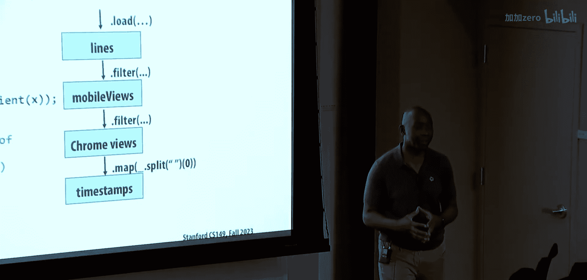

```scala
val partitioner = new HashPartitioner(8)
val mobileViewsPartitioned = mobileViews.partitionBy(partitioner)
val clientInfoPartitioned = clientInfo.partitionBy(partitioner)
val joined = mobileViewsPartitioned.join(clientInfoPartitioned)
```

在这种情况下，运行时系统可以检测到两个RDD使用了相同的分区器，从而判断依赖是窄的，并可能进行融合。

## Spark的容错机制

现在我们来谈谈容错。Spark系统的核心目标是在提供高性能内存计算的同时保持容错性。其关键在于RDD的**血缘关系**。

RDD的血缘关系是应用于初始数据（从分布式文件系统加载）的一系列**确定性、函数式**转换操作的日志。这个日志可以用来重新计算任何丢失的RDD分区。

例如，要得到`timestamps` RDD，需要经历：从HDFS加载 -> `filter` -> `filter` -> `map`。这个操作序列就是它的血缘。

由于转换是函数式的（不修改输入），并且RDD是只读的，因此总是可以从持久化的原始数据（如HDFS中复制的数据）开始，重新应用血缘来重新生成任何RDD。

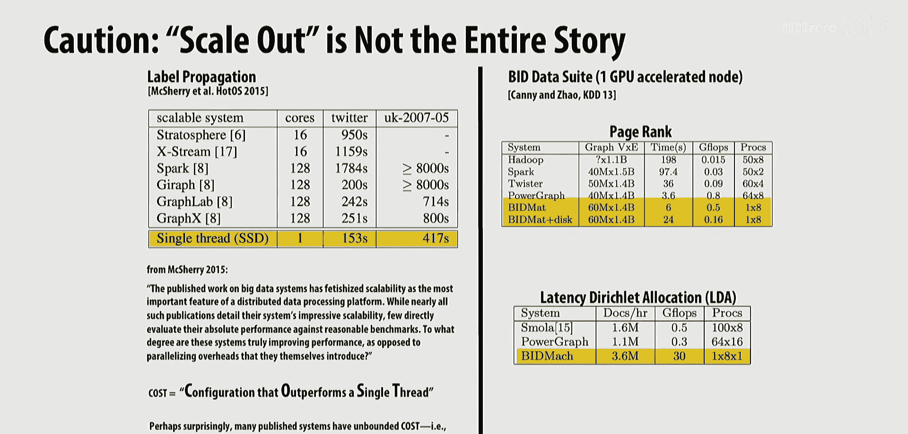


考虑一个场景：在计算`timestamps`时，节点1崩溃，丢失了`timestamps`和`mobileViews`的分区2和3。恢复过程如下：
1.  系统检测到故障。
2.  利用血缘关系，从HDFS中持久化的`lines`数据开始。
3.  重新应用转换操作（`filter` -> `filter` -> `map`）。
4.  重新计算出丢失的`timestamps`分区2和3。

这种机制使得Spark能够在利用内存获得高性能的同时，不牺牲分布式数据处理所需的容错性。

## Spark性能与适用范围

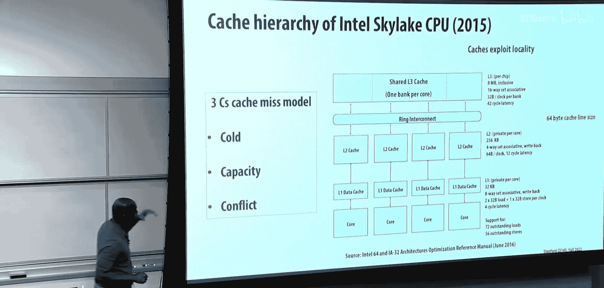

与Hadoop等依赖磁盘存储中间结果的系统相比，Spark能带来显著的性能提升。例如，在逻辑回归和K-Means等迭代算法中，Spark首次迭代需要从HDFS读取数据，但后续迭代可以直接在内存中进行，速度比Hadoop快一至两个数量级。

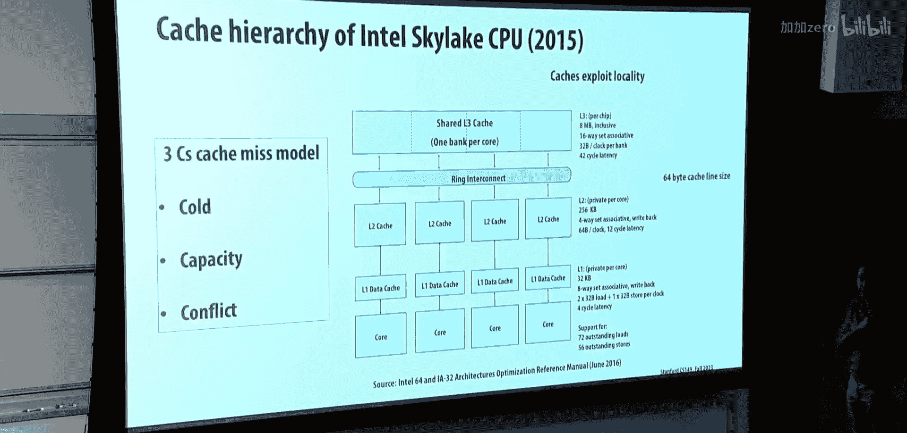

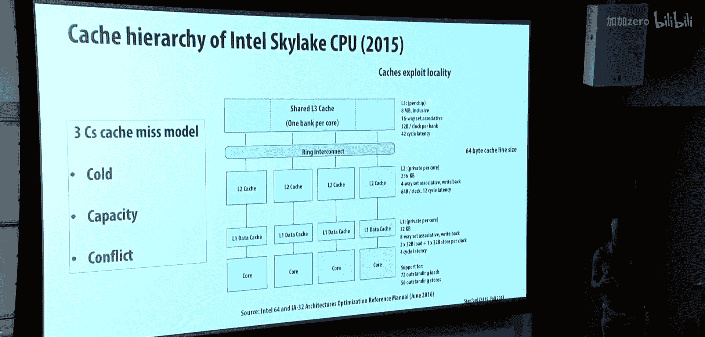

Spark生态系统已扩展到多个领域，包括Spark SQL（数据库处理）、MLlib（机器学习库）和GraphX（图计算）。

然而，横向扩展并非总是最佳选择。如果数据集能够放入单台服务器的内存中（例如，现代大型服务器可配备0.5TB到2TB内存），那么使用分布式系统会引入不必要的开销，其性能可能反而不如精心优化的单机多线程程序。

因此，选择Spark或类似分布式框架时，应考虑数据规模。对于数百TB的数据，分布式系统是必需的；而对于TB级以下的数据，单机系统可能更高效。

## 缓存一致性导论

现在，让我们转向今天的主题：**缓存一致性**。这是一个至关重要的话题，因为它既影响性能，也影响程序正确性，软件开发者需要理解其原理。

现代处理器芯片的很大一部分面积被缓存占据。缓存通过利用**时间局部性**（重复访问相同地址）和**空间局部性**（访问连续地址）来提升性能，避免昂贵的内存访问。

缓存未命中可以分为三类（Three Cs模型）：
1.  **冷未命中**：第一次访问某个缓存行。
2.  **容量未命中**：缓存容量不足，需要替换现有行。
3.  **冲突未命中**：由于缓存并非全相联，导致映射到同一组的行相互冲突而被替换。

缓存设计涉及数据块和元数据。元数据包括：
*   **标签**：标识该缓存行对应的内存地址。
*   **脏位**：指示缓存行中的数据是否已被修改，且与主内存不一致。

写操作策略有两种：
*   **写直达**：同时写入缓存和主内存。无需脏位。
*   **写回**：只写入缓存，并设置脏位。仅当该行被替换时才写回主内存。

在写回缓存中，如果发生写未命中且策略是**写分配**，则需要先将整个缓存行从内存载入缓存，然后再修改其中的部分数据。

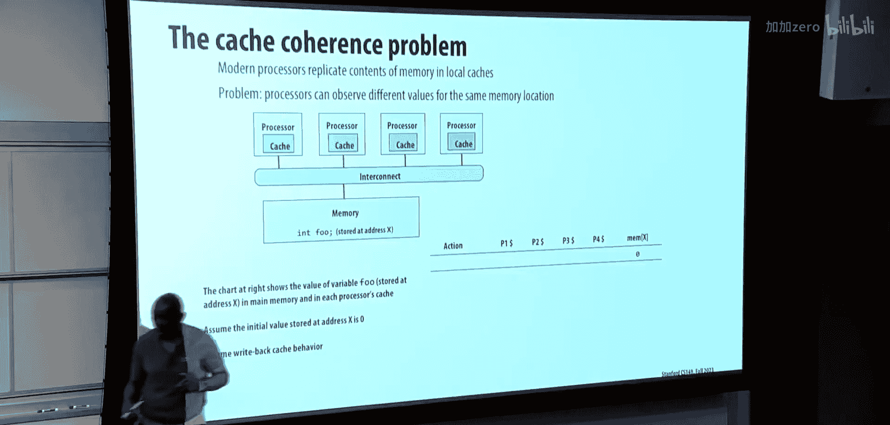

## 缓存一致性问题

在多处理器系统中，每个核心通常拥有私有缓存。这引入了**缓存一致性问题**：同一内存地址的数据可能同时存在于多个私有缓存中，当某个处理器修改其缓存副本时，其他处理器的缓存副本就会变得过时。

直观上，我们对共享内存多处理器的期望是：对某个地址的读操作应该返回该地址最后一次被写入的值。然而，由于私有缓存的存在，这个简单的期望可能无法实现。

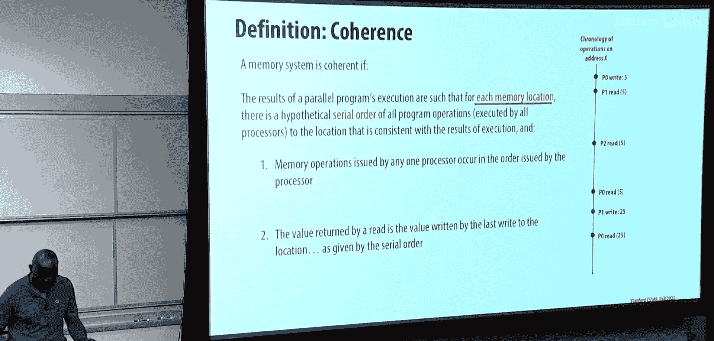

问题的核心在于，我们需要为**每个独立的内存地址**定义一个所有处理器都能同意的**读写操作串行顺序**。对于单个处理器（或线程），其读写顺序由程序顺序决定。对于整个系统，我们需要将所有处理器对同一地址的操作交错排列成一个全局的串行顺序，并且每个读操作返回的值，必须是该串行顺序中上一个写操作写入的值。

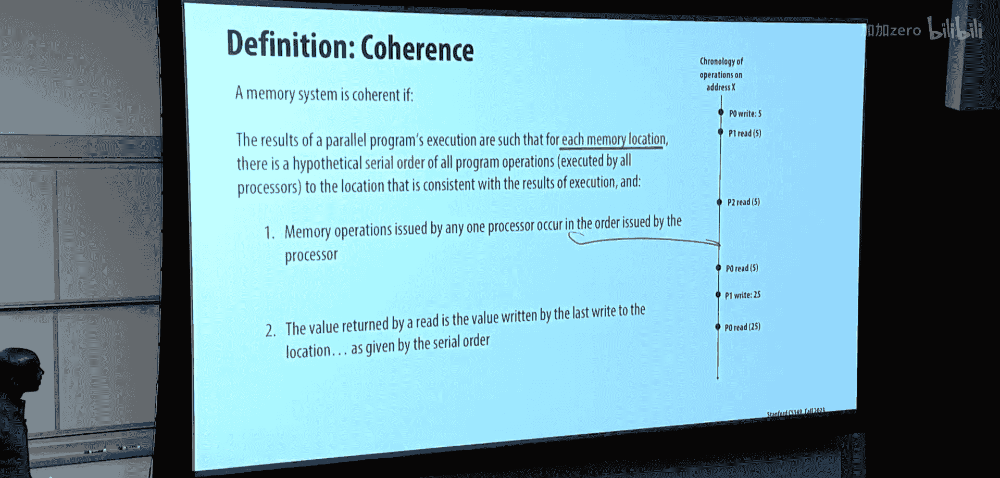

## 缓存一致性解决方案

我们可以通过维护两个不变量来实现一致性：
1.  **单写者多读者不变量**：在任何时刻，对于任一缓存行，系统要么处于“读写”阶段（仅一个处理器可修改它），要么处于“只读”阶段（任意多处理器可读取它）。
2.  **数据值不变量**：在“只读”阶段中，所有处理器读取到的值，必须是前一个“读写”阶段中那个唯一写入者所写入的值。

实现一致性需要在这两种阶段之间切换。软件方案（如通过操作系统刷新缓存页）粒度粗且速度慢。因此，现代系统普遍采用基于**缓存行**粒度的硬件解决方案。

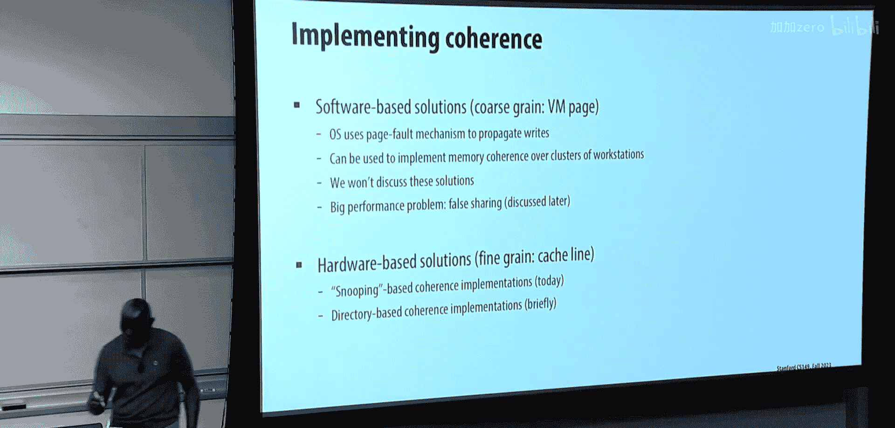

两种主要的硬件一致性协议是：
1.  **侦听协议**：所有缓存通过一个共享总线互联，每个缓存控制器“侦听”总线上的事务，并相应地更新自己缓存行的状态。
2.  **目录协议**：使用一个中心目录来记录每个缓存行的状态和共享者信息。这是当前更主流的方案，可扩展性更好。

## 侦听总线协议基础

我们将从更直观的侦听协议开始。总线具有两个关键特性，非常适合实现一致性：
1.  **串行化**：总线一次只处理一个事务，这自然地为所有操作建立了全局顺序。
2.  **广播**：总线上的事务能被所有连接的缓存控制器看到。

在基于**写回缓存**和**失效**的侦听协议中，核心思想是：在处理器写入一个缓存行之前，必须获得该行的**独占所有权**。这通常通过设置脏位来标识。协议必须确保同一时刻最多只有一个缓存的脏位被设置。

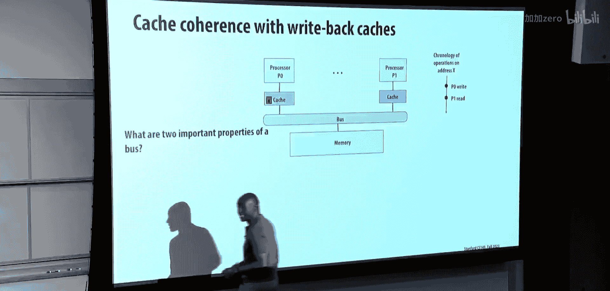


缓存一致性协议由硬件逻辑实现，它响应本地处理器的加载/存储操作，同时也响应来自总线上其他缓存控制器的消息。


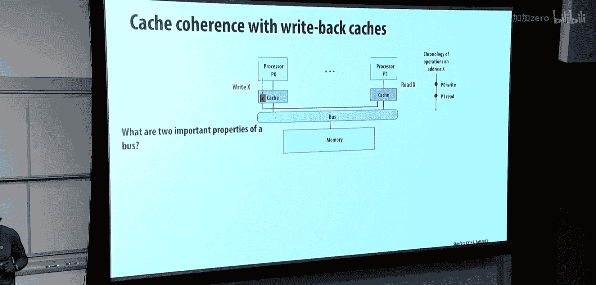

一个经典的例子是**MSI协议**，其名称来源于缓存行的三种状态：
*   **修改**：缓存行是脏的（已被修改），且仅存在于本缓存中。本处理器拥有独占所有权，可以读写。
*   **共享**：缓存行是干净的（与内存一致），可能存在于多个缓存中。所有持有者只能读。
*   **无效**：缓存行不在本缓存中，或数据已失效。

协议涉及两类操作：
*   **处理器发起**：读、写。
*   **总线事务**：总线读、总线写独占、总线写回。这些是由其他处理器的操作在总线上触发的事务。


本节课中我们一起学习了Spark系统的优化与容错机制，并引入了缓存一致性的核心概念与问题。下节课我们将深入探讨MSI协议的状态转换细节，理解硬件如何通过协作来维护内存一致性。