# 012：内存一致性 📚


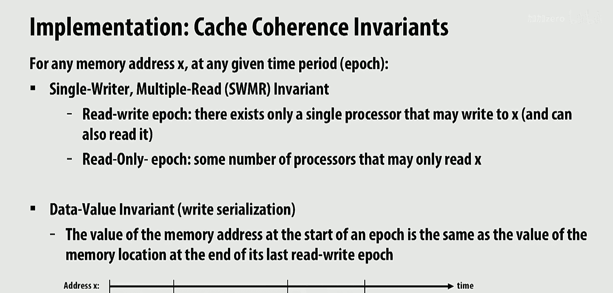


在本节课中，我们将完成对缓存一致性的讨论，并探讨其复杂的一面——内存一致性。我们将了解如何通过协议在多处理器系统中维护数据的一致性视图，以及程序员应如何理解不同内存访问顺序对程序行为的影响。

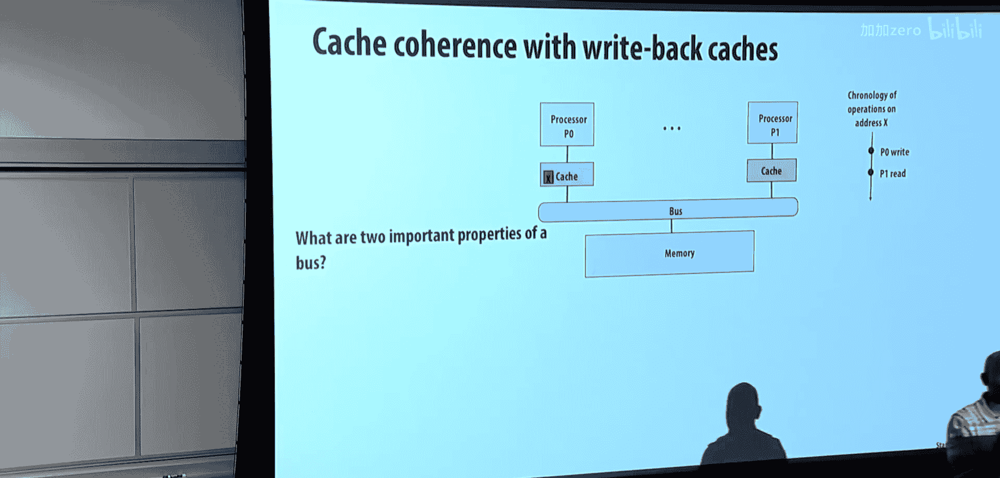


## 缓存一致性回顾 🔄

上一节我们介绍了缓存一致性的定义和目标。本节中，我们来看看实现它的具体协议。

缓存一致性的目标是：对于一个共享地址空间中的特定内存地址，所有处理器对该地址的读写操作，都能被排序成一个全局的、线性的顺序。这个顺序需要满足两点：
1.  与每个处理器线程的程序顺序一致。
2.  每次读操作返回的值，都是该顺序中最近一次写操作写入的值。

为了实现这个目标，我们需要维护两个不变式：
*   **单写者多读者不变式**：在任何时刻，对任一缓存行，要么只有一个处理器可以写入（读写阶段），要么有多个处理器可以读取（只读阶段）。
*   **数据值不变式**：在只读阶段读取到的值，必须是最近一个读写阶段最后写入的值。

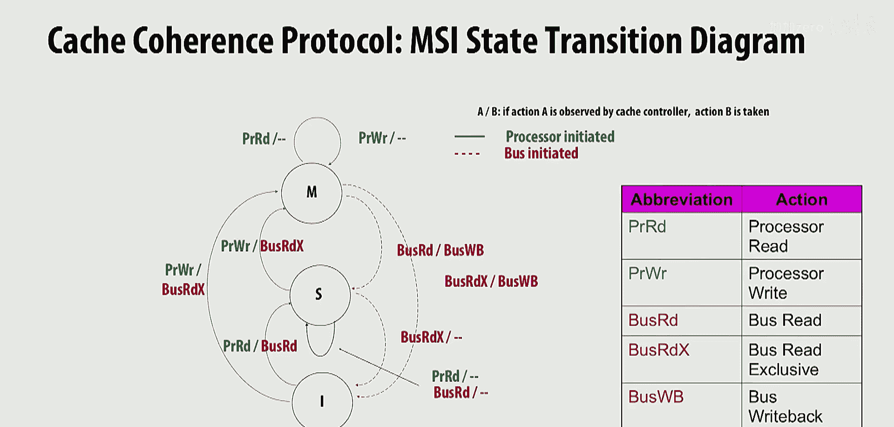

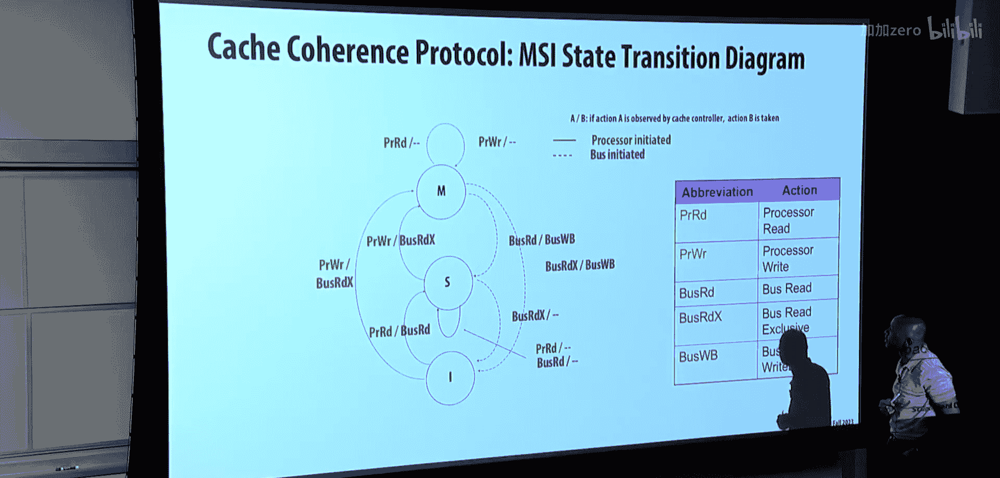

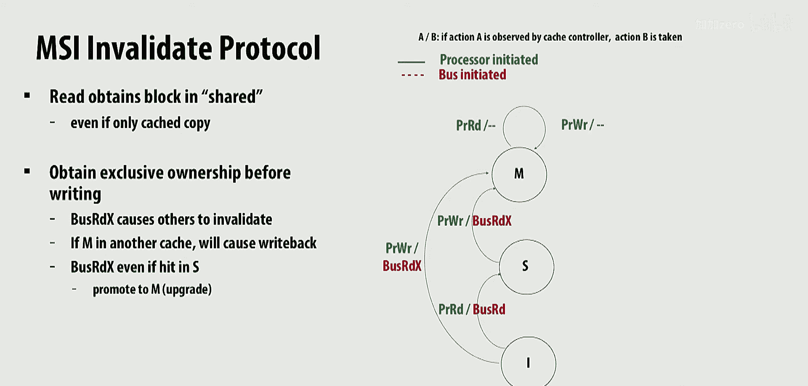

## 写回缓存与MSI协议 🧠

我们之前提到，直写缓存性能不佳，因为每次写操作都会占用总线。而简单的写回缓存会导致不一致。因此，需要一个基于无效化的写回协议来维护上述不变式。

核心思想是：确保系统中任一缓存行在任一时刻最多只有一个副本处于“已修改”状态。只有持有“已修改”状态的处理器才能执行写操作。当其他处理器需要读取该数据时，由这个“所有者”提供最新数据。

### 缓存行状态与总线事务

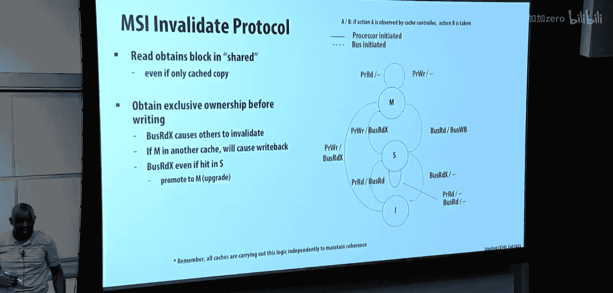

在MSI（已修改/共享/无效）协议中，缓存行有三种状态：
*   **无效**：该行不在缓存中，或数据无效。
*   **共享**：该行在一个或多个缓存中有效，且**内存中的数据是最新的**。
*   **已修改**：该行仅在**一个**缓存中有效，且已被修改（脏位为1），内存中的数据是旧的。

处理器可以发起两种操作：`读`和`写`。这些操作会触发三种一致性总线事务：
*   **总线读**：因处理器读缺失而发起，请求获取缓存行以进行读取。
*   **总线读独占**：因处理器写缺失（或从共享状态升级）而发起，请求以独占方式获取缓存行以进行写入。
*   **总线写回**：当持有“已修改”状态缓存行的处理器需要替换该行时，将脏数据写回内存。

### 状态转换图解析

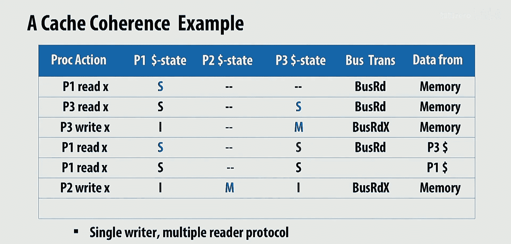

以下是MSI协议的状态转换图。绿色标签表示由处理器发起的动作，红色标签表示由总线事务触发的动作。


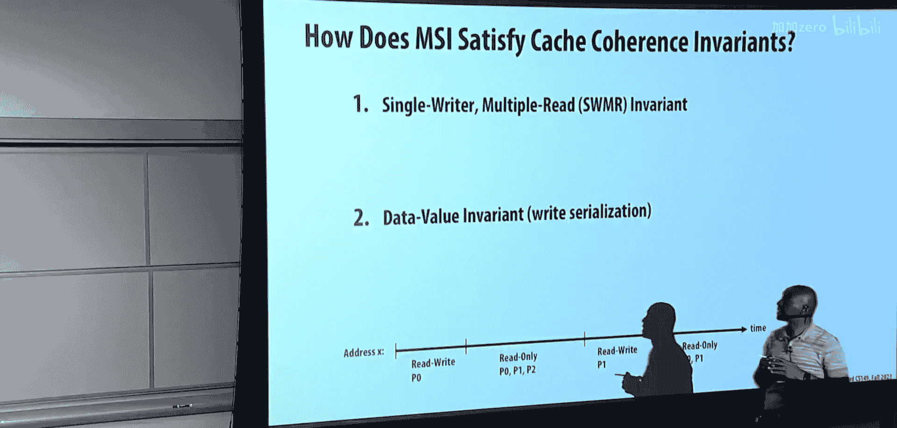


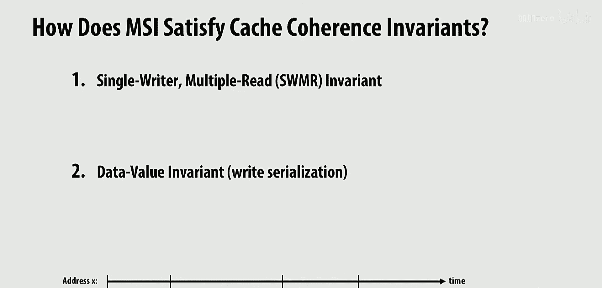

**处理器发起动作的转换：**
*   **无效 → 共享**：处理器`读` → 触发`总线读`。
*   **无效 → 已修改**：处理器`写` → 触发`总线读独占`。
*   **共享 → 已修改**：处理器`写` → 触发`总线读独占`（升级操作）。
*   **已修改 → 已修改**：处理器`读`或`写` → 无总线事务（命中）。
*   **共享 → 共享**：处理器`读` → 无总线事务（命中）。


**总线事务触发的转换（监听）：**
*   **共享 → 无效**：监听到`总线读独占`（其他处理器想写）→ 使本地副本无效。
*   **已修改 → 共享**：监听到`总线读`（其他处理器想读）→ 执行`总线写回`以提供数据并更新内存，然后状态转为共享。
*   **已修改 → 无效**：监听到`总线读独占`（其他处理器想写）→ 执行`总线写回`以提供数据，然后状态转为无效。

### 运行示例

假设有三个处理器（P1， P2， P3）和地址X。初始时所有缓存为空（X为无效状态）。

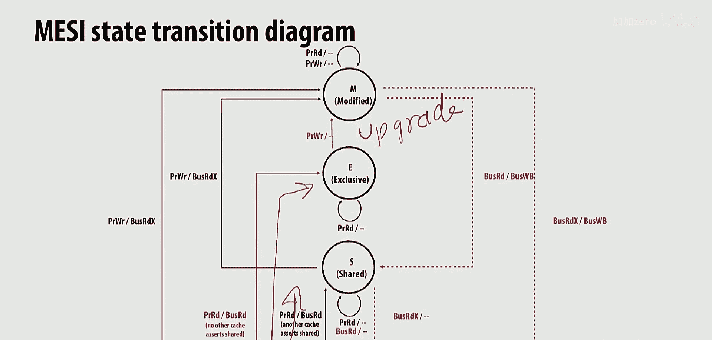

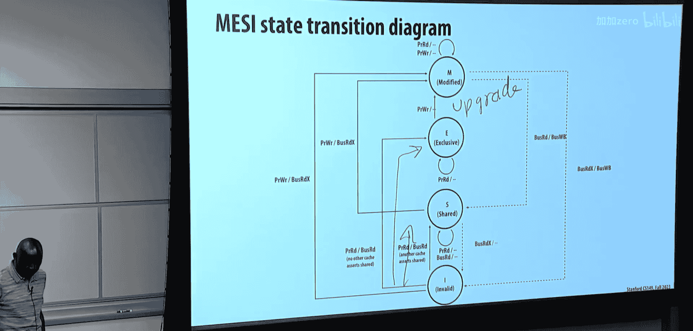

| 处理器动作 | 总线事务 | P1状态 | P2状态 | P3状态 | 数据来源 |
| :--- | :--- | :--- | :--- | :--- | :--- |
| P1: 读 X | 总线读 | 共享 | 无效 | 无效 | 内存 |
| P3: 读 X | 总线读 | 共享 | 无效 | 共享 | 内存 |
| P3: 写 X | 总线读独占 | 无效 | 无效 | 已修改 | 内存 |
| P1: 读 X | 总线读 | 共享 | 无效 | 共享 | P3缓存（写回） |
| P2: 写 X | 总线读独占 | 无效 | 已修改 | 无效 | 内存 |

这个例子展示了数据如何在处理器间移动，以及状态如何根据协议变化。

### MSI如何维护不变式

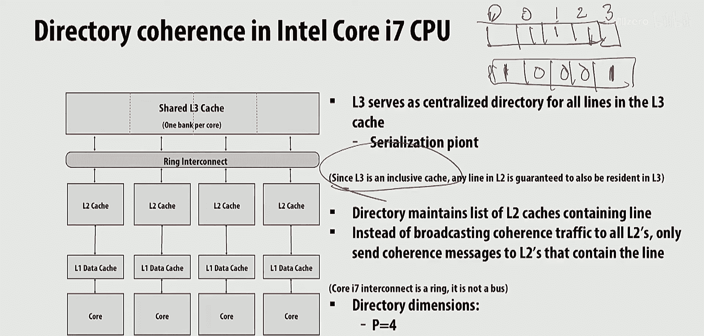


*   **单写者多读者**：通过确保只有“已修改”状态是独占的来实现。总线串行化所有事务，保证了状态的正确转换。
*   **数据值**：通过“总线写回”机制实现。当缓存行离开“已修改”状态时，持有者必须将数据写回（或提供给请求者），从而将最新值传播给后续的读者。

## 协议优化与可扩展性 🚀

MSI协议存在优化空间。例如，从“共享”升级到“已修改”需要一次“总线读独占”事务（即一次缺失）。为了优化，可以引入**独占**状态，形成MESI协议。

**独占**状态表示缓存行是干净的（与内存一致），但只有当前缓存拥有它。如果处理器读数据时发现没有其他缓存共享该行，可以直接进入“独占”状态。后续的写操作可以直接在本地进行，无需总线事务，从而将“升级”操作从缺失变为命中，提高了效率。

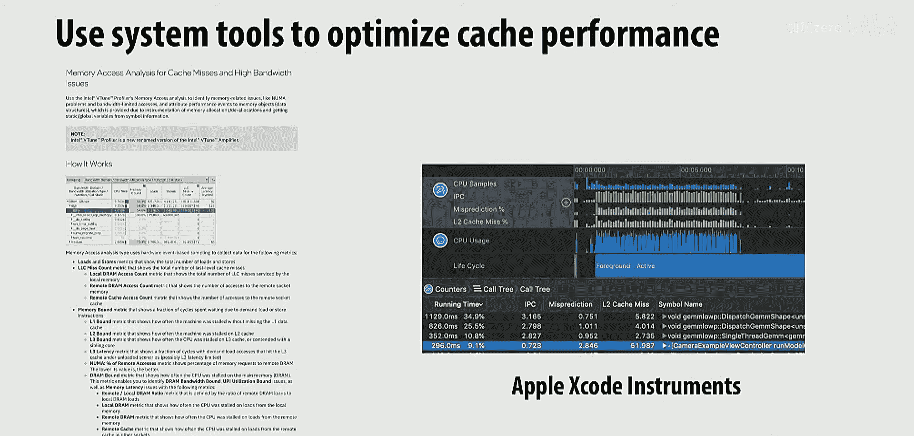

然而，基于总线的监听协议存在可扩展性问题：所有处理器都能看到所有事务，总线成为带宽瓶颈。为了解决这个问题，现代多核处理器使用**目录**协议。

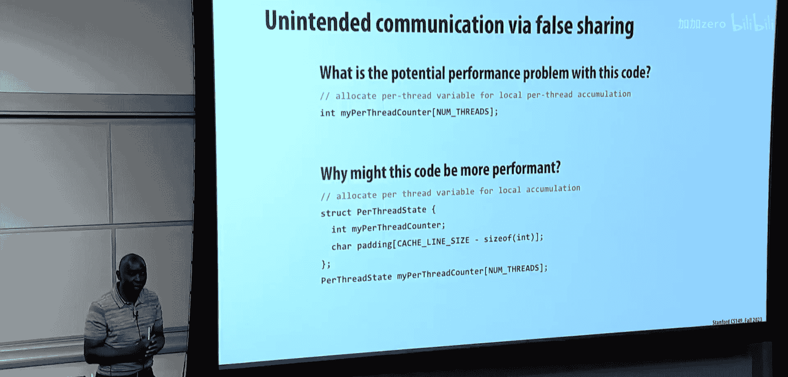

目录在内存中（如末级缓存）为每个缓存线维护一个位向量，记录哪些处理器拥有该行的副本。当需要无效化或获取数据时，只需与目录中记录的特定处理器通信，而非广播给所有处理器。这使得可以使用更可扩展的互连网络（如环），取代广播总线。

## 缓存一致性对程序的影响 ⚡

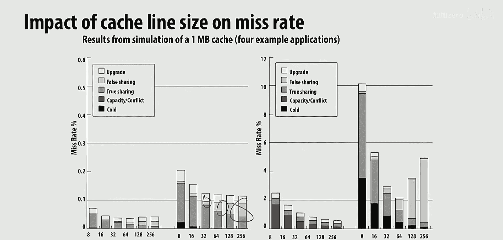

缓存一致性机制对程序员的主要影响体现在性能上，尤其是**伪共享**问题。

伪共享发生在不同处理器频繁写入**同一缓存行中不同的独立变量**时。尽管这些变量逻辑上不共享，但由于它们位于同一缓存行，一方的写入会导致另一方缓存行的无效化，引发不必要的缓存缺失和通信。


**示例：**
```c
// 可能发生伪共享
int per_thread_data[NUM_THREADS];


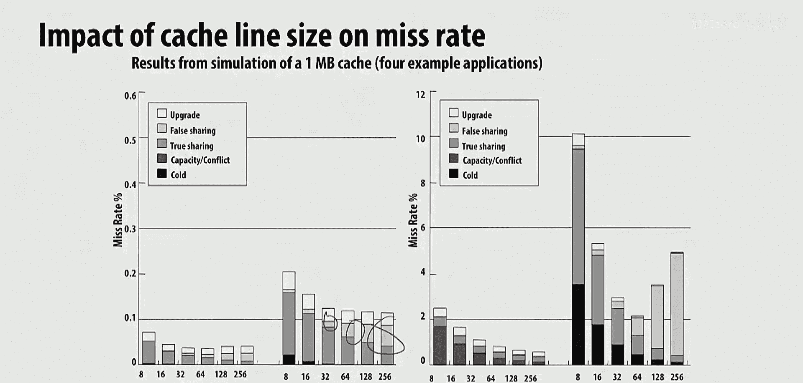


// 减少伪共享（通过填充或结构体确保变量不在同一缓存行）
struct AlignedData {
    int data;
    char padding[CACHE_LINE_SIZE - sizeof(int)];
};
struct AlignedData per_thread_data[NUM_THREADS];
```
在第二个例子中，通过填充字节，确保每个线程的数据结构独占一个缓存行，从而消除了伪共享，可以显著提升性能。


数值计算中，如果网格划分的边界落在同一缓存行，被不同处理器访问，也会导致伪共享。随着缓存行增大，真共享缺失可能减少（空间局部性更好），但伪共享缺失可能增加。

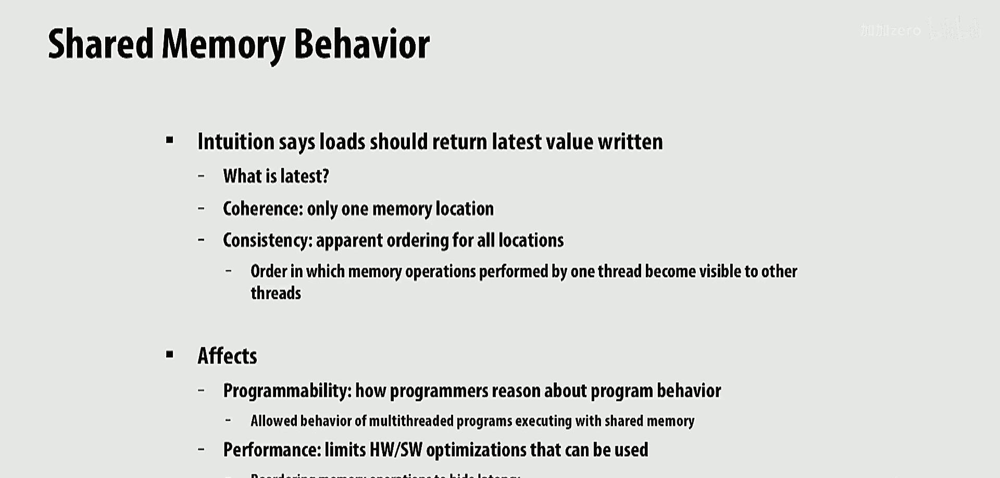

程序员可以使用性能分析工具（如Intel VTune， Apple Xcode Instruments）来识别缓存缺失和伪共享热点，并通过调整数据布局来优化。

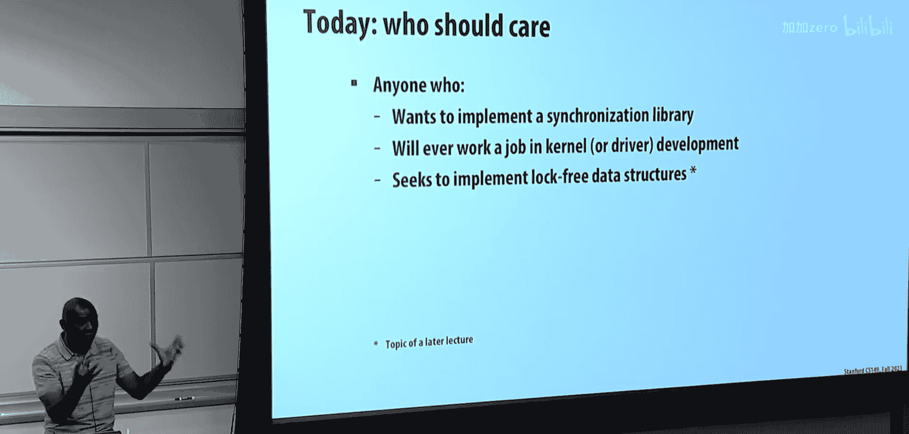

## 内存一致性 🧩


缓存一致性关注**单个地址**的读写顺序。内存一致性则定义了对**不同地址**的读写操作，在不同处理器看来应有的顺序。它规定了多线程程序在共享内存系统中的**合法行为**。

为什么需要内存一致性模型？因为硬件和编译器为了性能，可能会对内存操作进行重排序。程序员需要知道这些重排序的规则，才能编写正确的并发程序。

### 顺序一致性

最直观的模型是**顺序一致性**。它要求满足两点：
1.  所有内存操作（来自所有处理器）可以排列成一个全局的线性顺序。
2.  每个处理器的内存操作在这个全局顺序中，保持其程序顺序。

顺序一致性维护了所有四种内存操作顺序：写后读、读后读、读后写、写后写。这符合程序员的直觉，但严格限制了硬件和编译器的优化。

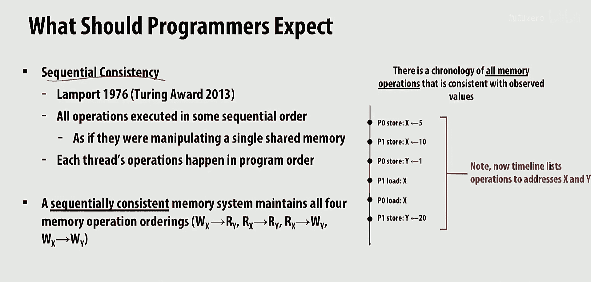

### 为什么需要更弱的模型？

为了提升性能！例如，处理器写一个地址（可能缓存缺失，耗时很长），紧接着读另一个地址（可能缓存命中）。在顺序一致性下，读必须等待写完成。如果允许**写后读重排序**，处理器就可以先执行读操作，隐藏写的延迟。这可以通过**写缓冲区**来实现。

然而，重排序会改变程序行为。考虑这个经典例子：
```c
// 初始：A = B = 0
// 处理器 P1           // 处理器 P2
A = 1;                B = 1;
r1 = B;               r2 = A;
```
在顺序一致性下，结果`(r1, r2) = (0, 0)`是不可能的。但如果允许写后读重排序，两个处理器的写操作都可能被暂存在写缓冲区，而先执行了读操作（读到0），从而导致`(0, 0)`的结果。

### 弱一致性模型与栅栏

因此，现代处理器（如x86， ARM）实现了比顺序一致性更弱的模型。例如：
*   **完全存储定序**：维护除“写后读”外的其他顺序。
*   **部分存储定序**：允许更灵活的重排序。
*   **松弛一致性**：如ARM模型，允许更多的重排序以获得高性能。

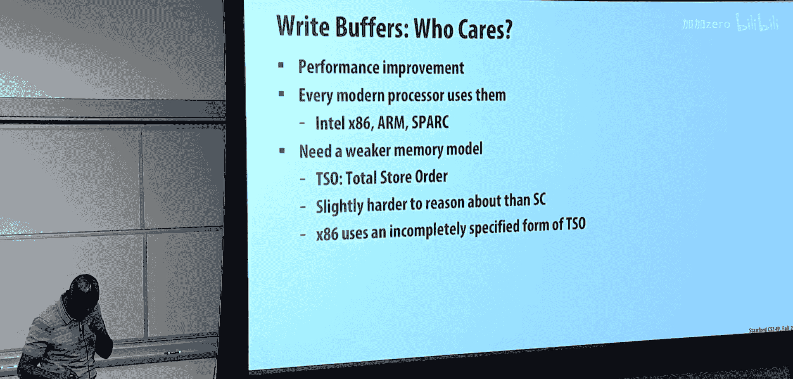

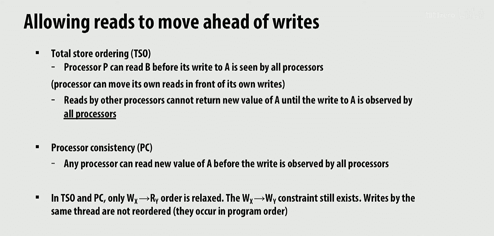

在这些弱模型下，要保证同步操作（如锁、信号量）的正确性，必须使用**内存栅栏**指令。栅栏会强制在该点之前的所有内存操作完成，并对其他处理器可见，然后才能执行之后的操作。

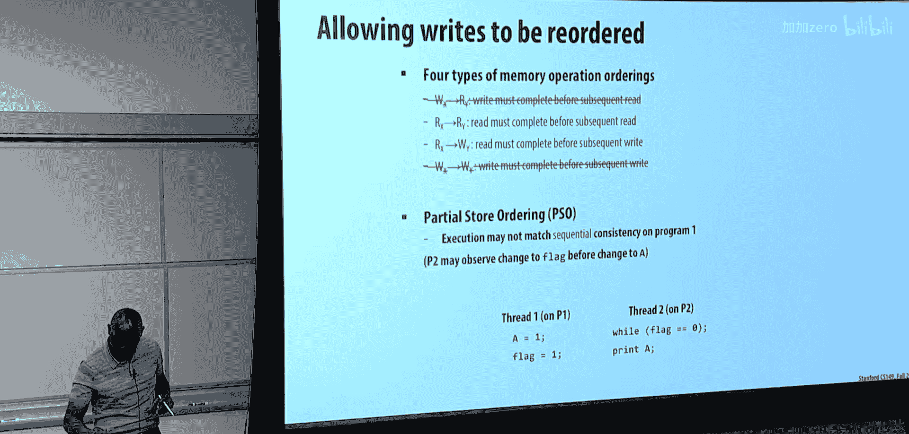

**对程序员的启示：**
1.  **数据竞争**：对同一内存位置的无同步读写是未定义行为的根源。
2.  **数据竞争自由编程**：正确的做法是，对共享数据的访问总是通过同步原语（锁、原子操作）进行保护。
3.  **分工**：应用程序员可以依赖正确的同步库；而系统程序员、编译器开发者和同步库实现者必须深入理解底层的内存一致性模型。


## 总结 📝

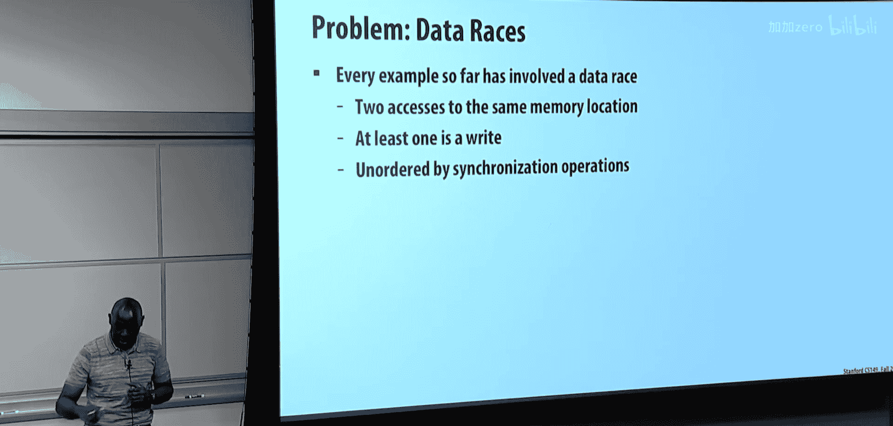

本节课我们一起学习了：
1.  **MSI缓存一致性协议**：通过无效化、共享和已修改三种状态，以及总线事务，在写回缓存中维护了单写者多读者和数据值不变式。
2.  **协议优化与可扩展性**：MESI协议通过引入独占状态优化升级操作；目录协议通过点对点通信取代广播，提升了可扩展性。
3.  **对程序的影响**：缓存一致性机制可能导致**伪共享**，显著影响性能。程序员需要注意数据布局，并使用工具进行分析优化。
4.  **内存一致性**：定义了多线程程序中内存操作的合法顺序。**顺序一致性**最直观但性能限制大。现代硬件使用**更弱的模型**并配合**内存栅栏**来平衡性能与正确性。程序员应遵循**数据竞争自由**的编程范式，正确使用同步原语。


理解缓存一致性和内存一致性是编写高效、正确并行程序的基础。对于系统级开发者而言，掌握这些概念尤为重要。