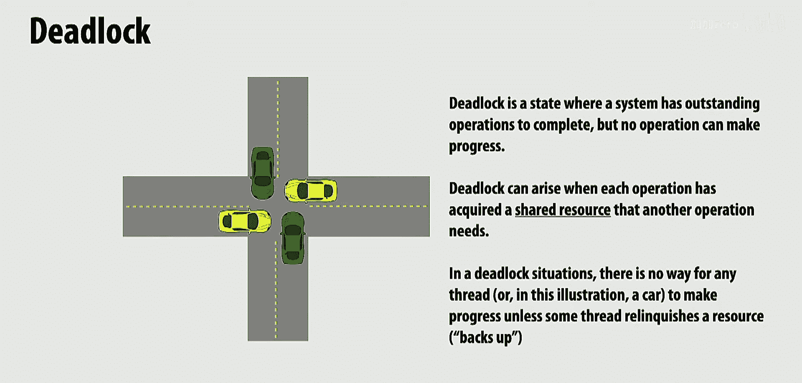
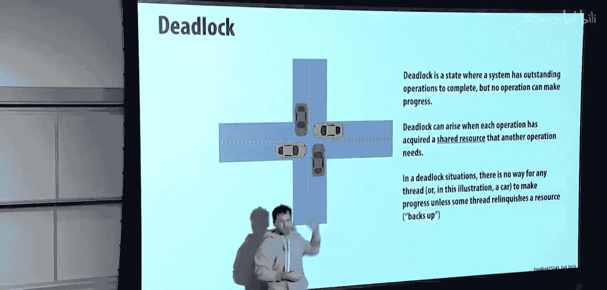
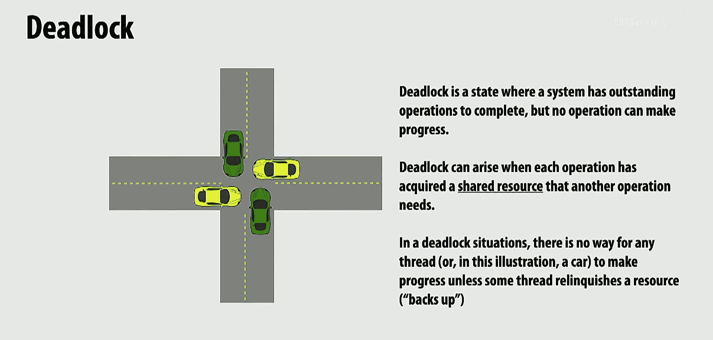
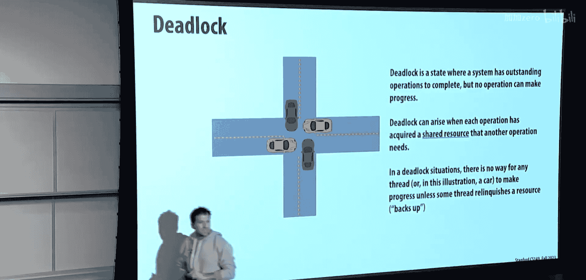
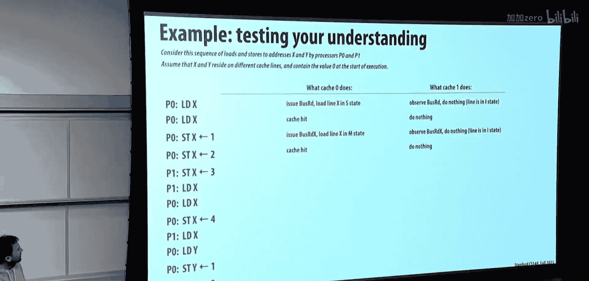
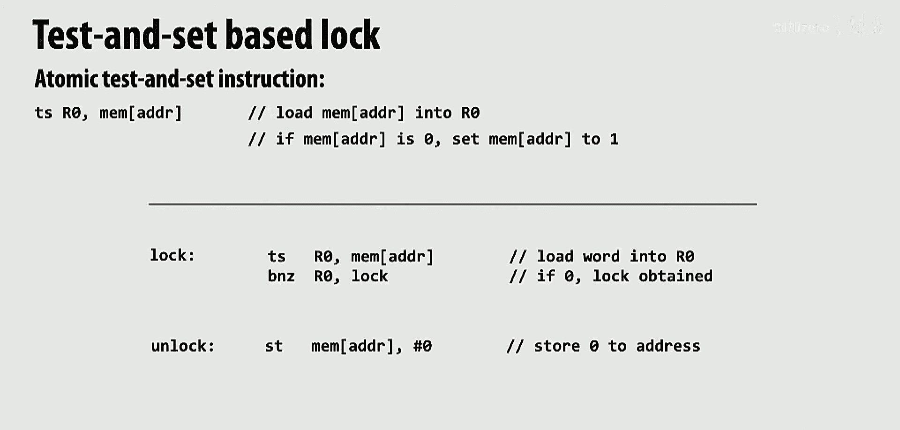
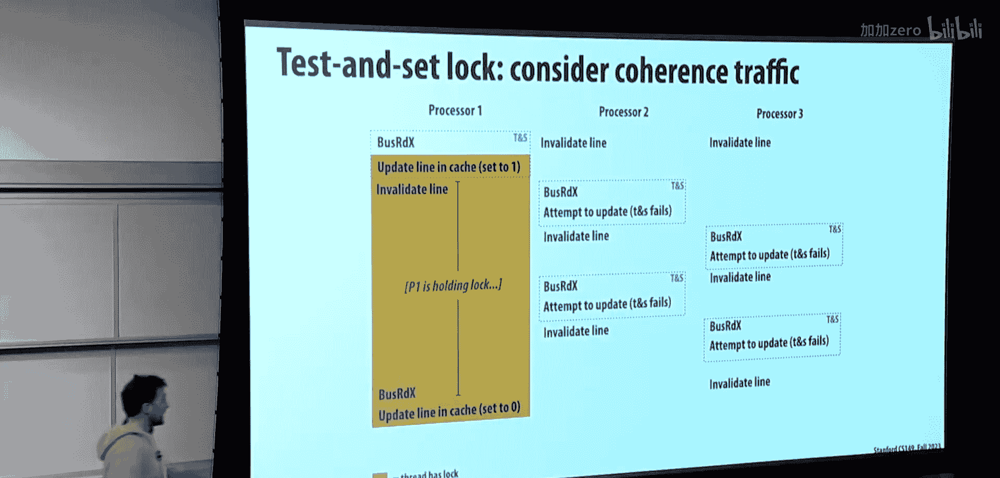
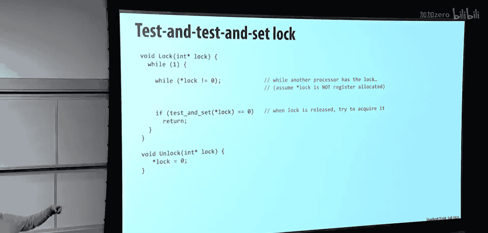
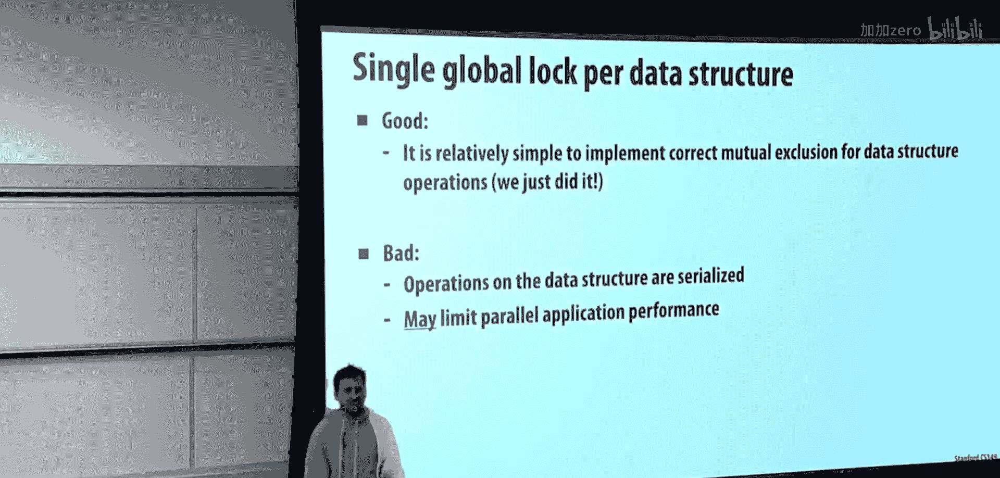
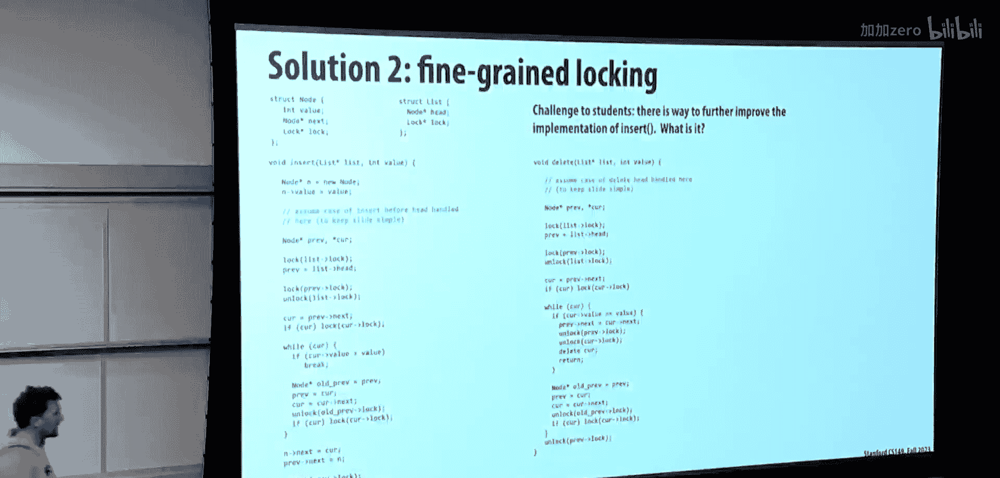

# 013：细粒度同步与无锁编程 🧵






在本节课中，我们将要学习多线程编程中的高级同步技术。我们将探讨如何避免死锁、活锁和饥饿等问题，并深入了解锁的实现原理、性能优化以及如何设计细粒度同步和无锁数据结构。





## 概述

当程序中涉及锁和同步时，可能会出现死锁、活锁和饥饿等问题。本节我们将首先明确这些术语的定义，然后深入探讨锁的底层实现机制，最后学习如何设计更高效、更安全的并发数据结构。

## 同步问题：死锁、活锁与饥饿

在深入锁的实现之前，我们需要理解多线程编程中可能遇到的几种典型问题。

### 死锁 🔒

死锁是指一组进程或线程因争夺资源而陷入的相互等待状态，导致所有成员都无法继续执行。

死锁的发生需要满足四个必要条件：
1.  **互斥**：资源一次只能被一个线程持有。
2.  **持有并等待**：线程在等待获取新资源时，不会释放已持有的资源。
3.  **不可抢占**：资源不能被强制从持有它的线程中夺走。
4.  **循环等待**：存在一个线程-资源的循环等待链。

一个经典的现实例子是十字路口的四辆车互不相让，每辆车都需要前方道路畅通才能前进，但前方道路又被另一辆车占据，形成了一个循环依赖。

在计算系统中，一个简单的死锁例子是两个线程互相等待对方从工作队列中取出数据，结果双方都因等待而阻塞。

### 活锁 🔄


活锁与死锁不同，线程并未被阻塞，而是在不断尝试某个操作，但由于彼此间的协调失败，始终无法取得实质性进展。



一个常见的现实例子是两个人迎面走来，同时向同一侧避让，结果又撞到一起，如此反复。在系统中，这可能表现为多个线程不断重试获取锁，但每次都因冲突而失败，导致CPU繁忙但任务无法完成。

### 饥饿 🍽️



饥饿是指一个或多个线程因为无法获得所需的资源（如CPU时间或锁）而长期无法执行。即使其他线程正在取得进展，这些“饥饿”的线程也可能永远得不到服务。

一个现实例子是次要道路上的车辆在高峰期永远无法汇入车流不断的主干道。在程序中，一个低优先级的线程可能永远无法获得锁，因为总有更高优先级的线程抢先获得。

## 缓存一致性回顾 🧠

在讨论锁的实现之前，有必要回顾缓存一致性的概念，因为锁的实现与内存系统的行为密切相关。




缓存一致性协议解决了多核处理器中各个私有缓存数据副本的同步问题。其核心思想是：当一个处理器写入某个内存地址时，必须确保所有其他缓存中该地址的副本要么被更新，要么被标记为无效。

MESI协议是一种常见的缓存一致性协议，它定义了缓存行的四种状态：
*   **修改**：缓存行已被修改，与内存不同，且是唯一副本。
*   **独占**：缓存行与内存一致，且是唯一副本。
*   **共享**：缓存行与内存一致，但可能存在其他只读副本。
*   **无效**：缓存行数据无效。

协议通过处理器间广播“读”、“写”等总线事务来协调状态转换，确保所有缓存对数据状态有一致的视图。

## 锁的底层实现 🔧



理解了缓存一致性后，我们来看看锁是如何在硬件层面实现的。


### 原子指令：测试并设置

现代处理器提供了特殊的原子指令来构建锁。一个经典的指令是**测试并设置**。

其伪代码逻辑如下：
```c
int TestAndSet(int *lock_ptr) {
    int old_value = *lock_ptr; // 读取旧值
    *lock_ptr = 1;             // 无条件写入1
    return old_value;          // 返回旧值
}
```
这个操作是原子的，意味着在它执行期间，其他处理器无法干扰这个内存地址的读写。

基于`TestAndSet`，可以实现一个简单的自旋锁：
```c
void lock(int *lock) {
    while (TestAndSet(lock) == 1) { // 如果锁已被持有(值为1)
        // 自旋等待
    }
    // 成功获取锁
}

void unlock(int *lock) {
    *lock = 0;
}
```
获取锁的线程执行`TestAndSet`。如果返回0，表示锁之前是空闲的，该线程成功获取锁并将其置为1。如果返回1，则表示锁已被占用，线程在循环中不断重试。

### 锁的性能问题与优化

简单的`TestAndSet`锁存在性能问题。当多个线程竞争锁时，每个线程的`TestAndSet`操作都会导致总线上的“写”事务，引发缓存行的无效化和在核心间“乒乓”传递，产生大量互联流量。

一种优化是“测试-测试并设置”锁：
```c
void lock(int *lock) {
    while (1) {
        while (*lock == 1) { // 1. 先通过普通读操作自旋
            // 等待锁被释放
        }
        if (TestAndSet(lock) == 0) { // 2. 再尝试原子获取
            break; // 成功获取锁
        }
    }
}
```
在锁被持有时，其他线程在第一个`while`循环中通过**读**操作自旋。由于是读操作，缓存行可以保持在“共享”状态，不会产生总线流量。只有当锁被释放（值变为0），线程才会尝试`TestAndSet`。这大大减少了锁持有期间的争用流量，但在释放锁时仍会引发一波`TestAndSet`尝试。

另一种更高级的锁是“票号锁”，它模拟了银行或熟食店的取号系统，保证了公平性：
```c
int next_ticket = 0; // 下一个可用的票号
int now_serving = 0; // 当前正在服务的票号

void lock() {
    int my_ticket = atomic_fetch_add(&next_ticket, 1); // 原子取号
    while (my_ticket != now_serving) { // 等待叫号
        // 自旋
    }
}

void unlock() {
    atomic_fetch_add(&now_serving, 1); // 服务下一个
}
```
线程通过原子递增获取一个唯一票号。释放锁时只需递增`now_serving`。这保证了先到先服务的公平性，并且锁释放操作只有一个写操作，争用更少。

### 比较并交换

`TestAndSet`功能有限。更通用的原子原语是**比较并交换**。

其伪代码逻辑如下：
```c
int CompareAndSwap(int *ptr, int expected, int new_value) {
    int actual = *ptr;
    if (actual == expected) {
        *ptr = new_value;
    }
    return actual;
}
```
这个操作也是原子的。它检查内存位置的值是否与预期值`expected`相等，如果相等，则将其更新为`new_value`。

利用`CAS`，可以实现各种原子操作。例如，实现一个原子的“最小值”更新：
```c
void atomic_min(int *addr, int x) {
    int old;
    do {
        old = *addr; // 读取当前值
        if (x >= old) {
            break; // 我的值更大，无需更新
        }
        // 尝试更新：仅当值未变时，才将最小值设为x
    } while (CompareAndSwap(addr, old, x) != old);
}
```
如果`CAS`失败（返回值不等于`old`），说明在此期间有其他线程修改了该值，那么当前线程需要重新读取并重试。这种“读取-计算-验证并更新”的模式是无锁编程的基础。

## 并发数据结构设计 🏗️

掌握了同步原语后，我们来看看如何设计线程安全的并发数据结构。

### 粗粒度锁

以线程安全的排序链表插入为例。最直接的方法是使用一个**粗粒度锁**，在整个`insert`或`delete`操作期间锁住整个链表。
```c
void insert(List *list, int value) {
    lock(&list->global_lock);
    // ... 执行插入操作
    unlock(&list->global_lock);
}
```
这种方法**简单且正确**，但性能极差，因为它完全串行化了所有访问，无法利用链表不同部分可并行修改的特性。

### 细粒度锁（手拉手锁）

为了提高并发性，可以为每个链表节点配备一个锁。遍历链表时，采用“手拉手”加锁策略：
1.  先锁住前驱节点`prev`。
2.  再锁住当前节点`curr`。
3.  在锁住`curr`后，可以释放`prev`的锁（如果确定不再修改它），然后`curr`成为新的`prev`，继续锁住下一个节点，如此交替前进。

关键的不变式是：**在修改节点间的链接关系时，必须同时持有涉及的两个节点的锁**。例如，要删除`curr`节点，必须同时持有`prev`和`curr`的锁，以确保在修改`prev->next`指针时，没有其他线程能同时修改`prev`或`curr`。




这种细粒度锁大大提高了并发性，但代价是锁操作本身的开销可能变得显著，且实现复杂度更高，需要仔细处理边界条件（如头节点）。

### 无锁编程

无锁编程的目标是设计不需要互斥锁的并发数据结构。其核心思想是**乐观并发控制**：线程直接执行操作，在最后提交修改时，使用原子操作（如`CAS`）检查数据是否已被其他线程修改。如果未被修改，则提交成功；否则，回滚并重试整个操作。

无锁算法的优点：
*   **避免锁带来的问题**：如死锁、优先级反转、线程阻塞导致的整体吞吐量下降。
*   **高并发性**：即使一个线程被延迟或挂起，其他线程仍然可以取得进展。

缺点：
*   **实现极其复杂**，容易出错。
*   **可能带来“忙等待”**，消耗CPU资源。
*   **不保证公平性**，可能出现线程饥饿。

一个经典的无锁栈`push`操作示例（简化）：
```c
void lock_free_push(Stack *s, Node *new_node) {
    Node *old_top;
    do {
        old_top = s->top;          // 1. 读取当前栈顶
        new_node->next = old_top;  // 2. 准备新节点
        // 3. 尝试更新栈顶：仅当栈顶未变时，才将其设为新节点
    } while (CompareAndSwap(&s->top, old_top, new_node) != old_top);
}
```
如果`CAS`失败，说明在步骤1和3之间，有其他线程修改了栈顶，那么当前线程只需回到步骤1重试即可。



## 总结

本节课我们一起学习了多线程编程中高级同步技术的核心内容。

我们首先区分了**死锁**（相互等待）、**活锁**（忙碌但无进展）和**饥饿**（无法获得资源）这三种并发问题。

接着，我们回顾了**缓存一致性**，理解了锁的实现与内存系统交互的底层机制。我们探讨了如何利用**原子指令**（如`TestAndSet`和`CompareAndSwap`）来实现锁，并分析了简单自旋锁的性能缺陷及其优化方案，如“测试-测试并设置”锁和公平的“票号锁”。

最后，我们探讨了**并发数据结构**的设计。从串行化一切的**粗粒度锁**，到提高并行度的**细粒度锁**（如链表的手拉手锁），再到挑战更高的**无锁编程**。无锁数据结构通过乐观并发控制和原子`CAS`操作，避免了传统锁的许多弊端，但以更高的实现复杂度为代价。


理解这些概念和技术，对于构建高效、健壮的多线程应用程序至关重要。