# 014：期中复习课

在本节课中，我们将回顾课程前半部分的核心概念，包括多核架构、并行程序优化策略、GPU编程模型、数据并行思维以及缓存一致性与锁等主题。我们将通过问答和示例来巩固这些知识。

## 课程主题概览

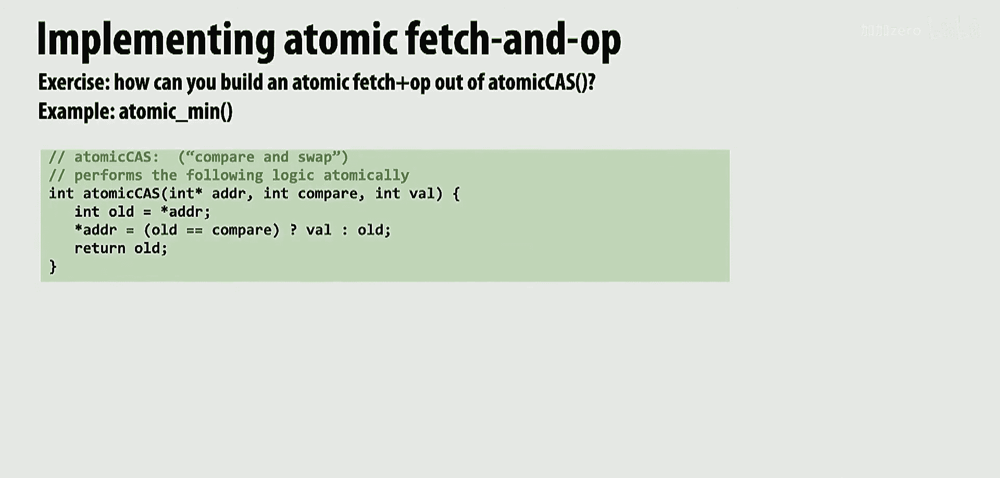

课程前半部分涵盖了几个广泛的主题。第一个主题是理解多核架构，这在第1、2、3讲中进行了介绍。期中考试很可能会涉及相关内容。

另一个主要主题是优化并行程序的通用策略。这些策略通常在编程作业中实践，例如识别和解决工作负载不均衡问题。

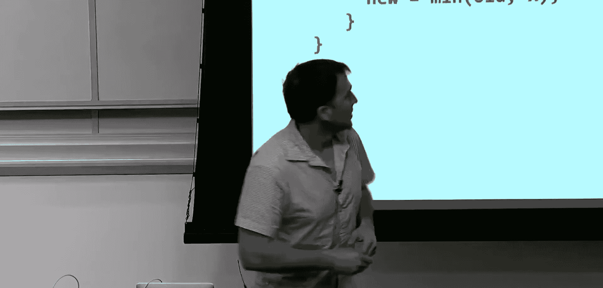

另一类优化通常涉及改善缓存性能不佳的程序，例如通过调整循环顺序来提升缓存性能。

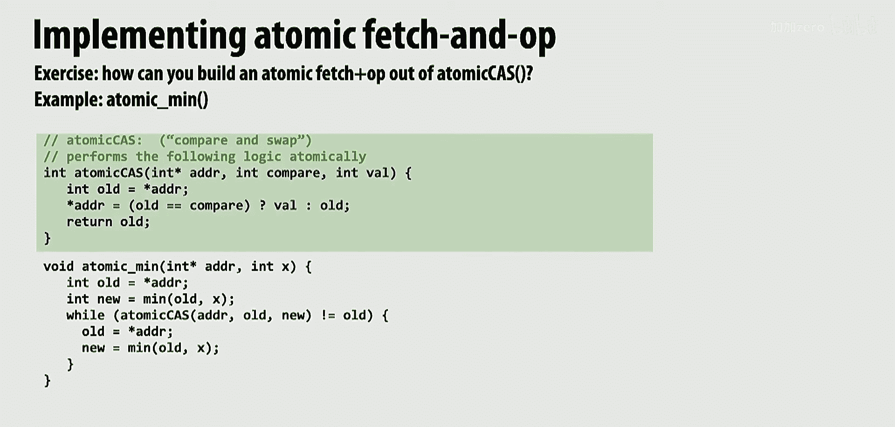

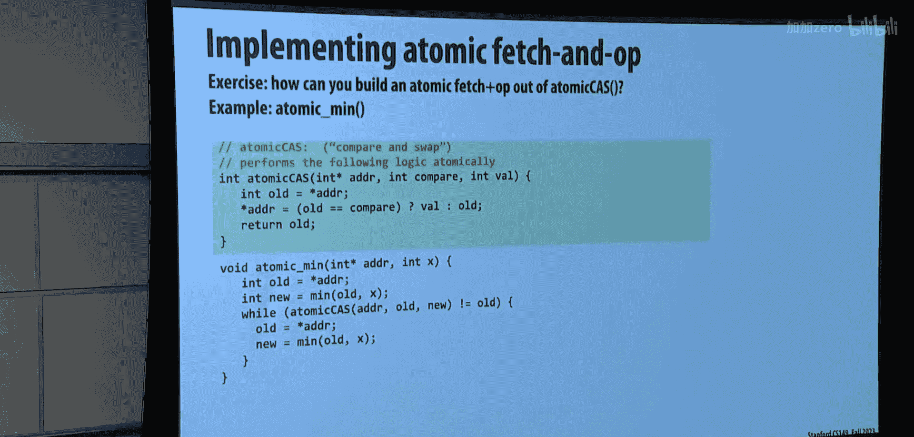

我们还讨论了GPU架构。你应该将其视为前几讲内容的延伸，其工作原理是相似的。理解CUDA编程模型的基础知识很重要，包括线程块的组织和其中的线程，这在完成第三次编程作业后应该已经熟悉了。

我们有一讲关于深度神经网络。虽然不需要掌握任何特定深度神经网络的细节，但需要理解其中的两三个主要概念。一是缓存局部性至关重要，我们讨论了分块技术。其他内容则更多涉及专用硬件等，这些内容在课程后续部分会深入探讨，更像是期末考试的主题。

我们讨论了数据并行思维。因此，在期中考试中，可能会要求你完成一个数据并行思维的练习。

上一讲我们讨论了细粒度锁定。我们谈到了比较并交换操作以及如何实现一些锁。我们还讨论了这与缓存一致性工作原理之间的关系，以及在一些有趣的关联。我们讨论了在细粒度锁定场景中使用锁，并给出了一些练习题。在期中考试层面，细粒度锁定的练习题会更简单，可能不会比链表之类的更复杂。但在期末考试前，你会有更多时间来处理哈希表、图、树等其他数据结构上的练习题。

当然，Kunle教授还讨论了MSI协议、缓存一致性的含义及其背后的主要思想。我们还讨论了宽松内存一致性的概念，即尽管一个线程可能先写X再读Y，但其他处理器可能会以不同的顺序看到这些写操作或读操作，这带来了一些有趣的影响。

## 比较并交换与无锁编程

到目前为止，我们在课程中主要通过两种方式完成所有同步。一种是使用锁。那么，锁或者说互斥意味着什么？互斥意味着在任一时刻，只有一个线程、一个执行者或一个工作者被允许进入代码的特定部分。这意味着如果我正在该代码段中，所有其他人都被阻止运行它。

原子操作基本上也是这种思路，因为原子操作通常用于读-修改-写操作。它表示如果我在读取和修改变量，那么其他任何人都不能同时读取和修改这个变量。

比较并交换是原子操作的一种形式。它是一种读-比较-写操作。它表示我将读取这个变量的值。如果它具有特定值（例如，由参数`compare`给定的值），那么我将把这个新值写入该位置。否则，我基本上会将旧值写回该位置，保持其不变。这是一个原子操作。无论你在什么硬件平台上运行，调用比较并交换都能保证其原子性。

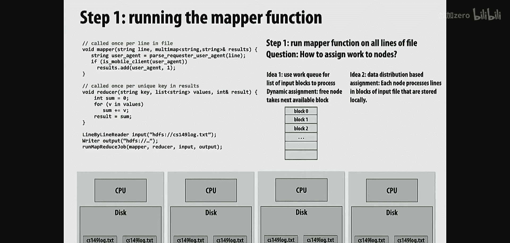

那么，给定原子比较交换操作，我们如何实现一个原子最小值操作呢？一种思考方式是，硬件直接给我一个新的原语`atomic_min`。它能确保互斥，因为“原子”意味着如果我对这个变量进行最小值操作，它会确保没有其他线程或核心能同时读写它。

但这不是我们设计系统的方式。我们不喜欢为每一个想做的事情都构建一堆新的原语。我们更愿意拥有一个坚固且可能快速的原语，并在各种上下文中使用它。

让我们看看这个原子最小值操作，并回顾其工作原理的哲学。最小值操作要求我从内存中读取值，检查内存中的值是否小于我试图与之比较的新值。如果我的值更小，则需要将内存中的值更新为更小的值。所有这些操作都必须是原子的。

首先，请确认，如果我给你一把锁，你可以轻松地不使用比较交换来实现这个操作。你会获取锁，读取值，检查它是否更小，可能更新值，然后释放锁。这绝对是正确的，并且能确保互斥，一次只有一个线程尝试执行原子最小值操作。

那么，有人能描述一下这段代码在做什么吗？它并没有确保整个最小值操作的互斥性。不同的线程可以同时从内存中读取该值，并检查自己的值是否小于它。

如果我们查看得出主要结论所依据的条件，它确保在写入时该条件仍然有效。其思想是：如果我从内存中读取了值，然后开始做任何我需要做的工作（在本例中是计算某个值的最小值），那么我必须原子性地执行一些计算，然后将值写回。

我完成我的工作（即取旧值和我拥有的值的最小值），然后我返回并检查：如果内存中的值仍然是我开始时的值，那么我可以确信没有其他人介入，或者即使有人介入，他们至少没有更新最小值。这就是原子比较交换的作用：如果这个地址中的值仍然是`old`，请将其更新为`new`。我知道这是否成立，因为原子比较交换返回内存中的值，如果那个值等于`old`，就进行检查。

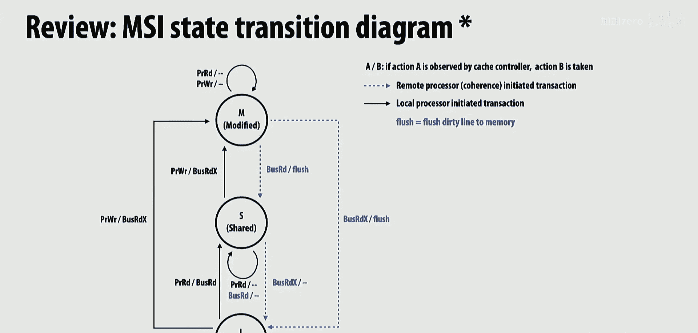

那么，如果在我尝试执行原子最小值操作时，另一个线程介入，读取了值，检查后发现自己的值太大而不需要更新，我的原子最小值操作会成功吗？这里没有互斥，我们俩同时运行在这个所谓的“重要同步区域”中。但是，除非我们俩的操作造成了需要同步的情况，否则我们可以继续执行。换句话说，我们是在推测。我们假设不会发生冲突，然后继续执行。在最后写入之前，我会去检查这个假设是否成立。如果成立，我所做的工作就是有效的，我可以继续；如果不成立，代价是什么？我必须重做一遍，我在旧值上所做的所有工作都可能被浪费。

这种无锁思维更像是：我需要确保呈现出与互斥相同的结果，但实际上并没有强制执行互斥。这是巨大的思维差异。感恩节后，Kunle教授将讲授几节课，其中两节实际上是关于事务内存的概念，这个概念将这种思想扩展到任意函数写入多个变量的情况。你只需编写你的函数，它可能读写一堆变量，系统会判断这些读写是否与另一个处理器的读写冲突，并实际上中止并回滚其中一个处理器。

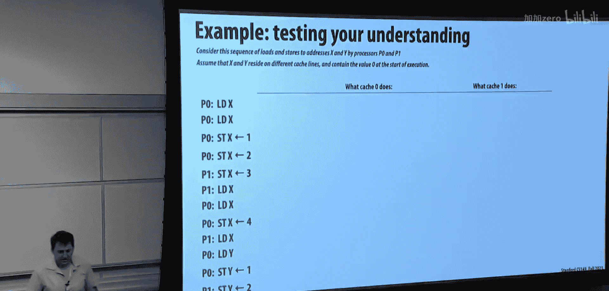

对于明天的评估，我希望你了解这个程度的无锁知识。在后面的课程中，如果你感兴趣，我会展示如何实现无锁栈等数据结构。例如，无锁链表的实现在一些并行计算课程中会涉及，要正确实现它非常复杂，可能需要一整节课的时间只讲链表的无锁插入和删除。因此，我不会在考试中问你如何实现无锁链表的插入和删除，因为这实际上非常棘手。

## MapReduce 与数据并行系统

在所有这类编程系统中，首先要思考的是API及其含义。在MapReduce中，实际上只有两个API函数。MapReduce的历史是，它是一篇来自谷歌的非常简单的论文，大概在21世纪初。谷歌的人说，谷歌有很多任务需要在海量数据上运行。为了处理海量数据，比如整个网络索引，他们实际上构建了GFS（Google文件系统）。基本上，世界上所有的数据都在这个文件系统中，文件系统分布在大量计算机上。他们有很多应用程序，比如数据挖掘等。

第一个函数调用叫做`map`，之所以叫`map`是因为它受到了数据并行`map`的启发。第二个函数调用叫做`reduce`，受到了`reduce`的启发，但它们与我在数据并行思维讲座中给出的定义略有不同。

`map`的定义如下：假设我们要对一个巨大的TB级文件的所有行进行`map`操作，文件的不同部分分布在不同机器上。`map`表示对于文件中的每一行（或者对于所有内容），运行这个函数`F`，就像`map`一样。在MapReduce中，`map`的输出不是一个任意类型`T`，而实际上是一个键值对。输入可能是一个字符串（文件中的一行），然后函数`F`被映射到文件的所有行上，为每一行生成一个键值对。例如，键可能是用户代理（浏览器），值可能只是数字1。

然后系统会进行一些“魔法”操作。MapReduce的巧妙之处（或者说非常死板）在于，系统会获取所有这些键值对。请记住，`map`函数可以在所有机器上运行。如果你的文件分布在1000台机器上，它只会在已经持有文件部分的机器上运行`map`函数，这样数据就不需要移动。

接下来是大数据通信部分。每次调用`F`都会产生一个键值对。然后MapReduce的设计硬性规定，API会将所有具有相同键的键值对组织到一个文件中。这样，我就有了针对所有不同键的不同文件。每个文件只是匹配该键的所有值的列表。这就是数据四处移动的地方，类似于一次大的重排。

然后你有了`reduce`。`reduce`以键和值列表作为参数，并产生一个结果。因此，`reduce`函数实际上被映射到所有唯一的键上。`reduce`函数的输入是它正在处理的键，加上与该键关联的值列表（本质上是文件的内容）。此时，它可以做任何想做的事情并产生一个结果。之所以叫`reduce`，可能是因为在这个例子中，它获取所有具有相同键的值，并聚合了具有该键的行数，然后返回结果。

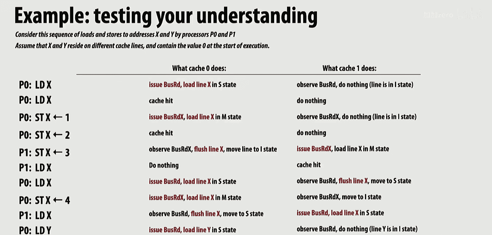

实际上，`reduce`这个名字并不是并行`reduce`之类的意思。它实际上是`map`，接着按键分组，然后再`map`。在现代并行编程中，这就是它的含义。如果你觉得这很奇怪：我拥有所有这些计算机，我的数据分布在所有计算机中，而我们的通信方式竟然是写入文件系统，然后从另一个节点读回来？Spark的人说这太蠢了。他们说我们应该在内存中完成所有这些，并使用一套恰当的数据并行操作符，而不仅仅是MapReduce的按键分组。这就是Spark背后的整个思想。

关于MapReduce的一个动机是，当时的商用硬件非常便宜，而且由于数据量巨大，人们最初并不太关心延迟，更关心吞吐量。但吞吐量也会受到延迟的影响。不过，在具有大规模并行性的情况下，延迟可以被隐藏。你关心的是带宽和吞吐量。真正的问题是在计算阶段之间，整个数据集（TB级数据）从磁盘读取，写回磁盘，然后再读回来。即使按键分组本身没做什么，也存在窄依赖问题。

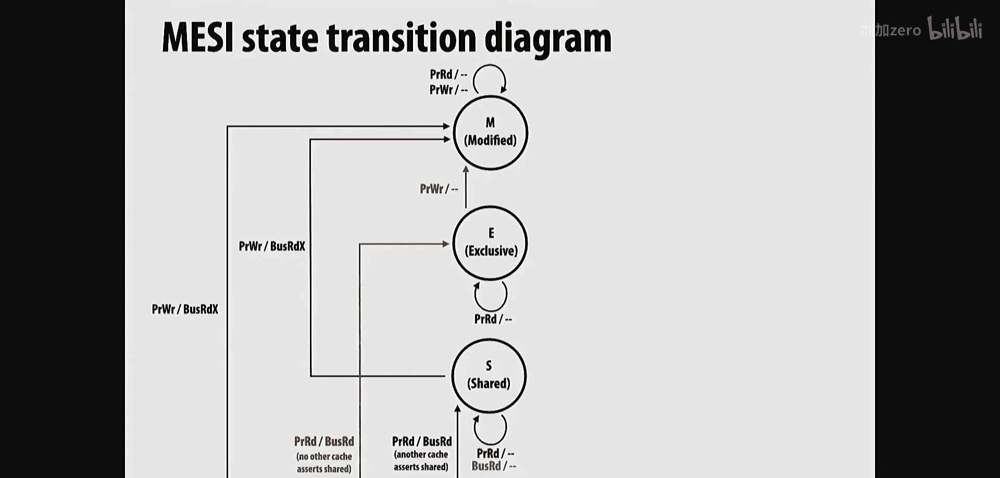

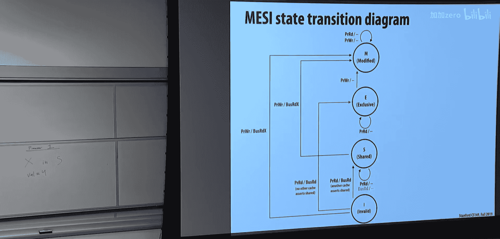

当时的人们觉得，他们可以用大约10行代码编写程序，使用1000台机器，获得容错性和并行性，所有这些都封装在这两个抽象中。但后来有些人指出，人们过于迷恋并行性而忘记了局部性。有人在一台笔记本电脑上展示了，一个单核笔记本电脑可以超越一个5000节点的Spark集群，仅仅是因为人们被并行性吸引而忘记了局部性等因素。如今在2023年，花3美元一小时就可以在AWS上获得一台拥有512GB内存的机器。大多数时候，我们处理的问题规模并没有超过你能用很少钱买到的计算资源。因此，更多地思考局部性，并扩展到4TB大小的机器，比尝试让你的代码在10000个节点的集群上具备容错性和鲁棒性更有意义。

## 缓存一致性协议演示

让我们通过一个演示来理解MSI缓存一致性协议。假设我们有两个缓存：Cache 0和Cache 1。最初，两个缓存中都没有任何数据。

1.  **Cache 0 加载 X**：Cache 0发出总线读X请求。由于没有其他缓存拥有X，Cache 0将X放入共享状态。
2.  **Cache 0 再次加载 X**：Cache 0已经有X在共享状态，可以直接读取，无需发送任何消息。
3.  **Cache 0 写入 X（值=1）**：Cache 0需要将X从共享状态升级到修改状态。它发出总线写X请求，通知其他缓存。Cache 1没有X，所以忽略。Cache 0将X状态改为M，并更新值为1。此时，内存中的X值可能仍是旧值（例如0）。
4.  **Cache 0 再次写入 X（值=2）**：Cache 0已经有X在M状态，可以本地写入，无需通知其他缓存，值更新为2。
5.  **Cache 1 读取 X**：Cache 1发出总线读X请求。Cache 0拥有X在M状态（脏数据），因此必须将数据写回（刷新）到内存（或直接提供给Cache 1，在更高级的协议中）。Cache 0将X状态降级为S（或I，在基本MSI中），并将值2写回内存。Cache 1接收到值2，并将X放入共享状态。
6.  **Cache 1 写入 X（值=3）**：Cache 1需要将X从S升级到M。它发出总线写X请求。Cache 0收到请求，将其拥有的X副本置为无效（I）。Cache 1将X状态改为M，并更新值为3。
7.  **Cache 0 加载 X**：Cache 0发出总线读X请求。Cache 1拥有X在M状态，必须刷新数据（值3）到内存，并将状态降级为S。Cache 0接收到值3，并将X放入共享状态。
8.  **引入新变量 Y**：两个缓存都可以独立加载Y到共享状态，互不影响，因为这是不同的地址。
9.  **Cache 1 写入 Y**：Cache 1需要将Y从S升级到M，过程与X类似，会通知Cache 0将Y置为无效。

**关键点**：
*   缓存一致性是关于**同一内存地址**的状态管理。不同地址的缓存行有各自独立的状态机。
*   任何缓存本地状态的改变（如S->M, M->S, ->I）都需要通过总线（或点对点消息）通知其他缓存，以便它们更新自己的状态，从而做出正确的访问决策。
*   M（修改）状态意味着该缓存拥有该行的唯一、最新副本，并且是“脏的”（与内存不一致）。
*   S（共享）状态意味着该行是干净的（与内存一致），但其他缓存也可能有副本。
*   I（无效）状态意味着该缓存行数据无效（要么不在缓存中，要么已过时）。
*   更高级的协议（如MESI）增加了E（独占）状态，用于优化“读-后-写”场景：当只有一个缓存拥有该行的干净副本时，它处于E状态，后续写入可以直接升级到M而无需总线通信。

**关于原子操作**：像比较并交换这样的原子读-修改-写操作，在缓存一致性协议中需要被视为一个**写操作**来处理。它必须直接从无效状态获取缓存行并进入修改状态，或者通过一次原子性的总线事务来确保整个操作期间没有其他缓存能访问该地址，从而保证操作的原子性。不能先读（进入S状态）再写（升级到M），因为中间其他缓存可能修改了值。

## 宽松内存一致性

宽松内存一致性是关于**不同内存地址**的操作顺序在多个处理器/线程视角下的可见性问题。

*   **程序顺序**：在单个线程内部，指令必须按照程序顺序执行并产生结果。硬件和编译器的乱序执行、并行执行必须对程序员透明，确保单线程语义正确。
*   **全局顺序**：在顺序一致性模型中，所有线程的所有内存操作（读/写）可以排列成一个全局的总顺序，这个顺序与每个线程的程序顺序一致。
*   **宽松一致性**：放松了对不同地址操作顺序的约束。例如，一个线程先写X，再写Y。在宽松模型下，其他线程可能会观察到Y的更新先于X的更新。这被称为**写-写重排序**。
*   **与缓存一致性的关系**：缓存一致性保证了对**同一地址**操作的全局顺序（所有处理器最终看到对该地址的修改顺序是一致的）。宽松一致性则处理**不同地址**操作之间的可见性顺序。两者是正交的概念。
*   **重要性**：宽松一致性允许硬件和编译器进行更多优化（如写缓冲区、更灵活的内存操作调度），从而提升性能。但程序员（或高级语言/库）有时需要使用内存屏障（fence）或同步操作来强制保证特定顺序，以确保程序正确性。

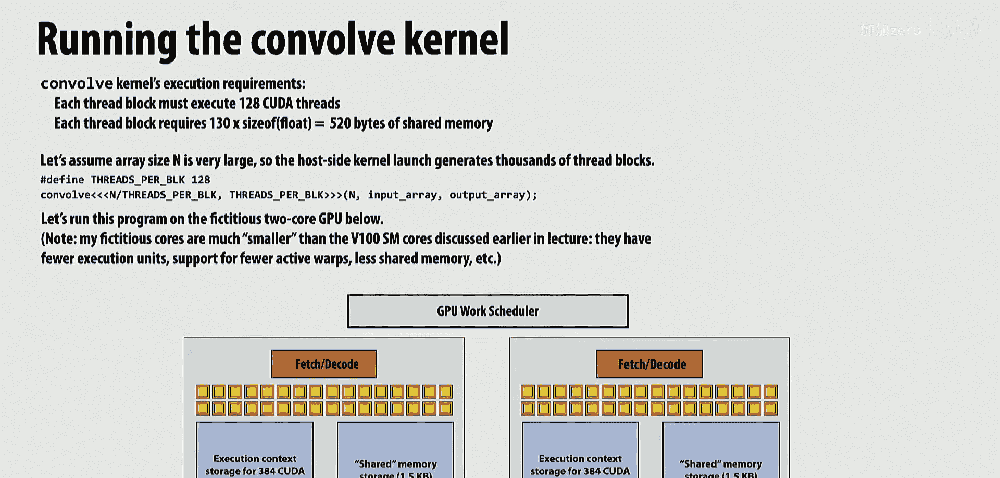

## CUDA执行模型回顾

CUDA的执行模型基于层次化线程组织：

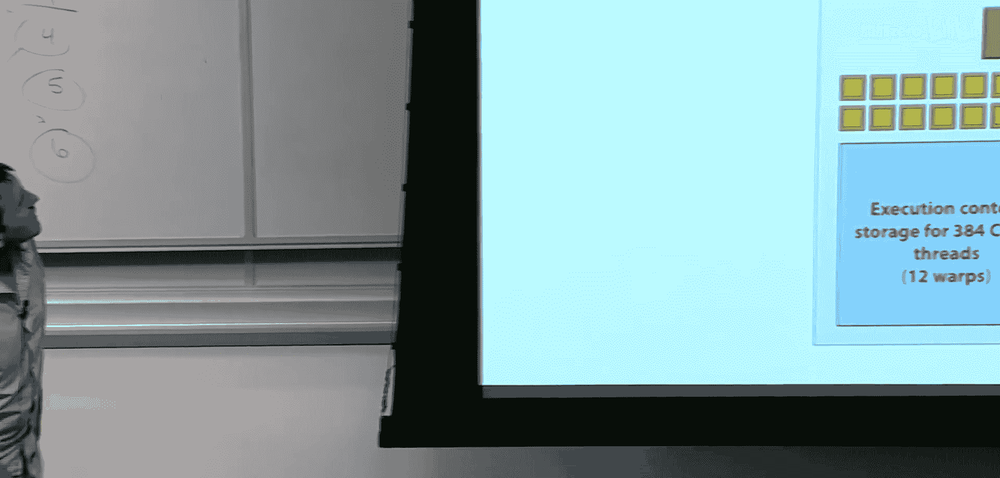

1.  **线程**：最基本的执行单元。
2.  **线程块**：一组线程的集合。线程块内的线程可以通过共享内存和同步原语进行协作。线程块在GPU的一个流多处理器上执行。
3.  **网格**：所有线程块的集合，构成一次内核启动。

**调度与执行**：
*   GPU硬件（如NVIDIA的SM）拥有固定数量的执行资源（ALU、寄存器、共享内存等）。
*   当启动一个内核（网格）时，GPU调度器会将线程块分配给可用的SM。
*   分配决策基于资源约束：每个SM能同时驻留的线程块数量受限于其拥有的**线程上下文数量**、**寄存器总量**和**共享内存大小**。
*   **目标**：尽可能让所有SM都忙碌，以最大化硬件利用率。因此，调度器倾向于将线程块分散到不同的SM，而不是堆在同一个SM上，除非资源限制迫使它这样做。
*   **线程块内的执行**：线程块内的线程被分组为**线程束**。一个线程束通常包含32个连续线程ID的线程。SM以线程束为单位进行调度和执行。在一个时钟周期内，SM的一个执行单元（如一组ALU）会执行一个线程束的一条相同指令（SIMD风格）。由于分支发散，线程束内的线程可能执行不同的代码路径，这会降低效率。现代GPU可能会尝试在硬件层面重新组织线程以改善SIMD效率，但这通常是实现细节且不透明。

**与CPU向量化的对比**：在CPU上（如使用ISPC），程序员或编译器需要显式地生成与硬件宽度匹配的向量指令（如SSE, AVX）。在GPU上，程序员只需声明大量的标量线程，硬件负责将这些线程映射到其宽SIMD执行单元上。这提供了更好的可移植性：同一份CUDA代码可以在具有不同SIMD宽度的未来GPU上运行，而无需修改。

## 总结

本节课我们一起回顾了并行计算课程前半部分的核心内容。我们涵盖了多核架构基础、并行程序优化策略、GPU编程模型（CUDA）、数据并行思维与MapReduce、无锁编程与比较并交换操作，以及至关重要的缓存一致性协议（如MSI）和宽松内存一致性模型。理解这些概念对于设计和分析高效、正确的并行程序至关重要。希望通过这次复习，大家能巩固所学知识，为期中考试做好准备。