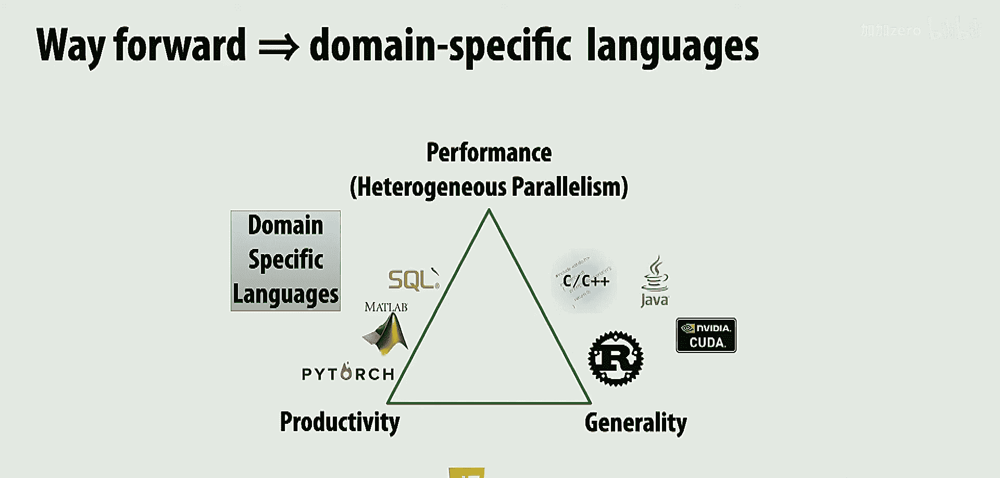
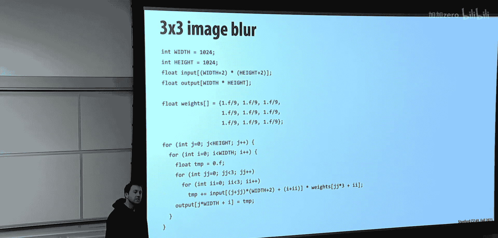
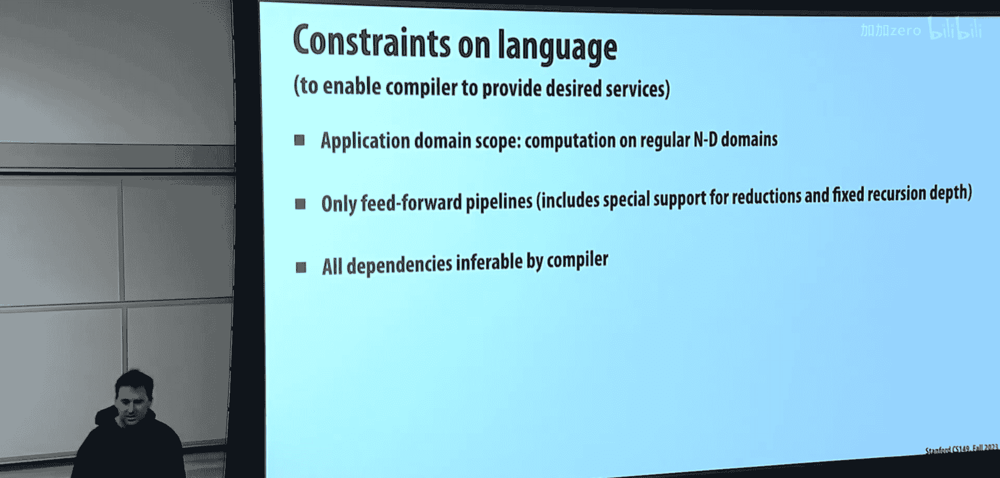
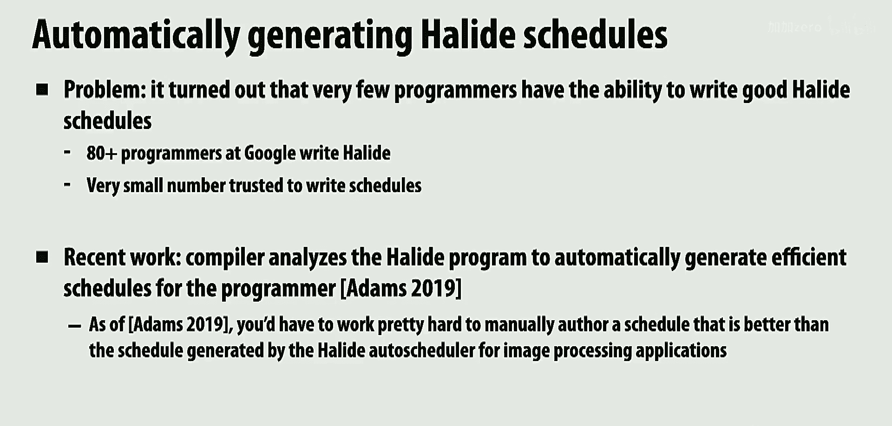
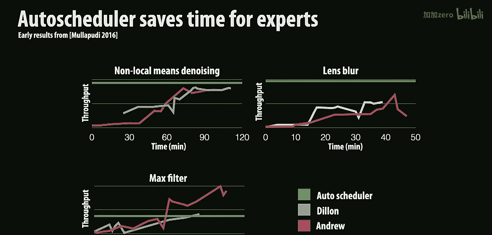
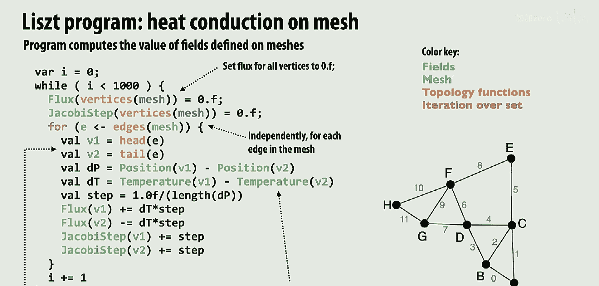
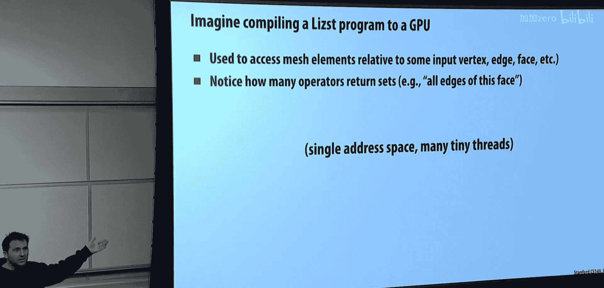

# 015：领域特定编程语言

在本节课中，我们将学习领域特定编程语言（DSL）的概念，并通过两个案例研究——Halide和Liszt——来探讨它们如何帮助领域专家在保持高生产力的同时，获得高性能的计算结果。我们将看到，通过限制语言的表达能力，编译器可以获得足够的信息来生成高度优化的代码，甚至自动探索优化空间。

## 课程剩余安排

感恩节之后有两节关于事务内存的重磅课程，考试中几乎肯定会有相关题目。

在学期结束前的另外三节课中，今天的课程是关于领域特定编程系统。最后一周，Kim将更多地讨论专用硬件，例如不可编程处理器及其能效。

这三节课更偏向于概念性介绍，目的是让大家了解并意识到这些内容，以便在未来进一步学习。考试题目也会更偏向概念性，而非具体计算。

## 课程目标与背景

本节课的目标有两个。首先，到目前为止，本课程中大家实现的代码都运行在相当底层的编程系统上，本质上是C++、CUDA或ISPC。虽然这些系统接管了生成SIMD指令的责任，但大部分关键决策仍需由你做出。这是有意为之的，目的是让你了解线程池等底层机制是如何实现的。

现在，我们将探讨更高层次的抽象。这些抽象适合那些精通某个特定领域，但可能没有上过CS149或对底层实现不感兴趣的专家使用。今天我将通过两个案例研究来讨论这个问题，这两个例子都与斯坦福大学有关。

## 案例研究一：Halide

我们将讨论用于编写Google Android手机照片应用中所有图像处理的编程语言Halide。据我所知，至少在几年前，每张经过Instagram处理的图片都使用了名为Halide的语言编写的滤镜和处理程序。

另一个是斯坦福大学开发的研究性语言Liszt。虽然你可能永远不会遇到它，但它很好地展示了高层次抽象的价值。

## 领域特定语言（DSL）的核心理念

到目前为止，我们使用的编程系统都需要相当聪明的人来优化。在程序员群体中，CS149的学生已经非常稀少，而能写出高度优化代码的人更是凤毛麟角，这一点从作业1、2、3，尤其是作业4中可以得到证明。

在计算机科学中，无论是系统、编程语言还是编译器领域，人们一直追求一种理想编程语言应具备的特性。首先，我们希望能够高效地表达想要编写的程序。如今，借助大语言模型，人们甚至希望从想法直接生成可工作的正确代码。Python因其高生产力而成为许多人的首选语言。

其次，在许多场景下，如机器学习、数据科学、处理TB级图的大图算法，或处理千万像素的图像处理，我们都需要高性能，因为代码需要在iPhone或数据中心上运行。

历史上，人们还希望编程语言是通用的，能够编写任何程序。这就形成了评价编程语言的三个维度。

如果我们观察许多广泛使用的编程语言，它们往往在某些维度上表现突出。例如，Web开发人员使用JavaScript可以快速编写各种程序，但性能可能不佳。而使用C++或Rust（甚至包括Java、CUDA）则是为了追求高性能。

今天我们要讨论的是位于生产力和性能之间空白地带的语言——领域特定语言。我们非常关心生产力，例如，使用PyTorch可以快速搭建新的神经网络。同时，我们也希望它极其高效，不仅仅是并行高效，还要能利用GPU或TPU等加速器。为此，我们愿意放弃表达任意程序的能力。

你可能已经遇到过许多DSL的例子。PyTorch不是用来构建任意程序的通用语言，而是用来表达张量运算的。SQL是一种受限的语言，但它是查询数据库的绝佳语言，你完全不需要考虑查询如何在大型数据库上并行执行。Matlab也属于此类。其他例子还包括地理空间数据库查询语言、OpenGL等图形API，以及构建在PyTorch之上、提供更少灵活性但更易用的各种机器学习工具。

这就是今天课程的核心论点。我认为，过去5到10年对领域特定语言的重视已经结出硕果。大约10年前，放弃C++、Java的灵活性而迫使人们走一条狭窄的道路可能还有些争议。但如今，这已成为一个重要的承诺。

通常，我们在讲完专用硬件后才上这节课。虽然我们还没讨论专用硬件，但请记住，高性能不仅意味着并行，还可能意味着使用TPU、加速器，或Apple Watch中的五种不同处理器等。

## DSL的设计思路

其理念是快速编写程序，并且只编写一次。我们使用系统编译器所了解的原始操作来编写。例如，PyTorch知道什么是ND张量；SQL知道当你选择某行时，“选择”意味着什么。系统将利用这些知识，在你运行的任何系统上提供最佳实现。

例如，在SQL中执行“SELECT * FROM ...”时，数据如何布局、使用什么算法和索引结构（是二叉树还是B+树）——所有这些实现决策都由系统处理，程序员只需请求一个满足过滤条件的关系表。在不同的系统上，这个实现可能截然不同。

在PyTorch中，你可能会说“请将这个张量通过这个卷积层”。如果在GPU上运行，这将是某个cuDNN实现；如果在Intel CPU上，可能完全是另一个实现；如果在Google TPU上，又将是不同的实现。

让我们通过一些例子来思考设计这些领域特定抽象集时所做的决策。

## 图像处理的工作负载分析

在讨论Halide提供的原始操作之前，我们必须先了解该领域人员试图编写的工作负载是什么。

这里有一个例子，我很好奇在30秒内，你能告诉我这段代码是做什么的吗？

它模糊了一张图像，从函数名可以看出来。但它是如何模糊图像的？滤波器大小是多少？如何并行化？如何向量化？这段代码相当复杂。这就像在作业1时期，我们用你的MMX内部函数`_mm_load_128`替换了某些东西。在CS149的背景下，你可能需要自己实现这些。

现在，我问另一个问题：这段C代码是做什么的？这次我给你函数名，所以你不能作弊。这是一个卷积。给定一个图像（一个2D数组，像素矩阵），这里是一个单色图像，因为每个像素只有强度值，没有红绿蓝。每个输出像素是其周围相邻像素的平均值。

所以，这是针对每个输出像素的循环。然后，对于每个输出像素，循环遍历其3x3的邻域像素块并将它们平均起来，加起来然后除以或乘以权重，这里权重处处都是1/9。

在之前的讲座中我提到过，如果你运行这段C++代码，你会模糊一张图像，结果看起来有点像这样。

那么，我们来分析一下这段代码。每个像素做了多少算术操作？基本上这里有一次乘法和一次加法。所以，我做了9次乘加操作，然后是一次存储。因此，完成这项工作的成本是 `9 * width * height`。如果我们考虑滤波器是n x n而不是3x3，那么工作量就是 `n^2 * width * height`。这就是我们做的总操作数。

现在，我需要给你一个小信息。如果你了解图形学，你会知道这个2D卷积滤波器实际上可以分离成两个1D卷积。在这种情况下，我可以先对所有行进行一维水平模糊（每个像素是其自身及左右邻居的平均值），然后对那个结果进行垂直模糊。仔细想想，水平模糊后，我加起了三个数；垂直模糊后，我又将三个这样的部分和加在一起。我做的数学运算完全相同。

所以，代码可能看起来像这样。我在左边用C语言写了出来，右边展示了内存分配。输入大小是width x height。`+2`并不重要，我只是不想在输出中处理边界条件。然后，在水平模糊时我将其缩小了两个元素，在垂直模糊时又缩小了两个元素。

那么，我现在做了多少工作？以前是 `n^2 * width * height`。现在是多少？现在是 `2n * width * height`。从每个像素9次操作降到6次，可能看起来不那么显著。但如果是一个7x7的滤波器呢？那就是每个像素49次操作对14次操作，我们在数学上开始获得显著的提升。如果你在Photoshop中模糊图像，经常可能使用像100x100模糊半径的滤波器，所以情况会很快变得复杂。

这样很好，我们减少了完成这项工作所需的数学运算量。

你发现什么可能不太好的地方吗？考虑到我们在这门课中经常思考的其他方面。

一个不幸的事情是，我基本上将内存占用增加了33%。以前我需要一个输入和一个输出缓冲区。现在，我需要输入、输出和一个相同大小的临时缓冲区。如果我在手机上处理一张1200万像素的图像，分配另一个1200万像素的缓冲区（假设是RGBA四通道浮点数，约48MB），这在手机上可能很重要。

你还注意到什么？我们经常考虑的事情包括：并行性（这里还没有讨论）、完成的工作量、内存占用、内存带宽与算术强度、缓存一致性等。但这里还没有并行性。

那么，让我们仔细看看这个程序。每个输入被读取了多少次？从技术上讲，每个输入被读取了九次，但从内存中读取的次数呢？可能只有一次。不过要小心，因为我们讨论过分块。这意味着如果你能在缓存中容纳两行数据，那么你就有足够长的时间将数据保留在缓存中，从而只从内存读取一次。所以，只要几行数据能放入缓存，这个程序就会将每个输入元素读取一次，并确切地将每个输出元素写入一次。

现在看这个分离的版本。这个版本将每个输入元素读取一次，写入临时缓冲区一次，然后再次读取每个临时缓冲区元素，最后写入输出一次。所以，我的算术强度不仅因为内存占用增加而降低，而且大约降低了2倍。如果我们之前受带宽限制，现在会更慢；如果我们之前受计算限制，也许我们有所改进。

所以，我们实际上已经讨论过这一点。我指出了所有数据被重用的地方。

那么，给观众提个问题：有没有办法做得更好？让我用一段看起来有点像这样的算法来启发一下思考。我希望你确保理解这段代码在做什么，或许可以和人讨论一下。我已经给出了一些提示来帮助你理解。

这段实现没有分配超过三行的临时缓冲区。

需要一点时间来消化。如果你想和人讨论，或者自己想明白，我会给大家大约30到45秒的时间来思考。

我高亮的关键点是，最外层循环是遍历行（`rs`），然后内层循环是0到3。

那么，这里发生了什么？我们如何解释它？如果你在办公时间向我用高级语言解释，这里发生了什么？

一种思考方式是，你正在执行与上一张幻灯片相同的算法，但是你在不同的数据块上多次执行。是的，所以我的做法是：我不需要整个临时缓冲区，不需要整个中间结果。我所做的是，我先进行第一遍处理，但只生成三行输出。我取三行数据，对它们进行水平模糊。这就是我随后进行垂直模糊以得到最终一行输出所需的全部信息。

换句话说，你可以这样理解代码：最外层的`j`循环是针对每一行输出。然后，生成产生该行输出所需的三行临时数据。接着，取这些行，压缩它们，并进行垂直模糊以产生该行输出。

我喜欢这样理解这段代码：只看循环，然后说，对于每一行实际输出，首先产生所需的输入，然后消费这些输入以产生该行输出，然后重新开始。

我这样做的好处是，我的临时缓冲区分配从整个图像的大小减少到大约三行，这很好，因为这三行现在可能可以放入缓存。我找回了我的算术强度。我做了这个两阶段算法，我认为这很好。没有额外的分配，并且我使临时缓冲区足够小，对该缓冲区的写入和后续读取将命中缓存。

但是我付出了什么代价？有时行会被多次计算，如果它们重叠的话，因为你每次处理三行。是的，所以请注意，临时缓冲区的每一行实际上可以被重用三次。但我产生一整行临时数据（三行），使用它，然后丢弃所有这些信息，再计算另外三行临时数据，如此反复。所以我重新计算了很多东西，这削弱了这种两阶段方法的好处。

事实上，如果我计算每个像素做了多少次操作，你能算出来吗？或者也许计算每行的操作数更容易思考。对于每一行输出，我首先做什么？我对三行数据，每行每个像素做三次操作。然后我在这里再做三次操作。所以我最终每个像素做了 `3*3 + 3 = 12` 次数学操作。这实际上比我开始时更糟。有点倒退的感觉。

但感觉我们更接近了。那么有什么想法？我想最小化所做的数学运算，希望接近 `2N`。但我想要高算术强度和低内存占用。我能做什么？

一个潜在的想法是保留最后两行，然后写入。如果我们顺序思考，我们可以把那个红色缓冲区当作一个滚动缓冲区。你向下滑动两行，可能再加一行新的。然后我们就可以继续了。现在，我们将支付向下滑动两行的成本，可能只是一个内存拷贝。缓存方面可能会有点麻烦。或者我们实际上可以让代码使用间接引用来引用数据。但现在代码会变得有点难看。

事实上，如果你这样做，你会发现，在现代计算机上，你为索引额外添加的数学运算会使代码变慢，超过其他优化带来的好处。

还有其他想法吗？顺便说一下，如果你这样做，这个滑动窗口滚动缓冲区的方法，你突然在每一行之间创建了依赖关系。而我们之前并没有行间的依赖关系。所以这可能会反过来困扰我们，因为我们想并行化这个东西。

还有其他想法吗？将缓冲区分成三部分，然后保持这些独立的部分。你是建议我将输入水平切成三列吗？不完全是。让我确认一下我理解对了。临时缓冲区目前是三行。你建议也将其水平切成三列（三个块）。然后呢？但这是一样的。你只是利用了C语言中二维索引的便利性，而我自己将其扁平化了。但在底层，编译器会以完全相同的方式扁平化。我认为我们说的是同一件事。

或者，也许像分成方块之类的，在边缘会有一些重叠，你在那里预先计算。你可以有更小的缓冲区？这实际上有几种方法可以实现。我喜欢这个想法。首先，想想我在这里是如何设置问题的。以一种按行思考的方式，我会说，对于每一行输出，独立地计算你所需的三行临时数据，然后处理那行输出。然后对所有输出行都这样做。

你说的问题在于，我的解决方案中，对于每一行输出，我们都要额外计算其上方和下方的一行。所以，对于我做的每一件事，都有两行的开销。那么，如果我们不是只考虑每一行输出，而是说，对于每10行输出，计算12行中间结果，然后快速处理它们。我们仍然在计算一些额外的东西，但现在对于每10行只有2行额外开销，而不是每行都有2行额外开销。这就是我下一张幻灯片要讲的内容。

所以，我在这里所做的就是，现在看临时缓冲区，它是 `(chunk_size + 2) * width`。在我脑海中，我是说，对于每 `chunk_size` 行输出，首先产生 `chunk_size + 2` 行临时数据，然后产生你的输出。现在的开销是多少？随着 `chunk_size` 变得越来越大，这将趋向于我原来的 `2N` 算法。所以，我倾向于使 `chunk_size` 尽可能大。

但是，如果我把 `chunk_size` 设得太大，会发生什么？块将无法放入缓存，那么分块就完全没有好处了。这与分块思想类似。所以，这是一种改变程序的方法。例如，如果 `chunk_size` 是16，我们粗略计算一下，每个像素大约需要6.4次操作，比 `2N` 多一点，但肯定不是9，对于更大的块大小来说，也肯定不是 `N^2`。

所以，这就像你在SpMV中首次看到的生产者-消费者融合技巧，然后我们在矩阵乘法讲座中又看到了它，现在你再次看到它——重新排序计算以最大化算术强度。但在这里，我们实际上说，我们愿意重新计算一点东西，以最大化算术强度。这在其他例子中没有出现过。

现在，我们还没有完成，因为我们还没有讨论SIMD，也完全没有讨论并行化。顺便问一下，你将如何并行化这个计算？首先，根据我的设置，什么可以被并行化？每个输出块可以并行吗？是的，如果你需要更多的并行性，你实际上也可以将输出块在水平方向上进一步分块。然后我只需要块大小的行，而不是整行的宽度，只是块的宽度加2。

还有另一种方法来实现这个，就是回到只有一个几行大小的临时缓冲区的算法，然后采用你的滑动窗口想法。然后我通过将输出在列上分块来获得并行性。我将只是沿着每一列滑动窗口，希望我的块之间有足够的并行性。这是另一种做法。所以有几种不同的方法可以实现。

所以，本质上，如果你仔细看这段代码，它做的正是我们想出来的。对于输出的每一个块（实际上每个块是256x32），首先计算一个比它宽2个元素、高2个元素的中间块。这就是这两个for循环在做的事情。所以，它是以瓦片（tile）的形式产生输出。如果你看最外层的循环，它是针对y和x方向上的每一个瓦片。首先，使用SIMD指令计算一个 `(256+2) x (32+2)` 的块（这个块大小能放入缓存），然后利用那个块产生输出。这很难一眼看出，但用英语解释起来相当容易。

这就是领域特定语言发挥作用的地方。顺便说一下，每次你想尝试一些不同的东西，比如你想试试这个选项，然后又说，我想试试那个滑动窗口方法。想象一下，从这段代码到一个滑动窗口实现需要多长时间？如果你非常熟练，可能也需要一整天才能搞定。

所以，Halide是一种语言，它的设计初衷并不是像PyTorch那样让不懂并行编程的人也能获得高性能。它是一种让CS149学生能更快完成作业的语言。换句话说，它是一种为那些基本上知道“我想这样分块，在那个循环上向量化，但我不想写代码”的人设计的语言。如果ISPC说“我不想写这个”，那么Halide就是帮你解决这个问题的。对于图像处理，Halide说，我甚至不想处理所有这些循环之类的东西。

## Halide代码示例

这里有一些Halide代码的例子。Halide是完全函数式的。注意，这段代码中完全没有循环。Halide有一个“函数”的概念，因为它是函数式的，但你可以把它们想象成张量。

让我为你解读一下这段代码。`blur_x` 是一个以 `x` 和 `y` 为参数的函数。换句话说，`blur_x` 是一个函数，如果你给我 `x` 和 `y` 值，函数会给出该位置像素的值。这个函数是根据其他函数的输入和输出定义的。它说，`blur_x` 函数在 `(x, y)` 处的输出值是 `in` 函数在 `(x-1, y)`, `(x, y)`, `(x+1, y)` 三个位置值的平均（乘以1/3）。还有另一个函数 `blur_y`，它在 `(x, y)` 处的值是这些 `blur_x` 值的平均。

我正在构建一个表达式树来说明：如果你想知道 `blur(x, y)` 的值，这个表达式定义了如何根据前驱函数计算它。注意，`in` 在技术上是一个缓冲区，它是一个从实际输入数据加载的特殊函数。

你可能会问，如何处理边界条件？例如，如果你输入 `x=0, y=0`，你会得到 `in(-1, 0)`。这正确吗？我想不处理它。你应该直接查找 `in(-1)`。就像你写程序时那样。你真正的问题是，`in(-1)` 是什么？是错误吗？如果它是一个数组，那就是错误。但既然这是一种领域特定语言，而DSL旨在提高生产力，我没有在幻灯片上展示的是，我可以轻松地设置 `blur_y.boundary_condition = 0` 之类的。Halide编译器会插入检测边界条件的数学运算，并输出正确的值。这就是为什么我不想在讲座的其余部分处理它。但这是语言处理边界条件效率高的一个生产力优势。实际上，Halide会生成代码，可能不会在内层循环中使用if语句，而是为 `i=1` 到 `n-1` 生成一个没有if语句的循环，然后为边界条件生成其他循环，如果我把这些都展示给你看，那将是一团糟。

所以，这是生产力的部分。我想再给你一些例子。这段代码说，如果我有一个定义在 `x` 和 `y` 上的函数 `blur_y`，它在 `(x, y)` 处有某个值。那么这里有一个函数 `bright(x, y)`，它被定义为 `blur_y` 的值乘以1.25，然后钳制到255。所以 `bright(x, y)` 就是 `blur_y` 乘以1.25，但要确保将它们钳制到255。

甚至还有一个聚集（gather）操作。我们讨论过数据并行聚集：`output(x, y)` 可以使用 `bright(x, y)` 的值作为索引，在这个函数中查找像素位置。这是一个聚集操作。所有其他操作都是对所有 `x` 和 `y` 的映射。

所以，它是一种函数式编程语言。我们定义了如何计算 `(x, y)` 的表达式。最后一行代码只是说，给我一个实际的C风格缓冲区，其中的值是我在 `x` 从0到124，`y` 从0到124范围内对所有值求值函数 `out` 的结果。这基本上是延迟求值。

所以，这很酷的一点是，我们有这些函数。如果你想想图像处理，如果我向你解释什么是模糊，我不会给你一个卷积公式，我通常会说，计算模糊的方法是，取每个像素，平均它周围的所有像素。这正是这段代码的样子。所以，这个表达式具有生产力，因为它处理了边界条件，而且代码看起来就像数学和我们讨论算法的方式。在某种意义上，代码看起来很像NumPy之类的。但请记住，这些是函数，不是数组或张量。你可以这样想，但最好不要。

那么，如果我想把这个程序看作一个有向无环图（DAG），一个任务列表，我会把每个函数看作一个节点，它们依赖于先前的函数。所以在这个例子中，我们有一个输入函数 `in`，`blur_x` 派生自 `in`，`blur_y` 派生自 `blur_x`，`bright` 派生自 `blur_y`，`out` 派生自 `lookup` 和 `bright`。让我们检查一下，是的。所以我有一个依赖链，输出来自 `bright` 和 `lookup` 中的值。

问题：它可能是在iPhone上吗？首先，大家是否大致理解这个程序应该计算什么？具体来说，它应该计算什么，而不是如何计算。如果我用一堆像素填充 `in`，用一堆像素填充 `lookup`（比如加载一张图像），你会说，是的，我知道 `out(x, y)` 应该是什么。这个图给了你答案。

## Halide表示的两阶段模糊

这是Halide表示的两阶段模糊，我们一直在讨论它。我们有一个来自图像的输入 `in`。我们有第一个函数 `blur_x`，它表示 `blur_x` 在 `(x, y)` 处的值，每个像素应该来自 `in` 中这三个像素的平均值。然后我有 `out(x, y)`，它来自 `blur_x` 中这三个垂直方向像素的平均值。

所以，我整个C代码，如果我们回头看，这个算法的C代码看起来像这样。而在Halide中，它看起来像这样。所以它基本上遵循了数学公式。这很酷。首先，它更优雅一些。你可以阅读代码。如果你是一个算法开发者，你可能知道这意味着什么。现在，这段代码有两个阶段，就像右边的依赖图。如果你看更现实的图像处理程序，它们有很多阶段。大约六七年前，你的Google HDR+相机应用程序大约有2000个Halide阶段。

那么，当你思考这个Halide程序的含义时，如果你是Halide编译器，你现在脑子里可能在想，好吧，如果我是Halide编译器，我的程序在顶部。但我在上一张幻灯片向你展示了，我在心里将这个程序翻译成这个类似C语言的实现，针对每个函数。

分配一个数组。只是试图将函数转换为张量，即2D数组或矩阵。然后，对于每个等式语句，对于每个表达式，那是一个针对输出数组中每个像素运行的操作，并计算值。所以，在某种意义上，你能确认这有意义吗？这不是……这是上面代码的有效实现。所以Halide编译器基本上只是为你写了这些循环。

首先，谁知道Halide的事情呢？它来了。首先，就像这样，现在精确了。这个编译生成了一个顺序的C程序。假设这些是for循环。它分配了这三个缓冲区，正是我们之前说的。我在讲座早些时候用C写过这个。所以我首先确定这是该程序的有效编译，可能还有其他有效的编译方式。

## DSL系统的关键方面

任何DSL系统的一个关键方面是思考你的用户是谁，思考对他们来说什么是困难的，你想让什么变得更容易？我想说，即使我刚才在幻灯片上展示的内容，我能用两行代码写东西，这很好。但你本可以在10分钟内写出C代码。所以，如果我写两行代码，而你用5到8分钟写C代码，那好处并不大。可能有一些语法糖之类的东西，但好处不大。如果我们把边界条件加进去，可能会对你有点帮助。但这不是真正的问题。真正困难的是，如果我回头看，你需要多长时间才能想出这个？即使你知道在CS149该怎么做，你也不知道对于特定机器来说正确的答案是什么。想想你在编程作业中做了多少迭代。

所以，Halide是……Halide程序员曾经用汇编写过很多这些东西，对吧？他们说，我们想要的是，我们不想……拥有一个简洁的语法很好。但我们真正想要的是探索那些我们已知的可能优化选择，并且我们想非常快速地做到这一点。

所以，任务不是表达图像处理计算本身，手头的挑战，手头的任务是完成你的CS149作业，也就是让它变快。Halide引入了一系列思想，允许你在我们讲座讨论的层面上描述你希望如何让它变快。

## Halide的调度（Schedule）

Halide中，白色背景部分是用来表达“计算什么”的Halide程序，即表达算法。它由另一组编程原语补充，我稍后会解释，称为“调度”。调度是关于如何为此生成代码的明确指示。

我将快速用英语为你解读，然后在接下来的几张幻灯片中分解它。这里，程序员已经明确指定了我们想出的解决方案，即：我希望你以256x32的瓦片形式计算输出。请继续，将这些瓦片的循环命名为 `x` 和 `y`，然后是 `xi` 和 `yi`。所以 `x` 和 `y` 是我们在哪个瓦片，`xi` 和 `yi` 是那些瓦片内的内层循环。然后我希望你将名为 `xi` 的循环用8宽的SIMD向量化，并且我希望你在 `y` 循环上进行线程并行。

这样做的结果将是我上一张幻灯片给你的代码。如果你觉得，我不知道这是否有效，也许我应该改变我的瓦片大小。你只需改变这里的参数，就会得到新的瓦片大小，它会为你重新调整。或者如果你说，哦，我不想向量化 `xi` 循环，让我们实际上在最外层循环上做SIMD之类的。你只需改变那些参数。这就是我们要讲的内容，对吧？

这些调度指令为你提供了几种不同类型的原语。一些原语与如何遍历函数的元素有关：行优先、列优先、分块等等。这些只是迭代的一些不同例子。比如，我希望你在y维度上串行执行。或者我希望它是x主序且串行。或者我希望它是列主序。或者我希望在所有y上串行，但在x方向上向量化。或者我希望在所有行上线程并行，所有不同的y是不同的线程，但在这个方向上向量化。所以你有能力表达所有你认为可能需要的不同排列组合。

好的，那么让我们深入一些细节。

让我们看看调度中的这一行。再次强调，我不在乎你是否能记住这个。但这些具体的例子能让你感受到什么是可能的。我们说，`out.tile` 基本上是说，我不希望你默认按行主序计算输出，而是以256x32大小的瓦片形式计算。这就是它的意思。我们决定要这样做。

我们可能需要命名循环变量，所以我们将称之为……代码说，如果你将来需要一个句柄，我们将创建……记住有四个循环，我们将把这些循环称为 `x`, `y`, `xi`, `yi`。

你可以把每一个Halide调度语句看作实际上是在操作程序中存在的循环嵌套。默认情况下，我们有一个循环嵌套，看起来像这样：默认情况下，如果那是程序，Halide有这个循环嵌套，即对于所有 `x`, `y`，创建 `blur_x`，然后对于所有 `x`, `y`，创建 `out`。所以那个语句是说，哦，创建 `out` 的循环嵌套？那是我们的代码所做的。它说，我希望你修改它，使其成为一个分块的循环嵌套，并且我希望你将由此产生的四个循环命名为 `x`, `y`, `xi`, `yi`。

所以Halide实际上有两种语言：一种用于指定你的算法，另一种是命令式语言，描述你希望对循环嵌套进行的一系列转换。

想象一下，我们做了一个转换，创建了四个循环，输出以256x32的瓦片进行迭代。

好的。现在，一旦你有了那个循环嵌套……`out.tile` 返回新的循环嵌套。然后我说，哦，请向量化，当你为 `xi` 循环生成代码时，我希望它是向量化的。当你在 `y` 上迭代生成代码时，我不希望它是顺序的，我希望它在线程池上并行化。

这就是整行的意思。这样做的结果将是，`blur_x` 循环的代码（以前是对于所有 `x` 和 `y`）现在注意它有四个循环变量，并且 `xi` 循环是向量化的。而这个循环，想象一下它是用线程并行化的。

你是在高层次上告诉编译器你希望如何做这件事。好的，所以循环排序是你做的一类事情。另一类事情是我们做了融合。融合就像把一些循环放到另一些循环内部。

这里我说 `out.tile` 创建了这个四层循环嵌套。然后记住，在我的解决方案中，对于每一个瓦片，我首先必须计算所需的临时缓冲区，然后使用它来产生输出。这就是这个循环嵌套。默认情况下，如果我说 `blur_x` 循环嵌套，有一个叫做 `compute_root` 的命令，基本上意味着在层次结构的根部计算它，也就是不要在别人的循环嵌套内部计算它。

所以这段代码会计算整个临时缓冲区。注意我们已经分配了临时缓冲区。然后在分块迭代时访问那个临时缓冲区。这是一个有效的程序，但不太明白你为什么要这样做，不过它是有效的。

现在我要做的是，我要说，嘿，这个 `blur_x`，让我们把它塞到这里。这样对于每一个输出瓦片，我们首先生成一个临时瓦片，然后使用那个临时瓦片。所以我要说，嘿，`blur_x`，实际上我希望你在 `out` 的 `xi` 循环处计算它，实际上我把它塞得更深了，我把它塞进了最内层循环。

所以现在Halide说，哦，对于每一个最内层循环，每一个输出像素需要三个临时像素，所以我要创建三个临时像素，然后我们使用它。我要取三个临时像素，然后我们使用它。

为了得到我们实际讨论过的代码，我实际上希望 `blur_x` 在 `x` 处计算。`blur_x.compute_at(x)` 会把它塞进 `x` 循环。所以它说，对于每一个瓦片，首先计算256x34个元素，然后使用它们，然后丢弃，再计算另一组元素，然后使用它们。

所以，实际上到达我在汇编代码中展示的那个循环嵌套的总结就是那两行Halide调度。是的，你为输出设置循环嵌套，然后你决定把生产者放在那个循环嵌套的哪里。

这其实很有趣，对吧？这不是最典型的系统。这里的理念是，程序员负责描述图像处理流水线，那是算法。但程序员也负责进行所有关于如何优化它的概念性思考，那就是调度。有两种协作的领域特定语言来做这两件事。

然后编译器负责基本上执行它的命令。如果在ARM上，生成这些内部函数和线程代码。如果在x86上，做这个。适当地处理边界条件和分配等等。因为通过函数式了解了所有的依赖关系，基本上没有指针追逐之类的事情。编译器知道它可以移动这些循环嵌套并为你改变所有索引，而永远不会改变程序的正确性。所以Halide的理念是，如果你修改调度，你永远不会改变输出。这只是一种优化。

然后是一些非常早期的结果，现在基本上有十年了。最初的论文表明，哦，我们可以编写更少的代码，并且大多数时候获得比手写汇编更高的性能，即使编译器生成的汇编代码不如优秀程序员手写的好，但程序员能够更快地迭代高层次设计空间，尝试更多的东西。所以全局结构更好，即使代码可能比优秀程序员慢10%、20%、30%。

所以，就是这样。然后Google，做这个的一些人去了Google。他们在Google全职做这个，尽管它长期保持开源。这变得足够健壮，成为Google图像处理流水线的编译器。所以这就是这里的历史。再次强调，我想强调，如果我们退一步看，Halide并不能帮助你编写快速代码。嗯，它有帮助，但它不能帮助一个对性能不敏感的天真程序员做任何事情。如果你没上过CS149，你甚至不知道怎么写调度，你不知道任何概念。但它帮助像你们这样的人，你们知道想尝试的事情的空间，在几个小时内，对于一个下午对于更复杂的函数，完成那个空间的探索。结果证明，并没有很多CS149程序员。即使在Google，大约有80名程序员编写Halide算法，而实际编写调度程序的程序员数量非常少。我认为数量非常少，比如3个。就像，当其中一个人休产假时，Halide就有一段时间没人写调度了。

现在，你，自从大约2000万……在过去的三年里。这些调度抽象所做的事情之一是，它们为你提供了这个非常有结构、有组织的设计空间。优化程序的过程就是选择循环嵌套以及决定把东西放在循环嵌套的哪里。这个极其结构化的设计空间结果证明对于指导自动搜索也非常有用。

所以有这样一个想法：我们到底怎样才能摆脱Google那三个程序员，对于大多数这些计算？我们在这方面做了一些早期工作。然后在2016年和2019年，那篇论文由Halide的联合创始人之一领导，我提供了一些帮助。但真正的工作者是Andrew Adams，他是……他是这方面的重要工作者，他能够提出一些算法，只是使用游戏玩法技术，比如树搜索之类的，从AI课程中学到的，来搜索调度空间，并提出相当不错的调度。就像你们所有人都会非常努力地获得好的调度一样。

我将向你展示一些有趣的结果，不是来自这篇论文。我要展示的结果没有这篇论文那么好。我们退回到两年前，因为这篇论文没有这样的图。这是人类研究和辅助论文。X轴是时间。Y轴是吞吐量，单位是像素每秒，越高越好。这是三个不同的图像处理应用程序，具体是什么不重要。

所以我们去找了Google那三个世界上优化调度最好的人中的两个。我们说，你以前从未见过这个程序。这是Halide算法。请为它编写调度。基本上，这些人的工作方式是，他们编写调度，然后跳过去看汇编，说，嗯，这不是正确的汇编。让我……所以他们实际上在看汇编，但从不写汇编。有趣的是，这是自动调度器输出的结果。你知道，就像在一毫秒内。那是绿线。这就是为什么它没有变得更好。它只是算法所做的。然后这是Andrew和Dylan在几分钟内的表现。

他们只是编写调度，运行程序，性能分析。好吧，那个不行。让我试试另一个东西。所以这就像他们处于一个互动的CS149作业情境中。这相当令人印象深刻。所以自动调度器在三个中赢了两个。显然，我们只给了他们一个小时。如果他们继续下去，肯定会打败这些东西。但更新的自动调度器甚至比这个更好。它会调度得与大多数人一样好或更好。

他们自己写的吗？程序就像我写的这个，在我的CS149记分板上得了这个分数。嗯，这只是他们当时尝试的。所以他们正在探索设计空间。这就是为什么它下降了。是的，Andrew不笨，他创造了Halide。他不笨，但他正在尝试不同的东西。所以他……他得到了一个好程序。让我看看我能不能在另一个方向上做得更好一点。然后大约45分钟后，他说，我好了。我放弃。这不太顺利。我放弃。

他们实际上写吗？但他们看……嗯，他们，他们，他们的方法论。我，我，我在模仿他们。这是很久以前的事了，他们就像，哦，好吧，我得到了这个性能。我想知道为什么。

我想知道，比如，它在那个内层循环上做得很好。让我去看看。没有停止。他们只是在脑子里跳来跳去。是的，但他们就像，他们在这里有一个Halide调度打开的文本编辑器，这里有一个编译器打开，然后他们运行代码并查看输出。是的，一旦你只是，哦，我知道有时候当我做这个循环分配或展开这个循环时。所以让我看看L是否会展开，等等。只是为了继续下去，就像很多人对高性能图像处理如此感兴趣，有一个问题是我们为什么还要编译到CPU。

所以有很多不同小组的工作。这是斯坦福大学的一个，他们有一种语言，很像Halide，如果你看的话，在某种意义上是一个简化版的Halide，不，我们根本不生成指令。我们将直接生成FPGA电路。

所以我们将跳过可编程处理器，直接从高层次表示生成硬件。课程的最后一周，我们将更一般地回到这个话题，如果你关心性能，为什么要承担所有这些包袱？在某种意义上，你可以把可编程处理器的指令集架构（ISA）看作是硬件实现和软件实现之间的接口。但如果你在用