# 016：事务内存 1 🧠

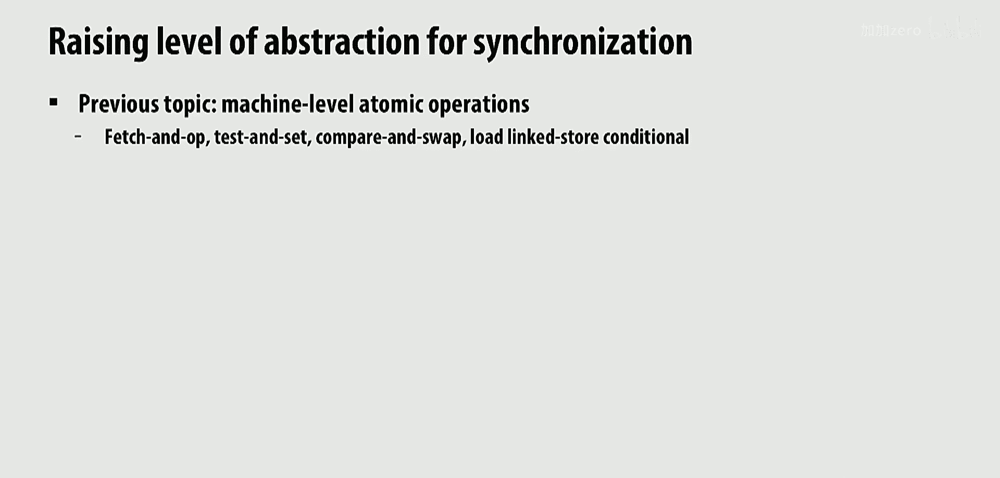

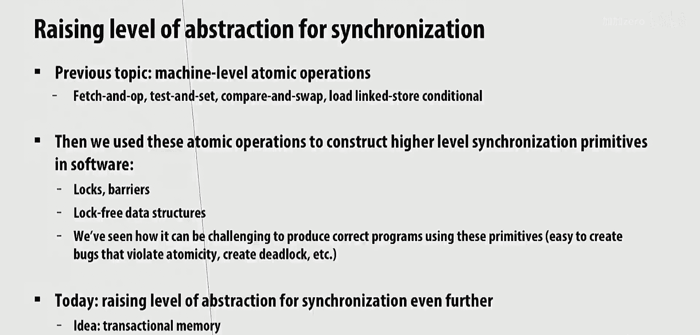

在本节课中，我们将要学习一种名为**事务内存**的编程概念。事务内存旨在简化共享内存编程中的同步问题，让程序员在获得正确程序的同时，也能获得高性能。我们将探讨事务内存的基本概念、它与传统锁机制的区别、其核心语义（原子性、隔离性、可串行化），以及实现事务内存时涉及的关键设计权衡，如数据版本化和冲突检测策略。

---

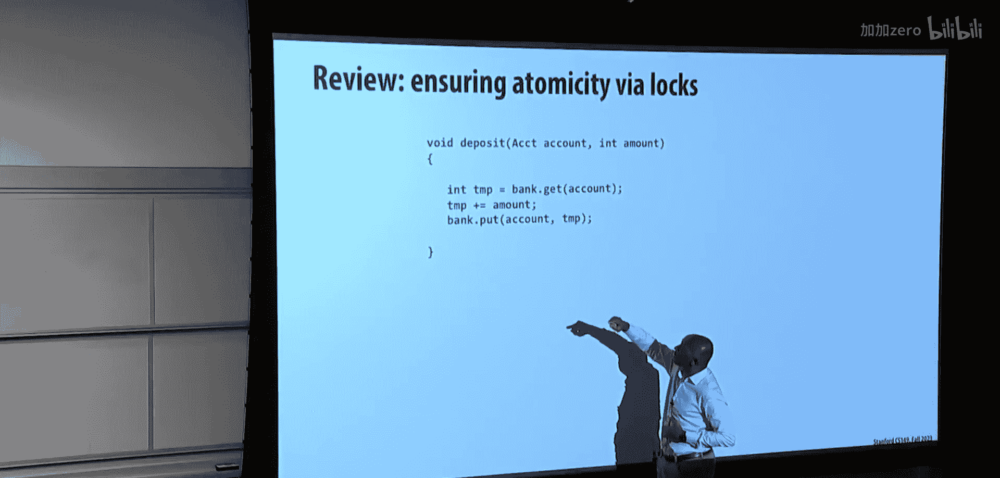

上一节我们回顾了共享内存编程的基础，本节中我们来看看如何通过事务内存来简化同步编程。

## 为什么需要事务内存？🤔

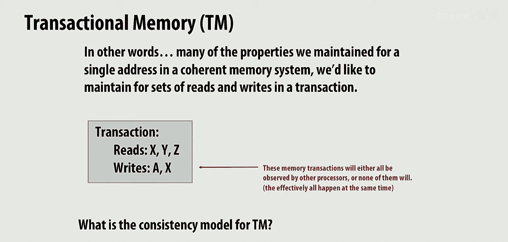

使用传统的同步原语（如锁）进行编程存在一个根本性的权衡：程序员必须在程序正确性和高性能之间做出选择。

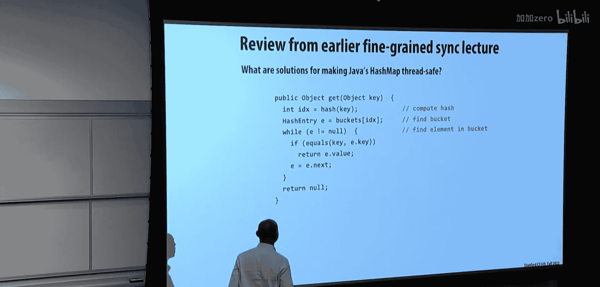

*   **粗粒度锁**：锁定整个数据结构甚至整个共享内存。这确保了正确性，但并发性低，性能差。
*   **细粒度锁**：对数据结构的各个部分分别加锁。这能提高并发性和性能，但实现复杂，容易引入死锁、竞态条件等正确性问题。

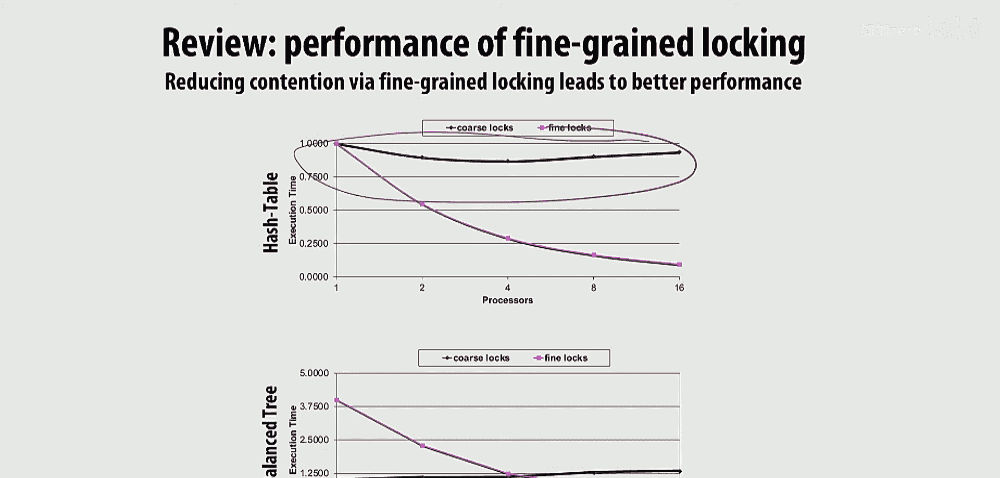

事务内存的目标是提供一种像粗粒度锁一样易于使用的编程模型，同时又能像细粒度锁一样提供高性能。它允许程序员声明一段代码（事务）需要原子地执行，而由系统底层负责实现这种原子性，并尽可能并发地执行无冲突的事务。

## 事务内存的核心语义 🔑

事务内存的灵感来源于数据库事务，它提供以下关键语义：

1.  **原子性**：事务中的所有读写操作要么全部生效，要么全部不生效（“全有或全无”）。
2.  **隔离性**：在事务提交之前，其内部的所有读写操作对其他事务都不可见。
3.  **可串行化**：系统可以找到一个顺序，使得所有事务的执行结果等同于按该顺序串行执行的结果。这个顺序由系统决定，而非程序员指定。

事务内存提供的一致性模型本质上是**顺序一致性**，只不过每次“步骤”是一个完整的事务，而非单个内存操作。

## 事务内存 vs. 传统锁机制 ⚖️

以下是事务内存与传统锁机制的关键区别和优势：

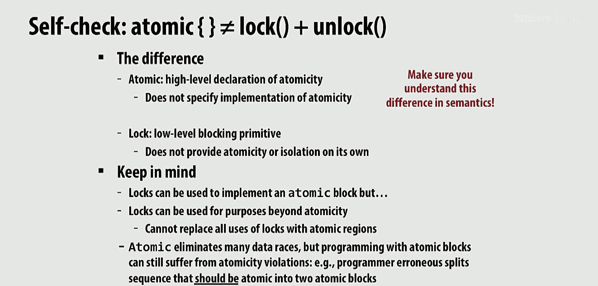

*   **声明式 vs. 命令式**：事务内存是**声明式**的。程序员使用 `atomic` 等构造声明“我希望这段代码原子执行”，而不指定如何实现（例如用哪个锁）。锁是**命令式**的，程序员必须显式地获取锁、执行操作、释放锁。
*   **可组合性**：使用锁时，组合多个模块可能因锁的获取顺序而导致死锁，需要全局策略（如按固定顺序获取锁），这破坏了模块性。事务内存天然支持可组合性，嵌套的事务会自动被外层事务包含，系统会处理冲突。
*   **故障恢复**：在事务中发生异常时，只需中止事务，系统会自动回滚所有修改，无需程序员手动释放锁和恢复状态。使用锁时，必须在异常处理中小心地释放已持有的锁。
*   **性能潜力**：事务内存系统只会在检测到真实的数据访问冲突时才序列化事务。如果两个事务访问不相交的数据集，它们可以完全并发执行，从而获得类似细粒度锁的性能。

## 事务内存的实现：核心设计空间 🛠️

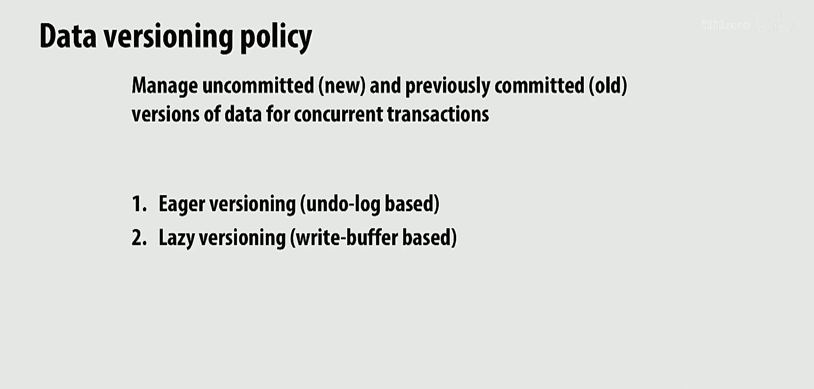

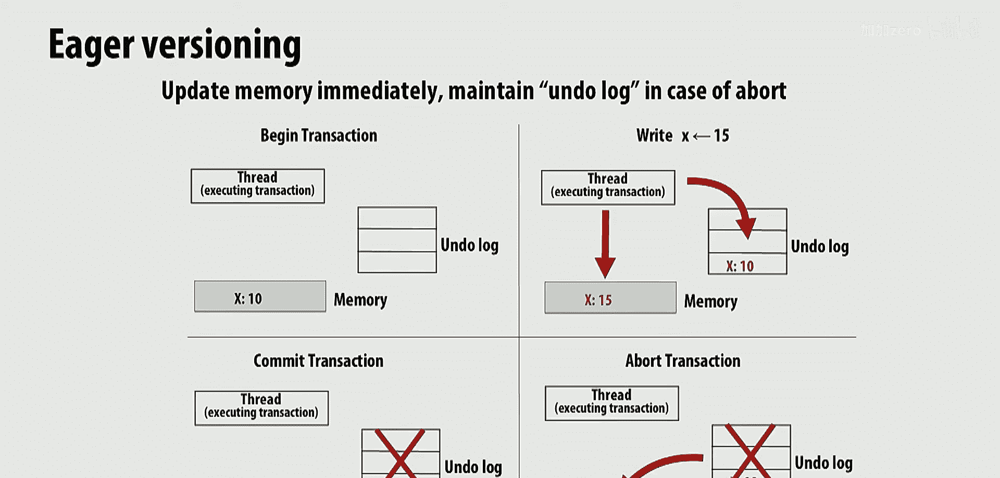

实现事务内存主要涉及两个核心策略的选择：

### 1. 数据版本化策略

这决定了如何管理事务未提交的中间状态和已提交的状态。

*   **积极版本化**：事务一旦写入数据，就立即更新主内存（或缓存）。需要一个**撤销日志**来记录被覆盖的旧值，以便在事务中止时恢复。
    *   **公式/过程**：
        *   写操作：`undo_log[address] = memory[address]; memory[address] = new_value;`
        *   提交：丢弃撤销日志。
        *   中止：`memory[address] = undo_log[address];` （对所有写入的地址）
    *   **特点**：提交快（数据已更新），中止慢（需恢复），需处理隔离性（其他事务可能看到未提交的写）。
*   **惰性版本化**：事务的写入操作先暂存到一个**写缓冲区**中，仅在提交时才批量更新到主内存。
    *   **公式/过程**：
        *   写操作：`write_buffer[address] = new_value;`
        *   读操作：先检查写缓冲区，若命中则返回缓冲区值，否则读主内存。
        *   提交：将写缓冲区内容写入主内存，清空缓冲区。
        *   中止：直接丢弃写缓冲区。
    *   **特点**：中止快（直接丢弃），提交慢（需更新内存），读操作可能更复杂（需合并缓冲区视图）。

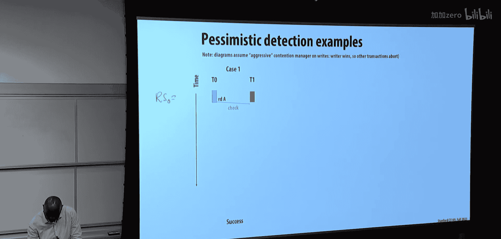

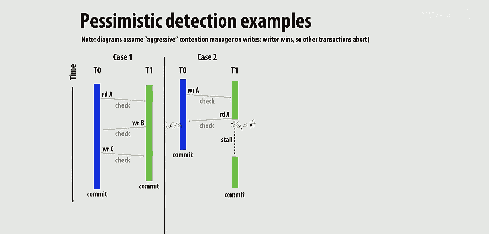

### 2. 冲突检测策略

这决定了何时以及如何判断两个事务发生了冲突（即访问了相同数据且至少有一个是写操作）。事务的**读集**是它读取的所有地址集合，**写集**是它写入的所有地址集合。冲突发生在两个事务的读集和写集存在交集时。

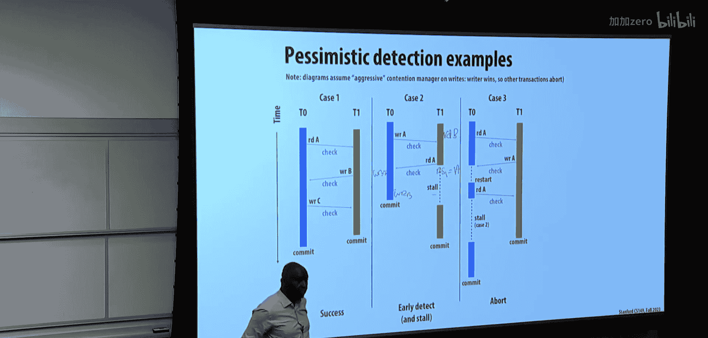

*   **悲观检测**：假设冲突很可能发生，因此在每次内存访问时都立即检查是否与正在运行的其他事务冲突。
    *   **特点**：能早期发现冲突，可以采取“等待”策略让先到的事务完成，避免浪费工作。但可能增加每次访问的开销，且在某些场景下（如两个事务循环竞争写入同一数据）可能导致活锁。
*   **乐观检测**：假设冲突很少发生，因此允许事务自由执行，只在事务提交时才检查其写集是否与其他活跃事务的读集冲突。
    *   **特点**：执行期间开销小，但可能让注定要失败的事务（“ doomed transaction”）运行很久，在提交时才中止，造成计算资源浪费。提交的事务总是优先，会迫使与其冲突的未提交事务中止。

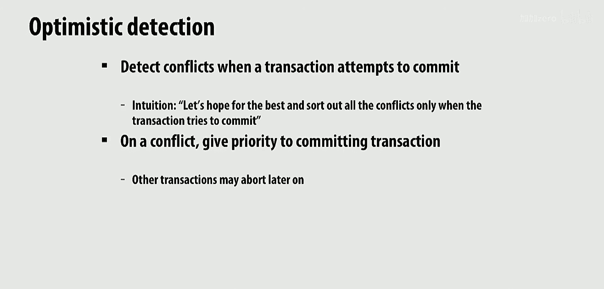

这两种策略与数据版本化策略需要配合使用。例如，积极版本化常与悲观检测搭配，因为立即写入了内存，需要尽早检测冲突以维护隔离性。惰性版本化则与乐观检测更契合，因为写操作暂存在本地缓冲区，在提交前不影响全局状态。

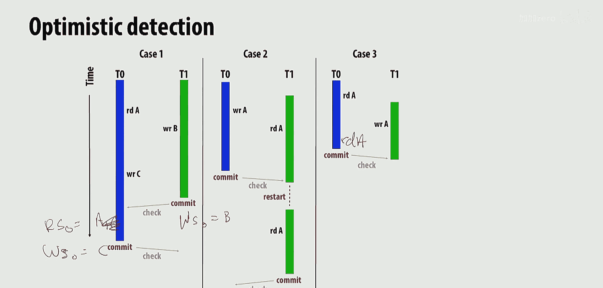

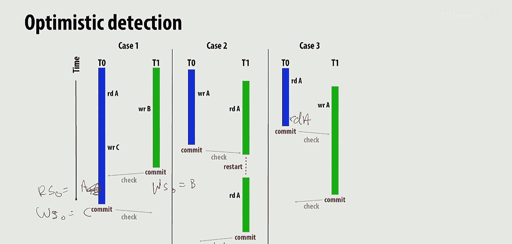

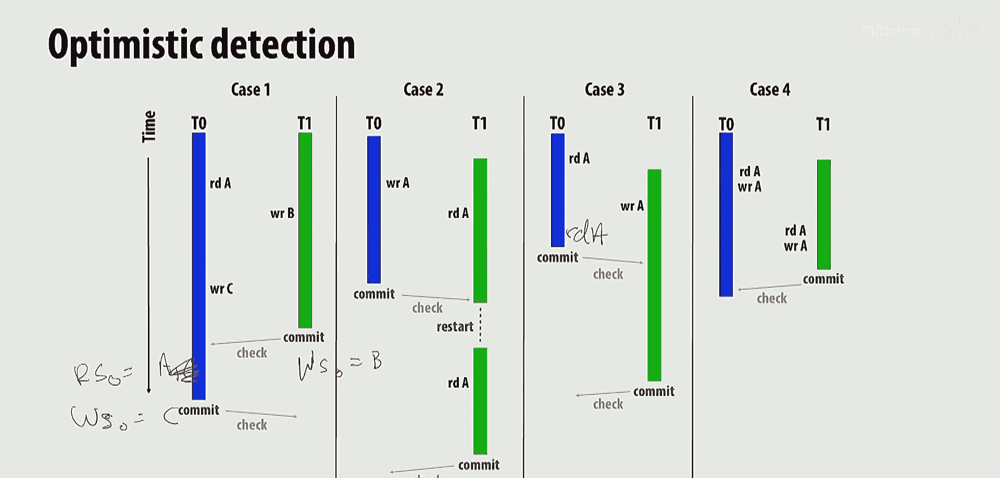

---

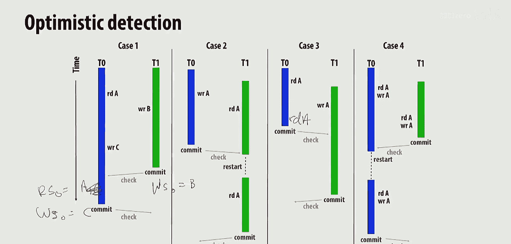

本节课中我们一起学习了事务内存的基本概念和动机。我们了解了事务内存如何通过提供声明式的原子性抽象，来简化并行编程，同时兼顾正确性与性能潜力。我们还深入探讨了实现事务内存的两个核心维度：数据版本化（积极 vs. 惰性）和冲突检测（悲观 vs. 乐观），以及它们各自的特点和权衡。在下一讲中，我们将继续探讨事务内存的具体软件和硬件实现机制。