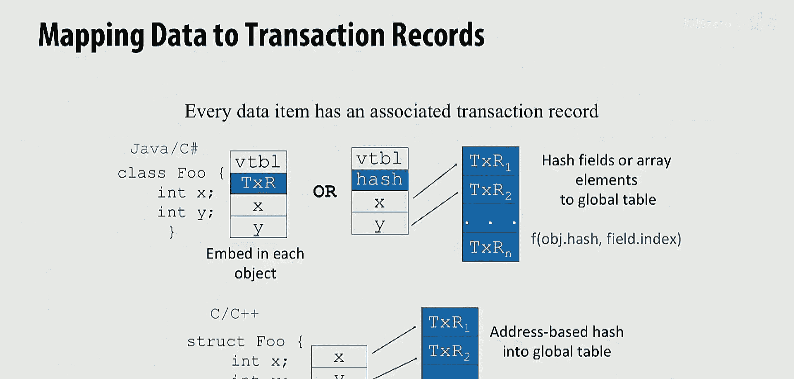
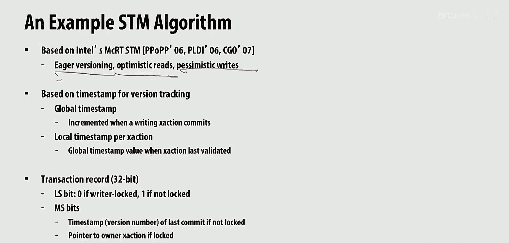
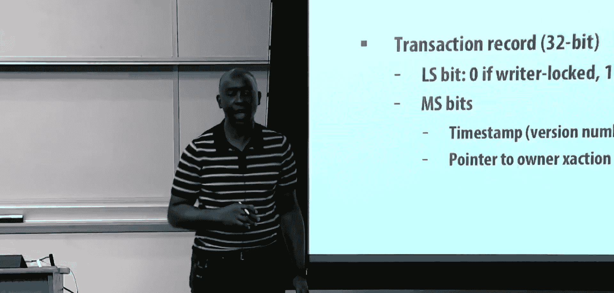
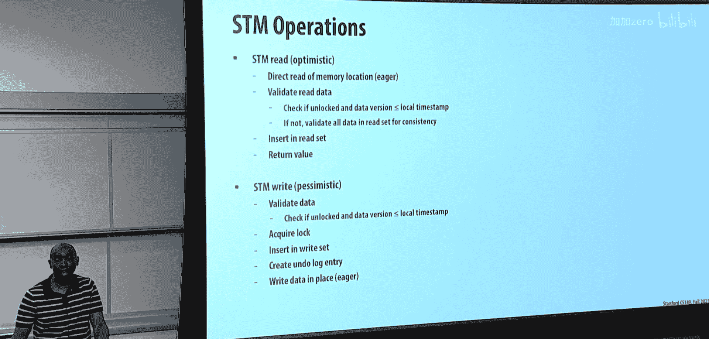
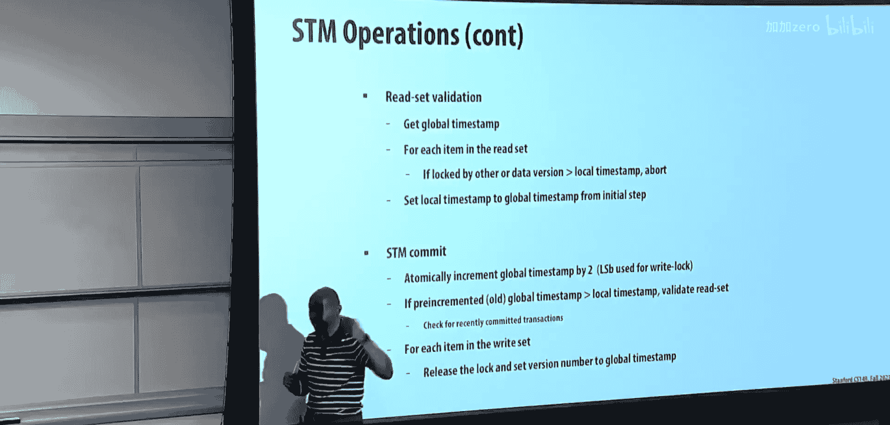
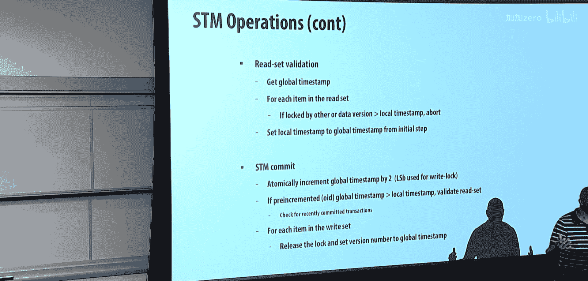
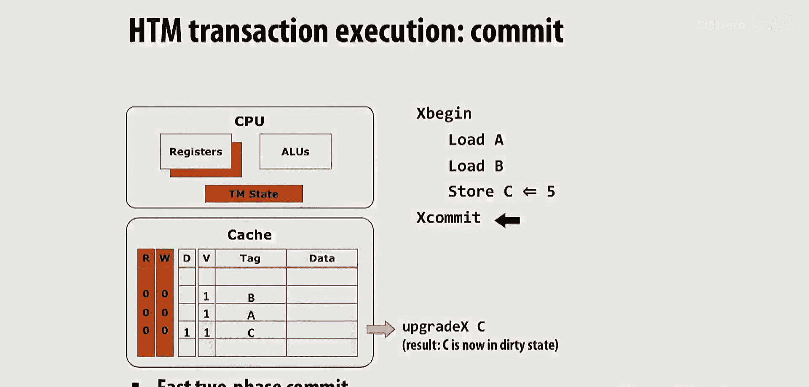
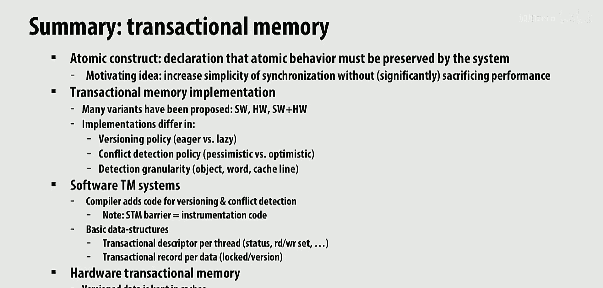
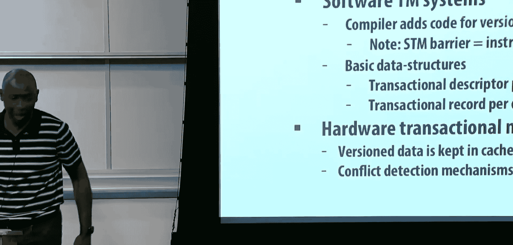

# 017：事务内存 2 💾


在本节课中，我们将继续讨论事务内存。我们将探讨软件和硬件的具体实现方案。

## 概述 📋

上一讲我们介绍了事务内存的基本概念、需要保持的特性及其优势。我们还讨论了事务内存设计中的关键考量点：用于跟踪已提交旧数据和执行中新数据的数据版本化策略，以及检测事务间冲突的策略。我们提到了两种数据版本化策略（**急切** 和 **惰性**）和两种冲突检测策略（**悲观** 和 **乐观**）。本节中，我们将深入具体的实现细节。

## 软件事务内存实现 🖥️

首先，我们来看看如何在软件中实现事务内存。一个典型的方法是使用软件屏障。

### 软件屏障与代码转换



为了实现事务内存，程序中的读写操作需要被转换为对事务内存系统的调用。这些调用被称为软件屏障。


以下是转换过程的示例：
```c
// 程序员编写的原始代码
atomic {
    a = b + c;
    d = e * f;
}

// 转换后的代码（添加软件屏障）
atomic {
    TM_Read(&b);
    TM_Read(&c);
    TM_Write(&a, b + c);
    TM_Read(&e);
    TM_Read(&f);
    TM_Write(&d, e * f);
}
```
每个 `TM_Read` 和 `TM_Write` 都是对事务内存系统的调用，用于执行必要的簿记工作。许多这类调用是冗余的，可以通过编译器优化来消除。

### 核心数据结构





软件事务内存系统需要两种核心数据结构来跟踪状态。

**1. 事务描述符**
这是每个线程或每个事务的私有数据结构。它包含：
*   撤销日志
*   冲突检测信息
*   读集合
*   写集合




**2. 事务记录**
这是与每个数据元素（如对象或字段）关联的元数据。它记录了数据如何被访问，类似于缓存一致性协议中的状态位，用于指示数据是被多个事务共享还是被单个事务独占。

### 数据粒度权衡

事务记录可以与不同粒度的数据关联，这带来了权衡。







*   **对象粒度**：每个对象有一个事务记录。
    *   **优点**：管理开销较低，如果重复使用同一对象，可以分摊开销。
    *   **缺点**：可能导致**假冲突**，降低并发性。
*   **字段/元素粒度**：每个数据字段有一个事务记录。
    *   **优点**：减少假冲突，提高并发性。
    *   **缺点**：管理开销增加。

以下是一个假冲突的例子：
```
// 事务1: 读写对象A的字段X和Y
// 事务2: 读写对象A的字段Z
```
如果使用对象粒度，两个事务会冲突。如果使用字段粒度，则不会冲突。在实践中，混合使用不同粒度是一种有效的折衷方案。

## 具体STM算法：McRT 🧮

接下来，我们看一个具体的软件事务内存算法实例——Intel的McRT-STM。它采用以下策略组合：
*   **急切版本化**
*   **乐观读**
*   **悲观写**

### 版本管理与事务记录

该系统使用时间戳进行版本管理：
*   **全局时间戳**：当事务提交时递增。
*   **本地时间戳**：事务开始时获取。

每个数据元素关联一个**32位事务记录**。其最低有效位是关键：
*   **0**：表示数据被**锁定**（处于独占模式，正被某个事务写入）。此时事务记录是一个指向锁定事务的指针。
*   **1**：表示一个**版本号**（处于共享模式）。

### STM操作流程

以下是核心操作的伪代码描述：

**STM读操作（乐观）**：
1.  检查目标数据的事务记录。
2.  如果数据被**锁定**，则等待。
3.  如果数据**未锁定**且其版本号 ≤ 本地时间戳，则：
    *   直接从内存位置读取值。
    *   将数据地址加入读集合。
    *   返回值。
4.  如果数据版本号 > 本地时间戳，说明数据在事务开始后被修改，需要**验证整个读集合**。若验证失败，则中止事务。

**STM写操作（悲观）**：
1.  检查目标数据的事务记录。
2.  如果数据**未锁定**且其版本号 ≤ 本地时间戳，则：
    *   **获取锁**（将事务记录最低位设为0，并指向本事务）。
    *   将旧值记录到**撤销日志**。
    *   执行**就地写入**（急切版本化）。
    *   将数据地址加入写集合。
3.  如果检查失败，则根据策略处理（如等待或中止）。

**读集合验证**：
1.  获取当前全局时间戳。
2.  遍历读集合中的每个条目：
    *   检查其事务记录。
    *   如果条目被**锁定**，或它的版本号 > 事务的本地时间戳，则**中止**事务。
3.  如果所有条目验证通过，则更新事务的本地时间戳为验证时刻的全局时间戳（相当于事务从此刻重新开始）。

**STM提交操作**：
1.  **原子地**将全局时间戳增加2（因为最低位用于锁标志，所以每次+2以更新版本号）。
2.  使用**增加前的旧全局时间戳**来验证读集合。
3.  如果验证通过：
    *   遍历写集合中的每个条目：
        *   **释放锁**（将事务记录最低位设为1）。
        *   将事务记录的版本号设置为新的全局时间戳。
    *   提交成功。
4.  如果验证失败，则**中止**事务，并使用撤销日志回滚所有写操作。

### 性能与优化

软件屏障会带来开销。未经优化的STM可能导致70-80%的单核性能开销。然而，结合编译器优化（如消除冗余屏障调用），开销可以显著降低至30-40%。虽然这个开销仍然高于简单的粗粒度锁，但STM提供了更好的可扩展性。

## 硬件事务内存实现 ⚙️



软件实现有开销，硬件支持可以降低这些开销。硬件事务内存通常基于现有的缓存一致性机制构建。


### 基本原理

硬件事务内存的核心思想是：
*   **利用缓存进行数据版本化**：将写缓冲或撤销日志功能放在缓存中。
*   **通过增强的一致性协议进行冲突检测**：在现有的缓存一致性消息中增加事务状态信息。
*   **检查点寄存器状态**：以便在事务中止时恢复。

### 缓存行元数据扩展

为了支持事务内存，我们在每个缓存行上扩展元数据，在原有的MESI等一致性状态位之外，增加两个位：
*   **R位**：表示该缓存行是否在本地事务的**读集合**中。
*   **W位**：表示该缓存行是否在本地事务的**写集合**中。

### 冲突检测

冲突检测通过监听一致性协议请求来实现：
*   **读-写冲突**：如果本地缓存行的W位被置位（已写），而收到一个对该行的**共享读请求**，则检测到冲突。
*   **写-读冲突**：如果本地缓存行的R位被置位（已读），而收到一个对该行的**独占写请求**，则检测到冲突。
*   **写-写冲突**：如果本地缓存行的W位被置位（已写），而收到一个对该行的**独占写请求**，则检测到冲突。

### 示例与策略分析

考虑一个简单事务：读A、B，写C=5。
1.  事务开始时，对寄存器状态进行**检查点**。
2.  加载A和B时，缓存行被获取，并设置其**R位**。
3.  写入C时，数据被写入缓存，并设置其**W位**。此时，该写入对系统其他部分**不可见**（隔离性）。
4.  提交时：
    *   对写集合（C）发出**读独占**请求以升级所有权。
    *   在此过程中，如果其他处理器对A或B发出了独占请求，而本地的R位已置位，则会检测到冲突并导致本事务中止。
    *   如果没有冲突，则提交成功，C的新值变得全局可见。



这种设计对应于**惰性版本化**（写操作在提交时才发布）和**乐观冲突检测**（在提交时检测冲突）。


### 硬件TM的现状



英特尔等公司曾在其指令集架构中引入了硬件事务内存支持（如TSX扩展）。然而，由于多种原因（包括软件生态支持不足、事务容量限制易导致中止，以及后来发现的安全漏洞），这些扩展在实际产品中并未被广泛采用或已被禁用。目前，硬件事务内存尚未成为主流。

## 总结 🎯

本节课我们一起深入探讨了事务内存的具体实现。
*   我们首先分析了**软件事务内存**的实现，包括通过软件屏障进行代码转换、核心数据结构（事务描述符和记录）以及粒度权衡。我们以McRT-STM为例，详细讲解了其基于时间戳的**急切版本化**、**乐观读**和**悲观写**策略的操作流程。
*   接着，我们探讨了**硬件事务内存**如何利用现有的缓存一致性基础设施来降低开销，通过扩展缓存行元数据（R位、W位）并在一致性协议中检测冲突来实现。我们分析了其通常对应的**惰性乐观**策略。
*   最后，我们了解到，尽管事务内存概念优美且研究广泛，但由于实现复杂性、性能开销及硬件支持的现实挑战，其在商业系统中的广泛应用仍局限于特定场景（如某些数据库内核），软件实现比硬件实现更为常见。


事务内存为同步编程提供了一种有吸引力的替代方案，但其成功部署需要编译器、运行时系统和硬件之间的紧密协同。