# 018：硬件专业化

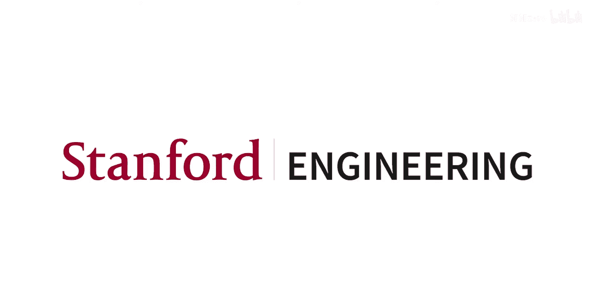

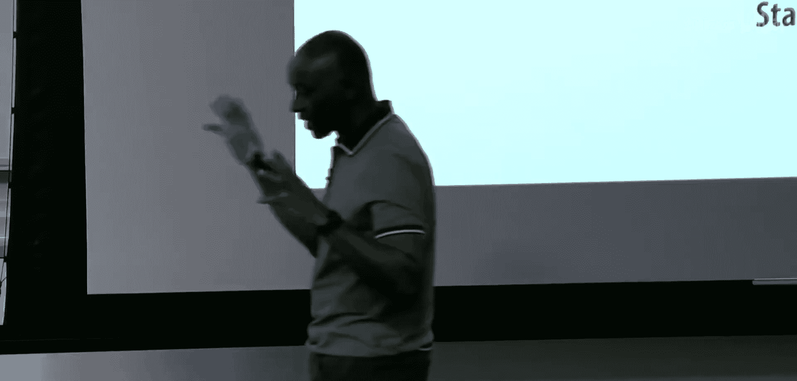

在本节课中，我们将继续讨论能效计算。上一讲末尾，我们谈到了异构性，其动机在于不同的程序特性可以通过更专门的架构来利用。我们目前关注的核心是利用数据并行计算，这可以通过GPU等架构来挖掘，其带来的关键能力是高性能，更重要的是能效。今天我们将更深入地探讨能效，并讨论为何这在现代计算环境中是一个如此紧迫的问题。

😊

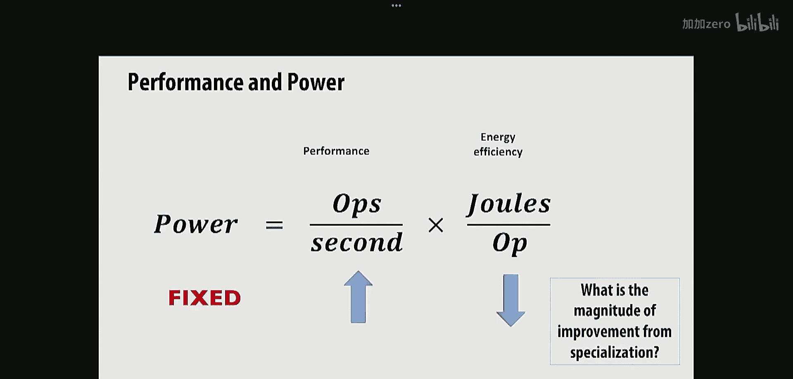

## 硬件专业化与算法特定编程

硬件专业化和算法特定编程是超越异构计算环境的下一步，即针对特定应用进行高度专门化的设计。能效计算是当前的核心约束，这源于底层半导体技术的现状。

过去，随着新一代处理技术的出现，每代技术都能提供更多晶体管，同时这些晶体管的功耗更低。这被称为登纳德缩放定律。但大约十年前，这种趋势结束了。现在，每次增加晶体管数量，功耗也会增加。因此，我们处在一个受功耗和能量约束的环境中。

为了理解其工作原理，能量是功率乘以时间：`能量 = 功率 × 时间`。我们能提供的功率是固定的。

因此，为了提升性能，我们必须降低每次操作所需的能量。这是当前的根本状况：在固定的功耗预算下，若想获得更高性能，就必须提高能效。提高能效的关键机制是变得更加专门化，以消除那些不直接推动计算进展的额外功耗。

😊

## 为何能效约束无处不在

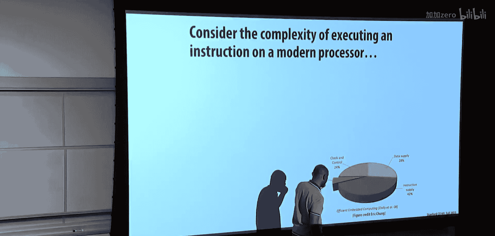

能效约束遍布整个计算领域。在拥有成千上万甚至数十万个核心的超级计算机和数据中心中，需要提供电力和冷却来维持整个系统运行，这带来了巨大的能源成本。在大型网站（如谷歌和脸书）背后的数据中心，同样面临约束。在为计算资源供电和冷却的三年生命周期内，其能源成本可能超过获取计算资源本身的成本。

在移动设备领域，能效约束同样存在。移动设备没有风扇，因为风扇会带来不便，散热必须被动进行。此外，设备依赖电池提供能量。因此，在整个计算领域，我们都受到能效约束。

能量公式如前所述：`能量 = 功率 × 时间`。😊

由于半导体工艺的限制，功率是固定的。因此，若想提升性能，就必须变得更节能。实现这一目标的方法是采用专门化的功能，以减少开销。

问题是，与由CPU组成的通用处理环境相比，专门化能带来多大的改进？让我们深入探讨。

我们已经研究了利用GPU大规模专门化处理数据并行应用。当然，在GPU架构内部，我们也看到了SIMD处理，它同样在利用数据并行性。😊

经验法则是可以获得巨大的改进，我们稍后会回到这个话题。但问题是，我们花了很多时间讨论如何从现代CPU和GPU中为特定算法获取最佳性能。那么，为什么CPU从根本上如此低效？

让我们来看一下。观察执行一条指令（例如乘法-加法指令）所消耗的能量，你会发现大部分能量并非用于执行实际计算。在本例中，实际计算仅占6%，其余能量用于处理指令、确定指令要做什么、获取数据、移动数据以及控制电路和分发时钟（保持一切同步）的开销。

执行一条指令需要完成许多事情：读取指令、确定指令要做什么、检查该指令与正在执行的其他指令的依赖关系、确定执行该指令所需的资源是否可用、确定操作数位置、从寄存器中获取它们、如果是加载或存储指令，可能还需要在缓存间移动数据。然后，在最底层才是执行实际的算术运算。最后，还需要移动结果。因此，最终用于特定指令实际计算的能量非常少。

问题是，如何改善这种情况？SIMD如何让这个饼图看起来更好？是的，通过将非绿色部分的开销分摊到更多的绿色部分上。即，在更多数据元素上执行，SIMD的宽度决定了你潜在的效率。

那么，如果我能用一条指令做8个数据操作，为什么不做16、32或64个呢？是的，但实现起来很困难。宽度越大，峰值性能越高，但平均性能可能会差很多，因为你可能无法填满所有的SIMD槽位。这就是问题所在：你可以做得更好，甚至可以走向极端，但最终你可能看不到保持所有SIMD单元忙碌所需的数据并行性或SIMD数据并行性。

那么，SIMD能改善情况吗？确实可以。这是一项几年前在斯坦福进行的研究，观察了在支持SIMD的CPU上进行H.264视频编码（这是一个相当数据并行且SIMD友好的任务）消耗了多少能量。可以看到，SIMD能量部分（由红色方框表示）并不高。

因此，如果想做得更好，就需要考虑实现更专门的组件。我们想看看其他类型的架构。以快速傅里叶变换（FFT）为例，它是许多信号处理应用的核心算法，被一些人称为有史以来最重要的算法。可以考虑为其实现专门的硬件，从而在硅片面积利用率和能效方面获得巨大提升。

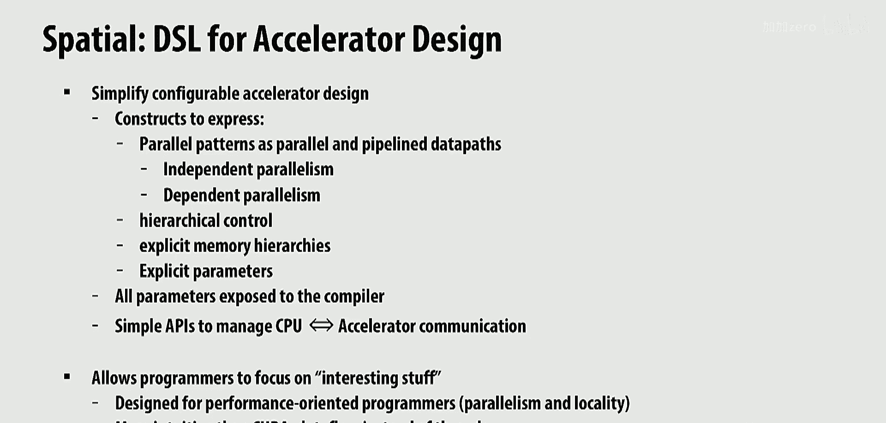

这是一项相当古老的研究（40纳米工艺），但可以看到，与CPU（酷睿i7，在每平方毫米的千兆浮点运算方面最低）相比，专用集成电路（ASIC，图中的菱形）提供了最高的能效和芯片面积利用率。CPU在能效和芯片面积利用率上最低。与为特定算法高度专门化的设计相比，CPU在芯片面积利用率上可能相差1000倍，在能效上相差100倍。

那么，ASIC方法的缺点是什么？是的，它只能用于那一种算法，并且需要设计它。因此，如果你想启动一个新应用并有一个新想法，可能需要等待18个月来设计一个ASIC。除非它像FFT那样是一个非常重要的算法，否则可能不值得。

为了证明ASIC实现的合理性，还有其他方法可以获得比CPU更高的效率。其中一个被广泛使用的想法是数字信号处理器（DSP）。其理念是，你想使用FFT和滤波等DSP算法进行大量信号处理。事实证明，通用计算机中的指令和寻址模式可以改进。DSP具有非常复杂的指令，专门针对特定算法；它们具有非常复杂的寻址模式，例如，允许你进行FFT所需的位反转寻址。

问题是，如果给你这套复杂的指令集，你能为其编写编译器吗？答案可能是否定的。因此，伴随着DSP这些非常复杂的指令集，通常需要进行底层编程来实现所有这些算法。这比开发ASIC容易得多，但比编程通用CPU要困难得多。因此，在效率和可编程性之间存在这些权衡。

另一个专门化计算单元的例子是由D. E. Shaw开发的。他在金融领域赚了很多钱，决定将部分资金用于造福人类。他决定开发一个用于分子动力学的专门加速器。如果你想理解蛋白质如何折叠，归根结底是弄清楚分子间的相互作用。分子动力学是化学中的一个重要领域，有人因此获得了诺贝尔奖。他们开发了名为Anton的加速器，通过精心设计算法与硬件，获得了相对于CPU和GPU的巨大性能提升。😊

他们为分子间相互作用的模拟设计了专门的硬件。据我所知，他们现在已经有了三代Anton，每一代都更好。当然，也有使用加速器的方法，但也有使用统计方法解决问题的途径。因此，在从事加速器开发的人员和从事统计方法的人员之间存在一种张力。

如今，机器学习风靡一时。事实上，你们上一个编程作业就与机器学习有关。激发人们对开发机器学习新架构兴趣的加速器之一是谷歌的Tensor处理单元（TPU）。可以将TPU视为使密集矩阵乘法变得非常快。最初的TPU进行256x256的整数矩阵乘法，后来的版本进行128x128的16位浮点乘法。😊

尽管这些引用是几年前的了，但在架构领域有大量工作试图理解如何为机器学习领域开发新的特定架构。😊

这些架构大多数实际上具有一定程度的可编程性，因为需要适应机器学习算法的变化。但根本上，它们专注于执行这些ML算法中的核心计算内核，即矩阵乘法（通常是密集矩阵乘法，但也有稀疏版本，也很有趣）。

那么，存在为特定算法设计固定硬件的问题。问题是，是否存在一种中间地带，允许开发具有一定可编程性的硬件？这就是现场可编程门阵列（FPGA）架构的整个原因和动机。你们中的一些人可能在数字设计课程中接触过这类技术。

关键思想是拥有一堆称为可配置逻辑块（CLB）的单元，它们本质上是布尔代数的查找表。例如，一个四输入布尔函数可以使用查找表计算，然后与组合逻辑块和寄存器（提供存储）结合。然后将这些可配置逻辑块排列成阵列并连接起来。你可以将它们连接成更复杂的逻辑块，例如，如果你有一个六输入查找表，并想生成一个40输入的与门，你可以级联这些六输入逻辑块来创建更复杂的函数。😊

查找表基本上是将一个二进制数映射到一个输出，允许你计算各种函数。现代FPGA将可配置逻辑块与更专用的功能（如密集内存和乘法器，称为DSP块）结合在一起。完全用可配置逻辑块构建所有东西的问题在于会带来很多开销，包括连接这些块的开销，以及使用这种技术实现计算单元的实际开销。因此，如果你想更密集、更高效地利用硅片面积，就需要用于内存和乘法的硬宏块。😊

你可以将它们组合起来。如果你想使用它们，可以访问我的实验室，或者去亚马逊EC2，他们也提供FPGA资源。他们通过云服务提供相当先进的FPGA能力，这些FPGA当然有到内存（如DDR4）的链接，我们还没有详细讨论内存，但也许在本讲末尾有时间的话，我们可以谈谈不同类型的内存技术。它们通过PCIe接口与CPU连接，并链接到其他FPGA，然后它们有一个完整的环境，允许你进行软件开发以实际编程这些FPGA。

因此，我们正在审视从最容易编程的通用CPU到ASIC的整个频谱。我们看到在可应用的计算技术空间中，能效和可编程性之间存在权衡。作为系统设计者，你需要根据所需的能效约束以及多快需要让应用运行、愿意投入多少努力来选择合适的方案。

如果你能用CPU获得所需的性能，那就直接用高级语言编程你的应用。如果需要更高性能，则继续向右移动：使用GPU，可能需要写一些CUDA代码；使用DSP，可能需要进行汇编语言编程；使用特定领域计算（如机器学习），可以使用PyTorch或TensorFlow等框架编程加速器；如果使用FPGA，则基本上需要成为硬件设计师；而ASIC，你肯定是一名硬件设计师。😊

随着向右移动，你能获得更高的能效，尤其是使用ASIC时能效提升巨大。但你也必须更努力地工作，并花费更多资金，特别是移动到最右边时。

到目前为止，关于能效与可编程性之间的权衡空间以及空间中的不同点，有什么问题吗？显然，ASIC的能效要好得多，但中间地带存在权衡。为什么GPU不直接采用ASIC的方案？我认为目前尚无定论。GPU正在从TPU中汲取经验，它原本是通用线程架构，但现在加入了张量核心单元使其更专门化。但作为CUDA程序员，尝试编程这些张量核心单元实际上相当具有挑战性。这个空间正在变化，并由机器学习这个高价值应用驱动。😊

DSP更专注于数字信号处理，具有许多专门的寻址机制和计算。因此，如果你尝试进行数字信号处理，DSP会更高效。但如果你尝试进行机器学习，可能就不是这样了。

现在，让我们看看再向右移动一点需要什么。我们在这门课上花了很多时间思考如何编程现有架构（如通用处理器或GPU）中提供的固定资源集。但现在，让我们思考一下指定或编程加速器需要什么，在加速器中你可以控制许多在通用环境中无法控制的东西。特别是，你可以拥有定制的内存系统。在任何特定硬件中，你能获得的许多性能改进都与如何组织内存以利用应用程序中特定的局部性和访问行为有关。

你还可以获得与应用程序需求匹配的专门化计算。问题是，我们如何思考或编程专门化处理器或加速器？传统上，你必须成为硬件设计师，并在寄存器传输级或硬件描述级思考问题。你必须使用VHDL或Verilog等语言编写代码。

最近，出现了高级综合（HLS）的想法。其方法是，我将编写一个C程序，然后让一些智能编译器将其转换为硬件。这个想法有两个问题。一是C程序并非旨在描述硬件，因此你必须对硬件应该做什么做出各种推断，因为C程序是为通用处理器设计的，而不是为硬件设计的。这是第一个问题。第二个问题是，为了克服C语言的不足，他们加入了这些编译指示（pragmas）。😊

问题在于，为了正确放置所有这些编译指示，你本质上需要了解很多硬件知识。这样一来，你就违背了提升到高级C语言水平的初衷。实际上，为了获得任何有价值且性能良好的东西，你必须通过使用这些编译指示下降到硬件层面。

因此，今天我们不讨论高级综合，而是看一种我们称为Spatial的语言。它是一种用于设计硬件加速器的高级语言，旨在使面向性能的程序员能够指定硬件。到目前为止，这门课上的每个人都是面向性能的程序员，你们整个季度都在做这件事。因此你们符合条件。😊

面向性能的程序员喜欢思考的关键是并行性和局部性。这是我们整个季度一直在处理的问题。在局部性方面，我们可能要考虑一些专用内存以及如何进行数据移动。这就是Spatial。快速描述一下：😊

Spatial是一种用于加速器设计的领域特定语言（DSL）。它具有表达并行模式的构造，你们也相当熟悉。例如，对集合的数据并行模式：Map、Zip、Reduce。这些都是你们熟悉的概念。我们想做的是思考如何使用两种类型的并行性来执行这些并行模式：一种是你们非常熟悉的独立并行性，即考虑使用独立计算单元运行Map；另一种是依赖并行性，我认为你们中的一些人也相当熟悉。

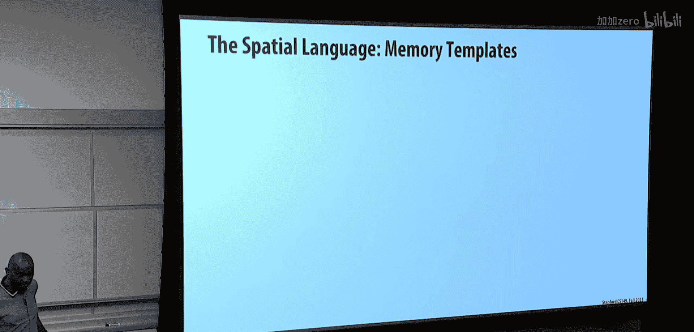

依赖并行性是指并行单元彼此依赖。那么如何执行依赖并行单元？你们中有人知道如何执行一组计算，其中计算的组成部分实际上是相互依赖的吗？😡

就像在流水线中做的那样，对吧？指令执行流水线的不同组成部分都是相互依赖的，但你有一堆独立的指令，你以同样的方式执行它们，就像在工厂里装配汽车一样。你创建一条装配线，每个工位独立工作，然后你在流水线的不同部分之间获得并行性。因此，流水线是另一种实现并行性的方式，其中存在依赖关系。所以我们想看看如何实现流水线并行性。

并行模式可以嵌套，因此你可以获得层次化的控制。我们说过，硬件设计师或希望控制应用程序局部性、利用局部性的人的关键机制之一是能够明确指定内存层次结构及其使用方式。还有能够使用参数审视整个设计空间的概念。😊

你希望将这些暴露给编译器，并允许编译器为你探索设计空间。😡

这里的关键是，让我们专注于在获得高性能方面有趣且重要的东西，即如何利用并行性（包括独立并行性和依赖并行性）以及如何管理和确定局部性。我认为，对于在机器学习上下文中可能看到的这类应用，这比从线程层面思考更直观。😡

## Spatial语言：内存模板

好了，让我们谈谈Spatial语言，并从内存模板开始。正如我所说，你有明确的内存层次结构。因此，你可以指定什么内存是片上的，什么内存是片外的。例如，片上可能有SRAM，并且你可以指定数据类型。😊

例如，`unsigned int8`，以及数组，你可以指定元素数量。你还可以指定DRAM。同样，这里是8位值，这是一个二维数组。因此，在这个例子中，你有`image`和`buffer`。

当然，你还有寄存器。有各种不同的寄存器，有累加器，还有FIFO（先进先出队列）。我们稍后会详细讨论使用FIFO。如果你在进行图像处理，可能会有行缓冲区的概念，这是一个可以通过行进行移位的二维数组。然后你可能还有移位寄存器，其精神与行缓冲区相似。

在CPU中，只有一个主地址空间，即程序员可见的内存地址空间。然后，作为程序员，你可以编写缓存友好的代码，但你无法控制数据在主存和缓存之间的移动，这是由底层硬件控制器自动处理的。在Spatial中，情况并非如此。你，作为程序员，必须明确地在内存层次结构的不同级别之间来回移动数据。在这个例子中，你正在使用加载操作将数据从DRAM的`image`移动到`buffer`。

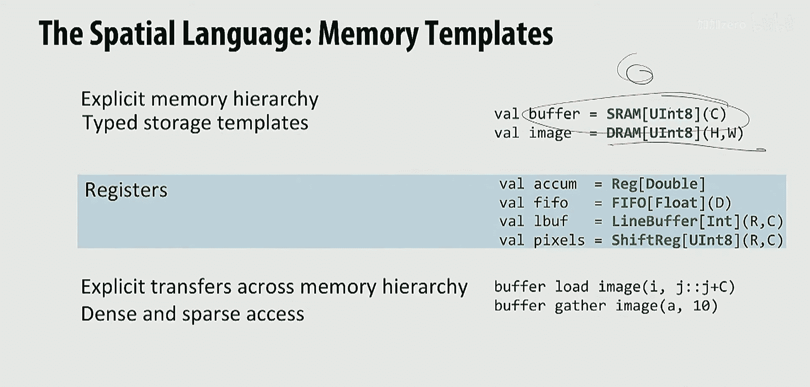

这是一种密集的数据移动。接下来是聚集（Gather）。我们讨论过Gather，有人能告诉我这里Gather是如何工作的吗？😡

你从`image`中获取数据，这里获取10个元素，地址或位置将由某个数组`A`指定。本质上，你是将稀疏数据变得密集，放入`buffer`中。因此，你可以想象有加载和聚集，还有存储和分散（scatter）。😡

你还可以创建流，并可以流入和流出数据。流式传输将是获得效率的关键组成部分。

## 控制模板

那么控制模板呢？顺便说一下，Spatial语言嵌入在一种名为Scala的语言中（由于历史原因，我们不会深入探讨）。Scala实际上是一种非常适合嵌入DSL的语言，因为它非常灵活。我们之前在讨论Spark时实际上见过Scala，所以你们以前确实见过它。它曾经作为嵌入式语言非常流行，但由于JVM的使用存在某些缺陷，限制了其广泛使用。

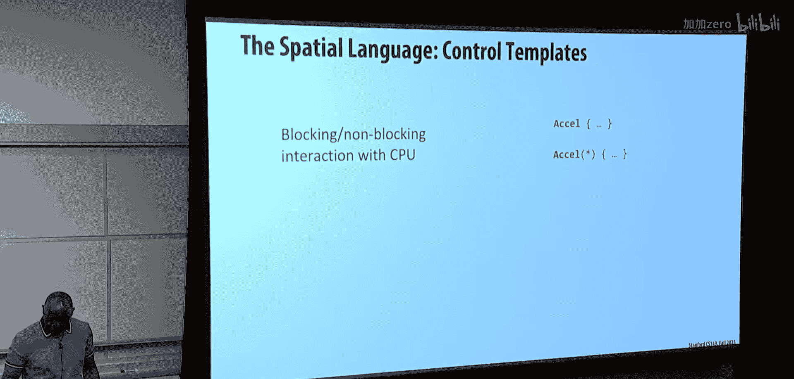

你有这些`Accel`块，它们将把你的程序划分为加速部分和仅在CPU上运行的部分。问题是你是运行`Accel`块一次，还是连续运行（`Accel*`语法）。然后还有有限状态机的概念，我们不会重点讨论。我们将重点关注用于并行模式的关键机制，即`foreach`（本质上是Map）和`reduce`（归约）。

这表示，对于集合`C`中的所有元素，你将按步长1遍历，并执行花括号内指定的代码块（即循环体）。

你可以指定许多设计参数。你可以指定特定的`foreach`和`reduce`的并行化程度，可以指定它们的调度方式（例如流水线化或流式化），我们稍后会简要讨论这些。你可以指定参数，例如你希望缓冲区的默认大小为64，但范围可能是64到1024，然后编译器可以探索这个范围。😡

如果你指定的内容需要使用内存分体（banking），编译器会为你处理。因此，如果你并行化了某些东西，并且并行化意味着对特定内存单元的多次访问，那么编译器有责任确保通过复制内存或适当地分体内存来实现实际的并行化因子。但这是你不必考虑的细节，编译器会为你处理。

## 示例：点积加速器

好了，让我们看一个例子来巩固这些概念。我们将做一个点积，这是你们最喜欢的小内核之一。我们想在Spatial中构建一个加速器。我们有这里的代码，下面有生成硬件的草图，让我们看看会发生什么。

首先从C代码开始，确保每个人都清楚。我们将两个向量`V1`和`V2`相乘，然后使用简单的折叠循环计算点积：我们将每个元素相乘，然后将它们全部相加。😊

这很清楚，对吧？这就是你为C代码编写的内容。那么，如果你想为此构建一个加速器，你会怎么做？记住，你现在必须控制所有内存。假设`V1`和`V2`是DRAM中的整数数组。这里通过指定`DRAM`清楚地表明这两个数组将驻留在DRAM中。

我们还没有确切说明DRAM如何工作，但假设我们有一种使用直接内存访问（DMA）在DRAM和加速器之间移动数据的方法，这是在主存和加速器之间移动数据的有效方式。

我们有一个`Accel`块，这是我们将进行加速的地方。首先，我们需要将数据从DRAM移动到加速器中。我们需要一个地方让这些数据落地。因此，我们必须在加速器内定义一些数据结构。我们将为此创建两个SRAM块，`tile1`和`tile2`。它们的大小为`tileSize`，并且是SRAM。问题是它们应该有多大，我们稍后再讨论。

因为我们将通过分块（tiling）来做这些事情，所以我们需要一个双重嵌套循环。单层循环不行，因为我们将通过分块计算点积。为什么我们希望从DRAM获取一个数据块而不是单个元素？是的，为了获得更好的DRAM与加速器之间接口的利用率。这就像去杂货店，你永远不会只买一样东西，那样非常浪费。你花力气去一趟杂货店，买一大堆东西带回来放在冰箱或食品柜里，这样你就不必每次想吃东西时都回杂货店。同样的道理，访问DRAM成本高，你希望获取多于一个东西，可能希望获取整个`tileSize`大小的数据，并且需要在内存中有一个地方来存放它。😊

当然，如果这是CPU，这可能只是通用缓存，数据移动将由缓存算法控制。在这里，你可以显式地移动数据并编程数据移动。😊

现在我们要做的第一件事是，对`tileSize`个元素进行归约，因为最终我们需要通过加法归约元素以生成输出。😡

首先，我们将加载两个向量。将`V1`的`tileSize`个元素加载到`tile1`，将向量2的`tileSize`个元素加载到`tile2`。😡

然后，我们将在块内进行归约（步骤2）。然后跨块进行归约（步骤3）。现在我们有了这个三步过程：加载一个块，进行块内累加，然后进行跨块累加。😡

现在的问题是，我想提高硬件的性能。为此，我需要利用并行性。这个算法中的并行性在哪里？是的，你可以流水线化步骤1、2、3，这是利用并行性的一种方式。在点积表示中，哪里还可以利用并行性？是的，在步骤2内部。所以我们可以并行化步骤2。并行化步骤2的最佳方式可能是什么？从你熟悉的东西中找找。是的，如果你总是做相同的操作，SIMD将是并行化步骤2的好方法，因为我们对块中的所有元素进行相同的操作。😊

我们正在进行乘法和归约。如果你想并行化这个归约，你需要某种并行乘法，然后是一个归约树。Spatial允许你这样做，它有归约树的概念。在这个例子中，你可以并行化因子为2（没有太多树），但你可以做得更宽。做得更宽的缺点是什么？归约树更大。还有什么更大？硬件，你使用更多资源。你可以控制使用多少资源，基于你想要多少性能改进。没有免费的午餐。😡

但你可以根据想要的性能改进程度来控制使用多少资源。

好的，让我们暂时保留流水线的想法。你还可以控制块大小，决定每次去内存时想要获取多少数据，并优化它。你可以指定要使用的块大小。😡

最后，你可以说，与其一次一步地运行外部归约，不如通过指定流水线调度来重叠它们。这里的流水线化意味着重叠。流水线化工作的关键是什么？如图所示。也许你可以读出来。但我们需要没有冒险，对吧？但我们需要什么额外资源？是的，我们需要能够进行双缓冲。因此，当阶段1正在从内存填充数据时，阶段2必须能够处理来自阶段1前一次执行生成的数据。因此，你本质上需要某种双缓冲。这是额外的开销。所以流水线化是硬件中尽可能接近免费午餐的东西，但并非完全免费，因为你增加了内存。😊

因此，你决定流水线化，在这种情况下，最佳情况是流水线化三个阶段，获得3倍的性能提升。当然，这并不总是成立。但这样做的开销将是在每个阶段接口处需要的额外块内存，以确保在进行流水线化时数据不会被覆盖。

大家都明白了吗？很好。我们看到了三种优化类型：并行化、如何处理数据局部性以及流水线化。

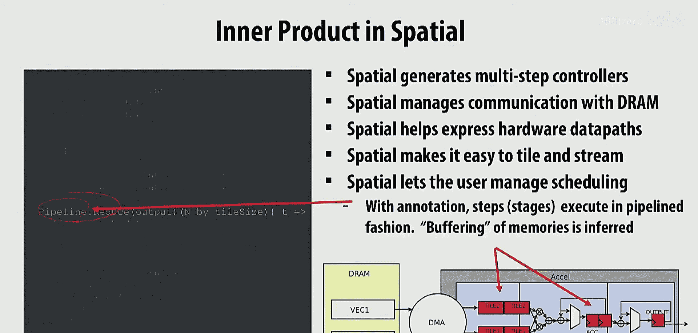

## 程序员与编译器的职责

为了确保你们都理解，作为Spatial程序员，你的职责是什么？是的，指定算法。你能更具体地说明你实际上要做什么吗？😊

你必须能够使用`foreach`和`reduce`构造来表达你的算法。你还需要负责什么？是的，处理内存，明确的内存层次结构，确定数据应该驻留在你定义的不同内存中的位置。还有什么？并行化，多少？在哪里？呃，我想大概就这些了：指定算法、指定内存层次结构、进行显式数据移动，然后选择分块因子、并行化和调度。😡

编译器的职责是内存的分体和缓冲，以最大化性能并最小化资源，以及为特定目标生成配置的一些底层工作。😡

当然，如果你想提高性能并理解性能，需要某种方式获取关于你的特定代码在任何目标上可能达到的性能以及它们可能使用的资源的反馈。😡

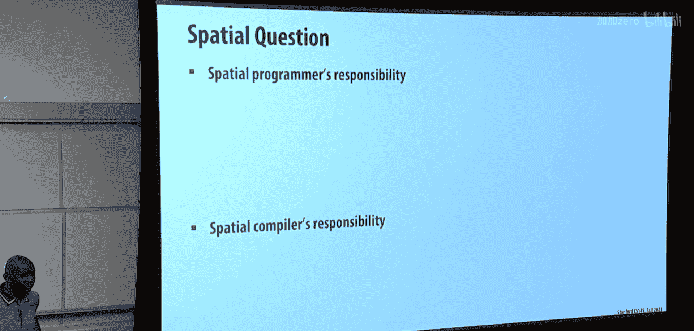

## 应用：注意力机制与流式执行

Spatial已被用于将Tensorflow表示的机器学习算法转换为硬件。我认为更有趣的可能是你们非常熟悉的东西，即如何优化像注意力机制（如Flash Attention）这样的算法。这是你们刚刚思考过的东西。我们讨论过融合注意力（fused attention）。那么融合注意力的主要好处是什么？

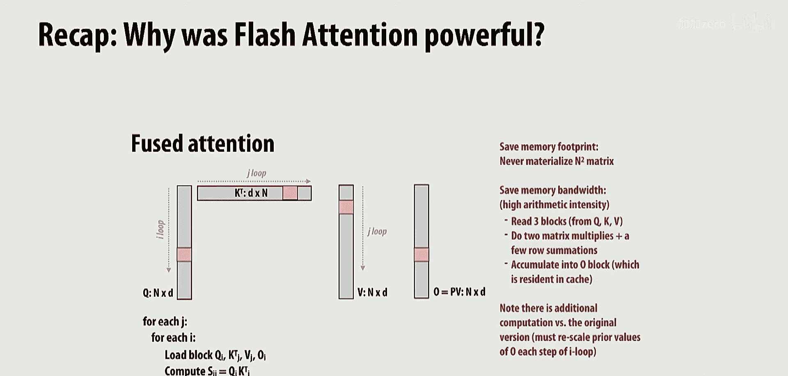

是的，你不需要物化整个注意力矩阵，而是将事物分块，然后一次计算一个块，并且还获得了将注意力算法的不同组件融合在一起的想法。😡

通过这样做，最小化了内存带宽，从而获得性能和内存大小的好处。事实证明，如果你使用这种Spatial流式编程模型来编写东西，你可以通过更简单的编程模型获得许多这些好处，而不必编写显式的融合内核。😡

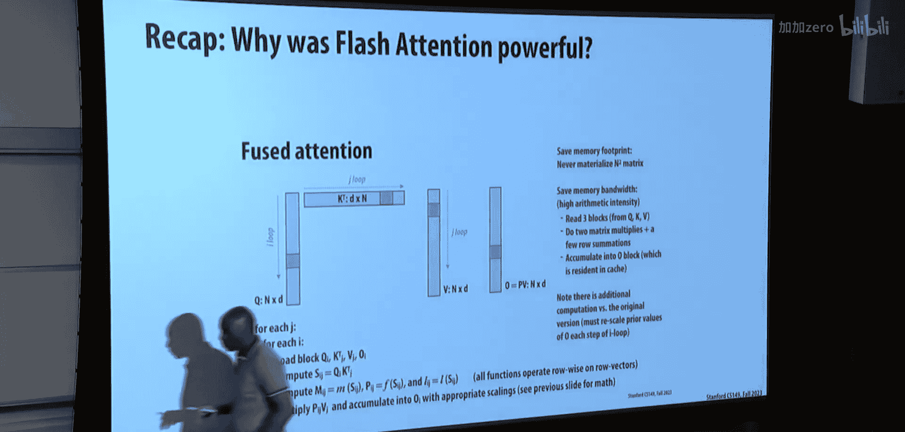

让我们看看这是如何工作的。回到Flash Attention出现之前的时代。在Flash Attention之前，你有这种基于内核的执行模型。正如我们所说，Flash Attention防止了完整矩阵的物化。

使用流式执行模型，你也能获得这些好处，但你不必编写Flash Attention内核。特别是，你不必支付额外的计算成本。事实证明，为了处理softmax，你必须进行额外的计算，以处理你需要整行数据来计算softmax的行计算。而通过流式处理，你可以避免这样做，代价是可能需要多一点内存。

让我们看看这是如何工作的。如果我们考虑softmax，如你所知，它实际上是一个三步过程。首先，必须计算特定S_ij值的指数。然后必须进行行归约，然后必须将指数除以行信息。这个三步过程在这里以图示方式展示。首先是指数，然后是行归约，然后是除法。

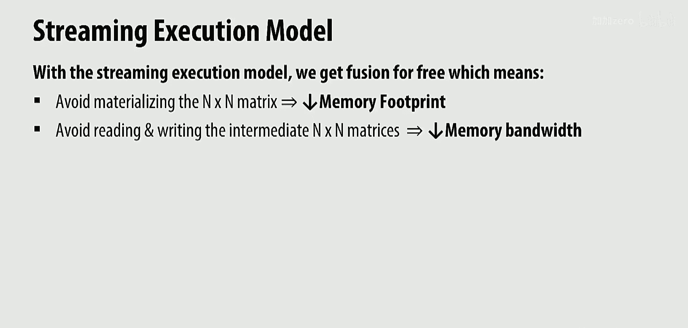

如果没有Flash Attention的优化，你会物化整个矩阵。这增加了内存占用和内存带宽。这展示了概览，显示了必须在加速器（可以认为是顶部发生）和GPU内存（底部发生）之间物化和移动的所有数据。因此，所有跨越这条线的数据都是计算注意力所需的内存带宽。

使用流式执行模型，可以避免矩阵的物化。让我们展示流式如何工作。本质上，在这个例子中，我们将计算指数，然后通过归约行来计算行和。在Spatial中编写的方式是，第一个`foreach`（类似于Map）进行指数计算。😡

但是，与其将输出放入另一个矩阵，不如将输出入队到一个FIFO中。Spatial的语义是，这个`foreach`和下一个`foreach`同时执行。😡

现在，你可以将第一个`foreach`视为生产者，第二个`foreach`正在消费生产者的输出。因此，归约通过从第一个`foreach`出队一个元素并保持连续和来实现，最后完成后生成输出，同样输出到一个FIFO中，是单个元素。😡

大家都明白这是如何工作的吗？本质上，你有这两个`foreach`，它们以流水线方式运行。流水线之间是一个FIFO。😡

最初，我们定义片上内存`S`和两个FIFO。我们计算指数元素，然后将其入队到FIFO。在第二个`foreach`中，我们从FIFO出队。这展示了流式如何工作。在流式之前，你会物化整个N×N矩阵；使用流式，数据只是流过这个两元素FIFO。这相当于我们在第一个例子中展示的双缓冲。但这里你有一个显式的FIFO。因为你发现这就是你所需要的，所以你大大减少了所需的内存量。

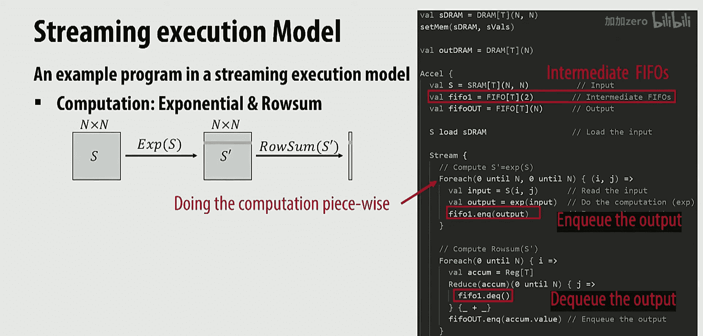

但为了让这工作，你的编程模型必须考虑这两个内核同时运行，通过一个FIFO连接。这是一种非常自然的硬件思考方式，但不是一种自然的软件思考方式。Spatial允许你以匹配高效硬件实现的方式思考流水线并行性的概念，而这与你在软件中通常的做法不匹配。😡

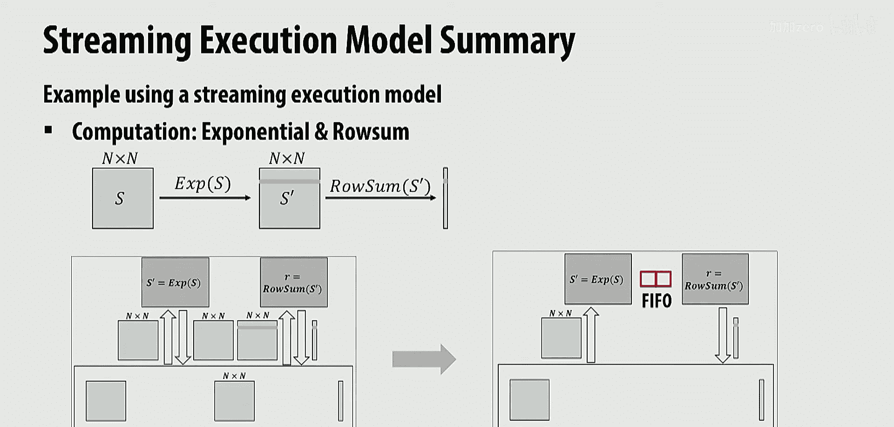

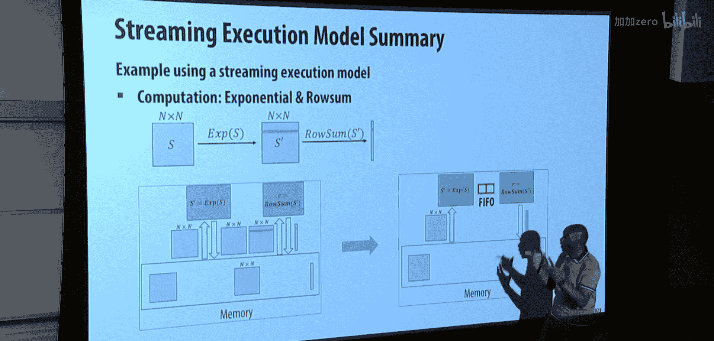

回到原始的内核接内核方案，你物化了所有内存，发生了所有不必要的数据移动。而如果你使用流式处理，数据可以通过FIFO在不同内核之间流动，因为一个内核将数据放入FIFO，下一个内核取出并进行计算，你永远不需要物化整个矩阵。在需要数据的情况下（例如进行行操作），你需要在FIFO中累积整行数据。因此限制是，你需要使这个FIFO的长度等于矩阵的一行。😡

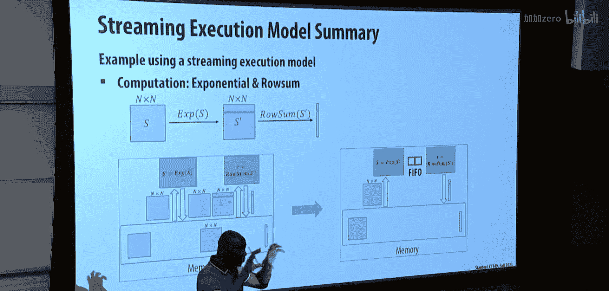

这可能会成为一个限制。你可以查看细节，细节会很清楚。问题在于，你需要一行数据来计算P矩阵的一个元素。你可以查看分配情况。那么，我们能用Flash Attention做得更好吗？答案是肯定的。😊

因为如果你的矩阵大小（序列长度）变得非常长，那么即使一行数据也太多了。因此，如果你想限制FIFO的大小，可以应用Flash Attention来优化这种基于流式的优化。Flash Attention重新排序操作，并使用运行和与重新缩放，而不是朴素的归约来进行计算。现在我们可以显著减少FIFO中对行数据量的需求。

## 流式与内核接内核的比较

如果你比较流式与内核接内核的方案，使用流式实现，你可以获得这样的想法：你可以利用更多并行性，因为你可以使用这种流水线类型的执行来重叠内核之间的计算。你可以空间映射每个计算，并通过流水线进行通信。😡

然后，你可以重叠和流水线化不同输出块的计算。因此，通过流式实现，你获得了额外的并行性和性能维度。

流式实现的另一个潜在好处是，你不必显式创建融合内核。你可以想象这些内核是单独实现的，你可以利用编译器的能力进行这种双缓冲技术。但如果你想要进一步优化，你可以用类似FIFO的编程表达式替换双缓冲，就像我刚刚在这个例子中展示的那样，获得更高的效率。这比使用传统编程模型创建显式融合内核更容易。因此，流式执行模型给了你这种额外的自由度：如果你使用FIFO编写东西，操作会自动融合。😡

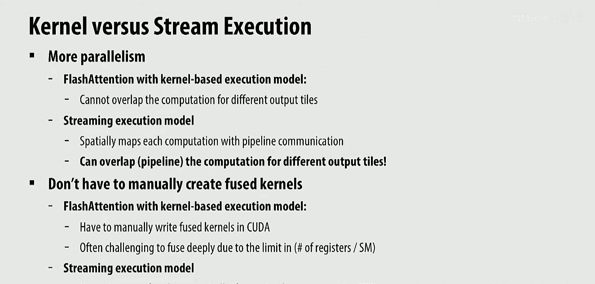
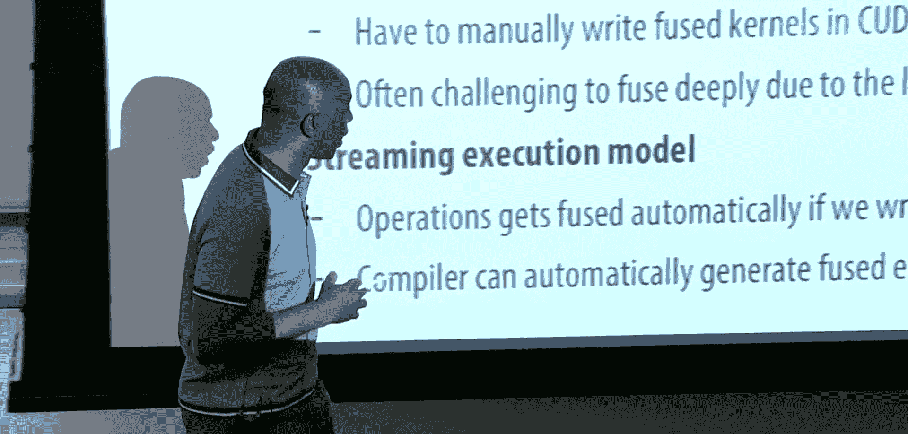

即使你使用缓冲区编写，也可以采用双缓冲技术，然后编译器可以自动生成融合执行。😡

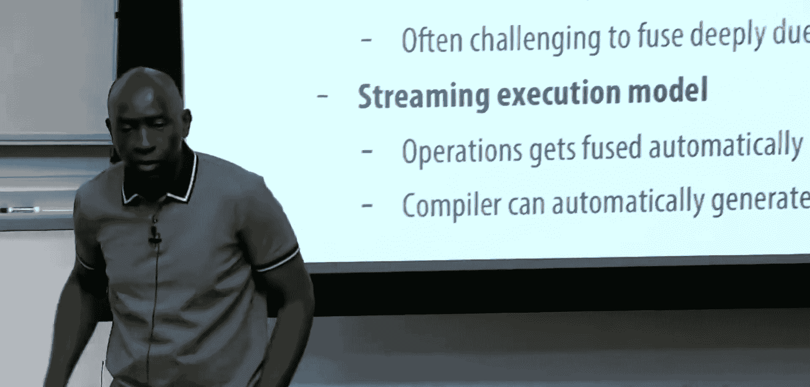

这里有什么问题吗？是的。为了确认，流式执行模型独立于加速器设计的概念吗？比如你可以编写一个流式程序，但它可以在现有的架构上运行吗？是的，它可以。你可以想象它在现有架构上运行。问题是，在CUDA中编写流式程序非常困难。你基本上没有能力让内核的不同部分独立运行。因此，你通常需要编写某种融合内核。你可以想象，我认为你和开发CUDA的人谈过，他们正在尝试启用这种执行方式，但我还不知道如何做到。我不是说永远不可能，但目前还不可能。😡

如果FIFO深度变得太大，流式执行模型有什么替代方案？那么你可以使用缓冲区，即使用SRAM而不是FIFO。你可能需要稍微不同地编写你的应用程序。或者你会尝试思考从根本上减少FIFO大小的技术，比如Flash Attention。因此，你可以以一种简单的方式使用FIFO，而不必太费力。但最终，也许FIFO变得太大，然后你必须更努力地工作，并做一些真正转换应用程序的事情。

他给出的例子使用了Spatial，但Spatial可以针对各种目标吗？是的，是的。它本意是作为一种硬件模型。它非常适合我们定义的一种称为可重构数据流的新架构风格。它并不真正匹配GPU。当然，你可以让它运行在CPU上。但我想让你们理解的关键点是流式执行模型的概念，即内核以流水线执行模式并行运行的想法，以及你可以在不显式的情况下获得融合和分块的好处。

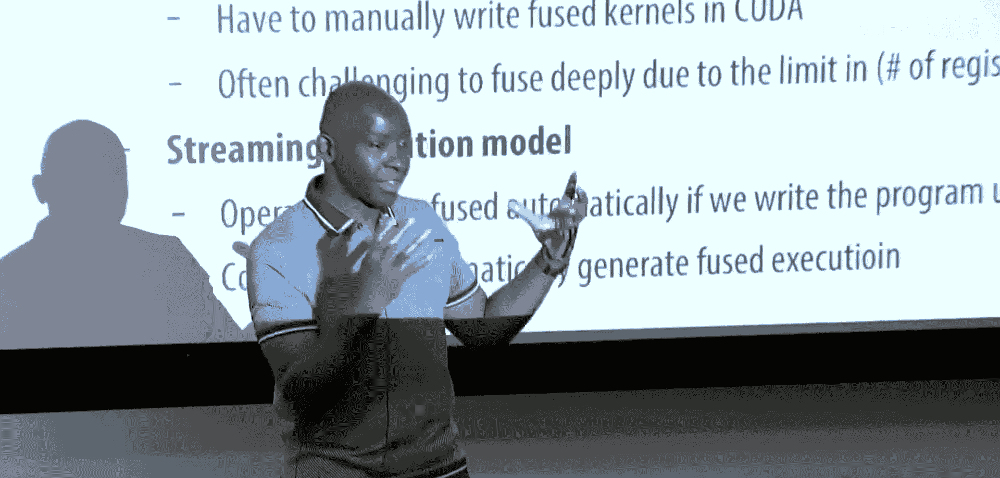

## 总结

加速器可以带来显著的能效改进，你可以获得100到1000倍的提升。设计加速器完全在于理解你的应用程序（这是我们整个课程一直关注的重点），然后弄清楚如何利用你的应用程序所展现的特定并行性和局部性。我们已经看到了这一点，但现在在加速器设计的背景下，你可以明确地定义将使用什么资源来利用并行性，以及如何设计内存层次结构以确保获得最大的局部性。因此，你可以定义大小，可以定义数据何时从内存层次结构的一个部分移动到另一个部分。😊

你需要洞察应用程序：瓶颈在哪里？是内存受限还是计算受限？当我改变算法或实现时，这会如何变化？Spatial是一种编程模型和思考方式，用于探索当你想要进行这些权衡时的设计空间。这比你在这里所做的稍微前进了一小步：你现在理解了应用程序，理解了并行性，理解了不同类型的并行性。那么，如果你实际上可以控制并定义硬件，你会做什么？然后思考这意味着什么。

我们没有时间讨论内存的设计。也许Cavin会在周四讨论，也许不会，这取决于他。但就异构计算中的加速而言，我们已经完成了。谢谢。

## 本节课总结

在本节课中，我们一起学习了硬件专业化如何成为实现高能效计算的关键途径。我们从能效约束的普遍性出发，探讨了从通用CPU到高度专门化ASIC的能效与可编程性权衡谱系。我们深入了解了Spatial语言，这是一种用于设计硬件加速器的领域特定语言，它允许程序员明确控制内存层次结构、数据移动、并行化（包括独立和流水线并行）以及分块策略。通过点积和注意力机制（如Flash Attention）的示例，我们看到了流式执行模型如何通过避免不必要的数据物化和利用流水线并行性来显著提高性能并减少内存占用。最后，我们认识到设计高效加速器需要对应用程序的并行性和局部性有深刻理解，而Spatial等工具为探索这一设计空间提供了强大的抽象。