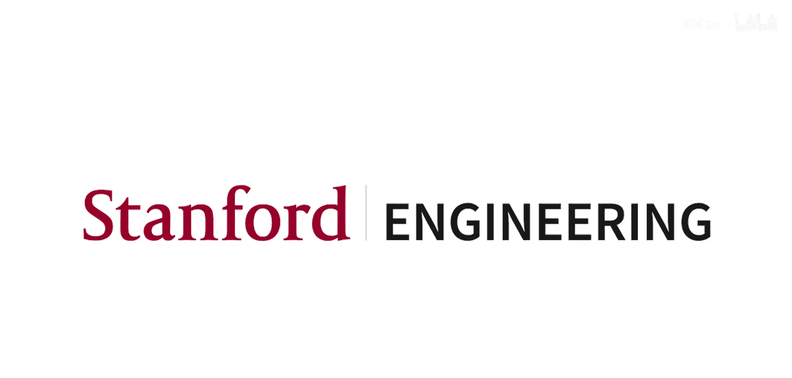
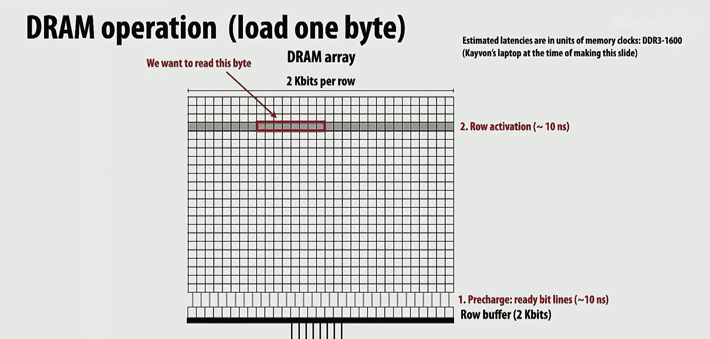
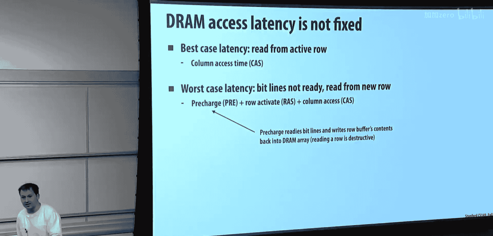
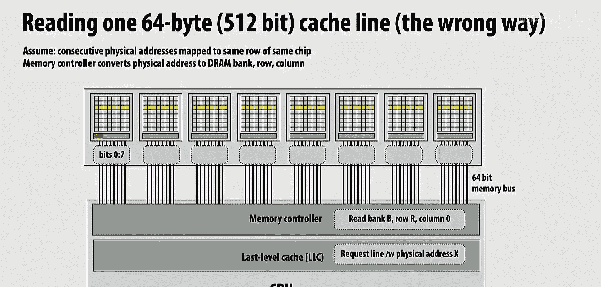
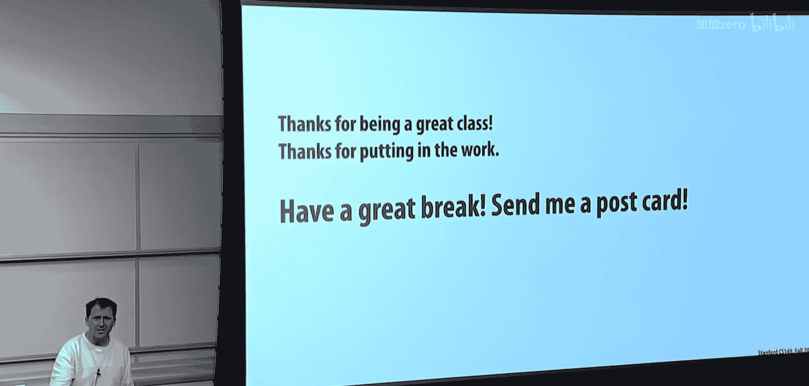

# 019：访问内存与课程总结 🧠💾

在本节课中，我们将学习计算机内存系统的工作原理，特别是DRAM的访问机制。理解这一点对于解释为何某些内存访问模式比其他模式快得多至关重要。课程最后，我们将对整个课程进行总结，并探讨后续的学习方向。

## 内存系统概述

到目前为止，课程中内存一直是一个相对抽象的概念。在脑海中，你可能想象着一个处理器，以及一些被称为DRAM的内存。为了减少内存访问时间并增加内存带宽，现代计算机中设置了缓存。

如果你将CPU或核心想象成一个盒子，里面有一个处理器核心。例如，你们使用的Intel芯片有四个核心，而AWS上的机器可能提供了8核16线程的配置。然后，还有一些缓存。在下面的图表中，我只画了其中一种，即最后一级缓存。如果你的系统有L1、L2和L3缓存，那么L3就是最后一级缓存。我们通常关注最后一级缓存，因为这是缓存未命中时请求必须前往内存的节点。

任何现代处理器上都有一个称为内存控制器的模块。当最后一级缓存发生未命中时，处理器必须从内存获取数据。内存控制器负责向内存发出请求，取回结果，并确保数据进入适当的缓存。

## DRAM的工作原理

内存是以DRAM的形式实现的。如果你打开笔记本电脑，实际上会看到一些DRAM芯片。你可以将单个DRAM芯片想象成一个巨大的内存单元阵列。图表中的每个框都可以看作存储着一个比特，这是一个内存单元。在这个层面上，我们实际上是在模拟世界中工作。一个比特是通过每个单元中存储的电荷量来表示的。这有点像数码相机中光电元件的逆过程：在相机中，光线照射到感光材料上产生电压，电容器则保持该电压以记录光子数量。在这里，我们则是试图存储信息：如果我们想存储一个“1”，就将其编码为某个电压；想存储“0”，则编码为另一个电压。

所有这些比特都组织在DRAM芯片上，实际上是二维排列的。在芯片底部，有两个重要的结构部分。首先，有连接芯片与计算机其他部分的数据引脚线。这里有8个数据引脚，意味着这个DRAM芯片在任何一个时钟周期只能发送8比特的信息。为了访问DRAM芯片，芯片实际上并不是直接将数据从DRAM阵列发送到线上。它在这里有一个缓冲区，就像一个数字缓冲区，用于存储DRAM芯片中某一行的比特值。这被称为行缓冲区，它存储一行数据。因此，当你从DRAM芯片访问数据时，实际上只访问存储在这个行缓冲区中的一个字节大小的数据块。

假设我们发生了一次缓存未命中，加载指令需要访问地址X（此时我们讨论的是内存中的物理地址X）。内存控制器从处理器收到这个命令或请求：“嘿，给我X。”实际上，这意味着“给我包含X的缓存行”。当我说X时，可以将其视为缓存行的起始地址。处理器可能访问的每个字节都将是这个DRAM阵列中某个连续行的一部分。假设我们想访问图中用红色高亮显示的字节。目标是读取这些内存单元中的值，然后通过这些位线将这些值传回处理器。

基本上，将电容器上存储的电荷电压转换为数字1和0需要几个步骤。DRAM术语中的第一步实际上是预充电，这类似于为读取特定行做准备。换句话说，可以将其理解为：这些位线是贯穿整个芯片的导线，它们应该读取这些单元中的电压，并将整行的电压一次性传送到行缓冲区。如果这是软件，我会说我们需要复制其中一行的数据，将其放入行缓冲区以便访问。但进行这个复制实际上是沿着这些导线传输电压，因此我们必须将这些导线设置为某个已知的电压水平。这大约需要10纳秒。

然后，我们基本上锁定想要的行，进行行激活。行激活基本上是从该行读取电荷，并将其带入芯片底部的行缓冲区。这是信息的复制。有趣的是，由于这是模拟过程，这个复制实际上会破坏该行中的值。因此，此时该行信息唯一存在的地方就是下方的行缓冲区。我花了10纳秒准备好通信线路，又花了10纳秒读取该行的电压，现在信息就位于行缓冲区中了。

然后，根据我想要的具体字节，我可以选择该信息。这被称为列选择，因为你想要的字节是选择该行中的某些列，并将这些比特传输到内存总线上。现在，它们正移回芯片上的内存控制器，芯片会将它们放入正确的缓存中。因此，读取一个字节的过程大致是：准备就绪，激活相应的行，然后选择正确的列，最后将那八列的内容移动到导线上。

如果下一个要读取的字节是同一行中的下一个字节会怎样？你将无法从行中读取它。实际上，你不仅不能，而且也不想这样做，因为整行数据已经位于行缓冲区中。你只需移动过去即可。因此，如果你的第一次访问需要行激活和列选择，那么第二次访问实际上会更快，因为你只需要读取行缓冲区中已有的下一个字节。

这很有趣，对吧？DRAM的访问时间是可变的，取决于你的访问模式。DRAM可能没有准备好处理你的请求，它可能需要额外的20纳秒来准备，这可能是一个大问题。

## 内存控制器与调度

处理器请求地址X处的数据时，是内存控制器的实现负责将其映射到那个二维阵列中的位置。在软件层面，你几乎没有机制来控制这一点，这其中的原因可能稍后会更加明显。

你注意到的是，假设我必须对图中用不同颜色高亮显示的四个位置进行内存访问。例如，你正在遍历一个链表，或者不知道数据在地址空间中的具体位置。我的操作包括预充电（准备位线）、行访问选通（选择行并将数据带到行缓冲区）以及列访问（从行缓冲区读取相应的列）。我将列访问标为红色，因为这是数据通过内存总线（内存引脚）移动的时刻。如果内存引脚是系统中最宝贵的资源，那么你的目标应该是始终充分利用这些引脚。如果你没有100%利用它们，就是在浪费系统中最稀缺的资源。

在这个例子中，内存总线的利用率是多少？大约只有十分之四。那么，从这门课的标准技巧来看，有哪些方法可以更好地利用资源呢？我们可以进行流水线操作。如何做到这一点？有几个不同的方向：增加请求的最小大小，或者使用多个行缓冲区。基本上，你是在说需要一些多线程的思想。

首先，最简单的方法是让芯片支持批量传输。芯片的命令不是“给我一个字节”，而是“给我64个连续的字节”。在任何计算机系统中，如果你想分摊开销，批量处理是首要方法。如果你的访问模式允许处理大的连续数据，这是一种方式。顺便说一下，如果你连续地遍历内存系统，会获得最佳性能，这不仅仅是因为你使用了整个缓存行，还因为如果内存控制器知道访问模式是连续的，它就能以最高效的方式与DRAM系统通信。这也是存在缓存行的原因。现代缓存行是64字节，这有助于表明大的连续粒度传输更高效。

你们提到的都是非常好的想法，而这正是将要发生的事情。基本上，这里的问题是经典问题：如果一个操作有延迟，我需要隐藏这个延迟。在这门课中，如果你想隐藏任意延迟，就使用多线程；如果你想进行更结构化的延迟隐藏，就使用流水线，即让更多操作同时进行。我们肯定会对这个过程进行流水线操作。

每个DRAM芯片都有一个这样的阵列和一个行缓冲区。实现流水线的方法是复制这些结构。我们将共享数据引脚，但会构建更多的DRAM阵列。在DRAM术语中，这些不同的阵列被称为存储体。这样，当我们在一个存储体上等待行激活时，我们可以向其他存储体发出请求，并开始从其他存储体读取数据，通过总线发送数据。请注意，如果你的地址交错分布在各个存储体上，我可以在启动存储体1的行访问时，开始处理存储体0的数据读取。这就是经典的流水线例子。

每个DRAM芯片都有一定数量的数据引脚（基本上是8个），一个行缓冲区（用于存储来自任何DRAM阵列的行），以及多个被称为存储体的DRAM阵列。这些被打包在一起。如果你想要一个64位宽的总线（这是一个8位宽的总线），你就开始将它们并排放置。当你去购买一个DRAM DIMM（双列直插内存模块）时，DIMM上就有8个这样的DRAM芯片。现在，你有了一个64位的内存总线。你的标准Intel处理器连接到一个64位内存总线。内存控制器发送一个命令，这个命令不是“我想要地址X”，而是“我想要存储体B、行R、列X处的字节”。所有8个DRAM芯片都收到相同的命令，它们都返回存储体B、行R、列0处的数据，总共就是8字节的数据。

因此，内存控制器的责任是：如果我应该获取某个地址处的64字节缓存行，那么在存储体、行和列这个三维地址空间中，这些数据位于哪里？然后你发出请求。

人们看起来有些困惑。我们没有复制数据，只是简单地有多个存储体。如果我访问存储体0，这里是存储体0的预充电，这里是将行抓取到行缓冲区，然后是从行缓冲区为存储体0的访问读取数据。当我们在从存储体0的行读取数据时，我们正在对存储体1进行预充电。垂直的数据线是复制的，有n个不同的DRAM阵列，它们都存储不同的数据。

让我们思考一下读取一个缓存线。一个缓存线是64字节或512比特。想象一下我做最简单的事情：我把整个缓存线放在一个DRAM芯片的连续行中。读取整个缓存线需要多长时间？我的第一个字节来自这个DRAM芯片，第二个字节来自那个DRAM芯片，第三个字节来自另一个，依此类推。即使我有一个64位的内存总线，我也只使用了8位。这表明答案应该是：我必须在DRAM芯片之间交错地址空间，这样当我发出读取存储体B、行R、列0的命令时，所有芯片中的相同位置恰好是物理地址空间中连续的8个字节。当然，如果我想要缓存线的64字节，我需要在时间上重复这个过程八次。

当你有一个存储体但只有一组数据引脚时，情况会怎样？在这个图中，每个框都是一个DRAM芯片，每个DRAM芯片内部都有多个存储体（我在幻灯片上没有进一步说明）。你可以将DRAM芯片看作一个模块，它接受输入请求：“给我存储体B、行R、从列0开始的字节”。请记住，如果我这样做，假设我将字节跨DRAM芯片交错存放，我们在这里得到8个连续的字节是合理的。但我们有整个缓存线，我们需要接下来的8个字节。我可能会将下一个字节交错存放在各个DRAM芯片中，但将其放在这些DRAM芯片的不同存储体上，因为我希望在下个周期立即启动对下一个字节的行访问。

在每个时钟周期，内存控制器都在发送命令。假设为了简单起见，它立即开始处理该命令。在下一个时钟周期，它将开始预充电存储体B+1，因为下一个命令会说“我想要存储体B+1处的数据”。内存控制器将以一种基于其对内存工作原理了解的方式向内存系统发出请求，以便尽可能快地满足这些请求。如果是一个完整的缓存线（比如64字节），该请求实际上可以是突发传输模式：“我想要从B、R、列0开始的8个字节”。因为我可能会将下一个字节放在每个DRAM芯片的同一行中。在这种情况下，我不会启动新的存储体传输，我只会说：“看，我需要从所有DRAM芯片的同一行中获取8个连续的字节，乘以8个DRAM芯片，这样我就能得到我的64字节。”

来自处理器的请求也会经过相同的路径吗？通常还有一个命令总线。有一个64位数据总线，然后还有一个命令总线。我自己没有实现过这些，不确定引脚是否有巧妙的时分复用，但在现代DDR中，你实际上是在时钟的上升沿和下降沿进行两次传输，所以除非你非常有创意，否则我看不出如何能压缩更多信息。

## 内存层次结构与性能

这就是你的基本内存单元。有时你会听到双通道内存系统之类的说法。你可以将其视为内存控制器和一个内存模块之间的一个通道。请注意，一个通道每个时钟可能有一个命令，相同的命令会发送给所有模块。双通道内存系统就是复制这一套结构。所以，这里有一个例子。

请记住，处理器在这里，它只是产生缓存未命中，缓存未命中会转化为“我需要这个缓存行”。这些是对内存控制器的请求。内存控制器接收所有这些对缓存行的请求，并将其转换为内存通道请求，例如“我需要这个存储体、这个字节、这一行”。因此，内存控制器将物理线性地址映射到DRAM阵列中的位置。

现在，内存控制器接收到的只是某种随机的缓存未命中。现代内存控制器会将这些请求排队、缓冲，然后重新排序所有这些缓存未命中，以便如果它能找到需要访问同一行的请求，它会重新排序请求以最大化这种命中率。因此，它基本上会重新排序所有处理器的内存请求，以尝试获得最高的存储体流水线效率和最高的行缓冲区局部性。请记住，处理器的内存请求可能来自系统上所有不同的应用程序。你可能有一个应用程序正在线性读取内存，另一个运行在不同核心上的应用程序也在线性读取内存。想想这两个内存请求流将如何交互。突然之间，你以为完美布局的数据，现在核心0在这里，核心1在那里，你就会使那个DRAM芯片发生抖动。

我们要等待多少个请求？这是一个实现细节。一方面，缓冲会增加延迟；另一方面，缓冲和重新排序可以增加带宽。如果你的应用受带宽限制，你希望积极缓冲以最大化带宽。如果你的应用对延迟敏感（比如某些实时应用），你可能不会对重度缓冲的内存控制器感到满意。NVIDIA的内存控制器可能是芯片中最复杂的部分，实际上可能缓冲了数万个内存请求，因为GPU上的一切都受带宽限制。它就像在等待，看看在接下来的10纳秒内是否有更多对这个已打开行的请求，如果有其他请求进来，就让它们排到队列前面，因为它们会非常廉价。

延迟与带宽。内存控制器是动态决定这一点，还是你构建一个内存控制器时就已经确定了？作为内存控制器的实现者，这是你的自由裁量权。发生的情况是，所有乱序、复杂超标量处理器的复杂性，我们在这方面已经不再追求更复杂了。我们甚至一度构建了更便宜或更简单的处理器。例如，现代GPU在核心中做的智能处理可能远不如现代CPU。我们开始构建所有这些核心，它们都共享内存系统。因此，我们过去用来调度指令的所有调度逻辑，现在变成了论文和算法，用来研究如何查看传入的缓存未命中流，猜测这是否受延迟限制，以及如何制定良好的调度策略。所以，在2012年到2015、16年左右，计算机体系结构领域都在研究这个，而在90年代或21世纪初，他们则专注于如何为指令流构建分支预测器。

他们将复杂性从处理器中移出，基本上塞进了内存控制器，而内存控制器正在接收来自16个核心或32个超线程的请求，并试图找出如何重新排序所有这些来自不同进程的请求，以最大化DRAM总线的引脚利用率或能效。另一件事是，你实际上也在尝试最大化能效或最小化能耗。

## 现代内存技术

最后一部分是复制我们刚刚构建的东西。如果你想要更多带宽，我们就开始复制。如果你听说双通道DDR4内存系统，那只是一个连接到DIMM的64位总线，现在有两个这样的通道连接到两个DIMM。当你有两个通道时，你实际上可以说，这个通道向这个DIMM发送的命令可能与另一个DIMM不同。但连接在同一通道上的所有设备接收的是相同的命令。

这里有一个例子，比如你在网站上可能看到的DDR4。DDR4是一种内存技术，后面的数字实际上是内存总线的时钟频率。所有这些现在都是64位内存总线。2400这个数字听起来更大，在计算中更好。它实际上是一个1.2 GHz的内存总线。所以它发送数据，或者说周期是1.2 GHz。事实证明，第一个D（DDR）实际上是双倍数据速率内存技术，它实际上在每个时钟的上升沿和下降沿发送两次事务。所以，如果你将1.2乘以2，你得到每秒2400次内存事务，通过一个64位总线。如果你说64字节乘以2乘以1.2，你实际上得到19.2 GB/秒。如果是双通道，你只需将所有乘以2，然后查看内存系统的规格，它会说类似“内存系统可以提供38 GB/秒的带宽”。这个数字就是这样来的。

这就像一台普通PC中的标准配置。然后它说，在我查资料的时候，大约有13纳秒的延迟。这就是将已经在行缓冲区中的数据从DRAM芯片中取出并通过总线传输所需的时间。

你必须考虑到这一点，因为如果你有一个友好的内存访问模式，问题是你能以多快的速度取出数据？这并非无关紧要。想想现代处理器运行在3 GHz。1 GHz是1纳秒，对吧？如果运行在3 GHz，那就是大约0.3纳秒，所以你仅仅为了从行中取出列数据，就要花费30倍的时间。当然，你的内存访问时间还包括从处理器出发、经历几次缓存未命中、直到离开芯片所需的所有周期。所以，除了访问DRAM本身之外，还有更多的延迟。

## 内存系统的其他方面

我没有在这里讨论任何容错机制，比如比特翻转。通常发生的情况是，你有这些纠错码。如果你购买稍贵一些的内存或服务器内存，通常DIMM上不是8个芯片，而是会有第9个芯片。第9个芯片是冗余的。基本上，你可以检查是否有错误，具体取决于你如何处理，你实际上可以检测是否存在错误，因此你只是牺牲了一点容量来实现这个功能。

我认为关键要点是：这就是DRAM工作原理的一点介绍。重要的结论是，内存控制器调度器中存在大量的复杂性，用于接收来自处理器的请求并重新排序，以便这些请求以非常友好的顺序访问DRAM。你可以把它想象成你在Flash Attention中所做的：你重新排序计算以命中缓存。这是关于重新排序缓存未命中，以便它们以良好的方式访问DRAM，显然这是由硬件完成的，而不是由程序员完成的。如果你在面试中被问到“如何调度DRAM请求流？”，这很酷。

## 高带宽内存与未来趋势

当然，问题是我们总是受带宽限制。所以，你可以这样想：DRAM在这里，电路板上，然后那些引脚穿过整个电路板到达这里的处理器。问题是，我们只有8个引脚的原因是这些引脚非常昂贵。因此，人们非常有兴趣让处理器更靠近内存，以减少信息传输的距离，这使得构建更多引脚在经济上变得可行。

如今，在高端性能领域，最主要的方式是通过芯片堆叠和将内存与处理器放置在同一硅片上的组合来实现。这是一张示意图，展示了如果你今天购买服务器级GPU，可能会听到的HBM（高带宽内存）或HMC（混合内存立方体）。我认为HBM基本上赢得了竞争，所以现在你经常看到HBM。它的工作原理是这样的：这是我的GPU或CPU。通常，那个GPU或CPU是插在主板上的。然后，有迹线（基本上是主板上的铜线）连接到一个插在主板上的DRAM芯片。

如今，如果你想要这种高带宽内存，这是你的CPU或GPU，它就在一个硅芯片上。在同一个硅芯片上，紧挨着它的是一个内存模块。现在，这两者之间的连接实际上是硅片上的导线，而不是主板迹线。然后，DRAM芯片实际上是堆叠的，这意味着这些DRAM芯片物理上叠放在一起。关键技术是这种称为TSV（硅通孔）的东西。所以，你可以想象，过去是芯片边缘的8根导线，现在变成了从DRAM阵列中穿出的导线。因此，你获得的是整个芯片面积的空间，而不仅仅是芯片一条边的空间，所以你可以从芯片底部引出更多的导线，这些导线必须穿过下方的DRAM芯片，然后直接进入GPU所在的硅片。如果你购买其中一个，所有这些都在同一个封装里，看起来就像一个芯片。

这使得人们能够从内存系统向CPU引出更多的导线。我谈论的不是64位了，而是1024位。所以，如果你购买现代的Intel高端产品（比如超级计算机用的）、AMD或NVIDIA的GPU，这就是现在的芯片。这是处理器，这是所谓的硅中介层（一块硅片，处理器在上面），然后旁边有四个不同的堆叠DRAM，所有这些都是1024位连接到芯片。这是一个4000位的内存总线，这很快。现在，它提供了每秒720GB的芯片带宽，而这还是2016年的数据。现在可能更高，我认为我们接近2TB/秒了。

但这是固定数量的内存。所以，在2016年，这只有16GB内存。现在更高了。如果你需要大量内存，那么你有一个传统的内存总线连接到DDR5或DDR4，你可能拥有数百GB或TB的内存。所以，这是一种DRAM形式，它不是缓存。这里可能有一个80MB的L3缓存。如果你错过了80MB的L3，你可以访问（在这种情况下）16GB的、约1TB/秒的堆叠DRAM。如果你的数据不适合堆叠DRAM，那么你必须将数据放在传统内存中，现在你又回到了每秒300到400MB或GB的速度。

因此，内存层次结构变得非常非常深。你们实现的Flash Attention最初就是为了让中间矩阵乘法适应16GB的HBM，而不是去访问这些芯片上的DRAM。它也是更高的带宽、更低的延迟。在GPU中，我们不太关心延迟，因为我们可以用多线程或流水线来隐藏它。但确实，更低的延迟、更高的带宽、更低的能耗。

## 课程总结与展望

如果你在课程的最后一天能带走什么，那就是很多时候并行化其实相当容易，真正困难的是弄清楚如何将数据送到你的处理器面前。调度是困难的。你们在这门课中一直在自己做这件事，比如Flash Attention，你们的CUDA编程作业很大程度上就是关于局部性的。然后，硬件人员正在为你们设计更好的内存系统。

通用的设计原则是：要么数据需要位于处理器旁边，要么处理器必须更靠近数据。我们在这门课中没有过多讨论的一点是，如果你受带宽限制，数据压缩几乎总是值得的。因为如果你受带宽限制，你的CPU或GPU是空闲的。所以，实际上让它执行更多指令来移动更少的数据是划算的。例如，GPU在处理纹理数据时，实际上在发生缓存未命中时，会在将数据放入内存之前压缩数据。它实际上移动更少的数据，然后当你需要数据时，它将压缩后的数据移动到芯片上，然后解压缩到完整的缓存行中。这在图形处理中非常常见。

关于当今内存的内容就讲这些。有没有人实际研究过这些东西，比如在NVIDIA或Apple实习过？在Apple，如果我不能说的话就算了。我想我们基本上讲完了。让我总结一些技术要点。

在可预见的未来，有几个要点。我的意思是，如果你看看现在的Apple Silicon或者你的iPhone或Android手机里的东西，它是一个异构多核处理器，有多个CPU核心、多个GPU核心、神经核心（专门用于处理睡眠时间表等数据）。在未来，除非在技术层面出现一些重大突破（比如更光学化或更量子化），否则提高效率的唯一途径将是并行化，这已经发生了，并将通过某种程度的专业化来实现。因此，让这些专用处理器更容易编程引起了极大的兴趣。

我真正希望人们从这里带走的是：大多数软件与现代计算机实际能做的事情相比，效率低得惊人。就像我们在作业1中看到的，一个编写良好的C程序在我们的笔记本电脑上比一个精心编写、使用向量单元和SIMD以及专用处理的程序慢40倍，而后者在此基础上还能再快10到100倍。所以，当你在实验室工作或进行未来研究时，如果有人说要扩展到大型集群，有时这是正确的想法，因为优化程序可能很困难。但有时，我们本可以努力扩展到大型集群，或者等待一夜，也可以投入一点精力让程序运行快1000倍。有时，这对人们来说绝对是改变游戏规则的，或者它可能使得以前认为在移动设备上不可能的事情成为可能。

这门课有趣的一点是，如今几乎所有的计算应用实际上都属于我们在这门课中讨论的类型。我们不必去大规模科学计算领域寻找应用。你现在去Apple面试移动团队职位，能效和软件效率是他们关心的。你去Waymo，他们也会关心这些。所以，从这门课出发，有很多地方可以去，尤其是现在所有这些大型基于AI的语言模型都极度受效率限制。

我们讨论过几个主题，比如识别并行性（我常说这对每个人来说都是最容易的事情），而一旦知道了依赖关系，调度这些并行性则要困难得多。我们在小规模和大规模上都讨论过这个问题。我们还讨论了很多关于如何通过依赖更高级别的抽象来让我们的生活更轻松。在未来的课程中，如果你用TensorFlow、PyTorch或SQL编程，你可以想想，哇，幕后进行了多少并行化和效率优化，而你不需要考虑，因为有人已经建立了一个有用的抽象。

我们还稍微讨论了硬件的工作原理，这样至少当有人走过来告诉你这个计算需要三个小时时，你可以稍微质疑一下。你会想，如果仔细想想，这个东西应该只需要5秒。你一定在调度上做错了什么。你会惊讶这种情况发生的频率。

## 后续步骤与实践建议

接下来是一些实际的事情。我们确实教授其他课程。Konley下个季度有他的硬件编程课。如果你对使用空间计算感兴趣，我想他们教的是Spatial。你们有些人知道，还有229S这门新课，它与这门课同时进行，也许我们应该考虑将来把它们安排在不同的季度，因为感觉你应该先上149，然后从229中学到很多东西。但那是一门很棒的课程，我一直在关注这门新课，真的很酷。下个季度我教图形学，如果你对图形学感兴趣，欢迎加入我们。但如果你对图形学不感兴趣，我教的是混合图形学，基本上如果你学了149，又学了视觉和图形学，把它们结合起来就是春季的348K。这是一门小课，我们通常保持在30人左右，我们阅读关于如何构建系统的论文，比如Google的视频处理系统，或者现在如何服务ChatGPT数据中心之类的。我们讨论非常近期的论文，然后这是一门基于项目的课程。想法是如何思考构建这些视觉计算系统，其目标是生成或理解像素。

当然，还有很多标准课程，比如EE280s，如果你想深入了解硬件操作系统，这里有很多课程以不同方式涉及并行性。

然后是研究的想法。在完成了我们布置的这些作业（它们并不容易）之后，你们中的许多人通过这门课程真正积累了一些实际的编程能力，你们知道了基础知识。所以，如果你有兴趣，现在可以开始考虑融入系统组（比如K和I或其他系统教师）的某个研究实验室。我鼓励人们考虑这一点，并不是因为我真的提倡研究。经常有人和我们一起工作，他们说我不想成为学者或研究员，但他们想把独立学习当作一门课，他们会修3或4个学分，他们的角色是跳入一个现有的研究项目，通常承担更多的软件工程或支持工作，比如“嘿，我们正在考虑并行化这个，但我们没有人来做。你想看看能否让它快100倍吗？如果可以，我们可以把你列入论文，你可以参与写论文。”我认为在斯坦福最酷的事情之一就是，与世界其他地方相比，你可能可以在世界各地的许多大学上一门相当好的并行编程课。但真正有趣的是斯坦福的同龄人群体，对吧？比如与你的伙伴合作，或者与班上的其他人或助教合作，这才是这里真正有趣的地方。如果你能相信，你现在合作的硕士生或本科生，你会想，哇，这些人真的很酷。我们的博士生也不差。所以，这真的可以开阔你的眼界，你会想，哇，那个人只比我大2、3岁，他们太棒了。也许我也能达到那个水平。所以，如果你找到合适的契合点，这可能会很有趣。

让我更具体地谈谈我实验室的一个项目。正如你们许多人可能经历过的那样，人们现在非常有兴趣训练AI智能体，无论是机器人还是软件智能体，让它们在现实世界中做事。我来自图形学领域，所以对我来说，你们都在这些模拟器中做所有这些事情。那么，游戏引擎不就是一种模拟器吗？所以很多这项工作，比如你可能听说过的OpenAI Dota游戏机器人，现在算是旧闻了。另一个例子是2对2的捉迷藏游戏，两个智能体必须躲藏，另外两个智能体必须找到它们。在机器人等领域有很多这样的东西。问题是，一般来说，人们基本上是使用Unity或Unreal，并在其中运行模拟。如果你不了解现代AI的东西，基本上有两种方法：你可以让LLM告诉你该怎么做（有时有效），另一种有时有效的方法是进行大量的试错。机器人尝试执行这个任务，哎呀，你脸着地了。好吧，把它当作一个错误，做一个小修正，再试一次。由于所有这些试错，人们使用相当庞大的资源来学习这些技能，通过GPU集群，数十亿时间步的试验。在这些3D环境中计算所有这些时间步花费了所有时间。因此，他们只是在大型集群上加载。

我的一个学生看到了这一切，然后说：他们这样做是因为他们在不同的服务器上运行了10000个Unity副本，玩同一个游戏。他想，或者你在同一个盒子上运行30个Unity副本，然后它们开始抖动，如果你的目标是玩10000个游戏，这是一种糟糕的做法。所以，他开始思考，如果我们从头设计一个迷你游戏引擎呢？这个游戏引擎的目标不是为人类渲染图片，而是同时进行10000个独立的游戏副本，但以一种锁步的方式进行，这样我们可以获得所有良好的相干性和并行性属性。

这是一个在他的系统中创建的游戏示例。你可以看到一些要求。这是那个捉迷藏的东西。应该有两个团队，这两个家伙和那两个家伙，你看到他们学会了通过像小孩子一样把东西拉到脸前来赢得游戏。根据游戏规则，从技术上讲，他们不能被看到，所以他们赢了。我再放一遍，他们必须学会去看到别人，比如在这种情况下，他们必须学会去看右边的人。但发生了一些有趣的事情。这最初是由OpenAI完成的，我们只是复制了它。

有很多相当复杂的计算，比如你必须根据游戏规则模拟物理世界，或者只是为了让人感知环境，你实际上必须进行大量的光线追踪，因为你必须判断谁能看到谁。然后就是游戏逻辑规则，比如当我靠近这个方块并按按钮时，它应该附着在我身上，因为我捡起了它。所以有任意的逻辑。你希望能够像这样编写游戏逻辑：好的，这是一个事件处理程序，这是一些基本脚本，说当我靠近这个东西并捡起它时，它的所有者属性就变成我。

所以你用正常的方式编写游戏。但我们有方法基本上像ISPC或CUDA那样跨所有东西进行并行化，我们实际上像这样运行模拟。你不需要考虑并行，但我们将其并行化。现在我们同时排列成千上万个游戏。仅仅通过这种基本的CS149式思考，我们可以运行得相当快。与现成的开源方案相比，这大约有2到3个数量级的加速。所以，过去需要64个GPU集群运行一周的东西，现在可以在单个GPU上一两个小时完成。或者有人训练这个“Overcooked”AI（一个常见的强化学习基准），过去一个训练运行大约需要4小时，现在变成了3秒，因为这些是相当简单的游戏。

所以，这就是一个例子。在这样的项目中，很容易说，哦，我们很希望有人为游戏引擎添加一个功能。我们有一个本科生，他是个好学生，在大一或大二时上了我的348课，他实际上刚刚构建了一个全新的渲染系统，该系统分摊了10000个不同场景的开销并构建了渲染系统。所以现在我们可以渲染这些东西了。如果我们不渲染像素，我们可以以大约每秒200万帧的速度运行这个东西。但现在我们实际上在渲染像素，以防你想训练一个实际接收图像并采取行动的智能体，我们可以以每秒20万帧的速度进行，对于小图像之类的东西来说。这是一个相当大的差异。每秒20万帧，好吧，让我们降到10万，因为你还得运行深度网络之类的东西。所以，大约一半一半的模拟，也就是每秒10万帧。在10秒内，你就有了一百万个经验样本。所以，在一个周末内，你就能接近十亿个样本。所以，也许这将允许一些事情发生。

所以，有很多方法，比如，如果能够用Python编写脚本，并将Python编译成CUDA PTX代码，这样你就可以用Python而不是CUDA编写脚本，那就太好了。有很多像这样的小项目，技术性极强，人们可以帮助完成。所以，这是一个项目的例子，如果人们是优秀的实现者，很容易让你参与进来。其他项目则更难参与。我们有一个硕士生，去年上了149，他只是想开始在这个东西里实现Minecraft。所以他正在实现他自己的Minecraft，运行速度大约60万帧/秒。

这里的假设是，就像现在你已经完成了斯坦福学业的一半或四分之三，可能是时候开始思考你毕业后到底想做什么了。有时候，开始做一些自己的项目或一些不那么有指导性的东西，如果你对此感到失望，可能比只是上下门课、按照教授布置的五个作业去做要有用得多。所以，这只是我想告诉人们在他们职业生涯的这个阶段的一些事情。斯坦福的传统路径是什么？老实说，这和其他顶尖大学的传统路径一样：你们都获得了很好的AP分数，如果你们上了更多的AP课，就会比别人强。有一种观念认为，如果你在CS课上得了很多A，你就是在做一份好工作，对吧？所以，你获得了4.0的GPA，你可以去那里工作，你可以参加一些免费食物活动，有些人会给你回电，你会得到一份好工作。你肯定会得到第一轮面试，你会得到一份好工作。无论现在好工作在哪里，我不知道现在热门的地方是哪里。但过去，如果你能在毕业年拿到Facebook（或当时的Meta）、Google和Dropbox的offer，让它们互相竞争，然后你就完成了。去那里待两年之类的。如今，实际上我不确定所谓的默认好工作offer是否还那么明显。我很好奇，现在是否还有像过去那样，每个人都追求的三四家公司？我感觉现在不再是那样了。但过去CS确实是这样。然而，现在更有效的方法是，我在这张幻灯片上用了我的名字，我不是说来找我工作之类的。但每年都有一些人来说，嘿，我上了你的课，无论是哪门课，都很酷。我还能做些什么吗？有时候我会说，嘿，是的，我记得你的作业3，你做了所有的额外加分。是的，当然，你看起来知道自己在做什么。然后我会说，哦，我们现在肯定在找人来编写一些硬核的CUDA代码，或者实现一个新的应用程序，对其进行大量基准测试，因为我们想将该基准与我们实验室正在做的事情进行比较。人们就是这样开始参与的。你只是在某种程度上变得有用。

有时，并非总是如此，我大约50%的时间，也许30%的时间，确实是合适的学生与我的博士生一起参与。他们基本上就像博士生一样进行独立学习，我们了解他们，他们过得很愉快，开始做一些比我在课堂上合理要求你们做的任何事情都要困难得多的事情，因为如果我要求班上的每个人都做我的博士生做的一些事情，那将是一门艰难的课。通常发生的情况是，有很多推荐信之类的流程。但通常发生的情况是，那个学生在高年级时四处活动。在某个时候，比如，我不知道，我无聊了。我会说，嘿，顺便问一下，你明年要做什么？他们会说，我不知道，我收到了这些公司的offer，但我对它们不太感兴趣。或者他们只是真的很想进入这个行业。有时候，我认识一些人。我的意思不是我在打电话求情。这份工作更有趣的方面之一是让优秀的学生去他们想去的地方。所以，对我来说，如果学生上过我的课，并且在实验室待了六个月，我对他很了解，那是一件好事。那时我会打电话给我的朋友，说，哦，他们想进入游戏行业。比如，我不知道，Roblox给他们提供了一个入门级的驱动职位之类的，那完全是浪费。那时我会打电话给Roblox的首席工程师，说，斯坦福这里有一个超级明星想为你工作，你能给他一份好工作吗？所以，这就是打开大门的东西。不是说你必须认识人才能得到好工作，而是斯坦福教授与行业中做有趣事情的人联系紧密，因为他们曾经是我们的学生，或者我们和他们一起玩等等。世界上每个人都喜欢把真正优秀的人推荐给别人，让事情发生。所以，这是我工作中非常棒的一部分。我比处理下周必须参加远程考试的人要喜欢得多，那是我最不想做的事情。在那里，你能找到相当有趣的东西。

我给你举个例子：有一个学生，现在大概五年前了，他在我的CS348K课上找到我。他说，我对图形学（实际上是当时的摄影，比如Google摄影）的PhD项目非常感兴趣。那个学生很好，但我说你没有机会进入好的PhD项目。让我们说实话，你没有做过研究，你没有进入你想去的那种好地方的背景。我说，我知道你足够好，但在录取过程中无法证明。所以我说，你想做什么？他说，我想做非常酷的、像Google相机应用那样的东西。我说，哦，好吧，我们要做的是：Google刚刚发表了一篇关于他们的HDR和人像模式如何工作的论文。我说，好吧，在我的课上，因为这是一个开放式的课程项目，我想让你做的是：阅读这篇论文，尝试实现这篇论文。这是你的课程项目。如果你能实现这个东西并让它工作，那对我来说就是完美的机会，去告诉我认识的那个负责那个小组的人，你想和他的博士生一起工作，因为这是一个高年级下半学期的学生，他们没有机会再做研究或建立简历了。那些人看到了那个课程项目，他们说，是的，如果你上过Calin的课，Calin说这个人不错，而且这个人已经通过阅读我们的工作并实现他们自己的版本付诸行动，我们认为这个人可以雇佣，即使我们雇佣的大多是博士生。所以他们达成了一个协议：只要你承诺，如果我们投入时间培养你，你需要待两年，我们就让你和我们所有的博士生一起工作。他说，好吧，没有比这更好的方式为你准备研究生院，并去和当时Google该领域的顶尖人物一起工作了。事情就是这样解决的。他和他们一起工作，到了第二年，他们给了这个人一些写论文的机会。然后他拥有了世界上最强的简历，两年后进入了伯克利，已经完成了一半，四年后从伯克利毕业。我想他现在在Anthropic之类的公司。所以，这只是一个例子，说明如果你多了解你的教师一点，我们想帮忙。

## 一些实用建议

所以，只是一些建议。再次声明，不是针对我，也许是对斯坦福这里的任何人，你可能更喜欢其他课程，但通常你在这里是因为这里的人很好，所以利用这个资源。

关于这一点，有一些实际的事情。几乎总是这样：我经常有学生说，我对并行系统很感兴趣，我能在你的实验室做些什么吗？起初，我很高兴，太棒了。然后我开始想，我能为学生找到一个好的契合点吗？很多学生在修149或这些课程之前就来找我说这个。对于这些学生，我不得不说，看，我们必须假设你有一定的基础知识。我们不能在独立学习中教你149的作业，你不如直接去上课。通常，教师们会看：学生是真的感兴趣，还是只是觉得自己感兴趣？如果他们真的感兴趣，他们会修你的课，并且至少在课程的某些方面做得非常好，以表明他们真的感兴趣。如果有人来找我说我在149得了B，我会想，如果你真的感兴趣，我给了你我能想到的最酷的东西，为什么那没有让你兴奋？有时候他们会说，嗯，我有其他事情。但如果你仔细看，我最后两个项目很棒。我说，是的，没错，我们继续吧。所以，在课堂上有足够的机会来表明你超级感兴趣，尤其是在有项目的课程中。

所以我会问这样的问题：他们修过与该领域相关的课程吗？是否有他们超越期望的例子？这个人真的感兴趣吗？他们来办公室时间和我聊过吗？他们在相关课程中做过什么