# P11：Lecture 11 Factor Graphs 1 - Constraint Satisfaction Problems - 鬼谷良师 - BV16E411J7AQ

 Two countries， Austria and-。

 It's the other one。 Hungary， right， cuz it's Hungarian。 Yeah， so like Austria and Hungary。 I could be an answer。 So the way you thought about this problem was， if you think about it。 it was pretty different from normal search problems。 You had this constraint in your head that。 I have two countries that are right next to， each other， that's one constraint。

 And then you were thinking about one of them needs to start with an A。 So you had a bunch of constraints， when you think about。 you have a bunch of constraints when you think about a problem that's like this。 And that makes it pretty， that helps us to use different types of model that。

 could be pretty different from state based models。 So this is more of a motivating example。 we're gonna talk about these types of models。 So far， we have talked about reflex based models。 state based models。 So we spend some time talking about search problems， MDPs， adversarial games。

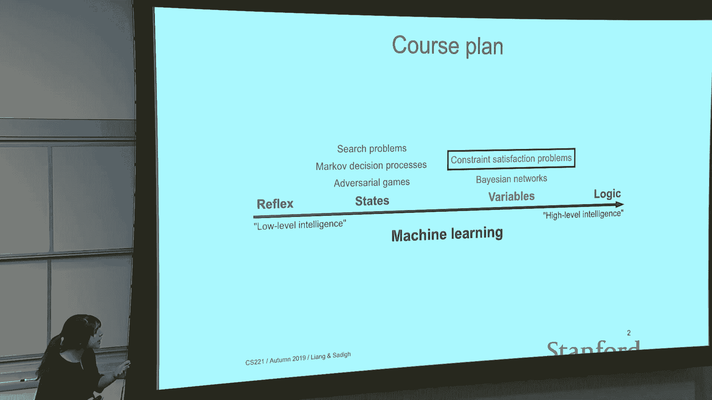

 And then what the plan is to talk about variable based models。 specifically constraint satisfaction problems today and on Wednesday。 And then we are going to talk about Bayesian networks next week。 So we'll have three lectures on Bayesian networks。 So what's gonna happen is。

 Rita is going to talk about the CSP， the second lecture of CSP on Wednesday。 And then Percy is going to be back next week talking about Bayesian networks。 And I will do the third lecture of Bayesian networks。 So。 over the whole mix of us talking about variable based models， you'll see all the views of us。

 So that's a plan， okay？ All right， so， okay， so going back to our paradigm。 So our paradigm is starting with modeling。 So how do we model various types of problems？

 And then how do we develop inference algorithms that try to answer questions we， care about。 objectives we care about based on those models？ And we have been talking about learning a little bit。 So if you have these models and they're not full models， how do we go about learning these models？

 So here is just a review of what we have talked about so far。 In terms of modeling。 we talked about various frameworks like search problems or， MDPs or games。 So these were various frameworks that we had。 And we had different objectives。 So we had things like minimum cost path for search problems。

 Or we care about other things like maximizing the value of policies for， MDPs or games。 So this was kind of something that we talked about。 And in terms of inference。 we discussed tree based algorithms and， we discussed graph based algorithms。 So if you remember backtracking search was the simplest。

 most naive thing we tried out to our search problems。 For games like we looked at minimax and expectemax which was also going down a tree。 And then you can have more graph based type algorithms where you're looking at。 the recurrence relationship。 And examples of that are things like dynamic programming。

 uniform cost search， A star。 In terms of MDPs and games， you looked at value and policy iteration。 And then in terms of learning， we discussed a few types of methods for。 each one of these frameworks。 We looked at structures perceptron， Q learning， TD learning。 So these are some of the topics that we have talked about so far。

 So if you're midway through the quarter， these are all the cool things we have learned， so far。 And these were for state based models。 Okay？ So state based models were kind of cool。 And we had a couple of takeaways from state based models。 So let's just summarize like two main takeaways from state based models。

 One of the key takeaways was that when we were modeling these state based models。 we had local relationships。 So our model would specify these local interactions and。 local relationships that we had between the states。 So for example， if I wanted to go from S to A。 my neighboring state A， then I would think about what would be the cost of going from S to A。

 So I had this local relationship between them。 And the goal was to do inference and。 then inference was more trying to look at a global property。 Can I find the shortest path from some state to some other state in this whole graph？

 So the idea was let's actually model and specify these local relationships。 And then do inference where we find global optimal solutions。 So that was kind of the whole idea of state based models。 And the thing that they used。 the thing that they made， like made them powerful was this concept of a state。

 So let's just summarize what state was。 Well， a state is a summary of all past actions that's sufficient to choose future。 actions optimally。 And that's how we define states that how we went about states。 And once we had state， once we had the notion of a state。 then our mindset was I'm gonna move through these states through actions。

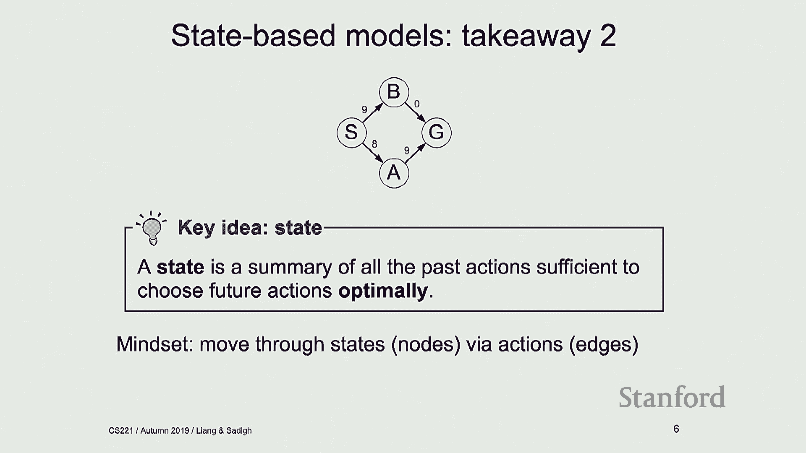

 So I have states that I can think of them as nodes here and。 I have actions where I can think of them as the edges in this graph。 And the question is how do I go through one state to another state？

 And what is the sequence of actions I should take？ So if you think about a policy。 like we were talking about the sequence of actions and， the sequence actually matters， right？

 Like I would take this action and another action and。 the goal is to say for me to go from here to the door and。 I would have a sequence of actions that need to go one after each other for， me to achieve the task。 Okay？ So the type of problems that you wanna talk about today。

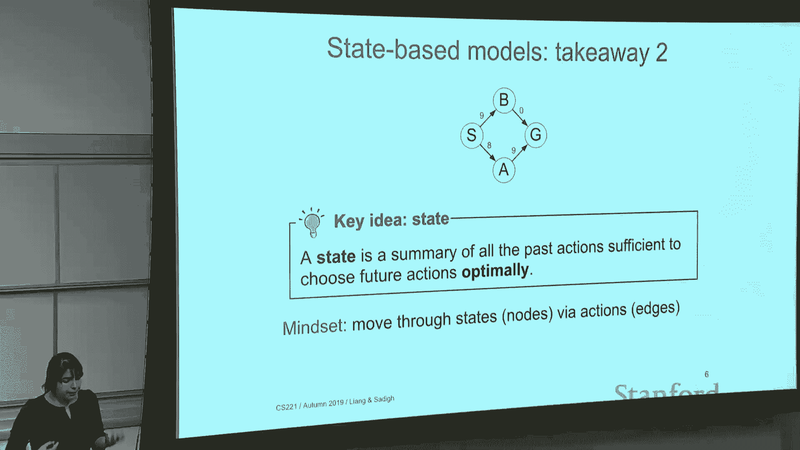

 they have a little bit more structure。 They don't really care about ordering and that's kind of the key difference。 So when I asked that very first question of pick like two countries， one of them。 the name of one of them should start with A， the other one should speak Hungarian and they're not right next to each other。 And the way you think of all those constraints， all the things that you need to satisfy。

 you don't really need to follow specific order。 There are a bunch of constraints and you need to satisfy all of them。 It really doesn't matter to start from where。 And then that's kind of the idea that of a variable based models and。 we're gonna go through this example throughout the lecture。 So the example is it's a map coloring example。 So the idea is。

 let's say we have a map of Australia here。

 And Australia has seven provinces， so these are all the provinces here。 And what we wanna do is we wanna color this map。 So the question is。 how can we color each of these seven provinces with three colors？ I have red， green and blue。 so that no two neighboring provinces have the same color。 So that's a task we wanna do。

 And then kind of the key idea again here is the order of things doesn't matter， right？

 I can pick any of them， I can pick a color and then just go from there。 It doesn't matter like if it matters in the sense of the algorithm side of things。 but in terms of the model it doesn't matter to include that。

 So here for example， this is one possible solution， right？ Like I can have the map of Australia。 I can have these different colors， like red， green and blue for different parts of it， and。 no two neighboring countries have the same color。 So this is one possible solution that we can get。 We can have other solutions to get。 And our goal is to find these types of solutions， right？

 All right， so I can think of this as a search problem。 I can perfectly think of this as a search problem， where let's say I start with a partial solution。 and， my partial solution is somehow I've decided to choose。 I'm just gonna refer to these provinces by their first letters。 So I'm gonna choose WA， V， and T。

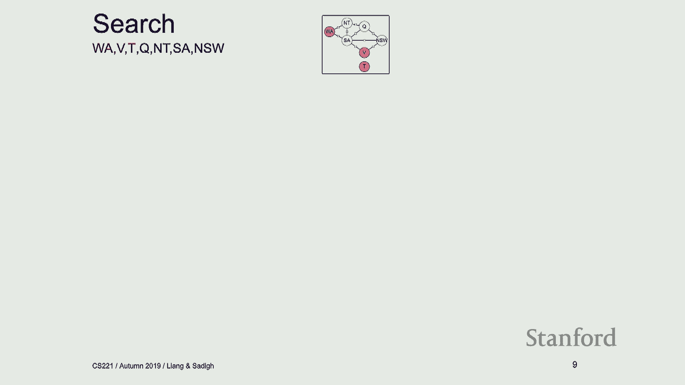

 I'm gonna just make them red。 And now what I wanna do is I wanna figure out what other colors to use for。 the rest of the provinces， okay？ So I can just go down like a search tree。 So my state here is this partial assignment， and， I can go down the search tree。 and I can choose Queensland as my next thing。 And then I'm gonna color that red。

 So if I color that red， everything looks good， everything is great。

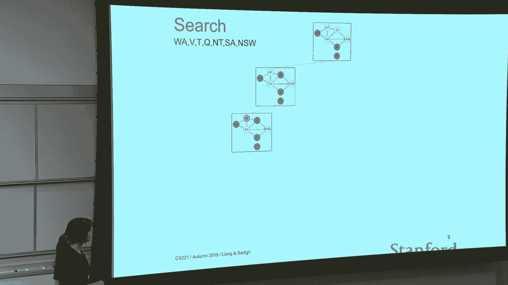

 So now I'm looking at Northland territory， so NT， I'm gonna pick a color。 I'm just gonna color that green， let's say。 So I color that green。 Then if you look at SA。 I only have one option for it， right？ Cuz I've already picked red， and I've already picked green。 And SA is connected to all these red and greens。 So the only color I can pick for SA is blue。

 So that is all I have。 Then how about NSW？ Then that has to be green， right？

 Cuz I've already picked blue right there， so that has to be green。 And here is one solution。 So I just went down a search tree and， picked a solution to this problem。 I could have picked some other solution， like that decision that I made over there to make NT green。 that was kind of random， right？ Like I can just pick blue there， so let me just put blue there。

 And then I can just have another solution， that's a perfectly fine solution。 and I'll have my math calling。 How about I choose a different color for Queens lines？

 So I decided to make it red， maybe I wanna make it blue。 So if I make it blue then NT has to be green， cuz that's the only option I can have。 And then when I get to SW， I don't really have any options for it， right？ SW。 I have no colors for it that would work。 Cuz green is taken， red is taken， blue is taken。

 SW is connected to all three of these。 That's not really gonna work。 How about I choose Queens line to be green？ Same story， NT has to be blue， SW。 I don't really have a solution for it， okay？ Okay， so this was just going through this example。 assuming that it's a search problem。 And I have these states that represent partial assignments。

 and， I'm gonna pick actions and the actions are going to just give a coloring to the next。 to some next variable here， okay？ So the state is partial assignment of colors， to provinces。 And the action I'm gonna take is assign the next on color province to a compatible color。 So I can perfectly think of this problem as a state based。

 like using state based models using this particular state in action。 But the thing is。 there is more structure to the problem。 And the structure in this particular case comes from the fact that。 again， ordering doesn't matter。 So variable ordering does not really affect correctness here。 It's just a bunch of constraints。 It doesn't matter in what order I'm satisfying those constraints。

 And in addition to that， the variables， they're kind of interdependent in a local way。 So for example， if I just look at Tasmania， right here， it's not connected to anything。 so I can just pick whatever color I want for that。 And it's not affecting the rest of my problem。 so I don't really need to have some order， to pick t first or pick t last， right？

 I can just pick a color for t and it doesn't affect the rest of my system， okay？

 So the idea of variable based models is， let's kind of make our models。 let's make our models simpler than state based models。 Let's not try to figure out what is this。 the state thing that's sufficient for， us to make decisions in the future and then pick action sequentially。 Let's try to have an easier language to represent the model of a problem that。

 kind of looks like this。 So the idea is to come up with this new framework and in this new framework。 we're going to have variables as opposed to states。 So we're going to call these things variables and。 we're going to have assignments to these variables。

 So the whole job of modeling is to figure out what the variables are and。 what sort of assignments we are picking for those variables。 And this decision of， well。 what order should I call our things or。

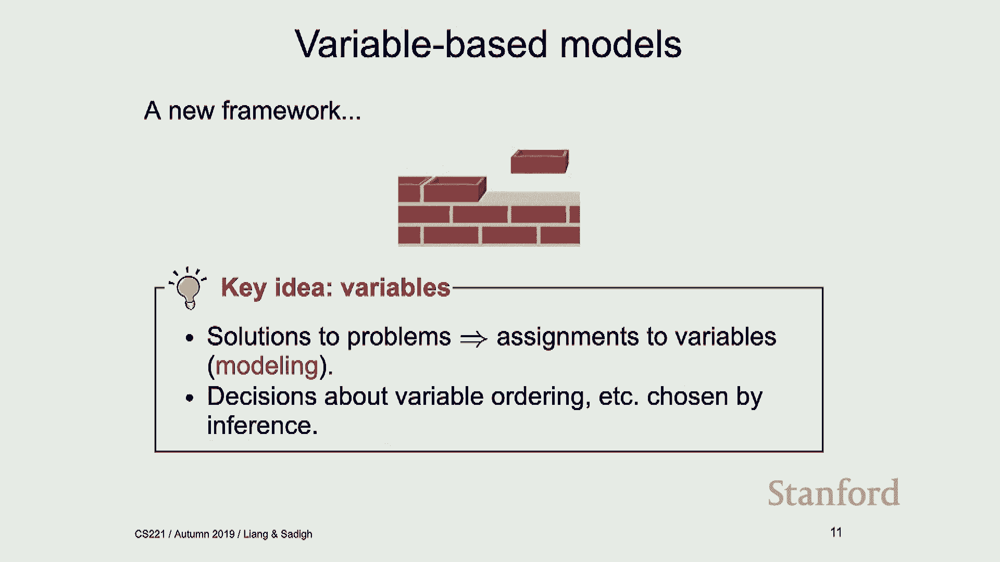

 what value should I pick for each province？ Like that decision of what order values should I pick。 what order variables should I pick， I can push all of that to inference。 So it's not going anywhere。 I'm just pushing it to inference。 So another analogy here is you can think that you have a difficult problem。 and you can have like an ad hoc way of going about and solving it。

 And an analogy in programming languages to that would be。 I would be solving it using a sem boy language。 If you look at state based models。 you come up with the idea of state， you're doing something more general and you're doing a lot of work。 And why are you doing that？ Because you have a higher level abstraction。

 So when you're using something like state based models。 an analogy to that is maybe you're programming in C。 So you're moving the level of abstraction。 And when you're using things like variable based models。 it's even moving the level of abstractions a little bit higher。

 It's even like programming in Python。 So sure， you can do the exact same thing in C too。 But now you have this higher level of abstraction to think about problems。 and that makes your model much simpler。 And the order of things that can become the problem of inference。 All right。

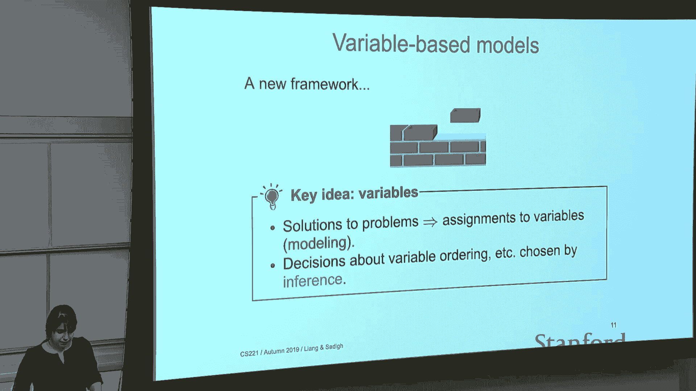

 Everyone happy with why we want to do state based， or we want to do variable based modeling？

 All right。 So I've kind of motivated this， but I haven't really said， what it is。 how we go about solving it。 So what I want to do for the rest of the class is。 I want to start formalizing variable based models， or this idea called factor graphs。 And then after that， I want to talk a little bit about inference。

 in the case of variable based models。 So specifically， I'm going to talk about dynamic ordering and。 consistency as a way as heuristics that allows us to solve these variable based models。 And then towards the end， I just want to show a couple of examples。 other examples of why variable based models are so powerful。

 and where they come in and just give you some ideas of some other examples to look at。 All right。 So that is the plan for today。 So let's start with a simpler example。 So let's say that I have three people， maybe I can draw that here。 So I have three people。 person one， person two， person three。 And each of them， they're going to choose a color。

 either red or blue。

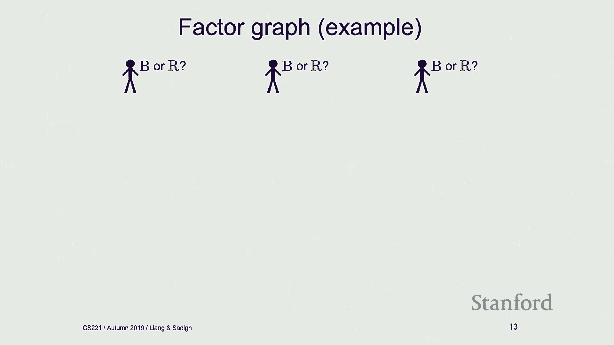

 That's what they're going to do。 Red or blue。 Red。 OK。 And each of them have a set of constraints。 So the idea is maybe this guy really wants to pick blue。 So really wants to pick blue。 Maybe this third person prefers to pick red， but maybe it's not as bad as the sky。 So prefers red。 And maybe we want to make sure that they pick the same thing。

 The first person and the second person。 And maybe we want to ensure that the second person and the third person。 we prefer they pick the same。 They pick the same thing， the same color。 So these are some sort of constraints almost that I'm putting on this example。 And the way that we can think about these constraints that I've just laid down on this。

 picture is using this idea of a factor graph。 So a factor graph is going to have a set of variables。 This is like analog of states， as we talked about in state-based models。 It's going to have a bunch of variables。 I'm going to have three variables。 because this person is going to pick something。 This person is going to pick another color。

 This last person is going to pick a color。 So I'm going to have variables x1， x2， and x3。 OK？

 Let me actually write down some of these。 So we're going to go over a bunch of definitions for the first part of the class at least。 So we're going to talk about factor graphs。

 Factor graphs are going to have some number of variables。

 We're going to represent variables with capital letters， so capital X。 So in that particular example， the variables that I have are x1， x2， and x3。

 OK？ And each one of these variables， they're going to live in some domain。 They're either going to get red or blue。 So each one of these xi's。 they're going to live in some domain。 So we're going to say xi lives in some domain of i。 So in this particular example， the domain is just red and blue。

 So each one of these xi's are going to live in either red or blue。 And if I pick a value for them。 if I， like， comment and say， well， this guy picked red， and this guy picked blue。 and this guy picked red， then I'm giving an assignment。 So that's called an assignment。 So an assignment， I'm going to write it with small x， and it's going to tell me。

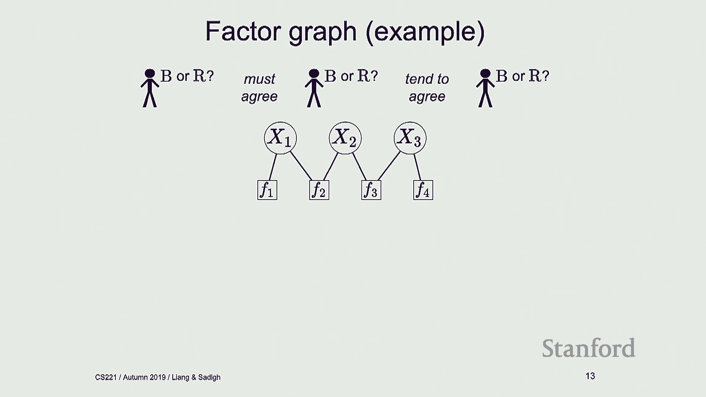

 about what x1 took， and what small means kind of red or blue。

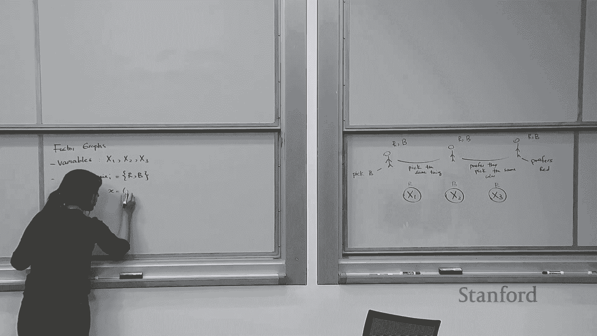

 So capital means the actual variable。 Next two and x3， what were they？

 So maybe for this particular example， maybe we're talking about red and red。 OK？

 So that was variables。 They live in a domain， and then we can pick an assignment。 OK？

 So now I have all these constraints， and I can write those constraints。

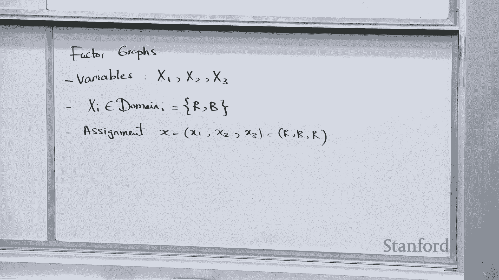

 as something that's called factors。 So these factors are going to be functions that tell me how happy I would be。 if this x1 takes value red or value blue。 So their function， so in this case， f1。 is a function of x1。 So I'm going to write a factor graph needs factors。 Needs factors are fj's。

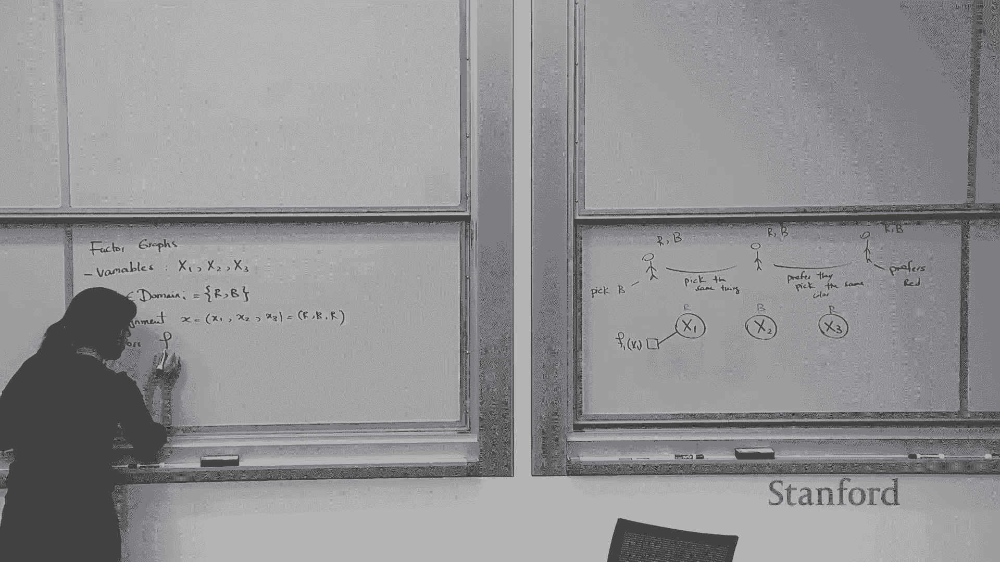

 There are some number of them。 There might be a lot of them。 fj's of sum x taking some value xi。 sum xi taking some value xi， or some number of-- I'm just writing the most general form right now。 And these fj's have to be greater than or equal to 0。 So they're kind of telling me how happy I would be。

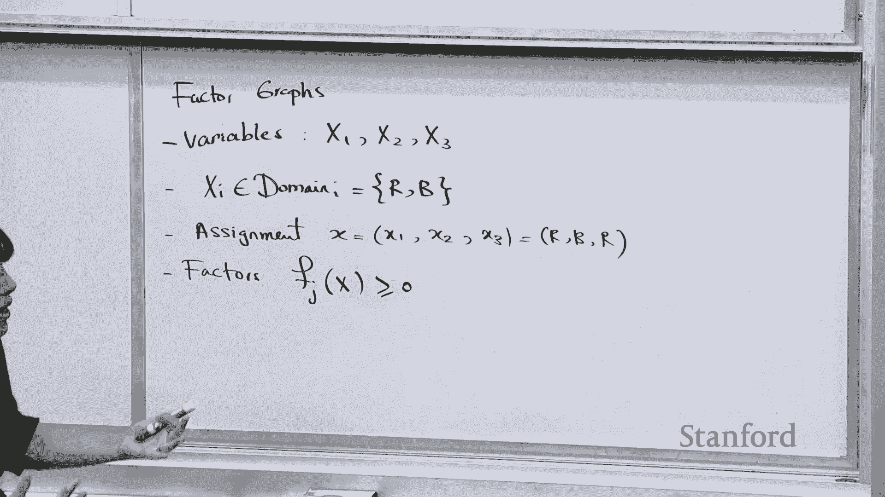

 So here I would have f1 of x1。

 So if I really want this guy to pick blue， then what would be a good factor to put here？

 What should I say for f1 of x1？ So I can write it as an indicator function。 making sure that x1 definitely， takes blue。 Maybe I can write it like this。 So if it is an indicator function， what does it tell me？ If it is an indicator function。 if x1 actually takes blue， then the value of this factor is going to be 1。 If x1 takes red。

 the value is going to be 0。 So I'm kind of treating 0 as this thing that I don't want。 and anything above 0 as something that I actually want to get。 So I'm going to have another constraint。 This constraint is going to be f2。 It's a function of x1 and x2。 That's why it's connected to both of them。

 So I'm going to draw these squares as showing what the factors are。 So the circles are my variables。 And then the squares are my factors， these functions， that kind of tell me what are the constraints。 what are the things， that I need to satisfy。 So f2 is going to somehow encode that they need to pick the same thing。 Again， it can be maybe an indicator function， making sure this is these two are equal to each other。

 And maybe I will have f3。 f3 is going to be a function of x2 and x3。 This ensures that they sometimes pick the same--， or sometimes here kind of means that you。 can have an indicator function。 But maybe if they don't pick the same thing。 you wouldn't be too sad。 So maybe you don't put 0 for that。

 So it would be an indicator function plus some constant。 That's one way of going about it。 And then x3 is going to be prefers red。 So it's going to have a factor that says it prefers red。 All right。 So let's look at the same thing on the slide。 So that's a factor graph。 So I can actually look at the values of the factors。 Maybe f1 of x1， maybe what I want。

 is I want for that to be equal to 1。 If x1 picks blue， I want that to be equal to 0。 If x1 picks red， for the two， they， have to agree for the case that they have to agree。 then I can define it as an indicator function。 Where if they're not equal to each other。 I'm going to get 0， I'm going to be very unhappy。 If they are equal to each other。

 I'm going to get 1。 So I would be happy。 And then for the case that x2 and x3。 needs to kind of be equal to each other， then maybe we can do something like an indicator function。 plus 2。 This means that if they don't pick the same thing， I'll be happy。 But if they pick exactly the same thing， I'm going to be even happier。 So I'm going to get 3。

 And then for the last one similar thing， I prefer the last person to be correct。 So I'm going to give it a value of 2 to that。 And I'm going to give 1 for the case of 2。 So these are my factors。 Only thing that matter is equal to 0 or not。 So good question。 So the question is， does a factor value matter？ Or is it just if it is above 0 or not？ In general。

 it does matter what you are picking。 We are soon going to be talking about a specific case。 of factor graphs， where the 0 and 1 is the only thing that， matters。 So I'm not focusing too much on the exact value。 It's just if you get 0， that's pretty bad。 If you get non-zero， that's good。 So I'm treating them like that。

 Because soon we are going to talk about CSPs， constraint satisfaction problems。 which are just factor graphs， where you have 0s and 1s。 You don't have anything above them。 All right， so let's try to actually write this up。 So here is this environment that you can play with if you want。 Is this visible？ Yeah。 All right。

 so here you can define variables。 So I have variable x1。 It can take value red or blue。 x2 and x3。 similar thing。 They can take values red or blue。 And I have four factors。 So I'm going to write up what those factors are。 Factor f1 depends on x1。 It's a function。 And it's going to return the result of this indicator。 And then similar thing， I'm going。

 to define the second factor also as a function of x1 and x2。 And it returns the value of the indicator， and all these other factors。 And on the right。 you can kind of see these factors being， generated。 So we're going to look at this environment even more。

 next time when we talk about more fancier inference， algorithms。 But for now。 let's move to defining our factor graphs。 All right， so what is the factor graph？ So more formally。 a factor graph has a set of variables， x1 through xn。 And each one of these variables。 each one of these xi's， lies in some domain， in this case the red or blue， was our domain。

 And then the factors are going to be f1 through fm。 We have m of them in this case， let's say。 And each of these factors is just a function over x。 That is going to be greater than or equal to 0。 So that's a factor graph。 It tells us what are the things that we really want。 So let's look at one example here。 So in this particular map coloring example。

 the variables or the provinces that we have， we have seven of them。 The domain is going to be red。 green， and blue。 So those are the colors that we can pick。 And then the factors-- well。 the factors here， are just going to be telling us that don't pick the same color。 for two provinces that are neighbors。 So I'm going to have factors that are indicators。

 ensuring that we don't give the same value to two neighboring， territories。 So we have factors that basically connect every neighboring， territory。 And again。 the square here corresponds， to each one of these functions。 But it's always going to be the same for all variables。 Not necessarily。 So the question is。

 the domain always， the same for all variables。 It depends on the problem， not really。 Also。 we are going to talk about how， to reduce the domain as we go。 So that's another reason that I'm emphasizing on the domain。 Because when we think about the inference algorithm。

 the domain is not going to stay the same throughout。 If I pick red， for example， for W。A。 then Nt。 is not going to have red in its domain anymore。 So the reason I keep bringing up the domain。 is we're going to look at how to update the domain for the inference， algorithm。 OK？ All right。 So this is a factor graph。 Let's define a few more things， just。

 so we have a common language to talk about things。 So we're going to find a scope。 So scope of a factor is a set of variables it depends on。 So it's really simple。 So scope-- so I'm going to write scope here。 Scope。 So it's just set of variables a factor it depends on。 So for example， for this case， if I have F2。

 it depends on two variables， X1 and X2。 So the scope of F2 is just X1 and X2。 So in this other case。 when we looked at the map coloring， example， if we look at F1 as a factor that。 tells us WANNT should not have the same color， the two variables， that are used are WANNT。 So that's the scope。 Then now that we have the scope， we， can define something else called erity。

 which， is the number of variables in the scope。 So each one of these squares， just how many edges。

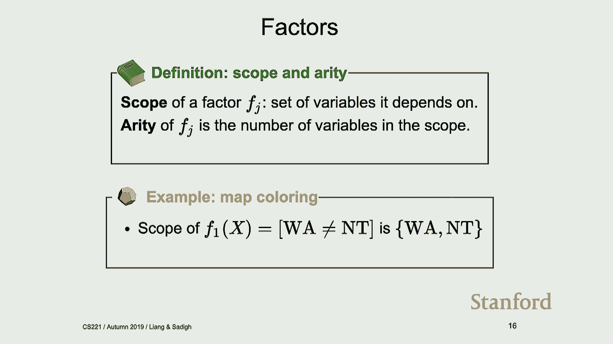

 is it coming out of it？ That's erity。 So in this case， this particular square。 depends on two variables， erity is two。 I can have a setting where maybe I have a factor that。 depends on three variables， then erity is three。 I can have a factor that depends on only one variable。 then erity is one。 And if erity is two， then we call it a binary factor。 If erity is one。

 we call it a factor a unary factor。 So just common language。 So we have erity。

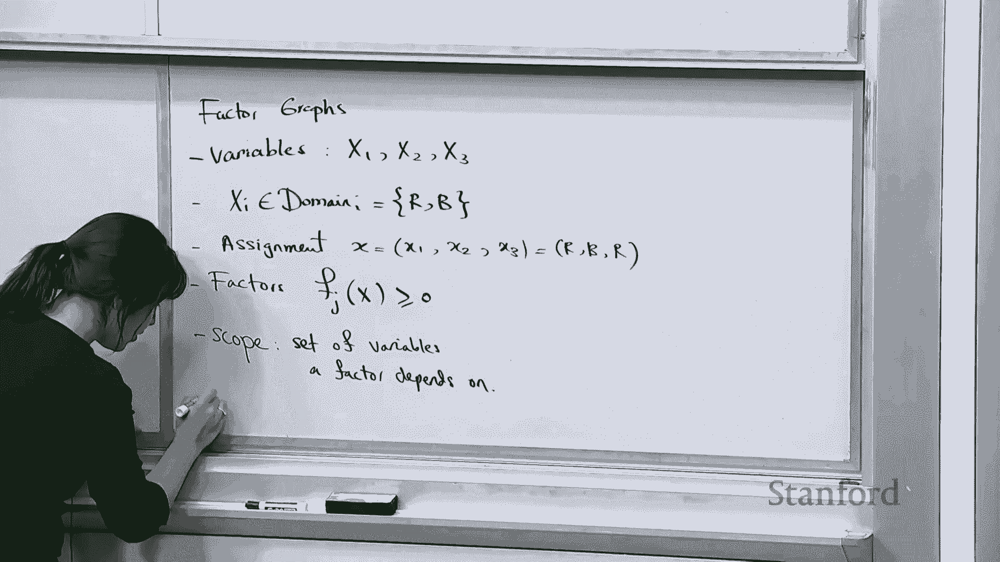

 And then we have-- which is a number of variables in the scope。 And then we have unary， unary。 unary factors。 And erity is one， or binary factors。 And erity is two。 So just defining things。 So for example， in this case of map coloring， F1 is a binary factor。 So in the case of map coloring。 all our factors， were binary if you look at it。 Let me go back to the-- here it is。

 So I have a bunch of factors that just say， these two variables should not be equal to each other。 So I have a bunch of binary factors， and that's pretty much the only thing I have。 In this case。 I have a binary factor。 I have a binary factor。 I have a unary factor。 Unary factor。 All right。 OK。 so so far so good。 So we talked about the assignments。 The assignments are going to be a setting。

 where we give actual values to these variables。 And an assignment can have a weight that tells us。 how good that assignment is。 So remember， a factor tells us how good this particular--。 how happy I would be if x2 takes a value and x3 gets a value。 a weight tells me how happy I would be for the full assignment。 So what it is going to be is。

 like in this case， we can look at a weight to just be a product of my factors。 So I'm going to write--， maybe I'll just write it in front of here。 So I'm going to define a weight of an assignment x。 And the way I'm writing that is I'm just。 going to write it to be a product of fj's j from 1 through m。 So I have n factors。

 So it's going to be fj's of x taking assignment x。 So for this particular example。 we looked at the tables。 And each one of these tables represents our factor。 But now if I talk about the full assignment， then I'm looking at what does-- what， happens if x1。 x2， and x3 take all possible values that they， could be taking。 So I have h possible options here。

 And then I'm looking at a weight as a product of all， of these factors multiplied out by each other。 So remember， I was saying， well， 0 is the thing， that I really don't want to have。 So if I have 0 over--， that's super hard constraint that I'm trying to enforce。 And that makes my weight equal to 0。 So if x1 ever picks red， that was a hard constraint。

 We really wanted the first person to pick blue。

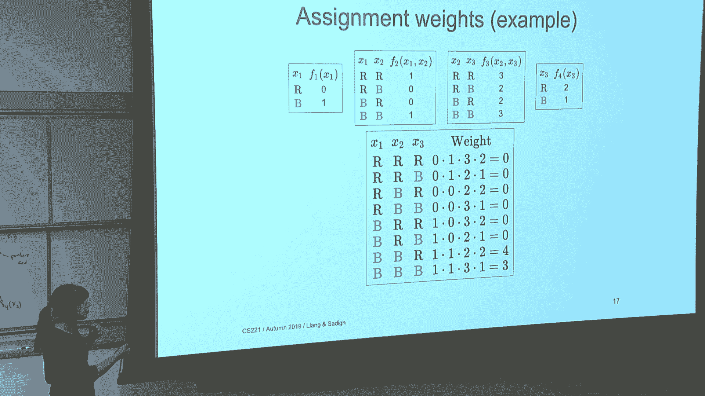

 So if the first person picks red， then the weight is going to be equal to 0。 The other thing we really wanted was the first and second， person to pick exactly the same color。 If they pick different colors， then my second factor， is going to be 0。 Weight of that is equal to 0。 Otherwise， I would have different weights。

 Maybe the thing I care about is to maximize the weight。 So I'll pick the one-- the assignment with the value for。 So going back to this demo environment。 we're just looking at， what we can do， is we can basically-- we've defined our factor graph。 and we can actually step through it。 And we can play with this。

 But you can basically get these two different assignments， that give you non-zero weights。 and you can pick your favorite。 So we're going to talk about various types of algorithm。 that allow you to compute these weights。 All right。 OK。 So weight of an assignment x is just。 the product of the factors of that assignment。 And our objective is to maximize the weight of the assignment。

 So what I want to find is， at the end of the day， what I want to do is I want to find an assignment。 So I want to find that small x that maximizes the weight， of that particular x。 All right。 So going back to the map coloring example。 So here， let's say that we define all these indicator。 factors。 So if it is an indicator factor， I'm either， going to get 0 or 1。

 I'm not going to get anything other than that。 Then if I have this particular assignment， which。 kind of looks right， then the weight of that assignment。 is just going to be a bunch of ones multiplied out by each other。 So I'm just going to get 1。 So if I find a solution to this map coloring problem。

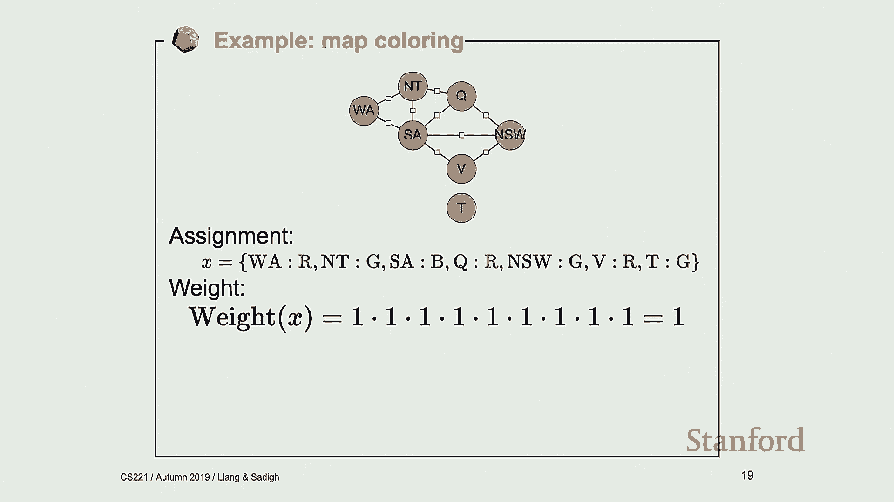

 the weight of that particular assignment is going to be 1。 I could have another assignment where I don't get a good solution。 I have two of these neighboring territories， are going to have the same color。 They're both going to be red。 Then in that case， two of my factors， are going to be 0。

 If they are going to be 0， the weight is going to be equal to 0。 So for this particular map coloring example， where my factors are just indicators。 the only weights I can get are 0 or 1。 I can either get 0 or I can get 1。 If I get 1。 I find a solution。 If I don't get 1， I don't find a solution。 All right。

 So we have been talking about factor graphs， through these more general things。 Now we are going to start talking about CSPs， constraint satisfaction problems， which。 are just factor graphs， where all factors are called constraints。 and the factors are going to take value 0 or 1。 And the constraint is satisfied if the factor takes value 1。

 So we talked about factor graphs。 We're going to talk now about constraint。 I'm just going to write CSP， constraint satisfaction problems， CSPs。 They also have the same variables as before。 And we are going to pick assignments for them。 So same thing。 I'm not an assignment。 But the factors are going to be called constraints。

 And these factors， Fj's of x are either 0 or 1， or not anything else。 And if you find an assignment where your weight is equal to 1。 then that means that you're satisfying all your factors。 And that's called the consistent assignment。 So you have consistency， consistent assignment。

 Sign-- let me write assignment。 That is when the weight is equal to 1。 If the weight is equal to 0。 then we， have an inconsistent assignment。 So it's either 0 or 1。 You have consistent assignments or inconsistent assignments。 So an assignment x is consistent if and only， if the weight of that particular assignment is 1。

 That means all the constraints are satisfied。 Because constraints are just giving me 1 and 0s。 I'm multiplying 1 and 0s。 If anything is not satisfied， then the thing is 0。 All right。 So far。 summary so far is we have， just gone over a bunch of definitions。 Facture graph is the more general case of it。 Constraint satisfaction problems is more of an all or nothing。

 kind of a situation。 So you have heart constraints。 Everything is a heart constraint。 And then you have-- so for example， if you think of math， coloring。 you can think of that as a constraint satisfaction， problem。 because everything is a heart constraint。 You don't want any two neighboring countries。

 to have the same color。 So you're either going to give 1 if that constraint is satisfied。 or you're going to give 0 if that's not satisfied。 You still have variables。 Factors are called constraints。 Assignment weight， if that is equal to 1。 we have consistent assignment。 Otherwise， we have an inconsistent assignment。 [INAUDIBLE]。

 It's a more constraint factor graph。 It is--， Factor graph is this big picture。 CSB is an instant factor graph。 All right。 So that was factor graphs and constraint。 satisfaction problems。 So let's talk about how we go about solving these。 So how should we find an assignment？ Our goal is to find an assignment so we have consistency。

 Because if you are talking about CSBs， you want to get weight 1。 That means you want to have an assignment that's consistent， and makes all my factors 1。 So how do I pick？ How do I pick that？ OK。 So let's look at an example。 Let's just see how we would do it normally， if you wanted to solve this。 If I was solving this。

 I would pick one of these notes or variables。 I would pick wa。 Maybe I would say， well。 let's just pick red。 Let's see how that goes with that。 And then I would go to a neighboring note。 like nc。 And I do have a constraint。 The constraint is wa and nt should not be equal to each other。 So the only thing that tells me is that nt should not be red。 So I'm just going to pick some color。

 Let's just pick green。 So then I'm going to go to some other neighboring note。 So that's sa。 I have two constraints。 The two constraints are is sa should not be equal to wa。 should not be equal to nt。 So it shouldn't be red or it shouldn't be green。 The only option I have is blue。 So I'm going to set that equal to blue。 Then I'm going to go to q。

 The only option I have for q is red， because green and blue are already taken。 Then I'm going to go to nsw。 The only option I have there is green。 I'm going to go to v。 And the only option I have there is red。 And then I can pick whatever color I want for t。 That's kind of a note out there。 So this is a thing that we would probably。

 do if we were to do this。 We would go over these notes with some order。 and we would pick colors in some other order。 And I know that's important。 But the way we would do it is just pick some order。 Maybe we would have some realistic that picks the order。

 and picks the values and tries to make the constraints， satisfied。 So what we want to do is we actually， want to spend a little bit of time talking about doing that。 And having actually heuristics that tells us， what order we should use for the variables。 and what order values we should pick。 So we're going to talk about a few heuristics mainly this time。

 So to do that， we need to define one more thing。 The last thing I'm going to define。 And I did after that talk about the algorithm。 So we're going to define dependent factors。 So a partial assignment is going to be partially， assigning values to variables in this CSP。 So a partial assignment， for example， here could be that wa。

 needs to be red and nt needs to be green。 That's a partial assignment。 Then I can define dependent factors， to be a function of partial assignments， and a new variable xi。 So let me just write that somewhere。 Did y'all write it？ Different color because it's--。 so we have something else called dependent factors。 D of x and xi， where x is partial assignment。

 And xi is a new variable I'm picking。 And dependent factors is going to return a set of factors。 It's going to return a set of factors that depend on x and xi。 So for example。 in this particular case， we said this is a partial assignment。 Let's say I'm asking。 what are the dependent factors， of this partial assignment and sa？ So I'm picking a new variable。

 I'm picking sa。 And I'm saying， what are the dependent factors？

 And then these are going to be the factors that， depend on this new thing， sa， and depend。 on the partial assignment。 So it's going to be this factor and this factor。 I'm going to pick a factor that says， wA is not equal to sa。 And I'm going to pick a factor that tells me， nt is not equal to sa。

 And that's kind of the idea of dependent factors， is that allows me to think about the next thing I should be。 worrying about。 So if you remember， like three search algorithms。 you would look at children of some node。 Here， we are going to look at dependent factors。 because those are the factors。 The next factors we should care about。

 that's why I'm defining this dependent factors。 So now this is the algorithm。 Kind of want to write it up on the board， because it would be good to have it。

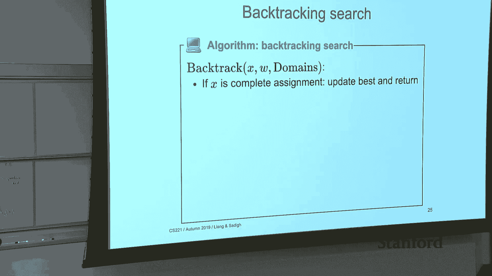

 but it is a little bit of a long pseudocode。 So the algorithm we are going to talk about right now。 is just backtracking search。 It's not doing anything fancy。 We're going to talk about fancier things next time。 But we have backtracking search。 It does the thing that you expect it to do。 So it takes some partial assignment x。

 It takes the weights that we have so far。 And it takes the domains of those variables。 that I have so far。 So if x is a complete assignment， if you've found a complete assignment。 then we are going to update the best thing we have， and we would return。 Or we would do whatever you're supposed， to do for the problem。

 We might have different types of problems here。 Maybe the question is， find one assignment。 If I find one complete assignment， I can just return。 Maybe I'm looking for another question。 which tells me， count all possible assignments that you can have。

 So if I'm counting assignments， then I'm just， going to update my counter and try to find the next assignment。 So depending on what the question is， I might want to do different things。 when I find my complete assignment。 But let's say I find my complete assignment。 then I update and I'm happy。 Then if we're going to choose an assigned variable--。

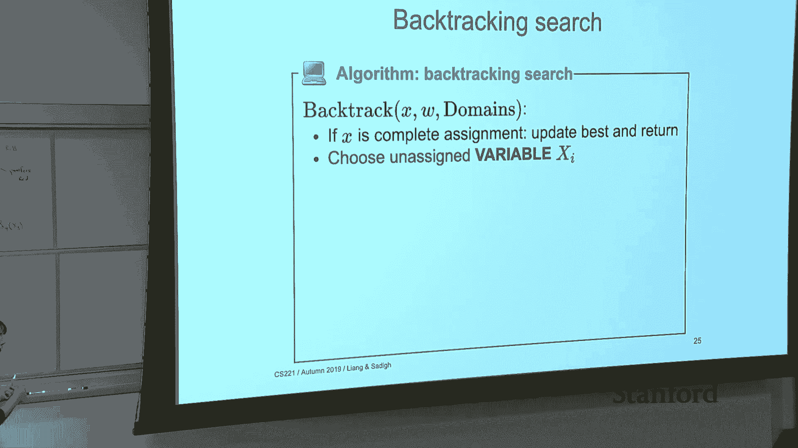

 so I should have written this。 So if x is complete， then let's say we are happy。 Then we are going to choose an assigned variable。 So choose a variable。 Choose an assigned variable。 x and i。 And well， how do I do that？ I'm going to talk about a heuristic to do it。 So we'll talk about that。 But let's say I have some way of figuring out。

 what is the next variable I'm picking。

 And then after you pick the variable， you're going to pick some value for it， right？

 In math coloring， you're going to pick a province， and you're going to say red。 So how do you know it's red？ How do you know the next value you need to pick is red？ Well。 that comes from another heuristic， which， says order values in domain。 So values would be red， blue。 green。 So those are my values， right？ So order the values that are in domain i of chosen xi。

 So you picked it in the next i。 Maybe the only colors that you can use right now are red and blue。 So then you're going to order red and blue using some heuristic， that I haven't talked about yet。 But maybe some heuristics says you should use red first， and then you would use red first。 You'd order it in that domain， in that order。 And then for each of these values in this order--。

 so for each v in this order that you've decided--， you're going to update your weight。 or you're going to have this delta weight value。 And this delta weight value is going。 to be product of your factors。 And these factors are factors of your partial assignment。 whatever you've decided so far。 Maybe you have assigned two colors for two territories already。

 And you're looking at the third one。 So it's going to be the partial assignment， union， whatever。 value you're looking at for this new xi， that you're trying to pick maybe a color for。 And what are these FJs that you're looking at？ Well， these FJs are going to be the FJs。 that are in the dependent factors of the partial assignment， and your variable。

 That's why we defined dependent factors。 Because these are the factors that we care about。 I'm not going to look at Tasmania if I'm not looking， at that part of the graph。 I'm just going to look at the things that， depend on my current partial assignment and my xi。 If delta is equal to 0， return， or continue 0， continue。

 So that means that this assignment you continue。 This means that this is particular value that you've picked。 Just made everything 0。 It didn't work。 So you should try other things。 The other thing you're going to do--， if this value works is you're going to update your domain--。 so we're going to talk about how to do that。 That's the thing that's going to save you time。

 Because you have now found out that you only， need to care about colors red and blue。 And you don't need to worry about green。 So that's updating the domain， making sure。 that you don't need to worry about all the colors。 And then after that， you're just going。 to backtrack on this new thing。 Backtrack on this new thing。 So in this new thing is x union。

 You have picked value v for xi。 So this is your new assignment。 You have extended your assignment by value v。 Your weight is going to be whatever。

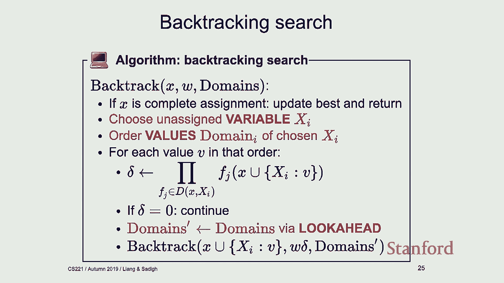

 weight you started times delta。 That's weight delta。 And then you have updated your domain。 So you're just going to use domain prime。 Domain prime。 So this is domains of everyone。 domains of all the other nodes。 All right， so we're going to talk about this a little bit more。 But this is the basic of the algorithm。 So first talk a little bit about updating domain。

 So how do we update domain？ So one very simple way of updating domain。 is this thing that's called forward checking， which says， well， if you pick a color。 so let's say that you pick w to be red， then just look at the neighbors of WA。 and then see if you can update the domains of them。 So this is the simplest thing I can do。

 I've picked WA。 I've decided WA is red。 So the thing that I'm going to do is。 I'm just going to look at the neighbors。 The neighbors are NT and SA。 They cannot be red。 So I'm going to just update their domains， to be blue and green。 I just dropped red。 So that's the simplest thing what we do。 So maybe I'll write it in different color。

 So one option is this forward checking approach， for updating domain。 So let's go further。 So maybe now I'm at NT。 I am deciding NT to be green。 If I'm deciding NT to be green， I'm。 going to look at neighbors of NT。 So I'm going to look at SA and Q。 They cannot be green anymore。 So I'm going to drop green。 I'm going to look at Q for whatever reason。 And Q。

 I'm going to pick blue for Q， because I want to pick blue for Q。 And then I'm going to look at the neighbors。 And my neighbor SA does not have anything in its domain。 So I realized that at this point， like this particular assignment is inconsistent。 I don't need to worry about the rest of the nodes， and what I'm picking for the rest of the nodes。

 It's kind of like a equivalent to pruning。 I don't need to worry about anything else。 because I've just found out that this assignment does not work。 So that's kind of the whole idea of updating domain。 So forward checking is the idea of doing one step look ahead。 So after assigning a variable xi， you。

 want to eliminate inconsistent values from domains of xi's neighbor。 So you want to reduce the domains of xi's neighbors。 And if any domain becomes empty。 then you don't recurse on that。 And then you're going to--。 and something to notice is if you're on a signing xi， you have to restore the domains。

 So because you change the domains， if you're on a signing。 if you're deciding or green was not the color to go， then you've got to update your domains。 All right。 So the other question was the syristic。 So is this syristic updating domain one way to go about it， is forward checking。

 just update the neighbors。 Another place that we need to pick things wisely。 is choosing the unassigned variable。 So which one， which unassigned variable should I start off？

 So which variable to look next？ And again， one heuristic to look at here。 is to pick the variable that's the most constrained variable。 So choose the variable that has the fewest consistent values。 So you're going to pick the one that's the most constrained， variable。 Why do we want to do this？

 Why would I pick the most constrained thing？ Less options。 Yeah， so you're left with less options。 And the idea is if I'm going to fail， let me just fail early。 This is not going to work。 Let me just find out that it's not going to work early。 So that's the whole idea of it。 And in this case， if you're left with this option where， we choose red and green here， and now we。

 want to pick what should I look at next？ I should be looking at SA because that only has one value。 So if that's not going to work， nothing else is going to work。 So we want to choose a variable that。 has the fewest consistent values。 And again， the reason this works is。 if we have some number of constraints in our factor graph。

 So these are more general for factor graphs， too。 Like everything I'm saying is not just about CSPs。 It's about factor graphs。 And then the reason this works is we have some constraints。 We have some of these factors are going to return as 0， because they're going to return as 0。 That is why I would like to follow a heuristic like this。

 because that allows me to not look at everything。 So this heuristic only gives us benefit。 if we have some factors that are constraints。 All right， so that's one heuristic。 The second question is， OK， so now using most constrained， variable， I pick my variable。 What value am I going to pick for it？ And then for value--， actually。

 it's interesting because for value， you want to pick the least constrained value。 So-- and then the reason， again， is you， pick the most constrained variable。 because you wanted to know if you're going to fail， or you wanted to fail early。 But now you've committed to that variable， right？ Now you're going with that variable。

 So you might as well--， you have to assign a value for it。 So you might as well pick the least constrained variable here。 to leave options for the other variables around you。 So an example here is--。 and how can you think about this？ So an example here is you're going。

 to look at this setting where-- what is it？ You're picking Q， right？

 And you want to choose what color to use， what value， to use for Q。 You can color Q red。 If you color Q red， you're going to do this forward checking。 And if you're going to do forward checking， you're going to update the domains。 And when you update the domains， you have two options here， two options here， two options here。

 So that could be a measure of consistency。 So you have six consistent values。 If you decide to use blue for Q， what's going to happen， is you're going to update Nt。 And then that's going to have one value。 Sa is going to have one value。 And Sw is going to have two values。 So you have 1 plus 1 plus 2， and that's。

 equal to four consistent values。 And then you're going to basically。 pick the one that leaves the most options possible。 So you're going to order the values， the colors。 values here refers to colors of selected Xi， by decreasing number of consistent values of neighboring。 variables。 - [INAUDIBLE]， - Yeah， so it's a kind of cardinality， of the domain of neighbors。

 And one other thing is these heuristics， are only going to work if you are doing forward checking。 If you are not updating our domains， they're not going to give us any benefits。 And also another note about this particular heuristic， which， is for ordering the values。 the only place， that this is actually going to give us some benefits。

 is when we are working with CSBs， when we actually， have everything as constraints。 Because if we don't， we actually need， to go through all the values and then figure out。 what the value of the factor is for them。 So this is only going to be beneficial when we have everything。 As constraints。 - Whether we're doing all of this， we're not actually， copying anything， right？

 We're just one class。 We'll find something we're not working on。 - So it is a recurrence。 - Other optimal solutions。 - Yeah， so it depends on what we were doing。 So that's kind of this part。 So the question is are we finding for the optimal solution？ Are we finding for S solution？

 It depends on that kind of this line。 If you find S solution and you're happy with that one solution。 you can just return it here and be happy。 If you want to find the best solution。 and you need to iterate this multiple times， then maybe you have a counter here that still。 keeps iterating。 For CSBs， you want to find a solution。

 because we just want to satisfy the constraints。 But if I have a factor graph， I actually。 want to optimize my weight。 All right。 Yeah， so yeah。 so this idea of this most constrained variable， is we must assign every variable。 So if you're going to fail， let's just fail early。 It's kind of similar to pruning。

 And the idea of what order we are paying for values。 is we're going to pick values with least constrained value。 So。 and kind of the reasoning behind that， is we've got to choose some value。 We have to choose values for all these things。 So to choose a value that's the most likely to lead。

 a solution for everything。 OK， and this is what we just actually said。 OK。 so going back to this algorithm， now we have a heuristic to follow for all these three。 different red lines and doing so。 We're just doing backtracking。 And then we can update this and then just go through it。 And it does find a solution。 All right。

 so now I want to spend a little bit of time， talking about our consistency。 So what our consistency is is just， a fancier way of doing forward checking。 So we talked about a heuristic for this one， a heuristic for this one。 The only algorithm we are talking about today is this。 That's the only thing。 And we said， well。

 in this algorithm， we've got to update the domain。 The way we have been updating the domain。 is just looking at the neighbors and trying， to update the domain using forward checking。 So another idea is to do something slightly better， which， is called arc consistency。 And arc consistency doesn't just look at the neighbors。 It goes through the whole CSP and tries。

 to update the domains of even further nodes ahead of us。 So it doesn't just look at the neighbors。 So that's what this whole section is going to be about， how to do arc consistency。 All right。 So the idea of arc consistency is， let's eliminate the values from domain。 So I have this giant domain。 I don't want to go over all those values。

 I have a for loop here for all the values。 If I can update my domain。 I have less links to it right over。 That's going to be much better。 So let's just try to reduce branching。 So here's an example。 So let's say that I have xi and xi lives in。

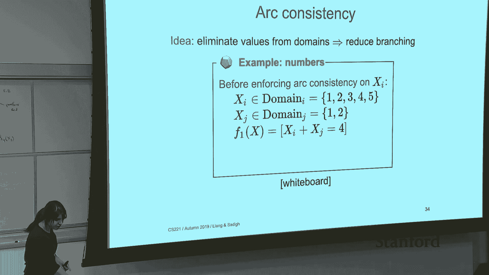

 So I'm looking at xi and xj。 And xi takes value。 The domain of xi is 1， 2， 3， 4， and 5。 And then the domain of xj is 1 and 2。 So now what I want to do is I have a constraint。 The constraint is xi plus xj is equal to 4。 So if this is my current domain of xi。 I don't really need to worry about all these values in xi， because the constraint tells me， well。

 5 never works， because xi plus xj has to be 4。 So that's not going to work。 This one is not going to work。 The only way for things to work is to have 3 plus 1 and 2， plus 2。 And that's it。 So the only variables that I actually。 need to worry about for domains of xi is 2 and 3， not 1， 2， 3， 4。

 So what I want to do is I want to take the domain 1， 2， 3， 4。 and 5 and reduce that to just looking at 1， 3， because those are the only values that I should actually。 care about。 Because this constraint is kind of enforcing that。 So enforcing our consistency basically， tries to get to this smaller domain。 OK。

 So a variable xi-- so let's actually formally define this。 A variable xi is consistent with some variable xj。 If each value xi in the domain of--。 for each value xi in the domain of xi， there exists some xj in the domain of xj。 So the factor is not equal to 0。 So basically， it's ensuring that everything。

 is going to be consistent。 So if you have inconsistencies， remove things， from the domain of xi。 So our consistency ensures that if there， are any sort of inconsistencies between two variables xi and xj's。

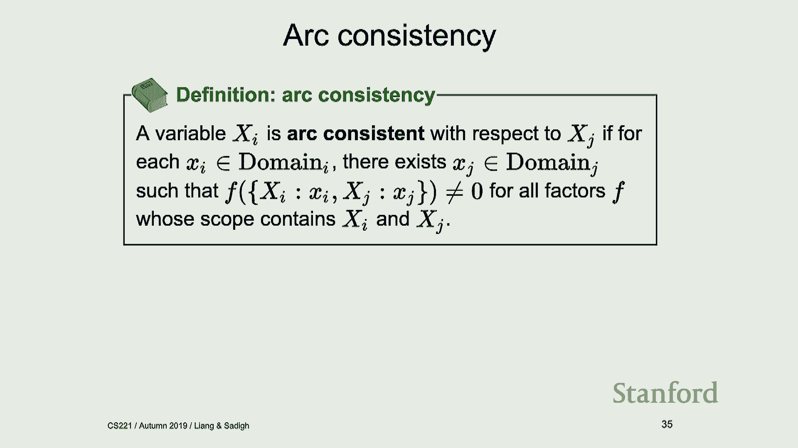

 it's， let's say， star from xi。 And it tries to remove from the domains of xi。 to make sure that all factors are not equal to 0。 So we start from 1。 So we pick x1。 and then we try all these other variables， xj's and values of them。 And then we keep iterating。 We iterate over all of them。 But we've got to pick 1 and update the domains of that。

 So what we're going to do is we're， going to just write up a function， enforcing our consistency。 And it's going to remove values from domain of i， to make xi are consistent with respect to some other xj。 So the only thing I'm touching is domain of xi。 All right。 so let's actually go over an example of how this works。

 And then we are going to look at the pseudocode for it。 So here's our example。 I'm going to start from WA。 I'm going to pick red for it。 So that's my current domain for WA is red。 If I was doing forward checking， what would I do？ I would just look at NTNSA。 I would update the domains of NTNSA。 So now what I'm going to do is I've realized that NTNSA。

 their domains are changed。 So I'm going to push them to the same list of things I have。 And I'm going to look at each of them and see the neighbors of them， too。 So the arcs that come from them。 So I'm going to look at NT。 Well， that is right here。 Actually。 it's too soon。 So everything looks consistent there。 Everything is great。

 I can't update anything more。 I'm going to pick NT now。 Let's say I decide NT is green。 So NT is green。 I'm going to look at neighbors of NT。 So neighbors of NT are WA， WA is red。 Everything is great。 SA has a green。 I need to get rid of that green。 because it can't be green anymore。 Q has a green。 I need to get rid of that。 So let's update that。

 So Q and SA， their domains are touched。 Their domains have changed。 So I actually need to look at them and see， how the domains of their neighbors are going to be affected。 For example， I can look at SA。 And I can see， well， SA is blue。 The only way for SA to be consistent with the rest of these guys。

 is that they don't have a blue in them。 So I'm going to remove blue from Q and SW and V。 because they cannot have blue for these two to be consistent。 Again， SA here is kind of my XI。 So it's actually my XJ。 So I'm going to pick XI Q here。 And I'm going to update the domain of XI。 so it becomes consistent with SA。 So I'm going to pick change the domain of Q， get rid of blue。

 I'm going to change the domain of my NSW， get rid of blue。 I'm going to change the domain of V。 get rid of blue。 So what is updated？ Q is updated， NSW is updated， V is updated。 They're going to go back， and then we're， going to go through them again and see。 if their neighbors need to be updated。 So going back to Q， Q is red， NSW's domain。

 needs to be updated to be consistent with Q。 So I'm going to remove red。 NSW's domain is touched。 So now I've got to go back to V。 V is going to become red， and T can take any value it wants。 So if I do this full enforcing our consistency here。 I'm going to end up with something that looks like here。 So all my domains are kind of pruned。

 and I have just like have a solution。 I don't need to actually iterate over any values。 And this is just done by updating the domains， and then doing this our consistency approach， rather。 than doing backtracking search。 So all of that is done in this step。 OK？ All right。 Yes？

 Solution would be able to go back and make N2 as well。 So if you want to actually--。 so this whole pruning is only useful， right？ If you want to find best solution in a CSP。 But if you have a fat hater graph， and you actually-- if you have fat hater graph。 you need to actually try out all these values， to see what is the value you're going to get for each one。

 of the colors。 If we did forward checking instead。 we actually would have arrived at the same inclusion here， right？ And we just have taken more steps。 like filling more of these different ways。 If you were doing forward checking。 we had to do the-- we actually had to do the algorithm。 We wouldn't get to this much later。

 Because if you were doing forward checking， you would just look at the immediate neighbors。 You'll update the domains。 And then we would go to the next nodes in the neighbors。 and do backtracking search again。 Here， I'm not-- I haven't called back--， I'm here。 I've updated my domain。 And I'm with that scenario。 And I haven't called backtracking search yet。

 All right。 So， yeah。 So forward checking is kind of the simpler version。 We're assigning xj to be equal to xj。 And we're enforcing our consistency。 on all the neighbors of xi with respect to xj。 Our consistency， what it does is it repeatedly--。 well， there are different algorithms that， try to do our consistency。

 The particular algorithm we were talking about， in this class is called AC3。 It's just the most useful， like the most common way， of doing our consistency。 And what it does is it repeatedly， enforce our consistency on all the variables。 So it goes over everything pretty much。 So what it does is you're going to add xj to your set。 Then。

 while set is not empty， you're， going to remove an xk from that set。 And for all neighbors-- let's call them xl of this xk， that you have picked for all the neighbors。 What you're going to do is you're， going to call and enforce our consistency on xl。 with respect to xk。 And then， if your domain is changed， if you change the domain of l， then you're。

 going to add that back in。 And that's kind of what we were doing in this previous example。 We kept adding the nodes back in。 So in terms of complexity of this algorithm， well。 worst case scenario， it's going， to be order of e times d cubed， where e is the number of edges。 And d， let's say， is the maximum number of values， that you can have。

 So the reason it is that is when you're enforcing our consistency。 this line takes order of d squared。 Let's say you have d values。 For each of them。 you have d values。 You need to consider all those combinations。 That's d squared。 You're going over all the edges， right？ So you have all the edges。 So that's ed squared。

 And another thing to notice is you're sometimes， adding these things back in the set。 But why are you adding them？ Because their domains can be changed。 Their domains can be changed at most d times。 So that's the extra d。 So that's order of e d cubed。 If you're interested in it， you can look at the notes for it。 That's worst case scenario。

 In general， it doesn't take that long。 In general， I'm not going to keep adding the same value。 like a million times back in。 Or the same XL back in my set。 In general， it's much faster。 Practice。 It's much faster。 All right。 So again， it's a heuristic。 It's not the best thing in the world。 Ideally， you would have wanted AC3 to not return a solution， if there doesn't exist a solution。

 But here， for example， AC3 is not being very effective。 Here's an example。 So you have these three notes。 And let's say you're left with these domains。 So blue and red。 If you're enforcing our consistency， the domains are not going to change。 These domains are very consistent in each other。 But there is no solution that actually you can find here。

 Because if you choose blue and red here， you don't really have an option for the third one。 So our consistency is actually not， going to be able to figure out that this doesn't work。 And there are more complicated versions of our consistency。 that go beyond these binary relationships。 But they're going to take exponential time。

 So our consistency is simple。 You run it。 It's usually useful。 But it's not going to find everything for you。 Yeah。 OK。 Yeah。 So in the whole intuition of our consistency， is we're looking at this graph in a local manner。 And locally， we are trying to update our domains， to be more efficient。

 But it's not going to give us a global answer。 Of course， it's not going to give us a global answer。 Because if you wanted to have a global answer， we had to consider the relationships of all our constraints。 with respect to each other。 But it's basically making sure that local， at least。 everything looks good。 Let's figure out when you should or should use it。

 When you should-- so in general， I would say use AC3， because it's going to prove things usually。 If you have a lot of dependencies between--， if you have these SQL or type of dependencies。 it's not going to figure everything out。 But it's usually just going to be useful。 So running it-- in practice， it doesn't take that long。

 Running it is usually going to prove part of your domain。 So we recommend using it。 But it's not going to figure out everything， because you have connected-- like everything is connected。 with everything， then you have dependencies， between all your variables。 All right。 OK。 So summary so far is， well， we've been talking， about backtracking search and partial assignment。

 We talked about dynamic ordering， so how to order our variables and how to order our values。 We decided to order our variables based， on the most constrained variable， because if you're。 failing， you want to fail early。 And we decided to order our values， like if I'm picking red， blue。 or green， based， on the least constrained value， because if you have decided， to be the value。

 we should try to succeed。 So that's kind of the intuition behind it。 And look at it。 It's useful for worth checking is one way of doing it。 so it enforces our consistency only on neighbors。 Art consistent-- AC3 enforces our consistency on neighbors。 and their neighbors， and just goes over all the arcs， that we have in the graph。 All right。

 So that was kind of the set of algorithms， I wanted to talk about。 But next time。 we're going to talk about more and friends， and learning type algorithms and source CSP。 So now what I want to do is I want， to spend a little bit of time talking about modeling。 So we've talked about two examples now， right？ The map coloring。

 and this one is also picking colors。 These are the examples you have talked about so far。 So let's look at another example。 So let's say that we have three sculptures， A， B， and C。 and they've got to be exhibited in a museum or in an art， gallery。 And they'll have room 1 and 2。 so they， can be either in room 1 or room 2。 And I'm going to have a set of constraints。

 So maybe my constraints are sculpture， A and B， cannot be in the same room。 Sculpture。 B and C must be in the same room。 And room 2 can only hold one sculpture。 So these are my constraints。 How would I go about this？ Well， I need to write a bunch of factors。 I need to write--， I need to actually model this。

 So let's try to do this。 So this was my domain。 So I have three sculptures。 So I'm going to find variable A。 So that's sculpture A。 It can be in room 1 or 2。 Then I have three sculptures。 So I'm going to have variable B and variable C。 Each one of them。 can be in room 1 or 2。 So now I got to define factors。 I had all these constraints。

 One of the constraints was A and B cannot be in the same room。 So that's a factor。 Let's call that F1。 It's going to depend on A and B。 It cannot-- A and B cannot be in the same room。 What is that factor？ It's a function over A and B。 And that function， is going to return something。 What should it return？ It should return A not being equal to B。 So that's one factor。

 What else do I need？ Let's just make sure that everything is OK here。 So far。 what I've done is I've defined A， B， and C。 They can take values 1 and 2。 I've defined one factor that connects A and B。 I'm going to define another factor， F2。 that's going to connect B and C。 And I really， wanted to sculpt her B and C to be in the same room。

 So these are local variables。 But that's just consistent。 So what I want is B and C to be equal to each other。 So to be in the same room。 So that's factors F2。 Let's just create it here。 And what was the last thing I wanted？ Yeah。 so every room gets one。 Was it every room or was it actually the minimum number？ Second room。 OK。

 second room only gets one。 So that's a factor that depends on all three of them。 It depends on A， B。 and C。 And one way to enforce that， is what I'm going to say is， well， if A is in 2。 or if B is in 2， or if C is in 2。 So I'm going to write indicator functions。 If A is in 2。 B is in 2， C is in 2。 And if I add those up， well， that should be what？

 That should be less than or equal to 1。 Because I don't want to be more than one of them。 in one room。 And this is enforcing that。 So OK， I have this third factor。 This third factor is not a binary factor anymore。 It depends on all three of them。 And then if I step， then we're going， to talk about these algorithms next time。

 But here is the assignment that we're going to find。 So we're going to find that sculpture A is going to be in room， 2， B is going to be in room 1。 C is going to be room 1。 And that satisfies all the factors at the end。 So if you're interested in writing up more models， use this environment， it would be cool。

 So that was another example of CSPs。 So now I want to talk about one more example。 So I think two more examples。 OK， so this is an event scheduling example。 So the event scheduling example is， I have E events。 Let's say these are classes or different courses， that you're taking。

 And then you have T times slots。 So you have E events and T times slots。 OK？

 And you want to schedule a time slot for an event。 That's what your plan is。 So it's a scheduling problem。 And you have one to constraint。 So the first constraint is each event。 must be put in exactly one time slot。 So each event is in exactly one time slot。 One time slot， T。 So that's one constraint。 Another constraint that you want to have。

 is maybe one each time slot T to hold at most one event。 Because we don't want them to overlap。 So each time slot T， you want that can have at most one event。 Most one event。 So this is another constraint。 Most one event。 And maybe I have a set。 Maybe event E is allowed in time slots T only， if event E and time slot T are in some set。

 that someone gave me， some A set。 So I have another constraint that。 ensures that some E with its time slot， is in some predefined big set that someone gave me。 So these are some of the constraints that I have。 And what I want to do is I want to formulate this problem。 as a CSP。 So how would I go about it？ What should be my variables？ What should be my variables？

 Events。 Events。 So you're going to go with events。 OK， so let's say that some can actually。 have multiple formulations for this。 So one formulation， maybe the most natural formulation here。 is to say that my variables are going to be events。 So those are going to be my XEs here。 And every event can take a time slot。 So the value that it's going to get is 1 through T。

 where T is the time-- we have T different time slots。 So then if I start with this。 if I start with a setting， where I'm saying every event is a variable。 then I kind of get this first constraint for free。

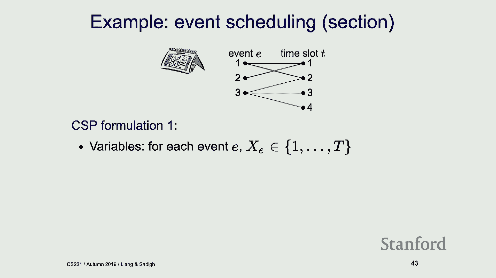

 So each event E is an exactly one time slot。 Because I have my variables E， they're not。 going to get multiple values assigned to them。 They're going to get one assignment。 So if they get one assignment， I kind of already， get this one for free。 The second constraint is this constraint， which makes sure that each time slot can have at most。

 one event。 So to ensure that， then I need to make sure that XE is not， equal to some other XE prime。 Because XE is my variable， my event variable。 It's going to get a time slot value。 The two time slot values for two different events， should not be equal to each other。 So the constraint that I have is XE， is not equal to XE prime。 And how many of these do I have？

 Well， I have order of E squared of them。 Because I have， let's say I have E events。 So then I have E times E options here， to make sure that they're not equal to each other。 So I have E squared binary factors。 So I have another constraint， which。 tries to ensure that these events and their time slots， which， is the XE value。

 is going to be in some set A。 You can kind， of treat this as a unary factor。 So you have some number of unary factors。 You have E unary factors here。 And the number of variables that you have is E。 But their domain is size T。 So it's。 good to think about if you have multiple choices。 So I'm going to talk about the second choice in a second。

 But if you have multiple choices for modeling this。 it's a good idea to think about what type of factors， do you have， how many of them do you have。 So here are the worst case scenarios。 I have E squared binary factors。 So I have another option。 So this option， what I did was I took the events， as my variable。

 The second way to formulate this is to say， well， maybe my variables， are just the time slots。 So maybe I'm going to go a different approach， take a different approach for modeling this。 I'm going to call it YT。 YT are the time slots。 So I have variables for time slots。 Each one of them can either take an event， or maybe there is no event added。 That's empty value。

 So they either take an event or no event。 And if I model this problem using the second approach。 then I get the second one， the second constraint for free。 because my variables are again time slots。 So I can satisfy the second constraint。 And then for the first constraint， I actually need to write something for the first constraint。

 which says each event is in exactly one time slot。 So I'm going to write a constraint that says YT。 This time slot is going to get an event for exactly one T。 So this particular constraint that I have， how many variables does it have？

 If I wanted to be exactly one time slot， remember the sculpture example？

 I wanted it to be exactly in one room。 It needed to depend on everything else。 So this is going to be a T or E constraint。 So I have T variables here。 So previous formulation。 everything goes binary or unary。 Here I have a T or E constraint。 I have less of it。 but I have a T or E constraint。 And then I'm going to have another constraint。

 to just ensure this last constraint。 So one way to think about these two different approaches。 is how many of these constraints do I have？ So we just thought that we have a T or E constraint here。 One thing that you can actually do， and I have a slide afterwards about that。 is if you have some N or E constraints， some T or E constraints。

 some constraint that depends on T number of variables。 I can actually change that to order of T binary constraints。 So I can actually reduce down to binary constraints。 So I can make these two algorithms。 not algorithms， sorry， make these two models to have all binary or unary constraints。

 So that part is fine。 But one of them is going to have， T number， like order of T。 number of factors。 The other one is going to have order of E type factors。 And then the question is。 well， which one should we use？ And it really depends on if your E is greater than T。 or T is greater than E。 So if you have more time slots than events， you've got a lot of time slots。

 and you have like five events， that say that you want your point set。 then you should use the first algorithm。 'Cause that was where we had order of E squared。 number of constraints。 But if you added the other way around， which is again less natural。 but maybe you don't want to， you don't want to， you're okay with。

 not assigning all events to time slots。 So if you have the other way around。 then you can use the second formulation。 So the point of it is you might have different ways。 of formulating a problem。 You should use the one that is the most beneficial， depending on what。 how many constraints you have and then so far。 And then one last thing to， before we head out。

 So I just said， if you have an NRE constraint， we can actually write down binary constraints。 that are equivalent to this。 And the reason is usually our algorithms。 require having binary or unary constraints。 Here I have a setting where I have this OR， between X1。 X2， X3 and X4。 So the way to make this， makes the binary constraint is what we can do。

 is we can define an auxiliary variable。 So I'm gonna define a new variable。 And this new variable。 I'm gonna call these AIs。 And these AIs are going to be just the result。 of the OR of AI minus one or XI。 Okay？

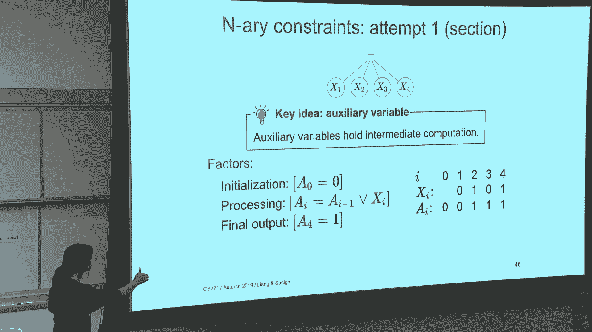

 So what's happening here is， let me just draw this real quick。 So I have a setting， so I had X1， X2。 X3， X4。

 I can have an NRE constraint。

 that connects all of these together to one factor graph。

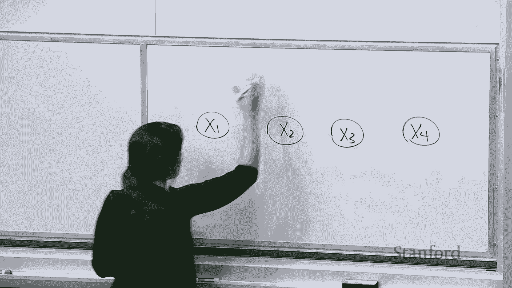

 What I can do is I can actually define new variables。 So I'm defining that many new variables， A2。 A3， A4。 And then I'm ensuring， and I'm defining new factors。 where A1 is the result of these two ORs。 So I'm gonna just draw this like this。 A2 is the result of OR of these two variables。 A3 is the result of OR of these variables and so on。

 This is not binary， right？ What is there？ It's three。 So we need to do one more step。 Like after we're defining these auxiliary variables。

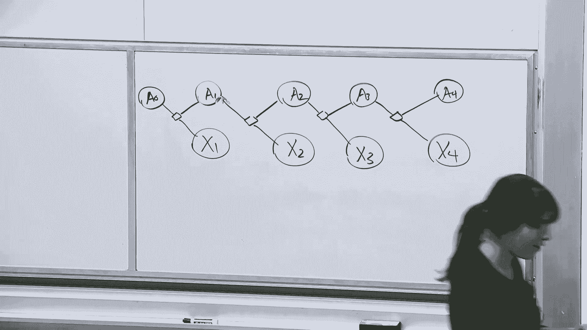

 after that we need to define， we need to do one more step， where we define a new variable B。 which kind of represents AI and AI minus one。 So I'm gonna replace these two with just one variable。 I'm gonna call it B1。 And I'm gonna just connect that to X1。 I'm not gonna draw it。 but get the idea。 So BIs are just going to be representing AI minus one and AI。

 And that allows me to have binary factors here。 And then by doing so。 I'm adding actually one more constraint。 I actually need to add a consistency constraint。 that makes sure BI minus one of two is equal to BI minus BBI of one。 Just ensuring that like pre-end posts， are staying the same as we move it through the graph。

 So that's another enforcement。

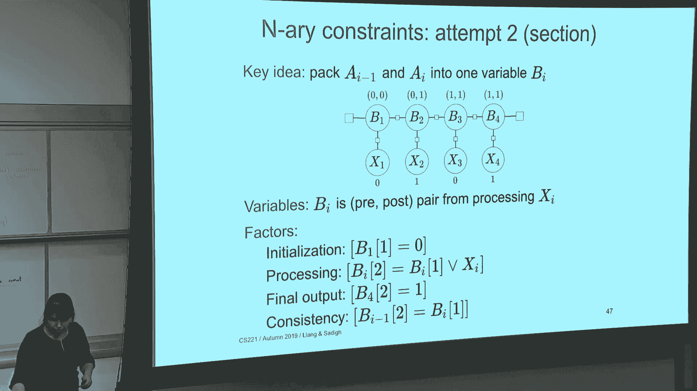

 All right， let's chat next time about this more。 Thanks for watching。 (upbeat music)， [BLANK_AUDIO]。

