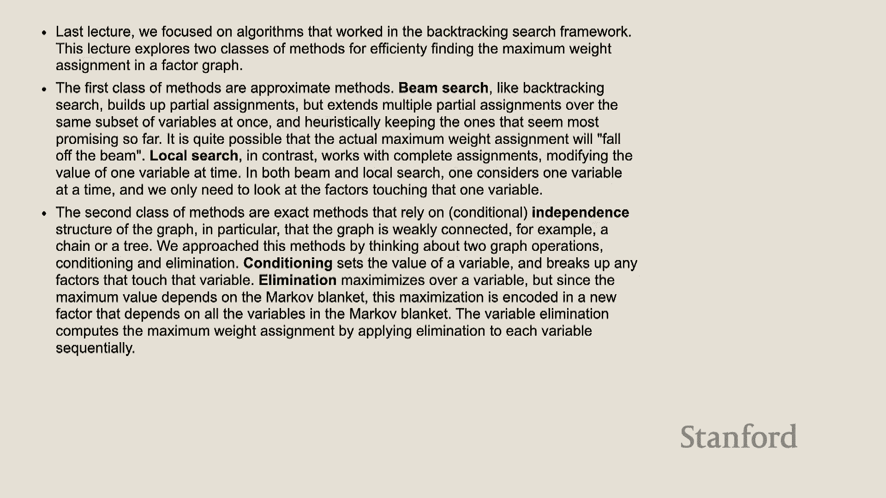

# P12：Lecture 12 Factor Graphs 2 - Conditional Independence - 鬼谷良师 - BV16E411J7AQ

 Today we're going to be coming to CSPs， but possibly just as importantly you're all halfway。

 through the quarter。 So congratulations。 I think six more weeks to go。 So keep it up。 Also happy Halloween。 Hope you all have fun。 But today we're going to be talking about CSPs。 So this is continuing these topics that we've been covering since Monday， which is about this。 kind of setting。 So you have variables。 In this case we have three， x1， x2， and x3。

 And each variable represents some kind of discrete object that can take on one of several values。 And so the set of values that a single variable can take on is called its domain。 And just to continue reviewing， these variables have factors which are functions that take。 as arguments one or more variable。 And the factors basically say， okay。

 how much do I like this assignment of my variables？ So for example， factor two looks at x1 and x2。 And it says， okay， x1 has been assigned some value。 x2 has been assigned some value。 How much do I like that assignment？ Do I really like it？ If so you give it a high value。 Do I not like it？ If so you zero it out。 And so importantly we call the arguments。

 So all the variables that we give to a factor， that's the scope of that factor。 So we have this example that we talked about on Monday and I'm just going to revisit it。 So in this case we have variables correspond to people and there's three people。 And we know that first of all， the first two people， person one and person two， they have。

 to agree to each other。 And then person two and person three。 they sometimes agree with each other but not all， the time。 And so first what we say is with our first factor we say that person one is definitely， blue。 So we say this here by saying these are the values that the variable can take on red or， blue。

 And this is how much we like that value。 And what this first factor is saying is that it doesn't like red at all。 it's zero and， it likes blue， it's a one。 And then we have the second factor。 this encodes the fact that they must agree。 And what that's saying is that every time both the first variable which is X one and。 the second variable which is X two， every time they agree， they're both red or both blue。

 we give it a one。 Otherwise we give it a zero。 And then we have this factor which says that they tend to agree and we're encoding that。 by saying well if both of its arguments are the same， if they're both red or they're both， blue。 then we give it a slightly higher number than if they differ。 But we're not going to zero it out。 And then last we say okay， well the last person kind of prefers to go red but you know。

 it's not a hard constraint， nothing like that。 And so then again so like we talked about last time。 assignments which is like if you， have all your variables and you have all the values that you've assigned to them。 they， have what's called a weight。 And a weight is basically just plugging in all the values for your variables into your。 factors and then multiplying them all up to get that product。 And that's the weight。

 And our goal across all of these problems in this whole unit is to find assignments for。 all of our variables that'll give us the maximum weight when we multiply up all of our factors。 Yeah。 Is there any particular reason why this product is a closer sum？

 Yeah so the question was why is the weight a product and not a sum？

 And the answer for that is because remember these are constraint satisfaction problems。 And so if you look back at this example we wanted to encode the constraint that they must。 agree and we did that by putting it as zero and since we're multiplying it up if you have。 a single factor that gives a zero it's like a veto。

 And so that veto power is actually really critical and we leveraged it on Monday which。 I'll talk about soon。 So on Monday we talked about one algorithm for solving these kinds of problems。 We called it backtracking search and it's a kind of an exhaustive， you could think of。 it as like a depth first search of all the possibilities。

 So we have this example from last week where we were coloring provinces in Australia。 So we have。 I actually don't know the provinces of Australia but we have WA and we have V and， we have T。 I think T is Tanzania， Tasmania。 I'll work on my geography but we color them all red。 And so what we decided to do was we decided to hey we'll color Q red， let's do it。

 And then we say hey if we color Q red let's go with green here for NT and then we pick。 blue for SA and then green for NSW and we've completed that tree。 We've gone as far as we can and we've found a coloring that works。 We say oh wait what if we backtrack up to this point and try to sub in blue in for NT instead。

 of green which is what we had before。 And then we can do the same thing we go down that branch of the tree or we can try different。 colors for Q so for example what if we try Q over here we take that tree down。 Oh but that gives us something that is not to have a size 5 all。 So for example here in SA no matter what color we give it according to our factors which。

 say like you can't have two neighboring colors it would be not allowed。 And you fill out the tree this way。 And so this is the algorithm we covered and it works because it always gives you a good。 version but it's not working because it's super slow。 It's exponential time。 So there's N nodes and each node has a domain and so it's like for each value of here I。

 can draw it out。 So like for example if we had two variables X1 and X2 and they both took on three values。 So these are our variables and these are the values they can take on and these are how。 much our factors like them。 Then you would have to say for each value and X1 for each value and X2 so it's this exponential。 blow up which is just very slow。 And so we learned some kind of like heuristic ways to speed things up and prune on that tree。

 so we did forward checking which is where like once you decide my value for one variable。 I'm going to go ahead and propagate that decision as far as I can。 That shrunk it a little bit we looked at dynamic ordering which is like okay which variable。 and I'm going to choose to work next。 And then once I've chosen that variable I'm going to choose my value a little more intelligently。

 I'm going to pick the thing that has the least wiggle room because maybe that'll help us one。 second and that helped us a little bit。 At the end of the day these constraints they helped us prune the tree but they can only。 work for constraints only if a factor gives us a value of zero does it work。 Because that's when it has veto power and we use the vetoes to say this branch of the。

 tree will never be useful so we can never go down it。 So if we have factors that are going to be non-zero we can't use any of these things。 Yeah？

 More on the example how you got the numbers so for one variable there's only one and then。 I guess it's two to the n minus one。 Yeah so for this I guess this example it would look like as a graph I guess it wasn't the。 best example but and actually later in lecture today we're going to talk about exactly how。 you could go about this more smartly but let's say you just had two variables they had unary。

 factors if you were running binary like backtracking search we would still say we would try all。 different combinations of both variables which is a very dumb thing to do。 Yes so that's backtracking search。 Interesting。 Yeah so we'll discover smarter ways to get around that。 Yeah so that's backtracking slow but it gives you the optimal solution every time so maybe。

 a mixed back。 Okay so I'm going to lead into this is a running example that we're going to be talking about。 the whole lecture object tracking。 So with object tracking you have sensors that are selling you like oh my object is here no。 it's down here oh wait it's over here and what you want to do is you want to take that noisy。 observation and run it through your CSP to infer a more realistic estimate for where。

 the object actually is。 So I will also draw this on the board。 So what this looks like is if we have this is time so we'll call it T for time and this。 is position so we'll call it P for position and what this is going to say is we have sensors。 that are giving us estimates like noisy estimates for where this thing is at every point in， time。

 So we'll call it a simple maybe at time step one we get an observation down here at time。 step two it's up here and at time step three it's up here but in reality like we want maybe。 something more like that and so that's going to be our goal with this running example。 So this is how we code it into a factor graph in this case we have variables where the variable。

 is our guess for the real location for that object。 We have two kinds of factors we have unary observation factors that say how close is our。 guess to the observation to what our sensor said and then we have transition factors which。 basically tell us you can't change your guess by too much from time step to time step。

 So on this graph what it would look like is if these are our observations this is like， 01。 02 and 03 then maybe our first guess would be here so we have X1 down here we have X2。 down here and then maybe like X3 up here and so our observation factors is going to look。 at this distance and that what this is going to say is okay how far is our estimate from。

 the observation and they want that to be close and then our transition factors are going to。 look at this distance between one guess and the next guess and say well our guesses shouldn't。 be moving too much。 So the observation is what the sensor gives us and the estimate is us saying thank you。 for the thank you sensor now I think the person is actually right here because the sensor is。

 noisy we can't trust it yeah。 Okay so that's how we're going to set up this problem and I think so there's and there's。 this really cool kind of like Java applet that you can all play around with on your own time。 I will briefly walk you through it so what's going on here is basically so there's a lot。 of documentation that you can read but basically what's happening here is we're just creating。

 these variables we have three variables and we're allowing them to go in three positions。 so in position 0， 1 or 2 and then this is a little function that's basically encoding the。 fact that if things are nearby then we want it then we like that so we have two variables。 A and B and if they're in the same position then we return to we really like that if they're。

 only one away from each other we return one so it's okay we'll take it and if they're。 farther away than one from each other then it's we zero it out that's a hard constraint。 we don't like that and then we have this observed function which is kind of a higher level thing。 and it kind of I guess you could say it kind of like preloads our nearby function with a。

 variable we're going to create our factors and then this is what it looks like so we have。 three variables we have x1， x2， and x3 and then we have our observation factors are unary。 remember that say okay you have to be close to the sensor and then our transition factors。 are binary and that says you can't move too much between time steps and you can run it。

 and there's actually a lot of output here and I'm going to ignore most of this for now。 I think the thing that is important here is that we ran backtracking search and we found。 the optimal assignment so in this case it's 1 for x1， 2 for x2 and 3 for x3 which goes。 a final weight of 8 so on our little drawing basically what that's saying is it's saying。

 something like this is optimal where we put a we say thank you sensor for these estimates。 but we think the person is actually here at time step one here at 2 and here at 3 that's。 the solution that backtracking gave us yeah。 2 and 2 so those are the weights or the time steps because you're saying it's like 1 then。 2 so x1， 1 it's a time step 1 and then x2 is time step 2 but x3 is also time step 2。

 Yeah so the question was what do you mean by here at 3 and what I mean is basically so， xi。 xi is our estimate for the position of this object and so at time step 3 our estimate。 for the position is at position 2 and yep so x2 and x3 so that's why there's x is at。 2 for both time these is like time step 1， 2 and 3 yeah yeah。

 So I understand like what you're talking about with the scope of the factors but how exactly。 is there a constraint being imposed by the problem？

 Yeah so the constraint here is so the fact that if we look at our nearby function and。 if a and b are farther than 1 away from each other then it returns 0 and that's a constraint。 because when we're calculating the weight of a factor graph we multiply together all。 the factors and so if there's a 0 in there then the whole weight goes to 0。

 Yep yeah you can say that yeah。 Great okay so that's our setup and we're going to be returning。 to that a few times。 Awesome。 Okay so moving on， backtracking search very slow let's try to speed it up beam search。 faster yay beam search so backtracking search if we have that tree analogy right and backtracking。 search exhaustively searches the entire tree gets us the solution but it's very slow。

 And so one way to avoid this kind of like exhaustive search is greedy search which is。 where you greedily it's like for each variable you greedily select the value that gives it。 the highest weight。 So it's right here you look at the values you can take on and you just choose whatever。 variable whatever value is best and you never look back you just keep on running through。

 it and you go through the whole tree this way until you end up at a complete solution。 So the benefits is it's very fast right it's linear but the con is that it's a very narrow。 window like you don't see a lot of the state space you don't explore a lot and so you can。 often miss the global max。 So for people who prefer this kind of notation what we're doing is we basically say we loop。

 through all the variables and we try out every value and we just take whatever value has the。 highest weight。 Yeah so beam search is kind of like an in between backtracking and greedy。 Bean search is very cool so one way to think yeah yeah so the question was explain a greedy。 again and so with greedy what we're doing is we say so we have a partial assignment right。

 and we want to extend our partial assignment so we pick a new variable and we try out every。 single value that that variable can take on and then we take the value that gives it the。 highest weight so all the factors touching that variable are the most happy with that， value。 And we pick that and then we never look back and then we pick a new variable。

 Yeah so that's a good observation we can end up at inconsistent solutions and that's， totally true。 So you can actually during a greedy search you can actually kind of like find your way。 in kind of a hole where it's like oh damn you know I can't go any further and it's a。 big problem with greedy search yeah so with backtracking beam search is kind of like a。

 heuristic way to maybe get around that so with beam search so remember again in so for。 greedy search we had one partial assignment right and we were choosing one variable and。 choosing the extension of that one variable with beam search what you do is instead of。 one partial assignment you maintain a list of k partial assignments in this case k is。

 four and then what you do is on every step is for each of your partial assignments you。 pick a new variable you try out all the ones and then what you do is you so you have your。 k partial assignments and you try to extend every partial assignment you test out all the。 values for every partial assignment and then you sort those partial assignments based on。

 their weight and then you just take the top k so it's like you have your partial assignments。 you extend them into all the possible successors you sort them based on weight and then you。 take the top k so in this case if we have four partial assignments then we try extending。 them all in the two directions they can go and then we sorted them and then we took the。

 four you can see those four things that are filled in that have the highest weight and。 we continue this procedure so we say so what we would do in this case is we would say okay。 for each of these four solid things we're going to try out we're going to extending。 each of those partial assignments and then we sort all the extensions and select the。

 top k so yeah exactly so the question was up to the part k right and the quite and answers。 yes yeah so for example here for example one is less than case we extend to two still。 less than k so we can extend completely so in notation yeah so we say for each variable。 we try to extend each of our partial assignments and then we prune out everything but the k。

 largest best k weights so beam search is also not guaranteed to find the best weight but。 what's cool about it is that it gives you kind of like a knob that you can control between。 being greedy and exploring a lot so k is very wide then you explore more and more of the。 tree and if k is actually infinity I think this is on a slide soon yeah so if k is infinity。

 then that's actually like akin to a breadth first search of the entire tree yeah on that。 graph or on the picture where you had like the solid in the shade about once yeah for。 the shaded out gray ones we would actually never explore those yeah so so this picture。 I don't think it's the best picture because so for example okay so I'm looking like I'm。

 looking right here and in reality you would never extend this because it was never selected。 yeah so up here so at this point we do consider it because we extend down but then we decided。 not to select it yeah awesome run time so， for okay so for beam search you're selecting a single node and then for each partial assignment。 you're trying out every value in the domain so if b is the size of your domains then you're。

 trying out b things for every partial assignment and you have k partial assignments right so。 those are the number of extensions you have is kb and then to you sort them and to sort。 it take if you have a list of like n sorting is n log n and so you sort your list of kb。 so that becomes kb log kb and then there's n nodes that you need to the height of this。

 tree is n so you do this n times so like I said beam search of the k gives you this really。 cool knob between do you want to explore everything or do you want to focus in on you。 know being fast and greedy okay so everything until now what we've covered is is extending。 partial assignments so we have we're giving like a blank slate picture of australia with。

 no colors and we say color me australia like build up this house from the foundations and。 now we're going to talk about is okay given like a map of australia that's already filled。 with covers colors how do we make changes to it in order to improve it that's local search。 so the first algorithm is called iterated conditional modes icm and what icm is doing。

 is it says okay we pick one variable and then we ask what is a new setting that we can choose。 this variable that would improve the overall weight so in this case we have one variable。 it's x2 and we try out all the different values it can take on which is 0 1 or 2 and then for。 each of those values we go through and recompute the weight and then we pick whatever value。

 is best so we started with 0 0 1 and here it looks like one is a better choice so we。 go with it and and from this now on we would say x2 is equal to 1 so something cool about。 icm is that when you're evaluating a new value for a variable you only need to consider factors。 that touch that variable that's all you really need to recompute because everything else is。

 constant with respect to it and so that gives you big big big time savings in practice one。 last thing is so the name iterated conditional made so iterated comes to the fact that you。 could solve the whole csp this way if you just iterate over which variable you're selecting。 conditional means that once you select a variable you're clamping down the values of everything。

 else and then modes is saying once you select your variable you try out every single value。 for that variable yeah so the question is if you kept so if you have your three variables。 you keep on going through them and and choosing one clamping the others and then choosing the。 best value for it would you rather than also solution and the answer is no so and we'll。

 see that in practice yeah yeah so again this this is just to give you the notion that we。 iterate through these variables and for each variable we pick a weight that improves it。 so we have this in the demo so in this case what's going on here is we're saying okay。 right now we've selected we're looking at x1 we start with a random initialization we。

 start we're looking at x1 and and these the different values that x1 could take on and。 then we go through and calculate the weight and we say okay one is the best weight for。 x1 right here so we choose one to be x1 and we step again we're looking at x2 now and。 oh it looks like actually a value of one is better for x2 and so from now on we choose。

 the value of one for x2 and we iterate again now we're looking at x3 and it looks like we。 choose the value of one and you just keep on iterating for this until you hit some kind。 of local optimum and what I'm saying this is important that it's a local optimum because。 right now it's converged so I can keep on pressing step and it's not going to change。

 but the weight is for it and if you remember during the other thing when we ran backtracking。 we actually found an assignment with a weight of eight so it does it can fall into these。 local optimum one way around this is a second algorithm called Gibbs sampling with Gibbs。 sampling what we do is we inject some randomness into the process to try to like bump us out。

 bump us out of those local optimum into something that can maybe get us into a better area so。 basically Gibbs sampling is super similar to ICM the only difference is that instead。 of so you you try out all the values and instead of selecting the value that gives you the。 biggest weight you sample the value according with probability that's proportional to its。

 weight so for this example we say setting of zero would give us one value of one would。 give us weight of two value two would give us a weight of two and then to get the probabilities。 we take the weight and we sum but we divide by the total which would in this case would。 be five we sum them all up and divide by that that gives us a probably point two so here。

 we say it's two divided by five which is one plus two plus two and then we use that probability。 distribution to sample a new value for x two instead of just choosing it's like oh you're。 the best so this is the demo so in this case we're looking at x one and we're trying out。 different probabilities for it and we have weights and then that gives us a probability。

 distribution and we sample from this probability distribution so in this case it looks like。 we sampled and we chose zero for x one and then we keep a record of how many times we've。 ended up with a certain assignment so if we step again now we're looking at x two it。 looks like x one a value of one is the only thing that works so we choose that value and。

 we add it to the counts and you can just keep on running this process and over time you。 build up this kind of like probability distribution so this is actually an unlikely sample so。 I had a point it had 20% chance of choosing one and 80% chance of choosing two but it。 still shows one and that's a way that it can kind of like break out of these local optimums。

 but in any case if you look at this table then what you find is that over time if you run。 this thousands millions of times then in practice settings with very high weights will occur。 very often and actually when we get into probability graphical models which Percy will talk about。 soon you could actually say that the global optimum will be the most frequent in Gibbs。

 sampling in the limit which is I think pretty cool。 Yeah okay so just to show an example of what can go wrong with this algorithm it's still。 a lot so if we have x one we have x two and let's say let's say it's two people and they're。 trying to decide where to go to dinner so we could have let's say they're deciding between。

 vegetarian and going to a steakhouse so we have V for vegetarian and S for steakhouse。 and they really both want to go to vegetarian and they want to eat together and they'll。 eat steak but they're not super crazy about it so if you're in this state then even if。 you're doing Gibbs sampling it's really hard to bounce over here because you have these。

 two kind of like transitionary settings in between and in order to make it to both vegetarian。 they're going to have one is going to have to make the decision to go to a different。 restaurant and so since this is so low priority it's going to be very difficult for these。 two people to go over to vegetarian they're both kind of like oh I want to do what you。

 want to do you want to do steakhouse right I want to eat together you want to eat together。 let's do steakhouse then and they they both don't really know that they would be much。 happier overall if they both eat vegetarian and then this this would really be even worse。 if if you had so for example if you had like zeros here then there's actually no way for。

 them to get there because there's no probability there yeah。 Very visualisation like centric like whatever you pick as your initialisation is going to。 be very important because if you initialise to the state where they're both vegetarian。 then you never want to leave and you'd be happy never leaving but if you initialise to。

 both steak then you're in trouble。 Yes yes so in general in optimisation in any kind of optimization area where you can have。 this problem of falling into some kind of local optimum that's worse than the global。 optimum it's very dependent on your initialisation yeah because if you initialise over here then。 you would fall somewhere lower just by chance yeah。

 What would be your visualise like Sb or Vs where you initialised to a state where it was。 zero would you have an equal chance for a new one？

 So the question was what if you initialised into a state that had zero probability？

 So what you would do is you would select a variable you would select S1 and then you would。 try out different values for this you would say okay I'm going to either choose S or V。 holding X2 constant and in that case transitioning to V would have a probability of one so you。 would do that almost deterministically。 So for Gibbs sampling these are probabilities you turn them into probabilities yeah yeah。

 So just to clarify Gibbs sampling is not guaranteed to find the best assignment。 It is not guaranteed yeah but you mentioned something like in the limit it is。 Yes but that's not like a that's kind of a theoretical point it's not really practical。 yeah it's so in the limit doesn't mean like a guarantee I guess。

 Yeah I guess you could interpret it that way。 So I guess this is directly about your question so if you were to compare these questions which。 ones are guaranteed to give you the maximum rate of assignment and the only one is backtracking。 search because greedy is too narrow beam search is maybe too narrow。 ICM is too myopic and Gibbs sampling is you it's not a guarantee it's likely but it's。

 not guaranteed yeah。 How is it？ How is it？ It's not guaranteed。 Sorry can you say it again？

 For this example even if the limit it won't converge。 Yeah so the question was in this example even in the limit you wouldn't converge and that's， true。 If you initialized right here there's no way for you to get over there yeah。 So yeah I think it's just in certain conditions yeah so that I wasn't my intent wasn't to confuse。

 you guys so it was a theoretical point for like some subsets some CSPs yeah yeah。 Like you said if we suppose initialized at stake state it there's no point that we can。 go to like vegetable edge today right because in the middle transition priorities are zero。 So is it like safe to say that when you're modeling a problem with Gibbs sampling you。

 should never like even if you encounter probability zero just give them some epsilon probability。 so that there might exist some chance to go to the optimal。 Yeah so the question was is it worthwhile to add some like plus point zero zero zero one。 to these just to give it some probability and my intuition says that sounds like a pretty。

 good idea。 It sounds kind of like adding tiny little epsons to avoid division by zero but I think it would。 depend on the problem that you're solving。 Well you can imagine some cases where you would really want those zeros。 Okay so just a summary so far we've learned two ways of extending partial assignments。 in these graphs so one is backtracking search which we learned last time which is like a。

 full search of that tree gives you the exact solution every time super slow。 Same search is approximate and it gives you this cool little knob to trade off speed and。 I guess you could say like success or exactness and then second we learned ways to give an。 assignment to improve it to modify it。 One was ICM which was approximate and then the other is Gibbs sampling which is also approximate。

 but it uses some probability some randomization。 And now we're going to look at two ways to solve these kinds of problems by actually。 changing the structure of the graph itself。 So our motivation comes from Australia。 Tasmania that is the motivation。 So Tasmania if you remember was completely disconnected right so I think we colored it。 red in the previous example but it doesn't really matter what color we gave to it right。

 we give it anything we wanted。 And so what we want is we want to kind of leverage this property and more than leverage。 it we want to kind of like inject this property into graphs that don't exhibit it。 We want to build this probability and this property out of graphs。 So first we want like what is this？ It's called independence and it can speed things up。

 So just like I said before so is it still there my old？ Oh it's partially erased。 So if we write this down again。 So this is the same examples before we have two variables each with a unary factor on it。 With backtracking search I told you what would happen right？

 You do something really dumb which is you do it's like two for loops right。 You try out every combination of them which is exponential。 Where is what you could really do is just say okay for each thing I'm going to choose。 the value that maximizes that makes my factor most happy and that's linear time。

 And so that would give us a more efficient algorithm。 Oh no。 Okay and we call that property independence。 So in this case x1 and x2 are independent and the reason that they're independent is。 there's no factor connecting them。 There's no paths between them and there's no edges between them。 And so we call that independence and that's the same thing with Tasmania and the rest of， Australia。

 So I don't know how independent it is like culturally politically but it certainly is。 in terms of like map coloring graph theory。 And it's simple so we use this kind of cool looking pipe thing and that denotes independence。 So yeah so like we said Tasmania is independent。 What about cases like this？

 So it's not quite independent but it's almost independent。 You know only if x1 didn't exist then the rest of them would be independent。 And so this is where we introduce this idea of conditioning。 And conditioning is a way to rip nodes out of a graph。

 So and we do that by saying okay in this example let me draw it up。 So there's x1 and x2 and then it's 1732， 1732 and red。 So we're saying x1 and x2 are connected to each other with a factor right？

 And what if I say x2 is definitely blue？ Yeah？ >> What about constraints satisfaction problems but also like a problem？

 >> Yeah so the question was constraint satisfaction problems would be written as graphs and as all。 of them。 Yes because variables are nodes and factors are edges。 So it's actually a really elegant way to think about it because then you can bring in all。 this graph theory stuff。 Can you also see the board？ Okay I'll try to write big。

 But okay so if I say x2 is definitely blue like trust me it's blue。 Then what does that let me do？

 It lets me cross out all the rows where x2 is not blue。 So here x2 is red so I can be like you are never going to happen。 I know you are not the case。 You are not true。 And for you same thing you are not to happen。 And now once I've fixed x2 I don't all of x2's values are the same。

 So this doesn't really add information to this table and I can just drop that data from， the table。 And what that gives me is it gives me a reduced table which is just a unary factor of x1 and。 it can take on red or blue and then I have a value of 7 if I choose red and 2 if I choose， blue。 And graphically what that looks like is I'm deleting x2 and I just have one factor now。

 x1 and it has a unary factor。 Now the price to pay for that was I had to assume that x2 was blue。 I had to condition on x2 being blue。 So notationally or maybe like programmatically I think a good way to think about it is it's。 kind of like you are taking this factor that touches x2 and you are kind of like preloading。 it with a value for one of the arguments and then the rest of it is untouched。

 So you choose a value for a variable。 You remove the value and the variable from the graph and then you stick in that value。 and you preload the associated factors with that value。 So for example if we were to condition on these then I'm saying s8 is green and q is blue。 as red trust me and then what that does is it rips those out of the graph and everything。

 touching those conditioned variables turns into some kind of a stump and you preload。 the value for those variables in。 The only edge that gets removed here is the one that connects s8 and q and that's because。 you have a function that takes two arguments but you've preloaded both of those arguments。 already so it's done。 There's nothing to do there。 Might as well not exist。

 This example of the new factors that go in so nt for example that would this factor which。 used to say nt and q can't have the same color。 It turns into this little thing which just says nt can't be red and you know that because。 you are assuming that q you're conditioning on the fact that q is red。 Yeah。 And then is it like two variables have no edge between them or no path that can connect them。

 in the graph？ Yeah。 So the question was is independence no edge？

 Is independence mean is there no edge between them or is there no path between them？

 And we will talk about that。 So for independence you would need both true but then we're going to cover another form。 of independence called conditional independence which is just a ladder。 Yeah。 So the question was how is this different from the idea of extending partial assignments because。 actually like starting with partial assignment in the graph and the kind of exploring or optimizing。

 the rest of the nodes based on a partial assignment？ Yeah。 So the question was how is this different from extending partial assignments and it's not。 So that's actually a good point。 I think so conditioning might actually be a case of building up partial assignments。 So what I think the main thing to think about is now we've kind of like moved on。

 So partial assignment， extending partial assignments and modifying existing partial assignments。 That was kind of like our old world which is where like this graph structure is very。 perfect and we can't touch it or change it。 Now we're in a new world where we're allowed to change the structure of the graph。 And so we've kind of like left that way of thinking。 Yeah。 Yeah。

 What drives the decision of like setting it to bring here， setting it to run？

 What drives the decision process of choosing these values？ We'll get into that。 Yeah。 Yeah。 And how do you know exactly to condition those two and that you end up in a independent result。 afterwards？ Yeah。 So the question was why do we choose to condition these？

 So in this example it's arbitrary but soon we're going to cover ways of choosing them。 Yeah。 How is this different from forward checking？ So in forward checking what we were doing is we were propagating the decision forward。 to reduce the domain of existing factors。 Whereas in this one we're changing the structure of the graph itself and we're literally removing。 variables and inserting new factors。 Okay。 So to move on graphically in general what this looks like is if you have a variable that you。

 want to condition， you rip it out of the graph and then everything that touches it turns。 into some kind of a stub with the value preloaded in there。 This is just a picture of the same idea。 Yeah。 So I guess you could say this is the big difference is that whereas in forward propagation we。 were keeping the existing graph and we're just propagating our decisions to reduce domains。

 whereas now we're literally removing this variable and the factors with it and then we're adding。 new factors that are preloaded。 Okay。 So we are going to now go to what you're asking about which is conditional independence。 So if you have three variables A， B and C。 So that's like we have A， C and B。 Then you。 would say that A and B are conditionally independent because once you condition on C， once you。

 pick a value for C， remember these turn into stubs or stumps or whatever you want to call， them。 G's。 And so these are now independent。 They used to not be independent because they could access each other through C but now they're。 independent。 There is no edge connecting them and there's no way to reach each other。 And so this is just a way of formalizing that。 This is how we write it so we condition on C and then A and B become independent。

 Yeah， so ultimately you say every path from A to B goes through C and then that means。 if you remove C then there's no path connecting them。 So in this example you have SA and Q。 If you condition on them then you rip them out of。 the graph and then it looks like Western and Eastern Australia are now independent of each。

 other because they've turned into islands。 And that's writing it mathematically。 So there's another notion of a Markov blanket which is basically saying， okay， I want to， make。 I've chosen some subset of the graph in this case it's V and I want to make it， independent。 What are the variables I have to destroy in order to make my variable an island？

 So in this case it would be SI and NSW。 If you condition on these then V becomes an island and it's independent。 If you wanted to make this subset independent then you would condition on Q and SA。 And the set of nodes that you have to condition on is called the Markov blanket of the set。 of nodes that you want to be independent。 So it's like if you have some part of the graph A and you want to make it independent。

 of a part B then C is kind of like the Markov blanket of A if when you delete it A becomes。 independent of C。 This is kind of like a set notation thing it's a set difference。 And this is just a way of writing it more mathematically。 So we can use these ideas to create independent structures now of our data。

 So we have this example before where it was almost independent but not quite。 Now what we can do is we can condition on it。 So we condition this to be read and then we can find the maximum weight assignment of。 the rest of it which we showed was easy before right with this example。 It's just linear like what's the best for you what's the best for you。

 So once we condition on this thing that's making it non independent then the problem becomes。 very easy。 So what we do to solve this is we just condition repeatedly。 We say okay I have picked my node now for red green and blue solve it。 Condition and solve condition and solve condition and solve and this becomes very quick and。

 then you can read off the maximum weight very easy you just say oh it's green because that。 was the maximum weight I found once after conditioning。 Yeah。 So the product of the weight。 So the question was when I talk about weights what does that mean and this is it's kind of。 loosey goosey it's not very formally defined but in this example I would say it's the weight。

 of the whole graph。 So you condition on this and then you find the best values for all of these variables and。 then you take the products of all of those unary factors and that gives you the weight。 This is just an example。 Yeah the numbers are arbitrary。 Yeah。 Yeah。 So if you are going through R。 G and D， is in fact the same as doing like all possible， combinations anyways like computationally？

 Yeah it is。 So you cover every solution that backtracking would give you this would give you too。 This is much faster because what you're doing is you're taking a very complicated problem。 and you're breaking it into easily solvable pieces。 You're taking an exponential problem and you're breaking it into a linear number of linearly。

 solvable pieces and in practice it's much faster。 [inaudible]， Yes。 Yeah。 Yeah。 So adding on to that is essentially that instead of doing all possible assignments for all of。 the variables you're just choosing a subset of them to like exhaustively search。 So the question was instead of doing， instead of exhaustively searching all variables， you're。

 exhausted searching just a couple variables and yeah that's an interesting way of thinking。 about it。 I think in both ways if you think about it。 it's like even if you're conditioning for every， single variable you're eventually going to consider all of the values it can take on。 but you're reordering things in a way that's much smarter and that lets you take care of。

 like take advantage of this independent structure in order to do it better。 Yeah。 Any more questions on this？ [inaudible]， Yeah。 So it is faster than backtracking and you could see it here。 So for example if we did backtracking here it would be what there's three colors and there's。 seven nodes so it would be this huge exponential blow off whereas if we condition here then。

 it becomes much smaller。 Okay。 So just to summarize independence is when we have A and B and they can't。 there's no， way to get from A to B。 Everything is when we take a variable， plug in its value。 rip it out of the graph and then， like preload all the factors that touched it。 Yeah。 [inaudible]。 Okay， I'll finish this first。 Conditional dependence is when you have two blocks in your graph and if you condition on。

 one part of your graph then if you rip that out then these two become separated and then。 a Markov blanket is saying okay I want to make my variable an island。 What nodes do I have to destroy to make it an island？ Yeah。 What was your question？

 I guess I'm unsure why it's computationally cheaper because you try if you condition on。 X1 for each of the colors you see I have to， like you're basically， you still have to come。 up with three sets of unary factors for each of the below variables and iterate over each。 of their domains。 Yeah。 It also seems exponential。 So in this case， so doing backtracking。

 so if we did backtracking， so if we did backtracking， that would be what， seven to the third， right？

 Is that true？ Three to seven？ Yeah。 And then if we did conditioning。 so that would be three for the first condition， right？

 And then every time we condition we do seven times three， right？ Six times three。 Six times three。 yeah you're right。 Six times three。 So this is six squared。 Right？ What？

 Is it still six times three or six？ Six times。 Six times。 It depends。 I don't know exactly what these factors are saying。 It's kind of an arbitrary example。 but I think the point here is that this is smaller， right？

 So this is three to the fourth or whatever。 So it's faster。 Yeah。 Yeah。 Can you explain how you're getting that value or that computation？ Down here？ Yeah。 Yeah。 So this was saying that there's three colors for X1。 And then every time I choose a color for X1。 I'm saying that there's three options for， each of the six other things。 So once I've set X1。

 it turns into this situation where now I'm saying， what's the best value， for X1？ Okay。 So I look at three things and choose the best。 Now what's the best value for X2？

 And I look at three things and choose the best。 And so there's now there's six of these and each one。 for each item I have to consider， three different possibilities。 Yeah。 I don't， you know。 it would probably be different depending on what these， what the actual factors。 are and what they're calculating。 But it's just an arbitrary example。 Okay。

 So now we're going to do elimination。 Elimination is very cool， I think。 So conditioning is saying。 I'm going to rip， I'm going to rip my variable out of the graph。 And then I'm going to plug in whatever value I conditioned on into all the neighboring， factors。 Well， elimination says is， okay， I'm going to rip my variable out of the graph。 But instead of。

 instead of plugging in a single value across every single factor， I'm。 going to plug in a different value per factor in order to individually optimize each decision。 So I think it's best shown through example。 So again， this is the thing。 we have two variables and they're connected by a factor and they， have these weights。

 If we condition， then we， I think this is this example， right？ So if we condition。 we get what we got before and then if we eliminate here， I'll do the， elimination now。 So I'm going to redraw this table， so we have x1 and x2， red， red， red， blue， blue， red， and blue。 blue。 And they have weights of 1， 7， 3， and 2。 Okay。

 so what elimination is going to do is we condition， it like internally optimizes。 the value that we want to condition on based on the other arguments in that factor。 So we would say。 okay， we're trying to eliminate x2 right now。 When we do that by looking at each value。 x1 could take on and then for each value， we， dynamically choose the best value for x2。

 So first we look at red。 So x1 is red。 What's the best value for x2 in this case？ It would be blue。 So we cross out this row。 We say if x1 is blue， then x2 is going to be red because that gives us the biggest。 And then just like before， now for any value of x1， the value of x2 is already set。 It's fixed。 it's decided。 And so that means that we can drop this variable out of the graph because we've already like。

 internally optimized into this function， what its value would be。 And so this gives us again a new table where we have x1， we have the values we can take， on。 red and blue， and then we have the weights associated with that， which is now 7 and， 3。 So in math。 what that looks like is where we used to have this binary factor， we've now。

 ripped x2 out of the graph and we have this new factor， it's a unary factor now， which。 internally optimizes over x2。 It says， give me my x1， give me an x1。 And then as soon as you get my x1， I'm going to spin through all my values of x2 and give。 you the best one that would， the best match for it。 So what this would look like in pictorally。

 I guess， is every time you remove a factor， you take all the factors that touch it and you rope them all together and you merge them。 and into one big factor。 And then internally what that factor is doing is it's optimizing over whatever variable you。

 just removed。 So for example， if we have， so for example， we have this kind of coloring problem。 let's， say we want x1 to be red and x4 to be red， what's the best value of x3 that we could give？

 So over here， we say x1 is red， x3 is red， that gives us value of 4， and then 3 to 4， red。 red gives us value 1。 So we have a 1 in here。 The other value that x3 could take on would be blue。 So now we go from red to blue， which gives us a value of 1， and then blue to red， which。 gives us a weight of 2。 And so we multiply those together， we 1 times 2， which is 2。

 And then internally what this factor is going to do is it's going to maximize over those。 and choose the value for the deleted variable that maximizes， that internally optimizes。 it for this local problem， which in this case is red。 So just another example， if we did red blue。 so x1 is red， x4 is blue， there's two options， for x3， first it would be red。

 So if we go from red to red， that's 4， and then from red to blue is 2， so we go 4 times， 2 here。 and then the next thing would be if x3 is blue， so we go from red to blue， which， is 1。 and then blue to blue， which is 1。 And that's 1 times 1。 And then we would say， oh well。 in this case the best value of x3 would be red。 So it's kind of like internally optimizing。

 In general， what this looks like is you rip the node out of the graph， you take all the。 factors that used to touch it， and you time altogether into one big factor。 And again。 that's kind of the mathematical notation。 There's another way of interpreting this that might be helpful to some people。 Basically it's like I pick my value， and then I'm going to look at all the variables in。

 its Markov blanket， and I'm going to repeatedly condition for every assignment that blanket。 can take on。 And then for each of those conditionings。 what's the best value of my selected variable？ That's kind of what's going on behind the scenes。 Yeah？ [INAUDIBLE]， [INAUDIBLE]， [INAUDIBLE]， Yeah， so the question was。

 if it's faster to rip out variables， why don't we just do it， for the whole graph？

 And we totally will。 Yeah， it's in a couple slides。 That's the algorithm。 So we have this strategy for ripping out variables， and then the next step is to use it to solve。 the CSP， which is what we're about to do。 Yeah。 OK， so there's this question， which I think is cool。 So if we have some kind of a star-shaped graph， so if we have a setup， let's say we。

 have a setup like this， which is a bunch of factors going into our hub。 And we have this variable。 we'll call it S。 Do we want to run elimination or conditioning， on S？ I hear some whispers， but--。 And--， Yeah？ --conditioning。 And the reason for that is that if we condition then all these turn into unary factors。 and， if we eliminate， then it turns into one giant factor， which is harder to solve。 OK。

 so like you were saying， this is the algorithm that you get of it。 So basically what you do is you loop through all your variables， and you eliminate them。 all in turn。 And then at the end of the day， you're going to have one variable to rule， them all。 And that variable will just hold the best answer。 Yeah？ [INAUDIBLE]。

 Can we not run into a case where if we don't have a smart way of choosing a string with。 a conditioning on， can we not end up in a case where we have a condition of this one that。 turns out there's no more possibility for the best of the graph or whatever？ Yeah。 so the question was， wait a second， doesn't ordering still matter？ Like。

 can't we still end up somewhere that's not good？ And that's totally true。 So towards the end of this lecture is a discussion on exactly， that topic。 Variable ordering does matter。 And it's actually hard。 It's an empty， complete problem is to。 decide the best you're ordering。 But so I think I'm going to do one more example of I'm going to run elimination on a whole。

 graph， which I think will be helpful。 So our graph-- so we have three variables。 We have， x。 We have y and we have z。 And they're all connected through a single factor。 I'm going to write out the whole table for this。 So we have x。 We have y and we have z。 And let's say they have two values。 They could be a or b。 So we have a， a， a， a， a。

 I'm going to round out of the space。 A， B， B， A， B， A， B， A， A， B， A， B， A， B， A， B， B， A， B， and B。 Is that everything？ One， two， three， four， five， six， seven， eight。 Yeah， okay。 so hopefully this is readable。 But， and they help weights， right？

 So we can just arbitrarily say they're one， two， three， four， five， six， seven， eight。 Can people make this out？ Seems like maybe， so I will go with it。 Okay， so what do we do？

 Let's say we want to choose Z first。 We want to eliminate Z。 So what we do in elimination is we say for all the variables in Z's Markov blanket。 we're going to repeatedly condition on the values that they can take on。 and then we're going to dynamically choose the value of Z that would best match that。

 So X and Y could either be A and A， so this is A， A， and in this case。 the best value of Z would be B， right？ So we cross this out。 Next， X and Y could be A， B。 in which case the best value of Z is A。 So we cross this out。 It could be B， A， which would be B。 or it could be B， B。 And the best value of Z in this case would again be B。 So again。

 like we've seen a couple of times before， now for any value of X and Y。 the value of Z is already decided， it's set。 It's pre-computed。 So we can just drop this variable from our table， which is equivalent to dropping it from our graph。 Okay， so now we're going to work on Y。 Again， we do the same thing。

 We say for each value in Y's Markov blanket， which is X。 we repeatedly condition on all the possible values you could take on。 and then dynamically choose the best value based on that。 So if X is A， so now we're comparing。 so now we're comparing these two。 So if X is A， what's the best value of Y？ It's B。

 So we can cross this out。 Now if X is B， what's the best value of Y？ It's again B。 so we can cross this out。 And now again， for every value of X， we've decided B。 and so we can drop this from the graph。 And now what we have is。 now we have one variable in our graph with a unary factor。 So we have X and X can be A。

 or it can be B， and if X is A， then it has a value of 4， and if X is B， then it has a value of E。 And now what we can do is we can just say， okay， we're going to choose X to be A。 And then in kind of implementation， all you need to do is kind of look back。 you can store some kind of back pointers， or store your old tables。

 and you can recover your solution from the whole graph from this endpoint。 So that is variable elimination。 Yeah？ >> So the second one。 why do we go in the opposite order from 10 to 1 instead of 1 to M？ >> Oh， that's basically。 that was what I， that kind of is a mathematical way of saying what I just said about the back pointers。

 So it's like， now we've gone forward and we've eliminated， and now we can go backward and say， okay。 X is B。 Now that we've decided X to be B， like we look at our old table and be like。 what was the best value of Y that gave us that decision？

 So it's kind of like once you go forward to eliminate， you get your solution。 and then you go back and read off the values as you go。 Yeah。 Okay。 So in terms of runtime。 basically what you could say is， so for each variable， it's going to have domain to the。 so every variable is going to have domain to the arity， the factor touching。

 So the factors touching， like the factor you create from eliminating a variable is going to have this many rows in it。 And then there's n variables that you have to eliminate。 And with that。 the reason why it's max arity is because if you have。 let's say you had some kind of graph that looks like this， this factor would be D squared。

 the domain squared， and then this factor would be D3。 And so， like as you're going。 as you're eliminating going through this graph， like this is just going to dominate D2。 So it's。 as you're going through to loom the graph， the arity of the biggest factor you've created is going to bound your performance。 And that's where variable ordering gets in。 So what is it？ Yeah。 So what is the plus one？ Yeah。

 so the plus one， I'm not actually sure。 I thought about it。 I looked around it and I wasn't able to explain it。 So， yeah。 Okay， so， but as you're going。 order matters because if you looked at this， there's two ways to do it， right？

 So if you went from the leaves and eliminated each leaf variable first。 then all the factors you create would have already one。 It'd be super easy。 But if you eliminated x one first， then you get this huge。 giant factor that gives you this big table of this arity six， which would be very slow。

 So the order really matters。 In general， it makes sense to eliminate variables with the fewer neighbors first。 It's a pretty like sensible heuristic that new practice works well。 And we define this term called true with， which is saying if you had a factor graph and you're going through doing elimination。 the back some arity of a factor that you create along the way using the best ordering is the truth of that graph。

 So in general， a truth is very， very hard to compute。 But for a few cases。 you can kind of reason about it。 So， for example， if you had a chain， that's so we had a chain。 And if I was going through eliminating this， the biggest factor I would create is just a unary。 just that little guy， right？ So true with the one。 If I had a tree。

 so it's just like our example before。 So if you go from the leaves， again。 you can create these little factors， these little unary factors。 And so you can get away with one。 If you had a cycle。 I'll make my cycle a little bigger。 But if you had a cycle。 the maximum arity is going to be two。 Because even if you kind of work away from the sides。

 you're eventually going to end up as something that just connects the last things before you delete them。 So it's like you have your cycle and you chew away at both ends and you're going to end up with something with just those two nodes remaining。 And then if you had an end by end grid， if you had an end by end grid。 So let's say this just goes on。 It's the smaller of the two。

 And the reason for that is because if you， let's say you go through and you're eliminating these things。 like that， like that， you're going to end up with something， some situation like this。 And once you delete this， you're going to get a factor that ropes them all together。 Yeah。 so that's true with super important， hard to compute。 Yeah。 Two factors。

 Four is important for the last two nodes in the cycle。 So when you have a particular cycle。 Yeah。 So it's not the last two， it's the first two。 So when you're， let's say this is my cycle。 the first factor I create after I delete that is going to be a binary factor。 Yeah。 so thank you for that。 Yeah， so just to summarize， we learned different ways of solving CSP today。

 Beam search， which is kind of like a souped up version of backtracking。 which doesn't always give you the answer， but it's faster。 Local search。 you get entire things and then you improve them a little bit at a time。 Conditioning。 break up the graph into smaller pieces that are easier to solve and then elimination。

 which is where it's kind of like conditioning， except instead of choosing one value for all your factors。 you kind of like dynamically choose the value based on the mark of Blinkit。 And that's CSPs。 so we will see you on Wednesday。

 [BLANK_AUDIO]。

