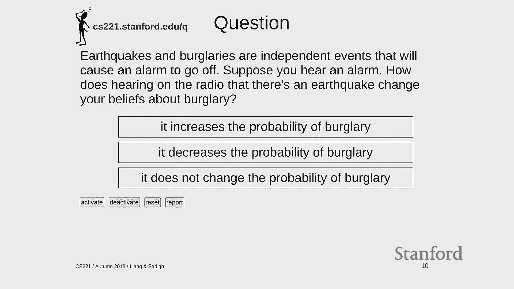
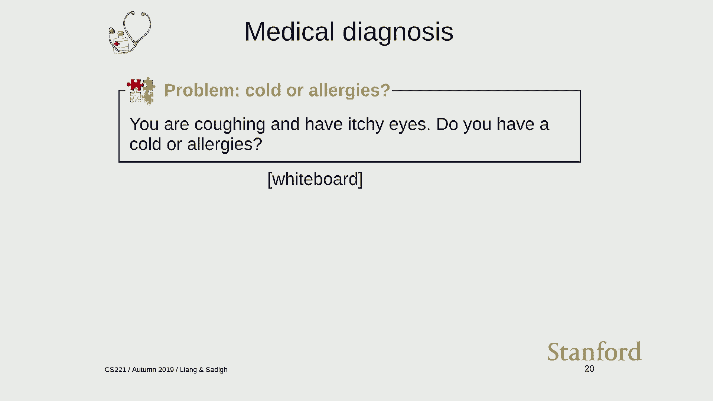
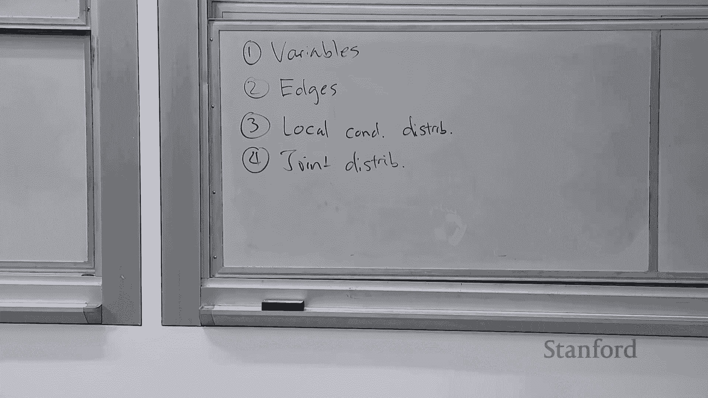
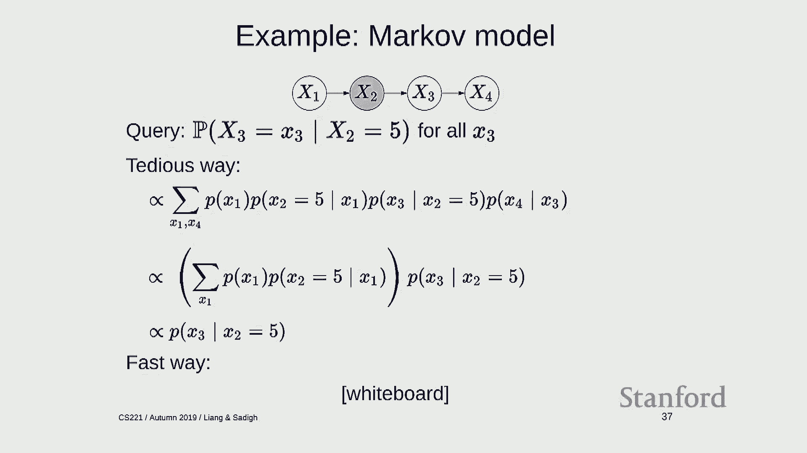

# P13：Lecture 13 Bayesian Networks 1 - Inference - 鬼谷良师 - BV16E411J7AQ

 All right， let's get started。

 Long time no see。

 I'm excited to be back and tell you guys about Bayesian networks。 So before we dive in。 I want to do a few announcements first。 There's four things that should be on your radar。 So the scheduling homework is due tomorrow。 Hopefully you guys are well aware of that。 The car assignment is released today and it will be due next Tuesday。

 So there's some conceptual challenges here， especially if you're not too up to speed on。 your probability。 That's the section Thursday will really help you go over that。 So please come to that。 Then there is a final project。 You guys have hopefully all received your feedback for your proposal and are actively。

 making changes。 So just to make sure that you guys are making progress。 there's a progress report that， is due next Tuesday。 And for this one。 the guidelines are all on the website。 But just to kind of reemphasize。 especially if you didn't manage to get a baseline or， oracle。

 we really expect that you to have that now。 And also we expect you to have some sort of preliminary results with some sort of implementation。 of your actual procedure or algorithm or model。 And it's definitely some description of what that is。 And be as concrete as possible as you can。 And finally， the exam is in about two weeks。 I would start looking at that。 And actually the best way I think to prepare for the exam is to look at the old exam problems。

 because there's a certain style that you have to kind of get used to when taking the exam。 So I know this is a busy time。 There's a lot of things going on， but hopefully you guys will manage。 Yeah。 It's Tuesday， I believe， but I could be wrong。 Yeah。 Let's say it's Tuesday。 Yeah。 It's whatever the website says。 Oh， it says Thursday。 Okay。 Well。

 then we'll defer to the website on that。 Okay。 So the next agenda item is the Pac-Man competition。 So many of you worked hard to submit various entries into this competition。 In the end。 only three could make it to the top three。 So here are the winners of the Pac-Man competition。 It's out of town， but if in the audience， maybe you guys could come down。

 Let's give them a round of applause。 And we have these prizes。 which are Pac-Man themed cups filled with candy in case you didn't， get enough for Halloween。 So there you go。 Congratulations。 You guys want to say a little bit about what was your secret sauce？

 Oh， it's not。 I'm actually the fourth one is the simplest of all。 And the third one is like a super messy icon。 Like all of these are yours。 Extract it from the food。 the capital。 The hunting goes with the scared。 And the health。 The combination all that stuff。 But that really turned out to be not as a very simple and simple method that would be very。

 very simple。 Which is similar to how everybody plays Pac-Man。 If there's a spirit ghost。 then go chase it。 If there isn't that， go to the capsule or house。 go to the food and dodge the other， ghosts。 And also I changed the distance to the F-Bias using like four-to-foys algorithm because the。 math has a distance。 It's different from the real distance in the math。 So lesson is keep it simple。

 I have a very few like， there's a lot of different iterations that I went through。 And I don't want those effects。 You end up being a great simple model。 The ball is the same flow where you want to eat the ghosts。 Every capsule while you're scared to ghost the play。 And after eating all the passes。

 it's going to include as much as possible。 I used the DFS as well for tracking us down at the speed of the DFS search。 I used that in a program so that every cut is a new decision to always catch that and。 have that role。 Great。 Okay。 Okay。 Well， congrats。 Okay。 Okay。 All right。 So keep it simple。 I guess it's a good lesson。 Okay。 So back to our regular programming。

 Last week we started talking about factor graphs。 Just a quick review of what factor graphs are。 Factor graphs consist a set of variables。 These variables could denote colors or provinces of Australia or locations of objects at different。 time steps。 Factor graphs also include a set of factors which depend on certain sets of variables。 And these factors are meant to specify a particular set of variables。

 And the way that they apply preferences or constraints on what values are good for these。 variables to take on。 And the weight of assignment is simply the product of all the factors。 Right。 So there's a theme that comes up in this class which is， I call it specify locally and optimize。 globally。 Right。 So it's very easy to think about how two variables might interact and how you want something local。

 to happen。 And these are defined in terms of the factors。 But what you care about is some globally optimal solution。 So the weight is a global function of all the， assignment to all the variables。 And last time we talked about various different types of algorithms for finding the maximum。

 weight assignment including backtracking search， beam search， give sampling and so forth。 Okay。 So one example we looked at was object tracking。 And in this example we have a set of variables corresponding to the location of an unobserved。 object at time step。 All right。 And we looked at two types of factors that captured where this object might be。 There's transition factors which capture the intuition that across two successive time steps。

 the object shouldn't move。 You can't teleport。 It has to remain close。 And observation factors that incorporate the information from the sensors。 At each position there's going to be some factor that kind of encourages the position to。 be similar to what the sensor reading was。 So sensor readings are noisy so it's not a hard constraint but it's a better soft constraint。

 And last time we saw this demo where you can define the factor graph in your click run。 And you see all the factors which are represented in these tables。 And when you multiply everything together you get for every joint assignment to all the。 variables some number that corresponds to how good that assignment was。

 And if you look at the maximum weight assignment that's what the answer you would return is。 Okay。 So so far so good。 And you can with this framework you can do a lot with it already。 You can define a bunch of factors you can run all the algorithms that we looked at last week。 But you know what is where these factors mean and how do you come up with them。

 Intuitively you can define these factors just you know hack on the two if you like it one if you don't like it。 But you know philosophically maybe you should be a little bit bothered by this because these。 factors are kind of just arbitrary in some sense。 So the goal of this lecture and the next two will be to give more meaning to the factors。 And we're going to talk about Bayesian networks it's a way to do that。

 So in one sentence Bayesian networks are factor graphs plus probability。 Just taking a step back where have we been in this course。 This course has been a lot about designing new modeling frameworks。 So we looked at state based models which result in search problems and MDPs and games。

 And this was a useful tool for solving a lot of problems already。 But then we looked at starting last week cases where maybe the order of actions doesn't matter so much。 And it's more natural to think about a set of variables that you want to find some assignment in any order is permitted。 And you can think about that as going maybe stepping up in abstraction kind of going from assembly to maybe C++。

 And in this lecture we're going to talk about Bayesian networks you can think about loosely analogizing going from C++ to Python。 It gives you a kind of a more high level language to think about modeling。 And it's just another tool in your toolkit。 Okay， so let's start with the basics。 There's a quick review of probability。 Usually we see probability start with outcome spaces。

 I'm going to jump directly to random variables assuming that you have a basic CS109 knowledge。 So random variables are things in this example are sunshine and rain。 So there are variables whose values are unknown。 And furthermore there is a probability distribution over all the random variables that captures how they might interact。 And so this is called a joint distribution。 So we write this blackboard P of the two random variables SNR。

 And this is this entire table which specify for every possible assignment to all the variables a single number which is its probability。 So the probability that it's sunny and it's not rainy is 0。7 for example。 So I want to distinguish two things。 One is that we're going to use uppercase letters to do random variables and lowercase letters to denote the values that the random variables can take。 And in addition I want to point out that when I write P s equals s r equals r that quantity expression represents a single number which is a probability for example 0。

7。 Whereas if I write P of SNR that expression denotes a whole distribution which is the table。 And I know these are kind of minor notational differences but I think it will avoid a lot of confusion if you kind of pay attention to these。 So from the joint joint distribution you can use a lot of probability to derive several quantities。 One quantity is called the marginal distribution。 And in marginal distribution you pick a subset of the variables that you care about。

 Those are called the query variables and you induce a distribution over them。 So in this case I've picked s and what I'm saying is I only care about the probability of s。 I don't care about r but r still has kind of influence on s so I need to take r into count somehow。 And the way I do this is I look at all possible values that s can take on so look at zero。

 And then I look over to the joint distribution and look at all the rows that match that particular s。 So here I'm looking at s equals zero so that's the first two rows。 And I look at those probabilities and I sum them up。 So 0。2 plus 0。08 is 0。28。 And similarly for s equals one I look at all the rows that match s equals one which is the last two rows and that gives me 0。

72。 Okay so what I'm doing here is called marginalizing out r because I don't care about r I'm interested in the marginal distribution over s。 So another concept which is going to be really important is the conditional distribution。 And the conditional distribution arises when your interest when you have some evidence。 So assume let's say I observe that it's raining so r equals one。

 So I write p of s given r equals one to say this is the I'm interested in distribution over s given that it's raining。 And to compute this I look at this condition r equals one and I simply select all the rows which match that。 So the second and the fourth rows。 So now these are numbers now probabilities they don't sum to one right because it's only a subset of the rows。 But what I'm going to do is make them sum to one by normalizing。

 So normalizing means taking the relevant numbers 0。08 point zero two adding them up and dividing by that number。 Okay so I'm dividing by point one which gives me the normalized distribution point eight and point two。 Okay so these two concepts are going to be really important and if you remember from last week。

 There we talked about marginalization as conditioning later in this lecture I'll connect these two concepts。 Okay any questions about basic probability so hopefully this is all。 Okay let's move on。 So suppose I have a joint distribution over some set of variables so then in this example it's sunny raining whether it's traffic and whether it's the autumn season。 The way to think about this is as a probabilistic database。

 For every possible assignment I have a number that is either it's between zero one。 So I can think about this as an oracle this is the source of truth。 I don't know what any of these variables is but I know how they behave and how they operate。 Just like I know I don't know what the outcome of a coin flip is going to be but I know that it's half and half heads and tails。

 So the main thing that we're going to do with a joint distribution is called perform probabilistic inference。 Okay so this is an important thing to understand because we're going to spend the whole time doing probabilistic inference so it's good to know what it is。

 So probabilistic inference the way to think about it is that you observe some evidence you wake up and you see ah okay it's it's autumn and it's a bay area so there's traffic outside so you're conditioning on some of the things that you're going to do。

 So you're conditioning on some evidence t equals one and equals one。 That's what you know。 And what you like to find out um querying this oracle is you know whether it's raining so you're interested in some set of query variables。 So in general form of a probabilistic inference problem or task is probability of some set of query variables conditioned on some set of conditioning variables which are set to particular values。 And notice that there are some variables which are not mentioned in this query such as S and those variables are the ones that are marginalized out。

 So you can think about this query as combining both the marginalization and conditioning from the previous slide。 Okay so this without loss of generality just captures everything that we seek to do with distribution for the purposes of this class。 Okay so at this point you can actually just do probabilistic inference right if I give you a joint distribution which is this huge table with all the probabilities for all the assignments you can go and you compute anything you want。 So now there's a kind of a slight problem here which is that if you have n variables and just suppose each variable takes on two values。

 How many possible how many rows in the table are there。 Anyone to the end right so that's exponential that's a lot so if n is 100 then that's I don't know。 So so clearly we can't do this naively right so the first challenge is how do you even write down this joint distribution compact way。 I don't want to write down to the n numbers。 So Bayesian networks is going to allow us to define joint distribution using the language of factor graphs。

 So this is really cool because now I have a very compact way of specifying what is implicitly something that's very very large。 The second challenge is algorithmic how do you do inference right we want to do perform a probabilistic inference answering queries like this。

 How do we do this efficiently。 Again you don't want to have to go through to the end of the possibilities because that would be really really slow。 And we'll see that variable animation Gibbs sampling particle filtering which is the probabilistic analog of beam search。

 All these algorithms that we talked about last week are actually going to come into play。 And we're just going to talk about the probabilistic analog of these as opposed to finding the maximum weight assignment。 Okay。 All right so now let's try to motivate why we need a Bayesian networks with this following example。 So here's a setting so earthquake earthquakes and burglaries are things in the world they're bad things but suppose that they're independent。

 Right that kind of makes sense。 But in your house you've installed an alarm system which is going to detect either both earthquakes and alarms。 Okay so one day you wake up and you hear an alarm go off。 Okay so you should be alarmed。 But then you turn on the radio and you hear that there's actually an earthquake。 So how does that affect your beliefs about whether there was a burglary or not。

 Okay so okay there's three options。 Does it increase the probability of a burglary。 Does it decrease the probability of burglary or does it not change anything at all。 Okay so how many of you think that hearing the news about the earthquake on the radio increases the probability of a burglary。 So if you say increases how many say it decreases。

 So many of you say it decreases how many say it doesn't change。 Almost as many say it doesn't change。 Okay that's interesting。 So we'll answer this question but you know keep on thinking about that in your back of your head。 And one thing I'll say is that you know I shouldn't expect to necessarily find the right answer here just by kind of intuiting things。

 And one of the points of making things codified in a Bayesian network is that you don't leave anything up to your kind of vagueness。 There's actually a correct answer that we can derive。 Okay so let me talk about how to go about modeling this as a Bayesian network。 So with this example。 So there's four steps。 The first step is defining what the variables are。 Okay there it goes。

 So what are the variables here？ Yeah。 Okay so there's burglary earthquake and alarm。 Okay great。 So these are the three things that we don't know about that are mentioned。

 So the second step is you draw some edges。 Okay so these are going to be directed edges that correspond to notions of influence。 And if you want cause causality。 But causality is a very more philosophical thing which we don't really need for this class。

 So but I'll use it anyway。 So what causes one？ So does an alarm cause burglaries？

 No okay I think it's the other way around right。 So burglaries cause alarm and similarly earthquake cause alarm。

 And these two aren't are I said they were independent so let's just leave that out。 Okay so now I have a directly acyclic graph that shows how all the variables are related in some。 Okay so the third step is to define local conditional distributions。 So now I'm going to go one step further and say how these are what the probabilities of these variables are。

 Because in the end of remember I wanted to find a joint distribution of all the variables。 Okay so I'm going to define a local conditional distribution for each of these variables。 So here I have P of B P of E and P of A given B and E。 So in general a local conditional distribution is P of whatever that variable is given its parents。

 So the parents are the variables that directly point into it。 So the parents of A are B and E。 E has no parents and A are B has no parents。 Okay so in particular what I'm going to do is now let me flesh this out a little bit。 So what is P of B？ P of B is a table that specifies only what's going on in this region of the space。 So I have B and I have P of B and I just fill out this what are the possible values of B？ 0 1。

 So let's say 0 1 and 0。 So let's say that probably a burglary is epsilon。 Epsilon generally denotes a small number which you hope to be the case on here。 So this must be 1 minus epsilon because it has to sum to 1。 And for simplicity let's say that probability of earthquake is also epsilon and 1 minus epsilon just for simplicity。

 And then okay so this one's a little bit more complicated。 complicated。 So I'm gonna write the parents be and variable itself a and I'm。 going to look at probability of a given me and now I'm going to list out all the。 eight possible combinations here so it's 0 0 0 0 1 0 0 1 0 0 1 0 1 0 1 1 0 1 1 1 1， k。 Okay。

 so for each of these I need to specify the， probability so 0 0 0 and I should say that this alarm system you bought was。 really good really good so it's it detects earthquakes and burglaries are。 perfectly okay so if there's no burglary no earthquake then the probability of。 alarm not going off should be 1 right it's perfect and this is the。

 failure case which is 0 because if there's a burglary no burglary in。 earthquake the alarm should be going on and this is I'm not gonna bother you。 with it details you can just fill in the rest of this so there's a burglary。 earthquake that should be a maybe someone should check them during this。

 right this should be a one this should be zero and this should be a one something， like that。 okay so now I've defined a local conditional distribution so remember。 I'm not defining the joint distribution yet I'm just defining in from zooming in。 on a particular variable how does it relate given its parents right and you。

 can think about it you have a million nodes I'm only each local distribution。 might be only touching like a very small part okay so finally the fourth step is。 to define the joint distribution okay this is a thing we're all after right。 which is what is a joint distribution over all three variables here and the。

 joint distribution is going to be written with a blackboard P is B equals B equals。 E equals A so random variables equals a particular possible value and this is。 defined to be the product of all the local conditional distributions okay so P of。 B P of E and P of A given the A okay so let me reveal the slide which hopefully。

 should have the same content on this one thing I'll point out is that there's a。 difference between the small piece and these big piece those are small piece。 are local conditional distributions these are things that you just define right。 there's no right or wrong there you just define them they're just true and then。

 there's this big P which is the joint distribution which is again defined to。 be just the product and then from this joint distribution you're going to read。 out things like marginals and conditionals which might look like some of these local。 distributions but they're right now think about them as distinct。

 yeah question so question is are we assuming B and E are independent here so。 let's see how do I answer that so yes in this one B and E are independent and I'll。 show you a little bit further how we can kind of see that more clearly okay so。 these are Bayesian networks so what's the connection between this and factor。

 graphs well if you squint a little bit you see that the right hand side here is。 a product of things and the left hand side is this kind of joint you know global。 thing and so what does this look like looks like weight equals product of。 factors right so let's go with that analogy and it's actually much deeper。

 than a just analogy and let's draw this as a equivalent factor graph okay so for。 every Bayesian network we can actually draw it as a factor graph so here we have， B。 E and A and okay so now it's you know it's really important to note that how。 do the factors arise through there's a local conditional distribution remember。

 for every variable and that is a factor so for every variable there's a factor。 right it's tempting to look at these edges and draw factors on them but that's。 that's wrong okay remember one factor per variable okay so this。 variable has a factor that is P of B this variable has a factor that's P of E。

 and this variable has a factor and this what does this depend on what is its scope。 B and E and A right okay you know again common mistake is to just put two。 factors here because it it's really tempting but one way to think about it is。 that if you think about your your parents they are they're married and。

 connected so that's why these are parents are connected actually the I'm not。 making this up but there's some people call this process moralization yeah so。 the question is can you use this compute probability of alarm given earthquake。 alone or Berkeley alone and the answer is you compute whatever you want and we'll。

 show you how to do that okay so single factor connects all the parents one。 factor per variable okay got it all right so the joint distribution over all the。 variables remember is the product of all the local conditional distributions and。 just for reference this is what it is and now you can go and answer questions。

 about this so this is kind of the fun part and I'm not going to go through the。 details of how this is done but I'm just going to show you kind of the。 interface what you would expect so again this is the definition of the。 alarm network using the same machinery as a factor graph because it is a factor。

 graph and first we're going to ask what is the probability of B so what is that。 that says in the absence of any information is there a burglary or not okay。 so what do you think that should be oh and epsilon here is a point zero five so。 I think I heard it 0。05 someone said that okay so indeed the probability of a， burglary is 0。

05 should be intuitive and now suppose I the alarm went off okay。 so now what's a probability of burglary so what is P of B given a equals 1 let's。 go up or down should go up if your alarm is working and indeed we see that。 probability of burglary given alarm equals 1 is 0。51 okay and now the。

 monomist truth what happens if we condition on the fact that there's also。 an earthquake so let's do this and you get 0。05 so many of you are correct when。 you said that the probability of a earthquake goes down okay and intuitively。 you can think it makes sense from this phenomenon called it in explaining。

 a way so explaining what happens when you have structures that look like this。 and you have suppose you have two causes positive influencing effect so by。 positive influence I mean that if you flip B equals from 0 to 1 then the。 probability of A goes up and so explaining a way says I condition on the。

 fact conditioning on one cause reduces a probability of the other one okay so at。 some level this makes sense because you know this A is either B or is either。 driven by B or E and I don't know which one it is if I just heard alarm go up but。 each of these is very small problem has very small probability so the moment I。

 kind of see that one of them explain this cause is see that one of them is。 true then I can revert back to the my prior belief on the other one okay so。 humans do this all the time when you're reasoning when you think about like oh。 what causes and you find one one cause and you discount all the other ones so。

 now the thing that's kind of interesting here is that I did say that B and E are。 independent which is also true right so this might have led people to think like。 well it shouldn't change because they're independent so why should the。 probability change but the key thing is that when you condition on A you actually。

 changed the independent structure of the model this is why writing things down。 really precisely is helpful to kind of reconcile these seemingly contradictory。 intuitions like that okay any questions about this。 all right let's move on so we've talked about the alarm network this is your。

 first example of a small Bayesian network hopefully you have an idea of the。 intuition behind us and now I'm gonna generalize it and the generalization。 shouldn't be surprising so in general I have n random variables usually denoted。 x1 through xn and the Bayesian networks is a directed acyclograph over these。

 variables and it defines a joint distribution over all the variables like。 this x1 through xn and this is defined as a product of local conditional。 distributions one for each node okay so this is a product of all n xi given x。 parents of i and this notation just means the values assigned to the parents of i。

 okay so this is a very general framework and just like factographs are a very。 you know general framework but the key difference from factographs is the fact。 that these factors aren't arbitrary right there are local conditional。 distributions and what does that mean that means all factors satisfy this。

 property so if you pick up a factor for the i's node p of xi given x parents。 is equal to 1 if you sum over all the possible value that xi can take on okay。 that's what it means to be a probability distribution and this is true for。 every setting of x parents so this property has two implications which I'll。

 discuss consistency of sub- Bayesian networks and consistency of conditional。 distributions and these properties are going to allow us to really you know take。 advantage of the probabilistic structure when we're doing inference okay so the。 first thing is the question is suppose I have this Bayesian network this alarm。

 network and I'm going to suppose I'm interested in the marginal distribution。 of only b and e okay I don't care about it so remember this is the joint。 distribution and by laws of probability I can derive them marginal distribution。 now the question is what does this margin distribution have to do with the。

 Bayesian network the graph here so let's go through some algebra to find out so。 this is a sum over all a and by definition this is just the product of all the。 local conditional distributions as we just discussed and now I notice that p of b。 and p of e don't depend on a which means that I can pull this out and push the。

 summation in that's just so up you know algebraic manipulation and then what is。 this value this value is just one because of a previous slide so I can just drop。 it and now I have p of b times p of e and lo and behold what is what is this this。 is if you had just gone and define a miniature Bayesian network over b and e。

 this was exactly what you've written down okay so that's that's kind of cool so。 the general idea here is that when you're marginalizing out a leaf node that。 yields a Bayesian network just without that known so marginalization produces。 this this Bayesian network where you've just erased the very the leaf node along。

 with its incoming edges right so in other words I've turned basically what was。 would have been a algebraic operation into a graphical one and generally those。 are good moves because it's much easier to kind of think graphically and make。 large operations and go through tons of algebra yeah definition equals it seems。

 at least from like the probability perspective that's just like from the。 axioms of probability or just like a Bayesian oh yeah so the question is what。 about this first definition equals what I mean here is by the laws of。 probability so it's not technically a definition it's follows from the axioms， of probability。

 okay so notice that in this world p and b and e are independent so this is one。 way you can kind of see that actually when you define the joint distribution in。 that joint distribution two variables b and e are so one thing to note is I you。 know if we've looked at the factor graph you know which is this thing and。

 remember last time we talked about marginalization and part factor graphs。 and what does that look like if you do what happens would if you did marginalization。 in this factor graph okay， yeah you just remove a but this factor is does it disappear。 no it doesn't right because factor graphs remember the factor graph don't。

 know anything about this factor other than that it's it returns non-negative。 numbers so you would have to keep hold on to this factor right so the moral of the。 story here is that if you're using factor graphs if you convert to factor graphs。 too early then you might lose out on opportunities is really simplified where。

 is it if you look at this the factor graph of this one there is no p of a given。 b and e right I mean just to go back here factor graphs will create a factor which。 is summation of a p of a given b and e and call that a factor and we know because。 these are local conditional distributions that's just one so you can just drop it。

 okay so so that's the first property to summarize if you marginalize out leaf。 nodes you get Bayesian networks by just dropping them from the graph so the。 second property is consistency of local conditionals as I alluded to before if you。 have p probability of d given a and b there's two versions of this that you can。

 might be thinking about one is a local conditional distribution which is again。 you just define it as such and then there is the corresponding quantity that。 comes about from probabilistic inference so this quantity is derived from taking。 the definitions forming the joint distribution and then using the laws of。

 probability to derive this particular quantity and this property says that。 don't worry about it the two are equal so you know it means that you can kind of。 intuitively think about there just a convenient one notion of probability in。 your head but I want to make this explicit but that this is that doesn't come。

 necessary for free you have to kind of verify that this is true I'm not going to。 go through the verification step it's in the notes in the slides but I'll just。 state it as such okay so let's do another example just to familiarize。 ourselves with Asian networks a little bit more so the question here is that。

 suppose you have you wake up and you are coughing and you have itchy eyes and。 you're wondering do I have a cold or do I have allergies okay so let's follow。

 this four-step procedure to define this vision network okay so step one what are。 the variables here there's coughing let's denote that as H and he eyes and then。

 cold and allergens okay so for random variables how should I connect these， things up。 yeah so H and I should be connected to C so if you have a cold you probably have。 a cough and you probably have a chis and here you tap into your medical。 knowledge and what's that yeah so generally I'm no doctor but let's just。

 assume for now that allergies don't really cause a cough because it's probably。 not true but let's just pretend with us okay so just to make the network a。 little bit more interesting okay so those are the edges and now I have to。 specify local conditional distributions over all these so what are the local。

 conditional distributions， so PFC you have a remember one for every node and you have H given C and over here。 is P of I given C and A right so probability of a node given its parents。 and then finally I have the joint distribution which is probability of C， A， H。 I and this is by definition just the product of everything。

 for this example I'm not going to go through and define the actual tables。 because that's going to take too much time but I'm going to do it in this。 demo here okay so this is a Bayesian network that I just drew on the board。 and this is a it's associated a factor graph remember one factor per node yeah。

 okay switches you the allergies of both CA oh yeah you're right I guess that makes sense。 which one makes sense yeah okay I got a little bit confused so it should be like。 this and then I have to adjust things okay so we're fixing this I given a and。 C and a okay just for the record I'll just make this H given C and A and I。

 given that wasn't bad okay thanks for touching that okay so this is the。 factor graph and let me show you this demo so you can click on this and you。 can see this Bayesian network in this factor graph and to answer this question。 what was the question the question was if I have if your coffee and have HEIs do。

 you have colder allergies so I conditioned on coffee equals one H EI is。 equals one and I'm asking for the probability of the cold okay and if you。 work it out you see that the probability of a cold is a point one three and you know。 so why does this so okay I guess I didn't really tell you enough about the。

 actual prior probability so the probability of a cold is you know point one。 let's say and the probability of allergies is point two and then there's a。 kind of a noisy or where if you're if you have a cold or allergies then you you。 end up coughing and the if you have it allergies and you have your H EIs with。

 probability point nine and what happened here is that if you if you condition on。 your coughing and you have itchy eyes there's this kind of interesting。 explain a way happening here where you know even though you didn't observe a。 you observed evidence of a and that's enough to kind of lower the probability。

 that you have a cold so this is an example show something a little bit more。 subtle how information can kind of propagate along the Bayesian network in。 ways that if you try to do it just time intuitively you probably not be able to。 okay so let me summarize so far what we've done so we've introduced Bayesian。

 networks where we have random variables that capture the state of the world and。 we have edges between those variables that represent dependencies between those。 variables and based on those dependencies we go and define local conditional。 distributions you multiply all those local conditional distribution you get。

 a joint distribution now with that joint distribution by laws of probability you。 can go and ask probabilistic inference queries and ask questions about the。 world given evidence and we saw that this captures interesting reasoning。 patterns such as explaining a way and finally all of this can be brought。

 under the umbrella of the factor graph interpretation which we will see is very。 useful for actually doing probabilistic inference in general。 okay so any questions before I move on to the next section。 okay so now I'm going to talk about probabilistic programs so this is going。

 to be kind of a little bit of a whirlwind tour and hopefully give you a。 different perspectives and open your eyes to kind of the possibilities of。 Bayesian networks so let's look at this alarm network again I can write it as on。 the board just a product of all the local conditional probabilities basically use。

 math or I can think about this as a probabilistic program okay so what I'm。 gonna write down is a program that it's a very simple program has three lines one。 for every variable and the first line is B is drawn from Bernoulli epsilon so this。 notation just means B is set to a random value that has a distribution Bernoulli。

 epsilon and same with earthquake and then finally set A equals B or E okay and so。 the idea here is that a probabilistic program is just simply a program with。 randomness in it that when you run sets the random variables so this is I think a。 really useful way to think about Bayesian networks and just to be very concrete。

 about this so you can think about Bernoulli of epsilon is just a Python。 program that just returns true with a probability epsilon so here random less。 than epsilon the random is a number between zero and one has a probability。 with epsilon being less than epsilon okay any questions about what this is doing。

 yeah so question is why does randomness help the the reason is that I'm what this。 program to be put a distribution over possible assignments every time I run。 the program it's going to produce a different assignment and the distribution。 of that assignment is the distribution that I'm defining so so this is a kind of。

 interesting philosophical point so normally you run programs and write。 programs with the intention of running them and do do something useful but here。 the programs are just a kind of a artifact artifact to define a distribution。 hopefully this will become a little bit clearer as I go through more。

 examples yeah if you want to define some distribution can you just you find like。 hard code the table instead of doing this and you can just article epsilon。 into a table itself like maybe you're running this program without either yet。 that's small yeah so question is why don't you just hard code define a table。

 directly instead of running this program so the intention here again is not to。 run this program because it's not an efficient way to do a probabilistic inference。 but it's more of a metaphor a tool to help you get more intuition about。 probabilistic programs and vision networks so hopefully we can come back to。

 this sort of question after I go through a few more examples so here's a more。 interesting probabilistic program so suppose you're doing object tracking and。 you define a program which starts with x0 = 0 0 so the initial locations at the。 origin and then for every time step so I'm writing the program in kind of。

 pseudocode here with probability alpha I set xi = xi - 1 + 1 0 so I'm going to。 the right and with probably 1 - alpha I'm going down okay so now this program。 you know that I just described induces a particular vision network structure。 where each xi is only connected to xi - 1 so what I'm trying to get you to think。

 about is there's multiple ways of thinking about the same object and I think。 when you get when you can kind of internalize all these things you kind of。 get a deeper understanding of what you're dealing with right we have the。 probabilistic viewpoint you can look at the tables you can value equations you。

 have the graph and I'm giving you an additional tool the programs okay so。 just for fun you can actually run this program again this is not what you would。 do normally but I can run the program in any case so every time I hit enter this。 gives you a different trajectory so this is a way to visualize the distribution。

 over prob x1 through x whatever how many of many red squares are okay and if I。 change alpha that gives me distributions which are either skewed to one side or。 the other side so that's the distribution over， sorry distribution over assignments okay so what is probabilistic inference。 look like in this setting so remember what is probabilistic inference I'm。

 conditioning on some piece of evidence and I'm asking for the distribution over。 some other set of variables so in case in this case I'm conditioning on the fact。 that I spotted x of the object at a2 at time step 10 let's say I'm interested。 where could have been before that so here what I'm going to do is I'm going to。

 run the forward program and I'm only going to keep those trajectories and show。 it if x10 equals a2 so if I do that I'm good so this is a2 I'm seeing that the。 set of possible trajectories look like this so this is a distribution over。 trajectories given x10 equals a2 okay so it's important what I'm trying to get。

 you to think about is a vision network or project program is what is the。 distribution you can visualize the distributions by looking at samples from。 that distribution another way to think about it right because distributions are。 think about like it's suppose you have a dish I tell you I have a distribution over。

 images how do you actually get a hold of that or understand that well probably。 the easiest easiest way is to draw samples from and look at the types of。 images that you get question to specify a joint distribution or are they like。 this way specify a vision so the question is is this way a way of。

 specifying joint distribution by this I mean I guess you mean the so problems。 programming in general it is so so for every probabilistic program it specifies。 a joint distribution over the random variables that you set in that program。 and vice versa if I have a vision network I can write down a policy program one。

 thing as you'll hopefully become clear is that the reason to think about in terms。 of programs is that you can inherit all the nice properties of programs like。 the ability to find functions or even have recursion or you know you can do a。 lot more fancy stuff with programs that you can't do what I mean which would be。

 hard to do you can think about Bayesian networks in another way to think about。 is like okay you're basically writing assembly code right for every。 variable you specify its value but if you have a million value a variable。 sometimes it's useful to be able to structure your code in some way and。

 we'll see that over the next few examples okay so this is going to be a。 march of I think around seven possible or so possible examples and just want to。 give you a flavor of types of problems programs that we're talking about here。 so the first one is called just a mark-off and by whenever I say probably。

 program think Bayesian networks or generalizations of that so mark-off model。 so this has a lot of applications in you know modeling language or time series。 and the program works as follows for every position I threw in I'm going to。 generate a particular word X I given the previous word okay so this is also。

 happens to be the same type of program as for the object tracking okay so this。 is a space in network structure so here's another one this is called a hidden。 mark-off model which is you know it's a very popular model that was used for all。 sorts of things like speech recognition notably before you know the rise of deep。

 learning so the idea here is that for every time step t equals 1 to t I'm going。 to generate an object location HT given the previous HT minus one so this part is。 just looks like a mark-off model okay but the reason why it's called a hidden。 mark-off model is that I'm not actually going to observe HT I'm going to observe。

 sensor readings ET at each time step T given the hidden location okay so this is。 what a hidden mark-off model looks like sequence of object locations we don't。 observe and sensor readings which I do observe which depend respectively on。 the given object locations and just as a convention whenever I shade a variable。

 that means I you know observe it and if it's not shaded that means I don't。 observe it okay so this program defines a joint distribution over all these。 variables and now you can ask a particular question you can do probabilistic。 inference and the most common thing that people do here is given the sensor。

 readings where is this object which is something we've already been exposed to。 through the lens of factor graphs but this is again a way to think about it。 through the lens of vision levels so now with this kind of program metaphor you。 can actually do kind of more complicated things in a very kind of succinct way。

 so to describe multiple object tracking you can think about there being two。 objects A and B and each position each time step and every object I'm going to。 generate a location for the object and this is going to be two independent。 mark-up chains which are running but the thing is that at each time step I only。

 observe one sensor reading and that sensor reading is going to be some。 combination some function of the actual locations of the object。 okay so now hopefully you can see a little bit of the advantage of thinking in。 terms of a program because I can write this kind of very simple four-line。

 program that very precisely nails down what the actual model is and in。 particular this factorial HM is it's called is something that you're going to。 be exploring in your car assignment here's another example so this is for。 usually used for classification it's called naive base somebody might have。

 heard of it and the program looks like this you first generate a label why let's。 suppose you generate travel and now you're gonna for every word in your document。 you're gonna generate a word given that label so if you generate travel you might。 generate words like beach and bed so now the that again specifies a。

 distribution over all the variables what are you typically interested in if。 you're interested in classification you're given the words and now you want to go。 back and figure out what the the classes or give me a text document what is the。 label here's a fancier model of documents called lain dair to the。

 allocation so here instead of have generating a single topic I'm gonna。 generate a distribution over topics this is getting a little bit meta because。 this random variable itself is actually a distribution but you know let's not。 worry too much about that so this is a distribution and for every position I'm。

 going to first generate a topic like travel or Europe and then for that topic。 I'm gonna generate a word given that topic okay so this allows you to model。 documents which talk about multiple things for example travel in Europe so。 this is also a very popular model that can be used to if you're given a。

 collection of documents try to understand understand the latent structure。 inside it so here's one that's kind of a generalization of the the medical。 diagnostics example on the board so in general let's say you have a bunch of。 diseases you generate the activity of a particular disease in a patient。

 according to some you know prior distribution and now you for every。 symptom that you might observe or any sort of lab test you have the probability。 of some outcome of that symptom given the diseases and of course the problem is。 inference question here is if a patient has particular symptoms what kind of。

 diseases does or problems does he or she okay so I think this is a maybe the final。 example here's a social network analysis example where you have a set of people。 each person has you know a quote a type maybe a politician or a scientist and。 these for every pair of people they can either interact or not interact they。

 might be connected or not let's say in a social network and so in the end what。 you're given is a social network of connectivity and you're asked what kind。 of types of people are there so generally you you observe maybe some graph and you。 want to understand you know what kind of features or you know what is what is a。

 concrete way of summarizing the types of people and there's this is called a。 sarcastic block model but there's other kind of fancier models that are based。 on a similar idea so that was a very quick you know overview of different。 types of probabilistic programs or Bayesian networks and there are the point。

 is that there are many many different types of models that can be written down。 in the literature many things general models can be just written down in a。 probabilistic program or equivalently a Bayesian network and all of them kind of。 have this kind of basic structure if you observe carefully all of them kind of。

 look like that whereas there's some set of variables H which you don't observe。 and that generates or causes a set of variables E which you do observe so the。 mindset when you're designing Bayesian networks is you're coming up with stories。 of how the data which you what you observe was generated through the。

 quantities of interest the output so this is probably kind of maybe counter。 intuitive and for those of you who are really used to thinking about just normal。 classification where you it's an opposite you start with the input and you think。 about what are things to do to the input that it can you know what kind of things。

 can I do to get it to a point where I can you know classify the input you know。 precisely but Bayesian networks kind of go the opposite it starts with the output。 or the structures interested in which are presumably kind of more kind of a。 platonic idea or something cleaner and then you're trying to describe how that。

 clean data gets or gives rise to this kind of messy sorry the clean structure。 give rise to the messy data that you observe。 Right so why is this called the output so I'm using input output here and to。 borrow terminology for when we talked about classification where you're going。 from input to output input is what you are given and output is what your output。

 I guess producing right and in the the Bayesian network you first define the。 model kind of going from output to input so kind of the opposite of what you would。 normally do and now now there's a second stage where you do probsic inference。 which reverses that and you go from the observations which are the input to the， output which is。

 Okay any other questions about this？ All right so now let's talk about inference this is also going to be the。 topic of next lecture but I'm just going to start playing around with this a。 little bit so remember what is probabilistic inference we're given a。 Bayesian network to find some joint distribution we're also given some setting。

 of the variables which are the evidence for example I saw that the long went off。 and I'm interested in a subset of the variables okay so what I'm trying to。 produce is a probability of some query variables conditioned on evidence and。 what this really means is I want this for all values of the query variables。

 Okay so for example if I have coffee and itchy eyes do I have a call。 It's an example of a probabilistic inference query。 Okay so let's start with this simple example suppose I have this Markov model。 and I asked this query what is the probability of X3 given X2 equals 5。

 The condition of X2 equals 5 I'm interested in X3。 So at this point you already have the tools to do this and I'm going to show。 you how you can just go through the calculations and then I'm going to show。 you an easier way to do this so if you were just shown this right now this is。

 probably what you would do which might be a little bit tedious so by laws of。 probability this so this condition is equal to the joint over this marginal。 Okay so this is just by definition of conditional probability and one thing I'm。 going to do here is notice that I'm only interested in distributions over X3 so。

 from that perspective this denominator is just a constant X3 doesn't depend on X3。 So what I'm going to write is this proportional to which means that the。 actual value here is this thing on the right hand side times some constant which。 I don't care about and the reason I can do this and I don't care about is because。

 I know that the left hand side is a distribution so whatever I get on the。 right hand side if it sums to six or something then I just divide by six and， I get a distribution。 Okay so this is going to save you a lot of work if you。 use a proportional to sign but you have to use it carefully otherwise you can get。

 the wrong answers。 Okay so let's expand this so this is a marginal distribution of， X2 and X3。 I can write it in terms of the joint where I sum over the variables that。 I don't care about so this again laws of probability and then the definition of。 the Bayesian network here is the joint distribution is equal to on the product。

 with a local conditional distributions so right now I have lowercase p now。 because they're local distributions。 Now I'm going to do some algebraic。 manipulation so notice that this stuff doesn't depend on X4 so I can push the。 summation of X4 over here and then these two first two terms only these first two。

 terms depend on X1 so I can group this and have the sum over X1 apply here and。 then I can look over here and use what is the sum to one second drop it and then。 what is this does this depend on X3？ Nope so I can also drop that and I get a p of。 X3 given X3 equals 5。 So this hopefully shouldn't be surprising to anyone。

 because remember that slide when I said consistency of local conditional。 distributions this is should be equal to this and this is just one way of。 verifying that that's actually the case for this example。 Okay so you know this。 was you can do this I mean for this one it's actually not that bad especially。

 when you already know the answer but I promise you there are going to be。 situations where you definitely don't want to grind through all the math。 because you can fill up ten pages of equations I'm gonna show you kind of a。 faster way to do this and so let's start， so this is going to be a five-step procedure but in many cases not all the。

 steps are necessary。 Okay so let me erase this and the key idea is going to be to。

 use the structure of the Bayesian network and factor graphs to simplify some of， these operations。 Okay so let's start with okay so you have X1， X2， X3， X4。 okay all right so and I'm conditioning on X2 right okay so X2 this takes on value 5。 Okay so the and I'm interested in this query variable so the first thing I want。

 to do is I want to remove as many variables as I can I just because that's。 going to simplify my life so I'm going to remove or marginalize non-ancestors。 of the query and the variable I'm conditioning。 So by non-ancestors I mean。

 anything that's upstream I am gonna keep for now anything that's downstream I can。 let go okay so what can I remove here？ X4 right so I can show this so I can。 graphically just remove X4 and that corresponds to on the slide basically。 the fact that this thing sums to one but I've done this again graphically which。

 hopefully should be more intuitive okay so the second step is I'm going to convert。 to a factor graph because one already takes care of and basically I'm。 exploiting the properties of Bayesian networks but after I've done one I don't。 it's simpler to think about as a factor graph where I want to think about the。

 factors more explicitly it's just arbitrary functions and not worry about。 which way the conditioning is going because it's really easy to get confused。 by Bayesian network where you're wondering like oh this is conditioning。 over here what's a marginal distribution and factor graphs I think by actually。

 removing the directionality and semantics actually make things a little。 easy okay so I'm gonna convert this into a factor graph which means I have let me。 actually just drive down here again so here's a factor graph remember I have。 probability of X1 probability of X2 given X1 so this might look like more work。

 right now because I'm making things explicit but you can actually do a lot。 of things in this thing okay so remember every variable has a specific。 with a factor okay so now I want to you know condition on on the evidence so I'm。 conditioning on X2 equals 5 so remember what the conditioning does remember。

 from last week's lecture condition just removes this and changes the factors to。 be except to the value that that yeah sorry yeah we shouldn't have X4。 this factor should be there so X4 is this is the factor graph corresponding。 okay so I'm conditioning on X2 so I wipe X2 from the face of the earth and I'm。

 going to set this change this factor to be a partial evaluation of where I put。 X = 5 and this factor is X2 = 5 given X1 okay so this connection is good so now I。 can marginalize out the disconnected components and these are components that。 I'll remember I care about X3 so this stuff is disconnected so I don't care。

 about it so I'm just going to let's say just cross it out and that operation。 corresponds to the fact that you know this thing over here I just can drop。 because it's not related to X3 it's just a concept。 okay so finally the fifth step is actually do work okay so what does that。

 mean you might not be so likely to be left with just you know single variable。 with a factor where where that's just the answer in that case you actually。 have to actually compute do the marginalization operations that we saw。 last week in this case we are fortunate that this factor this actually represents。

 the distribution of X3 so that is just the answer to the problem okay but I'll。 go through some other examples with it's not okay so this is just a general。 strategy that I outlined on the board here and again I think once you get kind。 of good at this you can basically the steps one and four should be kind of。

 very kind of visual because you can just see well all everything downstream just。 would clearly doesn't matter and when you see these these are you know conditioning。 things you can kind of automatically just not ignore things and just jump directly。 to five so that's idea I'm just doing things that are more explicit on the。

 board so you get kind of see where things are coming from okay so I'm gonna do。 another example this is alarm so here I have this major network and I let's。 suppose I'm interested in probability of B okay so this should be an easy one so。 start with one marginalize out non-assers so which are the non-assers。

 so A and E right so I just removed them from the case of the earth and I'm just。 left with this single variable B and obviously it has a factor of P of B and。 then I'm done okay okay so this one's all maybe a little bit more you know。 complicated so this is a probably of earth sorry burglary given equals one so。

 let's go through this example so we'll have B E and A。 okay so marginalize out non-assers so what I'm， interested I'm interested in the probability of B given equals one okay so I。 have A and B that I care about so what are the non-assers of these variables。 there's none right so this is an ancestor of A so I can't remove it so can't do。

 anything there too bad convert to a factor graph we've done this before。 probably a fee moralize the parents so this is a probability of A given B and E。 and then this is probably E okay I'm conditioning on the evidence now so I。 condition on A equals one so I'm gonna remove this and change this factor to A。

 equals one given B and E fourth step is marginalize out anything that's disconnected。 nothing's disconnected so I can't do anything and rats I have to do actual。 work okay so what is actual work mean here I'm interested in the probability of。 B so I need a marginalize out E now have to do this kind of a hard way based on。

 last time last lecture so what I'm gonna do here is you know what happens when。 marginalize out E I create a new factor let me actually replicate this down here。 so it doesn't get too confusing so I create a new factor and this new factor。 let's call it F of B which is the markup link of E there's only one other。

 variable B and this is going to be the product of all the factors here that。 touch this variable that I'm marginalizing out and the only difference between this。 and what we're doing last time is before we had a max because we're doing maximum。 weight assignments and here I'm going to have a sum because we're doing。

 probabilities and marginalizing so this is going to be a summation of it okay and。 then the final query is going to be just the product of those two things okay。 I'm not gonna have time to actually drill down into expanding these values but if。 you actually plug in epsilons into these then you'll find that the probability of。

 B equals 1 given A equals 1 is 1 over 2 minus epsilon which is remember 0。51 is。 for epsilon equals 0。05 okay but this calculation you know you can look into。 the slides to see how this is actually done but it's just algebra okay so there's。 another example which I'm going to defer to section to talk about I think in all。

 of this you just need to do some practice and get kind of comfortable doing these。 operations to summarize define Bayesian networks there's this way of defining。 models that allow you to specify locally and optimize globally once you have a。 Bayesian network you can do probabilistic inference where you condition。

 evidence and query variables of interest and next time we're going to focus on。 number five and hopefully not do things completely manually but do things more。 automatically okay that's it， you， [ Silence ]。

