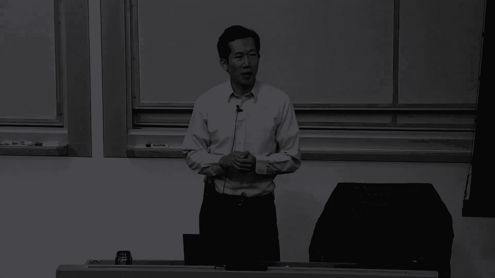
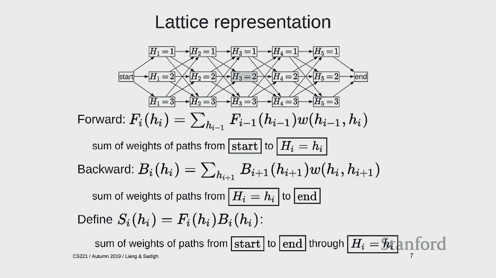
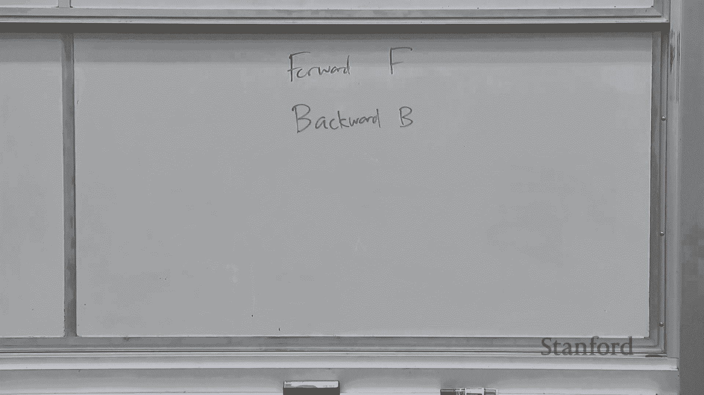
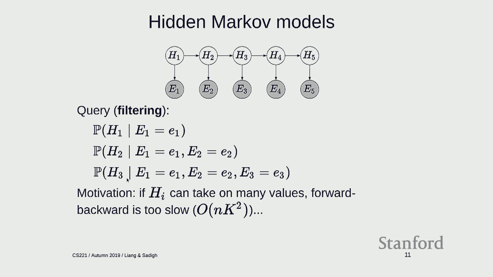
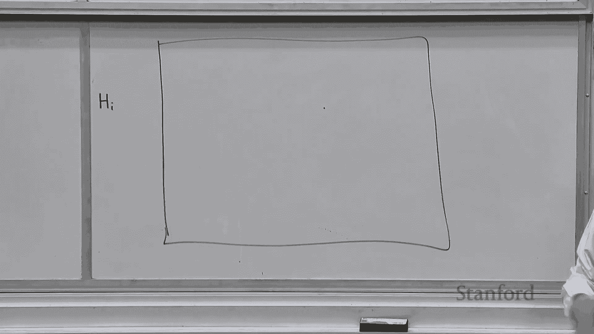
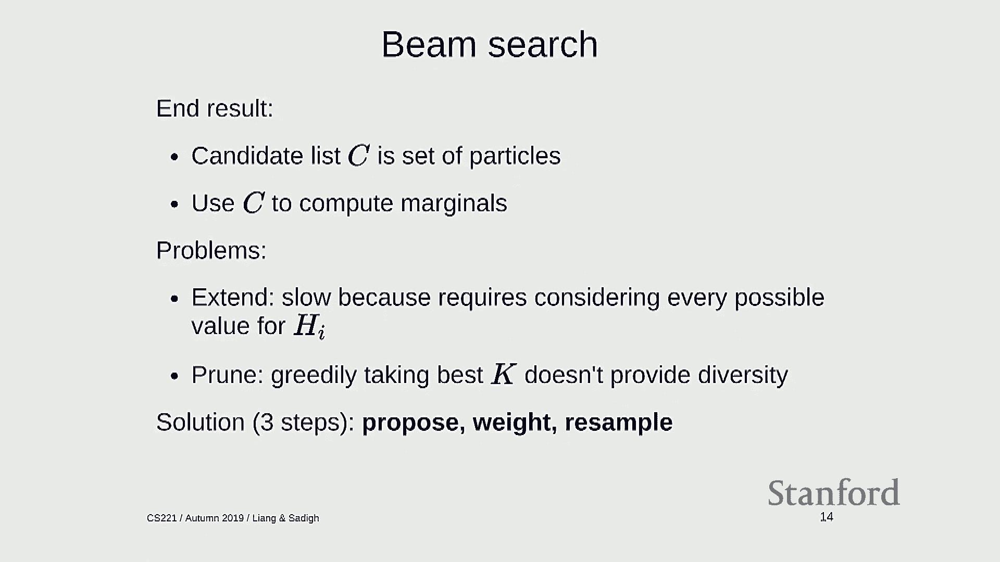
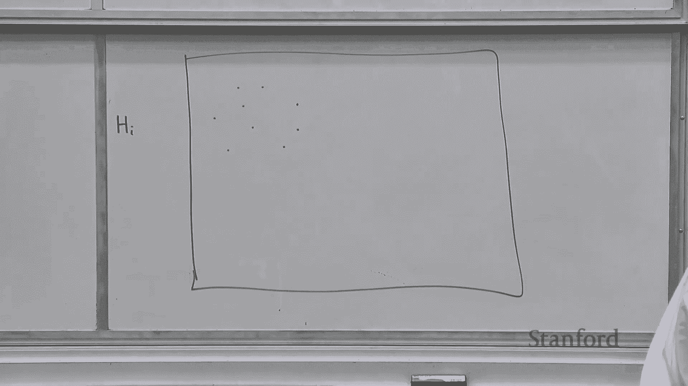
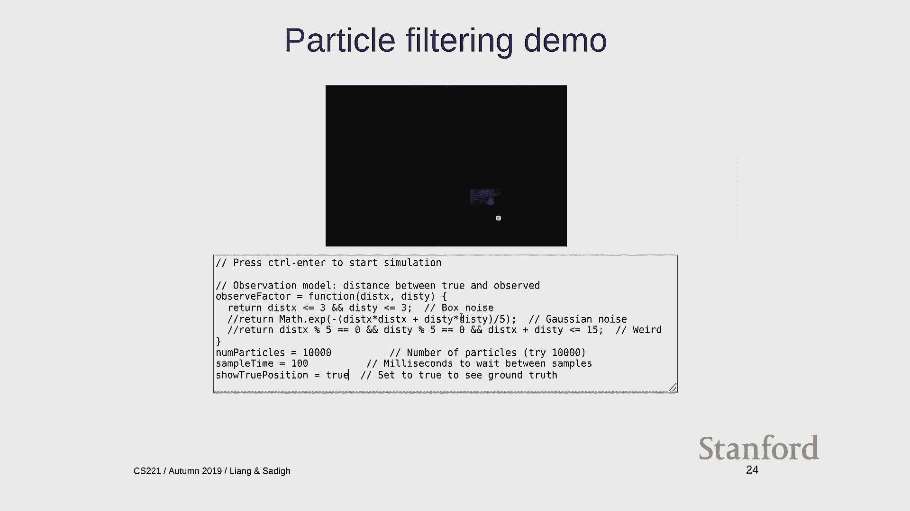
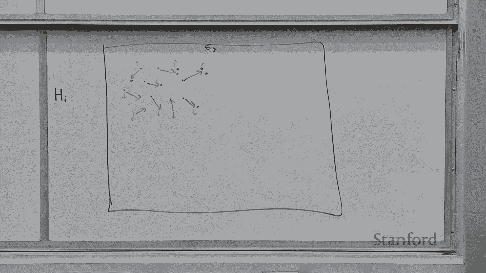

# P14：Lecture 14 Bayesian Networks 2 - Forward-Backward - 鬼谷良师 - BV16E411J7AQ

 All right， let's get started。

 So we're going to continue talking about Bayesian networks。

 which we started on Monday。 And just a quick recap， we've been talking about Bayesian networks。

 which is a new paradigm for defining models。 And what is a Bayesian network？

 You have a set of variables， which are nodes in a graph。 For example， whether you have a cold。

 whether you have allergies， where you're coughing， whether you have HEIs。

 These nodes are related by a set of directed edges， which capture various dependencies。 For example。

 HEIs is caused by allergies， but not cold or by cough。 And then formally。

 for every variable in the Bayesian network， you have a local conditional distribution。

 which specifies the distribution over that variable， given the parents。

 So the parents of cough are cold and allergies。 So you would have a local conditional distribution。

 of P of H given CNA。 You do that for all the variables。 And finally， you take all the factors。

 or local conditional distributions， and multiply them together。

 And you can one glorious joint distribution， over all the possible variables in your distribution。

 So in other words， to sum it up， you can think about Bayesian networks。

 as factor graphs plus probability。 They allow you to define， ginormous joint distributions。

 over lots of random variables， using factor graphs。

 which allow you to specify things very compactly。 And moreover， we saw glimpses。

 of how we can use the structure of factor graphs， to permit efficient inference。

 So probabilistic inference in Bayesian networks， is the task of given a Bayesian network。

 which is this oracle about what you know about the world。

 And you look at some evidence that you've found。 So it's raining or not raining。

 or you have HEIs or so on。 And you condition on that evidence。

 and you also have a set of query variables， that you're interested in asking about。

 And the goal is to compute， the probability of the query variables。

 conditioned on the evidence that you see。 Big E equals little E。 Remember， lower upper case is。

 random variables lower case is actual values。 And so for example， in the coughing case。

 there's the probability of a cold， given the fact that you're coughing， but don't have HEIs。

 And this probability is defined， by just the laws of probability。

 which we went over the first slide of last lecture。 And the challenge is how to do this efficiently。

 Okay， and that's gonna be the topic of this class。 So any questions about the basic setup。

 of what Bayesian networks are， and how do you， what does mean to do probabilistic inference？ Okay。

 one maybe kind of a high level note， about Bayesian networks is that。

 I think they're really powerful as a way， to describe kind of knowledge。

 I think a lot of AI today is focused on particular tasks。

 where you define some input and you define some output， and you train a classifier。

 And the classifier that you train， can only do this one thing， input output。

 But the paradigm behind Bayesian networks， and databases in general is that。

 you have developed a kind of a knowledge source， which can be probabilistic。

 It's captured by this joint distribution。 And once you have it。

 you use all the tools of probability， to allow you to answer arbitrary questions about it。

 So you can give me any pieces of evidence and any query， and it's clear what I'm meant to do。

 I'm supposed to compute these values。 So it's kind of a more flexible and powerful paradigm。

 than just converting inputs to outputs。 And so that's why I think it's so interesting。 Okay。

 so today we're gonna focus on， how to compute these arbitrary inference queries efficiently。

 I'm gonna start with forward， backward and particle filtering。 These are going to specialize。

 to the specific Bayesian networks called HMMs， hidden Markov models。

 And then we're gonna look at Gibbs sampling， which is a much more general way of doing things。 Okay。

 so a hidden Markov model， which I talked about last time。

 which we're going to go in more detail this time， is a Bayesian network where there exists。

 a sequence of hidden variables， and a corresponding sequence of observed variables。

 So as a kind of motivating example， imagine you're tracking some sort of object， in your homework。

 you'll be tracking cars。 So H_i is going to be the location of the object or car。

 at a particular time step i。 And E_i is going to be some sort of sensor reading。

 that you get at that particular time step。 It could be the location plus some noise。

 or some sort of distance to that， the true object and so on。 Okay， so these are the variables。

 And it goes well as saying that the hidden variables。

 are hidden and observed variables are observed。 So the distributions over this。

 all the variables is specified by three types， of local conditional distributions。

 The first one is just the starting distribution。 What is the probability of H_1？

 This could be a uniform over all possible locations， just as an example。

 And then we have the transition distributions， which specify what is the distribution。

 over a particular hidden variable， the location of the true location of object， H_i。

 given H_i minus one。 So this captures dynamics of how this object， or car might move over time。

 For example， it could just be a uniform， over adjacent locations。 So cars can't teleport。

 they can only move to adjacent locations， over a one time step。 And finally。

 we have emission distributions， which govern how the sensor reading。

 is computed as a function of the location。 So this again could be something as simple。

 as uniform over adjacent locations。 If you expect to see some noise in your sensor。

 the sensor doesn't tell you where exactly the car is， but tells you approximately where the car is。

 And the joint distribution over all these random variables。

 is going to be given by simply the product， of everything you see on the board。

 I'm just gonna write this up on the board， just for reference。

 So we have the probability of H equals H。 So this， when I write H equals H。

 that means the H_1 through H_n。 So all the random variables， all the hidden random variables。

 all the observed random variables。 And this is my definition equal to， the start distribution。

 Let's see， just make sure I have， okay， good notation here。 So start distribution over H_1。

 And then I have the transitions， I equals one， I guess， two to n， just to make sure， okay。

 So this is the probability of H_i given H_i minus one。 And then finally， I have for every time step。

 I through one through n， I have the probability of observation given H_i。

 So multiply all these factors together。 That gives me a single number that is the probability。

 of all the observed and all the hidden variables。 Any questions about the definition of a hidden Markov model？

 Okay， so given we have one of these models， remember with a Bayesian network。

 I can answer any sort of queries。 I can ask what is the probability of H_3 given H_2 and E_5。

 And I can do all sorts of crazy things。 And all of these things are possible and efficient。

 you know， compute。 But we're gonna focus on two main types of questions。 Motivated by the。

 let's say， object tracking， for example。 The first question is filtering。

 Filtering says you're at a particular time step， let's say time step three。

 What do I know about the true object location H_3， given all the evidence I've seen up until now？

 So this is kind of a real time object tracking。 At each point in time， you look at all the evidence。

 and you want to know where the object is。 A similar question is smoothing。

 And you're still looking at a particular time step， three， let's say， but you're conditioning。

 on all the evidence。 So you're looking at all the observations， and you're looking at。

 you're kind of thinking about， this more retrospectively， where was the object， at time step three？

 So think about if you're trying to reconstruct， the trajectory or something。 Okay。

 so this is called filtering and smoothing。 So let's now try to develop an algorithm。

 for answering these type of queries。 And without loss of generality。

 I'm going to focus on answering smoothing queries。 So why is it the case that if I tell you。

 I can solve all smoothing questions， I can also solve all filtering questions。 (mumbling)。

 So it is true， so in filtering， this is the evidence is a subset。

 But the answers are going to be different， depending on what evidence you compute on。

 So you can't literally just use one， as the answer for the other。 Yeah。

 - It relies over the things that you， like E45 to get to。 - Yeah， so you marginalize。

 That's a key idea。 Is that suppose I had a smoother， and I wanted to answer this filtering query。

 So this is H3 given E1 to E2， E3。 Remember last time we talked about how。

 if you can take leaves of vision networks， which are not observed and just essentially wipe them away。

 So if you don't observe E4， E5， H4， H5， you can just pretend those things don't exist。 Right。

 And now you're back to a smoothing query， where you're conditioning on all the evidence。 Okay。

 so we're gonna focus on smoothing。 And to make a progress on this problem。

 I'm going to introduce a representation， that's gonna help us think about， the possible assignments。

 Right， and just to be clear， right？ There's， the reason why this is not completely trivial。

 is that there are， if you have end hidden variables， there's two to end or X management。

 and number of possible assignments， and you can't just enumerate all of them。

 So you're gonna have to come up with some algorithm， that can compute it more efficiently。 Okay。

 so what we're gonna do is introduce， this latest representation。

 which is gonna give us a compact way， of representing those assignments。

 And then we can see how we can operate on that representation。 Okay， so this is gonna smell a lot。

 like state-based model。 So we're kind of going backwards， about， hopefully it'll make sense。

 So the idea behind a lattice representation， is that I'm going to have a set of rows and columns。

 So each column is going to correspond， to a particular variable。

 So the first column is gonna correspond to H1， and each row is gonna correspond。

 to some setting of that variable。 So there's two possible things I can do。

 I can either set H1 equals one， or I can set H1 equals two。 The version I'm drawing on the board。

 is gonna be a simplification of what I have on the slides， just in the interest of space。

 And the second column is going to be either， H2 equals one， or H2 equals two。

 So by going through these lattice nodes， which are drawn as boxes。

 I'm kind of assigning random variables， to a particular value。 Okay， so I'm gonna connect these up。

 So from this state， I can either set H2 equals one， or two。 Here I can also go from two， one。

 or two。 And finally， let's just do H3 equals one， H3 equals two。 And similarly。

 I can choose either one of them， from no matter where I am。 And finally， I have an N state。 Okay。

 So first， notice that the size of the lattice， is reasonably well controlled。

 It's simply the number of time steps， times the number of values that a variable can take on。

 So let's suppose that there's N time steps。 And K possible， let's say， locations， so values of HI。

 So how many nodes are here？ - Eight times N。 - Eight times N。 - Eight times N， right？ Okay。

 So that means we can， essentially， this doesn't blow up exponentially。 Okay。

 so now let us interpret a path from start to end。 What is a path from start to end tell us？

 So let's take this path。 Now， what does this tell us？ Yeah。 - Particular assignment of a variable？

 - Yeah， it's a particular assignment of the variable。 So this one says set H1 to one， H2 to one。

 H3 to one。 This path says set H1 to two， H1 to one， and H3 to two， and so on。 Okay。

 So every path from start to end， is an assignment to all of the unobserved， or hidden variables。

 Okay。 So now， remember， each assignment comes， with some sort of probability。

 So we're gonna try to represent those probabilities， juxtapose on this graph。 Okay。

 so I'm gonna go through each of these edges。 So remember， these are the probabilities， right？

 So every assignment is a product of the factors， and I'm going to basically take these factors。

 and just sprinkle them on the edges， at the points where I can compute the factors。

 and I'll explain more what I mean by this。 Okay。 So maybe one kind of preliminary thing I should mention is。

 suppose for this example， we have， we are conditioning on E1 equals one， E2 equals two。

 let's say E1 equals， sorry， E3 equals one。 Okay。 So I'm conditioning on these things。

 Notice I'm not drawing them in here， because these are observed variables。

 I don't have to reason about what values they take on。 I'm only gonna consider the hidden variables。

 which I don't know。 But this is just gonna be some sort of reference。 Okay。

 so let's start with start to H1 equals one， right？ So if you remember backtracking and CSPs， right。

 we basically took factors， and then whenever we could evaluate the factor。

 we just put it down on that edge in the backtracking tree。 So here， what can we do？

 We have the probability of H1 equals one。 Okay。 And then we also have the probability。

 of the first emission probability I can compute， right？

 So that's a probability of E1 equals the evidence I saw， which is one， given H1 equals one。

 which is the value that I've committed to here。 So this is a number that is essentially the weight。

 or cost or score or whatever you wanna call it， that I am going to incur when I traverse that edge。

 Okay， so what about this one？ So I have the transition from P， let's say， H2 equals one。

 given H1 equals one， and times the probability of E2 equals whatever I observe， which is two。

 given H2 equals one。 And similarly， over here， I have probability of H3 equals one。

 given H2 equals one， times the probability of E3 equals one， which is whatever I observe。

 given H3 equals one。 And then over here， there's no more factors left。

 so I'm just gonna put one there。 Okay， so you can check that， when I traverse this path。

 and then multiply all of these probabilities together。

 that's exactly this expression for H1 equals one， H2 equals one， H3 equals one， E1 equals one。

 E2 equals two， E3 equals one。 And for each of these edges， I have an analogous quantity。

 depending on the values that I'm dealing with。 Okay， any questions about this basic idea？

 So in the slides， this is basically what I just said。 Okay， so now what I'm trying to do now is to。

 let's say I'm interested in smoothing。 So I'm interested in what is the probability of H3 equals two？

 Right， actually let's do the example on that board， just because that's one I'll actually do。

 So suppose I'm interested in probability of H2 equals， I'll let's say two， given the evidence。

 E2 equals two， E3 equals one。 Okay， so this is the query I'm interested in， you know， computing。

 okay？ So how can I interpret this quantity， in terms of this lattice？ Right， so this is。

 there is this H2 equals two here， right？ That's somehow privileged。 And then asking， you know。

 what is the probability of this given the evidence？ Yeah。 - Some of all of these。

 I'm really happy to be here。 - Yeah， so sum over all the probabilities of the paths， right？

 So remember every path through， from start to end is an assignment。

 Some of those paths go through this node， which means that H2 equals two， and some of them don't。

 which means that it's not true， right？ So if you look at all those paths。

 and you sum up their weights of this node， and divide by the sum over all paths。

 then you get the probability of H2 equals two， given the evidence。 Okay， so let me just write this。

 This is going to be sum over， colloquially sum over paths， through H2 equals two。

 divided by sum over all paths。 Okay， so now the problem is to compute the sum over。

 all paths going through H2 or not going through H2。 Okay， again。

 we don't want to sum over all the paths， literally because that's going to be exponential time。

 So how can we do this？ Yeah。 - Say sum to mean sum of the weights， sum of the counts。

 like how mean paths？ - Right， so what do I mean by sum？ I mean sum of the weights。

 So every path has a weight， which is the product of the weights on the edges。

 and you sum of those weights。 Okay， so what's an idea that we can use。

 to compute the sum efficiently？ - Sum keyword。 - Dynamic programming。 - Yeah， dynamic programming。

 okay？ So we're going to do this kind of recursively。 Let me just show this slide。

 So it's going to be a little bit different， from the dynamic programming that we saw before。

 It's going to be more general， because we're not computing， let's say， one particular query。

 but I'm going to compute， a bunch of quantities I'm going to allow us。

 to compute all queries essentially。

 Okay， so there's going to be three quantities， I'm going to look at。

 and hopefully I can kind of out of colors， but let's not use green for those sum。

 So there is going to be forward messages F， which I'll explain a bit。

 There's going to be backward messages B。 Okay， so what I want to do is for every node。

 I'm going to compute two numbers。 - Yeah， question？ - No， I think I'm okay。 What color is that？

 Sure， I'll take a blue marker。 - Yeah。 - Great。 Thanks。 Okay， great。 So let's call this S， okay。

 Okay， so for every node， I'm going to compute two numbers。 One number we'll call the forward number。

 is or the forward message。 It's going to be the sum over the weights。

 of the partial paths going into that node。 And the orange number is going to be。

 the sum of all the partial paths from that node to the end。 Okay， so let's。

 so these are all meant to be probability， so the numbers should be less than one。

 but just to keep things simple， I'm going to put actual numbers on these， just to， just to。

 integers on them so they don't have to carry out decimal points。 Okay， so this is one， let's say。

 one， two， one， one， two， one， one， two， and one。 Okay， so remember。

 every edge has a weight associated with it。 And so now let me compute the forward probability。

 So what is the sum of all the paths going into that node？ It's just one， right？ Okay， so， sorry。

 forward is green。 So one， and this is two， okay， just copying this。 And now recursively。

 what is the sum of all the weights going into this？ Okay， so I could have come from here。

 or I could have come from here。 Right， so if I come from here。

 it's one times whatever the sum was there。 So that's one times one， that's one， plus two times two。

 Okay， so I'm gonna get a five， one plus four。 And here I'm going to have one times one。

 so that's one， one times two， that's two， so that's going to be three。

 Hopefully you guys are checking my math here。 So what about this node？ So now recursively。

 this could have， paths going in here could have come from this node， or that node。

 So that's two times five。 So that's 10， one times three。 And that's three， so that's 13。

 And this is one times five， plus three times two， so that's 11。 Right？ Okay？

 So 13 represents the sum over all paths， going into h_t equals one。 Okay？

 So I can do the backward direction。 So， so this is going to be， in orange。 The backward message is。

 which are， paths going to the end。 So this is going to be one。 So here I'm going to have。

 so two times one， plus one times one。 So that's a three。 This is one times one， two times one。

 So that's a three as well。 This is one times three， one times three。 So that's a six。

 This is two times， so that's a six and a three。 So that's a nine。 And then I'm， you know， done。

 Okay？ Okay。 Does that all make sense？ So these are kind of compact representations over the。

 essentially the flow in and out of these lattice nodes。 Okay， so the kind of the。

 kind of magic happens， when I have these S's。 So now for every node。

 I'm going to also just multiply them together。 Okay？ So that's going to be a six， 18， 18， nine， 13。

 11， and that's it。 Okay？ So what happens when I multiply them together？

 Let's take out the look at this node， right？ So what does nine represent？ Nine represents。

 the sum over all the paths going through here， right？

 Because I can take whatever paths I have coming in， and I can take whatever paths I have going out。

 and any sort of combination of them， will be a valid end-to-end path。 Okay？

 And so this total weight is， yeah。 - Instead of sum， for this case。

 - So why do we multiply instead of sum here？ Because we're multiplying。

 the weight of a path is the product。 Okay？ Mathematically what's going on is， exactly factoring。

 right？ So suppose I had numbers， let's say， A， B， and C and D。

 and I could choose A and B and C and D。 So what are the possible。

 so then I can do A plus B times C plus D， right？ Which is the sum over all possible paths。

 and you can， thus paths are either AC， AD， BC， and B。 Okay， so I'm basically doing this。

 computing it in a factorized way， rather than expanding it out。

 That's mathematically what's going on， when I multiply the forward and the backward messages。

 And why are these called messages？ So the idea of messages。

 comes from the fact that you can intuitively， thinking about the forward messages。

 as being kind of sent across the graph， right？ Because the message here depends only on the neighbors here。

 and once I get these messages， I can compute the messages the next time step based on this。

 So it's kind of a summary of what's going on， and I'll send the messages forward。

 and same in the backward direction。 Okay， so now once I have these values。

 how do I go in back and compute my query？ Sum over a path through H2B goes to， what is that？ Nine。

 right？ And over the sum over all paths， what's the sum over all paths？ Sorry， this should be 15。

 I was wondering， did I screw anything else up？ I think that's right。 I was checking because。

 you know， when if you sum these two numbers， you get 24。

 which is all the sum of all paths going through here， and that better be the same number here。

 and also here would be the same number there， right？ Okay， someone just should have got that。 Okay。

 all right， so these are all the paths going through nine， and I'm sorry， going through this node。

 and if you look at all paths， that's going to be 15 plus nine， and that's going to be 24。 Okay。

 so final answer is the probability of H2 equals two。

 given these made up weights is going to be nine over 24。 Okay， any questions about that？ (silence)。

 Okay， so let me just quickly go over the slides， which is going to be a more mathematical treatment。

 of what I did on the board。 Hopefully one of the ways we'll resonate with you。

 So define the four messages for every node， is going to be a sum over all the values。

 at the previous time steps of the four message data， previous time steps。

 times the weight on the edge， from the previous value to the current value。

 The backward is going to be defined similarly for every node。

 sum over all the values assigned to them， at the next time step， outgoing edges。

 of the backward message at the next time step times， the weight into that next time step。

 and then define S as simply just the product of F and B。 Okay， so that's what I did on the board。

 And then finally， if you normalize the sum， at each point in time。

 you can get the distribution over the hidden variable， given all the evidence。

 And to summarize the algorithm， the forward backward algorithm。

 this is actually a very old algorithm， developed actually first for speech recognition， while back。

 I think it's probably in the 60s or so。 So you sweep forward， you compute all the forward messages。

 and then you sweep backwards， and compute all the backward messages。 And then for every position。

 you compute SI for each eye and you normalize。 So the output of this algorithm。

 is not just the answer to one query， but all the smoothing queries you want。

 Because at every position， you have the distribution over the hidden variable， HI。

 And the running time is n times k squared， because there's n time steps。

 and every time step you have to compute the sum。 So for k possible values here。

 you look at k possible values there， so that's k squared， and it's n times k squared。 Interestingly。

 if you ask， okay， what's the cost of computing a single query， it would also be n times k squared。

 So it's kind of cool， that you compute all the queries。

 in the same time that it takes to compute a single query。 Question。 - [inaudible]。

 - So the question is， does this only work for hidden markup models， or is it more general？

 There's certainly adaptations of this， which work very naturally for other types of networks。

 One immediate generalization is if you have， not just a chain structure。

 but you have tree structure， then the idea of passing messages along that tree。

 It's called belief propagation， is just works pretty much out of the box。

 For arbitrary Bayesian networks， this won't work， because once you have cycles。

 then you can't represent it as a lattice anymore。 Any other questions？ Okay， so summarize。

 The slightest representation allows us to think of paths as assignments。

 which is a familiar idea if we were thinking about state-based models。

 We can use the idea of dynamic programming to compute these sums efficiently。

 but we're doing this extra thing， we're computing all of the sums for all the queries at once。

 The forward backward algorithm allows you to share。

 intermediate computation across the different queries。 Yeah。 - [inaudible]。

 - So the output of this algorithm is basically， the probability of HI given all the evidence for every I。

 - Also sequence EIs。 - Yeah。 - One， then you can sequence them。 Think we can do it on this for that。

 - Oh， so how would you actually use this？ Do you sample from it？

 It depends on what you want to do with it。 So the output of this。

 you can think about it as a distribution at each time step。

 So it's an end-by-k matrix of probabilities。 From that， you can sample if you want。

 You might be only interested in only various points in time。 - Yeah。 - Okay。

 So let's move on to the second algorithm which is called particle filtering。

 So we're interested still in hidden Markov models。

 Although part of the filtering again is something actually much more general than that。

 And we're going to only focus on query filtering questions。 So we're going to filter in。

 We're at a particular time step。 We're only interested in the probability of the hidden variable at that time step。

 condition of the past。

 And why might we not be satisfied with hidden Markov or the forward backward algorithm？

 So here's the motivating picture。 So imagine you're doing the car assignment， let's say。

 And you're tracking cars。 So cars， let's say， live on a huge grid。 So at each position。

 the value of hi is some point on this grid。 But you don't know where it is。 You want to track it。

 So if this is like 100 by 100， that's 10，000。 If this were a thing were continuously even worse。

 So this k squared， where k is the number of values， could be like 10，000 squared。

 And that's a large number。 Right。 So even though hidden Markov model with backward forward backward is not exponential at the time。

 even the quadratic can be pretty expensive。 And the further the motivation is， you know。

 you intuitively shouldn't have to pay that much。 Right。

 Because let's say your sensor tells you that， oh， the car is up here somewhere。

 And you know cars can't move all the way across here。 So then， you know。

 but the algorithm is going to consider each of these possibilities。

 And most of the probabilities are going to have pretty much zero probability。

 So that's really wasteful to consider all of them。

 So can we somehow focus our energies on the region that have actual high probability？ Yeah。

 question。 Backwards like for the later time steps。

 you can't have zero in one of those positions in our original team。 The question is。

 can you go backwards？ Like if you can't， like if you're continuing with one way and you say like it's very unlikely。

 that we go back to the starting position， do each of those variables have the same domain。

 have a say？ Oh， so each of these variables， they don't have to be from the same domain。

 For this presentation， they're in the same domain just for simplicity。

 But I think what you're asking is you know that maybe a car only moves。

 let's say forward or something， then there is some restriction on the domain。

 It's not going to be that significant because you still don't know where the car is。

 so it doesn't really cut out that many possibilities。 Yeah， maybe by a factor of two or something。

 but that's not that significant。 Okay， so how do we go about making this a little bit more efficient？

 So let's look at beam search。 So our final algorithm is not going to be beam search。

 it's going to be particle filtering， but beam search is going to give us some inspiration。

 So remember in beam search， we keep a set of k candidates of partial assignments and the algorithm is followed。

 You start with a single empty assignment and then for every position， time step。

 I'm going to consider all the candidates which are assignments to the first i-1 variables。

 I'm going to extend it。 There's possible ways of extending and setting hi to v from any v in the domain of i。

 So now I'm going to amass this set of extended assignments。

 Now I have k times as many because each of previous assignment got extended by k。

 So I'm going to prune down and just going to take all of them。

 sort them by weight and take the top k。 So visually， remember from last time it looks like this。

 So here is this object tracking where we have five variables and you start with beam search。

 which is assigning x1 to 0 or 1。 And then you extend it。 So you extend the assignments。

 you prune down， you extend the assignments and prune down and so on。 And at the end of the day。

 you get k candidate。 Each candidate is a four assignment to all the variables and it has a particular weight。

 which is its actual weight。 And then in the intermediate time。

 it's a partial assignment to only the prefix of i random variables。

 And remember that beam search doesn't have any guarantees， it's just so heuristic。

 but it often works well in practice。 And the picture you should have in your head is that you have the exponentially sized tree of all possible assignments。

 And beam search is kind of this prune breadth first search along this tree。

 which only looks at promising directions and continues。

 So you don't have to keep track of all of them。 Okay， so at the end， you can use beam search。

 you get a set of candidates， which are four assignments to all the random variables。

 And you can compute any quantities you want。 So the problem with this is that it's slow。

 For the same reasons as I described before， it requires considering every possible value of h i。

 So it's a little bit better than forward backward， right？ So for forward backward。

 you have to have the domain size times the domain size。 And now for beam search。

 it's the size of the beam times the domain size， which is better， but still。

 I think we can do a little bit better than that。 And finally。

 there's this kind of more subtle point is that， as we'll see later。

 greedily taking the best K might not be the best thing to do because you want some maintain some diversity。

 And just a kind of a quick visual， so suppose you beam consists of only cars over here。

 it's kind of a little bit redundant， but you might want a kind of a broader representation。 Okay。

 so the idea with particle filtering is to just tweak beam search a little bit。

 And this is going to be expanded into three steps， which I'll talk about。 Okay， so let me。

 Does anyone need this on the board and erase it？ Okay， we're good。 Anyway。

 you can look at the video if you remember。 All right， so there's three steps here。 Okay。

 and we're going to try to do this pictorially over here。 So。

 so the idea behind particle filtering is I'm going to maintain a set of particles that kind of represent where I think the object is。

 So imagine， you know， the object starts over here somewhere。

 So you have a set of particles and I'm going to iteratively go through these three steps。

 So propose a weight and a resample。 So this is meant to be kind of a replacement of the extend prune strategy for beam search。

 Okay， so the first step is to propose。 So at any point in time particle filtering maintains a set of partial assignments known as particles that kind of tries to mimic a particular distribution。

 So to kind of jumping to the second time step， we can think about this set of particles is representing the probability of H1 and H2 given the evidence so far。

 Okay， on the board， I'm only going to draw the particle representing the value H2 because it's hard to draw trajectories。

 but you can think about really particle filtering maintains this linear as well。 Okay。

 so the key idea of the proposal distribution is that， okay， we want to advance time now。

 So we're interested in H3， but we only have H2。 So how do we figure out what H3 is？

 So we propose possible values of H3 based on H2。 So this is idea of proposal。

 We just simply draw H3 from this transition distribution。 So remember。

 this distribution is comes from the HMM。 This is your given HMM， so you can do this。

 And this gives us a set of new particles which are now extended by one。

 And this represents the distribution H1， H2， H3 given the same evidence。 Okay， so pictorially。

 you should think about propose as a propose is kind of taking each of these particles and sampling according to the transition。

 So think about the particles as just moving in some direction。

 It's almost like simulating where cars are going。 And this is done kind of stochastically and randomly。

 Okay， step two is to wait。 So far the new locations really don't represent reality， right？

 Because we also see E3。 At time steps three， we get a new observation that hasn't been incorporated somehow into this。

 We're just kind of simulating what might happen。 And so the idea here behind a real waiting is for each of those particles。

 we're going to assign a wait now， which is equal to the mission distribution over E3 given H3。

 Again， this is the mission distribution which is given by HMM。

 so we can just evaluate it whenever you like it。 And the set of new particles which are weighted can be thought of representing this distribution where now we have condition on E3 equals one。

 Okay， so now each of these particles has some， you know， wait。 So on this picture。

 it kind of looks like this。 So maybe let's say the emission distribution is kind of， let's say。

 let's say a Gaussian distribution around the observation。 So suppose the observation tells you。

 well， it's over here somewhere， which means that these particles are going to get higher weight and these particles are going to get lower weight。

 And if they're far away enough， then maybe they get like almost zero weight。

 So I'm going to kind of softly X these out。 So think about these as， okay， maybe I'll do this。

 So I'll up weight these and kind of start down weighting them。 So nothing really gets zeroed out。

 but you can think about these as down weighting and these as up weighting provided you have。

 let's say， some evidence E3 that tells you you're going in that direction。 Okay。 Okay。

 so the final step is really about a resource distribution question。 So we have weighted particles。

 We need to somehow get back to unweighted particles。 Okay， so which ones it shows。

 So imagine you have this situation where you have particles which are kind of distributed。

 the weights of the particles are fairly uniform。 Then you could imagine。

 let's take just the particles with the highest weight。

 This is very similar to what beam search would do。

 We just take all the particles with high weight and just keep those and nothing else。

 So this is not a crazy thing to do， but it might give you an impression that you're more confident than you actually are。

 right？ Because imagine the weights are fairly uniform。 So maybe this one is like， you know。

 point five and this one is like point four eight。 So you're kind of just breaking ties in a very biased way。

 So the idea is that if you sample and set sample from this distribution。

 you're going to get something a lot more representative rather than just taking kind of the best。

 Okay， so how do you sample from this distribution？ So the general idea is if you have， if I。

 this is just kind of useful module to have。 If I give you a distribution over n possible values。

 then I'm going to draw， let's say， k samples from this。

 So if I have the distribution of a four possible locations with these probabilities or weights。

 then I might draw four samples and I might pick a one。

 And then a two and then I may pick a one and a one。

 So some of these things are not going to be chosen if they have sufficiently low probability。 Okay。

 so going back to the particle filtering setting。 We have these old particles remembering which are weighted。

 And first， I'm going to normalize these weights to get a distribution。

 So add these numbers up and divide by that。 And then I'm going to sample according to this distribution given ways on the previous slide。

 So am I draw in this case， zero on one， once and I might draw it again and might not even keep this particle。

 And the idea here is that suppose a particle has really， really low weight as like 0。001。

 Then I shouldn't kind of keep it around and because it needs to occupy memory and have to keep track of it。

 It's basically gone。 So this resampling kind of regenerates the pool by focusing the efforts on the higher weight particles。

 So you might even resample a high weight particle multiple times and then not sample the low weight particles zero times。

 Okay， so in this picture here， so resampling might， let's see， how do I draw this。

 Maybe now I have maybe I sample this twice， maybe I sample this twice and maybe these don't get sampled。

 Maybe I sample this once。 So the blue represent the particles after this one round of particle filtering where I've kind of moved the particles over here a little bit and less away from there。

 So that's why it's kind of called particle tracking because you can think about the swarm of particles representing where the object might be。

 And over time as I follow the transition dynamics and hit it with the observations。

 I can move this swarm over time。 So that's a picture you should have anyway。 Okay。

 so let's go through the formal algorithm。 It's going to be very similar to beam search。

 So you start with empty assignment and then you propose。

 So where you take your partial assignments to the previous I minus one variables and then I'm going to consider for each one of them just sampling once from this transition distribution and augmenting that assignment。

 So unlike beam search where the size of C prime was K times larger than C。

 the size of C prime is equal to the size of C in this case。 Second， I reweight。

 So looking at the evidence and applying the evidence， probability of evidence given the particle， H。

I。 can wait for every particle。 And then I'm going to normalize this distribution。

 sample K elements independently from that distribution and that it redistributes the particles to where I think they're more promising。

 So let's go through this quick demo。 So the same problem as before。

 I'm going to set the number of particles so hundred。 So I start with all the particles。

 assigning X one， you know， to zero， and there's a hundred copies of them。

 I extend and notice that some of the particles go to zero and some of the particles go to one with approximate probability proportional to whatever the transitions are。

 And then going to redistribute， which changes the balance a little bit and I'm going to extend prune extend。

 By prune， I really mean re rate and resample。 And notice that the particles kind of get more diverse than。

 well， it's more diverse than beam search because I'm using K equals 100 rather than three。

 But you can see that some of these particles like this one have zero weight so that when I resample。

 they go away。 Do you have a question？ Yeah。 Why don't we agree all of the ones into a single category and all the zeros of a category？

 Is it just to show the branching pattern or is it actually relevant？ Yeah。

 so that's a good question。 So notice that all of these are all of these zero for the purposes of X four are just three the same。

 So if you only care about the marginals， then you can collapse them。 You're absolutely right。

 In this demo， it's I'm maintaining the entire history so that you can show the seed of branching。

 So this is that point。 If you only care about the last position and not about the possible trajectories。

 then you actually collapse all the particles with the same H i into one。 And then furthermore。

 if there's repeats， then you can just keep track of the count。

 And this is actually what you would do in your assignment。

 I'm giving you kind of the more general picture in case。

 because particle filtering is more general than just looking at the last time step。

 but most of the time you're just interested in last time。 Okay。

 so just a quick kind of quick visual illustration of this。 Let's define this factor graph。

 where you have transitions that are basically one or zero depending on whether it's one i and h i one minus one are close to each other。

 And， oh， I have some sensory。 One thing I've been a little bit on。

 I'm going to the rug is sometimes I've talked about local conditional distribution sometimes I've been talking about factors。

 Remember from the point of view of inference， it really doesn't matter。 They're all just factors。

 Right。 So in particular， if I give you a factor graph， which， right， remember。

 which is not necessarily a Bayesian network。 I can nonetheless still define a distribution by simply just normalizing。

 Take all the weights and normalize them divide by that。

 And these objects are actually called Markov networks or Markov random fields。

 which is another object of study that we're not going to talk about in this class。

 But this is actually a more general way to think about the relationship between factor graphs and distributions。

 We're only mostly focusing on Bayesian networks in this class。

 But some examples will be more general than that。 Okay。

 so you have this distribution and so you can play with this demo in the slides。

 If you click then this yellow dot shows you the observation at a particular point in time。

 And the noise， the observation is related to the true position of some particle by based on the noise that you define here。

 So here I've defined box noise， which means that it's going to be a uniform distribution over a box of three by three。

 or I guess a six by six box。 And so if I increase the number of particles to， let's say。

 ten thousand， then what I'm going to show you is a red blob。

 That looks like it's trying to eat the yellow dot。

 And this red blob shows you the set of particles where the intensity is the count of that number of particles in a particular cell。

 So this warm， again， corresponds to on the board， it's the set of particles。

 But since this is discretized， you can kind of see the particles who are piling up on each other。

 And just to see how well this is doing， show proof position。

 You can see the blue dot is the actual object position。 The yellow dot is the noisy observation。

 And it's trying to do its best to track where the blue is。

 It's not perfect because this is kind of approximate algorithm。 It kind of gets most of their。

 Okay， any questions about particle filtering？ So to summarize。

 you can do forward backward if you can swallow computing a number of domain values times number of domain values。

 If you have large domains， but you really think that most of them don't matter。

 then particle filtering is a good tool because it allows you to focus your energies on the relevant part of this space。

 Okay， so now let's revisit Gibbs sampling from a probabilistic inference point。

 So remember Gibbs sampling we talked about last week as a way to compute the maximum weight assignment in arbitrary factor graph。

 where the main purpose is to get out of local minimum。 So remember how Gibbs sampling works。

 you have a weight which is defined for complete assignments。

 So unlike particle filtering or beam search， we're starting with complete assignments and trying to modify the complete assignments rather trying to extend partial assignments。

 So you loop and you compute， you pick up a variable xi。

 and then you consider all the possible possible values it could take on。

 And you choose the value with probability proportionality to its weight。

 Let me show you this example that we saw last week。 So， same graph here。

 So we start with this complete assignment。 And then we're going to examine x1。

 x1 can take on two possible values。 For each of these values I'm going to compute its weight。

 So remember in Gibbs sampling， I only need to consider the Markov blanket of that variable。

 The factors here are 01 and T1 because that's the only thing that changes everything else is a constant。

 And then I was normalized and sample from that。 So then I go on to the next variable and so on。

 So I sweep across all the variables and eventually the weight hopefully goes up。

 but not always up because sometimes I might sample value that has lower probability。

 And at the same time， I can do various things like computing the marginal distribution over a particular variable or two variables。

 So I can basically count the number of times I see particular patterns。

 And I can normalize that to get a distribution over that particular pattern。 Okay。

 So now let's try to interpret Gibbs sampling from a probabilistic point of view。

 So instead of just thinking about a weight as just a function。

 we can actually think about the probability distribution induced by that factor graph by again。

 summing all the weights over all possible assignments， normalizing， there you have a distribution。

 So the way to think about Gibbs sampling is now more succinctly and more actually traditionally written as the following。

 which is you loop through all the variables。 And for every variable。

 you're going to look at the probability of that variable taking on a particular value condition on everything else。

 So now I can give like write down this probability， which is， you know。

 a nice way to think about what Gibbs sampling is actually doing。

 And the guarantee with Gibbs sampling under， you know， some conditions。

 which I won't get into is that as you run this for long enough， you。

 the sample that you get is actually a true sample from this distribution as if you had sampled from this distribution。

 And if you did multiple times， now you can actually compute any sort of marginal distribution you like。

 So now while there's that guarantee sounds really nice。

 there are situations where Gibbs sampling could take exponential time to get there。 So caveats。

 Okay， so let's look at a possible application of Gibbs sampling image denoising。

 So suppose you have some sort of noisy image and you want to clean it up。

 So how can this be helpful？ So we can model this image denoising problem as this factor graph where you have a grid of pixel values。

 And they're connected in this kind of grid like way。 So every value xi is where i is a location。

 two numbers， is going to be either zero or one。 And we're going to assume that some subset of the pixels are observed。

 And in case we observe it， then we're actually just going to have a factor that is actually a constraint that says that value of xi has to be whatever we observed。

 And these， we have these transition potentials that say neighboring pixels are more likely to be the same than different。

 So it assigns value two to pixels which are the same and one to pixels which are different。 Okay。

 so is the model clear？ So now let's try to do Gibbs sampling in this model。

 So I'm just going to give you a concrete idea of what this looks like。 So I'm going to look at。

 I'm not going to draw the entire grid but I'm going to center around a particular node that we're interested in sampling。

 So I'm going to do more stuff over here。 Okay， so and remember in Gibbs sampling at any point in time。

 all the variables have some sort of preliminarius assignment。 So this might be one， one。

 one and zero and this might be one。 So now I sweep through and I'm going to pick up this variable and kind of say。

 hmm， shall I try to change its value？ First of all。

 you ignore the old value because it doesn't factor into the algorithm。

 And now you're going to consider， let's say， this is xi， so xi， there's two possible values here。

 so zero and one。 Right， so， and I'm going to look at the weight。 So if it's zero。

 then I'm going to evaluate each of these factors based on that。

 So remember the transition potential is， well， I'm not going to write it down。

 But if it looks considered zero here。 So these are different， that means I'm going to get a one。

 These are different， that's going to be a one。 These are different， that's going to be a one。

 These are the same， and I'm going to get a two。 Okay， now I try one。 These are the same。

 These are the same。 These are the same。 And these two are different。

 So for every assignment I have this weight， so this is two， this is eight。 And then I normalize。

 so this is going to be 0。8， and this is going to be 0。2。 And I draw a flip a coin with heads 0。8。

 and whatever I get， I put down。 So I might have with 0。8 probability， I put one back， and so on。

 Okay， and here's another example which I'm not going to go through。 Okay。

 so Gibbs sampling is going to do that。 So now let's look at this concrete。 Okay。

 so what you're looking at here is this grid of pixels。 White means that the pixel is unobserved。

 Black or red means that it's observed to be whatever color you see on the screen。

 And so this is somewhat of a noisy image， and the goal is to fill in the white pixels so the picture makes sense。

 And visually you guys can probably look at this and see the hidden text。 No？ Okay。

 So your denoising system is pretty good。 Okay， so I'm going to run Gibbs sampling。 So click。

 and what you're seeing here， each iteration， I'm going to go through every pixel and apply exactly the algorithm。

 whatever I did on the board。 Okay， so you can see that these are just samples from the set of unobserved random variables。

 Okay， so to turn this into something more useful， you can。

 instead of looking at the particular sample， you look at the marginal， which is for every location。

 What is the average pixel value that I've seen so far？ And if you do that。

 then you can see a little bit clearer picture of 220 and wide。

 And it's not going to be perfect because the model that we have is fairly simplistic。

 It always says is similar pixels， neighboring pixels are tend to have the same color。

 It has no notion of letters or something。 Okay， but you can see kind of a simple example of Gibbs sampling at work。

 There's a bunch of parameters you can play with。 You can， here's another picture of a cat。

 You can play around with a coherence， which is how sticky the transition constraints are。

 You can try to use ICM， which won't work at all。 Okay， any questions？

 I think we might actually end early today。 Okay， so just to kind of sum up， we've， last week。

 Mondays we define new models。 So we define a Bayesian network or a factor graph。

 And today we're focusing on the question of how do we do probabilistic inference。

 And for some set of models， I've shown you how to do this。 There's a number of algorithms here。

 And a forward backward， which work for HMMs and are exact。 Particle filtering， which works for HMMs。

 although they can be generalized。 Which is approximate and Gibbs sampling。

 which works for general factor graphs， which is also approximate。 Each of these algorithms。

 we've seen kind of these ideas in previous incarnations。

 So forward backward is very similar to variable elimination。

 Because variable elimination also computes things exactly。 Particle filtering is like beam search。

 It computes things approximately。 And Gibbs sampling is like iterative conditional modes or Gibbs sampling。

 Which we saw from last week。 Okay， so next Monday we're going to look at how we do learning。

 So up until now， the Bayesian network， all the probabilities are fixed。

 And now we're going to actually start to do learning。

 I should say that maybe this learning sounds a bit scary because there's already a lot of machinery behind inference and factors and all this stuff。

 But you'll be pleasantly surprised that learning is actually much simpler than inference。 So。

 stay tuned。 [ Silence ]。

