# P17：Lecture 17 Logic 2 - First-order Logic - 鬼谷良师 - BV16E411J7AQ

 Okay， let's get started。

 So before I get into logic， a few announcements， the exam is tomorrow。

 Remember that。 Next week is Thanksgiving break， so we won't have any classes。

 There's no more sections。 And after you guys come back from Thanksgiving break on the Monday。

 there's going to be a， poster session from 2。30 to 5。30。

 So there's more details on the website and we'll post more details on Piazza as well。

 And then finally， the day after there is a logic homework to do。

 So that's pretty much it aside from the final report of things that you should keep track。

 of in this class。 I want to take a few minutes to talk about codal lab worksheets。

 So this is a platform that we've been developing our group to help people do research in a more。

 efficient and reproducible way。 And the thing that's relevant for 221 is that you will get an opportunity to get extra credit。

 by using codal lab worksheets and also it provides additional compute if you're running low on。

 that as well。

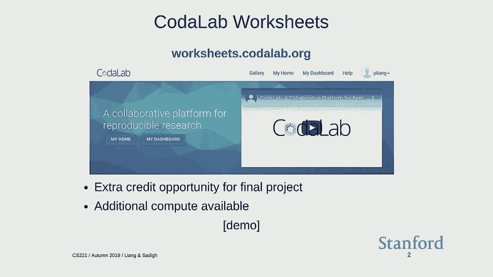

 I want to give a quick demo to give you an idea of how this works。 So if you go over to worksheets。

org， you can register for an account。 I'm going to demo a kind of newer interface that you're actually going to see on the website。

 just because that's what's going to be rolled out soon。

 So let's create a worksheet， CST-Point demo。

 A worksheet is like a Jupyter Notebook if you are familiar with that。

 And you can do things like write up， write text。 So I'm going to run some sentiment classification。

 Let me try to at least spell this correctly。 So let's suppose this is the title， SC21 Final Project。

 And then you can upload code or data。 So I'm going to go ahead and upload the sentiment data set。

 Actually this sounds familiar to some of you。 And then I'm also going to upload this text class。py。

 which is a source code。 So each of these resources， data or code is called a bundle in codal lab。

 And you can look at the contents of this bundle。 You can download it and so on。

 Has a unique ID which specifies forever the precise version of this asset。

 And now the interesting thing you can do with this right now is you can run commands。

 So codal lab is pretty flexible。 You can run basically any command you want。

 You specify the dependencies that this command would need to rely on。

 And then you can type in whatever text class。py， train， polarity。train， test， polarity。test。

 And then you can confirm。 You can also see over here you can specify how much resources you want。

 whether you want， GPUs or you need to access the network and so on。

 So this goes and creates a Docker image that's actually running， or Docker container that's。

 actually running this command。 And you can visualize the standard output in real time as the command is running。

 And you can see the files that are generated。 So for example。

 one of these files is just a JSON file that has the test error in it。

 So suppose you wanted to visualize your experiments a little bit better。

 Because this is kind of just the default information， how much how big the bundle is， and so on。

 You can go， this is a little bit more advanced but I want to show you how this works。

 You can define custom schemas。 So if you define a schema which is called run。

 you add just some fields。 You can actually specify test error as a custom field and you say go to stats。

json， read it， out。 And then now you use that table to the schema to define this table。

 You can see this is the test error。 Let me make this a little bit nicer and format it to three decimal places。

 And then you can go and you can modify this command。 And you say rerun。

 maybe I wanted to try some other parameters。 This data is the step size。 Let's try some more。

 You can rerun this 0。2 and so on。 So you can fire a bunch of jobs。 And you can kind of monitor them。

 So this one's running， this one's created and you can monitor kind of various statistics。

 that you want。 So this is generally a good way to just launch jobs and kind of forget about it and keep track。

 of all these things。 So then you can say larger step sizes are hurt accuracy or something。

 So the idea behind worksheet like in Jupyter is that you document your experiments as， you go along。

 And so every asset， data， code and bundles and the experiments are all kind of treated。

 the same way so that you can go in here and six months later and you know exactly what。

 command you ran to get this result and the exact dependency。 So there's kind of no question。

 So you should think about this as kind of a get for experiments。 And if you go to the main side。

 you can actually fire some jobs with GPUs on them。 So depending on how many people are using it。

 there might be a Q or a MyNot。 So if you have a want some extra compute。

 that's a good way to go as well。 Question。 How much memory can you typically get？ So there's。

 so one thing that if you want to find out， so it varies depending on what。

 kind of risks are available， but if you type any sort of command like free， you can actually。

 see the exact environment that your job is running。 So I think on。

 you can get like maybe let's say 10 or 16 gigs of memory。 Any other questions about this？

 So there's documentation here and if there's any issues that you run into a file or GitHub。

 request or email me or something， Piazza won't have the highest of， you know， you can post。

 on Piazza too， but it'll be probably faster view of some of the GitHub issue because I'll。

 go directly to the team that's working on this。 Yeah。 Does this only work with Python？

 Does this work only with Python？ You can run any command you want。 So you can see plus， plus Java。

 It's， it's。 Yeah， you can run it on Julia。 So the thing， when you do a run。

 you specify the Docker image， which is basically contains， your environment。 So if you have。

 Julia probably has Docker images available。 We have a default one that has， I don't。

 I'm not sure if it has Julia， but it， but it， has kind of a standard Python TensorFlow PyTorch libraries。

 Yeah。 If you want to install some dependencies， there's two things you can do。

 You can build your own Docker image， which， you know， takes a little bit of work， but it's。

 not too hard。 Or you can， if you want to be lazy， you can just do pip install here in the command。

 And you， for that， you have to make sure you turn on network access so it can actually。

 download from PyPy。 Yeah。 Yeah， you can have the requirements。 Yeah。

 Does this support pop-up windows？ For example， if you want to pop a thing。

 you want to make those run。 Does this support pop-up windows？ No， this is more like a batch run。

 So the way there's， there's several ways you can do this。 You can actually expose like a port。

 So you can connect， if you're using TensorBoard or something， you can actually connect to your。

 job on the fly。 Or you can， actually， there's a way to mount the contents of your bundle while it's running。

 to local disk and you can run whatever scripts you want。 Maybe a hold of further questions。

 You come talk to me afterwards if you're， if you're interested in want to know more。 Okay。

 So I wanted to make that clear that that thing is available。 Go check it out。 Okay。

 So back to the topic that we've been discussing。 So on last Wednesday， we introduced logic。

 And remember， there's three ingredients of a logic。

 There's the syntax which defines a set of valid formulas。 For example， in propositional logic。

 it's rain and wet is a particular formula。 So syntax， formulas are just symbols。

 They have no intrinsic meaning to themselves。 The way you define meaning is by specifying the semantics。

 So we talked about the interpretation function which takes a formula and a model which represents。

 state of the world and returns either true or false。

 The way you should think more generally about a formula is that it carves out a set of models。

 which are configurations of the world where the formula is true。 So in this case。

 there are four possible models and rain and wet corresponds to this。

 set of models which are in red here where it's raining and wet。 And finally。

 we talked about inference rules where if you have a knowledge base which is， a set of formulas。

 what new formulas can be derived。 So one important thing to remember is that these formulas are not meant to kind of replace。

 the knowledge base。 These are things which are derived which could be very simple things as you might--you have。

 a lot of knowledge about the world but you might want on any given context you might。

 know that it's raining which is--so F is much--generally much smaller than the knowledge base in terms。

 of complexity。 So for rain and wet， you can derive rain。 So in general， we run inference。

 What does it mean to do logical inference？ You have a knowledge base and then you have a set of inference rules that you keep on。

 turning and turning and then you see if you produce W--sorry， F。

 So an example we saw last time was modus ponens which says if you have wet and weekday and。

 wet and weekday implies traffic， then you can derive traffic。

 So the things on the top are called premises and the things on the bottom are called is。

 the conclusion and more generally you have this modus ponens inference rule。

 So now the question is what does this inference rule have to do with semantics because this。

 is just symbol manipulation。 You saw these symbols， you produced some other symbols。

 And in order to anchor this in semantics， we talked about soundness and completeness。

 So entailment is a property between--a relationship between a knowledge base and a formula which。

 is given by the models。 So the models of F have to be a superset of models of KB。

 That's the definition of entailment。 And separately we have notion of derivation which is symbol manipulation。

 You can derive F given a set of inference rules from KB。

 And soundness means that the set of formulas that you derive are always entailed and completeness。

 means that you can derive all the entailed formulas。

 So remember this water glass analogy where this set of things in the glass are true--entailed。

 formulas and you want to stay within the glass but you don't want to spill over。

 So far we've looked at propositional logic which is any legal combination of symbols。

 propositional symbols and their connectives。 We also looked at a subset of that called propositional logic with horn clauses where。

 all the formulas look like this。 We have AND of a bunch of propositional symbols implies some other propositional symbol。

 And so there's a tradeoff here。 So we saw that propositional logic is not--if you use modus ponens in propositional logic。

 you're going to be sound but you're not going to be complete。

 There are certain types of formulas which you won't be able to derive。

 So we could either restrict a propositional logic to only horn clauses and we show last。

 time that this indeed is complete。 Or we can say we really want propositional logic。

 the full expressive power。 And instead we're going to do this king called resolution which we're going to talk about。

 in this lecture。 So this lecture has two parts。 We're going to talk about resolution for propositional logic and then move on to first。

 or logic。 Yeah？ [ Inaudible question ]， Is your tie asking about this last statement or--。

 [ Inaudible question ]， Is anything I could do with the last one something I could do in the same way？

 [ Inaudible question ]， So the question is anything I can do with the last one and anything I can do with the previous。

 second to last one depends on what you mean by do。

 So these are different statements about expressive power and inference rules。

 Propsitional logic subsumes propositional logic with only horn clauses。

 So you could just say I only care about propsitional logic but it's turned out this is going to be。

 exponential time and this is going to be linear time。 So there's a trade out there。 Yeah？

 [ Inaudible question ]， So what is completeness？ I'm using a very precise way to talk about of a completeness of a logical system。

 A set of inference rules means that anything that is entailed by the semantics of probability。

 of general logic is a derivable via a set of rules。

 And this particular set of rules here is modus ponens for this case and then resolution。

 for this case。 Yeah。 So the completeness is really a property of the inference rule with respect to a particular。

 logic。 Yeah。 Any other questions？ Okay。 So let's dive into resolution now。

 So let's revisit horn clauses and try to grow them a little bit。

 To do that we're going to take this example horn clause A implies C and we're going to。

 write it with this junction for reasons that will become clear in a second。

 I'm going to write some of these identities on the board。

 So these are things which are hopefully you know。

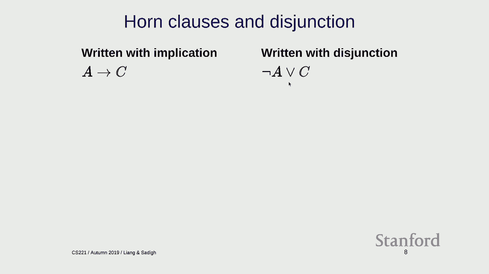

 I also wrote this last time。 This is just the just true I guess。

 I want to say definition but it's not really the definition because the definition is。

 the interpretation function but you can check the two by two truth table and this is true。

 Intuitively p implies q really just is the same as saying either p is false or q is true。

 If p is false then the kind of the hypothesis is false so it's irrelevant what q is and。

 if q is true then the whole same is true。

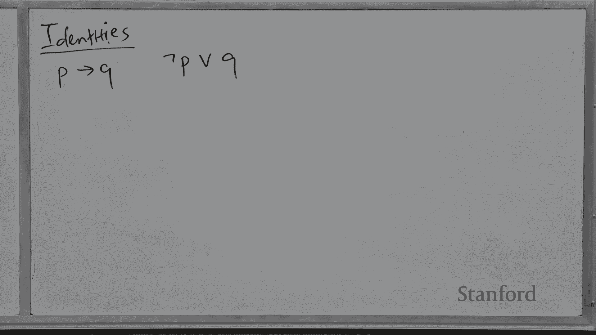

 Okay。 So what about this？ A， M and B implies C。 So I can write it as not A or not B or C。

 So this invokes another。

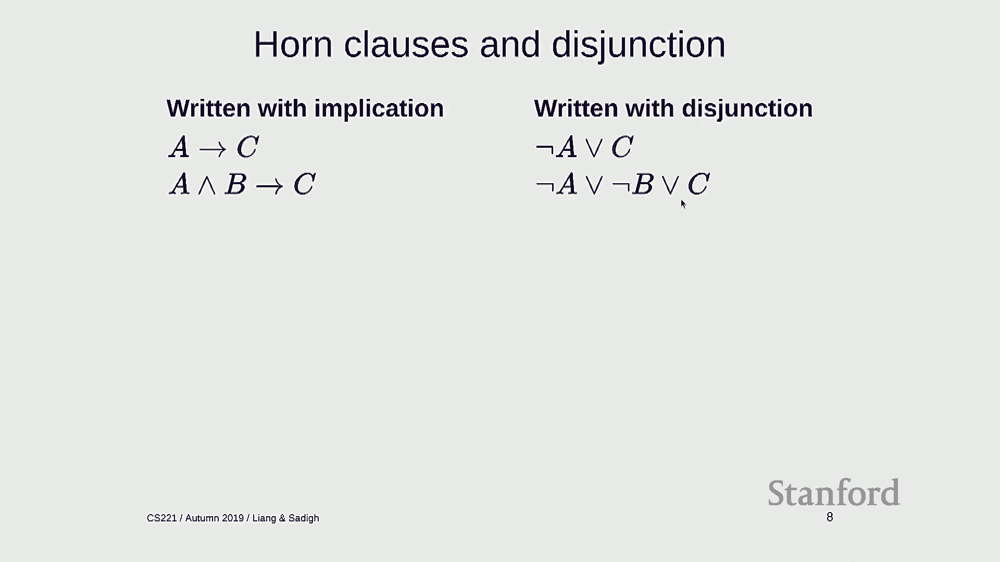

 identity so which is that if I have not of p and q that's the same as not p or not q。

 So and there's also another version which is p or q negated is the same as not p and not， q。

 So what I'm doing intuitively is pushing this negation past the connective into the propositional。

 symbols and when I push it past negation past and it flips to an or and when I push it past。

 an or it flips to an and。 And hopefully you guys should be comfortable with this because when you're doing programming。

 and you're writing if statements you should know about that。 Yeah。 >> [INAUDIBLE]， >> Yeah。

 so good question。

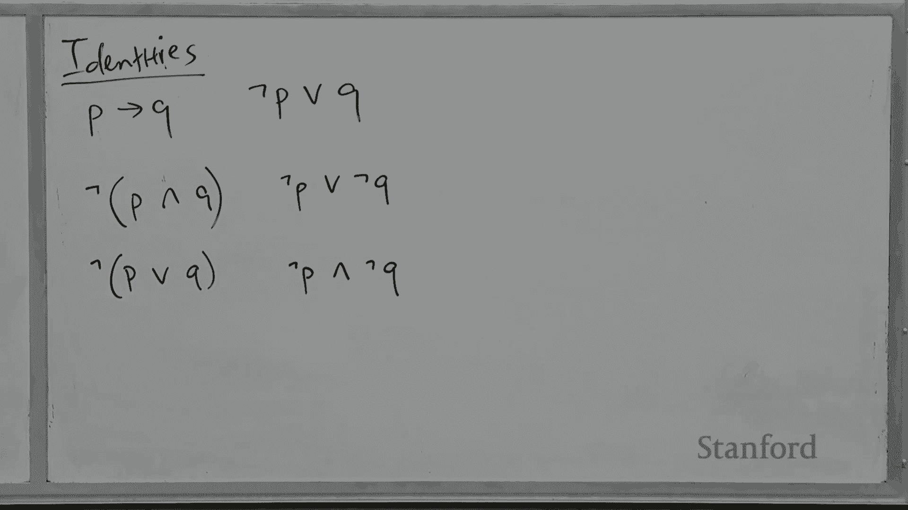

 So the word is the order of operations。 It's here it's A and B。 Parentheses implies C。

 Okay so if you apply the second identity on the board here you have A and B is not A。

 or not B and then you apply the first identity and that thing or C is the same thing over， here。

 Okay so now I'm going to introduce some terminology。 First is a literal。

 So this is going to be either a propositional symbol or it's a negation。

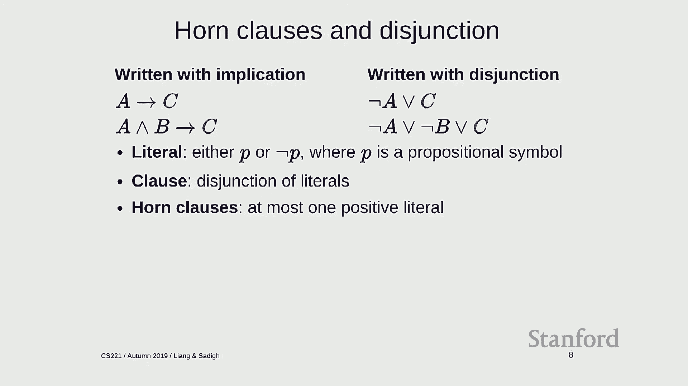

 There's a notion of a clause which is just a disjunction of literals。 So disjunction means or。

 So these things are all clauses。

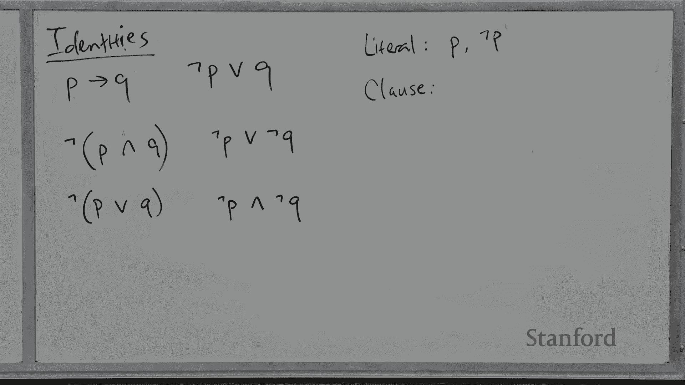

 And finally there is a particular type of clause called a horn clause which I introduced。

 last time but here I'm defining it kind of a different light here which is clauses that。

 have at most one positive literal。 Okay so in these clauses there is indeed only one positive literal so these are horn。

 clauses。 And remember from last time if you have snow or traffic appearing on the right hand side。

 then that has two positive literals which is which means it's not a horn clause。

 So now I can write modus ponens the following way。

 So A and A implies C which can be written as a disjunction allows me to derive C。

 And here is another intuition which is that I'm kind of effectively cancelling out A and。

 not A and I'm taking the resulting things and putting them on the bottom。 Okay。

 All right so now let's introduce the resolution rule。

 So general clauses could have any number of literals。

 So this is not a horn clause but it is a clause。 And the resolution rule for a particular example looks like this。

 So rain or snow and if you have not snow or traffic allows you to derive rain or traffic。

 So this is not a horn clause because I have two positive literals。

 And how do we intuitively understand what's going on？

 So you could say okay it's either rain or snowing and snow implies traffic which means。

 that it was it was it's snowing that I can get traffic but it was not snowing I still。

 have rain here so I can I can conclude it's either rain or traffic。

 So in general the resolution rule looks like this so you have a clause up here with some， P。

 population symbol and then you have the second clause with not P。

 And what you can do is you can cancel out P and not P and then you can take everything。

 else and then hook them up as a big you know clause。 Okay。

 So this is a rule I kind of sketchily argue that it's a reasonable thing to do but to。

 really formally verify that you have to check the soundness。

 And the way you do soundness remember how do you check soundness you go back to the。

 semantics and of proposition logic and you verify that that's consistent with what resolution。

 is trying to do。 So in this rule you have rain or snow the set of models of rain or snow is everything。

 that's not white here。 The set of models if not snow or traffic is everything that's not white over here and。

 when you intersect them you get the dark red and that represents where you think the state。

 of the world is if you only have the premises and if you look at the models of the conclusion。

 rain or traffic it's a screen area and you just have to check that what you derived is。

 a super set of what you know。 And again it might be a little bit counterintuitive but you should think about knowledge as restriction。

 Knowledge means that you actually have pinpointed the state of the world to be smaller。

 So this fewer color boxes you have the more knowledge you have。 Okay。 So this is sound。

 Completeness is another much harder thing to check。 Yeah question。

 You mentioned that we wanted to have a super set at the end not a subset but there's the。

 two top most room tiles for snow alone or snow room that are not there。

 Is that because we've eliminated snow？ This is， so why are these there？ This is。

 so this square is only true in rain or snow。 This is only true in not snow or traffic but remember the way to think about a knowledge。

 base is that the semantics is the intersection of all the four models of all the formulas。

 So when I've intersected the models of everything up here I'm only left with the dark red。

 There's one square in our final green zone that's not a part of the intersection。 There's。

 well there's two these two。 Yes。 Yeah。 And we allow for those because of the fact that we are。

 that it's our conclusion is rain， or traffic but I'm just sort of wondering when you're mentioning the super set versus subset。

 Why then the other two squares up on the first row were concluded？ So let's see。

 Why are the ones up here not included？ Because they're not part of the intersection。

 So is your question why are these squares not part of the intersection？ So they're not。

 let me clarify。 So if you only look at the premises up here， the set of models is this square。

 this square， and this square。 Then you look at the premises。

 sorry the conclusion and you look at the models independently of。

 the premises and you get these six squares。 So those six squares are not related to the two that we have beforehand。

 Yeah so this is， the green is just derived from the green here。

 Right so it turns out that resolution is also complete and this is kind of the big result。

 from the 60s that demonstrate that even a kind of a single rule can kind of rule of propositional。

 logic。 But you might say wait a minute， wait a minute。

 There's clearly things that this resolution rule doesn't work on because it only works， on clauses。

 So what if you have formulas that aren't clauses at all？

 So there's a kind of this trick that we're going to do is that we're going to reduce all。

 formulas to clauses。 So another definition that is important here is CNF。

 So it stands for conjunctive normal form。 So a CNF formula is just a conjunction of clauses。

 So here is an example of CNF formula。 Here's a clause， here's a clause and you can join them。

 So it's important to remember that， so just to refresh。 This is a CNF formula。

 It's a conjunction of clauses。 Each clause is a disjunction of literals and each literal is either a propositional symbol。

 or its negation。 So or is on the inside and is on the outside。

 And the one way to kind of make sure you remember that is a knowledge base remember is a set of。

 formulas but really it represents the conjunction of all those formulas because you know all。

 the facts in your knowledge base。 And so you can think about CNF formula is just a knowledge base where each formula is a clause。

 So we can actually take any formula in propositional logic and we can convert it into equivalent。

 CNF formula which I'll show in the next slide。 And once we've done that then we can use resolution and life is good。

 So the conversion is going to be just a six step procedure。

 And I mean it's a little bit grungy but I just want to kind of highlight the general intuition。

 So we have this formula。 So this is not a CNF formula but we're going to make it one。

 Okay so the first thing we want to do is we want to remove all the symbols that aren't。

 ands or ors or negation because those definitely don't show up in a clause or seeing that formula。

 So we can use the first identity on the board to convert implication into a not an or。

 You do that for the inner guy here and now you only have symbols that you're supposed， to have。

 The second thing is that remember the order in which these connectives is important for， CNF。

 So negation is on the very inside。 Negation is only allowed to touch a propositional symbol。

 Then you have or disjunction and then you have and。

 So we want to change the order so that that is true。

 So first we want to push negation all the way inside。

 This is using the Morgan's law so the first the second and third identities on the board。

 And so we push this inside so that now all the negation is on the on the inside。

 We can remove double negation。 You can check very easily check that that's valid。

 And finally so this is not us CNF formula。 It might look like one but it's not。

 If you turn your head upside down it's actually looks like a CNF formula。

 But the reason is that and is on the inside but it really should be on the outside。

 And to fix that you can actually distribute or over and which allows you to say this is。

 summer or bizarre and not snow or bizarre。 Okay， so now this is a CNF formula and then you're done。

 This is a general set of rules just to recap you eliminate bidirectional implication implication。

 to get the symbol inventory right。 And then you move negation all the way to the inside and you eliminate any spurious。

 negation that you don't need。 And then you move any or from the outside to inside the the end。

 So long story short take any propositional logical formula you can make a CNF formula。

 So without loss of generally we're just going to assume we have CNF formulas。

 The place that CNF or you might have seen CNF formulas come up is when you're talking。

 about in theoretical computer science when you're talking about threesat。

 Threesat is a problem where you're given a CNF formula where every clause has three symbols。

 and three literals and you're trying to determine if it's satisfiable and we know that to be。

 a very hard problem。 Okay， so now let's talk about the resolution algorithm。

 Remember there is a relationship between entailment and contradiction。

 So knowledge base entails F is the same as saying knowledge base is incompatible with， not F。

 Like F really， really must hold。 It's impossible that not F holds。

 So suppose we wanted to prove that F is derived from the knowledge base。

 What we're going to do is this proof by contradiction strategy where we're going to say insert not。

 F into a knowledge base and see if we can derive a contradiction。 Okay。

 so you add not F into a knowledge base， convert all the formulas into CNF and then。

 you keep on replying the resolution rules and you return entailment if you can derive false。 Okay。

 so here's an example of what this looks like。 So here's a knowledge base and here's a particular formula and I want to know whether KB entails。

 F or not。 Okay， so you add it， add not F into a knowledge base so that's not C and I'm going to convert。

 this into a CNF so that only affects the first formula here。

 And then I'm going to repeatedly apply the resolution rule。

 So I can take this clause resolution says allows me to cancel not A with A， I get B or。

 C and then I take B and not B cancel it out， C and I cancel out C。

 I mean when you see C and not C that's clearly a contradiction and you can derive false。

 Which means that the knowledge base entails F in this particular example。 Okay。

 this also maybe gives a little bit intuition of the mysteries of defining the goal clause。

 and horn clauses as deriving of blah blah blah implies false because you can add something。

 that you're trying to prove and you can use modus ponens to see if you can derive false。

 and if you do derive false then it's a contradiction。 All right。

 so as I alluded to before there's a time complexity difference between modus， ponens and resolution。

 So for modus ponens each rule application adds only as a clause with one propositional symbol。

 So imagine you have n propositional symbols you can really only apply modus ponens n times。

 So that's a linear number of applications there。 Whereas the thing with resolution is that you can add each rule application can add a clause。

 with many propositional symbols。 In the worst case you can imagine any subset of the propositional symbols getting added。

 and this results in the exponential time algorithm。

 This should not be surprising because we know that 3SAT is MP complete so unless there。

 is some magic here there's no way to kind of circumvent that。 Yeah？

 So the question is why is resolution preferred？ So you could just convert everything to CNF and check do backtracking search or whatever。

 on CNF。 Resolution turns out that it will have generalizations to first sort of logic which model。

 checking doesn't。 So remember there's two ways you can go about you can do basically reduce things to CSPs。

 and then you can solve it or you can try to use inference rules。

 So this inference rule doesn't as far as I know people don't really use resolution in。

 propositional logic but in first order logic you kind of have no choice。

 I'm thinking that when you see the modus equivalence inference rule it's kind of like everything。

 getting distilled down to relationships like sort of NAND and NOR the universal means。

 So I'm thinking that resolution is like a NOR reduction and modus equivalence is a NAND， reduction。

 So aren't the two， could you convert from one to the other？

 The question is whether the two are resolution looks like NAND。

 There's quite a bit of difference there。 Maybe we could talk about it offline。

 Okay so summarize there's two routes here。 You can say I'm going to use propositional logic with horn clauses and be using modus。

 ponens。 This is fast but it's less expressive or I can embrace a full complexity of propositional。

 logic and use resolution and this is exponential time。 It's slow but it's more expressive。 Yeah。

 [inaudible]， Right。 What do I mean by expressive？ I mean the latter which is that there's simply some things you can't write down in with using。

 horn clauses。 You can't write down rain or snow at all。

 Any sort of branching or disjunction you can't do in horn clauses。

 So in some applications horn clauses actually turns out to be quite enough。

 So these type of horn clauses show up in programming languages where you're just， you， know。

 you see some premises and you're trying to derive some other quantities so like in。

 program analysis。 This is actually quite useful and efficient。 Okay。

 So let's move to forced order logic。 So what's wrong with propositional logic？

 I mean it's already exponential time so it better be pretty good。

 So remember the point of logic is to in general from AI perspective is to be able to represent。

 and reason with knowledge in the world。 So there's a lot of things that we want to represent but might be awkward in propositional。

 logic。 So here's an example。 So Alice and Bob both know arithmetic。

 So how would you do this in propositional logic？ Well propositional logic is about propositions so this has two propositions which are statements。

 which are either true or false。 Alice knows arithmetic and Bob knows arithmetic。 Okay。 Fine。

 So what about all students know arithmetic？ How would you represent that？

 Well you probably do something like this where you say okay if Alice is student then Alice。

 knows arithmetic and Bob knows arithmetic and so on。

 Because all propositional logic can do is reason about statements。 So what about this？

 This is a gold box conjecture。 Every even integer greater than two is a sum of two primes。

 So good luck with that。 You might have to write down all the integers which there are a lot of them。

 So propositional logic is clunky at best and not expressive in the worst， what's missing。

 When we have knowledge in the world it's often more natural to think about there as being。

 objects and predicates on these objects rather than just opaque propositions。

 So Alice knows arithmetic actually has more internal structure。

 It's not just a single proposition that has nothing to do with anything else。

 It has notions of Alice and knows and arithmetic。 And finally once you can decompose a proposition into parts you can do fancy things with them。

 You can use quantifiers and variables。 For example。

 all is a quantifier that applies to each person and we want to do that inference。

 without enumerating over all the people or all the integers。

 Okay so I'm going to talk about first order logic going through our plan of first talking。

 about the syntax then the semantics and then inference rules。

 So I want to warm up with just some examples。 I'm not going to do as rigorous of a treatment of first order logic as propositional logic。

 because it gets more complicated and I just want to give you an idea of how it works。

 So Alice and Bob both know arithmetic。 This is going to be represented as knows Alice arithmetic and knows Bob arithmetic。

 So there are some familiar symbols like and and now the proposition of symbols have been。

 replaced with these more structured objects。 And all students who are know with metric gets mapped to this where now I have this quantifier。

 for all x student of x implies knows x arithmetic。

 Okay so a bit more formally so there's a bunch of definitions I'm going to talk about。

 So first order logic。 So in first order logic there's two types of things。

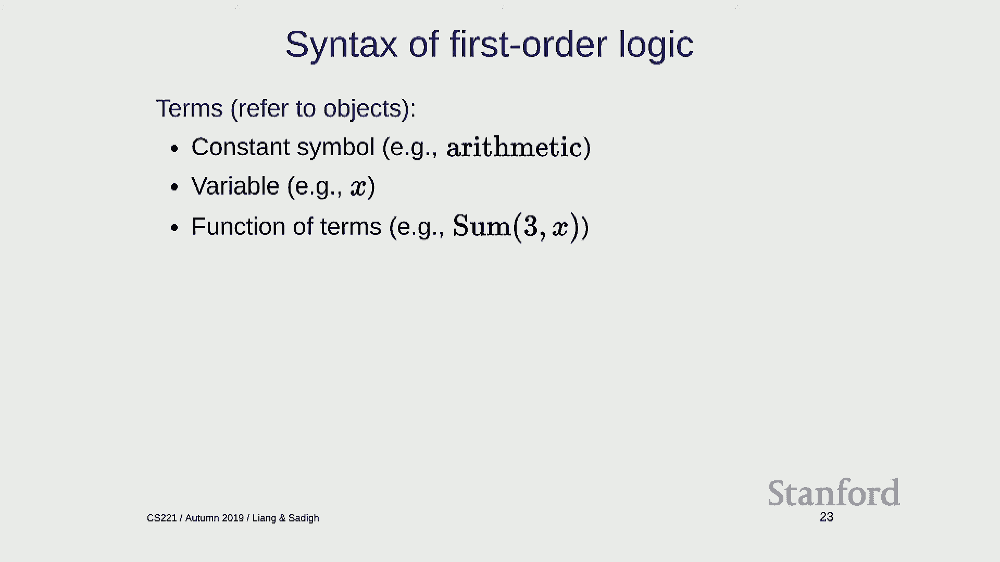

 There's terms and then there's formulas in propositional logic the only formulas。

 So terms are expressions that refer to objects。 So it could be a constant symbol。

 It could be a variable or it could be a function applied to some other terms。

 So for example arithmetic is a is just a constant。 It's a think about as a name。

 There are variables like x which I'll explain later and there's function of terms。

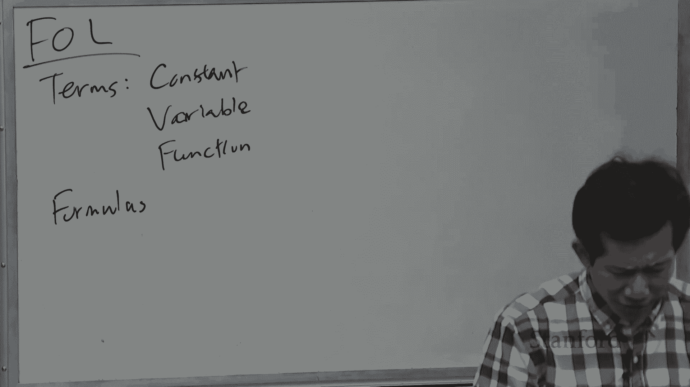

 So 3 plus x will be represented as sum of 3 and x。 Okay remember these are just symbols。

 And formulas refer to true values。 So there's atomic formulas or atoms。

 So this atomic formula is a predicate applied to terms。

 So knows x is a term arithmetic is a term therefore a nose is a predicate。

 So knows x arithmetic is an atomic formula。

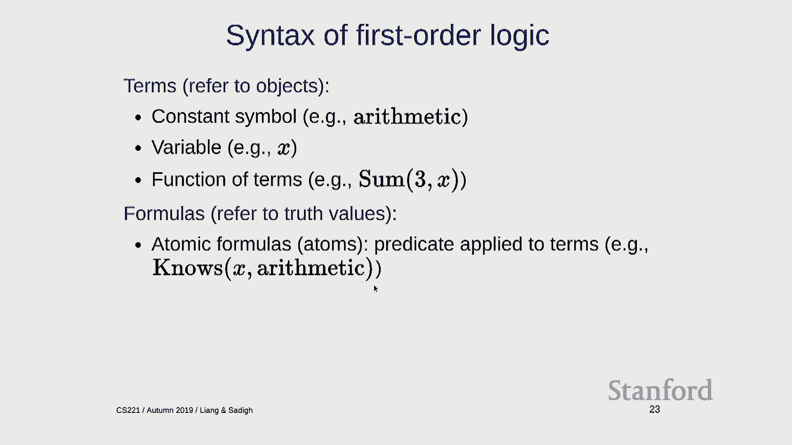

 So atoms are supposed to be indivisible but here there's a substructure here so maybe。

 you can think about these subatomic particles that that is useful。 There's a connectives as before。

 So what we're doing right now is you're taking these atomic formulas atoms and they behave。

 like propositional symbols。 So given these atoms or generalizations of propositional symbols we can string them together。

 using any number of connectives as we've done in propositional logic。

 And then finally we have quantifiers applied to formulas which means that if you have a。

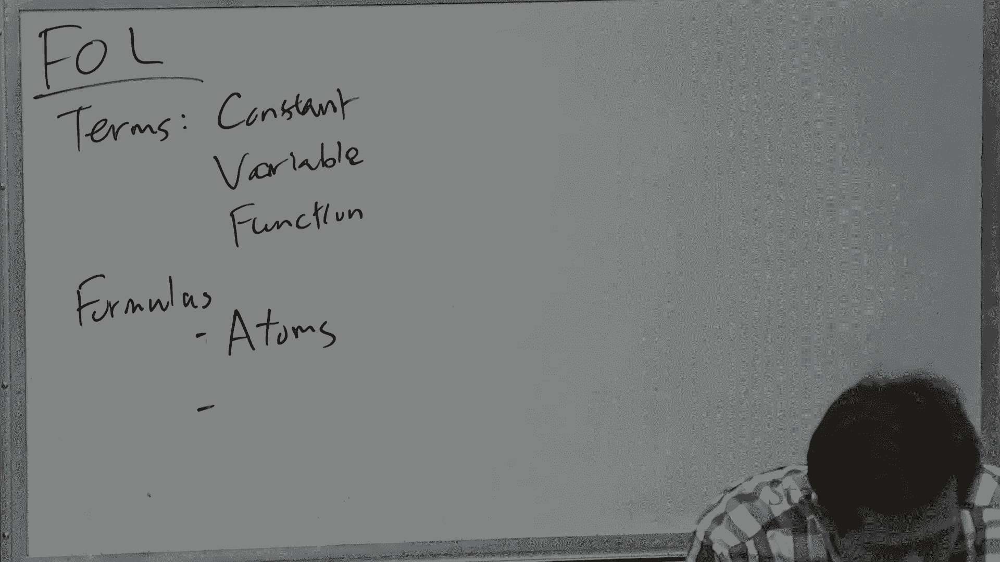

 formula with a variable in it we can stick a quantifier over these variables to specify。

 how the variable is meant to be interpreted。 Okay so you know connectives and quantifiers。

 Alright so let's talk about quantifiers。

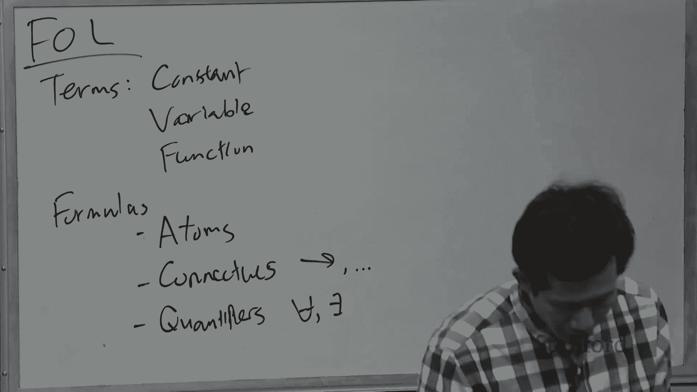

 Quantifiers are in some sense the heart of why first order logic is useful。

 There's two types of quantifiers universal quantifier and existential quantifier。

 So universal quantifiers you should think about as just glorified conjunction。

 So when I have for all X， P of X that's really like saying P of A and P of B and P of C and。

 for all the constant symbols。 And existential quantifiers like glorified disjunction when I say there exists X such。

 that P of X holds as like saying P of A or P of B or and so on。

 So I'm cheating a little bit because I'm only I'm still talking about the syntax of。

 first order logic but I can't resist but give you a little bit of intuition about what。

 the syntax means。 I'm not formally defining the interpretation function here but I'm just trying to give。

 you an idea of what the symbols correspond to。 So here's some properties。

 So if I push a negation through a universal quantification then that goes on the inside。

 and for all it becomes an exists does this sound familiar to people？

 What is the name for this kind of thing？ Yeah it's just a Morgan's law but applied for sort of logic as opposed to cross-show。

 logic。 And it's really important to remember that the order of quantifiers matters。

 So for all exists is very different from exists for all。 Okay so one more comment about quantifiers。

 It will be useful to be able to convert natural language sentences into you know first order。

 logic and on the assignment you're going to do a bunch of this。

 So this is kind of there's an important distinction I want to make。

 So in natural language you talk quantifiers in natural language are words like every or， some or a。

 And so how do these get represented in formal logic？ Every student knows arithmetic。

 Every generally refers to for all。 So you might write something like this。 So this is wrong。

 So what's wrong about this？ Sorry， say again？ Yeah so the problem is that what does this say？

 This says everyone's a student for all x， x is a student and for all x， x knows a written。

 So it's basically saying everyone's a student and everyone knows arithmetic which is different。

 So what it really should be is implication。 So for anyone that's not a student I don't care in terms of assessing the validity of。

 this formula and only if someone's a student then I'm going to check whether that student。

 knows arithmetic。 Okay so what about existential quantification？ Some new student knows arithmetic。

 this is student of x and knows x arithmetic。 So notice the different connectives in a general rule of thumb is that whenever you have universal。

 quantification it should be implication and whenever you have existential quantification。

 it should be an add。 So of course there is exceptions but this is a general rule。

 Okay so let me give you a few examples just to get you used to think about quantifiers。

 So imagine you want to say there is some course that every student has taken。

 So what and how is that？ So there is some course so there should be an exist y is a course that every student has。

 taken so every is a for all x and here I want student implies takes x， y。

 Remember exist usually has and and for all has implies。 Okay what about go box conjecture？

 Every integer is greater than greater than 2 is some of two primes。

 This is every even integer so every even integer greater than 2 implies that what about these？

 Is a sum of two primes so notice that there are no maybe explicit hints that you need。

 to use existential but the fact that these two primes are kind of underspecify means that。

 it should be exist so there is this y and z such that both of them are prime and the。

 sum of y and z is x。 And finally here is the statement if a student takes a course and the course covers a concept。

 then the student knows that concept。 Whether that is true or not is a different matter but this is a valid formula and it can。

 be represented as follows。 So one other piece of advice is that if you see word if that generally suggests that there。

 is a bunch of universal quantifications because if it is kind of like saying there is a general。

 rule and universal quantification says like in general something happens。 So this is for all x。

 all y， all z。 If you have a student it takes some course and that course covers some concept z then。

 that student knows that concept。 I guess technically there should be also and concept of z in there but it is getting complicated。

 Okay。 Any questions about first order logic？ What are the syntaxes and any of these intuitions that we are having for it？

 Yeah。 >> [INAUDIBLE]， >> So the question is why don't we just use the equal sign？

 So being a little bit cautious in following the strict syntax where you have functions。

 that just take， it shows you the structure of the logical expressions more。

 So now in certain cases you can use syntactic sugar and you can write equals if you want。

 But remember the point of logic is not to be able to write these things down manually and。

 a reason with them but to have a very kind of primitively built system of formulas that。

 you have general rules like resolution that can operate on them。

 Okay so let's talk about the semantics of first order logic。

 So in propositional logic a model was something that maps propositional symbols to truth values。

 In other words it's a complete assignment of truth values to propositional symbols。

 So what is this in first order logic？ So still we're going to maintain the intuition that a model is supposed to represent a possible。

 situation in the world。 So I'm going to give you kind of some graphical intuition。

 So imagine you only have unary and binary predicates。

 So these are predicates that only take one or two arguments。

 And we can think about a model as being represented as a graph。 So imagine you have three nodes。

 These represent two objects in the world。 So objects are kind of first class citizens in first order logic。

 And these are labeled with constant symbols。 So you have Alice。

 you have Bob and Robert and you have arithmetic here。

 And then the directed edges are going to represent binary predicates。

 And these are going to be labeled with a predicate symbols。

 So here I have a nose predicate that applies to 0103。 Another nose predicate that applies to 0203。

 And a unary predicate here that applies to only 01。

 So more formally a model in first order logic is a mapping that takes any， every constant。

 symbol to an object。 So Alice goes to 01， Bob goes to 02， or in the mid goes 03。

 And it maps predicate symbols to two pools of objects。

 So nose is a set of pairs such that the first element of pair， knows the second element of the pair。

 I'm skipping function symbols just from simplicity， but you would define them in， analogous as well。

 Okay， so that is a model。 It's a little bit more complicated than props to logic because you have to。

 define something for both the constant symbols and the predicate symbols。

 So now to make our lives a little bit easier， I'm going to introduce a restriction on a model。

 And it's motivated the following example。 So if I say John and Bob are students。

 then in your head you might imagine， well， there's two people， John and Bob and the book students。

 But there could be technically only one person whose name is both John and Bob。

 or someone who's anonymous and doesn't have a name。

 And there's two simplifications that rule out W2 and W3。

 So your unique names consumption says that each object has at most one constant， symbol。

 And the main closure says that each symbol has at least one constant symbol。

 So the point of this restriction means that constant symbols and。

 objects are in one to one relationship。 And once you do that。

 then we can do something called propositionalization。 And in this case。

 a first order logic is actually just a syntactic， sugar for propositional logic。

 So if you have this knowledge base and first order logic， student of Alice and Bob。

 For all students are people and there's some creative student。

 Then you can actually convert very simply into propositional logic by kind of unrolling。

 It's like unrolling your loops in some sense。 So we just have student in Alice implies person Alice。

 student Bob implies person Bob。 And because there's a finite set of constant symbols。

 it's not going to be an infinite set of formulas。 There might be a lot of formulas。

 but it's not going to be an infinite set。 Okay？ So the point of doing this is now you can use any inference algorithm for。

 propositional logic for first order logic。 Okay？ So if you're willing to make this restriction。

 unique names and domain closure， that means you kind of have direct access to all the objects in the world via。

 your constant symbols， in which case you're just propositional logic。 Okay。

 so why might you want to do this？ So first order logic as a syntactic sugar still might be convenient。

 You might still want to write down your expressions in first order logic。

 And have the benefits of actually having propositional logic where。

 the inference is in some sense much more developed。

 But later we'll see that there's some cases where you won't be able to do this。 Okay。

 so that's all I'm going to say about the semantics of first order logic。

 So now let's talk about inference rules。 Okay， so I'm going to start by talking about first order logic with horn clauses。

 And we're going to use some generalization of modus ponens。

 And then we're going to move to full on first order logic and。

 talk about the generalization of resolution。 Okay。

 so let's begin by defining definite clauses for first order logic。

 So remember a definite clause in propositional logic was conjunction of。

 propositional symbols implies some other propositional symbol。

 And now the propositional symbols are now these atoms atomic formulas。 And furthermore， we have。

 might have variables， so， we're going to have universal quantifiers on the outside。

 So intuitively you should think about this as a single template that gets real。

 If you were to propositionalize， it would be a whole set of definite。

 formulas in propositional logic。 So this， another way to think about this is that this single statement。

 is a very compact way of writing down what would be very cumbersome。

 in propositional logic because you would have to instantiate all the possible symbols。 Okay。

 so here's a formal definition。 So a definite clause has a following form。

 You start by having a set of variables which are all universally quantified。

 And then you have atomic formulas which are all conjoined， implies another atomic formula。

 And these atomic formulas can contain any of these variables。 Okay， so now let's do modus ponens。

 So here's a straightforward generalization of modus ponens。

 You have some atomic formulas a1 through ak that you pick up。

 And then you have a1 through ak implies b， and then you use that to drive b。 Okay。

 so it says the first attempt， so you might catch on the fact that this， actually won't work。

 so why doesn't it work？ So imagine you have p of Alice， and， then you have for all x。

 p of x implies q of x。 So the problem is that you can't actually infer q of Alice at all。

 Because p of x here and p of Alice just don't match。 This is supposed to be a1。

 this is supposed to be a1， and p of x and， p of Alice are not the same a1。

 So this is kind of an important lesson because you remember these inference rules。

 don't know anything， they have no kind of intrinsic semantics。 They're just pattern matching， right？

 So if you don't write your patterns right， then it's just not going to work。 But we can fix this。

 and the solution involves two ideas， substitution and unification。

 So substitution is taking a formula， applying a final replace to generate another formula。

 So if I want to replace x with Alice， apply to p of x， I get p of Alice。

 I can do two final replaces， x with Alice， y with z， and。

 I'm going to replace x with Alice and y with z。 And so in general。

 a substitution theta is some mapping from variables to terms。

 And substitution theta of f returns the result of just performing that substitution on f。

 So generates another formula with these variables replaced with these terms。 So pretty simple idea。

 Okay， unification takes two formulas and tries to make them the same。 And to make them the same。

 you have to do some substitution。 So it returns what substitution needed to do that。 Okay。

 so here's an example， nose， Alice arithmetic， nose， x arithmetic。

 These expressions are not syntactically identical。 But if I replace x with Alice。

 then they are identical。 So that's what unification does。 So what about this example？

 How do I make these two identical？ I replace x with Alice and y with z。 And what about this one？

 I can't do anything because I can only remember substitution only can replace。

 variables with other things。 It can't replace constant symbols。 So it can't replace Alice with bop。

 So that just fails。 And then things can get a little more complicated when you have functional symbols。

 So here to make these the same， I need to replace x with Alice。 And then y with f of x。

 but x has already been replaced with Alice。 So I need to make this y goes to f of Alice。 Okay。

 so to summarize， the unification takes two formulas， f and g， and returns a substitution。

 which maps variables to terms。 And this is the most general unifier。

 which means that if I unify x and x， I could also replace x with Alice and that would be fine。

 but that's not the most general thing。 I want to substitute as little as possible to make two things equal。

 So unify returns a substitution such that， and here's an important property。

 If I apply that substitution to f， I get identically the same expression as if I apply theta to g。

 And if I can't do it， then I just fail。 Okay， so now， yeah， question。 >> Can we say that f of x。

 like what should we say to f of x？ Is it a variable or is it a formula？

 >> So the question is f of x is this a variable or a formula？ So f of x， f is a function symbol。

 so it takes a term and returns a term。 So the technical term， f of x is a term。

 which represents an object in the world。 And you can check that， nose is a predicate。

 so it needs to take terms。 So f of x is a term。 Okay， so now with substitution and unification。

 we can now revise our， modus ponens to make it work。

 So I'm going to have a one prime through a k prime。

 which are distinct syntactically from a one through a k。

 And what I'm going to do is try to unify the primes and， the not primes into some substitution。

 And once I have the substitution， I can apply this to b and derive b prime。

 and that's what I'm going to write down。 Okay， so let me do go through this example now。

 So suppose Alice has taken 221 and 221 covers MDPs。

 And I have this general rule that says if a student takes a course and， a course covers topics。

 then that student knows that topic。 So I need to unify this takes Alice 221。

 covers 221 MDP with this abstract version。 And when I unify， I get the substitution to be x。

 it needs to be replaced with Alice， y with 221 and z with MDP。 And then I can derive。

 and then I take this theta， and， I apply that substitution to knows x， z， and I get knows Alice MDP。

 So intuitively， you can think about a one prime and， into a k prime， this is concrete knowledge。

 You have about the world。 This is a general rule。 So what the substitution does is it specifies how。

 the general variables here are to be grounded in the concrete， things that you're dealing with。

 And now this final substitution grounds it out， grounds this part into the concrete symbols。

 In this case， Alice 221 and MDP。 Okay， so what's the complexity of this？

 So each application of modus ponens produces an atomic formula。 Just one， not multiple ones。

 so that's the good news。 And if you don't have any function symbols， the number of。

 the atomic formulas is most the number of constant symbols to， the maximum predicate， everty。

 So in this case， if you have like 100 possible values of x， 100 possible values of y。

 100 possible values of z。 That would be the number of possible formulas that you might。

 produce is 100 to the third。 So， you can imagine this being a very， very large number。

 So it's exponential in the arity， but if the arity is， let's say two， then this is not too bad。

 It's not exponential。 So that's a good news。 The bad news from a complexity point of view is if there are。

 function symbols， then actually it's infinite。 Like it's not just exponential time。

 it's like infinite time。 Because the number of possible formulas that you could。

 produce is kind of unbounded。 And when we might have something like this， well， if you remember。

 one of the functions could be sum。 So you could have sum 1 and sum of 1 and sum of 1 and so on。

 So you can kind of essentially encode arithmetic using this， first order logic。 OK。

 so here's what we know。 So modus ponens is complete for first order logic with only。

 quarant clauses。 So what is completeness mean？ It means that anything that's actually true， that's。

 entailed， there exists a derivation， a way of applying， modus ponens to get there。

 But the bad news is that it's semi-decidable。 So first order logic。

 even when you restrict it to quarant， clauses， is semi-decidable。 This means what？ If f is entailed。

 forward inference using complete， inference rules， in this case， modus ponens， will eventually。

 prove or derive f in finite time。 Because it's complete， so eventually you'll get it。

 But if it's not entailed， we don't know。 We don't know when to stop， because it could go just。

 keep on going on and on。 And actually， no algorithm can show this in finite time。

 So this is a complexity throughout a result that says， it's not just exponential time。

 but there's no algorithm。 If you're familiar with a halting problem， this is very related to that。

 OK， so that's a bummer。 But it's not the end of the world。

 because you can still actually just run inference， and get a partial result。 So you might succeed。

 in which you know for sure， because it's sound that the f is entailed。 And after a while， well。

 you just run out of CPU time， and you stop。 And then you say， I don't know。 OK。

 so now let's talk about resolution。 So we've finished talking about first order logic。

 with restricted to horn clauses。 And we saw that modus ponens is complete。

 There's a small wrinkle that you can't actually compute， everything that you hope for。

 but that's life。 And now we're going to go to resolution。

 So remember that first order logic includes non-horn clauses。 So here's an example。 So this says。

 all students know something。 And the fact that this exists here。

 remember existential quantification， is glorified disjunction。

 So this is like our example of snow or traffic。 So what do we do with this？

 So we're going to follow the same strategy， as what we did for propositional logic。

 We're going to convert everything into CNF。 And then we're going to repeatedly apply the resolution。

 rule。 And the main thing that's going to be different。

 is that we have to handle variables and quantifiers， and use substitution and unification。

 But the structure is going to be the same。 So the conversion to CNF is a bit messy and gross。

 and slightly non-intuitive。 I just want to present it so you know what it looks like。

 So here is an example of not a CNF formula。 So what does this say？ Just to practice， this says。

 for all x--， so if anyone who loves all animals is loved by someone。

 And what we want to produce is the final output， is this CNF formula， which again， CNF。

 means a conjunction of disjuncts。 And each disjunct is atomic formula。

 or atomic formula that's been negated。 And here we see some functions that。

 have emerged called scollum functions， which I'll explain， later。 And that's basically it。

 So we have to handle variables。 And we're going to have to handle somehow。

 And the way we do this is we remember， there's no quantifiers that show up here。 And by default。

 everything is going， to be universally quantified， which。

 means that the existential quantifiers have to go away。

 And the existential quantifiers get converted， into these functions。 All right， so part one。

 So there's again the sick--， or I can't remember-- 6 to 8 step procedure。 We start with this input。

 What is the first thing we want to do？ We want to remove all the symbols that， don't。

 shouldn't show up。 Get our symbol inventory correct。 So we eliminate implication。

 This is the same as before。 So here is this thing implies this thing。

 And we replace that with not that the first thing， or not the second thing。

 So now the expressions are more gross， but it's really the same rule that we identity that we were。

 invoking before。 We do that for the inner expression。 We push the negation inwards。

 So it touches the atomic formulas， and eliminate double negation。 So this is all in old news。

 And something new here is we're going， to standardize the variables。

 So this step is technically not necessary。 By standardizing variables， I just。

 mean that this y and this y are actually different。 It's like having two local variables。

 and two different functions。 They have nothing to do with each other。

 Because we're going to remove a quantification later， I'm just going to make them separate。

 So this y gets replaced with a z。 OK， so now I have this。 I'm going to replace x essentially。

 quantified variables with column functions。 So this requires a little bit of explanation。

 So I have exists z loves z of x。 And this existential is on the inside here。

 So of this universal quantum freak-hire fire。 So in a way， z depends on x。 For every x。

 I might have a different z。 So to capture this dependency， I can't just drop exists z。

 What I'm going to do is I'm going， to capture the dependency by turning z into a function。

 And the same thing happens over here。 I have exists y。 And I replace this lowercase y with a big y。

 that depends on the variables that are universally， quantified outside this scope here。 Yeah？

 [INAUDIBLE]， Just running。 So loves all animals is on the--， I guess the first part。

 So everyone who likes all animals is loved by someone。 So this is the someone part。 Oh。

 I'm just going to make this y for animal y。 How that changed for you can call it for any business。

 Because here I push the negation inside。 Yeah。 Yeah。 So remember when I push negation past for all。

 it becomes a exists。 OK。 So now I can distribute or over AND to change。

 the order of these connectives so that because in CNF， I want a conjunction of disjuncts。

 not a disjunction， of conjuncts。 And finally， I just ditch all the universal quantifiers。 OK。

 So I don't expect you to follow all that in complete detail。

 but this is just giving you a basic idea。 OK。 So now we're ready to state the resolution rule。

 And this should look very familiar。 It's the same resolution rule as before。

 but now all of these things are not， propositional symbols， but atomic formula。

 And now this is not P and not P， but P and not Q。 Because these in general might be different。

 and I need to unify them。 And then I would take the substitution returned。

 by unification and I'm going to apply it on the result。 It's the same way we did for modus ponuts。

 So here's an example of this。 I have animal or loves。 And over here， I have not loves or feeds。

 And what do I do？ I try to unify this love with this not loves， and I get this substitution。

 So U has to replace with Z of x and V with x。 And that allows me to cancel these now。

 Now I've made them equal。 And now I take the remaining parts， and I apply the substitution。

 So this feeds U of V becomes feeds Z of x and x。 OK？ So there's a bit more intuition I can provide。

 but this does become a little bit abstract， and you just kind of have to trust。

 that resolution is doing its job。 I personally find it kind of difficult。

 to look at intermediate stages of logical inference。

 and really get any intuition about individual pieces。 But that's why you define the principles。

 prove that they're， right， and then you trust that logical inference does， the right thing。 OK。

 to summarize， we've talked about propositional logic， and first order logic。 So for inference。

 in propositional logic， you could just do model checking， which。

 means that converted to a CSP and solve it。 In first order logic， there's no way。

 to enumerate all of the possible infinite models， so you can't do that。 But in certain cases。

 you can propositionalize， and you can reduce first order logic。

 to propositional logic in certain cases。 Or you can stick with inference rules。

 And if you stick with inference rules， you can use modus ponens on the horn clauses。

 Or if you don't want to restrict to horn clauses， you can use resolution。

 And the only thing that's different about first order， logic here is a plus plus， which means。

 that you have to use unification and substitution。 OK， final takeaway is there's a lot。

 of kind of simple manipulation and details here， but I wanted to kind of stress the importance of logic。

 as expressive language to represent knowledge and reason， with it。

 And the key idea in first order logic is the use of variable。

 So these are very not the same notion of variables， as in CSPs。

 Those variables are propositional symbols， which， are like the simplest thing in logic。 So in logic。

 first order logic， we've kind of gone up， of a layer in the expressive hierarchy。

 And variables here allow you to give compact representations， to a very rich thing。 So again。

 you don't remember anything。 Just remember the takeaway that logic allows。

 you to express very complicated and big things， using kind of small formulas。 OK， so that's it。

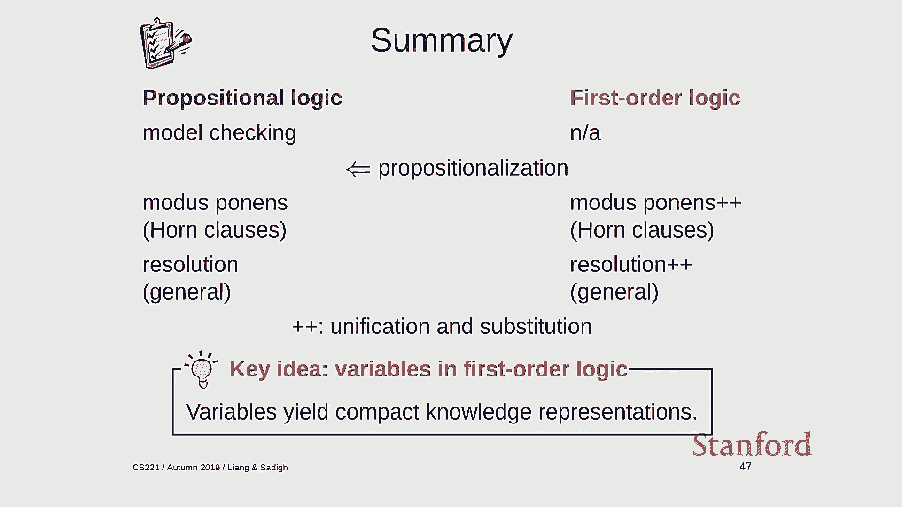

 On Wednesday， we'll be giving a lecture on deep learning。

 And there's one-- and then we have the poster session， after Thanksgiving。

 And then the final lecture will give that will sum everything up。 So OK。

 I will see you at the poster session。 And good luck on the exam。 [ Silence ]。

