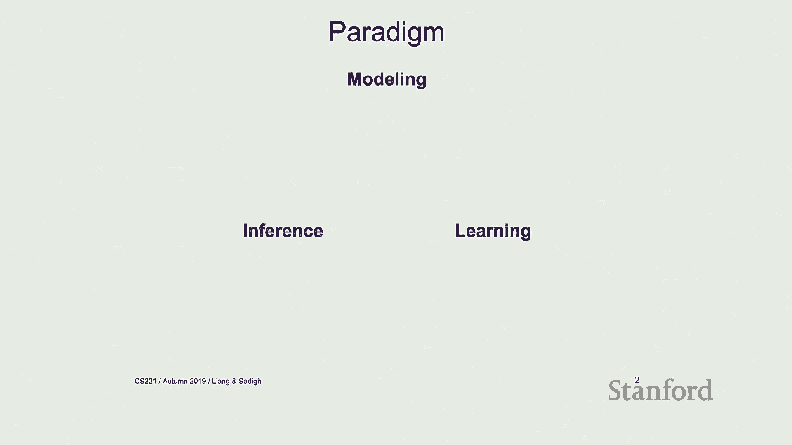
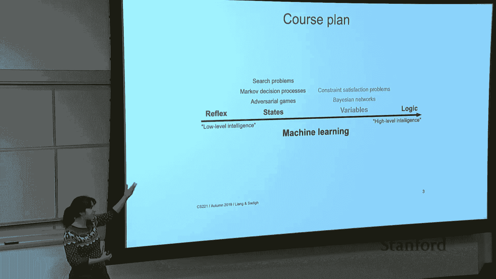
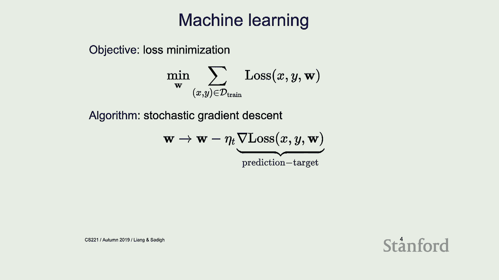
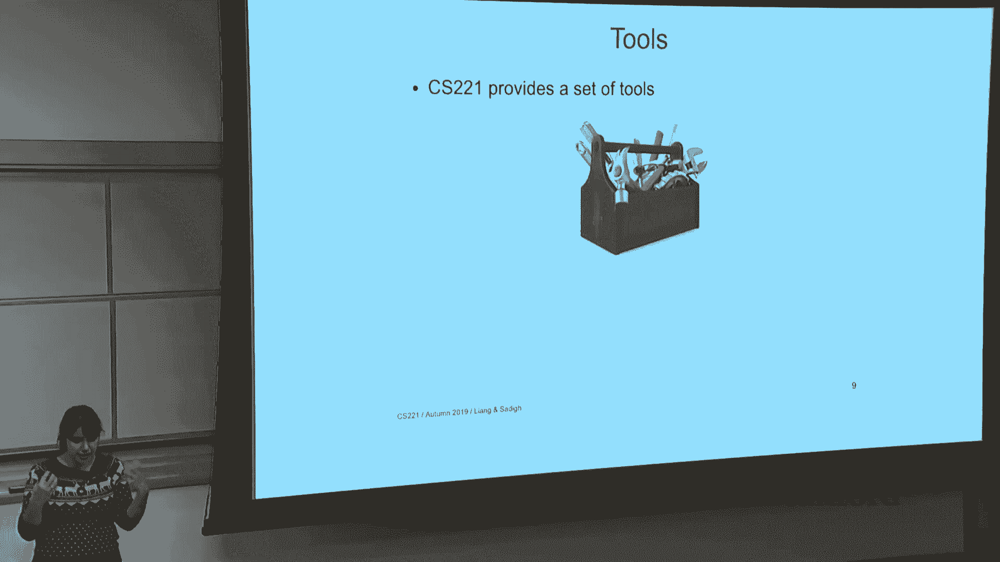
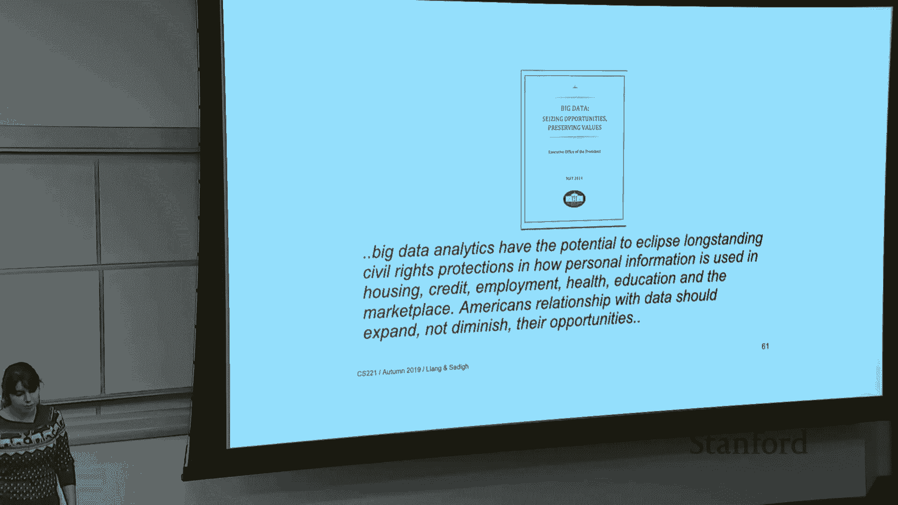

# P19：Lecture 19 Conclusion - 鬼谷良师 - BV16E411J7AQ

 Welcome to the last lecture。

 It's a smaller group of people today。 So yeah， so just a quick announcement。

 The project reports are due next Friday， so just make sure that you return those。 And yeah。

 poster session was awesome， so I showed up for a little bit of it， but the。

 posters that I saw was really amazing and I really enjoyed talking to the groups I talked。

 to and good job on all the projects。 It was great。

 We were going to have a best poster award thing too and we're going to announce that。

 on Piazza later。 So just an announcement on that。 All right。 Cool。 So let's conclude the lecture。

 So CS221。 So the plan for today is we're going to do a quick summary of what we have talked about。

 So general summary of the class， like all the things that we have learned。

 And then I want to talk a little bit about some of the next courses that you might want。

 to take after taking 221。 If you were in 229， I know in the morning they went over a bunch of next courses from。

 the perspective of 229， all the AI courses， one would want to take。

 We're kind of doing a similar thing here。 But from the view of 221。

 what would be some of the next courses that would be good to take。 And then after that。

 I want to talk a little bit about the history of AI。 We did this in the first lecture。

 so it would be a little bit of review of that。 So then I want to talk a little bit also about some of the next directions that might be。

 interesting to think about。 And some of the research that is done currently in various topics of sub-topics of AI。

 And what are some of the problems that people are struggling with？

 So it would be fun to think about that。 And if you're interested in any of that。

 you can go do research in that area or take classes， in those particular areas。

 So that's kind of the plan for today's lecture。 It's going to be shorter than usual。

 So I think it's going to be probably an Irish。 Okay。 All right。

 So let's talk about the summary of the class。 So we started the class talking about this paradigm of modeling inference and learning。

 So we started thinking about how there exists a real world problem。

 You're going to pick up a real world problem。 And we're going to do modeling。

 So modeling would be an abstraction of that real world problem。 And in general。

 we are interested in reasoning about that real world problem， like finding。

 the shortest path or solving some sort of optimization about that problem。

 And we call that inference。 So we had a model of the world。

 And then we would do inference reasoning on that model。

 And the idea of the learning part of the lectures was that， well， our models are not。

 going to be perfect， right？ You're not going to be perfectly model everything in the world。 Instead。

 we might have a partial model。 And in addition to that。

 we might have some data around the world and around the things， that are happening in the world。

 So we would like to use that data to learn about the model and kind of complete our model。

 So this was kind of the common paradigm through the class。 And this was the topics that we covered。

 We started with machine learning and we treated machine learning as a tool that allows us to。

 better learn these models， parameters of these models。

 And then we talked about various levels of intelligence in the course， right？

 So we started with reflex-based models， then we increased the level of intelligence a little。

 bit， talked about state-based models， variable-based models， and finally logic。

 So let me briefly just remind you of some of these topics。 So in machine learning。

 kind of the common thing that we started looking at was this idea， of loss minimization。

 So we have some data， we have some training data， inputs and outputs， x and y's。

 And then we defined some sort of loss。 We looked at different types of loss functions and properties of these loss functions。

 And then the idea was we would want to minimize this training loss for the hope of generalizing。

 to a new scenario， right？ For the hope of， if I get some sort of new input。

 I would be able to give the best output possible， with respect to that。 So in general。

 I would like to minimize my test error。 But one way to go about that is to minimize this training loss based on some set of variables。

 that we have in our model。 And the approach that we followed for that was using techniques like a stochastic gradient。

 descent。 So this would be the most common thing one would want to do。 So we have this loss function。

 How do I go about optimizing it？ I take the gradient and move in the negative direction of the gradient。

 So stochastic gradient descent was commonly used when we were doing loss minimization。

 So these two things， like writing out the loss， minimizing it and doing something similar。

 to stochastic gradient descent， this was kind of common across a lot of different machine。

 learning algorithms that we use throughout the course。

 And we applied that to a wide range of models。 So we would apply this to all sorts of models that we had in reflex-based models or state-based。

 models。 It was kind of the same framework throughout。 So in the first set of lectures that we had。

 we started talking about reflex-based models。 The simplest form of which was these linear models。

 If you remember regression， we would have this regression classification。

 We had these linear models， linear classifiers。 And we just wanted to learn the parameters of that。

 And a more complex version of that are things like neural networks or deep neural networks。

 or even like nearest neighbors would be an example of these reflex-based models。

 And what was inference？ Well， inference was pretty easy when it came to these things。

 Inference was just a feed-forward run of your model and that would give you the output。

 So we weren't doing that much hard work when it would come to inference。 And in terms of learning。

 well， we looked at stochastic gradient descent。 We looked at other things like alternating minimization as a way of learning these models。

 So that was reflex-based models。 Then increasing the level of complexity。

 they started talking about state-based models。 And the key idea that I want you guys to remember from the state-based models is the。

 idea of a state。 What is a state？ A state is a summary of all past actions that is sufficient to choose the future actions。

 optimally。 And then we spent a good amount of time thinking about how to define a state。

 like how to pick， a good state， and how to do this modeling when it comes to state-based models。

 And we looked at things like search problems or we have deterministic systems。

 We looked at things like MDPs when we were playing against nature。

 We have a little bit of stochasticity。 And then we looked at things like games where we were playing against some other intelligent。

 agents。 So there was some other intelligent agent that's coming in and playing against us。

 And in terms of inference， we looked at a couple of really cool algorithms。

 We talked about uniform cost search and AS star。 We talked about dynamic programming。

 value iteration， mini-max。 So we covered a set of number of different ways of intelligently looking at these models。

 and doing inference。 And when it came to learning， we looked at structured perceptron， Q learning。

 TD learning， reinforcement learning in general。 Like those were some of the learning algorithms that we applied when it came to state-based。

 models。 Okay？ So that was state-based models。 Then we moved the level of complexity and intelligence a little bit higher。

 And we looked at things like variable-based models。

 And the idea of variable-based models was that the ordering of these states doesn't really， matter。

 It's just the relationship between them that matters。 And we defined things like factor graphs。

 So if you remember the math coloring example， we defined a factor graph around it。

 And the idea was there's this graph that the graph structure that here captures the conditional。

 independence between different variables that we have。

 So the different variables in this case was these different provinces。

 And then you would want to color them differently。

 And the relationship between them is going to be represented by a factor。

 The two types of models we discussed in this setting were constraint satisfaction problems。

 and Bayesian networks。 Bayesian networks were in the case where we have probabilistic relationships。

 And we talked about inference， specifically backtracking， forward backward beam search。

 and we were thinking about the idea of sampling as various ways of doing inference on these。

 algorithms。 And when it came to learning， we looked at things like maximum likelihood and EM to try。

 to do learning on these types of systems。 And then finally。

 the last few lectures we've been talking about logic。

 So pushing the level of complexity just a little bit higher and thinking about formulas。

 like actual， logical formulas that represent intelligent things about your system。

 So the key idea of logic is we're going to have these powerful formulas that are going。

 to represent powerful， meaningful things about your system。

 And we talked about things like prepositional logic and first order logic。

 And we talked about model checking， which is commonly used in satisfiability。

 We talked about modus ponens， resolution， as various types of inference algorithms that。

 could be used when you have logic。 And we didn't really talk about learning when it comes to logic。

 And I would say this is kind of like an open question still。

 Like how do you combine ideas from learning and ideas from logic and get the best of the。

 both worlds？ So there are ways of combining them。 But how do you ensure that they're getting best of both worlds。

 like from data driven ways， of looking at things and model based way of looking at things？

 So what did CS221 give us really？ The CS221 is this class where it gives us a set of tools to look at the world and think。

 about difficult problems in the world and pick the right models。

 And then pick the right way of formulating that problem and the right inference algorithm。

 to go about solving them。 So I would say it's pretty much like we covered a lot of material。

 So we covered a breadth like pretty broad set of set of topics。

 And the idea of it is to know that you have all these tools and you can pull out these。

 tools and you can go deep in any of them。 But the goal of CS221 was to just give a broad view of what is artificial intelligence。

 and what are some of these tools that we would have。

 So but if you're interested in going a little bit deeper in any of these topics that we've。

 discussed in the class， there are a good number of classes that you can take。

 And I want to just briefly mention some of them and overview of some of these courses。

 So I would categorize the classes， the next classes that you can take into two main categories。

 You can take foundational classes that you go deeper in some of the foundational things。

 we were talking about。 Or you can take application classes where you go deeper in the specific applications。

 like natural language processing， vision， robotics， the specific applications that we。

 kind of briefly covered in this class， but we didn't go that deep in。

 So if you're interested in foundational classes， some of these other AI based classes are things。

 like probabilistic graphical models。 So to 28， if you're interested in machine learning。

 there's to 29 and to 29t。 There is the deep learning class。

 If you're more interested in the optimization side of things， there is convex optimization。

 decision making on their uncertainty。 And also if you're interested in logic side of things。

 then there's this logic and AI， course。 And also there's a big data class too that if you're interested in that。

 So I'm going to go a little bit deeper in some of these courses， but this is just more。

 of an overview of some of the foundations and next courses that you might be interested， in taking。

 And all of these are also posted on the AI website， so AI。stanford。edu/courses。

 So that's foundations。 But if you're interested in more on the applications side of things。

 there's a good number of courses， around natural language processing。

 I'm going to go again a little bit deeper in some of these courses。

 And then there's a good number of courses around vision， good number of courses around， robotics。

 There's also this other course around general game playing， which would be fun to take if。

 you're interested in that side of things。 All right。

 so let me just briefly mention like one slide on some of these courses that。

 I think would be good courses to take after this class。 So one of these is CS228。

 So CS228 is a probabilistic graphical models course。

 If you remember the variable base models part of the lecture， this would be kind of the。

 next course that goes deeper in that。 So we talked about algorithms like forward backward。

 variable elimination。 But if you take 228， you'll be talking about more general type algorithms like belief。

 propagation， variational inference， Markov-Chey Monte Carlo and so on。

 And another thing that 228 is going to cover is in variable base models， like the way we。

 treated things was the model was given， the structure was given to us。 You would say， well。

 this is an HMM。 And given that it's an HMM， I'm going to do these extra things on it。 But in 228。

 you would actually be thinking about learning the structure， learning the。

 right structure to put in， and how to think about these different variables and the relationships。

 between them。 So if you want to go deeper in that， that would be the course to take。

 Another interesting course to take， and some of you might have already taken it， is the。

 machine learning course。 So in this class， the way we treated machine learning was just as a tool。

 Like we had a few lectures on it， and we just learned about machine learning just enough。

 for us to do some of the things we want to do in this AI course。

 But it's definitely broader than what we have discussed in the class。

 And some of the ways that it is broader and more general than what we have discussed in。

 the class is， first off in this class， we talked about discrete actions and discrete time discrete。

 action and state type systems。 229 is going to cover a more broader set of models where you actually thinking about。

 continuity a little bit。 We talked about linear models。 221 will talk about kernel methods。

 decision trees， boosting， bagging， feature selection。

 like all these sorts of different types of algorithms and models that are going to go。

 beyond what we have discussed in this class。 We talked about k-means。

 They're going to talk about more broader set of clustering algorithms like mixture of， Gaussian's。

 PCA， ICA， all these sorts of things。 So a really useful。

 good class to take if you want to just learn more on the machine learning， side of things。

 More from a practical perspective。 If you're more interested in the theoretical side of machine learning。

 there is this other， course called 229(t)。 So this is statistical learning theory。

 And this is going to actually think about the mathematical principles behind learning。

 So it doesn't necessarily cover the particular algorithm， but it's going to cover like properties。

 mathematical properties around that algorithm。 Things like uniform convergence。

 Let's say you have a predictor and you want to make sure that that predictor with high。

 probability is going to have some bounded error。 How are you going to bound the error of that？

 How are you going to bound the test error with respect to the training error and some。

 properties of your predictor？ Or how would you formalize things like regret of your learning algorithm？

 So thinking about complexity， thinking about putting bounds， convergence， regret， these are。

 going to be the topics that will be discussed in the statistical learning theories， CS2 2019。

 So if you are more theoretically minded， I think this would be a good course to take。

 So now thinking more on the application side of things。

 So a couple of good applications of AI after this course are things around vision and LP。

 and robotics。 So those would be the three main applications that you might want to consider going deeper。

 in if you're interested in any of these areas。 If you're interested in vision。

 there are a good number of classes around vision。 There are a lot of interesting tasks around vision。

 Some of them are more solved and some of them are more research-y。 Things around object recognition。

 detection， segmentation， but also things like activity， recognition。

 If you have different frames of a video of a soccer game， how would you predict where the。

 ball goes？ How would you predict where the person goes in the next few frames？

 That's actually a pretty difficult problem， doing activity recognition from just frames， of images。

 So if you're interested in some of these problems from the vision perspective， I would recommend。

 taking 231 type classes。 So robotics would be another interesting application to look at。

 So in robotics in general， we are interested in problems around manipulation and navigation。

 and grasping。 So the main application that you might think about or things around self-driving cars。

 medical robotics， assistive robotics。 And the interesting thing that robotics brings is that there's a physical system sitting there。

 So you're putting your AI algorithm， the things you have developed in this class and。

 some stuff beyond it on this physical system， physical robot。

 And you need to deal with things like continuity， you need to deal with things like uncertainty。

 And you need to deal with physical models that could come from kinematics and control。

 So there are a lot of interesting robotics classes。

 So I think intro to robotics is offered next quarter with some KTVs teaching it。

 But there's also a new robotics series course that just came out。

 So this is the robot autonomy one and two。 So advertisement for myself。

 I'm teaching this next quarter with Marco Povona and Jeanette Boke。 So this is robot autonomy two。

 robot autonomy one was already offered in the fall。

 And the idea of robot autonomy one is to just cover the different layers of the robotic stack。

 And at the end of the day， they actually have this project。

 It's really cool project where you have a robot platform and you have a light door on top of it。

 And you want this robot to just move around in a fake city。 So if you're interested in。

 I think the project， the project presentations is not already done。 So if you're interested。

 you can show up to do random and see how these robots are moving around。

 But they basically have this fake city where this robot just navigates around in this fake city。

 and does autonomous driving。 So you can see a picture of a bicycle in the back where the robot needs to detect it。

 And the bicycle is actually moving。 So the robot needs to detect it and do obstacle avoidance。

 do coordination， and with other agents around it in this particular environment。

 So that next robot autonomy one。 In robot autonomy two， which is offered in winter。

 what we want to do is， you want to put a manipulator on top of the robot。

 So we are looking at mobile manipulation where we actually have an arm。

 and we have this arm pick up objects and blocks and put them on top of each other。

 and do interactions。 So the class is two big chunks of the class out of four。

 is focused on interaction with the world， with the physical world。

 and interaction with other agents。 So there are interesting multi-agent。

 like game theoretic questions that could come up， and you have multiple robots trying to interact with each other。

 So ideas from games could come up there like naturally。 All right， so that was robotics。

 And then another interesting application is natural language processing。

 And natural language processing is particularly very interesting， because if you think about it。

 the world is continuous。 But the words that we are using are discrete。

 And these discrete words have continuous meaning。 So there's a lot of mismatch between the fact that we have discrete words。

 and continuous world。 And we need to use these words to describe the discontinuous world。

 And there are very interesting questions and challenges that arise in NLP。

 around compositionality and grounding。 And if you're interested in these types of tasks。

 I think there are a lot of， again， interesting tasks that are more solved。

 versus less solved and more researchy around NLP。 So if you're interested in any of them。

 I would recommend taking classes like 224。 So some of these tasks are around machine translation。

 Let's say text summarization， dialogue， some of them are much harder。 Text summarization， dialogue。

 those sort of things。 So-- and we had a couple of homeworks around this too。

 So if you're interested in going deeper in that， I do recommend taking NLP classes。

 So those are some of the foundation and more application， courses that I would recommend taking。

 I want to briefly mention two other courses too that are not necessarily directly， in AI。

 but they're in the neighboring field that would be still interesting to look at。

 One is looking at cognitive science。 So cognitive science in general looks at how human mind works。

 And it's one of those fields that kind of grew together with AI， right？

 Like cognitive science and AI， they kind of started together and they went their race。

 but they still tend to inform each other。 And there's a group of cognitive scientists who are looking at computational cognitive science。

 And they use ideas like Bayesian modeling and probabilistic programs。

 when they look at cognitive science。 So there's this course， Psych 204， which is cross-listed。

 CS428。 I think Noah Goodman teaches this usually。 And I think this would be a great course to take if you're interested in the cognitive science。

 side of things。 And it would have ideas and topics from other cognitive scientists like Josh Tan and Mom。

 and Tom Griffith and Noah who are working in this particular area of computational cognitive。

 science。 So that's one。 But if you think about cognitive science as kind of the software here。

 neuroscience， on the other hand， is the hardware of the problem。

 So another neighboring field that you might be interested in looking in a little bit deeper。

 is neuroscience。 And if you think about neural networks。

 like back in the day when they first started， like when people first started looking at neural networks。

 they were kind of thinking， of them as computational models of brain。 But today's neural networks。

 modern neural networks， aren't really biologically plausible， in any way， right？

 So they're not really models of the brain。 But still， they're interesting。

 They're interesting connections and insights that could be used in neuroscience from the。

 perspective of AI or from AI to neuroscience。 So I do recommend taking kind of cross-section neuroscience courses with AI。

 I think Danny Amings would be someone who works in this area if you're interested in looking。

 deeper in courses around neuroscience。 All right。 So that was kind of a quick summary of what we have discussed so far in the class。

 What are some next courses you're interested in taking？ I think deeper around them。

 if you're interested in learning more around them， just come chat， with me。

 I'm around if you want to talk about them。 But for the rest of the class。

 what I want to do is I want to just do a quick history， of AI again。 And then after that。

 let's just talk about what are some of the problems？ What is left？

 We've talked about all these cool algorithms， tool sets。 But what is difficult？ What is not solved？

 So I want to spend a little bit of time on that。 So let's talk about history of AI。 All right。

 So birth of AI。 So we talked about this during the overview lecture。

 This was the first lecture we came in and we were like， okay， how did AI happen？

 So the birth of AI really， like people refer to it as this workshop that happened in 1956。

 This was a summer school in Dartmouth。 And basically everyone famous in the field showed up to this workshop。

 including people， like John McCarthy， Marvin Minsky， Cloud Channon。

 All of these people showed up to this to the summer school。

 And the reason for the summer school was to kind of understand the general principles。

 of intelligence。 So what they really wanted to do was they wanted to figure out all the features of intelligence。

 and if they could formalize that， they could go ahead and like simulate that and have。

 simulate intelligence。 That is what they really wanted to do。

 And the workshop was really useful because after that， these people went back to arrays。

 and then started doing really cool stuff。 And this was the first rise of AI。

 And we started seeing things like problem solving type systems， things like Samuel's Checkers。

 program which was able to kind of beat a strong amateur level player。

 We started seeing other types of problem solving programs like fewer improvers。

 And people started really using logic as a way of thinking about AI and thinking about。

 problem solving。 So that was really exciting because people at the time were thinking they have just solved。

 everything。 It was exciting， logic was there。 Like people had all these cool programs。

 They were super excited about the potential that these systems can bring。

 Here are some of the quotes from people around that time。 Things like。

 "Machines will be capable within 20 years of doing any work a man can do。"。

 So this is what Herbert Simon said。 Marvin Minsky said， "Within 10 years。

 the problems of artificial intelligence will be， substantially solved。 Cloud-channing said。

 "I visualize a time。 Then we will be robots， what dogs are to humans。

 and I'm rooting for the machines。"， So none of these really happened。

 But one thing to notice is these are not random people on the street。

 These are like fathers of the field。 These are people who were in it。 They were looking at。

 they had a lot of insight in terms of what we can do and what we can't， do。

 And it's kind of interesting that even them， they had all this overwhelming optimism and。

 this did not pan out。 So there was a lot of optimism here and we started seeing really underwhelming results。

 So lots of optimism。 Government came in。 Government was like， "Here's my money。 Take my money。

 Go do stuff。"， And basically， the problem that government was really excited about was machine translation。

 So they wanted to take Russian texts and translate that。

 And the outcome of that was something like this。 So the translation is， "The wild cut is good。

 but the meat is rotten。"， So that's not really a good translation of that text。

 And people started feeling like these types of problem solving algorithms are not going， to do it。

 And then at that point， then the government cut funding and this was the first winter of， AI。

 So we had the rise of AI with problem solving with that summer school。 Lots of excitement。

 And then it didn't really work when it came to machine translation。

 And then we had the first winter of AI。 The only thing that I want to point out is you're at a good place for AI right now。

 I would say AI right now is also pretty overhyped。 And then I wanted to put this code here。

 So this is from Roy Amara who says， "We tend to overestimate the effect of a technology。

 in a short run， but actually underestimate the effects of it in the long run。"。

 If you think about any system， any technology that we have developed， it's always like， "Oh。

 within two years it's going to solve everything。"。

 And it's not going to solve everything within two years。

 And if you look at what it has achieved in 20 years， it's actually achieved a lot of。

 things and we usually underestimate that。 And I think it's the same thing with AI。

 We are going to think， "Well， we're going to have autonomous cars tomorrow，" or by 2020。 Actually。

 autonomous car companies were saying， "We're going to have autonomous cars by 2020。"。

 And I first started working on that。 That's next month。

 I don't think we're going to have autonomous cars by 2020。

 But we are going to see a lot of advances。 We are seeing a lot of improvements in terms of the algorithms and the systems that we。

 are developing。 So I think in general we should be aware of that and we should be smart about it。

 Sure， AI is over hyped， but what can we do to actually address some of these problems？

 And going back to this first era of AI， this problem solving era， well， why didn't it， work？ Well。

 the reason it didn't work was we had limited computation， we had limited information。

 This is the thing that we actually started this class off。 We said， "Well， a lot of AI algorithms。

 they haven't changed that much。"， But the thing that has changed over the years is we have lots and lots of computation。

 we， have lots and lots of data， and that's the thing that has really made a bigger difference， here。

 And that's kind of one of the reasons that it didn't work。

 But even though we had these problems and we had this first winter of AI， there were。

 lots of interesting contributions from that era。 The list programming language came out around that time。

 garbage collection came out that， time， time sharing。

 really interesting foundational ideas of computer science emerged during this， period。

 And also this key paradigm that we are using in this class， thinking about separating modeling。

 and inference that actually came out around the same era too。

 The fact that we should have this declarative model thing and at the same time this procedural。

 inference algorithm kind of separated out from each other and think of them as separate。

 things is a huge contribution that came out around that time。 All right。

 so that was kind of first up and down of AI。 The second rise of AI was around 70s and 80s。

 This is when the knowledge based systems came out， the expert systems。

 And I would argue that the reason that we had the second rise was people started thinking。

 about AI differently。 Like originally people wanted to build artificial intelligence because they were interested。

 in intelligence。 They were interested in understanding intelligence。

 That's kind of what the summer school was about。 But at this point people were not interested in intelligence。

 but they were interested， in was just building really useful systems that can do things。

 Like they didn't care about intelligence at this point。

 And that's why we had this rise of expert systems。

 Or we think about logic and we think about using domain knowledge to have things like。

 if the NELF type statements， like if we have a premise then we have some sort of conclusion。

 And building these expert systems allows us to do a lot of cool tasks in the real world。

 So like we had actual impact around this time on things like inferring molecular structures。

 like diagnosis of blood infections， things like converting customer orders into parts。

 and specifications。 So actual applications in the world。

 people started taking each of them and thinking about。

 the expert knowledge that you have in that particular application and formulating that。

 in these expert based systems and then putting an AI on top of it that does actual work。

 So that was really cool。 So the contributions of this era is that first off we had real applications that actually。

 impacted industry。 And this domain knowledge， the idea of I'm going to pick the domain knowledge and this。

 knowledge is actually going to help me make exponential growth was the thing that was really。

 powerful at this time。 But why didn't it work？ It didn't work， right？

 This was the second rise and we had another winter， the second winter of AI。

 So the second winter of AI came because there was a bunch of problems。

 One of the problems was knowledge in general， it's not deterministic， right？

 Like we have a lot of uncertainty when we think about knowledge and these systems were。

 not able to encode uncertainty the way we want it to be。 And in addition to that。

 there was a lot of information， right？ If you think about any of these expert based systems。

 that requires a lot of manual efforts， to write down these rules and all these relationships between all these different sub parts of the。

 system。 So an example of that is Shred Lu。 So Shred Lu is one of the first national language understanding programs。

 computer programs。 This was written by Terry Winograd， who's at Stanford now。

 I think this was when he was at MIT。 And he created this computer program where you have this block world environment in it。

 And you can actually have a person that interacts with this computer program and maybe the person。

 says pick up a big red block and the computer says okay because the computer understands。

 what the relationship between big and small and red and different colors and where the。

 blocks are placed and what can be picked and what cannot be picked。

 So this had a whole bunch of relationships and rules around it and you could actually。

 converse something with this computer program。 And that was really powerful。 But even Terry himself。

 a couple years after， had the statement talking about his worries， about how Shred Lu。

 like programs like Shred Lu are not going to solve the problem。 They're not going to go all the way。

 Like he was saying this is kind of a dead end in AI and thinking about these complex interactions。

 there's just a lot of them。 And it just doesn't seem feasible to write down all these rules that you would have between。

 each one of your sub parts with other sub parts。 And there's no easy footholds。

 So at this point people were thinking this complexity barrier is not going to really。

 allow these AI systems to do cool big things。 So then we had the second winter of AI。

 And then finally， this is the third rise of AI that you're still on and God knows where。

 it's going to come down again。 This is a modern view of AI that started around 1990s。

 And I would argue that this modern AI， the reason that we had this new rise， is due to。

 two main things。 One is the idea of using probability in AI。

 This was not a thing that existed from early on。 This is actually due to efforts of Judea Peril。

 who was very adamant about using Bayesian， networks in AI to model uncertainty。

 So finally people were able to use probability to bring ideas from probability to model。

 uncertainty。 Because if you remember expert-based systems， they were super deterministic。

 We didn't really have a way of talking about uncertainty。

 But Judea Peril's idea was let's bring probability in this， let's actually talk about uncertainty。

 and let's have our models and make predictions。 And then the second reason is machine learning。

 So people started inventing support vector machines to tune parameters。

 And then from that point on we started seeing the rise of neural networks and the fact that。

 we have lots and lots of data now and that can actually help us build better models。

 So given that we have these two big new viewpoints and in AI， we have started seeing all these。

 new advances。 And one point that I just want to make at the end of this is that AI is really a melting。

 pot of a bunch of ideas from different fields。 Not all of these are from pure AI。

 If you think about Bayes rules， it comes from probabilities。 These squares come from astronomy。

 first order logic， both from logic， maximum likelihood， from statistics。

 we have ideas from neuroscience， econ， optimization， algorithmic algorithms， theory， control theory。

 like you think about value iteration that came from bullman， from， the field of control theory。

 So it's really like if you think about artificial intelligence， it just brings all these different。

 ideas from these different fields together to solve this AI problem。 And in general。

 I think it's a good idea to be mindful of that and to be open to that。

 because the new insights and ideas really come from having this broader view of things。

 And kind of the boundaries we put between different fields are really superficial and。

 don't really need to be there。 So that was the history of AI， right？ Like rise of AI， downfall。

 rise， downfall， and then we're on this last rise now。

 So let's just think a little bit about what have we achieved， what are the cool things。

 we've had in the past couple of years。 And then what can go wrong and what should we worry about？

 Okay。 All right。 So I think I've argued enough that AI is everywhere， right？

 Like AI is being used in consumer service and advertising in whole-scale transportation。

 manufacturing， and AI is going to make decisions now， right？

 Because it has shown all these advances and because of that， we're using AI these days。

 to make decisions for us， to make decisions for our education， to make decisions for credit。

 employment， advertising， healthcare， all of these different applications。

 So if AI is making decisions， then we should actually be really careful about how AI is。

 making decisions and the fact that we should think about all the possible things that could。

 go wrong or could not go wrong and understand the system fully before making it make decisions。

 for us。 So what are some of the advances？ So one huge advance that we have seen in recent years is this Google neural machine translation。

 So the idea is this was kind of a huge advance when it comes to machine translation。

 The idea is you could have a bunch of different languages and you can have a way of translating。

 let's say from Korean to English and English to Korean。

 You can have a lot of data on that and that would be great。

 And then maybe you can have Japanese to English and English to Japanese and train on that。

 and that's a lot of data and that's all great。 But then even if you put all of that data in the same like in a melting pot。

 then what， you can do is you can actually go from Korean to Japanese without having any data that just。

 goes directly from Korean to Japanese and that's kind of exciting because you had no， data for that。

 And if you're putting all of these together， then you can actually make a lot of advances。

 in terms of language translation。 So this came out around 2016。 Lots of excitement。

 language translation just became so much better after that。 There are still problems though。

 Here is one of them。 So here is the problem of bias。

 So let's say that you're starting from a language like Hungarian that doesn't have gender and。

 then you start from this language and then you go to English， a language that has gender。

 and this is a translation that you're going to get。

 You're going to get she is a nurse and he's a scientist and she's a baker and then of。

 course he's a CEO。 So you're going to get all these gendered protests here that there's no reason for just。

 by looking at it and assuming that the algorithm is neutral， there is no reason for it to pick。

 up these particular genders。 But the reason that it's picking up these genders is this algorithm is trained on data。

 Our data is biased。 If our data is biased， the algorithm has learned to pick up pick up patterns so it's。

 going to pick up these bias and sometimes even reinforce it。

 So we're going to see all sorts of these weird behaviors。 I wouldn't say it's weird。

 It's biased behavior but we should actually be aware of this if you're building these types。

 of systems。 And even in addition to bias， bias I can explain it。

 You might get weird behaviors that are even harder to explain so you might have a text。

 that looks like this like dog dog dog dog dog and then that could be just translated。

 to something else that is kind of crazy。 So understanding what goes on。

 a lot of times with these kind of closed form black box systems。

 are a little challenging and I think there's a lot of research around trying to better。

 understand and give transparency to some of these systems and understand what goes on。

 So that was language or that was translation。 Another example is image classification。

 So image classification has just become so much better over the years。

 Around 2015 it just hit human performance。 So we have image classifiers that are just much better than humans and that is amazing。

 That is really exciting because perception is a difficult problem。

 If I can do image classification then I can use these systems in real world like systems。

 like my phone or my autonomous car and that's really exciting。

 But there are again a lot of issues around this。 One of the issues we actually discussed this in the first lecture is the idea of having。

 adversarial examples。 So I can have AlexNet a system that does image classification and AlexNet is going to classify。

 these images on the left perfectly fine。 It's a school bus， it's a temple。

 it's going to classify them correctly。 But then what I can do is I can add some sort of noise to them and when you add this noise。

 to this picture you're going to get this third picture and that kind of looks like a school。

 bus to me。 I can't tell the difference between the first and third picture。

 But what's going to happen is that AlexNet is going to predict ostrich for all of the。

 pictures on that side on the right。 So that's not great， right。

 having these adversarial examples it's not that great because the system， is not really robust。

 right， your AI based image classifier is not very robust when it。

 comes to just adding these sort of adversaries。 And after this work came out basically people started writing all sorts of papers about how。

 to create adversarial examples and how to be robust towards that particular adversarial。

 example and then breaking that again and creating more robustness and a lot of back and forth。

 One of my favorite papers actually around this area came out this year。

 So this is from Shamir and others and what they have shown is for a specific type of。

 neural network when you have Ray-Ouze， what they have shown is what you can do is you。

 can always make the system classify the number in this case as something else。

 So let me give you a concrete example。 So this is an MNIST dataset， I have numbers in it from 0， 1。

 2， 3， 4， I have 10 numbers， here， right。 And what Shamir and others have shown is you can pick this 7 and you have 10 classes。

 So you need at most 11 pixels， so pick 11 pixels， they pick the 11 pixels carefully。

 so it's not any 11 pixels but pick 11 pixels and change it as much as their algorithm tells。

 you and then the 7 is going to be classified as 0。

 So you can make this 7 be classified as any of these numbers 0， 1， 2， 3， 4， 5 and 6， 7。

 and 8 and 9 by just picking the right 11 pixels to modify。 And they tell you how much you modify。

 It's just crazy because give me anything， I'll create this adversarial example for you。

 to just misclassify it as something else and you only need 11 pixels because there are。

 10 classes here。 So there are a bunch of assumptions that I haven't really discussed here。

 One of the assumptions is the way you are modifying these pixels is unbounded in this， picture。

 So the greens and reds are just very high and very low。 So it is not actually between 0 to 255。

 It's numbers greater than 255 and less than 0。 But they've actually shown that if you have more than 11 pixels。

 let's say you have 20， pixels， you could actually fit it between 0 to 255 to make it a realistic figure。

 Anyway， so lots of work around this。 Lots of exciting theory work and practical work thinking about adversarial examples when。

 it comes to images。 But yeah， what are the implications of this？ Why are we so scared of this？

 Because these systems are going to run on our phones doing image recognition on our cars。

 doing recognition of other vehicles and they can easily be attacked。 Group at Berkeley。

 Don Tsang's group， what they did was they had these stop signs and， they put stickers on stop signs。

 Again， the stickers are at the right place， like the place they wanted it to be。

 But then the stop signs are now classified as like a speed limit sign， which is not what。

 you want your autonomous car to detect。 Or here's another example。

 another work where you have these pictures and you put these funny。

 glasses on them and when you put the glasses on the pictures， then they are classified as。

 a celebrity's pictures。 So you can easily attack these systems， not easily。

 but you can attack them systematically， attack these systems and that can actually affect the security of your vehicle or your。

 image recognition system。 All right， another example that's pretty challenging is around reading comprehension。

 So what is reading comprehension？ So if you remember your SAT or GRE like type of type exams。

 you have a text， you have a， lot of text and you have to read that text and you have to answer questions。

 So you have a question like this。 So the number of new Huguenot colonists declined after one year。

 So this is the thing you've got to answer。 So Google put out the system BERT。

 which is actually really amazingly you can do this， reading comprehension。

 And BERT can answer this question perfectly。 It's going to say 1700 and that's great。

 But what people have shown is you could actually just add an extra sentence at the end of this。

 text that has nothing to do with the rest of the text， like something to do that has。

 a wordier in it， but it doesn't have to do anything with this particular question that's。

 asked and now BERT is going to respond 1675。 So you can again easily trick these systems and the way they're tricked is just not the。

 same way that humans are tricked and that is， I guess， weird to people。

 That's kind of expected but that is something that you're dealing with these days。 All right。

 so another example， so I'm basically going to talk about a bunch of examples throughout。

 the rest of the lecture。 So another example I wanted to briefly talk about is this idea of optimizing for clicks。

 So is that a good thing？ Is that the thing we should be doing？

 So sometimes the objectives that we have， the reward function we are writing for our， system。

 we know what it is， we want to do machine translation， we know exactly what。

 we want to do and it's very clear。 But sometimes it's actually not clear what we should be optimizing。

 If Facebook or say wants to make money， should they optimize for clicks？

 Is that an ethical reward function to put in？ And what could be some of the effects of optimizing for clicks？

 Let's say that I have a reinforcement learning algorithm， I'm making this up。

 Let's say I have a reinforcement learning algorithm that wants to optimize for clicks。

 and I have my own Facebook account and it's optimizing clicks from Dorset。

 So this reinforcement learning algorithm， what it can do is it can learn that， well， maybe。

 if I show outrageous articles to Dorset， Dorset is more likely to click on these outrageous。

 articles and then I'm going to get more rewards because I'm optimizing for clicks。

 So that's all good， right？ That's expected。 But another thing that the reinforcement learning algorithm by itself can figure out is that。

 if I show outrageous articles to Dorset， Dorset is going to become more and more outrageous。

 and then I'm going to get more clicks because then I'm going to show more articles and it。

 will be great。 And then that's kind of amazing because these systems are not interacting in a closed loop。

 world， they're interacting with other systems like humans who are also changing， who are。

 also adapting and the systems through this RL algorithm by itself could figure out how。

 to change me to like more outrageous things and then we would end up in a situation where。

 we are right now with very bipolar views， right？ Because you're optimizing for clicks。

 So it's quite interesting to think about what are the objects we should be optimizing。

 and what world are we dealing with？ We are not always like in a Pac-Man world where we can control everything。

 right？ Like usually these systems are running in a real society where there are people being。

 affected by them and their responses are going to change and the changes in their responses。

 is going to affect things even more。 So it's interesting to think about these feedback loops。

 And speaking of humans， I think another thing and another question that comes up usually。

 when it comes to robotics or when it comes to AI is， well， what is it that humans want？ In general。

 even in the case of robotics is a big problem。 I have a robot arm and I want my robot arm to pick up this object。

 That's all I want， right？ This is the thing that me as a human wants， right？

 I want the robot arm to pick up this mobile phone。 So back in the day。

 this was called good engineering， right？ Good engineering was good engineers would write down the correct reward function。

 the， correct objective and the robot arm would go and pick up the object and everything would。

 be great。 The problem is that doesn't always work， right？

 It's really hard to write the correct reward function and get the robot do that。

 And because of that， people， you say， are more interested in trying to do things around。

 imitation learning or things around preference-based learning where you just try to learn from。

 how humans do it， like how a human would do this as opposed to just a human sitting down。

 and saying， well， this is the objective I want you to pick up the robot arm because。

 the robot might end up doing very weird things。 An example of that commonly comes up is this vacuum cleaner example。

 Let's say you have a vacuum cleaner。 You have a robot vacuum cleaner that wants to clean your house。

 And your objective for the vacuum cleaner is to suck up dirt。 That's all it needs to do， okay？

 So you write your objective， everything is great。 And one way that the vacuum cleaner could suck up dirt is it could just go to a place。

 suck up dirt， put it out， suck up dirt， put it out， suck up dirt， put it out， and。

 just keep doing that， right？ Obviously you didn't want your vacuum cleaner。

 You don't want that vacuum cleaner because you didn't want your vacuum cleaner to do， that， right？

 That wasn't the thing you were thinking。 But the objective of go suck up dirt could end up in that behavior。

 Another behavior you could end up with is you could have your vacuum cleaner and your。

 vacuum cleaner by itself could just break its own sensors so now it doesn't sense dirt。

 Now you're good because there are no dirt around us because you can't see them。

 I'm going to close my eyes so I can't see the dirt so I'm not going to suck up anything。

 So all of these are things around reward hacking。 If you just write the reward function that you think the robot should optimize。

 it's， not necessarily going to work。 And thinking about what are some good objectives that should optimize is actually a really。

 difficult problem。 And this is something that I'm very interested in and my group will focus on that a lot。

 Actually another work that has recently came out on this is this work by this new book。

 by Stuart Russell on human compatible。 And basically what Stuart is kind of arguing is the fact that there is a mismatch between。

 what humans actually want， what is the reward function that's in their head and then what。

 is it that the AI system or the robot thinks the human wants。

 And then those two are not always the same thing and that could cause a lot of issues， around it。

 So interesting book take a look。 All right， what else can go wrong？ So generating fake content。

 that was the thing that came out a couple years back。

 So you could create videos that just or images that look exactly like Obama in this case。

 And you can just put fake content on that。 And that again raises an ethical question。

 Just because you can build it， should you build it or not？ We can build that。

 We have the system to create fake content。 It sounds fun。 But should we do it？

 Just because we can do it。 Another place that this question comes up and I do encourage you guys in general to think。

 about that in your future。 You can build something but you do build it。

 And another place that comes up is in autonomous weapon systems。

 So thinking about military and thinking about having autonomous weapons。

 We can have autonomous weapons these days。 We can have systems that automatically detect an enemy and automatically just do the job。

 We can do the task。 So should we do it？ Should we have autonomous weapons systems？

 Or does there need to be a person in the loop？ Just thinking about it。

 Let's say that we do not want to have autonomous weapons systems and we always want to have。

 a person in the loop。 Well why？ What is it about the person that we want to be in the loop？

 That kind of tells us that there is something about the person， maybe it's empathy， maybe。

 it's something about what people know or what people have that the autonomous system doesn't。

 have yet。 And just understanding that I think by itself is a very interesting problem。

 And there's a whole debate around this。 Like autonomous weapon systems。 Should we have them？

 If we don't have them， what if other countries have them？ Like how do we go about it？

 Should we put a moratorium on it？ And lots of debates around these types of systems。

 So in general I do encourage you to think about some of these ethical aspects of building。

 AI systems。 All right。 Next stop fairness。 So fairness is a big problem。

 I think a lot of you know this already， right？ So we might have a classifier that。

 like your majority of data set perfectly separates， your majority of data set。

 such as the picture in the left。 And then you might have some data points from minority group and the classifier just does。

 exactly the opposite thing for the minority group。 So if you put all these data together。

 then you're probably going to get a classifier that， looks like the first one。

 And it's just not going to work on the minority data set。 And that is kind of a big problem。

 especially when it comes to applications like， let's say， health care。

 You might have different populations and a drug might just act very differently on different。

 populations。 And the question is how should we address these fairness questions。

 And one way to go about it is to think about our errors。 So you might have two classifiers。

 And both of them might give you 5% error。 But one of them could give you 5% random error。

 And the other one could give you 5% systematic error。

 And I think it's pretty important to think about if you're getting systematic error or。

 random error and what type of error on what population are you getting。

 And that could address some of these questions around fairness。

 There's a lot of work actually around fairness these days。

 There's a conference around it around fairness， accountability， and transparency。

 This is worked by more its heart。 So if you're interested in these。

 take a look at some of the work from our group。 Another example of fairness。

 I think we did talk about this in the overview lecture， is， around this criminal risk assessment。

 So North Point is a company that put out the system called Compass。

 And what Compass does is it predicts if a criminal is going to reoffend or not， the risk of a。

 criminal reoffending or not。 And it's going to give a score of 1 through 10。

 So that's what the system does。 And they put out the system。 This system was actually being used。

 And what happened was ProPublica， which is a nonprofit， came out and did a study。

 And ProPublica showed that given that an individual did not reoffend， African Americans。

 were twice likely to be wrongly classified 5 or above。 So that just seemed not fair。

 So ProPublica puts out this article being like， well， the system is not fair。 Why are we using this？

 Like it doesn't satisfy this fairness criteria。 And then North Point actually did further studies。

 North Point did further studies and they showed that， well， they said， well， no， our system。

 is fair because we're looking at this definition of fairness。

 Our definition of fairness is that given a risk score of 7， 60% of whites reoffended and。

 60% of blacks reoffended。 So we want to make sure that we get the same percentage to be fair。

 And that's our fairness， fairness property。 We do satisfy that。

 And these two fairness definitions made a group of researchers from Stanford， Cornell。

 a bunch of different places to start thinking about definitions of fairness。

 And what they've actually shown is that these two definitions of fairness， they are not。

 going to be satisfied at the same time。 They're always going to go against each other。

 You can't have both of them at the same time。 So then if that is the case。

 then what is the right definition of fairness that we should， use？

 If you can't have both of those at the same time， then how do we make sure that we can。

 use this system？ Or should we ever use these systems again？

 So lots of interesting questions about formalizing fairness。

 Omar Rangold here in the CS department works a lot around the ideas of fairness from the。

 algorithmic side of things。 So if you're interested in that， you can take Omar's classes。

 learn about that。 And then kind of going back to this idea of our algorithm's neutral。

 When you talk to people who haven't taken necessarily algorithm classes or AI classes。

 they usually think， well， yeah， right， algorithms got to be neutral。 They got to be neutral。

 But actually， you've seen already， they're not really neutral because by design， you really。

 want our algorithms to pick up patterns。 That's what they're good at。

 They're good at picking up patterns and biases and all sorts of weird things that we see。

 in our data。 They're just in our data。 They're patterns in our data。

 And these algorithms just will pick them up and even reinforce them at times。

 And that's why we see bias in our algorithms and all these issues around fairness and security。

 and all these other things in our data。 And another problem that comes up is this feedback loop that I was talking about earlier。

 So if algorithms are picking up patterns， well， they're putting out in those patterns。

 if they have biases， they're putting out those biases in a world where there are humans。

 and those humans are observing those biases and can get even more biased。 And give more bias data。

 And this could be like this negative feedback loop that could go forever。 So again。

 we've got to be really careful about what we are putting out and how it is。

 affecting the bigger society。 Next stop is privacy。

 I guess I have a couple of more things around these and after that I'll wrap up。

 Another issue in general is privacy。 So we're using a lot of data and a lot of algorithms and in general some of them could。

 be sensitive data and we don't want to actually reveal that sensitive data。 So to address that。

 one way to address that is instead of putting out the actual data。

 putting out the right statistics that gives us the right information。 So for example。

 you might want to compute the average statistics。 If you're asking if someone has cancer or not。

 instead of getting the yes/no answer， you might just need the average statistics and that would just be enough for you。

 So in general when you're collecting data， you could randomize your data or you could。

 change your data so you can get the average statistics as one way of protecting privacy。

 Another way of protecting privacy is in general randomized responses。

 So you might have a question of like do you have a sibling？

 So that is a question you can ask a user。 And the user might not want to reveal exactly if they have a sibling or not。

 So one way of responding that is the user could flip two coins and then if both of them come， heads。

 then they can say answer yes/no randomly。 Otherwise they can answer yes/no truthfully。

 So based on the answer that you get from a particular user， you wouldn't be able to tell。

 if that particular user is going to have a sibling or not。

 But you could actually compute the true probability of that because now you have observed this。

 probability 3/4 of the time， by true probability they're telling you the truth， 1/4 of the time。

 they're telling you randomly。 So then you have this observed probability and then from that you can recover the true。

 probability and that is probably enough for the type of data that you need to deal with。

 So randomized responses in general could be one way of going about some of these privacy， issues。

 Another issue that comes up is causality。 So this is a little bit in the variable based models。

 So you might want to look at the effects of something。

 Let's say you want to look at the effects of a treatment on survival。 And this is your data。

 So you have for untreated patients， 80% of them survived and for treated patients， 30%， survived。

 This is your data。 So the question is does treatment help or not？

 How many do you think treatment helps？ So the answer is actually who knows？

 Because if you think about it， sick people are probably more likely to take treatment。

 If sick people are more likely to undergo treatment， then you can't really take this。

 data at its face and say， well， treatment helped or didn't help。 Because your data actually。

 there's this extra causality that you didn't really consider。

 The fact that those people who took treatment， they were sick， so you have to actually consider。

 that how the sickness is going to affect the rate of survival or not。 And finally。

 the last thing I wanted to briefly talk about is this idea of interpretability， versus accuracy。

 So we've seen the rise of neural networks in a lot of applications。

 And most of them are not safety critical applications。

 We haven't really seen things like neural networks and safety critical applications。

 I guess we've seen it in cars。 We've started seeing it in autonomous cars。

 But let's say airplanes or other types of safety critical systems， health care systems。

 And one question that always comes up is should we use these systems in safety critical settings？

 Because as we're using them， we're going to lose interpretability。

 So there's this work by Michael Kocunderfers group where they are basically looking at。

 air traffic control。 And they're looking at the system that runs on aircraft。 And then previously。

 it was basically a bunch of rules that the system needed to follow， but it was interpretable。

 Like they could actually interpret it and understand what it does。

 And the aircraft systems would use that。 But Michael has been working with this new system called ACAS。

 an ACAS-XU， where they are， basically trying to replace that with just， let's say， a Tom DP。

 a partially observable， Markov decision process that does the same job。

 but it doesn't have necessarily the same， level of interpretability。 But it's pretty accurate。

 You can prove that it's even accurate。 It's not even a neural network。

 It is a thing that you can actually enumerate。 And the question is。

 what are we viewing to put in on our safety critical systems？ If you lose transparency。

 if you lose interpretability， are we still willing to put these systems。

 that we think they are statistically more accurate？ And in general。

 how can we increase interpretability and transparency of some of these systems that。

 we are building， because that is useful when we think about these systems？ So AI is important。

 I think I've convinced you guys that AI is important。

 And then all these different governments also think that AI is important。 In 2016。

 the White House put out an article about some of the directions that we should， invest money in。

 And a lot of them were just around AI。 So making long-term investments in AI research。

 thinking about human AI collaboration， thinking， about ethical and legal and societal implications of AI。

 safety and security of AI systems。 So all of these things that we have been discussing so far are really challenging problems。

 And then everyone's excited about them and everyone wants to put in， put in a lot of。

 energy and time and money in it。 And in this document， well。

 this document said big data analytics have the potential to。

 eclipse longstanding civil rights protections in how personal information is used in all。

 sorts of applications， like housing， credit， employment and so on。

 And Americans' relationships with data should expand， not diminish their opportunities。

 And some of the things that we have discussed so far， like biases， fairness， safety， all。

 of these issues are not necessarily satisfying this last sentence。 If you're building these systems。

 we should actually be really careful about some of these。

 implications。 And as I was saying earlier， around this， there's a new conference。

 this Fatima conference， around fairness， accountability and transparency。

 And kind of the guidelines of this new community that's being built around AI is that we've。

 got to think about the fact that there's always a human that's behind these algorithms。

 So there's always a human ultimately responsible behind what is going to happen。

 And then we can't just say， well， the algorithm did it。 Like in general。

 that's just the wrong way of going this because there's a human designer， one of you guys。

 one of us， that's going to write these algorithms。

 And I do really want you guys to think about some of these principles as you go further。

 in your career and you think about building these sort of AI algorithms。

 And just to end on a more positive note， there's enormous potential for actually positive impact。

 for AI systems。 And then please just use it responsibly。 With that。

 I want to thank you guys for this exciting quarter。 And please fill out the surveys on access。

 Thanks。 [APPLAUSE]， [ Silence ]。

