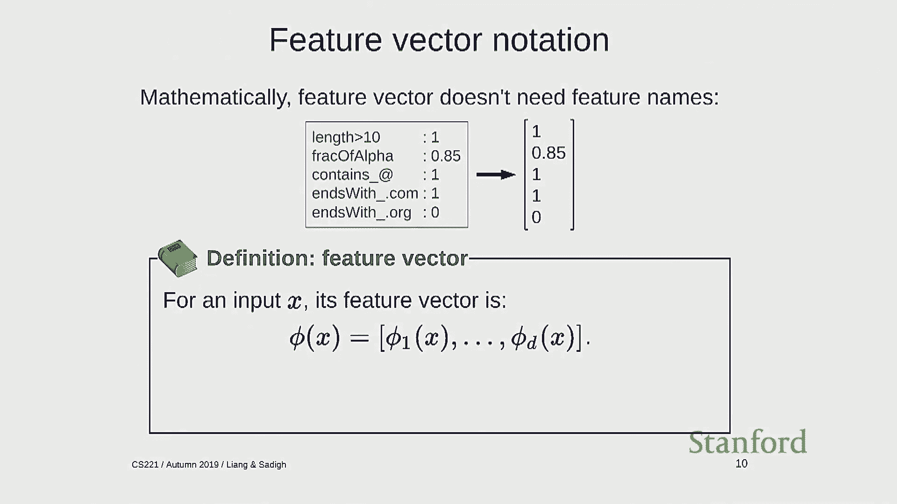
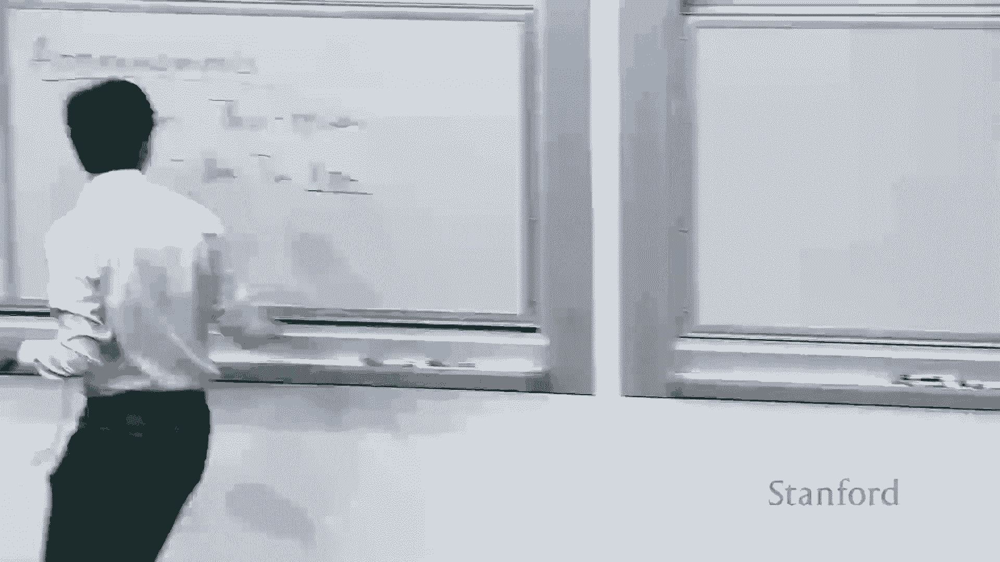
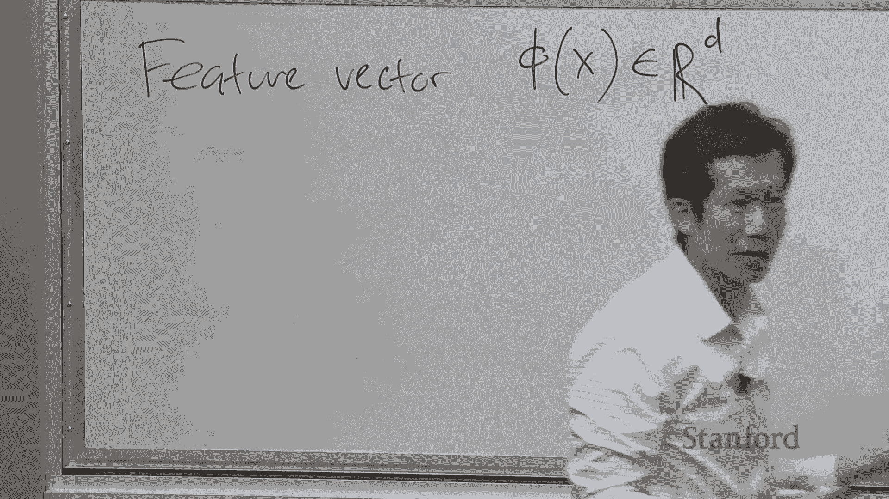
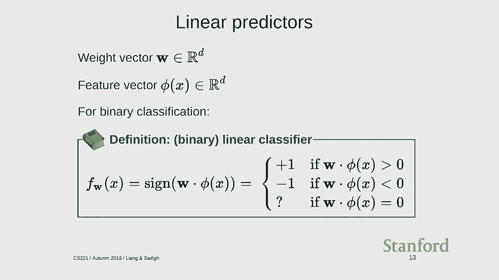
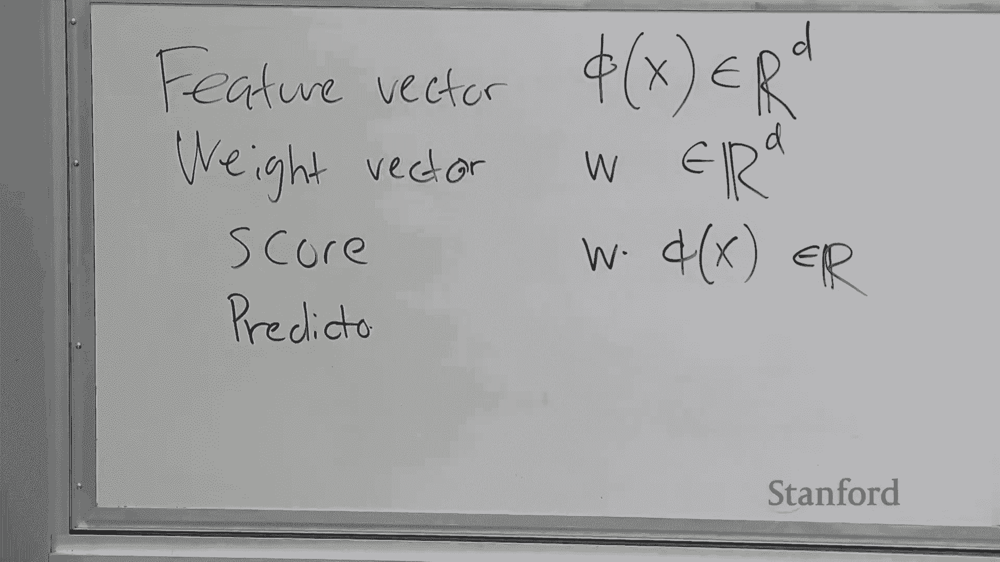
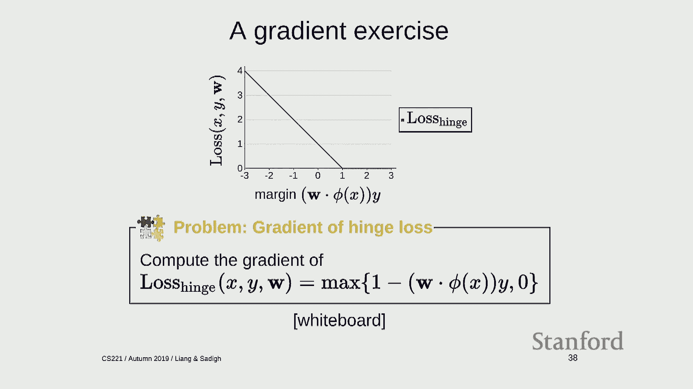
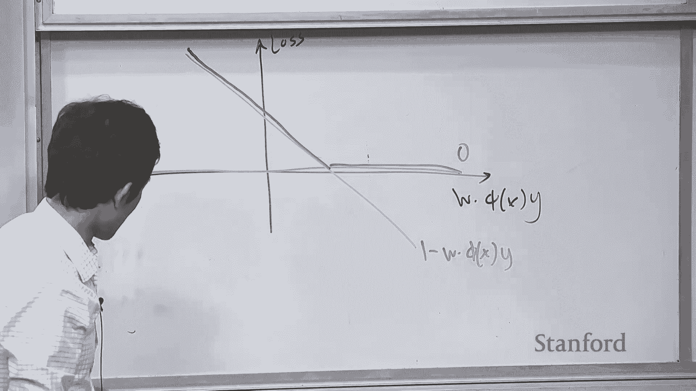

# P2：Lecture 2 Machine Learning 1 - Linear Classifiers SGD - 鬼谷良师 - BV16E411J7AQ

 Okay， so let's get started with the actual technical content。

 So remember from last time， we gave an overview of the class。

 We talked about different types of models that we were going to explore。 Reflex models。

 state based models， variable based models， and logic models， which we'll， see throughout the course。

 But underlying all of this is machine learning。 Because machine learning is what allows you to take data and tune the parameters of the。

 models so you don't have to work as hard designing the model。 So in this lecture。

 I'm going to start with the simplest of the models， of reflex based， models。

 and show how machine learning can be applied to these type of models。 And throughout the class。

 we're going to talk about different types of models and how learning， will help with those as well。

 So there's going to be three parts， we're going to talk about linear predictors， which。

 includes classification regression， loss minimization。

 which is basically a set of objective function， of how you want to train your machine learning model。

 and then stochastic gradient descent， which is an algorithm that allows you to actually do the work。

 So let's start with perhaps the most cliche example of machine learning。 So you have。

 we don't want to do spam classifications。 So the input is x， an email message。

 And you want to know whether an email message is a spam or not spam。

 So we're going to denote the output of the classifier to be y， which is in this case。

 either spam or not spam。 And our goal is to produce a predictor f。

 So a predictor in general is going to be a function that maps some input x to some output y。

 In this case， it's going to take an email message and map it to whether the email message is。

 spam or not。 So there's many types of prediction problems。

 Binary classification is the simplest one where the output is one of two possibilities。

 either yes or no。 And we're going to usually denote this as plus one or minus one。

 Sometimes you also see one and zero。 There's regression where you're trying to predict a numerical value。

 For example， let's say housing price。 There's a multi-class classification where y is not just two items。

 but possibly 100 items， maybe cat， dog， truck， tree， and different image categories。

 There's ranking where the output is a permutation of input。 This could be useful， for example。

 if the input is a set of articles or products or web。

 pages and you want to rank them in some order to show to a user。 Structure prediction is where y。

 the output is an object that is much more complicated。

 Perhaps it's a whole sentence or even an image。 And it's something that you have to construct。

 You have to build the same from scratch。 It's not just a labeling。

 And there's many more types of prediction problems。 But underlying all of this。

 whenever someone says， I'm going to do machine learning， the first question you ask is， OK。

 what's the data？ Because without data， there's no learning。 So we're going to call an example， x。

 y pair， is something that specifies what the output， should be when the input is x。

 And a training data or a set of examples， the training set， is going to be simply a list。

 or a multi-set of examples。 So you can think about this as a partial specification of behavior。

 So remember， we're trying to design a system that has certain types of behaviors。

 And we're going to show you examples of what that system should do。

 If I have some email message that has CS221， then it's not spam。 But if it has lots of dollar signs。

 then it might be spam。 And so remember， this is not a full specification of behavior。

 These 10 examples or even a million examples might not tell you what exactly this function。

 is supposed to do。 It's just examples of what the function could do on those particular examples。

 OK， so once you have this data， so we're going to use D train to denote the data set。 Remember。

 it's a set of input-output pairs。 We're going to push this into a learning algorithm or a learner。

 And what is the learning algorithm going to produce？ It's going to produce a predictor。

 So predictors are f。 And the predictor remember is what？

 It's actually itself a function that takes an input x and maps it to an output y。

 So there's kind of two levels here。 And you can understand this in terms of the learning paradigm。

 So modeling is about the question of what should the types of predictors。

 after you should consider R。 Inferences about how do you compute y given x。

 And learning is about how you take data and produce a predictor so that you can do inference。 OK？

 Any questions about this so far？ So this is pretty high level and abstract and generic right now。

 And this is kind of on purpose because I want to highlight how general machine learning。

 is before going into the specifics of linear predictors。 So this is an abstract framework。 OK。

 so let's dig in a little bit to this actual problem。 So just to simplify the email problem。

 let's consider a task of predicting， whether a string is an email address or not。

 So the input is a string。 And the output is it's a binary classification problem。

 It's either 1 if it's an email or minus 1 if it's not。 That's where you want。

 So the first step of doing linear prediction is known as feature extraction。

 And the question you should ask yourself is， what properties of the input x。

 might be relevant for predicting the output of y。 So I say it really highlight might be。

 At this point， you're not trying to encode the actual set of rules that solves a problem。

 That would involve no learning。 That would just be trying to do it directly。

 But instead of learning you're taking a more of a backseat and you're saying， well。

 here's some hints that could help you。 So formally。

 a feature extractor takes an input and outputs a set of feature name， feature value pairs。

 So I'll go through an example here。 So if I have ABC@gmail。com。

 what are the properties that might be useful for determining。

 whether a string is an email address or not？ Well。

 you might consider the length of the string if it's greater than 10。

 Maybe long strings are less likely to be email addresses and shorter ones。 And here。

 the feature name is length greater than 10。 So that's just kind of the label of that feature。

 And the value of that feature is 1， representing its true。 So it would be 0 if it's false。

 Here's another feature， the fraction of alpha numeric characters。 So that happens to be 0。85。

 which is the number。 There might be features that test for particular letters。 For example。

 it does a container @ sign。 Or that as a feature value of 1， because there isn't @ sign， ends with。

com is 1， ends， with。org is 0 because that's not true。 So you can have many， many more features。

 And we'll talk more about features next time。 But the point is that you have a set of properties。

 You're kind of distilling down this input， which is could be a string， could be an image。

 or it could be something more complicated， into kind of a ground up fashion that later。

 we'll see how a mid-screen learning algorithm can take advantage of。

 So you have this feature vector， which is a list of feature values and their associated。

 names or labels。 But later we'll see that the names don't matter to the learning algorithm。

 So actually what you should also think about the feature vector is simply a list of numbers。

 And just kind of on the side， make a note that this position number three corresponds to。

 contains @ and so on。 So I've distilled the email address， abc@gmail。com。

 into the list of numbers 0 or 1， 0。85， 1， 1， 0。 So that's a feature extraction。

 It's kind of distilling complex objects into lists of numbers， which we'll see is what。

 the kind of the lingro-franco of these machine learning algorithms is。 OK。

 so I'm going to write some concepts on the board。

 There's going to be a bunch of concepts I'm going to introduce。

 And I'll just keep them up on the board for reference。

 So feature vector is a kind of important notion。 And it's the noted phi of x on input。

 So phi itself， sometimes you think about it， you call it the feature map， which takes an。

 input and returns a vector。 And this notation means that it returns in general a D dimensional vector。

 so a list。

 of D numbers。 And the components of this feature vector， we can write down as phi 1， phi 2， all the。

 way to phi d of x。 OK， so this notation is convenient because we're going to start shifting。

 Our focus from thinking about the features as properties of input to features as kind。

 of mathematical objects。 So in particular， phi of x is a point in a high dimensional space。

 So if you had two features， that would be a point in two dimensional space。 But in general。

 you might have a million features。 So that's a point in a million dimensional space。

 So it might be hard to think about that space， but we'll see how we can deal with how later。

 in a bit。 OK， so that's a feature vector。 You take an input and return a list of numbers。

 And now the second piece is a weight vector。 So let me write down weight vector。

 So a weight vector is going to be noted w。 And this is also a list of D numbers。

 It's a point in a D dimensional space。 But we're going to interpret it differently。

 as we'll see later。 So the way to think about a weight vector is that for each feature J--。

 so for example， frac of alpha--， we're going to have a real number of wj that represents the contribution of that。

 feature to the prediction。 So this contribution is 0。6。 So what does this 0。6 mean？

 So the way to think about this is that you have your weight vector。

 and you have a feature vector of a particular input。 And the score of your prediction is。

 going to be the dot product between the weight vector and the feature vector。

 So that's written w dot of phi of x， which is written out as basically looking。

 at all the features and multiplying the feature value times the weight of that feature。

 and summing up all those numbers。 So for this example， it would be minus 1。2。

 That's the weight of the first feature times 1。 That's the feature value plus 0。6 times 0。

85 and so on。 And there you get this number， 4。51， which。

 is happens to be the score for this example。 Question？ So the feature extraction with phi of x。

 is that supposed to be like an automated process， because it requires a required manual extraction of specification of features。

 Yeah， so the question is， is the feature extraction manual or automatic？

 So phi is going to be implemented as a function， like in code。

 You're going to write this function manually， but the function itself is run automatically on examples。

 Later， we'll see how you can actually learn features as well。

 So you can slowly start to do less of a manual effort。

 but we're going to hold off until next time for that。 Question？

 So we were talking about weight of meaning。 And I know that in certain types of abrections。

 the weights mean a percentage change at this variable， each of the percentage change of the outcome。

 It doesn't mean this。 Yeah， so the question is about interpretation of weights。

 Sometimes weights can have a more precise meaning。 In general， you can try to read the tea leaves。

 but I don't think there is maybe a in general mathematically precise thing。

 you can say about the meaning of individual weights。 But intuitively。

 and the intuition is important， is that you should think about each feature as a little person that's。

 going to make a vote on this prediction。 So you're voting either plus， yay or nay。

 And the weight of a particular feature specifies both the direction level。

 whether if positive weight means that that little person is voting positive。

 and negative weight means that it's moving negative。

 And the magnitude of that weight is how strongly that little person， feels about the prediction。

 So contains add is three， because maybe at signs generally do occur in new， mode dresses。

 but the fraction of alpha and new merit characters， it's less。 So at that level。

 you can have some intuition， but the precise numbers and y is 0。6 versus 0。5。

 you can't really say much about that。 Yeah， another question。

 Does a sub-product for the deeper networks take a few more weight vectors afterwards？

 Is still just more than products？ So right now， we're focusing on linear classifiers。

 So the question is， what happens if you have a neural net with more layers？

 There's going to be more dot products， but it's not just adding more features。

 There's going to be other components which we'll get to in a later lecture。 Yeah？

 >> The weight has to add up to the different number。

 Like any normalize it so the weight is still paying to score value by it。 >> Yeah。

 so the question is， do the weights have to add up to something？ The short answer is no。

 There's obviously restricted settings where you might want to normalize the weights or， something。

 but we're not going to consider that right now。 Later。

 we'll see that the magnitude of weight does tell you something。 Okay， so just to summarize。

 it's important to note that the weight vector， there's only one weight vector。

 You have to find one set of parameters for everybody， but， the feature vector is per example。

 So for every employee， you get a new feature vector。

 And the dot product of those two weighted combination of features is this score。 Okay。

 so now let's try to put the pieces together and， define the actual predictor。 All right。

 so remember we had this box with F in it， which takes X and returns Y。 So what is inside that box？

 And I've hopefully given you some intuition。 Let me go to a board and write a few more things。

 So the score remember is W dot F of X。 And this is just going to be a number。 And the predictor。

 so linear predictor， actually let me call this linear to be more precise。

 It's a linear classifier， not just a predictor。 Classifier is just a predictor that does classification。

 So a linear classifier denoted F of W。 So F is what we're going to use to denote predictors。

 W just means that this predictor depends on a particular set of weights。

 And this predictor is going to look at the score and return the sign of that score。

 So what is a sign？ The sign looks at the score and says， is it a positive a number？

 If it's positive， then we're going to return plus one。 If it's a negative number。

 I'm going to return minus one。 And if it's zero， then I don't care。

 You can return plus one if you want。 Doesn't matter。 So what this is doing。

 remember the score is either is a real number。 So it's either going to be leaning towards large value。

 large positive values are leaning towards large negative values。 And the sign basically says， okay。

 you've got to commit。 Are you， which side are you on？

 Are you on the positive side or are you on the negative side？ And just kind of discretizes it。

 That's what the sign does。 Okay。 Okay， so let's look at a simple example。

 Because I think a lot of what I've seen before is kind of more the formal machinery。

 behind and the math behind how it works。 But it's really useful to have some geometric intuition because then you can。

 draw some pictures。 Okay， so let's consider this case。 So we have a wave vector which is two one。

 two minus one。 And a feature vector which is two zero and another feature vector which is zero two and two four。

 Okay， so there's only two dimensions， so I can try to draw them on a board。 So let's try to do that。

 Okay， so here is a two dimensional plot。 And let's draw the feet， the wave vector first。 Okay。

 so the wave vector is going to be at two minus one。 Okay， so that's this point。

 And the way to think about the wave vector is not that point， but actually the vector。

 going from the origin to that point。 For reasons I'll become clear later。 Okay， so that's the wave。

 Okay。 And then what about the other points？ So we have two zero zero two。 So two zero is here。

 Zero two is here and two four is here。 Right？ Okay， so we have three points here。 Okay。

 so how do I think about what this wave vector is doing？ So just for reference。

 remember the classifier is looking at the sign of W dot， you know， Phi of X。 Okay。

 So let's try to do classification on these three points。 Okay， so W is， let me write it out。 Formal。

 so two one。 And this is zero two。 So what's the score when I do W dot Phi of X here？ It's four。

 right？ Because this is two zero。 Zero two。 Two four。 So this is just a dot product。 That's four。

 And take the sign。 What's the sign of four？ One。 Okay。

 so that means I'm going to label this point as a positive， right？ Positive point。 Okay。

 what about zero zero two？ Actually， sorry。 This is just to be a minus one， right？ Okay。

 This is two minus one。 Okay， so if I take the dot product between this， I get minus two。

 And then the sign of minus two is， is minus one。 Okay， so that's a minus。 And what about this one？

 So what's the dot product there？ It's going to be zero。 Okay？ So。

 so this classifier will classify this point as a positive。 This is a negative and this one。

 I don't know。 Okay， so we can fill in more points。 But， but， you know。

 does anyone see kind of maybe a more general pattern？

 I don't want to have to fill in the entire board with classifications。 Yeah。

 Four is log and all our teams are right a bit。 Is positive or if you can left a bit is negative？

 Yeah， so， so let's try to draw the orthogonal。 Oh， this needs to go through that line。 Okay。 Okay。

 so let's draw the orthogonal。 So this is the right angle。 Okay。

 And what that gentleman said is that the points， any point over here。

 because it has a cute angle with w is going to be classified as positive。 So all of this stuff is。

 you know， positive， positive， positive， positive， positive。 And everything over here。

 because it has a two-s angle with w is going to be negative。 So everything over here is negative。

 And then everything on this line is going to be zero。 Okay。 So， so I don't know。 Okay。

 And this line is called the decision boundary， which is a concept not just for linear classifiers。

 but whenever you have any sort of classifier， the decision boundary is the separation between。

 the regions of the space where the classification is positive versus negative。 Okay。

 And in this case， it's， it separates because it's， we have linear classifiers。

 The decision boundary is straight， and we're just separating the space into， you know， two halves。

 If you were in three dimensions， this vector would still be just a， you know， a vector。

 but this decision boundary would be a plane。 So you can think about it as， you know。

 coming out of the board if you want， but I'm not， going to try to draw that。 And that's。

 that's kind of the geometric interpretation of how linear classifiers， you know， work here。

 Question。 Yeah。 Yeah。 Yeah。 Yeah。 So that's a good point。 So the， the observation is that no matter。

 if you scale this weight by two， it's actually going to still have the same decision boundary。

 So the magnitude of the weight doesn't matter。 It's the direction that matters。

 So this is true for just making a prediction。 When we look at learning。

 the magnitude of the weight will matter because we're going to， you know。

 consider other more nuanced loss functions。 Okay。 So let's move on。

 Any questions about linear predictors？ So so far what we've done is we haven't done any learning。

 Right。 If you've， you know， noticed， we've just simply defined the set of predictors that we're interested in。

 We have feature vector， we have wave vectors， multiply them together， get a score。

 And then you can send them through a sign function and you get these linear classifiers。 Right。

 There's no specification of data yet。 Okay。 So now let's actually turn to do some learning。

 So remember this framework。 Learning needs to take some data and return a predictor。

 And our predictors are specified by a weight vector。

 So you can equivalently think about the learning algorithm as outputting a weight vector if you want for linear classifiers。

 And let's unpack the learner。 So the learning algorithm is going to be based on optimization。

 which we started reviewing last lecture， which separates what you want to compute from how you want to compute it。

 So we're going to first define an optimization problem。

 which specifies what properties we want a classifier to have in terms of the data。

 And then we're going to figure out how to actually optimize this。

 And this modularity is actually really， really powerful。

 And it allows people to go ahead and work on different types of criteria for different types of models。

 separately from the people who actually develop general purpose algorithms。

 And this has served kind of the field of machine learning quite well。 Okay。

 So let's start with optimization problem。 So there's an important concept called a loss function。

 And this is a super general idea that's using the machine learning and statistics。

 So a loss function takes a particular example， x， y， and a weight vector， and returns a number。

 And this number represents how unhappy we would be if we use the predictor given by w to make a prediction on x when the correct output is y。

 Okay。 So it's a little bit of a mouthful， but this basically is trying to characterize， you know。

 if you had me a classifier， and I go onto this example and try to classify it。

 is it going to get it right or is it going to get it wrong？ So high loss is bad。

 You don't want to lose。 And low loss is good。 So normally zero loss is the best you can handle。

 Okay。 So let's do a figure out the loss function for binary classification here。

 So just some notation， the correct label is denoted y。 And the predictor label， remember。

 is the score sent through the sign function， and that's going to give you some particular label。

 And let's look at this example。 So w equals 2 minus 1， phi of x equals 2， 0， and y equals minus 1。

 Okay。 So we already defined the score as on example is w dot phi of x。

 which is how confident we're predicting my plus one。 That's the way to interpret this。 Okay。

 So what's the score for this particular example again？ It's 4， right？

 Which means that we're kind of positive that it's a plus one。 Yeah， question。 >> I was wondering。

 is the loss function generally one dimensional or the output of the loss function？ >> Yeah。

 So the question is whether the output of loss function is usually a single number or not。

 In most cases it is。 For basically all practical cases you should think about the loss function's upper and end。

 Single number。 The inputs can be， you know， a crazy high dimensional。 Yeah。 >> What is it？ >> Not。

 There are cases where you might have multiple objectives that you're trying to optimize at once。

 But in this class it's always going to be one dimensional。 Like maybe you care about， you know。

 both time and space or accuracy but robustness or something。

 Sometimes you have multi-objective optimization。 But that's like way beyond the scope of this class。

 Okay。 So we have a score。 And now we're going to define margin。 So let me， okay。

 So let's actually do this。 So we're talking about classification。

 I'm going to sneak regression in a bit。 So score is w dot v of x。

 This is how confident we are about plus one。 And the margin is the score times y。

 And this relies on y being plus one or minus one。 So this might seem a little bit mysterious but let's try to。

 you know， decipher that here。 So in this example， the score is four。 So what's the margin？

 You multiply by minus one。 So the margin is minus four。 Right。

 So the margin's interpretation is how correct we are。 Right。

 So imagine the correct answer is if the score and the margin have the same sign， then you're。

 going to get positive numbers。 And then the more confident you are， then the more correct you are。

 But if y is minus one and the score is positive， then the margin is going to be negative。

 Which means that you're going to be confidently wrong。 Which is bad。 Okay。

 So just to see if we kind of understand what's going on。

 So when is a binary classifier making mistake on a given example？

 So I'm going to ask for kind of a show of hands。 How many people think it's when the margin is less than zero？

 Okay。 I used to do these online quizzes where it wasn't the non-less。

 but we're not doing that this year。 Okay。 So yes， the margin is less than zero。

 When the margin is less than zero， that means y and the score are different signs。

 Which means that you're making a mistake。 Okay。 So now we have the notion of a margin。

 Let's define something called the zero one loss。 And it's called zero one because it returns either a zero or one。

 Okay。 Very creatively。 So the loss function is simply， did you make a mistake or not？ Okay。

 So this notation， let's try this high for a bit。 So if f of x here is a prediction when the input is x。

 And not equal y is saying did you make a mistake。 So that's think about as a Boolean。

 And this one bracket is just notation。 It's called an indicator function that takes a condition and returns either one or zero。

 So if the condition is true then it's going to return a one and the condition is false it returns a zero。

 Okay。 So all this is doing is basically returning a one if you made a mistake and zero if you did make a mistake。

 Okay。 And we can write that as follows。 We can write that as the margin less or equal to zero。

 Right。 Because on the previous slide if the margin is less than zero then we've made a mistake and we should incur a loss of one。

 And if the margin is greater than zero then we didn't make a mistake and we should recur a loss of zero。

 Okay。 All right。 So it will be useful to draw these law functions pictorially like this。 Okay。

 So on the x axis here we're going to show the margin。 Right。

 Remember the margin is how correct you are。 And on the y axis we're going to show the loss function which is how much you're going to suffer for it。

 Okay。 So remember the margin if the margin is positive that means you're getting a right。

 Which means that the loss is zero。 But if the margin is less than zero that means you're getting a wrong and the loss is one。

 Okay。 So this is a zero on loss。 That's the visual that you should have in mind when you think about zero on loss。

 Yeah。 Okay。 Like less than zero。 Because we have not defined like when zero rather than the plus。

 minus correct。 Yeah。 So there's this kind of boundary condition of what happens exactly at zero that I'm trying to sweep under the rock because it's not terribly important。

 Here it's less than zero to be kind of on the safe side。

 So if you don't know you're also going to get it wrong。

 Otherwise you could always just return zero and then you don't want that。 Okay。

 So is it any questions about kind of binary classification so far。

 So we've set up these linear predictors and I've defined the zero on loss as a way to capture how unhappy we would be if we had a classifier that was operating on a particular data point。

 So just this。 I'm going to go on a little bit of a digression and talk about linear regression。 Hi。

 And the reason I'm doing this is that loss minimization is such a powerful and general framework and it transcends you know all of these linear classifiers regression setups。

 So I want to kind of emphasize the overall story。 So I'm going to give you a bunch of different examples classification regression side by side so we can actually see how they compare and hopefully the common denominator will kind of emerge more clearly from that。

 Okay so we talked a little bit about linear regression in the last lecture。 Right。

 So linear regression in some sense is simpler than classification because if you have a linear predictor and you get the score W dot V of X it's already a real number。

 So in linear regression you simply return that real number and you call that your prediction。 Okay。

 Okay so now we let's move towards defining a loss function。

 So there's going to be a concept that's going to be useful。 It's called the residual。

 Which is again kind of trying to capture how wrong you are。

 So here is a particular linear predictor linear regressor and it's making predictions all along you know for different values of X。

 And here's a data point of fear of X， Y。 Okay so the residual is the difference between the true value Y and the predictive value Y。

 Okay。 And in particular it's the amount by which the prediction is over shooting you know the target。

 Okay so this is this is a difference。 And if you square the difference you get something called the square loss。

 So this is something we mentioned last lecture。 Residual can be either negative or positive。

 But errors either if you're very positive or very negative that's bad and squaring it makes it so that you're going to you know suffer equally for errors in both directions。

 Okay so the square loss is the residual squared。 So let's do a kind of simple example。

 So here we have our wave vector 2-1。 The feature vector is 2-0。 What's the score？ The score Y is -1。

 So the residual is 4-1 which is 5 and 5 squared is 25。

 So the square loss on this particular example is 25。 Okay so let's plot this。

 So just like we did it for a zero on loss let's see what this loss function looks like。

 So the horizontal axis here instead of being the margin is going to be this quantity for regression called the residual。

 It's going to be the difference between the prediction and the true target。

 And I'm going to plot the loss function and this lost function is just the squared function。 Right？

 So if the residual is zero then the loss is zero。 If as the residual grows in either direction then I'm going to pay something for it。

 And it's a quadratic penalty which means that it actually grows you know pretty fast。

 So if I'm you know the residual is 10 then paying 100。 Okay so that's the squared loss。

 There's also another loss I'll throw in here called the absolute deviation loss。

 And this might actually be the last I if you didn't know about regression you might immediately come to。

 It's basically the absolute difference between the prediction and the actual true target。

 Turns out the square loss there's a kind of a longer discussion about you know which loss function you know makes sense。

 So the salient points here are that the absolute deviation loss is kind of has this kink here。

 And so it's not smooth。 Sometimes it makes it harder to optimize。

 But the square loss also has this kind of thing that blows up which means that it's it really doesn't like having outliers or really large values because it's going to you're going to pay a lot for it。

 But at this level just think about this as you know different losses there's also something called a Huber loss which kind of combines both of these is smooth and also grows linearly and self-critical。

 Okay so we have both classification you know and regression。

 We can define margins and residuals we get either different loss functions out of it。

 And now we want to minimize the loss。 Okay so it turns out that for one example this is really easy right so if I told you okay how do I minimize the loss here。

 Well okay it's zero done。 So that's not super interesting。

 And this corresponds to the fact that you know if you have a classifier you trust trying to fit one point it's really not that hard。

 So that's kind of not the point。 The point of machine learning is that you have to fit all of them。

 Remember you only get one weight vector you have all these examples you have a million examples and you want to find one weight vector that kind of balances errors across all of them。

 And in general you might not be able to achieve loss of zero right so tough luck life is hard。

 So you have to make trade-offs you know which examples are you going to kind of sacrifice for the good of other examples。

 And this is actually a lot of where you know issues around fairness of machine learning actually come in because in cases where you can't actually make a prediction that's you know equally good for everyone。

 You know how do you actually responsibly make these trade-offs。

 But you know that's a broader topic let's just focus on trade-offs defined by the simple sum overall the loss example。

 So let's just say we want to minimize the average loss overall examples。

 Okay so once we have these loss functions if you average over the training set you get something which we're going to call the train loss and that's a function of W。

 Right so loss is on a particular example train loss is on the entire data set。

 Okay so any questions about this so far。 Okay so there is this discussion about which regression loss to use which I'm going to skip you can feel free to read it in the notes if you're interested。

 The punch line is that if you want things that look like the mean square loss if you want things that look like the median use absolute deviation loss but I'll skip that for now。

 Yeah。 When do people start thinking of regression like in terms of loss minimization。

 So regression has least squares regression is from like the early 1800s。

 So it's been around for is you know kind of you can call the first machine learning that was ever done if you if you want。

 I guess the last minimization framework is it's hard to kind of pinpoint a particular point in time you know it's kind of not a terribly。

 You know it's not like a you know innovation in some sense it's just more of a at least right now it's kind of a pedagogical tool to organize all the different methods that exist。

 So I'm trying to I'm mean and medium do you mean that like in that particular training set the median what you don't know。

 High side is in those confidence whereas I would have lost up to the deviation of the median。

 Yeah so I don't want to get into this example but briefly if you have three points that you you can't exactly fit perfectly。

 You if you use absolute deviation then you're going to find a median value you're going to basically predict the median value。

 And if you use the square loss you're going to predict the mean value but I'm happy to talk offline。

 Okay so what we've talked about so far is we have these wonderful linear predictors which are driven by feature vectors and wave vectors。

 And now we can define a bunch of different loss functions that capture you know how we care about you know regression and classification。

 And now let's try to actually do some real machine learning how do you actually optimize these objectives。

 So remember the learner is going so now we talked about the optimization problem which is minimizing the training loss。

 We'll come back to that next lecture and then now we're going to talk about optimization algorithm。

 Okay so what is the optimization problem now remember last time we said okay let's just abstract away from the details a little bit。

 Let's not worry about if it's the square loss or you know some other loss。

 Let's just think about as a kind of abstract function。

 So one dimension the training loss might look something like this。

 You have a single weight and for each weight you have a number which is your loss on your training examples。

 Okay and you want to find this point。 So in two dimensions it looks something like this and let me try to actually draw this because I think it will be useful。

 Let me pull this up。 Okay so in two dimensions what optimization looks like is this follow。

 So I'm now plotting W1 and W2 which are the two components of this two dimensional weight vector。

 For every point I have a weight vector and that value is going to be the loss of the training loss。

 And it's pretty standard in these settings to draw what are called level curves。 So let's do this。

 So each curve here is a ring of points where the function value is identical。

 So if you look at terrain maps those are level curves so you know kind of what I'm talking about。

 So this is a minimum and as you kind of grow out you get larger and larger。

 Okay I'll keep on doing this for a moment。 Okay all right and the goal is to find the minimum。

 Okay all right so how are we going to do this？ So yeah question。

 Yeah why am I assuming there is a single minimum。 In general for arbitrary loss functions there's no necessary a single minimum。

 I'm just doing this for simplicity it turns out to be true for you know many of these linear classifiers。

 Okay so last time we talked about gradient descent。

 Right and the idea behind gradient descent is that well I don't know what this is so let's just start at zero as good as any place。

 And what I'm going to do at zero is I'm going to compute the gradient。

 So the gradient is this vector that's perpendicular to the level curves。

 So the gradients is going to point in this direction that says hey in this direction is where the function is increasing the most dramatically。

 And gradient descent goes in the opposite direction。

 Right because remember we want to minimize loss。 So I'm going to go here and now I'm hopefully reduced my function value not necessarily but we hope that's that's the case。

 Now we compute the gradient again the gradient says you know maybe it's pointing this way so I go in that direction and maybe now it's pointing this way。

 And I keep on going this is a little bit made up but hopefully eventually I get to the origin。

 And you know I'm kind of simplifying things quite a bit here so there's a whole field of optimization that studies exactly what kind of functions you can optimize and how gradient descent when it works and when it doesn't。

 I'm just going to kind of go through the mechanics now and differ that kind of the formal proofs of when this actually works until later。

 Okay so that's kind of the schema of how gradient descent works so encode this looks like this so initialize at zero and then loop in some number of iterations which lets for simplicity just think there's a fixed number of iterations。

 And then I'm going to pick up my weights compute the gradient move in the opposite direction and then there's going to be a step size that tells me how fast I want to make progress。

 Okay and we'll come back to you know what the step size does later。

 Okay so let's specialize it to least squares regression so we kind of did this last week but just to kind of review。

 So the training loss for least squares of regression is this so remember it's average over the loss of individual examples and the loss of a particular example is the residual squared so that's this expression。

 And then all we have to do is compute the gradient and you know if you remember your calculus it's just use a chain rule。

 So this two comes down here you have the you know the residual times the derivative of what's inside here and the gradient with respect to w is phi of x。

 Okay so last time we did this in Python in one dimension so in one dimension hopefully all of you should feel comfortable doing this because this is just kind of basic calculus。

 Here we have w is a vector so we're not taking derivatives but we're taking gradients so there's you know some things to be wary of but in this case it's often kind of useful to double check that well。

 The gradient version actually matches the single dimensional version and you know as well because last time remember we have X out here。

 And one thing to note here is that there's a prediction minus target that's a residual。

 So the gradient is driven by you know this kind of this quantity so if the prediction equals the target what's the gradient it's going to be zero which is kind of what you want if you're already getting the answer correct then you shouldn't want to move your your weights。

 Right so often you know we can do things in the abstract and everything will work but you know it's often a good idea to write down some objective functions take the gradient and see if gradient descent on using these gradients that you computed is kind of a sensible thing because there's。

 kind of many layers you can understand and get intuition for this stuff at the kind of abstract level optimization or kind of at the algorithmic level like you pick up an example is it sensible to update when the gradient or then when the prediction equals the target。

 Okay so so let's take the code that we have from last time and I'm going to expand on it a little bit and hopefully set the stage for doing stochastic gradient。

 Okay so last time we had gradient descent。 Okay so remember last time we defined a set of points we defined the function which is the train loss here we defined the derivative of the function and then we had great and descent。

 Okay so I'm going to do a little bit of house cleaning just don't mind me。

 Okay so I'm going to make this a little bit more explicit what this algorithm is。

 Green descent depends on a function， a derivative function and let's say you know the dimensionality and I can call this gradient with FDF and in this case it's D where D equals two。

 And I want to kind of separate this is the kind of algorithms and this is modeling so this is what we want to compute and this is how we compute it。

 Okay and this code should still work。 Alright so what I'm going to do now is upgrade this to vectors so remember the X here is just a number right but we want to support vectors。

 So in Python I'm going to import an MP so which is a nice vector and matrix library and I'm going to make some you know a raise here which and this is just going to be a one dimensional race so it's not that exciting。

 So this this w dot x becomes the actual dot I need to call and I think and w needs to be MP dot zeros。

 Alright so that should still run actually sorry this one dimensional。

 Okay so remember last time we ran this this program and it starts out with some weights and then it converges to point eight and the function value kind of keeps on going down。

 Alright so let's try to you know it's really hard to kind of see whether this algorithm is any doing anything interesting because we only have two points it's kind of trivial。

 So how do we go about you know because I'm going to also implement Cascari News and how do we have kind of a test case to see if this algorithm is you're working。

 So there's kind of this technique which I really like and it's you know which is to call you know generate artificial data and ideas that you know what is learning you're learning as you're taking a data set and you're trying to fit。

 find the weights that best fit that data set。 But in general if I generate some of which if I download the data so I have no idea what the right kind of quote unquote right answer is。

 So there's a technique where I go backwards I say okay let's let's decide what the right answer is。

 So let's say the right answer is one two three four five so it's a five dimensional problem。 Okay。

 And I'm going to generate some data based on that so that this weight vector is kind of good for that data。

 I'm going to skip all my breaks in this lecture。 So I'm going to generate a bunch of points let's generate 10。

000 points。 The nice thing about artificial data is you can generate as much as you want。

 There's a question yeah。 It's true W。 Oh so true W just means like the correct the ground truth W。

 This is true why true output。 So W is a weight vector so this kind of going backwards remember I want to fit the weight vector but I'm just kind of saying this is the right answer so I want to make sure that the algorithm actually recovers。

 Okay so I'm going to generate some random data so there's a nice function random dot ran n which generates a random you know D dimensional vector and why I'm going to set what should I set why to。

 Yeah so so I'm going to do regressions so I want to do true W dot x right。

 So I mean if you think about it if I took this data and I found the like true what W is the right thing that will get zero lives here。

 Okay but I'm going to make a life a little bit more interesting and I'm going to add some noise。

 Okay so let's print out what that looks like also I should add it to my data set。

 So I'm going to add。 Okay so this is my data set okay I mean can't really tell what's going on but but you can look at the code and you can assure yourself that this data has structure in it。

 Okay so let's get rid of this print statement and let's train and see what happens so let's。

 Okay oh one thing I forgot to do so if you notice that the objective functions that I've written down they haven't divided by the number of data points I want the average loss not the the sun。

 It turns out that you know if you have the sun then things get really big and blow up so just normalize that。

 Okay so let me let that。 Okay so it's training it's training actually so let me do more iterations so I did 100 iterations let's do 1000 iterations。

 So you know the function values going down that's always something to go to check and you can see the weights are kind of slowly getting to you know what appears to be one two three four five。

 Okay so you know this is not hard proof but it's kind of evidence that this learning algorithm is actually kind of doing the right thing。

 Okay so now let's see if I add you know more points so I now have a hundred thousand points。

 Now obviously it gets slower and you'll you know hopefully get there one day but I'm just gonna kill it。

 Okay any questions about。 My terminal got screwed up。

 Okay so what I do here I define loss functions took the derivatives the gradient is what we implemented last time and the only thing different I did this time is generate a data set so I can kind of check whether。

 the gradient is working。 Yeah question。 The question is whether the fact that the gradient is residual allows their algorithm to learn from under over predictions。

 Yeah so the gradient is if you think about it yeah that's good intuition so if you look at if you're over predicting right that means the gradients kind of assumed that this is like one。

 So that means this is going to be positive which means that hey if you up that weight you're going to over predict more and more and incur more loss。

 So my subtracting the gradient you're kind of pushing the weights out in the other direction and same for when you're you know under predicting yeah so that's good intuition to have。

 Yeah。 What is the effect of the noise the effect of noise it makes the problem a little bit you know harder so that it takes more examples to learn。

 If you shut off the noise then it will you know we can try it。

 I've never done this before but presumably you'll learn you know faster but maybe not。

 The noise isn't you know that much but。 Okay so so let's say I have you know like 500 example thousand examples。

 You know that's quite a few examples and now you know this algorithm runs you know pretty slowly right and in modern machine learning you have you know millions and hundreds of examples。

 So grain descent is going to be you know pretty slow。

 So how can we speed things up a little bit and what's the problem here。

 Well if you look at the what the algorithm is doing it's iterating and each iteration it's computing the gradient of the training loss and the training loss is just average of all the points which means that you have to go through all the points and you compute the。

 gradient of the loss and add everything up。 That's what is expensive and you know takes time。

 So you might wonder well how can you avoid this I mean if you want to do greater than you have to go through all your points and the key insight behind the cast of gradient send is that well maybe maybe you don't have to do that。

 So maybe you know here's some intuition right。 So what is this gradient。

 So this gradient is actually the sum of all the gradients from all the examples in your training set。

 Right so we have 500，000 points adding to that。 So actually what this gradient is is it's actually kind of some of different things which are maybe pointing in some of different directions which all average out to this direction。

 Okay so maybe you can actually not average all of them but you can average just a couple or maybe even in extreme case you can just like take one of them and just you know march in that direction。

 So here's the idea behind the cast of gradient send。

 So instead of doing gradient descent we're going to change the algorithm to say for each example in the training set。

 I'm just going to pick it up and just update you know instead of like sitting down and going all of the training examples and thinking really hard I'm just going to pick up one training example and update right away。

 So kind of the key idea here is it's not about quality it's about quantity。

 Maybe not the world's best life lesson but it seems to work in here。

 And then there's also this question of what should the step size be。

 And in general in stochastic gradients it's actually even a bit more important because when you're updating on each individual example you're getting kind of noisy estimates of the actual gradient。

 And people often ask me like oh how should I set my step size and you know and the answer is like there is no formula。

 I mean there are formulas but there's no kind of definitive answer。 Here's some general guidance。

 So if step size is small so it really close to zero that means you're taking tiny steps right。

 That means that it'll take longer to get where you want to go but you're kind of proceeding cautiously so you're less likely you're going to you know if you mess up and go in the wrong direction you're not going to go too far in the wrong direction。

 Conversely if you have A to B really really large then you know it's like a race car you kind of drive really fast but you might just kind of bounce around a lot。

 So pictorially what I'm this looks like is that you know here's maybe a moderate step size but if you're taking steps really big steps you know you might go over here and then you jump around and then maybe you may be ran up in the right place but maybe sometimes you can actually get flung off out of orbit。

 and you know diverse infinity which is a bad situation。

 So there's many ways to set the step size you can set it to a constant you could usually have to tune it or you can set it to be decreasing the intuition being that as you optimize and get closer to the optimum you kind of want to slow down right like if you you're coming on a freeway you're driving really fast but once you get to your house you probably don't want to be like driving 60 miles an hour。

 Okay so actually I didn't implement stochastic gradient so let me do that。

 So let's try to get stochastic gradient up and going here。

 Okay so the interface to stochastic gradient changes so right so the ingredients and all we need is a function and it just kind of computes the sum over all the training examples。

 So stochastic gradient I'm going to just note SF for stochastic gradient I'm going to take an index I and I'm going to update on the ith point only so I'm going to only compute the loss on the ith point and same for the it's derivative and look at the ith point。

 and just compute the gradient on that ith point。 Okay so now instead of doing gradient descent let's do stochastic gradient descent and I'm going to pass an SFSDF D and the number of points because I need to know how many points there are now。

 So I'm going to copy gradient descent and it's basically kind of the same function I'm just going to stick another four loop in there。

 So stochastic gradient descent it's going to take the stochastic functions stochastic gradient the dimension out in N。

 Okay so now before I was just going through number of iterations and now right I'm not going to try to compute the value of all the training examples I'm going to loop over all the points。

 And I'm going to call just evaluate the function at that point I and compute the gradient at that point I instead of the entire data set。

 And then everything else is the same。 I mean one other thing I'll do here is that I'll use a different step size schedule so one divided by number of updates。

 So I want it so that the number of the step sizes can decrease over time。

 Okay so I start with 80 equals one and then it's half and then it's a third and it's a fourth and it keeps on going down。

 Sometimes you can put a square root and that's more typical in some cases but I'm not going to worry about the details too much。

 Question？ The point I chose randomly but here we just do it by the range。

 Yeah so the question is the word stochastic means that there should be some randomness here。

 And you know technically speaking the stochastic gradient descent is where you're sampling a random point and then you're updating on it。

 I'm cheating a little bit because I'm iterating over all the points。

 In practice if you have a lot of points and you randomize the order it's kind of similar but there is a kind of a technical difference that I'm trying to hide。

 Okay so this is stochastic gradient descent。 Loop iterate， go over all the points and just update。

 So let's see if this works。 I don't think that worked。 Maybe， let's see what happened here。

 I did try it on 100，000 points。 Maybe that works。 Nope， that doesn't work either。

 Anyone see the problem？ I'm printing this out at the end of each iteration。 So that should be fine。

 Really this should work。 So gradient descent was working right。 Maybe I'll try。

 it's probably not the best idea to be debugging this live。 Let's make sure gradient descent works。

 So that was working right。 So it's a cast gradient descent。

 It's really fast and converges but it doesn't converge to the right answer。

 Yeah but that should get incremented to one。 It might be true。

 Okay so I do have a version of this code that does work。 So what am I doing here？ That's different。

 Okay have some water。 Okay so this version works。 Yeah that's probably good。 That's a good call。

 Okay。 All right now it works。 Thank you。 Yeah this is a good lesson。

 When you're dividing this needs to be one。 Actually in Python 3 this is not a problem but I'm so on Python 2 for some reason。

 But this should be 1。0 divided by num updates。 Otherwise I was getting -- okay so why is it faster？

 Yeah okay。 Let's go back to 500，000。 Okay so one full sweep over the data is the same amount of time。

 But you notice that immediately already converges to 1， 2， 3， 4， 5。

 So this is like way way faster than gradient descent。

 Remember just to kind of compare gradient descent is you run it。

 And after one step it's like not even close。 Right。 Yeah。

 What noise levels do you have to have until gradient descent becomes better？

 So it is true that if you have more noise then gradient descent。

 might be -- the category in it can be unstable。 There might be ways to mitigate that with step size choices but yeah probably you。

 have to add a lot of noise for stochastic gradient to be really bad。

 I mean this is in some sense you know if you take a step back and think about。

 what's going on in this problem it's a five dimensional problem。

 There's only five numbers and I'm feeding it half a million data points。 Right。

 There aren't -- there's not that much to learn here。

 And so there's a lot of redundancy in the data set。

 And generally actually this is true like we know large data set there's going to be a lot of。

 redundancy。 So going through all the data and then trying to make a informed decision is。

 pretty wasteful where sometimes you can just kind of get a representative sample。

 from one example or more as common to do like kind of mini batches where you。

 maybe grab a hundred examples and you update on that which is -- so there's a。

 way to be somewhere between stochastic gradient and gradient descent。 Okay。 Let me move on。 Okay。

 Summary so far we have linear predictors。 Which are based on scores。

 So linear predictors include both classifiers and regressors。

 We can do loss minimization and we can -- if we implement it correctly we can do， SGD。 Okay。

 So that was -- I'm kind of switching things。 I hope you're following the alarm。

 I introduced binary classification and then I did all the optimization for linear， regression。

 So now let's go back to classification and see if we can do stochastic gradient。 Okay。

 So first classification remember we decided that the zero on loss is the thing we， want。

 We want to minimize the number of mistakes。 Who can argue with that？

 So remember what the zero on loss look like。 It looks like this。 Okay。

 So what happens if I try to run stochastic gradient descent on this？ I mean I can run the code。

 But yeah。 It won't work。 And why won't it work？ Yeah。

 So two popular answers are it's not differentiable。 That's one problem。

 But I think the bigger problem， kind of the deeper problem is that what is the， gradient？ Zero。

 Zero basically everywhere except for this point which doesn't really matter。

 So as we learned if you try to update with a gradient of zero then you won't move， your weights。

 So gradient descent will not work on the zero on loss。 So that's kind of unfortunate。

 So how should we fix this problem？ Yeah。 Yeah。 Let's make the gradient not zero。 Let's skew things。

 So there's one loss which I'm going to introduce called the hinge loss which does， exactly that。

 So let me write the hinge loss down。 And the hinge loss is basically zero here when the margin is greater or equal。

 one and rises linearly。 So if you've gotten in a correct by a margin of one so you're kind of pretty。

 safely on the side of， I'm getting it correct， then we won't charge you anything。

 But as soon as you start dipping into this area we're going to charge you kind of a。

 linear amount and your loss is going to grow linearly。

 So there's some reasons why this is a good idea。 So it upper bounds the zero on loss。

 It has a property called known as convexity which means that if you actually run the。

 gradient descent you're actually going to converge through the global optimum。

 I'm not going to get into that。 And so that's a hinge loss。

 So what remains to be done is to compute the gradient of this hinge loss。

 So how do you compute this gradient？ So in some sense it's a trick question because the gradient doesn't exist because。

 it's not differentiable everywhere but we're going to pretend that little point， doesn't exist。

 So what is this hinge loss？ The hinge loss is actually two functions。

 There's a zero function here and then there's this one minus x function。 So what am I plotting here？

 I'm plotting the margin and the loss。 So this is the zero function and this is one minus w dot phi of xy。

 And the hinge loss is just the maximum of these two functions。

 So at every point I'm just taking the top function。 So that's how I'm able to trace out this curve。

 All right。

 So if I want to take the gradient of this function， you can try to do the math。

 But let's think through it。 What should the gradient be？ Well， if we're here。

 what should the gradient be？ It's zero。 And if I'm here， what should the gradient be？

 It should be whatever the gradient of this function is。 So in general。

 when you have a gradient of this kind of max， you have to kind of break it up into cases。

 and depending on where you are， you have a different case。

 So loss is equal to if I'm over here and what's the condition for being over here？

 If the margin is greater than one， right？ And then otherwise。

 I'm going to take the gradient of this with respect to w， which is going to be minus phi of xy。

 otherwise。 So again， we can try to interpret the gradient of the hinge loss。 So remember。

 you use stochastic gradient descent。 You have a wave vector and you're going to pick up an example and you say。

 "Oh， let's compute the gradient move away from it。"， So if you're getting an example right。

 then the gradient is zero。 Don't move， which is the right thing to do。 And otherwise。

 you're going to move in the direction because you're minus， minus of phi of xy。

 which kind of imprints this example into your wave vector。 So。

 and you can formally show that it actually increases your margin after you do this。 Okay？ Yeah？

 [ Inaudible ]， What's the significance of the margin being one？ This is a little bit arbitrary。

 You're just kind of sending a non-zero value。 And in support vector machines。

 you set it to one and then you have， regularization on the weights and that gives you some interpretation。

 So I don't have time to go over that right now， but feel free to ask me later。

 There's another Floss function。 Do you have a question？ >> Yeah。

 Why do we choose the margin as the loss function as opposed to the squared error or another？

 >> Yeah。 So why do you choose the margin？ So in classification。

 we're going to look at the margin because that tells you how。

 much more efficiently you're predicting correctly。 In regression。

 you're going to look at residuals and square losses。

 So it depends on what problem you're trying to solve。 Just really quickly。

 some of you might have heard of logistic regression。

 Logistic regression is this yellow loss function。 Right？

 So the point of this is saying that this loss minimization framework is really。

 general and a lot of things that you might have heard of， least squares。

 logistic regression are kind of special cases of this。

 So if you kind of master how to do loss minimization， you kind of can do it all。 Okay。 So summary。

 basically what's on the board here。 If you're doing classification。

 you take the score which comes from W。F。X。 And you drive it into the sign and then you get either plus one or minus one regression。

 You just use a score。 Now to train， you have to assess how well you're doing。 In classification。

 there's a notion of a margin in regression。 It's the residual。

 And then you can define loss functions。 And here we only talked about five loss functions。

 but there's many others， especially for a kind of structured prediction or ranking problems。

 There's all sorts of different loss functions。 But they're kind of based on these simple ideas of。

 you know， you have a hinge， that upper balance is zero。

 one if you're doing classification and some sort of， square like error for regression。

 And then once you have your loss functions， provide it's not zero， one。

 You can optimize it using SGD， which turns out to be a lot faster than， you know， gradient descent。

 Okay。 So next time we're going to talk about FIEVEX， which we've kind of left as， you know。

 someone just hands it to you。 And then we're also going to talk about what is the really true objective of machine。

 learning。 Is it really to optimize the training cost？ Okay。 Until next time。 Until next time。

 [BLANK_AUDIO]。

