# P3：Lecture 3 Machine Learning 2 - Features Neural Networks - 鬼谷良师 - BV16E411J7AQ

 Okay。 Welcome back everyone。 This is the second lecture on machine learning。 So just before。

 we get started， a couple of announcements。 Homework 1， foundations is due tomorrow at， 11 p。m。

 Note that it's 11 p。m。 not at 11。59。 And please， I would recommend everyone try。

 to do a test submission early。 It would be unfortunate if you wait until 10。59 and you。

 realize that you're a computer， you can't log into the website。 If that happens， please。

 don't just bombard me or with emails。 Just one note。 So there's。

 you can resubmit as much as you want before the deadline。 So。

 there's no penalty to just submitting something and checking to make sure your work works。

 So just to remind you are responsible for any technical issues you encounter。 So please。

 do the test submission early。 So you have a piece of mine and then you can go back to。

 finishing your homework。 Okay。 Homework 2， sentiment is out。 This is the homework on。

 machine learning and it will be due next Tuesday。 And finally， there's a section this Thursday。

 which will talk about back propagation and nearest neighbors and maybe overview of scikit。

 learn which might be useful for your project。 So please come to that。 Okay。 So let's jump， in。

 I'm going to spend a few minutes reviewing what we did last time。 Kind of starting at。

 the very abstract level and drilling down into the details。 So abstract level learning。

 is about taking a data set and outputting a predictor F which will be able to take inputs。

 X for example an image and output a label or output Y for example whether it's a cat。

 or a truck or so on。 And if you unpack the learner we talked about how we want to frame。

 it as an optimization problem which captures what we want to optimize， what properties。

 the predictor F should satisfy apart from the optimization algorithm which is how we accomplish。

 our objective。 So the optimization problem that we talked about last time was minimizing。

 the training loss。 And in symbols this is the training loss which depends on a particular。

 weight vector is the average over all examples in the training set of the loss of that particular。

 example with respect to the weight vector W。 Okay。 And we want to find the W that minimizes。

 the training loss。 So we want to find the single W that makes sure is on average all。

 the examples have low loss。 Okay， so looking at the loss functions， now this is where it。

 depends on what we're trying to do。 If we're doing regression then the pertinent thing to。

 look at is the residual which remember is the models prediction minus the true label。

 So this is kind of how much we overshoot。 And the loss is going to be zero if the residual。

 is zero and it increases either quadratically for the square loss or linearly for the absolute。

 deviation depending on how much we want to penalize large deviations。 For classification。

 or binary classification more specifically， the pertinent quantity to look at is the margin。

 which is the score times the label Y which remember is plus one or minus one。 So the margin。

 is a single number that captures how correct we are。 So large margin is good。 In that case。

 we obtain either a zero or near zero loss。 And margin less than zero means that we're making。

 a mistake。 So the zero and loss captures that we're making a mistake of a loss one。 But the。

 hinge loss and the logitical loss kind of grow linearly because it allows us to optimize。

 the function better。 Question？ Yeah。 I know that I see the regression the loss squared。

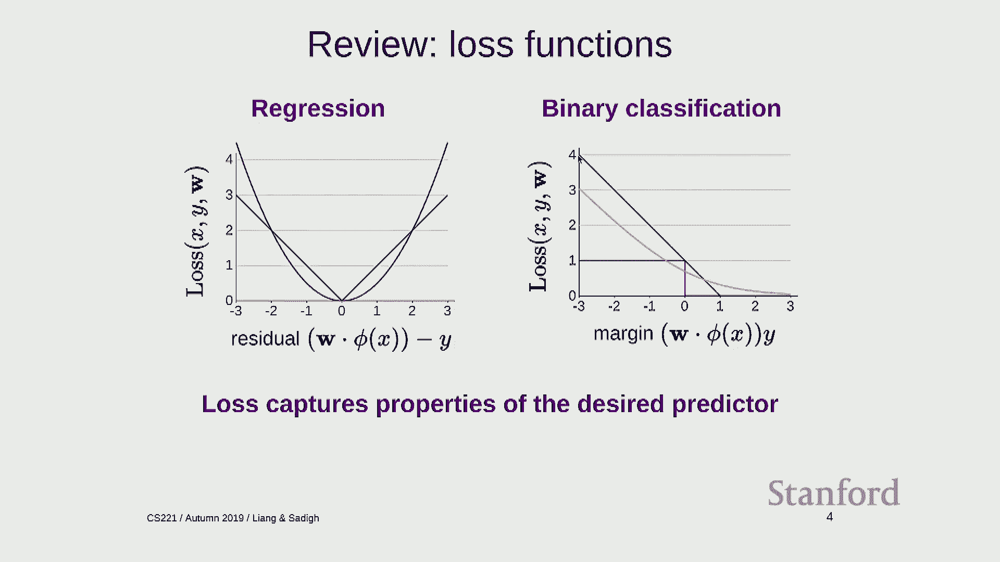

 curve there。 What would the residual look like on the graph here？ We just get a point away。

 from the regression curve or what would the residual look like on this graph？ So there。

 are multiple graphs here。 So remember last time we looked at the residual if you look。

 at X or rather phi of X over Y。 So here's a line。 Here is a particular point。 phi of X， of Y。

 And the residual is basically the difference between the models prediction and the actual。

 point here。 This graph is different。 This graph is visualizing in a different space。 I'll。

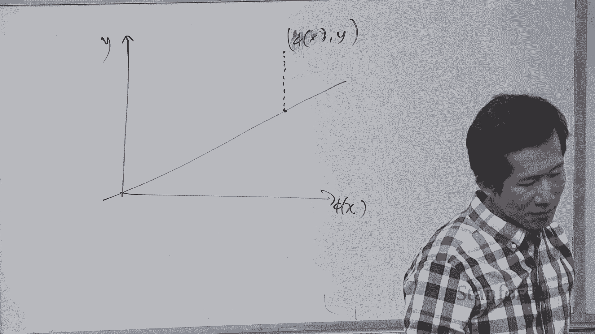

 show you another graph that might make some of these things a bit clearer in a second。

 So if you look at the graph on this curve of loss squared graph。 Correct？ I guess one way。

 to think about the residual is the residual is a number。 So if you're residual is two， then。

 you're kind of here and this is the loss that you pay which is two in this case。 And if the。

 residual is minus two then you pay two。 The residual is the X axis here。 And the margin。

 is the X axis over here。 Any other questions about this？ Yeah， the question is when would。

 you use absolute value versus the square loss？ There is a slide from the previous lecture。

 which I skipped over which talks about when you would want it。 Most of the time people。

 of you tend to use the square loss because it's as easier to optimize。 But you also see。

 absolute deviation。 The square loss will penalize large outliers a lot more which means that。

 it has kind of mean like qualities whereas the absolute deviation penalizes the less so。

 it's more like a median just for kind of intuition。 But the general point is that all these loss。

 functions capture properties of a desired predictor。 They basically say hand me a predictor。

 and I'll try to assess for you how good this is。 This is kind of establishing what we want。

 out of it。 And also another comment is that I'm presenting this loss minimization framework。

 because it is so general。 Anything basically that you see in this G learning can be viewed。

 as some sort of loss minimization if you think about PCA or deep neural networks。 Different。

 types of auto encoders。 They can all be viewed as some sort of loss function which you're。

 trying to minimize。 So that's why I'm kind of keeping this framework somewhat general。

 Okay so let's go the opposite direction of generality。 Let's look at a particular example。

 and try to put all the pieces together。 So suppose we have a simple regression problem。

 We have three training examples。 One zero the output is two。 One zero the output is four。

 And zero one the output is minus one。 So how do we visualize what learning on this training。

 set looks like？ So let's try to form the training loss。 The training loss remember is the average。

 over the loss is on the individual example。 So let's look at the losses on individual， examples。

 So we're doing linear regression。 So and X is two dimensional and phi of X equals， X。

 So in this example。 So we're basically trying to fit two numbers。 W one and W two。

 So if you plug in these values for X and Y into this loss function then you get the following。

 quantity。 So the dot product between W and X is just W one。 Right。 Because X two is zero。

 And you minus two and you square it because we're looking at the square loss。 The same。

 thing for this point instead of two you have a four。 And then for this point W dot phi of。

 X minus Y is W two now because now the X two is active。 Minus one squared。 Okay。 So these。

 are the individual loss functions。 Each of which tells what I kind of want out of W。 So。

 if here I'm looking at this if W one is two then that's great I get a loss of zero。 This。

 one says if W one is four then that's great and I get a loss of zero。 And obviously you。

 can have both。 And the goal of the training loss is trying to look at the average so that。

 you can pick one W that works for as kind of on average is good for all the points。 Okay。

 So now this is a function in two dimensions。 It depends on W one and W two。 So let me try。

 to draw this on the board to give you some more intuition what this looks like。 Okay。

 So I'm going to draw W one W two。 And so the first function is W one minus two。 Okay。 So。

 what is this function want to do？ It wants W one to be close to or close to two。 And it。

 doesn't care about W two。 Right。 So I'm not really sure how to draw this function but。

 it really requires something in 3D。 So you can think about a bowl shape kind of coming。

 out of the board like this。 If this direction is meant to be the loss。 Okay。 So I'm going。

 to try to do well let's try it this way。 So it's going to be like a kind of a bunch of。

 parabolas that look like this coming out of the board。 Okay。 Okay。 So what about the second， one？

 The second one is W one minus four squared。 So that's going to be basically the same。

 thing but kind of centered around four。 So around this axis。 Okay。 So again this is going。

 to be some parabola coming out of the board。 And then finally the other point is W two， minus one。

 So it's going to be happiest when W two is minus one。 So it's going to be kind。

 of a bunch of parabolas coming out of the board here。 Okay。 So you add all three functions， up。

 And what do you get？ You get something that is has first of all where do you think。

 the minimum should be？ One of the two intersections。 Yeah。

 The first like the first vertical and horizontal or the， second vertical and horizontal。 Oh。

 the red lines I mean。 Oh yeah。 It's going to be some， sort of intersection here。

 So if you look at the W two axis right it should definitely。

 be minus one because this is the only function that cares about W one。 So it's going to be。

 somewhere here。 And both by symmetry well this one wants it to be a two。 This one that wants。

 it to be a four。 So the average is somewhere between。 You can work all of this kind of actually。

 mathematically out of just kind of giving the rough intuition。 And now let me draw the。

 level curves here。 The level curves are going to be something like this where again if you。

 draw it in 3D it's like a parabola or coming out of the board here。 Where here is the lowest， point。

 And as you venture away from this point your loss is going to increase。 Right。 Okay。 Yeah。

 How do I get this middle point？ So one way is that if you add these two functions up and。

 the kind of just you know plot it it turns out to be at three。 Inquitably the square loss。

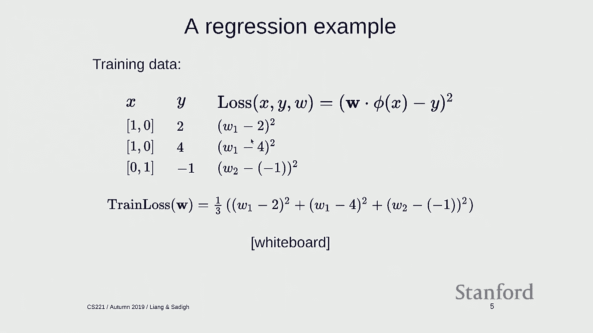

 when you average it acts kind of like a mean。 So kind of you know it's going to be somewhere。

 in between。 This is also related to one of the homework problems。 So hopefully you'll。

 have a better appreciation for that。 Okay。 So I guess yeah question。

 Once we have the three how do we merge it with the negative one as well？ Do we need to do。

 another initiative？ So question is once we have the three how do you merge it with a minus， one？

 So the three is regarding W one and the minus one is regarding W two。 So you just add。

 them together。 They kind of don't in this particular example they don't interact in general they。

 will。 These are examples。 Could you quickly summarize like exactly what's going on with this example？

 Yeah。 So this plot shows for every possible way vector W one W two you have a point and。

 the amount that the function comes out of the board is the loss。 Right。 And the loss function。

 is defined on in the slides right there。 And all I'm doing is trying to plot this loss function。

 So the interaction with the one of the two points the loss is coming out of the board。 Yes？

 So unfortunately it's hard to kind of draw in 3D here。 So what I'm trying to do here is。

 taking each of the pieces and trying to explain what each piece is trying to do。 All right。

 So in general the training loss you don't have to think about kind of how exactly it。

 composes the individual losses。 This is probably as complex as an example we'll have to get。

 to right to understand it。 But this kind of gives you an idea of how you connect these。

 pictures where you see kind of these parabolas with the picture which is actually the training。

 loss。 Okay。 But for now let's assume you have the training loss。 It's a function of， the parameter。

 It's some function。 And how do you optimize this function？ So you do some， sort of gradient descent。

 So last time we talked about how you can just do vanilla gradient。

 descent where you initialize with zero and then you compute the gradient of the entire。

 training loss and then you update once。 And the problem with that is the computing the。

 gradient requires going through all the training examples。 And you have a million training。

 example that's really slow。 So instead we looked at stochastic gradient descent which。

 allows you to pick up an individual example and then make a gradient step right away。

 And empirically we shot and code how it can be a lot faster。 Of course there are cases。

 where it can also be less stable。 So there's kind of in general going to be some trade， off here。

 But by and large stochastic gradient descent it kind of really dominates machine。

 learning applications today because there's the only way to really kind of scale to large。

 data sets。 So apart from being able to scale up is there any advantage of stochastic gradient。

 descent？ Besides computation another advantage might be that your data might be coming in。

 an online fashion like overtime and you want to update kind of on the fly。 So there are。

 cases where you don't actually have all the data at once。 Okay so that was a quick overview。

 of the general concepts。 Now to set the stage for what we're going to do in this lecture。

 I want to ask you guys a following question。 So can we obtain decision boundaries？ Remember。

 decision boundary is the kind of line that or the curve that separates the region of the。

 space which is classified positively versus negatively。 Can we obtain decision boundaries。

 which are circles by using linear classifiers？ Okay so does that make sense？ So we want to。

 get something like this where you have now we're going into a phi 1 of x you know phi。

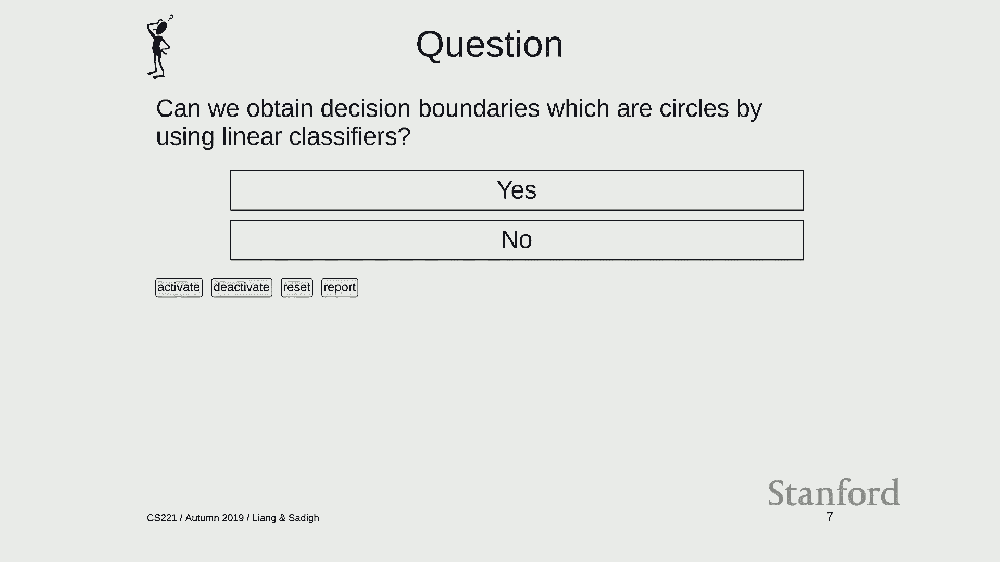

 2 of x and we want decision boundaries that look like this where you classify maybe these。

 as positive and these as negative。 Okay is that possible？ Yeah。

 If you map if you like take a square of those inputs then you get something to be linear。 Yeah okay。

 So you're saying yes。 Okay。 Okay。 Okay well there is a punch line there。 So。

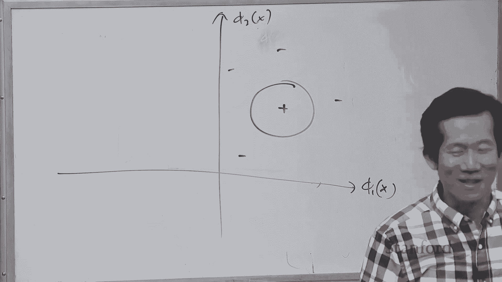

 it turns out that you can actually do this which maybe on the surface seems kind of surprising。

 right because we're talking about linear classifiers but as we'll see it really depends。

 on what you mean by linear classifiers and hopefully that will become clearer。 Okay so。

 we're going to start by talking about features which is going to be able to answer this question。

 Then we're going to shift gears a little bit and talk about neural networks which is in。

 some sense an automatic way to learn features and we're going to show you how to train neural。

 networks using back propagation hopefully without tears and then talk about nearest neighbors。

 which is another way to get really expressive models which is going to be much simpler in， a way。

 Okay so recall that we have the score。 So the score is adopted between the wave vector。

 and a feature vector and the score drives prediction so if you're doing regression you。

 just output the score as a number。 If you're doing classification binary classification。

 then you output the sign of the score。 And so far we focus on learning which is how you。

 choose the wave vector based on a bunch of data and how you optimize for that。 And so。

 now what we're going to do is focus on VFX and talk about how you choose these features。

 in the first place。 And this actually feature extraction is such a really critical important。

 part of kind of a machine learning pipeline which often kind of gets neglected because。

 when you take a class you say okay well there's some feature vector and then let's focus on。

 all these algorithms but whenever you go and apply machine learning in the world feature。

 extraction is turns out to be kind of the main bottleneck。 And neural nets can mitigate。

 this to some extent but you still it doesn't completely make feature extraction you know， obsolete。

 So recall that a feature extractor takes an input such as the string and outputs。

 a set of properties which are a useful for prediction。 So in this case it's a set of。

 named feature values。 Okay。 And last time we didn't really say much about this we just。

 kind of waved our hands and say okay here's some features。 So you know in general how。

 do you approach this problem what features do you include you just like start making。

 them up and how many features do you have we need maybe a better organizational principle， here。

 And you know in general feature engineer is going to be somewhat of an art so I'm not。

 going to give you a recipe but at least some framework for thinking about features。 So the。

 first notion is a feature template。 And a feature template is informally just a group。

 of features are all computed in the same way。 This is a kind of a somewhat pathetic but。

 kind of you know a terminology point that I want you all to kind of be aware of。 So a。

 feature template is basically a feature name with holes。 So for example length greater， than blank。

 So remember the concrete feature is length greater than 10。 Now we're going。

 to say length greater than blank where blank can replace with 10， 9， 8 or any kind of number。

 It's a template that gives rise in multiple features。 Last week a character equals blank。

 contains character blank。 These are all examples of feature templates。 So when you go in your。

 you know project or whatever and you describe your features or when you think about kind。

 of grouping these features in terms of you know these blanks。 Another example is pixel。

 intensity of position。 So even if you have what you consider to be like a raw input like。

 an image right there's still implicitly some sort of way to think about it as a feature。

 template which corresponds to like the pixel intensity of position blank comma blank is。

 a feature template that gives a rise to the number of features equals to the number of。

 pixels in the image。 And this is useful because maybe your input isn't just an image。 Maybe。

 it's an image plus some metadata than having this kind of language for describing all the。

 features in a unified way is really important for clarity。 Okay so as I alluded to each feature。

 template maps to a set of features。 So by writing last three characters equals blank。

 I'm implicitly saying well I'm going to define a feature for each value of blank and that。

 feature is going to be associated with a value which is just the natural evaluation of that。

 feature on that input。 Okay so all of these are zero except for nspoot。com is one。 Okay。

 so and in general you are going to have each feature template that might give rise to many。

 many you know features right。 The number of possible three letter characters is you know。

 some number of characters to a cube which is a large number。 So one question is how do。

 we represent this right。 Yes first vector。 Yeah good answer。 So mathematically it's really。

 useful just think about this vector as a D dimensional vector right。 Just D numbers just。

 laid out right and because that's mathematically convenient but when you go to actually implement。

 this stuff you might not represent things that way。 In particular you know what are the。

 ways you can represent a vector。 Well you can say I'm going to represent is a ray which。

 is just this list of numbers that you have but this is inefficient if you have a huge。

 number of features。 But in the cases where you have a sparse feature which means that。

 only a very few of the feature values are non-zero then you're better off representing。

 as a map or in Python a dictionary which you specify the feature name is a key and the。

 value is you know the value of that feature right。 And all the homework too will basically。

 work in the sparse feature you know framework and you know just to kind of a note a lot of。

 you know especially in NLP and we have discrete objects。 Traditionally it's been common to。

 use kind of these sparse feature maps。 You know one thing that has happened with the。

 rise of neural networks is that often you take basically your inputs and embed them。

 into some sort of fixed dimensional vector space and dense feature representations have。

 been more you know dominant but you know sparse features if you want to use linear classifiers。

 is still kind of a good way to go。 So it's important to understand this。 Okay so now。

 in sort of storing possibly a lot of features now you just store the key and the value。

 Alright so this was the feature templates the overall point is that is kind of organizational。

 principle and you know okay so now let's switch gears a little bit。 So which features or feature。

 templates should you actually you know write down。 And to get at that I want to introduce。

 another notion which is you know pretty important especially if you can understand if you think。

 about the theory of machine learning and that's a notion about hypothesis class。 Okay so。

 remember we have this predictor so for a particular weight vector that defines a function that。

 wraps inputs into you know some sort of score or prediction。 And the hypothesis class is。

 just the set of all predictors that you can get if you vary the weight vector。 Okay so。

 let me give you let me come back to this slide let me give you kind of an example here。 So。

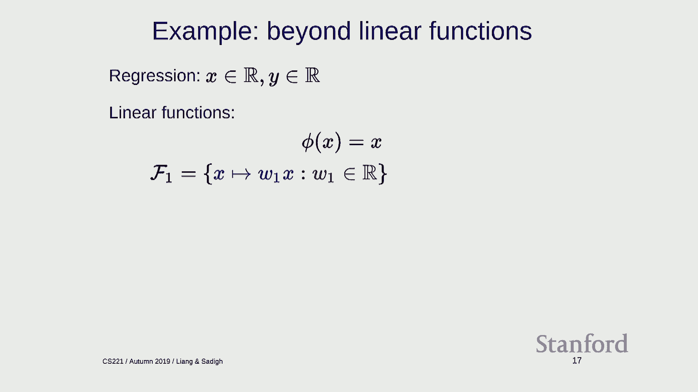

 suppose you're doing regression and you're doing you know linear regression in particular。

 So you're in one dimension here is x and here is you know I guess y。 So if your feature map。

 is just identity so maps x to x then this notation just means the set of all you know。

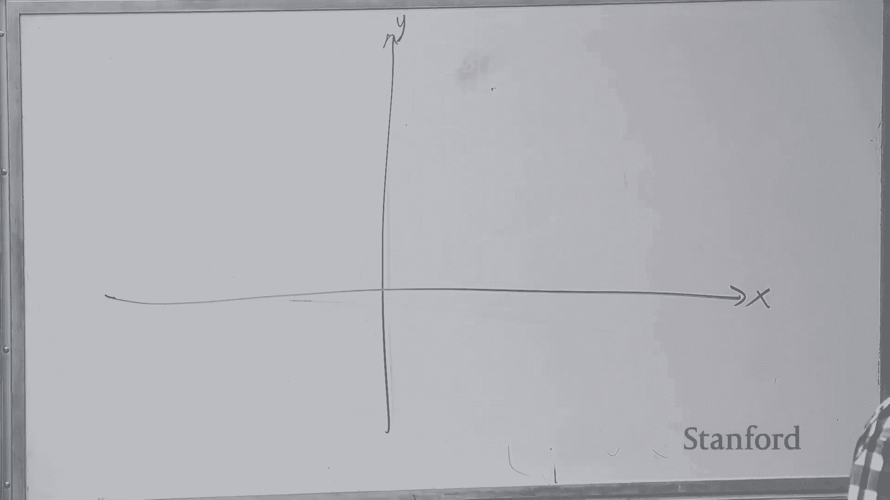

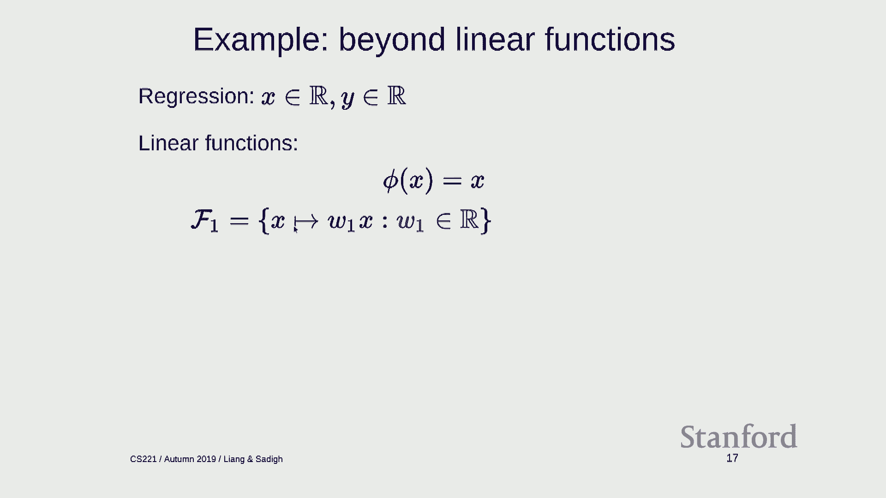

 linear functions like this。 Then the set of functions you get you can visualize as this， right。

 So you have you know one function here and for every possible value of w1 you， have a slope。

 You also have zero。 They should all go through the origin。 And so you have。

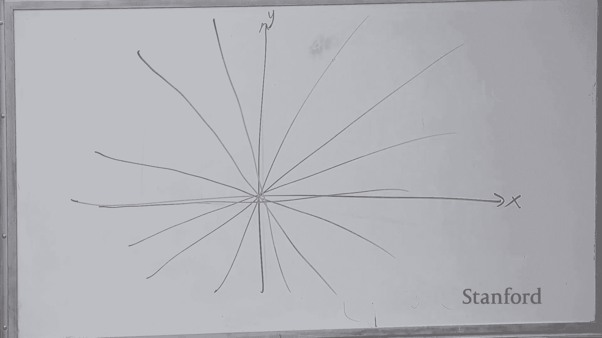

 no these are your functions right。 So your hypothesis class f1 here is essentially all。

 lines that go through the origin。 So just want to think about it when you write down。

 a feature vector you're implicitly committing yourself to saying hey I want to think about。

 all possible predictors defined by this feature map。 Okay so here's another example。 Suppose。

 I define the feature map to be x， x squared。 So now what are the possible functions you。

 know I'm going to get。 So does anyone want to say what a read off the slide what it is？

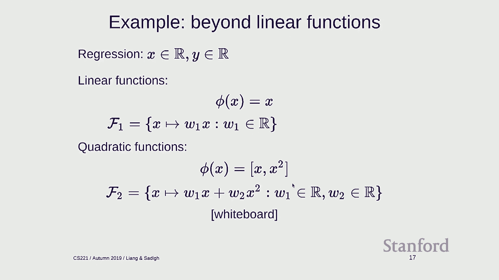

 It's going to be all quadratic functions right。 So in particular because I don't have a bias。

 term it's going to be all quadratic functions that go through the origin。 So let me actually。

 draw another L。 So it's going to be all quadratic functions that go through the origin which。

 look like this。 It could be upside down。 And if you really like that I'm not going to， draw them。

 In particular it also includes the linear functions right because I can always。

 set w2 equals zero and vary w1 which means that I also get all the linear functions too。

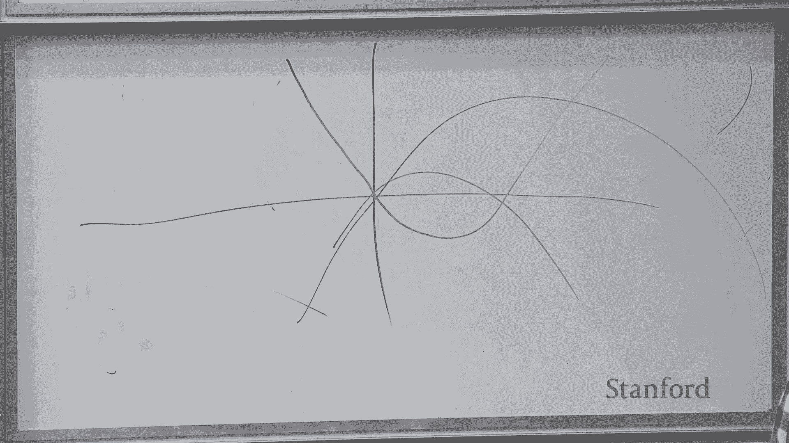

 So this means that f2 if you think about the set of functions is a larger set than f1。

 it's more expressive。 That's what we mean by expressive that means that it can represent。

 more things。 So for every feature vector you should think also about the set of functions。

 that you can get by that feature vector。 So let's， is there a question？

 We need to assess the fact that the best set of w are the more expressive set hard of the。

 optimized over。 The question is are the more expressive sets hard to optimize over？ In terms， of。

 you know， the short answer is not necessarily。 In terms of， sure you have more features so。

 that it requires more expensive。 Yeah， at that level。 But the difficulty optimization。

 depends on a number of different factors。 And sometimes adding more features can be easier。

 to optimize because it's easier to figure training data。 Okay， so now let's go back。

 to this picture。 Okay， so this is， on the board is concrete examples of feature or hypothesis。

 classes。 Now let's think about this big blob as the set of all predictors。 Any predictor。

 in your wildest dreams， you know， they're in this set。 Okay？ And whenever you go and you。

 define a feature map， that's going to carve out a much smaller set of functions。 Right？

 And then what is learning doing？ Learning is choosing a particular element of that function。

 family based on the data。 Okay？ So this picture shows you kind of the full pipeline of how。

 you're doing machine learning。 Is， you know， you first declare structurally a set of functions。

 that you're interested in。 And then you say， okay， now based on data， let me go and search。

 through that set and find the one that is best for me。 Okay？ So now there are， you know。

 two places where things can go wrong。 Well， for feature extraction， maybe you didn't have。

 enough features。 So now you're， your， your purple set is too small。 Then no matter how。

 much learning you do， you're just not going to get good accuracy。 Right？ And then conversely。

 even if you define a nice， you know， hypothesis class， if you don't optimize properly， you're。

 not going to find the element of that， you know， hypothesis class that fulfills your， your goals。

 Question？ The function F， the feature function that's extracted from the input， since that。

 you know， itself is a function， outcome， you can assume that your weight would be able to compute that。

 function also。 So the question is， so you're defining a function phi， right？ This is fixed。

 And then learning sets， weights， and together jointly they specify a particular function or predictor。

 So you don't choose t appropriately。 You're limiting the space that you would be able to， predict。

 Yeah。 But so I'm wondering why， but my， my intuition tells me that the whole。

 point of learning is that the， regardless of the phi that you choose， the actual model。

 that you choose should be able to， you know， learn the function phi that you would have， picked。 Oh。

 I see。 So the question is， does， doesn't learning kind of compensate and just figure。

 out the phi that you would have picked？ So the answer， the short answer is no。 The phi。

 is really kind of a bottleneck here。 For example， just， if you define phi to be x， so that's。

 linear function。 Linear function is all you're going to get， right？ So if your data moves。

 around in a sinusoidal way， you're just going to like fit a line through that and you'll。

 get horrible accuracy and no amount of learning can fix that。 The only way to fix that is by。

 changing your feature representation。 So does that assume that W is a linear model？ So yes。

 so all of this assumes that W， we're talking about linear predictors。 But of course。

 the same general idea applies to any sort of function family， neural nets。 So the equivalent。

 there would be not just the feature map but also the neural net architecture is a constraint。

 on what kind of things you can express。 So if you have only a two layer neural network。

 then there's just some things that you just， you know， with a fixed size， there's just some。

 things you just can't express。 Yeah， another question。

 Just a follow on to that as well as an altered interpretation of the question。 I thought it。

 is more of a question of why perform featureization rather than taking in the raw data。 You have。

 like a neural net， it's still a function of linear classifiers but it has enough complexity。

 that it can describe nonlinear behavior。 Yeah， so the question is why bother doing feature。

 in engineering has a neural net kind of basically solve that。 So to some extent， the amount。

 of feature engineering you have to do today is much less。 One thing that I think is still。

 important to think about in feature engineering is it's really， think about is what sources。

 of information you want to predict。 For example， if you want to predict some property about。

 your movie review。 Part of the first order bits are like what even goes into that。 Does， it。

 the text go into that you have metadata， do you have other star ratings。 And those， are， you know。

 features。 You can， there's， I guess no such thing as like raw because。

 there's always some code that takes， you know， the， you know， the world distills it down into。

 something that fits in memory。 So that's， you can think about as feature extraction。 Thank you。

 Yeah。 Okay， one last question。 What is the problem with too many features or what are you。

 what your hypothesis class， to be too big？ Is it like a overfitting thing？ Yeah， yeah。

 So the question is why don't you just make fee as large as possible to throw， on all the features。

 And overfitting is， you know， one of the main concerns there， which， you know。

 we'll come back to in the next lecture。 Okay， great questions。 So let's， let's actually。

 skip over this。 So there's another type of feature function you can define， but in interest。

 time time I'm going to skip over that。 Okay， so now let's come back to this question。 It's， linear。

 I keep on saying linear， linear predictors。 What， what， what is linear？ Right？ So remember。

 the prediction is driven by the score。 Right。 So here's a question。 Is this score linear， and W？

 Yes。 Right。 Because what is a， you know， linear function， it's basically some kind。

 of weighted combination of your inputs。 Okay， so is it a linear and fee of X？ By symmetry。

 should be because it's just a dot product。 So is it linear and X？ No。 In fact， this question。

 doesn't even make sense because think about X， X remember was a string。 Right。 It's not， a。

 it's not even a number。 So， and that's when you know the answer should be no because， you know。

 it doesn't， it， there's a type error。 Okay， so here's， here's kind of the， cool thing now is。

 you know， these predictors can be expressive nonlinear function in decision， boundaries of X。

 You know， in the case where X is， is a actually a real factor。 But the。

 score is a linear function of W。 Okay。 So this is cool because， you know， from a， there's。

 two perspectives， right？ From the point of actually doing prediction， you know， you're。

 thinking about like， well， how does this function operate on X？ And you can get all sorts of。

 you know， crazy functions coming out。 We just looked at quadratic functions， which is clearly。

 not a linear， but you can do all sorts of， you know， crazy things。 But from the point。

 of view of learning， it doesn't care about X。 All it sees is phi of X。 In particular， you're。

 learning， ask the question， how is this function depend on W？ Right。 Because it's tuning W。 And。

 from that perspective， it's a linear function of W。 And， you know， for reasons I'm not going， to。

 you know， go into， these functions permit efficient learning because the loss function。

 becomes convex。 Which I'll， that's all I'll say about that。 Okay。 So， so one kind of。

 cool way to visualize what's going on here is， you know， going back to our circles example。

 So remember， we want this two dimensional classification problem where the true decision。

 boundary is， you know， let's say a circle。 So how do we fit that？ And what does it mean。

 for a linear thing？ Because when you think linear， it's like should be a line， right？

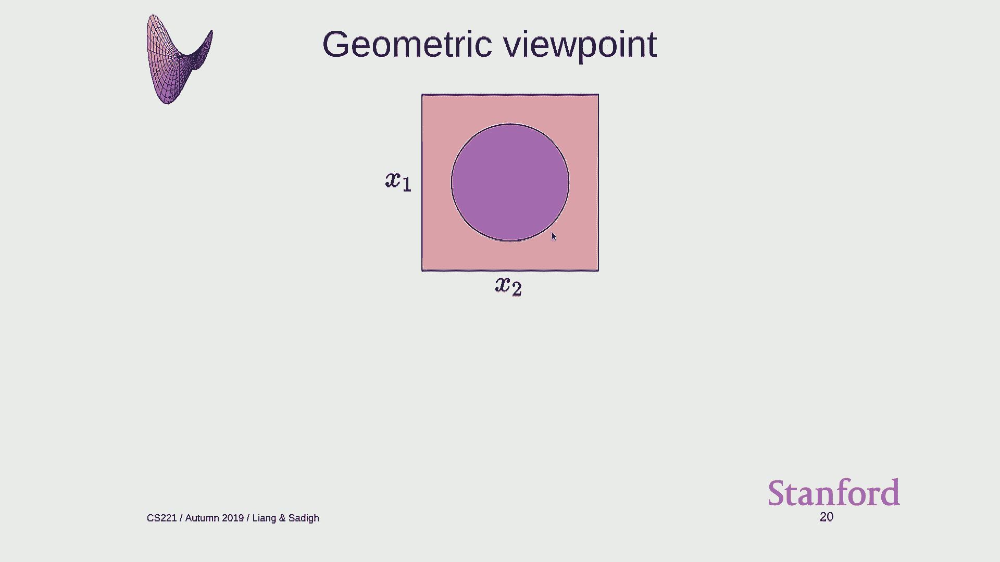

 So here's a kind of a cool， graphic。 So okay。 So here is these points inside the circle。

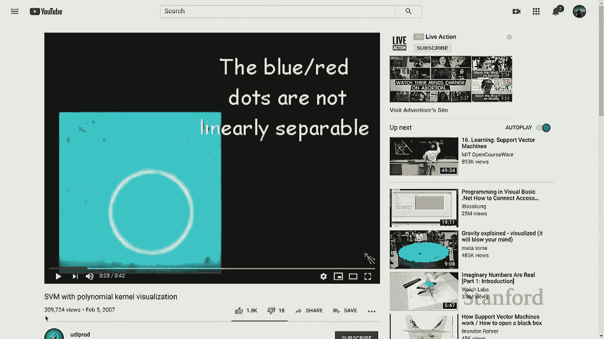

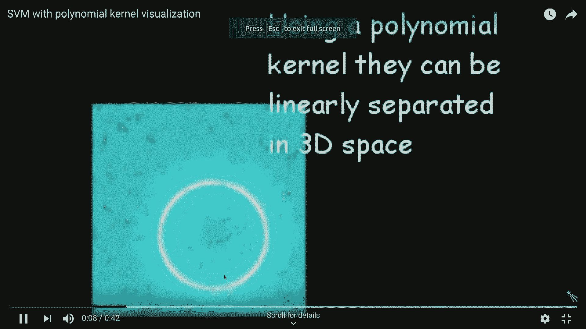

 And you know， it can't be classified。 But the point is when you look at the feature map。

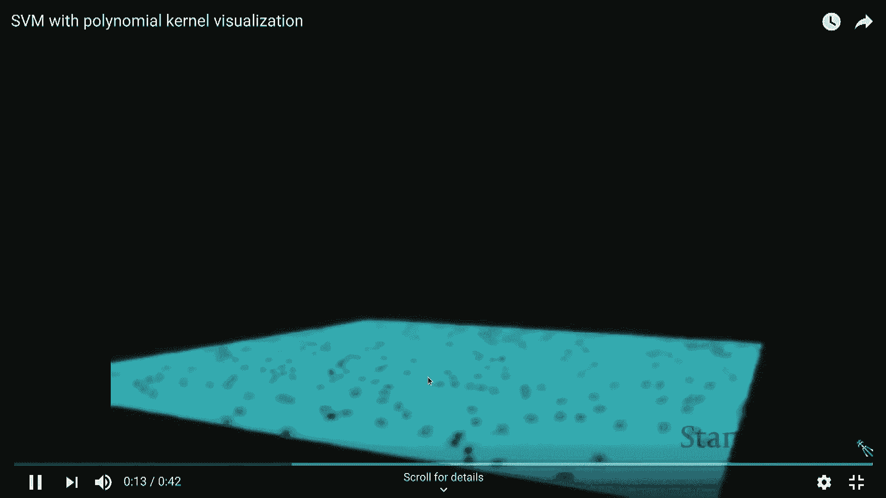

 it actually lifts these points into a higher dimensional space。 Now I have three features。

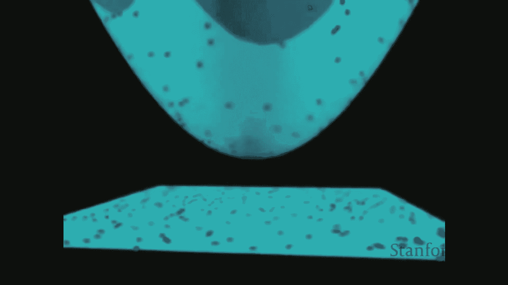

 right？ And， and you know， in this higher dimensional space， I can actually， things are linear。 I。

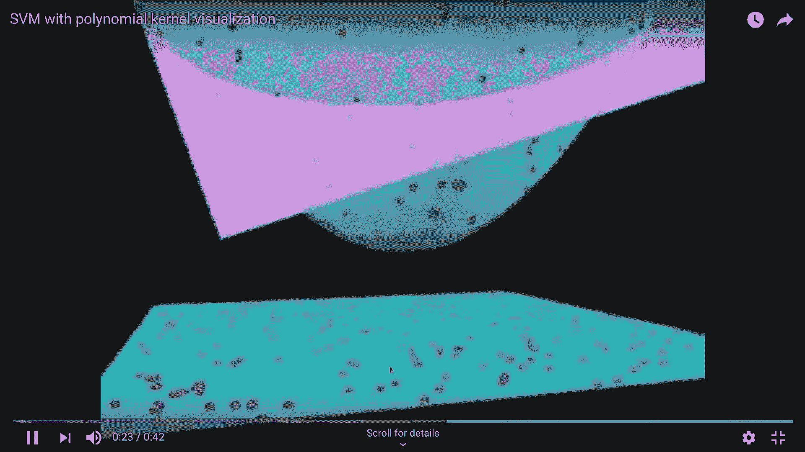

 can slice it with a kind of a knife。 And then， you know， in that high dimensional space。

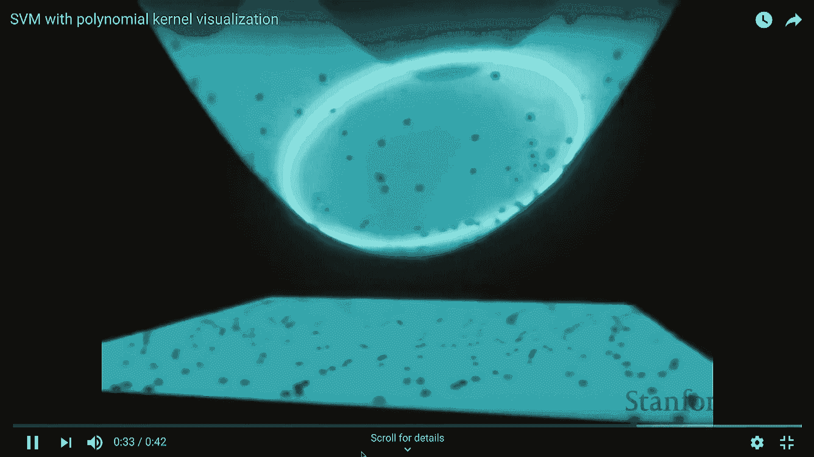

 it things are cut。 And what it induces in the lower dimensional space is， you know， the circle。

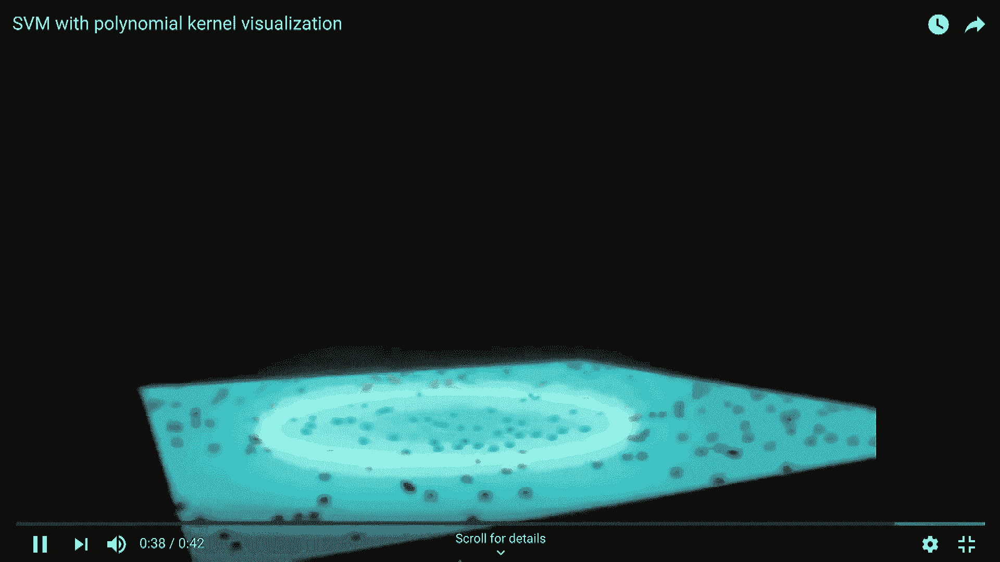

 Okay。 Okay。 Okay。 Okay。 So hopefully that was a nice visualization that shows how you。

 can actually get nonlinear machine functions out of kind of essentially linear machinery， right？

 So someone， the next time someone says， well， you know， you know， linear classifiers。

 are really limited。 And you really need neural nets。 You know， that's technically is false。

 because you actually get really expressive models out of your neural networks， or out。

 of linear models。 The point with neural networks is not that they're not you're more， necessarily。

 more express， they can be more expressive。 But the fact that they have other advantages。

 for example， the inductor bias that comes with architectures and the fact that they're。

 more efficient when you go to a more expressive models and so on。 Okay。 So， so to kind of wrap。

 up all things， I want to kind of do us， you know， simple exercise。 So here's a task。 So。

 imagine you're doing a final project and you want to predict， you know， whether two consecutive。

 messages in some forum forum or a chat are， or the second one is a response to the first。

 So it's binary classification input is two messages and you're asked to predict whether。

 the second is a response to the first。 Okay。 So we're going to go through this exercise of。

 coming up with， you know， features that might be or feature templates might be useful to。

 pick out properties of X might be useful。 And we're going to assume that we're dealing。

 with linear predictors。 Okay。 So what are some features that might be useful？ Let's， you know。

 let's， here's， let's start with a few。 Okay。 So how about time elapsed between， the two messages？

 Is that a useful feature or not？ I mean， you say yes。 Okay。 So this， information is definitely good。

 Once subtle point is that this time elapsed is a single。

 number and this number is going to go into the score kind of in a linear fashion。 Okay。

 So what does that mean？ That means， you know， if I double the time， then the score is going， to。

 or that contribution to a score is going to like multiply by two。 Right。 So think about， it。 It's。

 it's kind of like saying the， as I increase the time， you know， the， it becomes， you know。

 linearly more likely that I'm going to be， let's say， not a response or response。 So this is。

 you know， maybe kind of not what you want because， you know， the difference， from that perspective。

 like if you， the time elapsed is like a year， then that really kind， of dominates the。

 the score function。 And it's like more likely that it's going to be a response。

 than if it were like one minute， which is kind of not what you want。 Yeah。 Question。 Yeah。

 So the question is， can you normalize it？ So you have to be careful with normalization。 So you have。

 if you normalize， let's say the span of like over one year。 Now， now there's。

 no difference between like， you know， five seconds and one minute because everything gets。

 squashed out to zero。 Right。 So one way to go and approach that is to， you know， discretize。

 the features。 So one trick that people often do is if you have a numerical value， which。

 you really kind of want to， um， treat kind of in a sensitive way， you can kind of break。

 up into pieces。 So the feature template would look something like time elapsed is between。

 blah and blah。 So you can do things like， okay， is it between zero seconds and five seconds？

 And is it between five seconds and like a minute and between a minute and an hour and。

 an hour and a year or something。 And then after that， it doesn't matter。 Um， because that。

 will give you kind of more， um， it's， it's more domain knowledge that tells you kind of。

 what things to look out for。 The difference between， let's say a year and a year plus two。

 seconds is really， you know， it doesn't matter。 Right。 Whereas the difference between one second。

 and five seconds might be significant。 So this is all to a long way of saying， you know。

 if you're using linear classifiers or even if you're using neural networks， I think it's。

 really important to think about how your raw features are kind of entering the system。

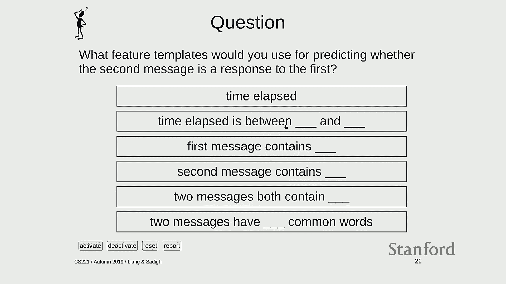

 and think about like， hmm， if I change this feature by like scaling it up， does the prediction。

 change in a way that， you know， I expect？ Yeah。 Yeah。 Question？ If we， uh。

 approve that second feature right there， um， what prevents us from having， let's， say， um。

 if we had a couple of， um， from zero to five seconds and then from 30 to 40 seconds， and then so on。

 what prevents us from having just the entire， uh， domain？ Yeah。 So， uh。

 the question that like if you have every possible range， isn't that like。

 an infinite number of features？ Um， so， uh， there's two answers to that。 One is that even。

 if you did that， you might still be okay because there's probably some， um， if you think about。

 like discretizing the space of， you know， here it is， your time elapsed time elapsed and you're。

 basically saying for every bucket， I'm going to have a feature。 Um， it is true that you。

 have an infinite number of， you know， features but， you know， at some point you might just。

 cut it off and if you didn't cut it off and use a sparse feature representation， um， you。

 don't have to， um， have a preset， you know， maximum because remember most of these features。

 are going to be zero because of chances of some data point being like， you know， 10 years。

 is going to be essentially， you know， you know。 Um， another answer is that， um， in general。

 when you have features that are， have multiple timescales， um， you want to kind of space it。

 out kind of logarithmic way。 Um， so， you know， one to two， two to four， four to eight， um。

 so that you can have both kind of sensitivity in the low regions but also， um， kind of cover。

 a large， um， you know， magnitude。 Yeah， in the back。

 Is it possible to learn like how to discretize the features to make it the most informative？ Um。

 question is， is it possible to learn how to discretize the features？ Um， there are。

 there's definitely more automatic things you can do besides， you know， just like span specifying。

 them。 Um， at some level though you have to kind of input the value in a form like if you've。

 inputted it into X versus let's say log of X。 Um， those choices often can make a， you know。

 big difference。 Um， but， um， if you use more expressive models like neural networks you， can。

 you know， mitigate some of this。 Yeah。 I see the value in changing time elapsed， uh。

 from a number to like a Boolean or whether， it's also tweener range。

 When would you want to retain a numerical value for the feature？

 When would you not want to discretize it？ Yeah， good question。

 So when would you actually want to not discretize it？ Um， so there are。

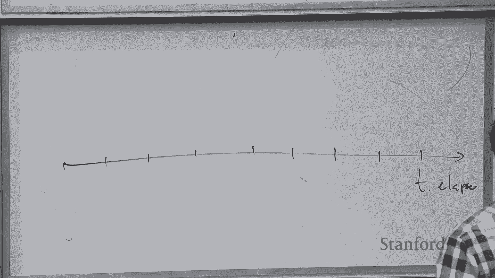

 um， essentially when you expect kind of the， the scale of that feature to， um， really kind。

 of matter in， in some， in some sense。 So， so， so certainly when you think that some things。

 behave linearly， um， then you just want to preserve the linear， or if you think that it。

 behaves quadratically， then you want to keep the feature but also add like a squared term， to it。

 Okay。 I want to maybe move on。 Um， uh， these are all good questions。 Happy to discuss， more offline。

 Um， so some other features might include the first message contains blank or， blank as a string。

 Right。 So maybe things like， you know， question marks are more indicative， of， you know。

 things being the second message being response。 Second message contains certain， words。 Um， um。

 two messages both contain a particular word。 Um， you know， there's cases， where， um。

 it doesn't really， it's not the presence and absence of particular words in， the， in individual， um。

 messages but like the fact that they both share a common word。 You know， that might be useful。 Um。

 here's another feature which is， you know， two measures， have the， um。

 some number of common words together。 Um， so this feature is kind of interesting， because it's， um。

 there's， you know， for example， you look at this feature， it's how the number， of。

 when I say feature， I actually mean feature template。 Um， so for this feature template， um。

 there are many， many features， one for possibly any number of words。 And this again。

 leads to cases where you might have a lot of， um， you know， sparsity and you might not have。

 enough data to fit all the features。 Whereas this one is very compact that says， I just。

 have to look at them， um， number of overlaps。 So the， the two messages might contain a word。

 that I've never seen before but I know it's the same word and I can kind of recognize that， pattern。

 Um， so， you know， there's quite a bit of things you can do to play around with。

 features that capture， um， you know， the intuitions about what's might be relevant to your task。

 Question？ Yeah。 I have a lot of these sparse features like with the third word in Bitcoin here。

 Is that， one we want to do like dimensionality reductions like knock out some of those many。

 many features？ Um， so question is when you have a lot of sparse features do you want to do dimensionality。

 reduction？ Um， not necessarily。 Um， so in terms of computation， having sparse features。

 doesn't necessarily mean that it's going to be， you know， really slow。 Um， because there's。

 efficient ways of， um， you know， representing sparse features。 Um， in terms of， you know。

 expressivity， one thing that， um， in a lot of NLP applications， you actually do want。

 a lot of features。 Um， and you can have a lot more features than you might think you， can handle。

 Um， and because you really want the first orbit is just to， you know， be。

 expressive enough to even fit the data。 Okay。 Let me move on， um， since， you know， I'm running。

 short on time。 Okay。 So summary so far， you know， uh， we're looking at features。 We can。

 define these feature templates which organize these features， uh， in a kind of meaningful， way。

 Then we talked about hypothesis classes which are， are defined by features and this。

 defines what is possible out of， from learning。 Um， and all of this is in the context of linear。

 classifiers which incidentally can actually produce these nice non-linear decision， you， know。

 boundaries。 So at this point you can actually have kind of enough tools to， um， you know， do a lot。

 Um， but in the next section I want to talk about neural networks because， um。

 these are even more expressive models which can be， you know， more powerful。 Um， um。

 one thing I often recommend is that， um， you know， when you're given a problem， you know。

 always try the simplest thing。 I will always try kind of the linear classifier and just。

 see where you get because sometimes you'd be surprised at how far you can get with linear。

 classifiers and then， and then go and kind of increase the complexity as you need it。

 I know there's sometimes a temptation to， you know， try the fancy new shot， um， you know， uh。

 hammer but， um， sometimes keeping it as simple is， you know， really， really good。 Okay。

 so neural nets， um， there's a couple ways of motivating this。 Um， one motivation。

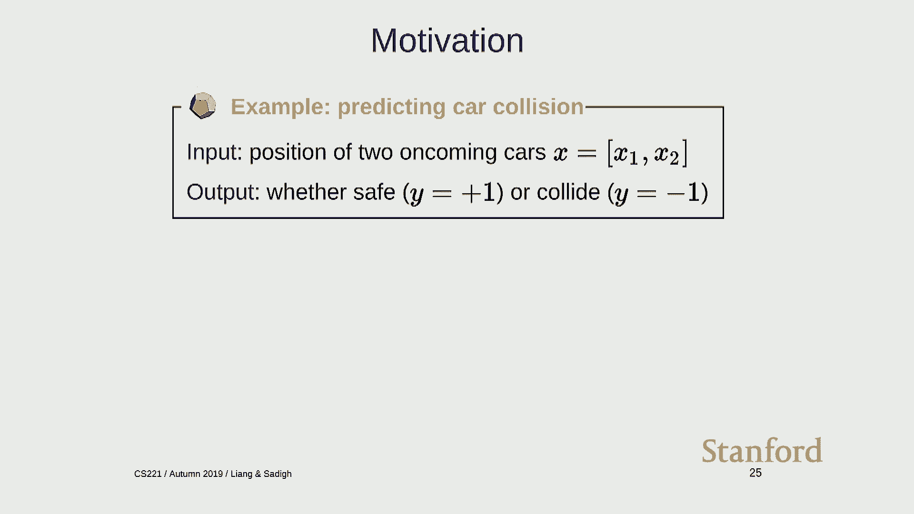

 is， um， you know， comes from the brain。 Um， I'm going to use a kind of slightly different， um。

 motivation which comes from， um， kind of this idea of decomposing a problem， you know， two parts。

 right？ So this is a somewhat contrived example but hopefully it will allow us to build。

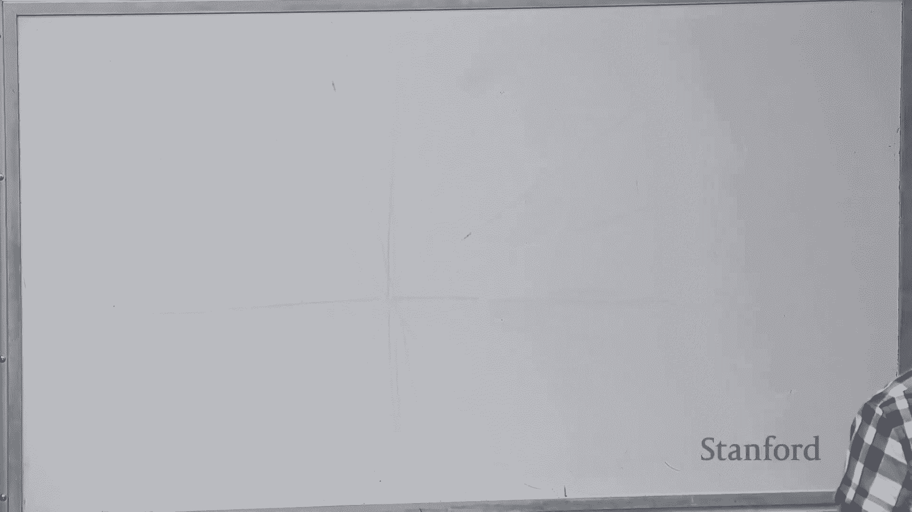

 up the intuitions for， you know， what's going on in a neural network。 Um， okay， so suppose。

 I am building some sort of， uh， system to detect whether two cars are going to collide。 Okay。

 so the way it works is I have this car at position X1 and it's， you know， driving。

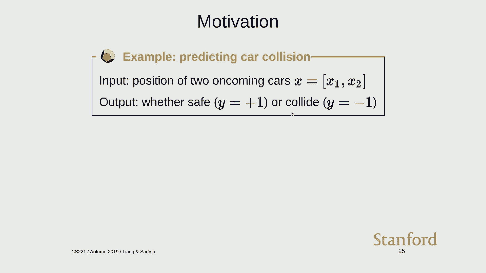

 uh， this way and then I have another car at position X2 and it's driving this way and。

 I want to determine whether it's safe， um， which is positive or if it's going to collide。 Okay。

 and let's suppose for， uh， simplicity that the true function is as follows。 Okay。

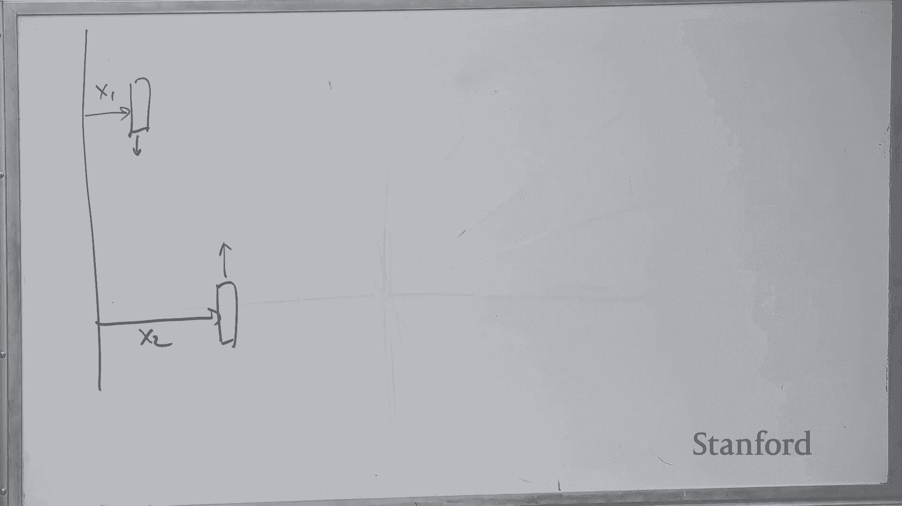

 so it's just measuring whether the distance is at least one apart。 Now this is kind of。

 a little bit， uh， you know， like what we did in the last lecture where we suppose there。

 was a true function and then see if learning can recover that。 Um， where in practice obviously。

 we don't know the true function but this is for kind of pedagogical purposes。 Okay， so。

 just to make sure we understand what function we're talking about。 So if， um， X1 is one and。

 X2 is three， um， kind of like that on the board then you're plus one。 So this is like。

 driving in the US。 This is like driving in the UK。 Um， and that's fine too。 Um， but if you're， um。

 uh， you know， too close together then that's bad news。 Okay。 All right， so let's think。

 about decomposing the problem。 Right， because if you look at this， you know， this， this could。

 be a kind of a complicated， um， you know， function but let's try to break it down into。

 kind of linear functions。 Right， because at the end of the day neural networks are just。

 a bunch of linear functions with， um， which are stitched together with some non-linear。

 so like there are kind of linear components that are， um， critical to neural nets。 Okay。

 so one sub problem is detecting if car one is to the far right of car two。 Okay， so X1。

 has X2 is greater than equal to one。 Um， another problem is testing whether car two is a far。

 right of car one and then， um， and then you can put these together by saying， um， if at。

 least one of them is， you know， one， then I'm going to predict safe。 Um， otherwise I'm。

 going to predict， uh， not safe。 Okay， so here's a kind of concrete example。 So for one three， um。

 car two is a far right of car one。 So that's a one， you add these uptake to sign。

 that's plus one in the opposite direction。 It's so fine。 And in this， this case， both H1。

 and H2 are zero。 So that's， uh， bad news。 Okay。 So this is just kind of trying to take。

 this expression， which is true function and kind of write it in a kind of more， um， modular。

 way where you have different pieces corresponding to different computations。 Okay， so now， um。

 we could just write this down obviously to solve this problem， but that we already knew。

 what the right answer is。 But suppose we didn't know what the true function is and we just。

 had data。 So， so we don't actually know what these functions are。 So can we kind of learn。

 learn these functions automatically？ So what I'm going to do is going to define a feature。

 vector now， um， of X， which is going to be one X1， X2。 Okay。 Um， and then I'm going to。

 rewrite this intermediate sub problem as follows。 So X1 is X2 greater than one is going to be。

 represented as this， uh， vector V1 dot V of X， where V1 is minus one plus one minus one。

 So you could， if you pause for a second， um， you can verify that this is X1 minus X2， you， know。

 greater than equal to one。 Okay。 So this is just another way of writing， um， you， know。

 what we wanted in terms of this， like， dot product。 And you can see kind of how。

 this is maybe moving more towards something that looks more general。 Yeah。 So the kind。

 of why is there's this one here？ Um， so this one typically is known as a bias term， which。

 allows you to， um， not just， uh， you know， threshold on zero， but threshold on kind of。

 any arbitrary number。 So in the linear classifiers that I've， you know， talked about， I've kind。

 of swept this under the rug。 Generally， you always have a bias term that allows you to。

 kind of modulate how likely you're going to predict one versus， uh， minus one。 Okay。 So。

 you can also do it for H2。 It's the same thing， but just， um， you know， switching the roles。

 of X1 and X2。 Um， and now for the sign of final sign prediction， you can write it as follows。 Um。

 now these are just weights on， um， H1 and H2。 Okay。 So now here is the， the kind of， the。

 the punch line is， you know， for a neural network， we're just going to leave V1， V2。

 and W as unknown， uh， quantities that we're going to try to， uh， fit through training。 Right。

 We motivated this problem by saying， okay， in this case， there's some choice of V1， V2。

 W that works， but now we're kind of generalizing。 If we didn't know those quantities， we just。

 leave them as variables and we can actually still fit， um， fit these parameters。 Okay。 So， um。

 before we were just tuning W and now we're tuning both V and W。 V specifies the。

 choice of the hidden problems that we're interested in and W governs how do we take the results。

 of the hidden problems and， uh， come to a final prediction。 Okay。 So there's one problem。

 here which is that if you look at the gradient of H1 with respect to V1， um， it happens to。

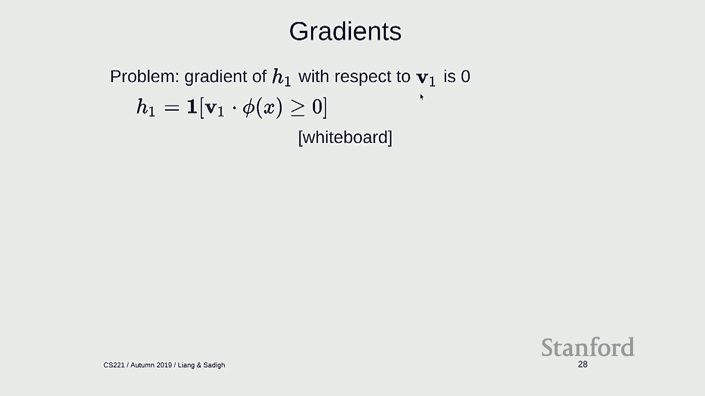

 be zero。 Okay。 So if you look at， um， the horizontal axis is V1 dot V of X and the vertical axis。

 is H1。 Um， that function， um， is， looks like the step function， right？ Because indicator。

 function of some quantity greater or equal to zero， it's one over here， zero over here。 Um。

 and remember we don't like zero gradients because SGD doesn't work。 So the solution， um， here is to。

 um， take some sandpaper， um， and you， you know， sand out those functions， smooth， it out and， uh。

 then you get something that is， um， you know， differentiable。 So， uh， the。

 logistic function is this function which is， um， a smooth out version of this which， um， rises slow。

 It doesn't hit one or zero ever， but it becomes extremely close， but it kind， of， um。

 goes up in the， in the middle。 And you can think about this as， um， a differentiable， um。

 or I guess a smooth version of， uh， the step function。 Okay。 So it kind of behaves。

 and looks like the step function， it serves kind of the same intuition that you're trying。

 to test whether some quantity is greater than zero， but it doesn't have zero gradients， anywhere。

 Okay。 And you can double check if you take the derivative， then this is actually。

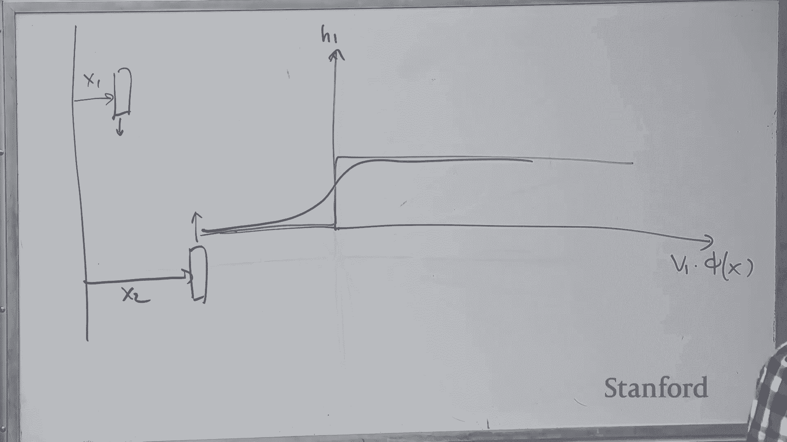

 it has this kind of really interesting and nice form which is the value of the function。

 times one minus the value of the function。 And the value of function never hits zero。

 so this quantity never hits zero。 Okay。 So， so now we can define， uh， no nuts in contrast。

 to linear function。 So remember linear functions， um， we can visualize it as， um， inputs go， in， um。

 and each of the inputs gets， um， weighted by some， uh， w and you get the score。 Okay。

 So this is a linear， what a linear function looks like。 Now neural networks with one。

 hidden layer and two hidden units， one， two， looks something like this， where you have， um。

 these intermediate hidden units which are the sigmoid function， um， applied or logistic。

 function in this case and， uh， to be concrete， um， applied to， um， this wave vector vj times， uh。

 phi of x。 So h1 is， uh， going to be taking the input， multiply it by a vector， uh， and。

 you get some number here and then you send it through this， um， logistic function to get。

 some number。 And then finally you take the output of h1 and h2 and you， uh， take the。

 dot product with respect to w and then you get the final score。 Okay。 So again， the intuition。

 is that neural nets are trying to break down the problem into a set of， you know， sub。

 problems where you， the sub problems are the kind of the， the result of these intermediate。

 computations。 And you can think about these as like， you know， h1 is really kind of the。

 output of a mini linear classifier。 H2 is the output of a mini linear classifier and。

 then you're taking those outputs and then you're， you know， sticking them through another linear。

 classifier and getting the score。 So this is what I mean by， you know， at the end of， the day。

 it's kind of linear classifiers packaged up and strung together and the expressive power。

 comes from the kind of the composition。 Yeah， question？

 >> The h sub j when there's like multiple phi vectors。 How do you combine them？ >> Uh， the question。

 how do you get h sub j when there's multiple phi's？ There's only， one phi of x。 Oh， so this is。

 this is a first component of phi of x。 So this vector， there's。

 this is a three dimensional vector which is phi of x and it has three components。 Yeah。

 >> Perhaps the entire part， the hj's， has effectively features， kind of。 >> Yeah。 >> That are like。

 that like， read， like， I don't know if I'm kind of function of the original features that you put in and they。

 make like new features that are better than the one people。 >> Yeah， yeah。

 So that's kind of my next point， which is that one way you can think about it。

 is that the hj's are actually just， you know， features which are learned automatically from。

 data as opposed to having a fixed set of your features phi。 Right？ Because at this layer。

 W always sees these， you know， h's which are coming through which look like， you know， features。

 And for deeper neural networks， you kind of just keep on stacking this。 So， you know。

 this output of one set of classifiers becomes the features to the next layer and then。

 the output of that classifier becomes the features to the next layer and so on。

 And the intuition for， you know， deeper networks is that， you know， as you proceed。

 you can derive more abstract， you know， features。 For example， images， you start with pixels and。

 then you find kind of edges and then you define kind of object parts and then now you define kind。

 of things which are closer to the actual classification problem。 Yeah。

 >> One and h2 develop the exact same value。 Do you have to have a bias to start with？ >> Yeah。

 it's a good question。 So why don't h1 and h2 basically end up in the same place， because， you know。

 because of symmetry？ If you're not careful， that will happen。 So if you。

 initialize all your weights to zero and， or initialize these weights the same way。

 then they will be kind， of move in lock， lockstep。

 So what is typically done is you randomly initialize so they kind of， you break the symmetry。

 And then what the network is going to do is trying to use， learn。

 kind of automatically learns the subproblems to be kind of complementary because you're doing。

 this joint learning。 Yeah， fun question。 >> How do I choose a sigma function？

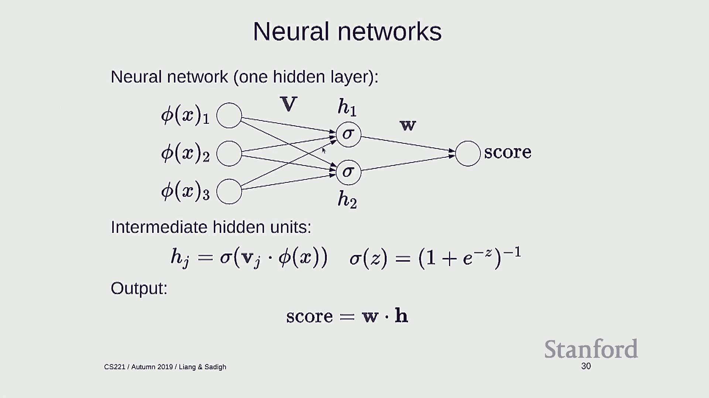

 >> So this is， so in general， sigmoid functions are these， or activation functions are these。

 nonlinear functions。 So the important thing is it's a nonlinear function。 I chose this。

 particularistic function because it's kind of the classic neural net and it looks like the。

 step function which is kind of takes a score and outputs a classification result。 I should。

 you know， responsibly note that these are maybe less in style than they used to be。 And the。

 the cool thing to do now is to use what is called a value or rectified linear which looks like this。

 And you might ask like why this one， well， there's no one reason but this， this function has less。

 of a kind of this gradient going to zero problem。 It's also simpler because it doesn't require。

 exponentials。 But there's， I'm going to just leave it at that。

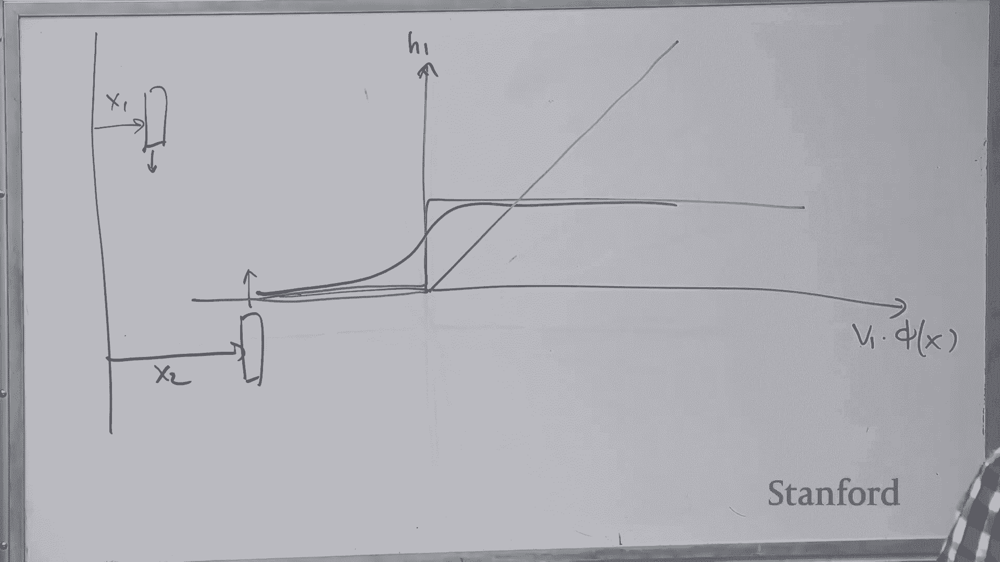

 What the benefit of this function is pedagogical reasons and it's a little bit of a throwback。

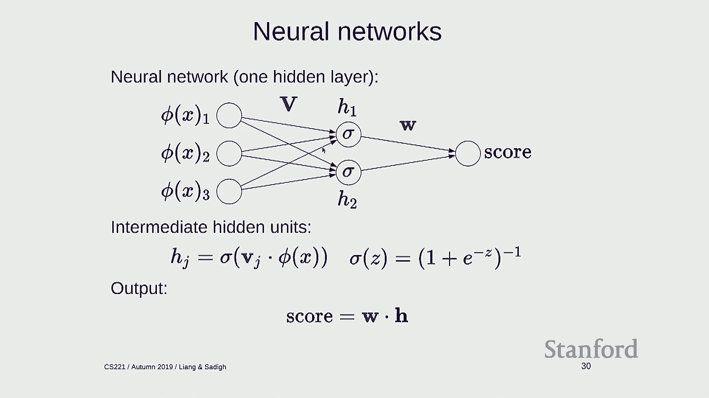

 too。 Okay。 Yeah， if you read the notes in the lecture slides， there's more details on like。

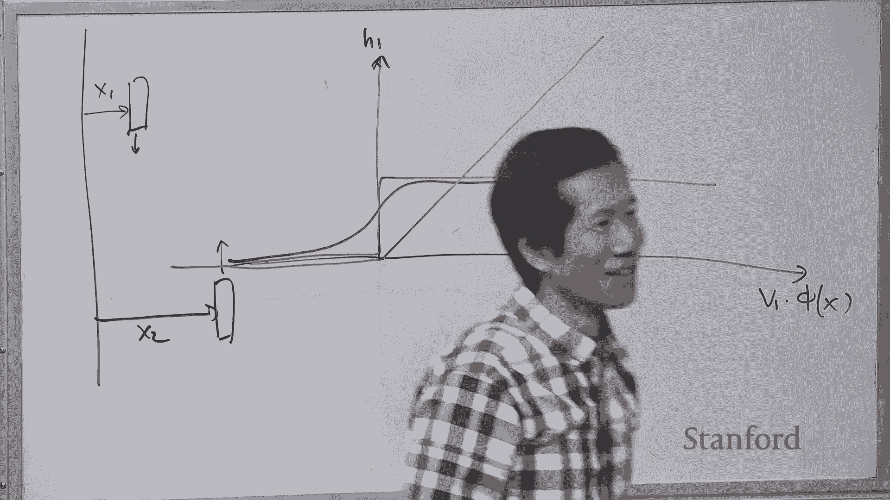

 why you might change。 Choose one versus another。 Okay， so now we're kind of ready to do neural net。

 learning。 Right， so， okay， remember we have this optimization problem。 It's， it's a training loss。

 Now it depends on both V and W。 And the training loss remember is the average of the losses of。

 the individual examples。 The loss of the individual example， let's say we're doing regression is。

 the square difference between Y and the function value。

 And remember the function value is a summation， over the。

 the weights at the last layer times the activations of the hidden layer。 And， and that's。

 basically it。 Okay。 And now all you have to do is compute this gradient。

 So you look at this and you， say， okay， well， you know， if you get， you know。

 have enough scratch paper， you can probably like， work it out。

 I'm going to show you a different way to do this without grinding through the， chain rule。

 So this is going to be based on the computation graph， which will give you insight， more。

 additional insight into the kind of the structure of computations and visualize what it means。

 what does， a gradient kind of mean in some sense。 And it also happens that this computation graph is really at。

 the foundation of all these modern deep learning frameworks like TensorFlow and PyTorch。 So this is。

 a real thing。 You know， it turns out that， you know， when I've taught this， it。

 many people still kind， of prefer to grind out the math。 I can't really tell why。

 except for maybe you're more familiar with， that。 So I would encourage everyone to kind of at least try to think about the computation graph as a。

 way to understand， you know， gradients， even though initially it might not be， you know， faster。

 And it's， not to say that you always have to draw a graph to compute gradients， but， you know。

 doing it a few， times might give you additional insight that you would otherwise get。 Okay。

 so here we go。 So， functions， we can think about them as just boxes， right？ The boxes。

 you have some inputs going in， and then you get some output。 That's all a function is。 Okay。

 and partial derivatives or， you know， gradients。 Ask the question， the following question。

 How much does the output change if the input changes， a little bit？ Okay， so， for example。

 if we have this function that just computes two times in one plus， into， in three。

 you ask the question like， you take input one and you just add a little bit of epsilon。 So。

 it's like 0。001。 And you ask， hmm， and then you read out the output and you say。

 what happened to the output？ Well， in this case， the output changed by two epsilon additively。 Okay。

 so then you conclude that the gradient of this function with， respect to n1 is， is 1。 2， right？

 Because the gradient is kind of the amplification。 If I put in epsilon， then I get two epsilon out。

 the， gradient is 2。 Or the partial derivative。 So， okay， let's do this one。

 So if I add epsilon to n2， then I， simply algebra shows I get a change in n3 epsilon。

 So what's the partial with respect to n2？ In three， right？ Okay， good。 So， you know。

 you could have done the， you know， basic calculus and gone that。

 But I really kind of want to stress the kind of， interpretation of， you know。

 perturbing inputs and witnessing the output because I think that's a useful interpretation。 Okay。

 so now， all functions are， well， not all functions are made out of building blocks。

 but most of the functions that we're interested in， in this class。

 are going to be made out of these five pieces。 Okay？ And so for each of these pieces， it's。

 you know， it's a function。 It has inputs， a and b。

 and you pump these things in and you get some output。 So this is plus， minus， times， max。

 and the logistic function。 Okay， so on these edges。

 I'm going to write down in green the partial derivative with respect to the input that's going into that function。

 Okay， so let's do this。 So if I have the function a plus b。

 the partial derivative with respect to a is one， and the partial derivative with respect to b is one。

 Okay？ And if you have minus， then it's one and minus one。 If you have times。

 then the partial is b and a。 Okay？ Everyone follow so far？ Okay， so max， what is this？

 This is maybe a little bit trickier。 So remember， we kind of experienced the max last time。

 So in the max example， you have， let me just refresh。

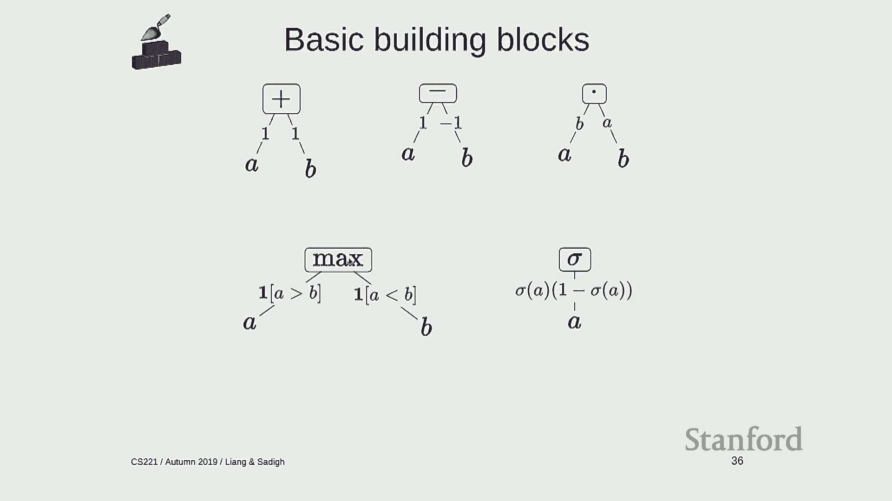

 So remember， last time we saw the max in the context of the hinge loss。

 So you have the max of these two functions， which is this， which means that， you know。

 let's say one is a and the other is b。 So if a is greater than b。

 then we need to take the derivative with， sorry， then， okay， let me do it this way。 Okay。

 ignore that thing on the board。

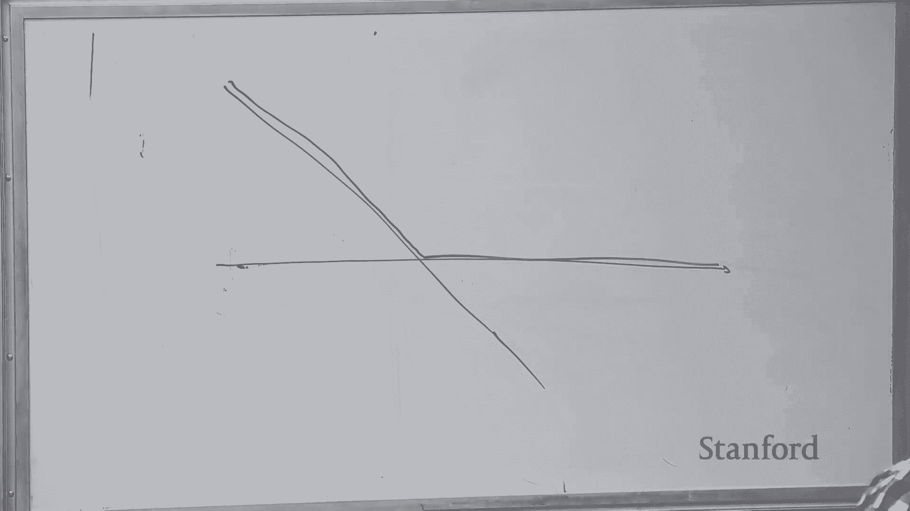

 So I just have max a of b。 Okay， so suppose a is seven and b is three。

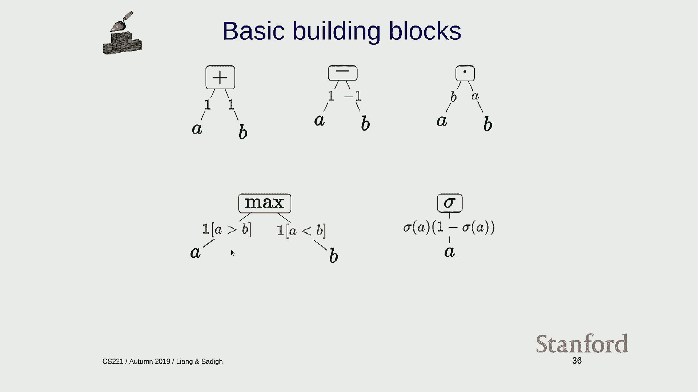

 Okay， so max a and b， and let's say this is seven and this is three。

 So that means a is greater than b。 So now if I change a by a little bit。

 then that change is going to be reflected by an output of a max function。 Right？ Because this。

 this three is small and it doesn't matter。 And in this case， if I change b by a little bit。

 then does the output change？ No， because like， you know， 3。1， 2。9 is all， the output doesn't change。

 so the gradient is going to be zero。 There。 So the max function， partial derivatives look like this。

 So if a is greater than b， then this is going to be a one。 If a is less than a b。

 this is going to be a zero。

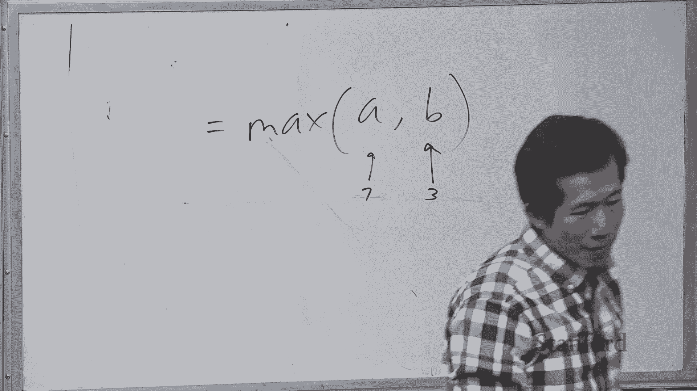

 And you know， conversely over here， if a b is greater than a， then this is going to be a one。

 If b is less than a， then this is going to be a zero。 Okay。

 so the partial of maximum is always one or zero， depending on this particular， you know， condition。

 Okay， and then the logistic function， this is just a fact you can derive it in your free time。

 but I had on a previous slide。 It's just like the sigmoid logistic function times one minus the logistic function。

 Okay， so now you have these building blocks。 Now you can compose and you can build castles out of them。

 It turns out like all， basically all functions that you see in， you know。

 deep learning are just basically built out of these blocks。 And how do you compose things？

 There's this nice thing called the chain rule， which says that if you think about input going to one function and that output going to input a new function。

 then the partial derivative with respect to the input of the output is just the product of the partial derivative。

 This is just a chain rule。 And you can think about it as like， you know， think about amplification。

 So this function amplifies by two times and this function amplifies by five。

 then the total amplification is going to be two times five。 All right， so now let's take an example。

 We're going to do binary classification with a hinge loss just as a warm up。

 And I'm going to draw this computation graph and then compute the partial derivative with respect to w。

 Okay， so what is this graph？ So I have w times v of x。 That's a score times y。 That's a margin。

 One minus margin。 Max of one minus margin is zero is the loss。 Okay， so now for every edge。

 I can draw the partial derivative。 Okay， so here， remember the partial derivative here is left hand side greater than the right branch。

 So one minus margin greater than zero。 For minus， this is a minus one。 For a times。

 this is going to be whatever is over here。 For this times， it's going to be whatever is over here。

 And by the chain rule， if you multiply what's on all the edges。

 then you get the gradient of the loss with respect to w。 Okay。

 so this is kind of a graphical way of doing what you probably did last time。

 which is if the margin is greater than one， then it's everything is zero。

 If the margin is less than one， then I perform this particular update。 Okay。

 so in the interest of time， I'm not going to do it for this simple neural network。

 We'll do this in section。 But at a high level， you basically do the same thing。

 You multiply all the blue edges and you get the partial derivatives。 Okay。

 so now we've done everything manually。 I want to kind of systemize this and talk about an algorithm called back propagation that allows you to compute gradients for arbitrary computation graph。

 That means any kind of function that you can build out of these building blocks。

 you can actually just get the derivatives。 So， you know。

 one nice thing about these packages like PyTorch or TensorFlow is that you actually don't have to compute the derivatives on your own。

 It used to be the case that， you know， before these people would have to implement these derivatives by hand。

 which is really tedious and error-prone。 And part of why it's been so easy to kind of develop new models is that all that's done for you automatically。

 Okay， so back propagation is going to compute two types of values。

 a forward value and a backward value。 So， Fi for every node i is the， simply。

 the value of that expression tree。 And the backward value， Gi。

 is going to be the partial derivative with respect to output of that， the value of that node。 Okay。

 so for example， Fi here is going to be W1 times sigma of V1 times V of x。

 And G of that node is going to be basically the product of all these edges。 Basically。

 how much does this node change the output at the very top？ Okay， so the algorithm itself is。

 you know， quite straightforward。 There's a forward pass which computes all the Fi's。

 and then there's a backward pass that computes all the Gi's。 So in the forward pass。

 you start from the leaves and you go to the root， and you compute each of these values kind of recursively。

 where the computation depends on， you know， the sub-expressions。 And then the backward pass。

 you similarly have a recurrence that gives you the value of a particular， a Gi of a particular node。

 is equal to the Gi of its parent times whatever is on this edge。 Okay。

 so it's like you take a forward pass， you fill in all the Fi's。

 and then you take a backward pass and you fill in all the Gi's that you care about。 Okay， all right。

 so a section will go through this and detail， I realize this might have been a little bit quick。

 One quick note about optimization is that now you have all the tools that you can do。

 you can run SUD on it， which doesn't really care about whether you're， you know。

 what the function is。 It's just like a function you have。

 you can compute the gradient and that's all you need。

 But one kind of important thing to note is that just because you can compute a gradient doesn't mean you optimize the function。

 So for linear function， it turns out that if you define these loss functions on top。

 you get these convex functions。 So convex functions are these functions that you can hold in your hand and it。

 and they have one global minimum。 And so if you think about SUD， it's going downhill。

 you'll converge to global minimum and you solve the problem。 Whereas neural nets。

 it turns out that the loss functions are non-convex， which means that if you try to go downhill。

 you might get stuck in local optimum。 And in general， optimization of neural nets is hard。

 In practice， people somehow manage to do it anyway and it works。

 There's a gap between theory and practice， which is active area of research。 Okay， so in one minute。

 I'm going to do nearest neighbors。 It will actually be fine because nearest neighbors is really simple。

 so you can do it in one minute。 So here it goes。 So let's throw away everything we knew about linear classifying neural nets。

 Here's the algorithm。 Your training is you store your training examples。 That's it。

 And then the predictor of a particular example that you get is you're going to go through all the training examples。

 and find the one which is closest， has input which is closest to your input， x prime。

 And then you're just going to train， you're going to return y。 Okay。

 so in the intuition here is that similar examples， similar inputs should get similar outputs。 Okay。

 so here's a pictorial example。 So suppose we're in two dimensions and you're doing classification and you have a plus over here。

 Let's do this plus and you have， you know， a minus here。

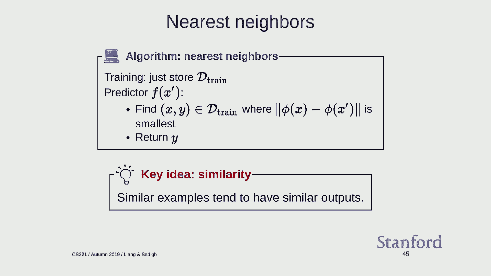

 Okay， so if you are asking what is the label of size to that point。

 it should be plus because this is closer。 This is should be minus。 This region should be minus。

 This should be plus。 And one kind of cool thing is that if where's the decision boundary？

 So if you look at the point that's equal distance from these and draw a perpendicular。

 that's the decision boundary there。 Same thing over here。

 And so you have basically a carves out this region where this is minus and everything here is。

 no plus。 Okay。 In general， this is what I've drawn is an instance of a Voronai diagram。

 which if you were given a bunch of points。

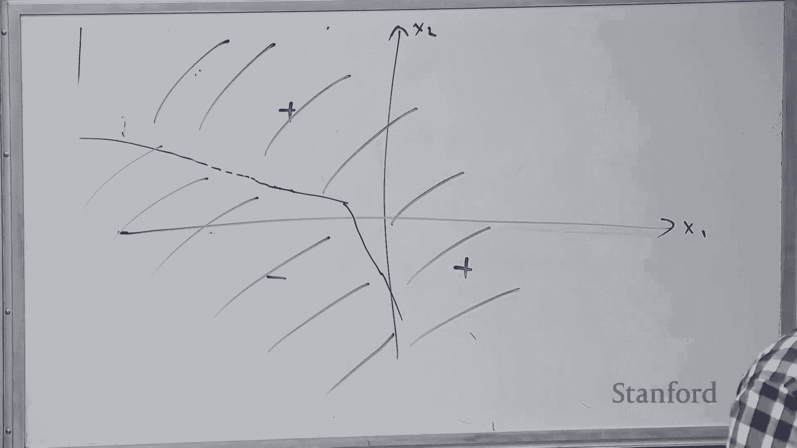

 the defined regions of points which are closest to that point and everything in a particular region like this yellow region is assigned the same label as this point here。

 And this is what is called a non-perinched model， which means that the number。

 it doesn't mean that there's no parameters。 It means that the number of parameters is not fixed。

 The more points you have， the more kind of each point is its own parameter。

 So you can actually fit really expressive models using that。 It's very simple。

 but it's kind of computation expensive because you have to store your entire training examples。

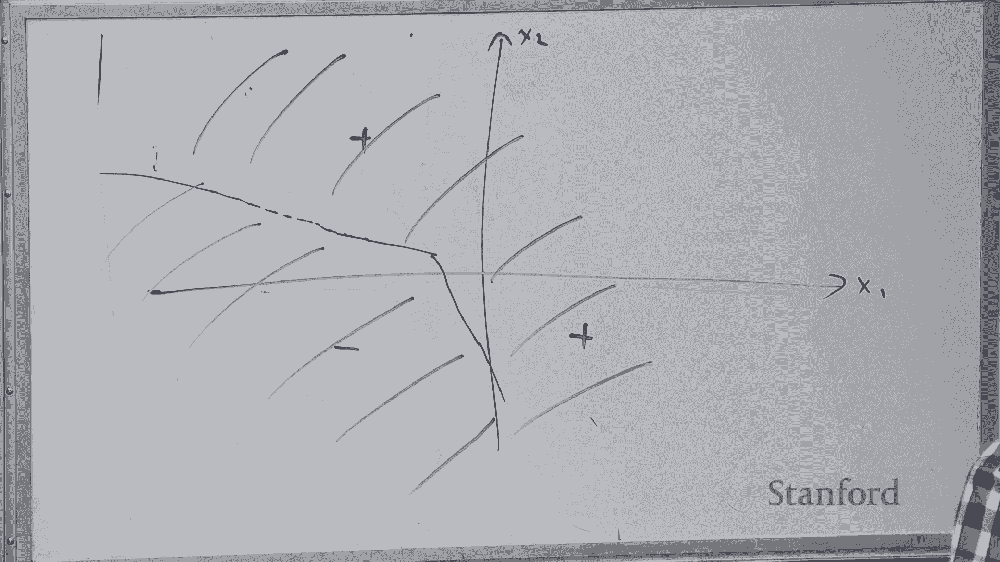

 Okay。 So we looked at three different models and there's a saying that， well， in， I guess in school。

 there's three things， study， sleep， and party or something， and you have to only pick two of them。

 Well， so for learning， it's kind of the same。 It can either be fast to predict for linear models and neural nets。

 It can be easy to learn for the linear models in neurosnabers， or it can be powerful， for example。

 like neural networks and neurosnabers。 But there's always some sort of compromise in exactly what method you choose。

 or depend on kind of what you care about。 Okay。 See you next time。 [ Silence ]。

