# P4：Lecture 4（给我讲故事看已校对） Machine Learning 3 - Generalization K-means - 鬼谷良师 - BV16E411J7AQ

 Homework one， hard deadline。

 Section tomorrow。 We're going to go through the back propagation example。

 which I went through very briefly， in the last lecture。 Talk about nearest neighbors。

 which I did within one minute。 And also， they're going to talk about Scikit Learn。

 which is this really useful tool for， doing machine learning。

 which might be useful for your final projects。 Good to know。 So please come to section。 All right。

 let's do a little bit of review of where we are。 So we've talked about-- we're talking about machine learning。

 in particular supervised， learning， where we start with feature extraction。

 where we take examples and convert them into， a feature vector。

 which is more amenable for a learning algorithm。 We can take either linear predictors or neural networks。

 which gives us scores。 And the score is either defined via a simple dot product between the weight vector and the。

 feature vector， or some sort of more fancy nonlinear combination。 At the end of the day。

 we have these model families that gives us score functions， which。

 then can be used for classification regression。 We also talked about loss functions as a way to assess the quality of a particular predictor。

 So in linear classification， we had the zero-on loss and the hinge loss as an example of loss。

 functions that we might care about。 The training loss is an average over the losses on individual examples。

 And to optimize all of this， we can use the stochastic gradient algorithm， which takes， an example。

 x， y， and computes the gradient on that particular example， and then just updates。

 the weight space on that。 So hopefully， this should be all review。 So now。

 I'm going to ask the following question。 Let's be a little bit philosophical here。

 So what is the true objective of machine learning？

 So how many of you think it is to minimize the error on the training set？ Show of hands。 No one？

 This is what we've been talking about， right？ We've been talking about minimizing error on training sets。

 Okay， well， maybe that's not right then。 What about minimizing error training error with regularization？

 Because regularization is probably a good idea。 How many of you think that's the goal？

 What about minimizing error on the test set？ Okay。 It seems like it's closer， right？ Test sets。

 test accuracies are things maybe you care about。 What about minimizing error on unseen future examples？

 Okay， so the majority of you think that's the right answer。 And what about learning about machines？

 That's the true objective。 Who doesn't want to learn about machines？

 That's actually the true objective。 So the correct answer is minimizing error on unseen future examples。

 So I think all of you have intuition that we are doing some machine learning。

 We're learning on data， but we really care about is how this predictor performs in the， future。

 Because we're going to deploy this in a system and it's going to be the future， it's going。

 to be unseen。 And then， but then， okay， so then how do we think about all these other things？

 No training set， regularization and test set。 So that's going to be something we'll come back to later。

 Okay， so there's two topics today。 I want to talk about generalization。

 which is I think of pretty subtle but an important。

 thing to keep in mind when you're doing machine learning。

 And then we're going to switch gears and talk about unsupervised learning where we don't。

 have labels but we can still do something。 So we've been talking about training loss， right？

 If I've made a big deal about you write down what you want and then you optimize。

 So the question is like， is this training loss a good objective function？ Well。

 let's take this literally。 Suppose we really wanted to just minimize the training loss。

 What would we do？ Well， here's an algorithm for you。 So you just store your training examples。

 And then you're going to define your predictors as follows。

 So if you see that particular example in your training set， then you're just going to output。

 the output that way you saw in the training set。 And then otherwise you're just going to set phone。

 You're just going to crash， right？ So this is great。 It minimizes the training error perfectly。

 It gets zero loss， assuming your training examples don't have conflicts。

 But you're a lot laughing because this is clearly a bad idea。

 So somehow purely following this minimizing training set objective is not really the right， thing。

 So this is an example， a very extreme example of overfitting。

 So overfitting is this phenomenon that you see where you have some data and usually the。

 data has some noise and you are trying to fit a predictor but you're really trying too， hard， right？

 So if you're fitting this green squiggly line， you're fitting the data and getting zero。

 training error but you're kind of missing the big picture which is this black curve。

 Or in regression， some of you probably have seen examples where you have a bunch of points。

 usually with noise and if you really try hard to fit points and you're going to get zero。

 error but you're kind of missing this general trend。

 And overfitting can really kind of bite you if you're not careful。

 So let's try to formalize this a little bit more。 How do we assess whether a predictor is good？

 Because if we can't measure it， we can't really optimize it。

 So the key idea is that we really care about error on unseen future examples。

 So this is great as aspiration to write down but the question is how do we actually optimize， this？

 Because it's the future and it's also unseen。 So by definition we can't get a handle on this。

 So typically what people do is the next best thing which is you gather a test set which。

 is supposed to be representative of the types of things you would see and then you guard。

 it carefully and make sure you don't touch it too much。

 Because what happens if you start looking at a test set and the worst case is you train。

 on a test set。 The test set being a surrogate for unseen future examples just completely goes away。

 And even if you start looking at it and you're really trying to optimize it， you can get into。

 this overfitting regime。 So really be careful that and I want to emphasize that the test set is really a surrogate for。

 what you actually care about。 So don't blindly just try to make test accuracy numbers go up at all costs。

 So for now let's assume we have a test set that we have to work with。

 So there's this kind of really peculiar thing about machine learning which is this leap of， faith。

 The training algorithm is only operating on the training set and then all of a sudden。

 you go to these unseen examples or the test set and you're expected to do well。

 So why would you expect that to happen？ As I alluded to in the first day of class。

 there's some kind of actually pretty deep， mathematical reasons for why this might happen。

 But rather getting into the math， I just want to give you a maybe a intuitive picture。

 of how to think about this gap。 So remember we have this picture of all predictors。

 So these are all the functions that you possibly want in your wildest dreams。

 And then when you define a feature extractor or a neural net architecture or any sort of。

 a structure， you basically say， hey， I'm only interested in these set of functions， not。

 all functions。 And then learning is trying to find some element of the class of functions F value set。

 out to find。 So there's this decomposition which is useful。 So let's take this point G。

 So G is going to be the best function in this class。 The best predictor that you can possibly go。

 So if some oracle came and set your neural net weights to something， how well could you， do？ Okay。

 so now there's two gaps here。 One is the approximation error。

 The approximation error is the difference between F star which is the true predictor。

 So this is the thing that always gets the right answer。 And G which is the best thing in your class。

 So this really measures how good is your hypothesis class。

 Remember last time we said that we want hypothesis class to be expressive。

 If you only have linear functions and your data looks sign your soil， then that's not。

 expressive enough to capture the data。 So the second part is estimation error。

 This is the difference between the best thing in your hypothesis class and the function you。

 actually find。 And this measures how good is a learned predictor relative to the potential of the hypothesis。

 class。 You define this hypothesis class as here are things that I'm willing to consider but at。

 the end of the day based on a finite amount of data you can't get to G。 You only can estimate some。

 you do learning and you get to some F hat。 So in kind of more mathematical terms。

 if you look at the error of the thing that you're。

 learning algorithm actually returns minus the error of the best thing possible which。

 in many cases is zero。 Then this can be written as follows。

 So all I'm doing is subtracting error of G and adding error of G。

 So this is the same quantity as this。 But then I can look at these two terms。

 So the estimation error is the difference in error between the thing that your learning。

 algorithm produces minus the best thing in a class G and then the difference， approximation。

 errors the difference between error of G and error of F。

 So this is kind of useful as a way to kind of conceptualize the different trade-offs。

 So just to kind of explore this a little bit， suppose I increase the hypothesis class size。

 So I add more features or I add， increase the dimension of my neural networks。 What happens？

 So the approximation error will go down and why is that？

 Because we're taking a minimum over a larger set。 So G is always the minimum possible error over the set F。

 If I make the set larger， I have just more possibilities of driving the error down。

 So the approximation error is going to go down。 But the estimation error is going to go up。

 As I make my hypothesis class more expressive， and that's because it's harder to estimate。

 something more complex。 So I'm leaving it kind of vague right now。

 There's a mathematical way to formalize this， which you can ask me about offline。

 So you can see this kind of tension here。 You really want to make your hypothesis class large so you can drive down the approximation。

 error， but you don't want to make it too large that it becomes impossible to estimate。

 Okay so now we have this kind of abstract framework。 What are some kind of knobs we can tune？

 How do we control the size of the hypothesis class？

 So we're going to talk about two eccentric classes of types of ways。

 So strategy one is dimensionality。 So remember for linear classifiers。

 a predictor is specified by a way vector。 So this is D numbers。 And we can change D。

 We can make these smaller by removing features。 We can make the larger by adding features。

 And pictorially you can think about as reducing D as reducing the dimensionality of your hypothesis。

 class。 So if you're in three dimensions， you have three numbers， three degrees of freedom， you。

 have this kind of ball， and if you remove one of the dimensions now you have this circle。

 in two dimensions。 Okay so concretely what this means is you can manually add。

 you know this is a little， bit heuristic。 You can add features if they seem to be helping and remove features if they don't help。

 So you can kind of modulate the dimensionality of your way vector。

 There are also automatic feature selection methods such as boosting or L1 regularization。

 which are outside the scope of this class。 It would be if you take a machine learning class you'll learn more about this stuff。

 But the main point is that you can determine by setting the number of features you have。

 You can vary the expressive power of your hypothesis。

 Okay so the second strategy is looking at the norm or the length of a vector。

 So this one is maybe a little bit less obvious。 So again for linear predictors the weight vector is just a D dimensional vector and you。

 look at how long this vector is。 So what is and the length pictorially looks like this。

 So if you have let's say all the weight vectors in， you know each W can be thought about as。

 a point as well。 So this circle contains all the weight vectors up to a certain length。

 And if by making this smaller now you're considering you know a smaller number of weight vectors。

 Okay so at that level it's perhaps intuitive。 So what does this actually look like？

 So let's suppose we're doing one dimensional linear regression here's the board。

 And we're looking at x， y。 So remember what in one dimension where all we're looking at is you know W is just a single。

 number。 Right and the number represents the slope of this line。

 So by saying no let's draw some slope here。 So by saying that the weight vector or the weight is a small magnitude that's basically。

 saying the slope is you know smaller or closer to zero。

 So if you think about you know slope equals let's say this is slope equals one。 So W equals one。

 So anything， anything let's say less than one or greater than minus one is fair game。

 And now if you reduce this to half now you're looking at a kind of a smaller window here。

 And if you keep on reducing it now you're basically converging to you know essentially。

 very flat and constant functions。 Okay。 So you can understand this two ways。

 One is just that the total number of possible weight vectors you're considering is just。

 shrinking because you're putting more constraints that have to be smaller。

 From this picture you can also think about it as what you're really doing is making the。

 function you know smoother。 Because a flat function is the kind of smoothest you know function it doesn't kind of you know。

 very too much。 And a complicated function is one that can go you know very jump up very steeply and you。

 know for quadratic functions can also come down really quickly。

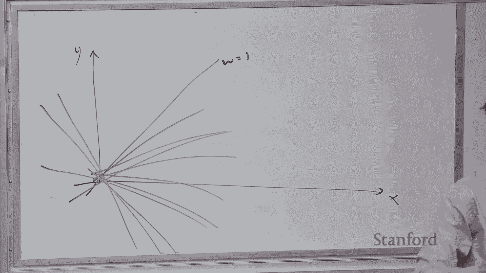

 So you get kind of very wiggly functions those are tend to be more complicated。 Okay。

 Any questions about this so far？ Yeah。 I'm trying to like not overfit。

 So like what if we have like the instructors within the data sense that sense of track that。

 sense we try to like not overfit we're really just kind of like be stringing ourselves like。

 a particular set of like distributions that we say okay instead of must have like come。

 from like something normal must have come from something reasonable。

 But by saying that we're like not really capturing the full like scope of our data sense。 Sure。

 So let's see。 So the question is if there's particular structure inside your data set for example if。

 some things are sparse or low rank or something。 How do you capture that with a regularization？

 Yeah。 But you have like perhaps not even just like like smart like if you have like calls and。

 models inside between your like parameters like how would you like wouldn't regularization。

 like impede some of those relations。 Yeah。 So all of this is kind of very generic right you're not making any assumptions about the。

 what the classifier is or the features。 So they're kind of like big hammers that you can just apply。

 So if you have models where you have more structure domain knowledge or if you which。

 will see you know for example if you have you know Bayesian networks later in the class。

 then there's much more you can do。 And this is just kind of you know two techniques for as a kind of generic way of controlling。

 for overfitting。 Yeah。 Picture understanding correctly this approach is actually putting constraints on each element。

 in fact or W like the magnitude of it versus the other one is actually coming elements or。

 in general that you're。 Yeah。 So so let's look at W here。

 So let's say you're in three dimensions so W is W1， W2， W3。

 So the first method just says okay let's just kill some of these elements and make it smaller。

 This one is saying that I mean formally it's looking at the squared values of each of these。

 and looking at the square root that's what the norm is。

 So it's saying that each of these should be you know small according to this particular， metric。

 Yeah。 Yeah。 Yeah。 So that's what I'm going to get to。

 So this is just kind of giving you intuition for in terms of hypothesis classes and how。

 you want them to be small。 How do you actually implement this？

 You know there's several ways to do this but the most popular way is to add regularization。

 And by regularization what I mean is take your original objective function which is。

 train loss of W and you just add this penalty term。

 So lambda is called the regularization strength it's just a positive number let's say one。

 And this is the squared length of W。 Okay。 So what this is doing is by adding this it's saying that okay optimizer you should really。

 try to make train loss small but you should also try to make this small as well。 Okay。

 So if you study convex optimization there's kind of this duality between this is called。

 Lagrangian form where you have a penalized objective where you add a penalty on the way。

 vector and the constraint form where you just say that I want to minimize train loss with。

 subject to the norm of W being less than some value。

 This is more the kind of the typical one that you're going to see in practice。

 Okay so here's objective function great how do I optimize it？ Yeah。

 So if I'm going to define W there and train loss is further minimizing。

 Yeah so it's important that these be the same W and you're optimizing the sum。

 So the optimizer is going to make these trade offs。

 If it says oh okay I can drive the training loss down but if this is shooting up then that's。

 not good and they'll try to balance these two。 Yeah。

 It's basically saying try to fit the data but not at the expense of having huge way vectors。

 I'm right there。 Yeah。 So if there's another way to say it is that kind of think about outcomes razor。

 It's saying if there's a simple way to fit your data then you should just do that instead。

 of finding some really complicated way vector that fits your data。 So prefer simple solutions。

 Okay so once you have this objective you know we have a standard crank we can turn to。

 turn this into our room you can just do gradient descent and the you know if you just take。

 the derivative of this then you have this gradient and then you also have lambda W which。

 is the gradient of this term。 So you can understand this is basically you're doing gradient descent as we were doing before。

 and now all you're doing is you're shrinking the weights towards zero by lambda。

 So lambda is a regularization strength if it's large that means you're trying to really。

 kind of push down on the magnitude of the weights。

 So the gradient optimizer is basically going to say hey I'm going to try to step in the。

 direction that makes the training a lot smaller but then I'm going to also you know push the。

 weights towards zero。 In neural nets literature this is also known as weight decay。

 In optimization statistics it's you know known as L2 regularization because this is you know。

 the Euclidean or 2 norm。 Okay so here is another strategy which intuitively gets at the same idea but it's in some sense。

 you know more crude。 So it's called early stopping and the idea is very simple you just stop early instead。

 of going and training for 100 iterations you just train for you know 50。

 So why does this why is this a good idea？ The intuition is that you know if you start with the weights at zero so that's the smallest。

 you can make the norm of W right。 So every time you update on the training set generally the norm goes up you know there's。

 no guarantee that it will always go up but generally this is what happens。

 So if you stop early that means you're giving less of an opportunity for the norm to grow。

 So few updates translates to generally lower norm。

 You can also make this formal mathematically but you know the connection is not as tight。

 as the explicit regularization from the previous slide。

 Okay so the lesson here is you know try to minimize the training error but don't try。

 you know too hard。 Yeah question？ Depends on how we initialize the weights。

 Question is does this depend on how we initialize the weights。

 Most of the time you're going to initialize the weights from you know some sort of weights。

 which is kind of a base either zero or you know for neural nets maybe like random vectors。

 around zero but they're pretty small weights and usually the weights grow from you know。

 outside from small to large。 There's other cases where if you think about you know pre-training you have a pre-trained。

 model you start with some weights and then you do gradient descent from that then you're。

 saying basically don't go too far from your initialization。 Yeah。

 Right so the question is why aren't we focusing on minimizing the training loss or why focus。

 on W it's always going to be a combination。 So the optimizer is still trying to push down on the training loss by taking this gradient。

 updates。 Right notice that the gradient with respect to the regularizer actually doesn't come in。

 here。 It kind of comes in explicitly through the fact that you're stopping it early。

 But it's always kind of a balance between minimizing the training loss and also making。

 sure your classifier weights doesn't get too complicated。 Yeah。

 I think you said what value of lambda or t to set。

 Yeah so the question is how you decide the value of t here and how you decide the value， of lambda。

 So this is called hyperparameters and I'll talk a little bit more about that later。

 Okay so here's a kind of the general philosophy that you should have in machine learning。

 You should try to minimize the training error because really that's the only thing you can， do。

 That's your data and that's you have your data there。

 But you should try to do so in a way that keeps your hypothesis small。

 So try to minimize the training set error but don't try too hard。 I guess is the lesson here。

 Okay so now going back to the question earlier。 If you notice through all these my presentation there's all sorts of properties of the learning。

 algorithm which feature you have which regularization parameter you have the number of iterations。

 the step size for gradient descent。 These are all considered hyperparameters。

 So so far they're just magical values that are given to the learning algorithm and the。

 learning algorithm runs with them。 But someone has to set them and how do you set them？

 Yeah you can ask me I don't know the answer to that。 Okay so here's an idea。

 So let's choose a hyperparameter to minimize the training error。

 So how many of you think that's a good idea？ Okay not too many。 So why is this a bad idea？

 Yeah you can overfit right？ So suppose you took Lambda and you say hey you know let's choose a Lambda that will minimize。

 the training error。 And the learning algorithm says well okay you know I want to make this go down。

 What is this doing in a way？ Let's just set Lambda to zero and then I don't have to worry about this。

 So it's kind of you know cheating in a way。 And also early stopping would say like don't stop just keep on going because you're always。

 going to drive the training error lower and lower。 Okay so that's not good。

 So how about choosing a hyperparameter to minimize the test error？

 I mean you say yeah it's a good idea。 Yeah not so good it turns out。 So why？

 And this is again stressing the point that the test error is not the thing you care about。

 Because what happens when you look at the， we try to use the test set。

 Then it becomes an unreliable estimate of the actual unseen error。

 Because if you're tuning hyperparameters on the test set that means that it's no longer。

 it becomes less and less unseen and less future。 Yeah。 >> [INAUDIBLE]。

 >> Yeah so we can do cross validation which I'll describe in a second。 Okay。

 So I want to emphasize this point when you're doing a final project you have your test set。

 you have it sitting there and you should not be you know filling with it too much or else。

 it becomes less reliable。 Okay so you can't use a test set。 So what do you do？

 So here's the idea behind a validation set。 Is that you take your training set and you sacrifice some amount of it。

 Maybe it's 10%， maybe it's 20%。 And you use it to estimate the test error。

 So this is a validation set。 The test set is off to the side it's locked in a safe。

 You're not going to touch it。 And then you're just going to tune hyperparameters on the validation set and use that to guide。

 your model development。 Yeah。 >> The proportion itself is not a hyperparameter。

 >> The proportion itself is a hyperparameter。 No。 Yeah you don't usually don't tune that。

 I mean usually it's how you choose it is kind of this balance between you want the validation。

 set to be large enough so it gives you reliable estimates but you also want to use most of。

 your data for training。 Yeah。 >> [INAUDIBLE]， >> Yeah， so how do you choose the hyperparameters？

 So the answer is you try particular values。 So for example， try let's say lambda equals 0。01， 0。1。

 and then you run your algorithm and， then you look at your validation error and then you just choose the one that has the。

 lowest。 Yeah。 It's pretty crude。 Yeah。 >> I'm going to choose it to choose the linear rates and hyperparameters without just doing。

 like a search alert。 You try this one， then try this one。 >> Yeah。

 so is there a better way to search for hyperparameters？

 You could do your research generally is fine， random sampling is fine。

 There's fancier things based on Bayesian optimization which might give you some benefits but it's。

 actually the jurors out on that and they're more complicated。

 There's also you can use better learning algorithms which are less sensitive to the step。

 size so you don't have to nail is like 0。1 works but 0。11 doesn't。 So you don't want that。

 But in all of the high level answers that there's no real kind of principle way of like here's。

 a formula that lambda equals and you just evaluate that formula and you're done。

 Because this is the kind of the dirty side of machine learning。

 There's always this tuning that needs to happen to get your good results。 Yeah， question over there。

 >> Is this process usually automated or is it too many？ >> So the question is。

 is this process automated？ Increasingly it becomes much more automated。

 So it requires a fair amount of compute。 Because usually if you have a large list that even training one model might take a while。

 and now you're talking about training let's say 100 models。

 So it can be very expensive and there's things that you can do to make it faster。

 But I mean in general I would advise that don't hyper-parameter and kind of blindly especially。

 when you're kind of learning the ropes。 I think doing it kind of manually and getting intuition for what step size like effective。

 step size algorithm is still valuable to have。 And then once you kind of get a hang of it then maybe you can automate but I wouldn't。

 try to automate too， you know， yeah。 >> Small changes on hyper-parameters needs to vary。

 Big changes in prediction accuracy。 Is that considered a good model？ I think very robust。 >> Yeah。

 so the question is if you change the hyper-parameters a little bit and that causes。

 your training or model performance to change quite a bit。 Does that mean your model is not robust？

 Yeah， it means your model is probably not as robust。

 And sometimes you actually don't choose hyper-parameters at all and you still get varying model performances。

 So you should always check that first because there could be just inherent randomness especially。

 if you're doing neural networks that could get stuck in local optimum。

 There's all sorts of things that can happen。 Okay， final question now。

 >> We found that the optimal habit parameter is it just when they're converging to certain。

 optimal values。 >> So how do you choose an optimal hyper-parameter？

 So you basically have like a four-loop that says for lambda in 0。1， 0。01， 1 and whatever。

 values for t equals something。 You train on this all these training examples minus validation and then you test the model。

 on the validation， you get a number and you just use whichever setting gives you the lowest， number。

 >> We do know the numbers。 It's not just like we're going to keep looking for hyper-parameters instead of one lambda。

 >> Yeah， usually you just have to be in the ballpark。 You don't have to get like 99 versus 100。

 The things I would just advise is like let's say what kind of orders of magnitude because。

 if it really matters like being down to the precise number then you probably have other。

 things to worry about。 Okay， let's move on。 So what I'm going to do now is go through a kind of a sample problem。

 Because I think the theory of machine learning and the practice are actually kind of quite。

 different in terms of the types of things that you have to think about。

 So here's a simplified name to entity recognition problem。

 So named entity is this recognition is this why popular task in NLP where you're trying。

 to find names of people on locations and organizations。

 So the input is a string which has a particular potentially name with the left and right context。

 words。 And the goal is to predict whether that's X contains either a person which is plus one。

 or not。 Okay， so here's the rest of you for success。

 When you're doing your final project or something you get a data set。

 If it hasn't been already split it into training， validation and test and lock the test out。

 of the way and then first I would try to look at the data to get some intuition。

 Always remember you want to make sure that you understand your data。

 Don't just immediately start coding up the most fancy algorithm you can think of。

 And then you repeat。 You implement some feature maybe change architecture of your network and then you turn some。

 you， set some hyper parameters and you run the learning algorithm and then you look at the。

 training error and validation error rates to see how they're doing if you're underfitting。

 or overfitting。 In some cases you can look at the weights for linear classifiers and for neural nets it。

 might be a little bit harder。 And then you I recommend looking at the predictions of your model。

 Always have， I always try to log as much information as I have you can so that you can go back。

 and understand what the model is trying to do。 And then you brainstorm some improvements and you kind of do this until you either are happy。

 or you run out of time and then you run it on the final test set and you get your final。

 error rates which you put in your report。 So let's go through an example of what this might look like。

 So this is going to be based on the code base for the sentiment homework。 So okay。

 so here's where we're starting。 We're reading a training set。 Let's look at this training set。

 So there are 7，000 lines here。 Each line contains the label which is minus one or plus one along with the input which。

 is going to be， you know， remember the left context， the actual entity and the right context。 Okay。

 all right， so you also have a development or validation set。

 And what this code does is it's going to learn a predictor which takes the training set and。

 a feature extractor which we're going to fill out。

 And then it's going to output either both the weights and some error analysis which we。

 can use to look at the predictions。 And finally there's this test which I'm going to not do for now。

 So the first thing is let's define this feature extractor。

 So this feature extractor is a V of X and we're going to use the sparse map representation。

 of features。 So V is， there's this really nice， a new structure called default dict。

 So this is kind of like saying you have a map but you can access it and if the element。

 isn't there then it returns zero。 Okay， so if V goes that and then you return V。 Okay。

 so this is the simplest feature vector you can come up with。

 The dimensionality is zero because you have no features。

 So but we can run this and see how we do on this。 So let's run this。

 So over a number of iterations you can see that learning isn't doing anything because。

 there's no weights to update。 But it doesn't crash which is good。

 So I'm getting 72% error which is pretty bad but I haven't really done anything so that's。

 not to be expected。 Okay， where my window go。 Okay， so now let's start defining some features。 Okay。

 so remember what is X？ X is something like took Mauritius into， right？

 So there's this entity and left and right。 So let's break this up。

 So I'm going to tokens equals X dot split。 So that's going to give me a bunch of tokens and then I'm going to define left entity right。

 equals。 So this is the token zero is the left。 That's going to be took tokens one through minus one is going to be everything until the。

 last token and then tokens minus one is the last one。 Okay， so now I can define a feature template。

 So remember a good nice way to go about is define a feature template。

 So I can just say entity is and blank。 That's how I would have written it as a feature template in code。

 This is actually pretty transparent。 It's saying I'm defining a feature which is going to be one for this feature template。

 So entity is going to be some value。 I plug it in。

 I get a particular feature value or feature name and I'm going to set that feature name。

 to have the feature value one。 Okay， so let's run this。 So let's go over here。 Run it。 Oops。

 So entity is a list。 So I'm just going to turn it into a string。

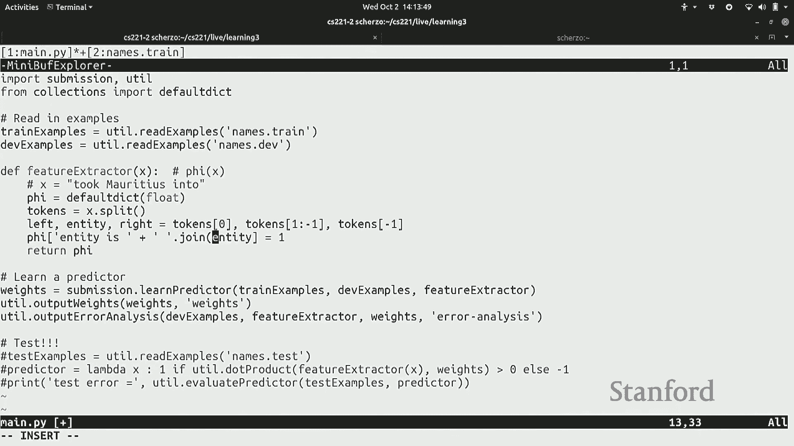

 Okay。 So now I'm getting what happens。 So the training error is pretty low， right？

 I'm basically fitting the training error pretty well。 But you know， notice I don't remember。

 I don't care about the training error。 I care about the test error。 So just one note。

 It says test here but it's really the validation。 I should probably change that。

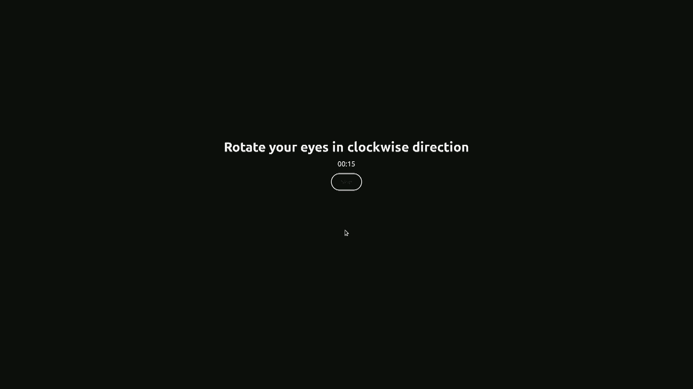

 It's just whatever non-training set you passed in。 Okay。

 so this is still a 20% error which is not great。 Okay， so at this point。

 remember I want to go back and look at some， you know， get some。

 intuition for what's going on there。 So let's look at the weights。 Okay。

 so this is the weight vector that's learned。 So for this weight feature。

 the weight is one and all of these are one and this， you know， corresponds to the names that。

 the people names that have been seen at training time。 Because whenever I see a person name。

 then I'm going to， you know， give that feature a， one so I can get that training example right。

 And if you look at the bottom， these are the entities which are not people names。 Okay。

 so this is a sanity check that it's doing what it's， you know， supposed to do。

 So the nice thing about with these kind of really interpretive features is that you can。

 kind of almost compute the what the weight should be in your head。 Yeah。

 >> One feature for almost every example that you have。 >> Yeah。 Yeah。

 so I have essentially one feature for every entity which is almost number of times。

 >> You mean like if like most of them are unique。 >> Yeah， so there's a 3900 feature set。

 >> And the engine doesn't look like you're going to get caught down。

 >> So we're going to change those but we'll get， we're not done。 Okay， so， okay。

 so the other thing we want to look at is the error analysis。 Okay， so this shows you。

 here's an example， the border of Romero。 The ground truth is positive but we predicted minus one。

 And why do we predict minus one？ It's because this feature has weight zero。

 Why does it have weight zero because we never saw this name at training time。 Okay？

 Would you dare get some right？ We saw a senate at training time and we rightly predicted that was minus one。

 Okay， but you know， you look at these errors and say， okay， well， you know， this is maybe， the。

 we should add more features。 Okay？ So if you look， remember this， you know， example here。

 Maybe the context helps， right？ Because if you have governor blank。

 then you probably know it's a person because only people， can， you know， be governors。

 So let's add a feature。 So I'm going to add a feature which is a left is left。 And for symmetry。

 I'll just add right is right。 Okay， so this defines some indicator features on， you know。

 the context。 So in this case， it would be taken into。 Okay， so now I have three feature templates。

 Let's go and train this model。 And now I'm down to， I just love in percent error。 Okay。

 so I'm making some progress。 Oops。 Let's look at the error analysis。 Okay。

 so now I'm getting this correct。 And let's look at what else am I getting wrong？ So Smith is blamed。

 You know， Felix， Mantilla。 And you know， again， it hasn't seen this exact， actually。

 you did see this string before， but， it's still got it wrong。 You know。

 I think there's kind of a general intuition though that， well， if you have， you know， Felix。

 you know， even if it， you've never seen Felix Mantilla， if you see Felix， something， you know。

 chances are probably as a person， not always， but as we， you know， noted before。

 features are not meant to be like deterministic rules。

 So just pieces of information which are useful。 So let's go over here and we want to define。

 let's say， a feature for every possible word， that's in entities。 So word and entity。 Remember。

 entity is a list of tokens which occur between left and right。

 And I'm going to say entity contains word。 Okay。 So now let's run this again。 And now I'm down to。

 you know， 6% error， which is， you know， a lot better。 If you look at the error analysis。

 so I think the， maybe the， Felix example， now I get this， right。 And you know， what else。

 what else can I do？ So， you know， what I'm kind of this general strategy here I'm following here is。

 you know， which is not always the， as we read the right one， but you start with kind of very， very。

 specific features and then you try to kind of generalize， you know， as you go。

 So how can I generalize this more？ Right。 So if you look at， worker， so Curtis Stan， right？

 If your word ends in Stan， or then， I mean， maybe it's less likely to be a person。

 I actually don't know， but， you know， maybe like suffixes and prefixes are helpful too。

 So I'm going to add features。 Let's say entity contains prefix。 And then I'm going to。

 let's say just， you know， heuristically look at the first four。

 tokens and suffix the last four tokens。 And then， you know， run this again。 And now I'm down to。

 you know， 4% error。 Okay。 I'm probably going to， you know， stop right now。 At this point。

 you can actually run on your test set and we get， you know， 4% error as， well。 Yeah。 [ Inaudible ]。

 Oh yeah。 I guess this was all planned out so that the test error would go down。

 But actually more often than not， you're out of feature that you really， really think， should help。

 but it doesn't help for whatever reason。 So。 [ Inaudible ]， Sort of like not get worse。 Like。

 we don't have a positive to， like， sorry， not get better， but we don't have a positive。

 to get worse。 Yeah。 You， yeah， some of the time it doesn't move。

 That's kind of probably the more of the time。 But sometimes it can go up if you add a really。

 you know， bad feature。 [ Inaudible ]， So the more features you add generally。

 the train error will go down。 Right。 So all the algorithm knows is like it's driving train error down。

 So it doesn't know that it doesn't， you know， generalize。 Yeah。 Okay。

 So this is definitely the happy path。 I think when you go and actually do machine learning。

 it's going to be more often than not。 The test error will not go down。 So don't get too frustrated。

 Just keep on trying。 Yeah。 Are we expected to keep optimizing after like 5% error？

 Are you expected to optimize after 5% error？ It really depends。 You know。

 there's kind of a limit to every data set。 So data sets have noise。

 So sometimes you should definitely not optimize below the noise limit。

 So one thing that you might imagine is， for example， you have an oracle which let's say。

 it's human agreement。 Like if your data set is annotated by humans and if humans can't even agree like 3% of the。

 time， then you can't really do better than 3% of the time。 That's a general rule or exception。 Okay。

 Any other questions？ Yeah。 You kind of do all your training。 You see the test errors。

 And in real application， say in the end that you try on the test and you find this not good。 Oh。

 yeah。 What happens if you actually try on the test set and it's not good？

 That's you just say that it's not good。 At some level。 So there's many things that could happen。

 One is that your test set might actually be different for whatever reason。

 Maybe it was collected in a different day and your performance just doesn't hold up on。

 that test set。 In that case， well， that's your test error。

 Remember the test error is just if you didn't look at it， it's really an honest representation。

 of how good this model is。 And if it's not good， well， that's just the truth。

 Your model is not that good。 In some cases， there's some bug。

 Something was misprocessed in a way and it wasn't really fair。

 So there are cases where you want to investigate。 If it's way off the market。

 if I had gone 70% error， then maybe something was wrong and， you would have to go investigate。

 But if it's in the ballpark and whatever it is， that's kind of what you have to deal with。

 So what you want to do also is make sure your validation error is kind of representative。

 of your test error so that you don't have surprises at the end of the day。

 I think find it to run it on a test set just to make sure that there's no catastrophic， problems。

 But the kind of aggressive tuning on a test set is something that would have worn against。 Yeah。

 Any sort of standard as to how you should split the data into training about validation and。

 testing？ In general， what percentage of your data you should allocate to each one， just randomize。

 it？ Yeah， so the question is how do you split into terrain validation？

 It depends on how large it is。 So generally people shuffle the data and then randomly split it into test validation and。

 train。 Maybe， let's say， like 80%， 10%， 10%， just as a kind of a rule of thumb。

 There are cases where you don't want to do that。 There's cases where you， for example。

 want to train on the past and test on the future， because that simulates the more realistic settings。

 Or the test set is meant to kind of be representative as possible of the situations that you would。

 see in the real world。 Yeah。 Have like 7，000 examples or like labeled plus one and minus one？

 Do you have to do that manually？ So the question is the data set was labeled。 There's 7，000 of them。

 I personally did not label this data set。 This is a standard data set that someone labeled。

 Sometimes these data sets come from crowd workers。 Sometimes they come from experts。 Yeah。

 it really varies。 Yeah， sometimes they come from grad students。

 It's actually a good exercise to go and label。 I've labeled a lot of data also in my life。 Yeah。

 Exactly。 Okay。 Let's go on。 So switching gears now， let's talk about unsupervised learning。

 So far we talk about supervised learning where the training set contains input/output pairs。

 So you're given the input and this is the output that your predictors should output。

 But this is very timely。 We're just talking about how fully labeled data is very expensive to obtain because 7。

000， is actually not that much。 You can often have 100。

000 or even a million examples which you do not want to be sitting， down and annotating yourself。

 So here's another possibility。 So unsupervised learning。 Unsupervised learning。

 the training data only contains inputs。 And unlabeled data is much cheaper to obtain in certain situations。

 So for example， if you're doing text classification， you have a lot of text out there。

 People write a lot on the internet and you can easily download gigabytes of text and all。

 that is unlabeled。 And you can do something with it that would be turned that into gold or something。

 And also images， videos and so on。 It's not always possible to obtain unlabeled data。 For example。

 if you have some device that is producing data and you only have one of。

 that device that you built yourself and you're not going to be able to get that much data。

 So we're going to focus on a case where you do have basically infinite amount of data。

 and you want to do something with it。 So here's some examples I want to share with you。

 This is a classic example from NLP that goes back to the early 90s。 So this idea is word clustering。

 The input you have a bunch of raw text， lots of news articles。

 And you put it into this algorithm which I'm not going to describe。

 But we're going to look at the output。 So what is this output？

 It returns a bunch of clusters where for each cluster it has a certain set of words associated。

 with that cluster。 And you look at the clusters， they're pretty coherent。

 So this is roughly the first cluster is days of a week， second cluster is months， third。

 cluster is some sort of materials， fourth cluster is synonyms of big and so on。 And one thing。

 the critical thing to note is that the input was just raw text。 Nowhere did someone say， hey。

 these are days of the month， learn them and I'll go test， you later。 It's all unsupervised。

 So this is actually on a personal note the example when I was doing a masters that got。

 me into doing NLP research because I was looking at this and was like， wow， you can。

 actually take unlabeled data and actually mine really interesting signals out of it。 More recently。

 there's these things called word vectors which do something very similar。

 instead of clustering words， they embed words into a vector space。 So if you zoom in here。

 each word is associated with a particular position and words which。

 are similar actually happen to be close by in vector space。 So for example， these are country names。

 these are pronouns， these are years months and so， on。

 So this is kind of operating on a very similar principle。

 There's also contextualized word vectors like Elmo and Bert if you've heard of those。

 things which have been really taking the NLP community by storm more recently。 On the vision side。

 you also have the ability to do unsupervised learning。

 So this is an example from 2015 where you run a clustering algorithm which is also jointly。

 learning the features during this kind of deep neural network and it can identify different。

 types of digits， zeros and nines and fours that look like nines， threes and or fives that。

 look like threes and so on。 So remember， this is not doing classification， right？

 You're not telling the algorithm， here's our five， here's our twos。

 It's just looking at examples and finding the structure that， oh， these are kind of the。

 same thing and these are all the same thing and sometimes but not always， these clusters。

 actually correspond to labels。 So here's another example of ships。

 planes and birds that look like planes。 So you can see kind of this is not doing classification。

 it's just kind of looking at visual similarity。 Okay？ All right。

 so the general idea behind unsupervised learning is that data has a lot of rich latent。

 structure and that by that mean， I mean， there's kind of patterns in there and we want to develop。

 methods that can discover this structure automatically。

 So there's multiple types of unsupervised learning， there's clustering， dimensionality， reduction。

 But we're going to focus on clustering in particular， k-means clustering for this lecture。 Okay。

 so let's get into it more formally。 So the definition of clustering as it follows。

 I give you a set of points， so x1 through xn， and you want to output an assignment of each point to a cluster。

 And the assignment variables are going to be z1 through zn， so for every data point， I'm。

 going to have a zi that tells me which of the k clusters I'm in， 1 through k。

 Okay， so pictorially this looks like this on the board here where I have， let's say。

 let's say I have 7 points。 Okay， and if I give you only these 7 points and I tell you， hey。

 I want you to cluster them， into two clusters。 You know， intuitively。

 you can kind of see maybe there's a left cluster over here and， the right cluster over here。 Okay？

 But how do we formulate that kind of mathematically？

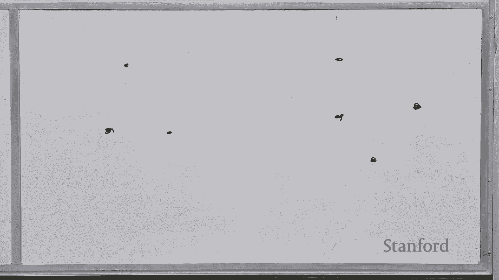

 So here's the k-means objective function。 So this is the principle by which we're going to derive clustering。

 Okay， so k-means says that every cluster， there's going to be two clusters， is going。

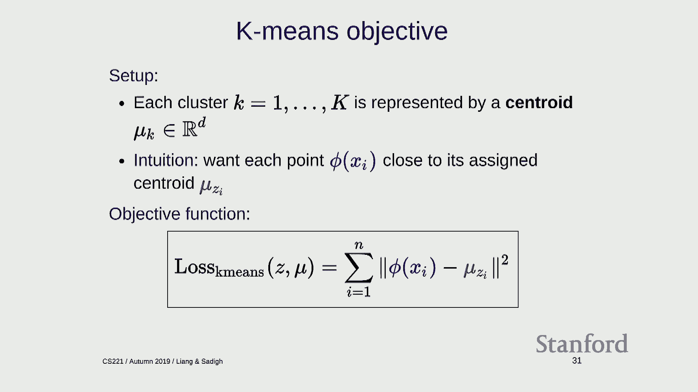

 to be associated with a central。 Okay？ So I'm going to draw a centroid in a red square here。

 And the centroid is a point in this space along with the data points。 And I'm going to。

 this is kind of representing where the cluster is。

 And then I'm going to associate each of the points with a particular centroid。

 So I'm going to denote this by a blue arrow pointing from the point into the centroid。 And you know。

 these two quantities are going to kind of represent the cluster。

 I have the locations of the clusterings in red and also the assignments of the points。

 into the clusters in blue。 Okay？ So of course， neither the red or the blue are known。

 and that's something we're going， to have to optimize。

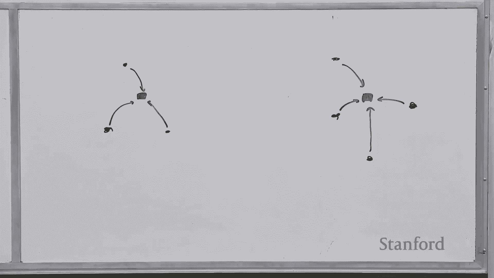

 Okay？ So， but first we have to define what the optimization objective function is。

 So intuitively what do we want？ We want each point V of Xi to be close to the centroid。 Right？

 So the centroid to be really representative of the points in that cluster， that centroid。

 should be close to all the points in that cluster。 Okay？

 So this is captured by this objective function， where I look at all the points。 For every point。

 I measure the distance between that point and the centroid that that point， is associated with it。

 So remember， Xi is a number between one and k。 So that indexes which of the mu。

 mu one or mu two I'm talking about。 And looking at the square distance between those two。

 the centroid and the point。 Yeah？ Yeah， the sign to the centroid。 Yeah。

 how does each point get to a sign to a centroid？ So that's going to be specified by the z's。

 which is going to be optimized over。 April you don't know。 Yeah？

 We always have a pretty good idea of how many like， what， like， the four， I guess， clusters。

 Clusters that could be。 Yeah， the question is， do we know how many clusters there are？ In general。

 though， so there are ways to select， it's another hyperparameter。

 So it's something that you have to set before you run the k means object function。

 So when you're tuning， you try different number of clusters and see which one kind of works， better。

 Okay。 So we need to choose the centroids and assignments jointly。 So this hopefully is clear。

 You just want to find the Simon Z and the centroids mu to make this number as small as， possible。

 So how do you do this？ Well let's look at a simple one-dimensional example and let's try to build up some question。

 Okay。 So we're in 1D now。 We have four points and the points are at， they're going to be at zero。

 two， ten and， twelve。 Okay？ So I have four points at these locations。 Okay， I want a cluster。

 And intuitively you think I want two clusters here。 There's going to be two centroids。

 And suppose I know the centroids。 Okay？ So just someone told you magically that the centroids。

 this example is going to be at。

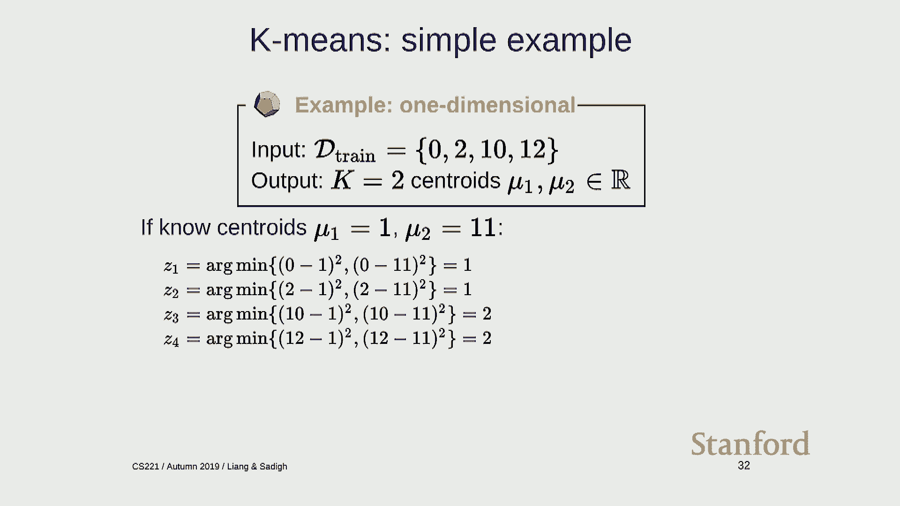

 one and eleven。 Okay？ So someone told you that and now you have to figure out the assignments。

 How would you do this？ Well let's assign this point。 Where should it go？

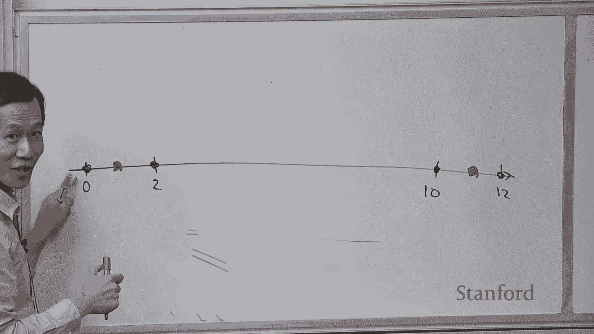

 You look at this distance which is one， you look at this distance which is eleven which， is smaller。

 one is smaller so you say okay that's where I should go。 Same with this point。

 one is smaller for these， eleven is smaller and that's it。 Okay？

 So mathematically you can see it's comparing the distance from each point to each of the。

 centers and choosing the center which is closest。 Okay？

 And you can convince yourselves that that's the way to， if the cluster centers were， centroids。

 would fix how you would minimize the objective function。

 Because if you choose a center which is farther away then you get just a larger value and。

 you want the value to be as small as possible。 Okay？ I don't know why this is true。

 I think this should be one， right？ Okay。 Anyway I'll fix that。

 Okay so let's do it the other way now。 Suppose I now have the assignments so I know that these two should be in some cluster。

 These two should be in a different cluster， cluster two and now I have to place the centers。

 Where should I place it here？ Where should I place it here？ Where should I place it？

 And if you look at the slide here， what you're doing is you're saying okay， for the first。

 cluster I know two and zero are assigned to that cluster。

 And I know that the sum of the distances to this centroid mu is this and I want this number。

 to be as small as possible。 Okay？ And if you did the first homework you know that whenever you have one of these kind of。

 squared up some objectives you should be averaging the points here。

 So you can actually solve that in close form and you given the assignments here you know。

 the center should be there which is average of zero and two and for this cluster you should。

 average the two points here and that should be at 11。 Yeah？ What is this assignment？

 I'm not really interested in this。 Okay so what's the difference between centroid and assignment？

 So when you're clustering you have K clusters so there's K centroids。

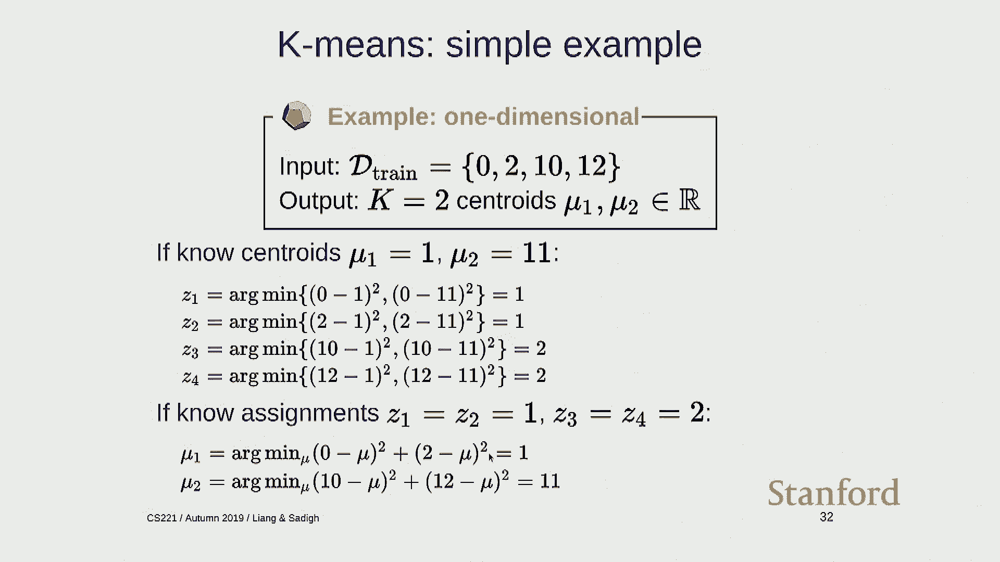

 So in this case there's two centroids。 Those are the red。

 The assignments are the association between the points and the centroid。

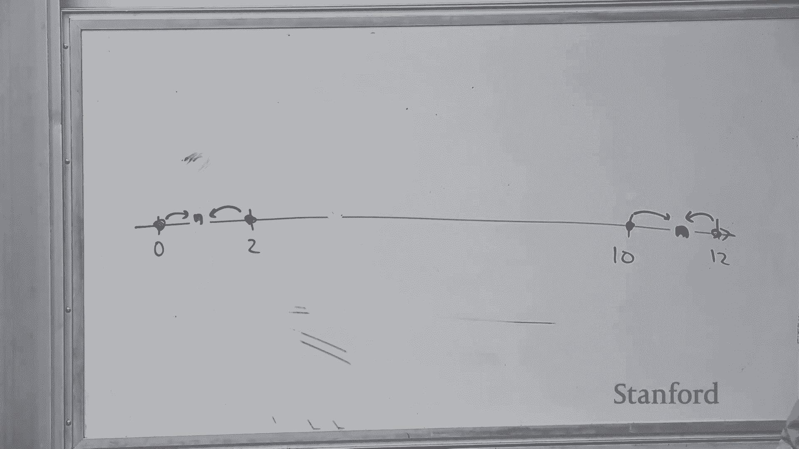

 So you have N assignments。 These are the things that you're looking at。 Yeah？

 Is the K a hyperparameter or is that some？ Yeah so K here is a hyperparameter which is a number of clusters which you can turn。

 Okay so here's a chicken and egg problem right。 If I knew the centroids I could pretty easily come up with assignments。

 If I knew the assignments I could come up with the centroids but I don't know either one。

 So how do I get started？ So the key idea here is alternating minimization which is this general idea in optimization which。

 is usually not a bad idea and the principle is well you have a hard problem maybe you can。

 solve it by tackling kind of two easy problems here。 So here's a K means algorithm。

 So step one is you're going to you're given the centroids。

 Now kind of going to more general notation mu， mu， mu， k and I want to figure out the， assignments。

 So for every data point I'm going to assign that data point to the cluster with a closest， centroid。

 So here I'm looking at all the clusters one through K and I'm going to test how far is。

 that point from that centroid and I'm just going to take the smallest value and that's。

 going to be where I assign that point。 Okay。 Step two。

 flip it around you're given the cluster assignments now Z one through Z and。

 now we're trying to find the best centroids。 So what centroid should I pick？

 So now you go through each cluster one through K and you're going to set the centroid of。

 the kth cluster to the average of the points assigned to cluster。

 So mathematically this looks like that you just sum over all the points I which have。

 been assigned to cluster K and you basically add up all the feature vectors and then you。

 just divide by the number of things you summed over。 Okay。

 So putting it together if you want to optimize this objective function the k means reconstruction。

 and loss。 First you initialize mu one through mu k randomly。

 There's many ways to do this and then you just iterate set the assignments given the。

 clusters centroids and then set the centroids given the cluster assignments。 There's alternate。

 Yeah。 So this makes sense for like coordinates for like images where like if you read in a similar。

 image by bytes it looks the same but like words where words that are spelled totally。

 differently can have like these same like semantic meanings。

 How do you accurately map them to like a same location to cluster centroid around？ Yeah。

 So the question is like maybe for images distances in you know pixel space makes kind of more。

 sense but if you have words then you know two words which you shouldn't be looking at。

 like the edit distance between you know the words and two synonyms like a big and large。

 look very different but they're somehow similar。 So this is something that word vectors you know address which we're not going to you。

 talk about basically you want to capture the representation of a word by its context。

 So the context in which big and large occur is going to be kind of similar and you can。

 construct these context vectors that give you a better representation。 We can talk more offline。

 Yeah。 Yeah you can get stuck and I'll show you an example。 Okay。

 Any other questions about the general algorithm？ Yeah。 Yeah。 Yeah。 Yeah。 Maybe I'll answer that。

 I'll show you an example。 Yeah。 In here you show that you're doing a fixed number of iterations but can you become criteria。

 like it doesn't change anymore as a stopping condition？ Yeah。

 So this is going up to a fixed number of iterations T。 Typically you would have some sort of you。

 would monitor this objective function and once it gets below stops changing very much。

 then you just stop。 Actually the K-means algorithm is guaranteed to always converge to a local minimum。

 So why don't I just show you this demo and I think it'll be make some things clearer。 Okay。

 So here I have a bunch of points。 So this is a JavaScript demo。

 You can go and play around and change the points if you want。 It's linked off the course website。

 And then I'm going to run K-means。 So initialize with these three centroids。

 And these regions are basically the points that would be assigned to that centroid。

 So this is a Voronoi diagram of these centroids。 And this is the loss function which hopefully should be going down。

 So now I iterate， so iteration one I'm going to assign the points to the clusters。

 So these get assigned to blue。 This one gets assigned to red。 These gets assigned to green。

 And then the step two is going to be optimizing the centroids。

 So given all the blue points I put the center in the smack in the middle of these blue points。

 And then same with green and red。 Notice that now these points are in the red region。

 So if I reassign then these become red。 And then I can iterate。 And then keep on going。

 And you can see that the algorithm eventually converges to clustering where these points， are blue。

 These points are red and these are green。 And if you keep on running it you're not going to make any progress because if the。

 assignments don't change then the cluster centroids are going to change either。

 So let me actually skip this。 I was just going to do it on the board but I think you kind of get the idea。

 So let's talk about this a local minimum problem。 So K-means is not guaranteed to converge to a local minimum。

 But it's not guaranteed to confine a global minimum。

 So if you think about this as a toy visualization of the objective function by going downhill。

 you can get stuck here but it won't get to that point。

 So just like an example for different random seeds you can let's say you initialize here。

 So now all the three centers are here。 And if I run this and I run this now I get this other solution which is actually a lot。

 worse。 Remember the other one was 44 and this is 114。

 And that's where the algorithm converges and you're just stuck。

 So in practice people typically try different initialization from different random points。

 and then just take the best。 There's also a particular way of initialization called K-means plus plus where you put down。

 a point and you put down a point which is as far this as possible and then as far as。

 where as possible。 And then that kind of spreads out the centers so they don't interfere with each other and。

 that generally works pretty well。 But still there's no necessary guarantee of converging to the global optimum。

 Any questions about K-means？ Yeah？

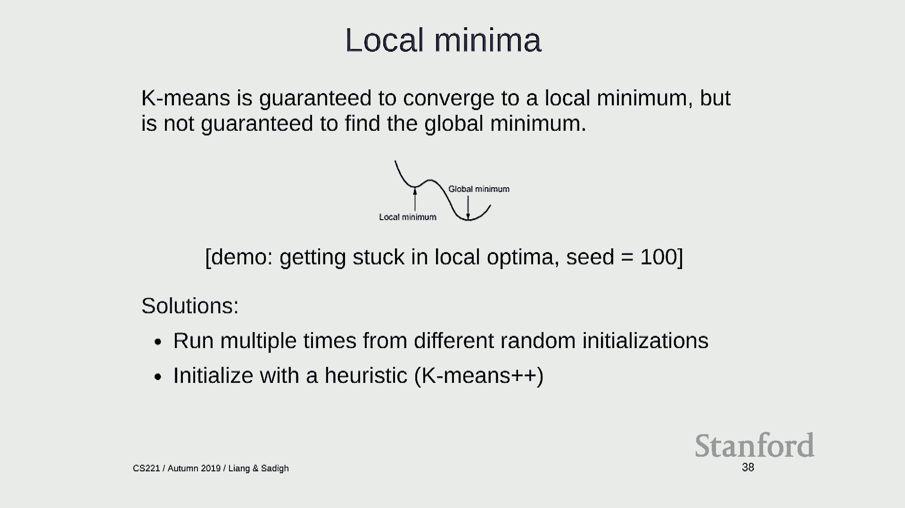

 How do you choose K？ You guys love these hyperparameter tuning questions。

 So one thing you can kind of draw is the following picture。

 So K and then your loss that you get from K and usually if you have one cluster the。

 loss is going to be very high and that at some point it's going to go down and you generally。

 you know， lop it off when it's not going down by very much。 So you can monitor that curve。

 Another thing you can do is you have a validation set and you can measure reconstruction error。

 on that validation set and choose the minimum based on that。

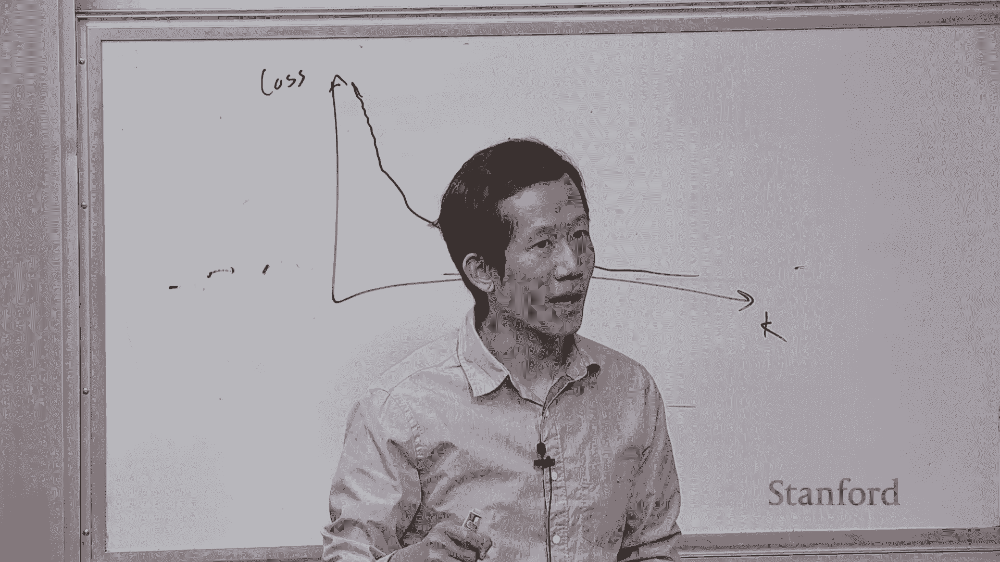

 This is just another hyperparameter that you can do。 Yeah？ How is the training loss calculated？

 So the training loss is this quantity。 So you sum over all your points and then you look at the distance between that point。

 and the sign centroid and you square that and you just add all those numbers up。 Okay so to wrap up。

 oh actually I have more slides here。 So unsupervised learning you're trying to leverage a lot of data and we can kind of。

 get around this difficult optimization problem by doing this alternate minimization。

 So these will be quick。 So just to kind of summarize the learning section we've talked about feature extraction。

 and I want you to think about the hypothesis class that's defined by a set of features。

 Prediction which boils down to kind of what kind of model you're looking at for classification。

 and regression， supervised learning you have linear models and neural networks and for。

 clustering you have you know with a K-means objective。

 You have loss functions which in many cases all you need to do is compute the gradient。

 And then there's generalization which is what we talked about for the first half of this。

 lecture which is really important to think about。 The test set remember is kind of only a surrogate for unseen future examples。

 So a lot of these ideas that we presented are actually quite old。

 So the idea of least squares for regression goes back to Gauss when he was trying to solve。

 some astronomy problem。 Logistic regression was from statistics。

 In AI there was actually some learning that was done even in the 50s for playing checkers。

 As I mentioned in the first day of class there was a period where learning kind of fell out。

 of favor but it came back with back propagation。 In the much of the 90s actually a lot more kind of rigorous treatment of optimization。

 and you know formalization of when algorithms are guaranteed to you know converge that happened。

 in the 90s and then in the 2000s we know that people looked at kind of structural prediction。

 and there was a revival of neural networks。 Some things that we haven't covered here are you know feedback loops right。

 So learning assumes kind of the static view where you take data you train a model and。

 then you go and generate predictions。 But if you deploy the system in a real world those predictions are actually going to come。

 around and beat data。 And those feedback loops can also cause you know problems that you might not be aware。

 of if you're only thinking about here's I'm doing my machine learning thing。

 How can you build classifiers that don't discriminate？

 So we often have classifiers you're minimizing the training set average of a training set。

 So by kind of construction you're trying to drive down the losses of you know kind of。

 common examples。 But often you get these situations where minority groups actually get you know pretty high。

 loss because they look different and almost look like outliers but you're not really able。

 to fit them but the training loss doesn't kind of you know care。

 So there's other ways there's techniques like distribution and robust optimization that。

 tries to you know get around some of these issues。

 There's also privacy concerns how can you learn actually if you don't have access to。

 entire data set。 So there's some techniques based on randomization that can help you and then interpretability。

 how can you understand what you know the algorithms are doing especially if you have。

 a deep neural network you've learned a model and there's you know work which I am happy。

 to discuss with you offline。 So the general so we've concluded three lectures on machine learning but I wanted you kind of。

 to think about learning in the most general way possible which is that you know programs。

 should improve with you know experience right。 So I think we've talked about you know linear classifiers and all these kind of nuts and。

 bolts of basically reflex models but in the next lectures we're going to see how learning。

 can be used in state based models and also you know variable based models。

 Okay with that so that concludes next week Dorso will be giving the lecture on state based， models。

 [BLANK_AUDIO]。

