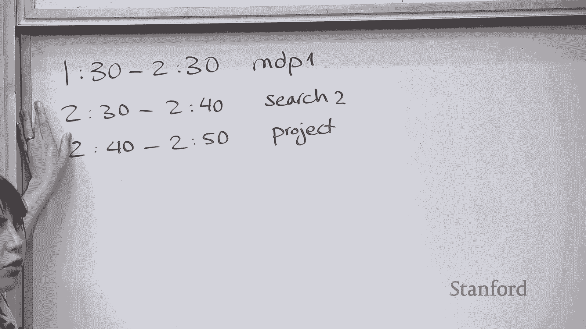

# P7：Lecture 7（给我讲故事看已校对） Markov Decision Processes - Value Iteration - 鬼谷良师 - BV16E411J7AQ

 Okay， let's start guys。

 Okay， so I'll plan for today's to catch up， so you're a little behind。 So， okay。

 so today I want to talk about MDPs， Markov decision processes。

 My plan is to talk about that for the first hour， and then after that I want to talk for。

 ten minutes about the previous lecture。 So remember， like you bent over relaxations kind of quick。

 so maybe you can go over that。

 again。 And then the last ten minutes I want to talk about the project and kind of the plan for。

 the project， how you should think about it。 This is coming up。

 so we should start talking about that。 So this is an optimistic plan。 So let's see how it goes。

 This is a current plan。 Okay， all right， so， okay， let's get into it。 So Markov decision processes。

 So let's start with a question。 Let's actually do this just by hand。

 so don't need to go to the website。 So the question is it's Friday night and you want to go to Mountain View and you have。

 a bunch of options， but what you want to do is you want to get to Mountain View with。

 the least amount of time。 Okay， which one of these modes of transportation would you use？

 Like how many of you would bike？ No one would bike。 A couple people would bike。

 How many of you would drive？ This is popular on Mountain View。 Would be good。 Caltrainers。

 Some people would take Caltrain， sounds good Uber and Lyft。 We have a good distribution fly。 Yes。

 yeah， the number of people want to fly。 As flying cars are becoming a thing。

 this could be an option in the future。 There are a lot of actually startups working on flying cars。

 But as you think about this problem， the way you think about it is there are a bunch of。

 uncertainties in the world。 It's not necessarily a search problem。

 You could bike and you can get a flat tire and you don't really know that。

 You have to take that into account。 If you're driving， there could be traffic。

 If you're taking the Caltrain， there are all sorts of delays with the Caltrain。

 And all sorts of uncertainties that exist in the world and you need to think about those。

 So it's not just a pure search problem where you pick your route and then you just go with， it。

 There are things that can happen that can affect your decision。

 That takes us to Markov decision processes。 We talked about search problems where everything was deterministic。

 And now you're talking about this next class of state-based functions which are Markov decision。

 processes。 And the idea of it is you take actions but you might not actually end up where you expect。

 it to because there's this nature around you and there's this world around you that's。

 going to be uncertain and do stuff that you didn't expect。

 So far we've talked about search problems。 The idea of it is you start with a state and then you take an action and you deterministically。

 end up in a new state。 If you remember the successor function。

 successor of S and A would always give us S prime and， we would deterministically end up in S prime。

 So if you have like that graph up there， if you start in S and you decide to take this， action one。

 you're going to end up in A。 There's no other option。 That's how you're going to end up in it。

 And the solution to these search problems were these paths。

 So we had this sequence of actions because I know if I take action one and action three。

 and action two， I know like what is a path that I'm going to end up at and that would， be ideal。

 Okay？ So when we think about Markov decision processes。

 that is the setting where we have uncertainty， in the world and we need to take that into account。

 So the idea of it is you start this state， you decide to take an action but then you。

 can randomly end up in different states。 You can randomly end up in S one prime or a stew prime。

 And again， because there's just so many other things that are happening in the world and。

 you need to worry about that randomness and make decisions based on that。

 And this actually comes up pretty much like everywhere in every application。

 So this comes up in robotics。 So for example， if you have a robot that wants to go and pick up an object。

 you decide on， your strategy， everything is great。

 But like when it comes to actually moving the robot and getting the robot to do the task。

 like the actuators can fail or you might have all sorts of obstacles around you that。

 you didn't think about。 So there is uncertainty about the environment or uncertainty about your model。

 like your， actuators that you didn't necessarily think about and in reality they're affecting your。

 decisions and where you're ending up at。 This comes up in other settings like resource allocation。

 So in resource allocation， maybe you're deciding what to produce， what is a product you would。

 want to produce。 And that kind of depends on what does a customer depend and you might not have a good model。

 of that and that's uncertain。 It really depends on what products customers want and what they don't。

 And you might have a model but it's not going to be accurate and you need to do resource。

 allocation under those assumptions of uncertainty about the world。 Similar thing is in agriculture。

 So for example， you want to decide what to plant but again you might not be sure about。

 the weather or if it's going to rain or if the crops are going to yield or not。

 So there's a lot of uncertainty in these decisions that we make and they make these。

 problems to go beyond search problems and become problems where we have uncertainty and。

 we need to make decisions under uncertainty。 Okay。 All right， so let's take another example。

 So this is a volcano crossing example。 So we have an island and we're on one side of the island and what we want to do。

 so we're， in that black square over there and what we want to do is we want to go from this black。

 square to this side of the island where we have the scenic view and that's going to。

 give us a lot of reward and happiness。 So my goal is to go from one side of the island to the other side of the island。

 But the caveat is here is that there's this volcano in the middle of the island that I。

 need to actually pass。 So and if I fall into the volcano I'm going to get a minus 50 reward more like minus infinity。

 But for this example， like imagine you're getting a minus 50 reward if you fall into， the volcano。

 So all right， so if I have this thing here on this side， so if my slip probability is， zero。

 which is I'm sure I'm not going to fall into a volcano， should I cross the island？ No， yes。 Well。

 I should cross the island because I'm not going to fall， right？

 Like I'm not going to fall into that minus 50， slip probability is zero， I'll get to， my 20 reward。

 everything will be great。 Okay。 So the thing is like we've been talking about how the world is stochastic and the。

 and the probability is not going to be zero， maybe it is 10%。

 So if there's 10% chance of falling into the volcano， how many of you would still cross， the island？

 Good number。 So the optimal solution is actually shown by these arrows here and yes。

 the optimal solution， is still to cross the island。 Like your value here。

 we're going to talk about all these terms。 The value here is basically the value you're going to get at that beginning like state。

 which is the kind of， we'll talk about it。 It's expected utility that you're going to get。

 It's going to go down because there is some probability that you're going to fall into， the volcano。

 but still like the best thing to do is to cross the island。 How about 20%。

 how many of you would do it with 20%。 Some number of people。 It's less。

 All turns out that the optimal strategy is to cross 30%。 So with 30%。

 that's actually the point that you kind of， you'd rather not cross because。

 there's this volcano and then with large probability you could， you could fall into the volcano。

 and the value is going to go down。 So these are the types of problems you're going to work with。

 Yes。 So two is like a value。 The reward that you're going to get at that state and then value you compute that you。

 propagate it back。 We'll talk about that in detail on how to compute the value。 All right。 Okay。

 So that was just an example。 So that was an example of a Markov decision process。

 What we want to do in this lecture is we're going to like again， model these types of systems。

 as Markov decision processes。 Then we're going to talk about inference type algorithm。

 So how do we do inference？ How do we come up with this best strategy path？ In the middle。

 I'm going to talk about policy evaluation， which is not an inference algorithm。

 but it's kind of a step towards it and it's basically this idea of if someone tells me。

 this is a policy， can I evaluate how good it is？ And then we'll talk about value iteration。

 which tries to figure out what is the best， policy that I can take。 So that's a plan for today。

 Then next lecture we're going to talk about reinforcement learning where we don't actually。

 know what the reward is and we don't know what the transitions are。

 So that's kind of the learning part of this MDP lectures。

 So Reid is going to actually do the lecture next next on Wednesday。

 So let's get into Markov decision processes。 So we have a bunch of examples throughout this lecture。

 So let's look at another example。 So actually I do need volunteers for this。 So in this example。

 we have a bunch of rounds and the idea is at any point in time you can， choose two actions。

 You can either stay or you can quit。 If you decide to quit， I'm going to give you $10。 Actually。

 I'm not going to give you $10， but imagine I'm going to give you $10 and then， we'll end the game。

 And then if you decide to stay， then you're going to get $4 and then I'll roll dice。

 If I get one or two， we'll end the game。 Otherwise you're going to continue to the next round and you can decide again。

 So who wants to play with this？ Okay。 All right， want you。 So stay or quit。 So that was easy。

 You got your $10。 Does anyone else want to play？ Stay。 Oh， you got $8。 Sorry， the dice is too。

 So kind of get the idea here， right？ So you have these actions and then with one of them。

 like if you decide to quit， you deterministically， will get your $10 and you're done。 The other one。

 it's probabilistic and you kind of want to see which one is better and。

 what would be the best policy to take in this setting。

 So we'll come back to this question and we'll formalize this and we'll go over this。

 Just continue once and then quit。 Like， it doesn't be better to switch or。

 So then you need to actually compute what is the expected utility， right？

 And that's what we want to do。 So you might say， oh。

 I want to stay and then I get my $4 and then I want to quit and then。

 I get $14 and maybe that is the way to go。 That could be a strategy but for doing that， right？

 Like we are going to actually talk about that。 For doing that。

 we are going to define what would be the optimal policy。

 One other thing that for this particular problem， we are going to keep in mind is I'll talk about。

 when I define the policy。 But the policy， the way we define it is it's a function of state。

 So if you decide to stay， that is your policy， if you decide to not stay， that is your policy。 Like。

 you're not allowing switching right now。 Like， as I talk about this later in the lecture。

 but I'll come back to this problem。 Okay？ So if you decide that your policy。

 the thing you want to do is to just stay， keep staying。

 This is the probability of like the total rewards that you're going to get。

 So you're going to get four with some probability and then if you're lucky， you're going to。

 get eight and then even if you're lucky， you're going to get 12 and if you're lucky， you're。

 going to get 16。 But the probabilities are going to come down pretty much like really quickly。

 So the thing we care about in this setting is the expected utility， right？ In expectation。

 like if I run this and if I average all these possible paths that I， can do。

 what would be the value that I get？ And for this particular problem。

 it turns out that in expectation， if you decide to stay， you should get 12。

 So you got really unlucky that you got eight。 But in general， in expectation。

 you should decide to stay。 And then we actually want to spend a little bit of time in this lecture thinking about。

 how we get that 12 and then how to go about computing this expected utility。 And based on that。

 how to decide what policy to use， right？ Okay。 And then if you decide to quit。

 then the expected utility there is kind of obvious， right？

 Because that you're quitting and that's with probability one， you're getting $10。

 So you're just going to get $10 and that is the expected utility of quitting。 So when I said。

 when you roll a die， I said if you get one or two， you say， yeah。 And then if you get the other。

 so the two thirds of it， you continue。 So it's a one third， two third comes from there。 All right。

 I'll come back to this example。 This is actually the running examples throughout this lecture。 So。

 >> You're going to talk about that。 >> You're going to talk about that。

 >> I'm going to talk about that。 Okay。 So let's actually。

 I do want to finish it now or that's why maybe I'm rushing things a， little bit。

 But we are going to talk about this problem like throughout the class。 So don't worry about it。

 If it's not clear at the end of it， they can clarify things。 Okay。 All right。

 So I do want to formalize this problem。 The way I want to formalize this problem is using an MDP。

 So I want to formalize this as a Markov decision process。 Maybe I can just use this。

 So in Markov decision processes， similar to search problems， you're going to have stakes。

 So in this particular game， I'm going to have two stakes。

 I'm either in the game or I'm out of the game。 So I'm in an end state where everything we ended。

 You're out of the game。 You're done。 Okay。 So those are my states。 Then when I'm in these states。

 I'm in each of these states， I can take an action。 And if I'm in an end state。

 I can take two actions， right？ I can either decide to stay， right？ Or I can quit。

 And if I decide to stay from end state， that takes me to something that I'm going to call。

 a chance node。 So a chance node is a node that represents state and action。

 So it's not really like the blue things are my states， but I'm creating these chance nodes。

 as a way of kind of going through this example to see where things are going。

 So these blue states are going to be my states。 I'm in S。

 These chance nodes are over state and action。 So basically the snout tells me that I started within and I decided to stay。

 And a chance node here basically tells me that I started within and I decided to quit。 Okay。 Yes？

 >> I'm in the top states node， even though it's deterministic。

 >> So I deterministically go through it， but then from the chance node， that's where I'm。

 introducing the probability。 So from the chance node。

 I can like probabilistically end up in these different states。 In the case of the quit。

 it's also deterministic。 >> In the case of the quit， in this case it's deterministic。 Yeah。

 So in the case of the quit， we say with probability one， I'm going to end up in this end state。

 So I'm going to draw that with the edge that comes from my chance node。

 And I'm going to say with probability one， I'm going to get $10 and just be done。

 But if you're in this state， this is actually the state where interesting things can happen。

 With probability two thirds， I'm going to go back to in and get $4 or with probability， one third。

 I'm going to end up in end and we get still $4。 Okay。 So that is my Markov decision process。

 So I had， maybe you can keep track of a list of things you're defining in this lecture。

 So we just define states and then we said， well， we're going to have these chance nodes。

 because from these chance nodes， probabilistically， we're going to come out of them depending。

 on what happens to nature。 Right？ Like I end up， this is the decision I've made。

 Now nature kind of decides which one we are going to end up at and based on that we move， forward。

 Okay。 All right。 So， so more formally， we have a bunch of things when we define an MDP。

 Similar to search problems。 We now need to define the same set of things。

 So we have a set of states。 In this case， my states are in an end。 Okay。 We have a start state。

 I'm starting with in。 So that's my start state。 I have actions as a function of states。

 So when I ask， what are the actions of the state， my actions are going to be stay or quit。

 What are actions of end？ I don't have anything to it。

 End state doesn't have any actions that come out of it。

 And then we have these transition probabilities。 The transition probabilities more formally take a state。

 an action， and a new state。 So S， A， S prime。 And tell me what is the transition probability of that。

 It's one third in this case。 And then I have a reward which tells me how much was that rewarding。

 That was four dollars。 Okay。 So， so I'm defining。 So when I'm defining my MDP。

 kind of the new things I'm defining is this transition probability。

 which tells me if you're in state S and take action A and you end up in S prime， what is。

 the probability of that？ I'm in N。 I decide to stay and then I end up in N。

 What's the probability of that？ That's one third。 Maybe I'm in N。 I decide to quit。 I end up in N。

 What's the probability of that？ That's equal to one。 Okay。 And then over the same state actions。

 state primes like next states we are going to end， up at。 We're going to define a reward。

 Which tells me how much money did I get or like how good was that。

 So it was four dollars in this case or if I decide to quit， I got ten dollars。 Okay。

 And if you remember in the case of search problems you were talking about cost， I'm。

 just flipping the sign here。 We wanted to minimize cost。 Here we want to maximize the reward。

 It's just a more optimistic view of the world， I guess。

 So that is what the rewards are going to be defined on。

 We also have this is end function which again similar to search problems just checks if。

 you're in an end state or not。 And in addition to that we have something that's called a discount factor。

 It's the value gamma which is between zero and one。 And I'll talk about this later。

 Don't worry about it right now。 But it's a thing we define for our search problem， for our MVPs。

 All right。 So how do I compare this with search？ Again。

 these were the things that we had in a search problem。

 We had the successor function that would deterministically take me to S prime。

 And we had this cost function that would tell me what was the cost of being in state S and。

 taking action A。 So the major things that are changed is that instead of a successor function。

 I have transition probabilities， these Ts that basically term was the probability of， starting in S。

 taking action A and ending up in S prime。 And then the cost just became reward。

 So those are kind of the major differences between search and MVP。

 Because things are not deterministic。 Okay？ All right。 So that was the formalism。

 Now I can define any markup decision process。 And then one thing to point out is this transition probability is this T。

 Basically specifies the probability of ending up in state S prime if you take action A， in state S。

 So these are probabilities。 So for example， again， like we've done this example。

 but let's just do it on the slide， again。 If I'm in state in， I take action quit。 I end up in end。

 What's the probability of that？ One。 And then if I'm state in， I take action stay。

 I end up in state in again。 What's the probability of that？ I ended up in in again， two thirds。

 And then if I'm state in， I take action stay， I end up in end。 That's the probability of that。

 One third。 Okay？ And these are probabilities。 So what that means is they need to kind of add up to one。

 But one thing to notice is well， just what is going to add up to one？

 Like all of the things in the column are not going to add up to one。

 The thing that's going to add up to one is if you consider all possible these different。

 S primes that you're going to end up at， those probabilities are going to add up to one。

 So if you look at this table again， if you look at deciding and being stay in and taking。

 action stay， then the probabilities that we have for different S primes are two thirds。

 and one thirds。 And those two are the things that are going to add up to one。 And in the first case。

 if you're in stay in and you decide to quit， then whatever S primes， you're going to end up at。

 in this case it's just end state， those probabilities are going， to add up to one。

 So more formally what that means is if I'm summing over S primes， these new states that。

 I'm going to end up at， the transition probabilities need to add up to one。

 Because they're basically probabilities that tell me what are the things that can happen。

 if I take an action。 And then this transition probabilities are going to be non-negative because they're probabilities。

 So that's also another property。 So usual things。 Alright。 So that's a search problem。

 Let's actually formalize another search problem。 This is， let's actually try to code this up。

 So what is a search problem？ This is the tram problem。 So remember the tram problem。

 I have blocks one through N。 What I want to do is I have two possible actions。

 I can either walk from state S to state S plus one。

 Or I can take the magic tram that takes me from state S to state two S。 If I walk。

 that costs one minute。 Means reward of that is minus one。 If I take the tram。

 that costs two minutes。 That means that the reward of that is minus two。

 And then the question was how do we want to travel from one to N in the least amount of， time。

 So nothing here is probabilistic yet。 So I'm going to add an extra thing here which says the tram is going to fail with probability。

 point five。 So I'm going to decide maybe take a tram at some point and that tram can fail with probability。

 point five。 If it fails， I end up in my state。 Like I don't go anywhere。 And actually。

 like in this case you're assuming， you're still losing two minutes。 So if I decide to take a tram。

 I'm going to lose two minutes。 Maybe it will fail。 Maybe it will not。 All right。

 So let's try to formalize this。 So we're going to take our tram problem from two lectures ago。

 So this is from search one。 We're going to just copy that。 So all right。

 So this was what we had from last time。 We had this transportation problem。

 And we had all of these algorithms to solve the search problem。

 We don't really need them because we have a new problem。 So let's just get rid of them。

 And now I just want to formalize an MDP。 So it's a transportation MDP。 Okay。

 The initialization looks okay。 Start state looks okay。 I'm starting from one。 Is end looks okay。

 So the thing I'm going to change is the first off I need to add this actions function。

 So what would actions do？ It's going to return a list of actions that are potential actions in a given state。

 So I just copy pasted stuff from down there。 You just edit。

 So it's going to return a list of valid actions。 So what are the valid actions I can take？

 I can either walk or I can tram。 So I'm going to remove all these extra things that I had from before and just keep it to。

 be either walking or I'm taking the tram。 As long as it's a valid state。

 So that looks right for actions。 The other thing we had was a successor and cost function。

 So now we want to just change that and return these transition probabilities and reward。

 So it's basically the successor probabilities and reward。

 So I'm putting those two together similarly before we had successor and cost。

 Now I'm returning probabilities and reward。 So what this function is going to return is it's going to return this new state is S prime。

 I'm going to end up at and the probability value for that and reward of that。

 So given that I'm starting in state S and I'm taking action A then what are the potential。

 S primes that I can end up at and what are the probabilities of that？

 And what is T of S a S prime and what is the reward of that？ What is the reward of S a S prime？

 I want to have a function to just returns these so I can call it later。 Okay。 All right。

 So I need to basically check like for each one of these actions。 I can for action walk。

 What happens for action walk？ What's new state？ I'm going to end up at well I'm going to end up at S plus one。

 It's a deterministic action。 So I'm going to end up there with probability one and what's the reward of that？

 Minus one because it's one minute cost。 So it's minus one reward。

 Then for action tram we kind of do the same thing but we have two options here。

 I can end up in two S tram doesn't fail。 I end up in two S with probability point five that cost that reward of that is minus two。

 Or the other option is I'm going to end up in state S because I didn't go anywhere because。

 we probably would be point five the tram did fail and that that reward of that is minus， two。

 And that's pretty much it。 That that is my my MVP。

 So I can just define this for city with let's say 10 blocks。 Oh。

 and we need to have the discount factor but we'll talk about that later。

 Let's say it's just one for now。 And I'll use right I'm writing this other states function for later but。

 Does that look right？ Just formalized this MVP。 So let's check if it does the right thing。

 So maybe we want to know what are the actions from state three。

 What are the actions from state three？ Oh， we need to remove this util function from before because we don't have it in the folder。

 So we'll remove that。 What are the actions from state three？ I have 10 blocks。

 If I'm in state three， I can either walk or tram。 I don't want to them。

 So so that did the right thing。 Maybe we want to just check if this successor probability and reward function does the right。

 thing。 So maybe maybe we can try that out for state three and walk。

 So so for state three and action walk， then what do we get？ Well。

 we end up in four and that is with probability one with the reward of minus one。 Okay。

 Let's try that for tram。 Again， remember tram can fail。 So I'm going to get two things here。

 So these are the things I'm going to get for tram。

 I'm going to either end up in six with probability point five with the reward of minus two or。

 I will not go anywhere。 I'm still at three with probability point five。

 And that is with the reward of minus two。 Okay。 All right。 So that was just a tram problem。

 And we formalize it as an MDP。 Again， the reason it's an MDP here is that the tram can fail with probability point five。

 So we added that in。 Then we defined our transition function and our reward function。 Okay。

 All right。 Everyone happy with how we are defining MDPs？ Yeah。 Okay。

 Pretty similar to search problems except for now we have these probabilities。 Okay。 All right。

 So now I have defined an MDP。 That's great。 The next question that in general we would like to answer is to give a solution。

 right？ So there's a question。 What is the Markov part of an MDP？

 So the Markov part means that you just depend。 So when you just depend on the state and this current state。

 like the way we define our state， remember our state is sufficient for us to make optimal decisions for the future。

 So the Markov part means that your Markovian only depends on the current state and actions。

 to end up in the problem we'll secretly end up in next。 So yeah。

 So the interesting question you would like to do is， well， we want to find a solution。

 I want to figure out what is the optimal path to actually solve this problem。 And again。

 if you remember search problems， the solution to search problems was just a sequence。

 of actions that that's all I had。 Like a sequence of actions， a path。 That was a solution。

 And the reason that was a good solution was like everything was deterministic。

 So I could just give you the path and then that was what you would follow。 But in the case of MDPs。

 the way we are defining a solution is by using this notion of a policy。 So a policy。

 let me actually write that here。 So you've defined an MDP。 But now I want to say， well。

 what is a solution of an MDP？ A solution of a Markov decision process is a policy pi of s。

 So and this policy basically goes from states。 So it takes any state and it tells me what is the potential action that I would get for。

 that state。 So a policy is a function。 It's a mapping from each state s in the set of all possible states to an action in the。

 set of all possible actions。 So in the case of what we're going to crossing。

 I can have something like this。 I can be in state 1， 1。

 And then the policy of that state could be going south。 Or I can be in state 2， 1。

 And a policy for that state is east。 If this was a search problem， I would just give a path。

 I would just say， go south and then go east and go north。 So that would be my solution。 But again。

 if I decide that， well， the policy at 1， 1 is to go south， there is no reason。

 for you to end up at south。 Because this thing is probably a mistake。

 So the best thing I can do is for every state to tell you what is the best thing you can。

 do for that particular state。 And that's why we are defining a policy as opposed to giving a full path。

 All right， so policy is the thing we are looking for。 And ideally。

 I would like to find this best policy that would just give me the right solution。

 But in order to get there， I want to spend a little bit of time talking about how good。

 a policy would be。 And that's kind of this idea of evaluating a policy。 So in this middle section。

 I don't want to try to find a policy。 I just assume you give me a policy and I can evaluate it until you how good that is。

 So that's the plan for the middle section。 Yeah。 All right， everyone happy with it。 So far。

 all I've done is I've defined an MDP， which is very similar to a search problem。

 It's just probabilistic。 So how would we evaluate a policy？ So if you give me a policy。

 which basically tells me that every state S takes some action。

 then that policy is going to generate a random path。

 I can get multiple random paths because nature behaves differently and the world is uncertain。

 So I might get a bunch of random paths。 And then those are all random variables。 Random paths。

 sorry。 And then for each one of those random paths， I can define a utility。 So what is a utility？

 Utility is just going to be the sum of rewards that I'm going to get over that path。

 And I'm calling it as the discounted sum of the rewards。 Remember that discount？

 We'll talk about that。 But we can discount the future。 But for now。

 just assume it's just the sum of rewards on that path。

 So the utility that we are going to get is also going to be a random variable。

 Because if you think about a policy， the policy is going to generate a bunch of random paths。

 And utility is just going to be the sum of rewards of each one of those。 So it's a random variable。

 So if you remember this example， I can basically have a path that tells me， start an end， and。

 then stay， and then that ends。 So this is one random path。 And for this particular random path。

 well， what is a utility I'm going to get？ I'm just going to get $4。

 That's one possible thing that can happen。 If my policy is to， let's say， stay。

 there is no reason for the game to end right here。

 I can have a lot of different types of random paths。

 I can have a situation where I'm staying three times and then after that ending the game。

 And utility of that is 12。 We can have this situation where we have stay， stay， and end。

 That's the situation we saw。 You get a utility of 8， and so on。

 So you're getting all these utilities for all these random paths。

 So these utilities are also going to be just random variables。

 So I can't really play around with the utility。 That's not telling me anything。

 It's telling me something， but it's a random variable。 I can't optimize that。 So instead。

 we need to define something that you can actually play around with。

 And that is this idea of a value， which is just an expected utility。

 So the value of a policy is the expected utility of that policy。

 And that's not a random variable anymore。 That's actually like a number。

 And I can compute that number。 I can compute that number for every state。

 and just play around with value。 OK？ [INAUDIBLE]， [INAUDIBLE]。

 That policy means to find for all possible states or a particular state。 For all possible。

 So the question is， yes， when you say a value of policy， is the policy basically telling me--。

 is the policy basically telling me what is the strategy for all possible states？ Well。

 you're defining a policy as a function of state。 And value， the same thing， is a function of state。

 I might ask， what is the value of being in？ So the value of being in and following policy state is going to be the value of following。

 policy state from this particular state， which is the expected utility of that， which。

 is basically that 12 value there。 I could ask it about any other state， too。

 So I can be in any other state and then say， well， what's the value of that？

 And when we do value iteration， we actually need to compute this value for all states。

 to have an idea of how to get from one state to another state。 But--， [INAUDIBLE]。

 --the way to be in state in and a policy given your state in taking the action state。 Yes。

 And that is what 12 is。 And 12， you kind of empirically have seen it's 12。

 but we haven't shown how to get 12， yet。 All right。 So actually。

 let me write these in my list of things。 So we talked about the policy。 What else did we talk about？

 We talked about utility。 So what is utility？ Utility， we said it's some of reward。

 So if I get like reward one， then I get reward two。 It's a discount at some of reward。

 So I'm going to use this gamma， which is that discount that I'll talk about in a little， bit。

 times reward two plus gamma squared times reward three and so on。

 So utility is you give me a random path and I just sum up the rewards of that。

 Imagine if gamma is one， I'm just summing up the rewards。 If gamma is not one。

 I'm summing-- I'm looking at this discounted sum。 So that is utility。

 But value-- so this is utility-- value is just the expected utility。

 So you give me a bunch of random path。 I can compute their utilities。

 I can just sum them up and average them。 And that gives me value。 [INAUDIBLE]， [INAUDIBLE]。

 [INAUDIBLE]， [INAUDIBLE]， That'd be bounded。 That's a very good question。 We'll get back to that。

 So in general， if it is acyclic， it is fine。 But if you have acyclic graph。

 you want your gamma to be less than one。 And we'll talk about that when we get to the convergence of these algorithms。

 All right。 [INAUDIBLE]， Okay。 All right。 So let's go to this particular volcano crossing example。

 So in this case， I can run this game。 And every time I run it， I'm going to get a different utility。

 Because I'm going to end up in some random path。 Some of them end up in the volcano。

 That's pretty bad。 So I get different utility values with the value。

 which is the expected utility is not， changing really。 This is around 3。7。

 which is just the average of these utilities。 So I can keep running this。

 getting these different utilities。 But value is this one number that I can talk about。

 And that's the value of this particular state。 And that tells me what would be the best policy that I can take and what's the best。

 amount of utility that I can get in an expectation from that state。 Okay。 All right。

 So we've been talking about this utility。 I've actually written that already on the board。

 So utility is going to be a discounted sum up reward。

 And then we've been talking about this discount factor。

 And the idea of the discount factor is I might care about the future differently from how。

 much I care about now。 So for example， if you give me $4 today and you give me $4 tomorrow。

 if that $4 tomorrow， is the same kind of amount and has the same value to me as today。

 then it's kind of the， same idea of having a discount counter of one。 And discount of one。

 gamma of one。 So you're saving for the future。 The values of things in the future is the same amount。

 If you give me $4 now， if you give me $4 10 years from now， it's going to be $4。

 I care about it like the $4 amount。 And I can just add things up。 But it could also be the case。

 like you might be in a situation in a particular MDP where， you don't care about the future as much。

 Maybe you give me $4 10 years from now and that doesn't， like I don't have any value， for that。

 So then if that is the case and you just want to live in the moment and you don't care about。

 the values you're going to get in the future， then that's kind of the other extreme when。

 this discount or this discount is equal to zero。 So that is a situation that if I get $4 in the future。

 they don't have any value to， me。 They just are zero to me。

 So I only care about right now living in the moment， what is the amount I'm going to get？

 And in reality， you're somewhere in between。 We are not just this case where we are living in a moment。

 We're also not this case that everything is just the same amount like right now or in， the future。

 And in balanced life is a setting where we have some discount factor。 It's not zero。 It's not one。

 It actually discounts values in the future because future maybe doesn't have the same， value as now。

 But we still value things in the future。 Like $4 is still something in the future。

 And that's where we pick a gamut that's between zero and one。 So that is kind of a design choice。

 Depending on what problem you're in， you might want to choose a different gamma。 Question here。

 So is discounting usually like that？ Is it an assessment of risk or is there a different way to assess how much risk you want。

 to take？ You could think of it as an assessment of risk in that way。 It depends on the problem。

 It depends on like in the particular problem， I do want to get values in the future or have。

 like some sort of long term like goal that I want to get to。 And I care about the future。

 It depends on like you're solving a game versus you're solving like I don't know like a robot。

 manipulation problem。 It might just be very different like discount factors that you would use。

 For a lot of examples we would use in this class who would just choose a gamma that's， close to one。

 Like usually like for a lot of problems that we end up dealing with gamma is like 0。9。

 That's like the usual。 Like for usual problems。 Like you might have a very different problem where we don't care about the future。

 So then we just drop it。 A quick question is gamma。

 a hyperparameter that needs to be tuned and is a gamma of 0， the same as a greedy algorithm？

 Okay so that's a good question。 So is gamma a hyperparameter that you need to tune？

 I would say gamma is a design choice。 It's not a hyperparameter necessarily in that sense that oh I'll pick the right gamma that。

 will do the right thing。 You want to pick a gamma that kind of works well with your problem statement。

 And gamma of 0 is kind of greedy like you're picking like what is the best thing right。

 now and I just don't care about the future ever。 Question back there。

 Is gamma a hyperparameter because that's kind of the memory of like what your state is？

 It doesn't violate the Markov property。 It's just a discount of like it's about the reward。

 It's not about how this state affects the next state。

 It basically affects how much reward you are going to get or how much do you value reward。

 in the future。 It doesn't actually， it's still a Markov decision process。 [INAUDIBLE]。

 What you're getting with the reward。 It's affecting the reward。 Yeah。

 but it's Markov because yeah if I'm state S and I take action A I'm going to end。

 up in a prime and that doesn't depend on like gamma。 OK。 All right。

 so in this section we've been talking about this idea of someone comes in and gives， me the policy。

 So the policy is pi。 And what I want to do is I want to figure out what's the value of that policy。

 And again， value is just the expected utility。 So v pi of S is just the expected utility received by following this policy pi from。

 state S。 So I'm not doing anything fancy。 I'm not even trying to figure out what pi is。

 All I want to do is I want to just evaluate if you tell me this is pi how good is that。

 with the value of that。 So that's what a value function is。 So value of a policy is v pi of S。

 That's the expected utility of starting in some state。

 Let me put this here and then I'm going to move these up。 Yeah。 Yeah， so v pi is the value。

 So the expected utility of me starting in some state S and state S has value of pi of， S。

 And if someone tells me that， well， you're following policy pi， then I already know from。

 state S the action I'm going to take is pi of S。 So that's very clear。 So I'll take pi of S。

 And if I take pi of S， well， I'm going to end up in some chance， note。

 And that chance note is a state action note。 It's going to be S。

 And the action I've decided the action is pi of S。 And if this， define this new function。

 this Q function to pi of S a， which is just the expected utility， from the chance note。

 So we've talked about value， value is expected utility from my actual states。

 I'm going to talk about Q values as expected utilities from the chance notes。

 So after you have committed that you have taken action A and then your following policy， pi。

 then what is the expected utility from that point on？ And well。

 what is the expected utility from this point on？ We are in a chance note。

 so many things that can happen because I have like， nature is。

 going to play and roles die and anything can happen。

 And they're going to happen with transition S a， S prime。 And with that transition probability。

 I'm going to end up in a new state。 I'm going to call that S prime。 And the value of that state。

 again， expected utility of that state is B pi of S prime。 All right。 So， okay。

 So what are these actually equal to？ So I've just defined value as expected utility。

 Q value as expected utility from a chance note。 What are they actually equal to？

 So I'm going to write a recurrent that you're going to use for the rest of the class。

 So pay attention for five seconds。 There was a question there。

 >> I understand how like semantic mean pi， three， pi are different， but in like actual。

 number like expected value， how are they different？ >> So they're both of them are expected value。

 Yeah。 So one is just a function of state。 The other one you've committed to one action。

 And the reason I'm defining both of them is to just writing my recurrence is going to。

 be a little bit easier because I have this state action note and I can talk about them。

 And I can talk about how like I get branching from these state action notes。 Okay。 All right。

 So I'm going to write a recurrence。 It's not hard。

 but it's kind of the basis of the next like n lectures。 So pay attention。 So， all right。

 So v pi of s， what is that equal to？ Well， that is going to be equal to zero if I'm in an n state。

 So if is n of s is equal to true， then there is no expected utility that's equal to zero。

 That's a easy case。 Otherwise， well， I took policy pi s。 Someone told me take policy pi s。

 So value is just equal to q， right？ So in this case， v pi of s。

 if someone comes and gives me policy pi， is just equal to q， pi of s a。 Okay。

 These two are just equal to each other。 So the next question one might ask is actually let me write these a little closer so I'll have。

 some space。 Yeah。 So this is equal to q pi of s a。 So what is that equal to？

 What is q pi of s a equal to？ So this is the pi of s。 So now I just want to know what is q value。

 q pi of s a。 What is that equal to？ Okay。 So if I'm right here。

 then there are a bunch of different things that can happen， right？

 And I can end up in these different s prime。 So if I'm looking for the expected utility。

 then I'm looking for the probability of me， ending up in this state times the utility of this state。

 plus the probability of me ending， up in new state times the utility of that。

 So that is just equal to sum over all possible s primes that I can end up at of transition。

 probabilities of s a s prime， transition probability of ending up in new state times the immediate。

 reward that I'm going to get， reward of s a s prime， plus the value here。

 But I care about the discounted value， so I'm going to add gamma v pi of s prime， because。

 I've been talking about this next state。 Okay。 Is this， is everyone serious？ Okay。

 So this is the recurrence that we are doing in policy evaluation。 Again， remember。

 someone came and gave me policy pi， so I'm writing this policy pi here。 Someone gave me policy pi。

 I just want to know how good policy pi is。 I can do that by computing v pi。 What is v pi equal to？

 Someone told me it's your following policy pi， so it's got to be equal to just q pi。

 What is q pi equal to？ It's just sum of all the， like the expectation of all the places that I can end up at that。

 sum over s primes， transition probabilities of ending up in s prime， times the reward。

 the total reward we are getting， which is the immediate reward， plus discounting in my， future。

 Okay。 So that is how I can evaluate this policy。 So I have these two recurrences。

 If I have these two recurrences， I can just replace this guy here。 Let's imagine we are in the case。

 maybe I can use a different color up here。 I'm just replacing this guy right here。

 I don't know if it's worth writing it。 Imagine we are not in an end state。

 If you're not in an end state， then v pi of s， well， what is that equal to？

 That is just equal to sum of transition probabilities as a s prime over s primes times immediate reward。

 that I'm going to get plus discounting v pi of s prime。 Okay。

 so this is kind of the recurrence that I have。 I literally just combined these two and wrote it in green。

 If you're not in an end state， so if you're not in an end state， this is the recurrence， I have。

 I have v pi here。 I have v pi on this side too。 So that is nice。

 And that is kind of the place where I can compute v pi。

 Maybe I can do it iteratively or maybe I can actually find a closed form solution for。

 some problems， but that is basically what I'm going to do。

 I have v pi as a function that depends on v pi of s prime and I can just solve for this， v pi。

 That allows me to evaluate policy pi。 I haven't figured out a new policy。

 All I have done is evaluating what's the value of pi。 Okay。 All right。 Okay。

 so let's go back to this example。 So let's say that someone comes in and tells me， well。

 the policy you got to follow is stay。 So my policy is to stay。 I want to just evaluate that。

 I want to do policy evaluation。 When you're doing policy evaluation。

 you got to compute that v pi for all states。 So let's start with v pi of n。 Oh。

 that is equal to zero because we know v pi at end state is just equal to zero。

 Now I want to know what's v pi of n。 Okay， state n。 What is that equal to？

 That's just equal to q pi of n and stay， right？ v pi is just equal to q pi of n and stay。

 So I'm going to replace that。 That's just equal to one-thirds times the immediate reward。

 which is four， plus value， of the next state I'm going to end up at， which is n in this case。

 plus two-thirds times， the immediate reward I'm going to get， which is four dollars。

 plus value of the state I'm， going to end up at， which is n。 Okay？

 So that is just that sum that we have there， right？ v pi of n is zero。

 So let me just put that zero there。 I'm going to put zero there。 I only have one state here too。

 right？ So I just have this as a function of this one state n。 So I have an equation。

 I can find the closed form solution of v pi of n。 I'm just going to move things around a little bit and then I'll find out that v pi of n。

 is just equal to 12。 So that's how you get that 12 that I've been talking about。

 So you just found out that if you tell me the policy to follow a state， that is the policy。

 then the value of that policy from state n is equal to 12。

 >> Do you think I'm going to choose the same policy？ Sorry， you always choose the same state？

 >> Yeah， so the policy is a function of state。 I only have this one state that's interesting here。

 right？ That one state is n。 So I need to， when I define my policy。

 I need to kind of choose the same policy for that， state， right？ Because in n。

 you got to either state or you got to either quit。 All right。

 So you can basically do the same thing using an iterative algorithm too。 So here。

 in the previous example， it was kind of simple。 I just solved the closed form solution。

 But in reality， you might have different states and then it might be a little bit more complicated。

 So we can actually have an iterative algorithm that allows us to find these v pi's。

 So the way we do that is we start with the values for all states to be equal to zero。

 And this zero that I put here is the first iteration。 So I'm going to count my iterations here。

 So I'm going to just initialize all the values for all states to just be equal to zero。

 Then I'm just going to iterate for some number of time， whatever number I care， like I would。

 like to。 Then what I'm going to do is for every state， again， remember。

 the value needs to be computed， for every state。 So for every state。

 I'm going to update my value by the same equation that I have on， the board。

 And the same equation depends on the value at the previous time set。

 So this is just an iterative algorithm that allows me to compute new values based on previous。

 values that I've had。 And I started like everything zero and then I keep updating values of all states and I。

 keep going。 So basically that equation， but think of it as an iterative update every round。

 So you run this for multiple rounds， every round， you just update your value。

 So here is just a pictorially looking at it。 Imagine you have five states here。

 you initialize all of them to be equal to zero。 The first round， you're going to get some value。

 you're going to update it， and then， you're going to keep running this。

 And then eventually you can kind of see that the last two columns are kind of close to each。

 other and you have converged to the true value。 So again， someone comes and gives you the policy。

 you start with values equal to zero， for all the states。

 and then you just update it based on your previous value。 So how long should we run this？ Well。

 we have a heuristic to kind of figure out how long we should run this particular， algorithm。

 One thing you can do is you can kind of keep track of the difference between your value。

 at the previous time step versus this time step。 So if the difference is below some threshold。

 you can kind of call it done and then say， well， I found the right values。 And then in this case。

 we are basically looking at the difference between value at iteration。

 t versus value at iteration t minus one。 And then we are taking the max of that over all possible states because I want the values。

 to be close for all states。 [INAUDIBLE]， [INAUDIBLE]， Is this here？

 So I'm going to talk about the convergence when we talk about the gamma factor and the。

 discount factor and acclicity。 Also how long you should run this to get this is also a difficult problem and it depends。

 on the properties of your MDP。 So if you have an ergodic MDP， this should work。 But in general。

 it's a hard problem to answer for general Markov decision processes。

 Another thing to notice here is I'm not storing that whole table。

 The only thing I'm storing is the last two columns of this table because that's V pi。

 at iteration t and V pi at iteration t minus one。 Those are the only things I'm storing because that allows me to compute if I have conversion。

 that kind of allows me to keep going because I only need my previous values to update my。

 new values。 In terms of complexity， well， this is going to take order of t times s times s prime。

 Well why is that？ Because I'm iterating over t time steps and I'm iterating over all my states and I'm summing。

 over all s primes。 So because of that， that's a complexity I get。

 And one thing to notice here is it doesn't depend on actions。

 It doesn't depend on the size of actions。 And the reason it doesn't depend on the size of actions is you've given me the policy。

 You're telling me follow this policy。 So if you've given me the policy。

 then I don't really need to worry about the number of actions， I have。 All right。

 Here is just another， like the same example that we have seen。 So at iteration t equal to one。

 in is going to get four and is going to get zero。 At iteration two， it gets a slightly better value。

 And then finally at iteration 100， let's say， we get the value 12。

 And remember for this particular example， this example， we were able to solve the closed。

 form via policy staying from state n。 But you could also run the iterative algorithm and get the same value of 12。

 OK。 [INAUDIBLE]， The number of actions is the size of s prime。 No， because the size of s。

 you might end up in very different states。 This depends on your probabilities。

 The size of s prime is actually the size of states is the same thing。

 You can get worst case scenario。 You're going from every state to every state。

 Just imagine the size of s。 OK。 All right。 So summary so far。 Where are we？

 So we have talked about MDPs。 These are graphs with states and chance nodes and transition probabilities and rewards。

 And we have talked about policy as the solution to an MDP， which is this function that takes。

 a state and gives us an action。 OK。 We talked about the value of a policy。

 So value of a policy is the expected utility of that policy。 So if you talk about utility。

 we have these random values for all these random paths that， you're going to get for every policy。

 The value of utility is just an expectation over all those random variables。

 And so far we've talked about this idea of policy evaluation， which is just an iterative。

 algorithm to compute what's the value of a state if you give me some policy。

 Like how good is that policy？ What's the value I'm going to get at every state？ OK。 All right。

 So that has been all assuming you give me the policy。

 Now the thing I want to spend a little bit of time on is figuring out how to find that， policy。

 [INAUDIBLE]， We learn new actions。 So for example， here we only have a stay or quit。

 Like if you have a different problem that you can learn another action， a stay-quoit， or something。

 a trade， you're going to change the value of the policies because then we。

 have a new action and a new need for updating our policies。 So in this case。

 so far I'm assuming that the set of actions is fixed。 I'm not adding new actions。

 Even with search problems， the way we define search problems or the way we are defining。

 MDPs is I'm starting with a set up where states are fixed， actions are fixed， I have。

 stay-and-quoit。 Those are the only actions I can take。 The reward is fixed。

 transition problems are fixed。 Under that scenario， then what is the best policy I can take？

 And best policy is just from those set up already defined actions。

 Next lecture we'll talk about unknown settings， like when we have transition probabilities that。

 are not known or reward functions that are not known and how we go about learning them。

 And that would be the reinforcement learning lecture。 So next lecture might address something。 Okay。

 All right， so let's talk about value iteration。 So that was policy evaluation。

 So that whole thing was policy evaluation。 So now what I would like to do is I want to try to get the maximum expected utility and。

 find the set of policies that gets me the maximum expected utility。 So to do that。

 I'm going to define this thing that's called an optimal value。

 So instead of value of a particular policy， I just want to be optima of S， which is the。

 maximum value attained by any policy。 So you might have a bunch of different policies。

 I just want that policy that maximizes the value。 Okay， so that is the optima of S。 Okay。

 So let me go back to this example。 So I'm going to have this in parallel to this example of policy evaluation。

 And I want to do value iteration。 Okay。 So I'm going to start from state S again。

 State S has V opt of S。 Okay。 That is what I'd like to find。 Here I had to be pie of this。

 If I'm looking for V opt of S， then I can have multiple actions that can come out of， here。

 And I don't know which one to take， but like any of them， if I take any of them， if I take。

 this guy， that takes me to a chance node of S。A。 Okay。 And then I'm looking for Q opt of S。A。

 And from here， it's actually pretty similar to what we had right here。 So I'm in a chance node。

 Anything can happen， right？ Nature plays。 And with some transition probability of S。A。 S prime。

 I'm going to end up in some new state S prime。 And I care about V opt of S prime。 Okay。

 So if I'm looking for this optimal policy， which comes from this optimal value， then I。

 need to find V opt。 And if I want to find V opt， well， that depends on what action I'm taking here。

 But let's say I take one of these。 And if I take one of these， I end up in a chance node。

 I have Q opt of S。A。 in that chance node。 And then from that point on with whatever probabilities。

 I can end up in some S prime。 Okay。 So I want to write the recurrence for this guy。

 Similar to the recurrence that we wrote here。 It's going to be actually very similar。 So okay。

 So I'm going to start with Q because that is easier。 So what is Q opt of S。A。

 That just seems very similar to this previous case。 What is that equal to？ What was Q pi？

 Q pi was just sum of transition probabilities times rewards。 Right？ So what is Q opt？ Yeah。

 So it would just be basically this equation， except for I'm going to replace V pi with， V opt。

 So from Q opt， I can end up anywhere based on the transition probability。

 So I'm going to sum up over S primes and all possible places that I can end up at。

 I'm going to get an immediate reward， which is R S A S prime。 And I'm going to discount the future。

 but the value of the future is V opt of S prime。 Okay。 So so far so good that's Q opt。

 How about V opt？ What is that equal to？ Well， it's going to be equal to zero if you're in an end state。

 That's similar to before。 So if it's end of S is true， then it is zero。 Otherwise。

 I have a bunch of options here。 Right？ I can take any of these actions and I can get any Q opt。

 So which one should I pick？ Which Q opt should I pick？ The one that maximizes， right？

 Which action should I pick？ I should pick an action from the set of actions of that state that maximizes Q opt。

 So the only thing that has changed here is before someone told me what the policy is。

 I just took the Q of that。 Here I'm just picking the maximum value of Q。

 And that actually tells me what action to， pick。 So what is the optimal policy？

 What should be the optimal policy？ I'm going to call it pi opt of S。 What is that equal to？

 It's got to be the thing that maximizes V， right？ Which is the thing that maximizes this Q。

 So because that gives me the action。 So it's going to be the arg max of Q opt of S and A。

 where A is in actions。 Okay。 All right。 So this was policy evaluation。

 Someone gave me the policy with that policy。 I was able to compute V。 I was able to compute Q。

 I was able to write this recurrence。 Then I had an iterative algorithm to do things。

 This is called value iteration。 This is to find the right policy iteration。

 This is to find the policy。 How do I do that？ Well。

 I have a value that's for the optimal value that I can get。

 And it's going to be maximum over all possible actions I can take of the Q values。

 And Q values are similar to before。 So I have this recurrence now。

 And then the optimal policy is just an arg max of Q。 [inaudible]， Oh， yes。 You could get two A's。

 So the question is， yeah， like what if like I have two A's that give me the same thing。

 I can return any of them。 It depends on your implementation of max。 You can return any of them。

 You have five minutes over MDP one。 Okay。 So good news is the slides are the same things that I have on the board。

 So Q opt is just equal to the sum that we've talked about。 V opt。

 I just add the max on top of Q opt。 Same story。 And then if I want the policy。

 then I just do the arg max of Q opt。 And that gives me the policy。

 I can have an iterative algorithm that does the same thing。

 It's actually quite similar to the iterative algorithm for policy evaluation。

 I just start setting everything to equal to zero。 I iterate for some number of times。

 I go over all possible states。 And then I just update my value based on this new recurrence that has a max。

 So very similar to before。 I just do this update。 One thing is the time complexity is going to be order of T times S times A times S prime。

 because now I have this max value over all possible actions。

 So I'm actually iterating over all possible actions versus in policy evaluations。

 I didn't have a because someone would give me the policy。 I didn't need to worry about this。

 All right。 So let's look at coding this up real quick。 Okay， so we have this MDP problem。

 We defined it。 It was a tram problem。 It was probabilistic。 Everything about it was great。

 So now I just want to do an algorithm section， an inference section where I code up value to。

 expiration。 And I can call up value iteration on this MDP problem to get the best optimal policy。

 Okay。 So I'm going to call value iteration later。 All right。 So we initialize。

 So all the values are going to become， I might skip things to make this faster。

 So we're going to initialize all the values to just zero， right？

 Because all these values are going to be zero。 So I define the states function。 So I。

 for all of those， the value is just going to be equal to zero。 So let's initialize with that。

 Then you're just going to iterate for some number of time。

 And what we want to do is you want to compute this new value given old values。

 So it's an iterative algorithm。 We have old values， we just update new values based on them。

 So what should that be equal to？ So we iterate over our states。 If you're in an end state。

 then what is value equal to？ Zero， right？ If you're not in an end state。

 then you're just going to do that， that， that， that， uh， recurrence there。 Okay。

 New value of state is going to be equal to max of what？ The Q values。 Okay。

 So new V is just max of Qs of state in actions。 Okay。 So now I need to define Q。 Well。

 what does Q do？ Q of state in action is just equal to that sum over S primes。

 So it's going to return sum。 And it's going to return sum over S primes。

 I define this successor probability and reward function that gives me new state probability。

 and reward。 So I'm going to iterate over that and call that up here。

 So given that I have a state in action， I can get new state probability and reward。

 What are we summing？ We are summing the probability。

 the transition probabilities times the immediate reward， which， is reward here。 Sometimes my。

 my discount times my V， which is the old value of V over S prime over my， new state。

 So that is my Q。 That is my V。 And that's pretty much done。

 We just need to check for convergence to check for convergence。

 We kind of do the same thing as before。 We check if value of V and U。

 V are close enough to each other that we can call it done。 I'm going to skip these parts。

 So you can basically check if V minus new V are within some threshold for all states。

 And if they are， then V is equal to new V。 We need to read the policy。

 So policy is just argmax of Q。 So I'm going to make this a little faster。

 So the policy is just going to be， well， none if we are in an end state。

 And otherwise it's just going to be argmax of our Q values。

 So I'm just writing argmax here pretty much。 I'm just returning the action that maximizes the Q。

 And then we spend a bunch of time getting the printing working。 So let me actually get。 Yeah， okay。

 All right， actually right here。 So I'm running this function。 I'm writing out。

 actually these are a lot of shifted weird。 States values and then pi， which is the policy。 Okay。

 so it starts off walk， walk， walk。 Remember， this is the case where we have 50% probability of tram failing。

 And with 50% probability of tram failing， these are the values we are going to get。

 And the policy is still walk until state five and then take the tram from state five。 Okay。

 just kind of interesting because the policy of the search problem was the same thing too。 Okay。

 so the thing we can do is we can actually， let me move this a little bit forward。

 We can actually define this failed probability， which becomes just a variable。

 So you can play around with this。 If you pick different failed probabilities。

 you're going to get different policies。 So for example。

 if you pick a failed probability that is large， then probably like the policy。

 is going to be just walk and never take the tram because the tram is failing all the time。

 But if you decide to take a failed probability that's close to zero， then this is your optimal。

 policy， which is close to the search problem。 It's basically the solution to the search problem。

 So play around with this。 The code is online。 This was just value duration。

 Value duration and on this tram problem。 Okay， so I'm going to skip this one too。 All right。

 so yeah。 And then this is also showing how over multiple iterations you can kind of get to the optimal。

 optimal value and optimal policy using value duration。 So within one iterations。

 it hasn't seen it yet。 So it thinks that the value， the optimal value is 1。85。

 It hasn't updated the values。 So like it， I don't know， three iterations， it gets better。

 but it hasn't still updated。 It still thinks it can't get to the other side。 And remember。

 this is the probability of 10%。 But if I get to like， I think 10。

 then it eventually learns the best policy is to get， to 20 and the value is 13。68。

 And if you go even like higher iterations after that point is just fine tuning。

 So the values are around 13。 So you can play around with the volcano problem。 Okay。

 so when does this converge？ So if the discount factor is less than one or your MDP graph is acyclic。

 then this is going， to converge。 So if MDP graph is acyclic， that's kind of obvious。

 You're just doing dynamic programming over your full thing。

 So that's going to that's going to convert。 If you have cycles。

 you want your discount to be less than one。 Because if you're。

 if you have cycles and your discount is let's say one and let's say you're。

 getting zero rewards from， then you're never going to change， you're never going to move。

 from your state。 You're always going to be stuck in your state。 And if you have non zero rewards。

 you're going to get this unbounded reward and keep。

 going because you have cycles and it's just going to end up becoming numerically difficult。

 So just a good rule of thumb is pick a gamma that's less than one， then then you kind of。

 get this convergence property。 Okay。 All right。 So yeah， summary so far is we have MDPs。

 Now we've talked about finding policies rather than path。

 Policy evaluation is just a way of computing like how good a policy is。

 And the reason I talked about policy evaluation is there's this other algorithm called policy。

 iteration which uses policy evaluation。 And we didn't discuss that in the class。

 but it's kind of like a quiver， not equivalent， but you could use it in a similar manner as value iteration。

 It has its pros and cons。 So policy evaluation is used in those settings。 Do not leave， please。

 We have more stuff to cover。 And then we have value iteration which computes this optimal value。

 which is the maximum expected， utility。 Okay。 And next time you're going to talk about reinforcement learning and that's going to。

 be awesome。 So we'll talk about unknown rewards。 All right。

 So that was MDPs doing inference and kind of defining them。

 I'm going back to the last lecture just to kind of talk about some of the stuff that。

 we didn't cover last time。 Okay。 All right。 So if you remember last time we were talking about search problems。

 So big switch now search problems where we don't have probabilities and we talked about。

 AS star as a way of just making things faster。 And we talked about this idea of relaxations which was a way of finding good heuristics。

 So AS star at this heuristic heuristic was an estimate of future costs。

 We wanted to figure out how to find these heuristics。

 Like how do we go about finding these heuristic。 And what idea was just relax everything that allows you to come up with an easier search。

 problem or just easier problem and that helps you to find what the heuristic is。 Okay。 So。

 so we talked about this idea of removing constraints and when you remove constraints。

 then you can end up in nice situations like in some settings you have a closed form solution。

 In some other settings you have just an easier search problem and you can solve that。

 In some other settings you have like independent cell problems。

 So when you remove constraints then you have this easier problem。

 You can solve that easier problem and that gives you a heuristic。 You're not done yet。 Right。

 You have a heuristic you take that heuristic and then change your costs and just run uniform。

 costs search on your original problem。 So solving an easier problem is like you're not done when you're solving the easier problem。

 It just helps you to find a thing that helps for the original problem。

 So it's kind of like a multi step thing。 So examples of that is if you have walls。

 remove all the walls you have an easier problem。 If you solve that easier problem that gives you a heuristic。

 And in this case like when you knock down these walls that easier problem you have a。

 closed form solution for it。 You don't need to do anything fancy。

 You don't need to do uniform cost search any of that。

 You just compute them in high-tend distance and that gives you a heuristic。

 With that heuristic you go and solve your original problem。 That was one example。

 Another example is when you remove constraints you have an easier search problem。

 So you don't have closed form solutions but you have an easier search problem。

 So you might have a really difficult search problem with a bunch of constraints that。

 are hard to do。 Remove the constraints。 So when you remove the constraints you have a relaxed problem which is just the original。

 problem without the constraint。 That's a search problem。

 You can solve that search problem using uniform cost search or dynamic programming and solving。

 that allows you to find the heuristic。 Again you're not done yet。

 You take the heuristic and then you go to the original problem， change the cost and run。

 uniform cost search。 And just one quick kind of example here was when you're computing these relaxed problems。

 the thing you want to find is the future cost of this relaxed problem。

 And to do that you have this easier search problem。

 You still need to run uniform cost search or dynamic programming。

 In this case if you decide to run uniform cost search remember uniform cost search computes。

 past cost。 In this case I really want to compute future cost。

 So you need to do a bunch of engineering to get that working。

 In this particular case the relaxed problem you need to reverse it。

 Because when you reverse it past cost of the reversed relaxed problem becomes future cost。

 of the relaxed problem。 So the way I'm reversing this is I'm basically saying start state is n and state is 1 and。

 my walk action takes me to s minus 1 instead of s plus 1。

 And my tram action takes me to s over 2 instead of s times 2。

 And the whole reason I'm doing that is that the past cost of this new problem is the future。

 cost of the non-reversed version。 Because I need to use uniform cost search here。

 So I run my uniform cost search that gives me a heuristic and that heuristic gives me。

 this future cost of the relaxed problem and everything will be great。

 Another example is I can have independent sub problems using my heuristic。

 So in this case we have these tiles。 They technically cannot overlap。

 Instead what we are allowing is you're allowing them to overlap。

 So if they allow them to overlap I have eight independent sub problems that I can solve。

 These sub problems give me heuristics and I can just go with them。

 So these were just a bunch of examples。 And kind of the key idea was reducing edge like when we are coming up with this relaxed。

 problems we're reducing edge costs from infinity to some finite cost。

 So I'm getting rid of walls before I couldn't cross。 It was infinity。 Cost of that was infinity。

 But if I get rid of the wall I'm making it a finite cost。 So this type of method。

 this is a general framework。 So the point I want to make is generally you can talk about the relaxation of a search。

 problem。 So if you have a search problem P， a relaxation of a search problem。

 I'm going to call that， P-R-E-L， is going to be a problem where the cost of the relaxation for any state action。

 is less than or equal to cost of state and action。 I'll take questions afterwards。

 So that is a relaxed problem。 So the cool thing about that is if you're given a relaxed problem then you can pick your。

 heuristic to be the future cost of the relaxed problem。 And that is called the relaxed heuristic。

 So this is kind of a recipe， a general framework。 If someone asks you to find a good heuristic。

 find a relaxed problem， future cost of the， relaxed problem is a heuristic。

 The cool thing about that is it turns out that that future cost of the relaxed problem。

 which you are deciding to be a heuristic is also consistent。

 Because we talked about all these consistency properties and how you want to find the heuristic。

 to be consistent for the solution to be correct and how in the world am I going to find a consistent。

 heuristic。 Well， here is one。 Here is one way of finding consistent heuristics。 Pick your problem。

 make it relaxed。 Making it relaxed means that pick a cost that's less。

 pick a relaxed problem where the cost， is less than the cost of the original problem and then future cost of that relaxed problem。

 is just going to be heuristic。 And it's going to be consistent。 So proof of that is two lines。

 so I'm going to skip that。 And the quick thing about this， like。

 what knows about this is there is a trade-off here。

 There's a trade-off between efficiency and tightness。 So sure。

 like making things relax and removing constraints， it's kind of fun。

 You have this easier problem and you just solve it and everything is great about it。

 But there is kind of a trade-off between how tight you want your heuristic to be。

 Like you shouldn't remove too many constraints because if you remove too many constraints。

 then your heuristic is not a good estimate of future cost。 Remember。

 your heuristic is supposed to be an estimate of future cost。

 So if it is not a good estimate of future cost， then it's not tight and it's not that， great。

 So there is a balance between how much you're removing your constraints and how that makes。

 finding the heuristic easier versus the fact that you want your heuristics to be tight。

 and be close to your future cost。 So don't remove everything。

 Leave some constraints and then solve it。 And you can also do things like if you have two heuristics that are both consistent。

 you， can take the max of that and if you take the max of that， it's a little bit more restrictive。

 Maybe that is closer to your future cost and that is， and then you can actually show the。

 max of that is also consistent。 So we talked about like relaxation， AS star。

 What other quick thing I wanted to mention because that wasn't very clear last time is。

 structured perceptron。 We talked about that a little bit too。

 And we talked about convergence of that。 So quick things on that structured perceptron actually converges。

 There was this question that if we have a path that is， let's say walk， tram， and we。

 end up recovering another path that is tram walk， is that bad， is that good？ Well。

 turns out that the costs of both of these paths are the same thing。

 So if I end up getting this path， that's perfectly fine too， right？

 That is also with the same optimal weight。 In the example that we have shown in a tram example。

 I don't think we are able to get， two paths that look like this because of the nature of the example。

 So in general， things to remember from structures。 The first one is it does converge。

 It does converge in a way that it can recover the two wise， but it doesn't necessarily get。

 the exact W's as we saw last time， right？ You might get two and four， you might get four and eight。

 So as long as you have the same relationships， that is enough。

 But you're going to be able to get the actual wise and it does converge。 So with that project。

 conversation is going to be next time。 Do take a look at the website。

 So all the information on the project is on the website。 So we started thinking about it。

 look at the project page， and that has something to do。 [BLANK_AUDIO]。

