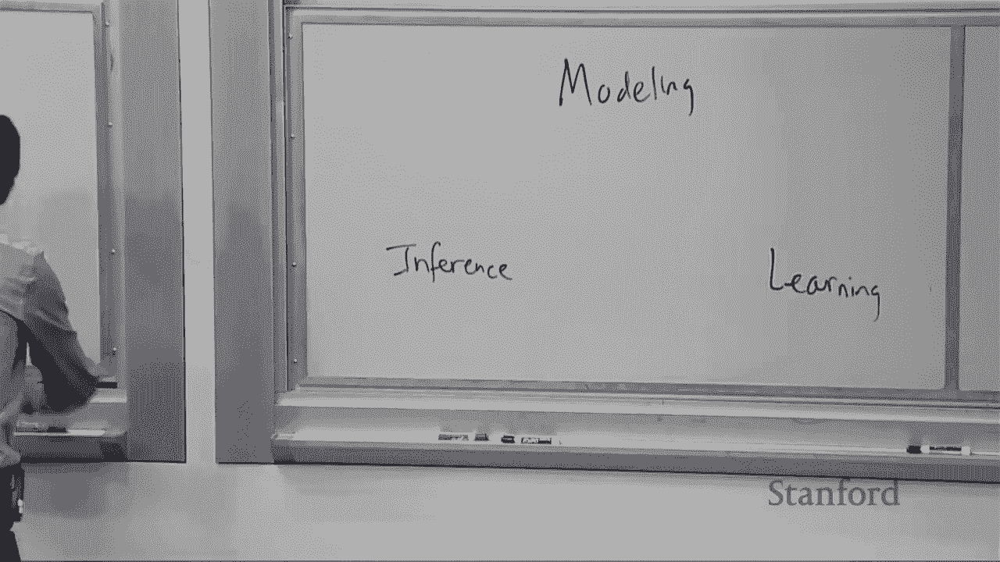
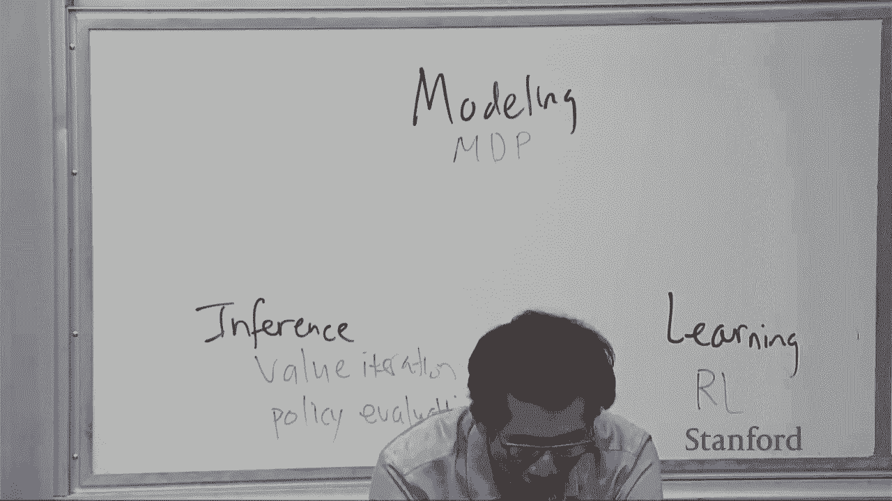
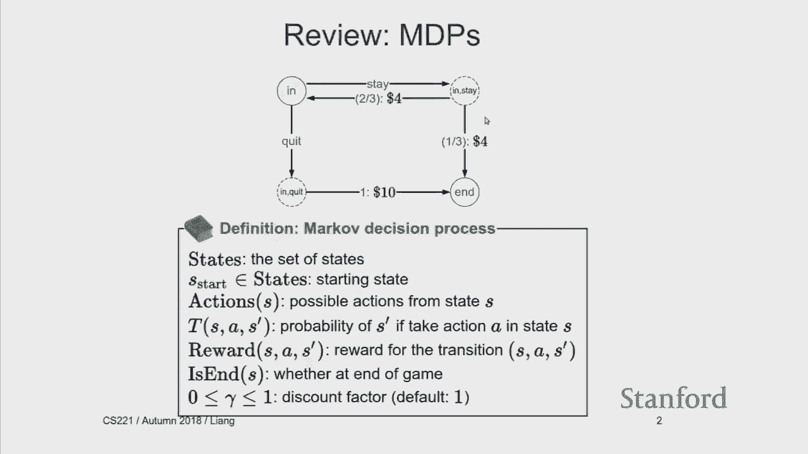
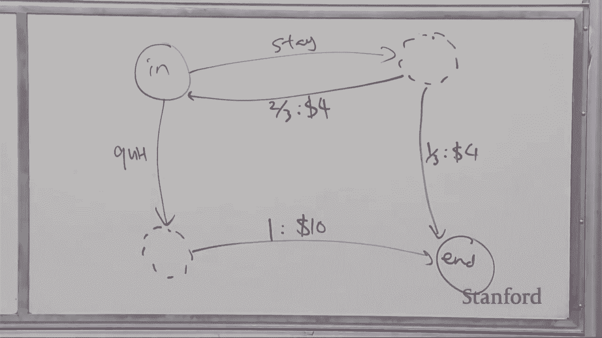

# P8：Lecture 8（给我讲故事看已校对） Markov Decision Processes - Reinforcement Learning - 鬼谷良师 - BV16E411J7AQ

 So this lecture is going to be on reinforcement learning。

 I will in the interest of time skip the quiz。 So the way to think about how reinforcement learning fits into what we've done so far。

 is remember this class has this picture， right？ So we talk about different models and we talk about different algorithms。

 inference algorithms to be able to predict using these models and answer queries。

 And then we have learning， which is how do you actually learn these models， right？

 So every type of model we go through， we have to kind of check the boxes for each of these pieces。

 So last lecture， we talked about Markov decision processes。 This is a kind of a modeling framework。

 it allows you to define models for example， for crossing volcanoes or playing dice games。

 or taking trams。 What about inference？ So what do we have here last time？ We've had value iteration。

 and which allows you to compute the optimal policy and policy evaluation。

 which allows you to estimate the value of a particular policy。

 So these are algorithms that operate on the MDP， and we looked at these algorithms last time。

 So this lecture is going to be about learning。 I'll just put RL for now。 RL is not an algorithm。

 it's a kind of refers to the family of algorithms that fits in this week。

 But that's the way you should think about it。 RL allows you to either explicitly or implicitly estimate MDPs。

 and then once you have that， you can do all these inference algorithms to figure out what the optimal policy is。

 Okay。 So just to review， so what is the MDP？

 The clearest way， remember to think about it， is it's in terms of a graph。

 So you have a set of states。 So in this dice game， we have N and N。 So we have a set of states。

 From every state， you have a set of actions coming out。 So in this case， stay and quit。

 Actions take you to chance nodes， where you don't get to control what happens。

 but nature does and there's randomness。

 So out of these chance nodes are transitions。 Each transition takes you into a state。

 it has some probability associated with it。 So two-thirds in this case。

 It also has some reward associated with it， which you pick up along the way。 So naturally。

 this has to be one-third， four and remember last time this was probability one-ten。 Okay。 So。

 and then there is the discount factor。

 which gamma， which the number between zero and one， tells you how much you value the future。

 For default， you can think about it as one for simplicity。 Okay。

 So this is a Markov decision process。 And what do you do with one of these things？

 We have a notion of a policy and a policy-， let's see， I'll write it over here。

 So a policy denoted pi， let me use green。 So a policy pi is a mapping from states to action。

 It tells you a policy when you apply it， it says when I land here， where should I go？

 Should I do stay or quit？ If I land， well， I mean， this is kind of a simple MVP。 Otherwise。

 usually it would be more states， and for every state， blue circle， it will tell you where to go。

 And when you run a policy， what happens？ You get a path which I'm going to call an episode。

 So what do you do？ You start in state S0， that would be in in this particular example。

 You take an action A1， let's say stay。 You get some reward， in this case it would be four。

 You end up in a new state S1， and suppose you go back to N， and then you take another action。

 maybe it's stay， reward is four again， and so on。 So this sequence is a path or in RL speak。

 it's an episode。 Let's see， so let me erase this comment。 And so this is an episode。

 and until you hit the N state。 And what happens out of the episode， you can look at a utility。

 We're going to denote u， which is the discounted sum of the rewards along the way。

 So if you stayed three times and then went there， you would have a utility of four plus four plus four plus four。

 So that would be 16。 But last lecture， we didn't really work with， the episodes in the utility。

 because we were able to define set of recurrences that， computed the expected utility。

 So remember that we want to， we don't know what's going to happen。 So there's a distribution。

 and in order to optimize something， we have to turn it to a number。 That's what expectation does。

 So there's two concepts that we had from last time。

 One is the value function of a particular policy。 So v pi of s is the expected utility。

 if you follow pi from s。 What does that mean？ That means if you take a particular s， let's take N。

 and I put you there， and you run the policy， so stay and you traverse this graph。

 you will have different utilities coming out， and the average of those is going to be v pi of s。

 Similarly， there's a Q value， expected utility if you first take an action。

 from state s and then follow pi。 So what does that mean？

 That means if I put you on one of these red chance nodes， and you basically play out the game。

 and average the resulting utilities that you get， what number do you get？

 And we saw recurrences that related these two。 So v pi of s is， you recurrence the name of the game。

 is to kind of delegate to some kind of simpler problem。

 So you first look up what you're supposed to do in s。 That's pi s。

 and that takes you to a chance node， which is s comma pi sub s， and then you say， hey。

 how much utility am I going to get from that node？ And similarly， from the chance nodes。

 you have to look at all the possible successors， the probability of going into that successor。

 of the immediate reward that you get along the edge。

 plus the discounted reward of the future when you end up in s prime。 Okay。

 So any questions about this？ This is kind of review of Markov decision processes from last time。

 Okay。 So now we're able to do something different。 Okay。

 So if you say goodbye to the transition and rewards， that's called reinforcement learning。

 So remember Markov decision processes， I give you everything here。

 and you just have to find the optimal policy。 And now I'm going to make life difficult by not even telling you。

 what rewards and what transitions you have to get。 Okay。

 So just to give a kind of flavor of what that's like， let's play a game。

 So I'm going to need a volunteer。 I'll give you the game。

 but this volunteer you have to have a lot of grit and persistence。

 because this is not going to be an easy game。 You have to be one of those people that even though you're losing a lot。

 you're still going to not give up。 Okay。 So here's how the game works。 So for each round。

 R equals one， two， three， four， five， six， and so on， you're just going to choose A or B。

 red pill or blue pill， I guess。 And you move to a new state， so the state is here。

 and you get some rewards， which I'm going to show here。 Okay。 And the state is five comma zero。

 that's the initial state。 Okay。 So everything clear about， the rules of the game？

 That's reinforcing learning。 We don't know anything about how。 Okay。 So any volunteers？

 How about you in the front？ Okay。 >> A。 >> A。 Okay。 Let me， let me click start。 A。 >> It's an MDP。

 so that's a kiss that helps。 >> B。 B。 B。 B。 B。 B。i。 B。 Just can't play like B。

 Because then A I guess。 Like I'm moving point every time。 >> I warned you。 >> A， B。 A。 B。 Okay。

 I'm glad this worked。 Because last time it took a lot longer。 But you know。

 so what did you have to do？ >> I mean you don't know what to try。 So you try A and B。

 And then hopefully you're building， an MDP in your head， right？ >> Yeah。 >> Right。 >> Okay。

 >> Smile or not。 And you have to figure out how the game works。 So maybe you notice that A is。

 you know， decker manning and B is going up。 But then there's this other bit that gets flipped。

 So can you figure this out？ In the process you're also trying to maximize reward。

 Which apparently I guess doesn't come until the very end。 Because it's a cruel game。 Okay。

 So how do we going to algorithm to kind of do this？ And how do we think about a process during this？

 So just to kind of make the contrast between MDPs and reinforcement learning sharper。

 So Markov decision process is an offline thing， right？

 So you already have a mental model of how the world works。 That's the MDP。

 That's all the rewards and the transitions and the states and the actions。

 And you have to find a policy to collect maximum rewards。 You have it all in your head。

 So you just kind of think really hard about， you know， what is the best thing is like， oh。

 if I do this action， then I'll go here and， you know， look at the probabilities。

 take the max or whatever。 So reinforcement learning is very different。

 You don't know how the world works。 So you can't just sit there and think because thinking isn't going to help you figure out。

 how the world works。 So you have to just go out and perform actions in the world， right？

 And in doing so， hopefully you'll learn something， but also your， you'll get some rewards。 Okay。

 so maybe formalize the paradigm of RL。 So you can think about it as an agent that's you。

 And you have the environment， which is everything else。 That's not the agent。

 The agent takes actions。 So the， it sends action to the environment。

 An environment just sends you back rewards and a new state。 And you keep on doing this。

 So what you have to do is figure out， first of all， how am I going to act？

 If I'm in a particular state as t minus one， what action should I choose？ Okay， so that's one。

 one question。 And then you're going to get this reward and observe a new state。 How。

 what should I do to update my mental model of the world？ Okay， so these are the main two questions。

 I'm going to talk first about how to update the parameters。 And then later in the lecture。

 I'm going to come back to how do you actually go and， you know， explore。 Okay。

 so I'm not going to say much here， but， you know， in the context of volcano crossing。

 just to kind of think through things， every time you play the game， right， you're going。

 to get some utility。 So you take a， so this is the episode over here。 So ARS， you're going to。

 sometimes you， you know， fall into a pit， sometimes you go to， a hut。

 And based on these experiences， if I hadn't told you what any of the actions do and what's。

 the sleep probability or anything， how would you kind of go about kind of solving this， problem？

 That's a， that's a question。 Okay， so there's a bunch of algorithms。

 I think there's going to be one， two， three， four， at least four algorithms that we're。

 going to talk about with different characteristics， but they're all going to kind of build onto。

 each other in some way。 So first class of algorithms， Monte Carlo methods， right？ So， okay。

 so when you're， ever you're doing RL or any sort of learning， the first thing。

 you get is you just have data。 Let's suppose that you run even a random policy。

 You're just going to， because in the beginning you don't know any better， so you're just going。

 to try random actions。 And， but in the process you're going to see， hey。

 I tried this action and it led to this， reward and so on。 So in the concrete example。

 just to make things a little more crisp， it's going to look something， like in and then you take。

 you know， you did， let's see， let me try to color coordinate this， a little bit。 So you're in in。

 you do stay and you get a reward of four and then you're back in in。

 you do a stay and then you get four and then maybe you're done， you're out。 Okay。

 so this is an example episode just to make things concrete。 So this is S0， A1， R1， S2， S1。

 incrementing too quickly。 A2， R2， S2。 Okay。 So what should you do here？ All right。 So any ideas？

 Model based Monte Carlo。 So if you have the MDP， you will be done， but we don't have the MDP。

 we have data。 So what can we do？ Yeah。 Yeah， let's try to build an MDP from that data。 Okay。 So。

 T idea is estimated MDP。 So intuitively， we just need to figure out what the transitions and rewards are and then。

 we're done， right？ So how do you do the transitions？ So the transition says。

 if I'm in state S and I take action A， what will happen？ I don't know what will happen。

 but let's see in the data what will happen。 So I can look at the number of times I went into a particular S prime and then divided over。

 a number of times I attempted any， this action from that state at all and just take the ratio。 Okay。

 And for the rewards， this is actually fairly easy because when I observe a reward from S。

 and S prime， I just write it down and say that's the reward。 Okay。 Okay。 So on the concrete example。

 what does this look like？ So remember， now here's the MDP graph。

 I don't know what the transition distribution or the， rewards are。

 So let's suppose I get this trajectory。 What should I do？ So I get stay， stay， stay。

 stay and then I'm out。 Okay。 So first I can write down the rewards of four here and then I can estimate the probability。

 of transitioning。 So three out of four times I went back to N， one out of four times I went to N。

 so I'm， going to estimate this as three fourths one fourths。 Okay。

 But then I suppose I get a new data point。 So I have stay， stay， and so what do I do？

 I can add to these counts。 So everything is kind of cumulative。 So two more times， sorry。

 one more time I went into N and another time I went to N， so this， becomes four out of six。

 two out of six， and suppose I see another time when I just go， into N。

 so I'm just going to increment this counter and now it's three out of seven and， four out of seven。

 Okay。 So pretty simple。 Okay。 So for reasons I'm not going to get into。

 this process actually converges to the， if you， do this kind of a million times。

 you'll get pretty accurate。 Yeah， question。 >> So we're saying here that we don't know the transition of policies and the。

 what， but， do we know the number of states and the actions we can take？ >> Yeah。

 so the question is you don't know the rewards or the transitions， but yes， you。

 do know the set of states and the actions。 Set of states I guess you don't have to know them all in advance。

 but you will just observe， them as they come。 The actions you need to know because you are an agent and you need to play the game。

 Yeah， good question。 Okay， so yeah。 >> Does it work with variable costs like there's a probability or variable rewards rather？

 There's a， there's a probability you get some rewards or probability you get a different， reward。

 >> Yeah， so the question is does this work with variable rewards？

 And if the reward is not a function of the SaaS prime， you would just take the average。

 of the rewards that you see。 Yeah。 Okay。 So， so what do you do with this？

 So after you estimate the MDP， so you know you need a transitions and rewards， then now。

 we have MDP。 It might not be the exact right MDP because this is estimated from data。

 so it's not going， to match it exactly。 But nonetheless， we already have these tools from last time。

 You can do value iteration to compute the optimal policy on it and then you just， you， know。

 you're done。 You run it。 In practice， you are probably kind of interleave the learning and the optimization。

 But for simplicity， we can think about it as a two stage where you gather a bunch of， data。

 you estimate the MDP and then you are off。 Okay。 There's one problem here。

 Does you want to know what the problem might be？ You can actually see it by looking on the slide。

 Yeah。 Well， with your face policy of always staying on leverage floor， the branch of the world？

 Yeah。 Yeah。 You didn't explore this at all。 So you actually don't know how much reward is here。

 Maybe it's like， you know， 100， right？ So， so this is this problem。

 this kind of actually pretty big problem that unless you。

 have a policy that actually goes and covers all the states， you just won't know。 Right？

 And this is kind of natural because there could always be， you know， a lot of reward。

 hiding under kind of one state， but unless you see it， you don't， you just don't know。 Okay。

 So this is a kind of key idea。 The challenge， I would say in reinforced learning is exploration。

 So you need to be able to explore the state space。

 This is different from normal machine learning where data just comes impassively and you learn。

 a nice function and then you're done。 Here you actually have to figure out how to get the data。

 And that's kind of one of the key challenges of RL。 So we're going to go back to this problem。

 And I'm not really going to try to solve it now。 For now。

 you can just think about Pi as a random policy because a random policy eventually， will just。

 you know， hit everything for， you know， finite small state spaces。 Okay。 So， okay。

 So that's basically the end of the first algorithm。 Let me just write this over here。

 So algorithms we have model based Monte Carlo。 And the model base is referring to the fact that we're estimating model in particular。

 to MDP。 The Monte Carlo part is just referring to the fact that we're using samples to estimate。

 a model or you're basically applying the policy multiple times and then estimating the model。

 based on averages。 Okay。 So， so now I'm going to present a different algorithm and it's called model free Monte。

 Carlo。 And you might， from the name guess what we might want to do is maybe we don't have to。

 estimate this model。 Okay。 And why is that？ Well， what do we do with this model？

 What we did was we presumably use value iteration to， you know， compute the optimal policy。

 And remember this recurrence for computing QOP。 It's in terms of T and reward。

 But at the end of the day， all you need is QOP。 If I told you QOP'd essay。

 which is what is QOP'd essay， it's the maximum possible utility。

 I could get if I am in chance node SA and I followed optimal policy。 So clearly if I knew that。

 then I would just produce the optimal policy and I would be， done。 I don't even need to know。

 understand the reward and transitions。 Okay。 So with that insight is model free learning。

 which is that we're just going to try to estimate， QOP'd， you know， directly。

 Sometimes it can be a little bit confusing what is meant by model free。 So QOP'd itself。

 you can think about it as a model。 But in the context of MDPs and reinforced learning。

 generally people when they say model， free refers to the fact that there's no MDP model。

 not that there's no model in general。 Okay。 So， so we're not going to get to QOP'd yet。

 I'll come later in the lecture。 So let's warm up a little bit。 So here's our data staring at us。

 Remember， let's look at a related quantity。 So QPI。 Remember what QPI is。

 QPI of SA is the expected utility if we start at S and you first take action A and then follow。

 policy PI。 Right。 So in， I guess another way to write this is if you are at a particular time step T。

 you can define UT as the discounted sum of the rewards from that point on， which is， you know。

 the reward immediately that you would get plus discounted in the next time， step plus， you know。

 the square discounted in the two time steps in the future and so， on。

 And what you can do is you can try to estimate QPI from this utility。 Right。

 So this is the utility that you get at a particular time step。 So suppose you do the following。

 So suppose you average the utilities that you get only on the time steps where I was。

 in a particular state S and I took an action A。 Okay。 So you have a。

 let's suppose you have a bunch of episodes， right。 So here pictorially， let's see。

 here's another way to think about it。 So I get a bunch of episodes。

 I'm going to do some abstract drawing here。 So every time you have， you know， S A shows up here。

 maybe it shows up here， maybe it shows， up here， maybe it shows up here。

 You're going to look at how much reward did I get from that point on？

 How much reward did I get from here on？ How much reward do I get from here on and average them？

 Right。 So， and there's a kind of a technicality which is that if S A appears here and it also。

 appears after it， then I'm not going to count that because I'm kind of， if I do both， I'm。

 kind of double counting。 In fact， it works both ways but just conceptually it's easier to think about just taking the。

 same， you don't kind of go back to the same position。 Okay， so let's do that on a concrete example。

 So Q pi， let's just write it， Q pi S A is a thing where we're trying to estimate and。

 this is a value associated with every chance node S A。 So in particular， I've drawn it here。

 I need a value here and a value here。 Okay。 So suppose I get some data， I stay and then I get。

 go to the end。 So what's my utility here？ It's not a trick question。 Four。 Four， yes。

 Summer four is four。 Okay， so now I can say okay it's four。 That's my best guess so far。 I mean。

 I haven't seen anything else， maybe it's four。 So what happens if I play the game again and I get four。

 four。 So what's the utility here？ Eight。 So then I update this to the average of four and eight。

 Do it again， I get 16， then I average in the 16。 Okay。 And again。

 I'm using state so I don't learn anything about this in practice。

 You would actually go explore this and figure out how much utility is sitting there。

 So in particular， notice I'm not updating the rewards nor the transitions because I'm， model free。

 I don't care about the queue values that I get， which are the values that sit at the， nodes。

 not on the edges。 Okay， so one caveat is that we are estimating QPy not Qopt。

 We'll revisit this later。 And another thing to kind of note is the difference between what is called on policy。

 and off policy。 Okay。 So in reinforcement learning。

 you're always following some policy to get around the world， right？

 And that's generally called the exploration policy or the control policy。

 And then there's usually some other thing that you're trying to estimate。

 Usually the value of a particular policy and that policy could be the same or could be， different。

 So on policy means that we're estimating the value of the policy that we're following。

 the data-generating policy。 Off policy means that we're not。 Okay？ So in particular。

 is a model free Monte Carlo on policy or off policy？

 It's on policy because I'm estimating QPy not Qopt。 Okay？ That's on policy。 And off policy。

 what about model based Monte Carlo？ I mean， it's a little bit of slightly weird question。

 but in model based Monte Carlo， we're following some policy， maybe even random policy。

 but we're estimating the transition， and rewards。 And from that， we can compute the optimal policy。

 So you can think about it as a off policy， but that's maybe not completely standard。 Okay。

 So any questions about what model free Monte Carlo is doing？ So let me just actually write。

 So what is model based Monte Carlo is doing？ It's trying to estimate the transition and rewards。

 And model free Monte Carlo is trying to estimate the QPy。 Okay？ And just as a note。

 I put hats on any letter that is supposed to be a quantity that's estimated。

 from data and that's what， you know， I guess statisticians do。

 To differentiate them between whenever I QPy， that's the true value of that policy which， you know。

 I don't have。 Okay。 Any questions about model free Monte Carlo？

 Both of these algorithms are pretty simple， right？ You just， you know。

 you look at the data and you take averages。 Yeah？ So model free is not trying to optimize the policy at all。

 You're not making changes to your policy。 So question is model free making changes to a policy or is a fixed policy？

 So this version I've given you is only for a fixed policy。

 The general idea of model free as we'll see later， you can also optimize the policy。 Okay。 So。

 so now what we're going to do is we're going to do them and variations on model free， Monte Carlo。

 Actually， it's going to be the same algorithm but I just want to interpret it in kind of。

 slightly different ways that will help us generalize it in the future。 Yeah？ So。

 are there problems where model free does better than model free？

 Are there certain problems where model free is better than model based？

 So this is actually a really interesting question， right？

 So you can show that if your model is correct， if your model of the world is correct， model。

 base is kind of the way to go because it will be more sample efficient， meaning that you。

 need fewer data points。 But it's really hard to get the model correct in the real world。

 So recently， especially with deep reinforcement learning， people have gone a lot of mileage。

 by just going model free because then jumping ahead a little bit， you can model this as。

 a kind of a deep neural network and that gives you extraordinary flexibility and power without。

 having to solve the hard problem of constructing the MDP。 Okay。 So。

 so there's kind of three ways you can think about this。

 So the first we already talked about it is this average idea。

 So we're just looking at the utilities that you see whenever you counter an SNA， you just。

 average them。 Okay。 So here is an equivalent formulation and the way it works is that for every SAU that you。

 see， so every time you see a particular SAU， SAU， SAU and so on， I'm going to perform。

 the following update。 So I'm going to take my existing value and I'm going to do a。

 what are called a convex， combination。 So， you know， one minus eta and eta sum to one。 So it's。

 you know， kind of balancing between two things， balancing between the old value。

 that I had and the new utility that I saw。 Okay。 And the eta is set to be one over one plus the number of updates。

 Okay。 So let me do a concrete example。 I think it will make this very clear what's going on。

 So suppose my data looks like this。 So I had got four and then a one and a one。

 So these are the utilities， right？ That's a U here。 I'm ignoring the SNA。

 I'm just going to assume that there's something。 Okay。 So first， let's assume that Q pi is zero。

 Okay。 So the first time I do， let's see， number of updates， I haven't done anything。 So it's one。

 one minus zero， so zero times zero plus one times four， which is the first， new that comes in。 Okay。

 So this is four。 Okay。 So then what about the next data point that comes in？

 So I'm going to take one half now times four plus one half times one， which is the new value。

 that comes in。 And that is， I'm going to write it as four plus one over two。 Okay。 So now， okay。

 just to keep track of things。 This results in this， this results in this。 And then now。

 I'm running out of space， but hopefully I can。 So now on the third one， I do two thirds。

 So I have four plus one over two times two thirds plus， actually， I guess I should do two。

 thirds to be consistent。 Two thirds times four plus one over two。

 which is the previous value that's sitting in Q pi， plus one third times one， which is a new value。

 And that gives me four plus one plus one over three。 Right？

 So you can see what's going on here is that， you know， each time I have this， you know。

 sum over all the two is I've seen over the number of times it occurs。

 And this eta is set so that next time I kind of cancel out the old account and I add the。

 new count to the denominator。 And it kind of all works out so that every time step。

 what actually is in Q pi is just， the plane average over all the numbers I've seen before。 Okay。

 This is just kind of algebraic trick to get this original formulation， which is a notion。

 of average， into this formulation， which is a notion of kind of you're trying to take。

 a little bit of the old thing and add a little bit of a new thing。 Okay。

 So I guess I'm going to call this， I guess， combination， I guess。

 So that's the second interpretation。 There's a third interpretation here。

 which you can think about is in terms of stochastic， gradient descent。

 So this is actually a kind of a simple algebraic manipulation。 So if you look at this expression。

 what is this？ So you have 1 times Q pi。 So I'm going to pull it out and put it down here。

 And then I'm going to have minus 8 times Q pi。 That's this thing。 And then I also have a eta u。

 So I'm going to put kind of minus u here。 And this is inside this brand。

 So if you just do the algebra， you can see that these two are equivalent。

 So what's the point of this？ So where have you kind of seen this before？

 Something like maybe not not this exact expression， but something like that。 Any ideas？ Yeah。

 when you looked at stochastic gradient descent in the context of the square loss for。

 linear regression。 Right？ So remember， we had these updates that all looked like kind of prediction minus target。

 which was the residual。 And that was used to kind of update。

 So one way to interpret this is kind of implicitly trying to do stochastic gradient descent on。

 the objective， which is a squared loss on the Q pi value that you're trying to set。 And u。

 which is the new piece of data that you got。 So think about in regression， this is the y。

 This is what the output is。 And this is the model that's trying to predict it and you want those to be close to each other。

 Okay。 Okay。 So those are kind of three views on basically this idea of averaging or incremental updates。

 Okay。 So it will become clear why I did this。 This isn't just to have fun。 Okay。

 So now let's see an example of model free Monte Carlo in action on this volcano game。

 So remember here we have this organic example and I'm going to set the number of episodes。

 to let's say 1000， let's see what happens。 So here， okay。

 So what is this kind of grid like structure， grid of triangles denote？ So this remember is a state。

 This is two comma one。 So what I'm doing here is dividing into four pieces which correspond to the four different。

 actions。 So this triangle is two comma one north。 This triangle is two comma one east and so on。

 Okay。 And the number here is the Q pi value that I'm estimating along the way。 Okay。

 So the policy I'm using is complete random， just move randomly。

 And I run this 1000 times and we see that the average utility is minus 18 which is obviously。

 not great。 Okay。 But this is an estimate of how well the random policy is doing。

 So as advertised random policy you would expect to fall into a volcano quite often。 Okay。

 And you can run this and sometimes you get slightly different results but it's pretty。

 much stable around minus 18。 Okay。 Any questions about this before we move on to different algorithms？

 The model based Monte Carlo we're estimating the MDP， model free Monte Carlo we're just estimating。

 the Q values of a particular policy for now。 Okay。

 So let's revisit what model free Monte Carlo is doing。

 So if you use a policy pi equals state for the dice game， you might get a bunch of different。

 trajectories that come out。 These are possible episodes and each episode you have a utility associated with that。

 And what model free Monte Carlo is doing is it's using these utilities to kind of update。

 towards the update you Q pi。 Right。 So in particular like for example this you're saying okay I'm in the in state and I take。

 an action stay when you know what will happen。 Well in this case I got you know 16 and this case I got 12。

 And notice that there's you know quite a bit of variance。

 So on average this actually does the right thing right。

 So just by definition this is a unbiased you know estimate if you do this a million times。

 in average you're just going to get the right value which is 12 in this case。

 But the variance is huge。 So for example if you only do it a few times you're not going to get 12 you might get something。

 you know slightly related。 So how can we kind of counteract this this variance。

 So the key idea behind what we're going to call bootstrapping is that you know we actually。

 have you know some more information here。 So we have this Q pi that we're estimating along the way。

 Right。 The view is a okay we're trying to estimate Q pi and then we're going to try to basically。

 regress it against you know this data that we're seeing。

 But you know can we actually use Q pi itself to help you reduce the variance。

 So the idea here is I'm going to look at all the cases where I know I started in and I take。

 stay I get a four okay。 So I'm going to say I get a four but then after that point I'm actually just going to substitute。

 this 11 in okay。 This is kind of weird right because normally I would just see okay what would happen but。

 what happens is kind of random on average is going to be right but you know on any given。

 case I'm actually like you know 24 or something。 And the hope here is that by using my current estimate which isn't going to be right because。

 if I were right I would be done but hopefully it's kind of somewhat right and that will。

 you know be you know better than using the kind of the raw rollout value。 Yeah question。

 You would update your current estimate at the end of each episode。

 Yeah so question is would you update the current estimate after each episode。

 Yeah so all these algorithms I haven't been explicit about it is that you see an episode。

 you update after you see it and then you get a new episode and so on。

 Yeah sometimes you would even update before you're done with the episode。

 Okay so let me show this what this algorithm so this is a new algorithm it's called SARS-A。

 Does anyone know why it's called SARS-A？ Oh yeah right so if you look at this it spells SARS-A and that's literally the reason why。

 it's called SARS-A。 So what does this algorithm say？

 So you're in a state S you took action A you got a reward and then you ended up in state。

 S prime and then you took another action A prime。 So for every kind of quintuple that you see you're going to perform this update。

 Okay so what is this update doing？ So this is the convex combination remember that we saw from before where you take part。

 of the old value and then you try to merge in with the new value。

 So what is the new value here this is looking at just the immediate reward not the full。

 utility just immediate reward which is this for here and you're adding the discount which。

 is one for now of your estimate。 And remember what is the estimate trying to do？

 Estimate is trying to be the expectation of rewards that you will get in the future。

 So if this were actually Q-pi not Q-pi hat then this will actually just be strictly you。

 know better because that would be just reducing the variance。

 But you know of course this is not exactly right there is bias so it's 11 not 12 but the。

 hope is that you know this is not you know bias by you know too much。

 Okay so these would be the kind of the values that you would be updating rather than these。

 kind of raw values here。 Okay so just to kind of compare them well okay any questions about what SARS-A is doing。

 before I move on。 So maybe I'll write something to try to be helpful here so Q-pi monofemondicolo estimates。

 Q-pi based on you and SARS-A is still Q-pi hat but it's based on reward plus essentially， Q-pi hat。

 I mean this is not like a valid expression but hopefully it's some symbols that will evoke。

 the right memories。 Okay so let's discuss the differences。

 So whenever people say kind of bootstrapping in the context of reinforcement learning this。

 is kind of what they mean is that instead of using you as a prediction target you're。

 using R plus Q-pi and this is kind of you're pulling up yourself from a bootstraps because。

 you're trying to estimate Q-pi but you don't know Q-pi but you're using Q-pi to estimate， it。

 Okay so U is based on one path in SARS-A you're based on the estimate which is based on all。

 your previous kind of experiences which means that this is unbiased， a monofemondicolo is。

 biased but SARS-A is biased。 Monofemondicolo has large variance。

 SARS-A has you know smaller variance and one I guess。

 a consequence of the way the algorithm set up is that monofemondicolo you have to kind。

 of roll out the entire game。 Basically play the game or the MDP until you reach the terminal state and then you can。

 now you have your U to update whereas SARS-A or any sort of bootstrapping algorithm you。

 can just immediately update because all you need to do is you need to see this like a。

 very local window of S-A-R-S-A and then you can just update and that can happen kind。

 of anywhere you don't have to wait until the very end to get the value。

 So just as a quick sanity check which of the following algorithms allows you to estimate， Q-opt。

 Okay so model based Monte Carlo， model free Monte Carlo or SARS-A。

 Okay so I'll give you maybe 10 seconds to ponder this。 Okay how many of you need more time？

 Okay let's get a report。 I think I didn't reset it from last year so this includes last year's participants。

 So model based Monte Carlo allows you to get Q-opt right because once you have the MDP。

 you can get whatever you want you can get Q-opt。 Model free Monte Carlo estimates Q-pie doesn't estimate Q-opt and SARS-A also estimates Q-pie。

 but doesn't estimate Q-opt。 Okay。 Alright so that's a kind of a problem。

 I mean these algorithms are fine for estimating the value of a policy but you really want the。

 optimal policy。 In fact these can be used to improve the policy as well because you can do something。

 called policy improvement which I didn't talk about。

 Once you have the Q-values you can define the new policy based on the Q-values but there's。

 actually a kind of a more direct way to do this。 Okay so here's the kind of the way mental framework you should have in your head。

 So there's two values Q-pie and Q-opt。 So in MDPs we saw that policy evaluation allows you to get Q-pie。

 value iteration allows you， to get Q-opt and now we're doing reinforcement learning。

 We saw a Model free Monte Carlo and SARS-A allowed you to get Q-pie and now we need， I'm going。

 to show you a new algorithm called Q-learning that allows you to get Q-opt。

 So this gives you Q-opt and it's based on reward plus Q-opt kind of。

 Okay so this is going to be very similar to SARS-A and it's only going to differ by essentially。

 as you might guess the same difference between policy evaluation and value iteration。

 Okay so it's helpful to go back to kind of the MDP recurrences。

 So even though MDP recurrences can only apply when you know the MDP for deriving reinforcement。

 learning algorithms it's， they can kind of give you inspiration for the actual algorithm。

 Okay so remember Q-opt what is Q-opt？ Q-opt is considering all possible successors， the probability。

 immediate reward plus future， returns。 Okay so the Q-learning is it's actually really kind of clever idea and it's。

 it could also， be called SARS， SARS I guess but maybe you don't want to call it that。

 And what it does is as follows。 So this is has the same form。

 the convex combination of the old value and the new value。 So what is the new value？

 So if you look at Q-opt， Q-opt is looking at different successors reward plus V-opt。

 What we're going to do is well we don't have all， we're not going to be able to sum over。

 all successors because we're in our reinforcement learning setting and we only saw one particular。

 successor。 So let's just use X successor。 So on that successor we're going to get the reward。

 So R is a stand-in for the actual reward of， I mean， is the stand-in for the reward that。

 reward function and then you have gamma times and then V-opt I am going to replace it with。

 our estimate of what V-opt is。 And what should the estimate of V-opt be？

 So what relates V-opt to Q-opt？ Yeah？ >> Thank you。 The A that maximizes Q-opt that you use V-opt？

 >> Yeah， exactly。 So if you define V-opt to be the max over all possible actions of Q-opt of S in that particular。

 action， then this is V-opt。 So Q is saying， I'm at a chance node。

 what is optimal utility I can get provided I took， an action。

 Clearly the best thing to do if you're at a state is just choose the action that gives。

 you the maximum of Q value that you get into。 So that's just Q learning。

 So let's put it side by side with Sarsa。 Okay， so Sarsa， these two are very similar。 So Sarsa。

 remember， updates against R plus Q pi。 And now we're updating against R plus this max over Q-opt。

 Okay？ And you can see that Sarsa requires knowing what action I'm going to take next kind of。

 a one step look ahead， A prime and it plugs it into here， whereas Q learning， it doesn't。

 matter what A you took。 Because I'm just going to take the one that maximizes。 Right？

 So you can see why Sarsa is estimating the value of policy because what A prime shows up here。

 is a function of a policy。 And here I'm kind of insulated from that because I'm just taking the maximum overall actions。

 This is the same intuition as for value iteration versus policy evaluation。 Okay。

 I'll pause here any questions， Q learning versus Sarsa。 Is Q learning on policy or off policy？

 It's off policy because I'm following whatever policy I'm following and I get to estimate。

 the value of the optimal policy which is probably not the one I'm following， at least。

 in the beginning。 Okay， so let's look at the example here。

 So here's Sarsa and running for 1000 iterations and like model-free Monte Carlo， this， I'm。

 estimating that the average utility I'm getting is minus 20。 And in particular。

 the values I'm getting are all very negative because this is Q pi。

 This is a policy I'm following which is the random policy。 If I replace this with Q， what happens？

 So first， notice that the average utility is still minus 19 because I actually haven't。

 changed my exploration policy。 I'm still doing random exploration。 Well， yeah。

 I'm still doing random exploration。 But notice that the value， the Q-up values are all around 20。

 And this is because the optimal policy， remember， is just this is a slip probability zero。

 So optimal policy is just to go down here and get your 20。 And Q。

 and I guess it's kind of interesting that Q learning， I'm just blindly following。

 the policy running off the cliff into a volcano all the time， but I'm learning something。

 And I'm learning how to behave optimally even though I'm not behaving optimally。

 And that's the kind of hallmark of off policy learning。 Okay。

 so any questions about these four algorithms？ So model-based Monte Carlo， estimate the MPP。

 model-free Monte Carlo， estimate the Q value， of this policy based on the actual returns that you get。

 the actual sum of the rewards。 Sarsa is bootstrapping。

 estimating the same thing but with kind of a one step look ahead。

 And Q learning is like Sarsa except for estimating the optimal instead of fixed policy pi。 Yeah？

 >> Is Sarsa on policy or on policy？ >> Sarsa is on policy because I'm estimating Q pi。 >> All right。

 Okay， so now let's talk about covering the unknown。 So these are the algorithms。 So at this point。

 if I just hand you some data， if I told you here's a fixed policy， here's some data。

 you can actually estimate all these quantities。 But now there's a question of exploration which we saw was really important because if。

 you don't even see all the states， how can you possibly act optimally？

 So which exploration policy should you use？ So here are kind of two extremes。

 So the first extreme is let's just set the exploration policy。

 So imagine we're doing Q learning now。 So you have this Q opt estimate。 So it's not the true Q opt。

 but you have an estimated Q opt。 So the naive thing to do is just use that Q opt。

 figure out which action is best and， just always do that action。 Okay。

 so what happens when you do this is you don't do very well。 So why don't you do very well？

 Because initially， well， you explore randomly and soon you find the two。 And once you found the two。

 you say， well， two is better than 0， 0， 0。 So I'm just going to keep on going down to two。

 which is all exploitation， no exploration。 Right？ So you don't realize that there's all this other stuff over here。

 So in the other direction， we have no exploitation， all exploration。

 Here you kind of have the opposite set up where I'm running Q learning， right？

 So as I we saw before， I'm actually able to estimate the Q opt values。 So I learn a lot。

 but the average utility， which is the actual utility I'm getting by。

 playing this game is pretty bad。 In pretty good， it's the utility you get from just moving randomly。

 So kind of what you really want to do is balance exploration， exploitation。

 So just kind of a kind of a side or commentary is that I really feel reinforced in learning。

 and kind of captures life pretty well。 Because in life， you don't know what's going on。

 You want to get rewards。 You want to do well， but at the same time。

 you have to kind of learn about how the world， works so that you can kind of improve your policy。

 So if you think about going to restaurants or finding the shortest path， better way to。

 get to school or to work or in research， even when you're trying to figure out a problem。

 you can work on the thing that you know how to do and will definitely work or do you try。

 to do something new in hopes of you learning something， but maybe it won't get you as high， reward。

 So hopefully reinforced modeling is kind of a metaphor for life in many ways。 Okay。

 so back to concrete stuff。 So here is one way you can balance exploration and exploitation。

 So it's called the Epsilon greedy policy。 And this assumes that you're doing something like Q learning。

 so you have these Q up values。 And the idea is that with probability one minus Epsilon。

 where Epsilon is， let's say， like 0。1， you're just going to give exploit。

 You're just going to do give it all you have。 And then once in a while。

 you're just going to do something random。 Okay， so this is actually not a bad policy to act in life。

 So once in a while， maybe you should just do something random and see what happens。

 So if you do this， what do you get？ Okay， so what I've done here is I've set Epsilon to be starting with one。

 So one is all exploration。 And then I'm going to change the value a third of the way into 0。5。

 And then I'm going to， a two thirds of the way I'm going to change it to zero。 Okay。

 So if I do this， then I actually estimate the values really， really well。 And also I get utility。

 which is pretty good， 32。 Okay。 And this is also kind of something that happens as you get older。

 you tend to explore less， and exploit more。 It just happens。 Okay。 All right。

 so that was exploration。 So let's put some stuff on the board here。 Do I need this anymore？

 Maybe I need this。 Okay。 So covering the unknown。 So we talked about exploration。 Epsilon greedy。

 And there's other ways to do this。 Epsilon greedy is just kind of the simplest thing that actually works remarkably well。

 even in a state of our systems。 So the other problem now I'm going to talk about is generalization。

 So remember when we said exploration， well， if you don't see a particular state， then。

 you don't know what to do with this。 I mean， think about it for a moment。

 That's kind of unreasonable because you're in life。

 You're never going to be in the exact same situation。 And yet we need to be able to act properly。

 right？ So general problem is at a state space that you might deal with in a kind of a real world。

 situation is enormous。 And there's no way you're going to go track down every possible state。 Okay。

 So this state space is actually not that enormous， but this is the biggest state space I could。

 draw on the screen。 And you can see that the average utility is pretty bad here。 Okay。

 So what can we do about this？ So I guess let's talk about a large state space。

 So this is the problem。 So now this is where the third interpretation of model free model color will come in handy。

 So let's take a look at Q learning。 So in the context of SGD， it looks like this， right？

 So it's kind of a gradient step where you take the old value and you minus eta and something。

 that kind of looks like it could be a gradient， which is the residual here。

 So one thing to note is that under the kind of formulations of a Q learning that I've talked。

 about so far， this is what we call kind of road learning， right？ Which， if we were two weeks ago。

 we would have said this is kind of ridiculous because。

 it's not really learning or generalizing at all。 Right now it's basically for every single state in action。

 I have a value。 If I have a different state in action， completely different value。

 There's no kind of sharing of information。 And naturally if I do that。

 I can't generalize between states and actions。 Okay。

 so here's the key idea that will allow us to actually overcome this。

 So it's called function approximation in the context of reinforcement learning。

 In normal machine learning， it's just called normal machine learning。 So the way it works is this。

 so we're going to define this Q opt SA。 It's not going to be a lookup table。

 It's going to depend on some parameters here， W。 And I'm going to define this function to be W。

FEE SA。 Okay， so I'm going to define this feature vector， very similar to how we did in the。

 machine learning section， except for instead of SA， we had X。

 And now the weights are going to be kind of the same。 Okay， so what kind of features might you have？

 You might have， for example， features on actions。 So these are indicator features that say， hey。

 maybe it's better to go east than to go， west or maybe it's better to be in the fifth row or it's good to be in a six column and。

 you know， things like that。 So you have a smaller set of features and you try to use that to kind of generalize across。

 all the different states that you might see。 So what this looks like is now with the features is actually the same as before。

 except for， now we have something that really looks like the machine learning lectures is that you。

 take your weight vector and you do an update of the residual times the feature vector。 Okay。

 so how many of you， this looks familiar from linear regression？ Okay， all right， so just a contrast。

 So before we were just updating the QOPT values， the residual is exactly the same and there's。

 nothing over here。 And now what we're doing is we're updating not the Q values。

 we're updating the weights。 The residual is the same and the thing that connects the Q values with the residual with。

 the weights is the kind of the feature vector。 Okay， as a sanity check， this has the same dimension。

 This is a vector， this is a scalar， this is a vector which has the same dimensionality， as W。 Okay。

 and if you want to derive this， you can actually think about the implied objective。

 function as simply linear regression。 You have a model that's trying to predict a value from an input。

 S A。 So S A is like X， and QOPT is like kind of Y。 And then you're， sorry。

 this target is like the Y that you're， trying to predict and you're just trying to make this prediction close to the target。

 Yeah， question。 Is the A to the same A that we have before or now when we set it like the burning？

 Yeah， so good question。 So what is this A to the L？ Is it the same as before or is it new？

 So when we first started talking about these algorithms， right， A to it was supposed to。

 be one over the number of updates and so on。 But once you get it into the SGD form like this。

 then now this just behaves as a step， size and you can tune it to your heart's content。 All right。

 so that's all I'll say about these two challenges。 One is how do you do exploration？

 You can use epsilon greedy， which allows you to kind of balance exploration with exploitation。

 And then the second thing is that for large state spaces， epsilon greedy isn't going to。

 cut it because you're not going to see all the states， even if you try really hard。

 And you need something like function approximation to tell you about new states that you fundamentally。

 haven't seen before。 Okay， so some reason so far， online learning， we're in the online setting。

 This is the game of reinforcement learning。 You have to learn and take actions in real world。

 One of the key challenges is this exploration and exploitation trade off。 We saw four algorithms。

 There's kind of two key ideas here。 One is Monte Carlo， which is that from data alone。

 you can basically use averages to estimate， quantities that you care about， for example。

 transitions， rewards， and Q values。 And the second key idea is this bootstrapping which shows up in SARS-2 and Q learning。

 which， is that you're updating towards a target that depends on your estimate of what you're trying。

 to predict， not just the kind of raw data that you see。 Okay。

 so now I'm going to maybe step back a little bit and talk about reinforcement learning。

 and the context of some kind of other things。 So there's kind of two things that happen when we went from binary classification。

 which， was two weeks ago， to reinforcement learning now。

 And it's worth kind of decoupling these two things。 One is state and one is feedback。

 So the idea about partial feedback is that you can only learn about actions you take。 I mean。

 this is kind of obvious in reinforcement learning。 If you don't quit in this game。

 you never know how much money you'll get。 And the other idea is the notion of state。

 which is that you reward depend on previous， actions。 So if you're going through a volcano。

 you have to， there's a kind of a different situation， depending on where you are in the map。

 And there's actually kind of， so this is kind of a， you can draw a two by two grid where。

 you go from supervised learning， which is stateless and full feedback。 So there's no state。

 Every iteration， you just get a new example。 And that doesn't have， you know。

 there's no dependency in terms of prediction on the， previous examples。 And full feedback。

 because in supervised learning you're told which is the correct label。 Even if there might be。

 you know， a thousand labels， for example， in image classification。

 you're just told which one's the correct label。 And now in real-ferencing learning。

 both of those are made harder。 There's two other interesting points。

 So what is called multi-arm bandits is kind of a， you can think about it as a warm up to。

 reinforce for learning where there's partial feedback， but there's no state， which makes， it easier。

 And there's also， you can get full feedback， but there's state， so in structure prediction。

 for example， in machine translation you're told what the translation output should be。

 but clearly do actions depend on previous actions because， you know， you can't just translate。

 words in isolation essentially。 Okay， so one of the things I would just mention very briefly is。

 you know， this deep reinforcement， learning has been， you know， very popular in recent years。

 So reinforcement learning， there was kind of a lot of interest in the kind of '90s where。

 a lot of the algorithms were kind of in theory， which was kind of developed。

 And then there was a period where kind of not as much happened。 And since， I guess。

 2013 there's been a revival of reinforcement research， a lot of it's due， to， I guess。

 at the D-mind where they published a paper showing how they can do， I use raw。

 reinforcement learning to play Atari。 So this will be talked about more in a section this Friday。

 But the basic idea of deep reinforcement learning， just to kind of demystify things， is that。

 you're using a neural network for QOPT， essentially that's what it is。

 And there's also a lot of tricks to make this kind of work which are necessary when。

 you're dealing with enormous state spaces。 So one of the things that's different about deep reinforcement learning is that people。

 are much more ambitious about handling problems where the state spaces are kind of enormous。

 So for this， the state is just the pixels， right， so there's a huge number of pixels。

 And whereas before people were kind of in， what is known as a tabular case， which there's。

 the number of states you can kind of enumerate。 So there's a lot of kind of details here to care about。

 One general comment is that reinforcement learning is really hard because of the state。

fulness and also the delayed feedback。 So just when you're maybe thinking about final projects。

 I mean it's a really cool， area but don't underestimate how much work and compute you need to do。

 Some other things I won't have the time to talk about is so far we've talked about methods。

 that try to estimate the Q function。 There's also a way to even do without the Q function and just try to estimate the policy。

 directly that's called methods like policy gradient。

 There's also methods like extracritic that try to combine these value based methods and。

 policy based methods。 These are used in deep minds， you know， AlphaGo and AlphaZero programs for。

 you know， crushing， humans at Go。 This actually will be deferred to next week's section because this is in the context of。

 games。 There's a bunch of other applications， you know， you can fly helicopters， play backgammon。

 This is actually one of the early examples。 TD gamma was one of the early examples in the early 90s on kind of one of the success。

 stories of using reinforcement learning in particular， you know， self play。 For non-games， you know。

 reinforced learning can be used to kind of do evidence scheduling。

 and managing data centers and so on。 Okay， so that concludes the section on Markov decision processes which we。

 the idea is that， we are playing against nature。 So nature is kind of random but， you know。

 kind of neutral。 Next time we're going to play against an opponent where they're out to get us。

 So we'll see about that。 [ Pause ]。

 So this lecture is going to be on reinforcement learning。

 I will in the interest of time skip the quiz。 So the way to think about how reinforcement learning fits into what we've done so far。

 is remember this class has this picture， right？ So we talk about different models and we talk about different algorithms。

 inference algorithms， to be able to predict using these models and answer queries and then we have learning。

 which is how do you actually learn these models， right？ So every type of model we go through。

 we have to kind of check the boxes for each of， these pieces。 So last lecture。

 we talked about Markov decision processes。 This is kind of a modeling framework that allows you to define models。

 for example， for crossing， volcanoes or playing dice games or taking trams。 What about inference？

 So what do we have here last time？ We had value iteration which allows you to compute the optimal policy and policy evaluation。

 which allows you to estimate the value of a particular policy。

 So these are algorithms that operate on an MDP， right？ And we looked at these algorithms last time。

 So this lecture is going to be about learning。 I'll just put RL for now。 RL is not an algorithm。

 It's a kind of a refers to the family of algorithms that fits in this week。

 But that's the way you should think about it。 RL allows you to either explicitly or implicitly estimate MDPs and then once you have that。

 you can do all these inference algorithms to figure out what the optimal policy is。 Okay？

 So just to review， so what is an MDP？ The clearest way。

 remember to think about it is it's in terms of a graph。 So you have a set of states。

 So in this dice game we have N and N。 So we have a set of states。

 From every state you have a set of actions coming out。 So in this case stay and quit。

 Actions take you to chance nodes where you don't get to control what happens but nature。

 does and there's randomness。 So out of these chance nodes are transitions。

 Each transition takes you into a state。 It has some probability associated with it。

 So two thirds in this case。 It also has some reward associated with it which you pick up along the way。

 So naturally this has to be one third four and remember last time this was probability， one ten。

 So and then there is the discount factor which gamma which is the number between zero and。

 one tells you how much you value the future。 For default you can think about it as one for simplicity。

 Okay so this is a Markov decision process。 And what do you do with one of these things？

 We have a notion of a policy and a policy。 Let's see I'll write it over here。

 So a policy denoted pi。 Let me use screen。 So a policy pi is a mapping from states to action。

 It tells you a policy when you apply it says when I land here where should I go？

 Should I do stay or quit？ If I land well I mean this is kind of a simple MVP。

 Otherwise usually it would be more states and for every state blue circle it would tell。

 you where to go。 And when you run a policy what happens？

 You get a path which I'm going to call an episode。 So what do you do？

 You start in state S0 that would be in in this particular example。

 You take an action A1 let's say stay。 You get some reward in this case it would be four。

 You end up in a new state S1 and suppose you go back to N and then you take another action。

 maybe it's stay reward is for again and so on。 So this sequence is a path or in RL speak it's an episode。

 So let me erase this comment。 So this is an episode。

 And until you hit the N state and what happens out of the episode you can look at a utility。

 we're going to denote you which is the discounted sum of the rewards along the way。

 So if you stayed three times and then went there you would have a utility of four plus。

 four plus four plus four so that would be 16。 So last lecture we didn't really work with the episodes in the utility because we were。

 able to define set of recurrences that computed the expected utility。

 So remember that we want to you know we don't know what's going to happen so there's a distribution。

 and in order to optimize something we have to turn it to a number that's what expectation， does。

 So there's two concepts that we had from last time。

 One is the value function of a particular policy。 So v pi of s is the expected utility if you follow pi from s。

 What does that mean？ That means if you take a particular s let's take in and I put you there and you run the。

 policy so stay and you traverse this graph you will have different utilities coming out。

 and the average of those is going to be v pi of s。

 Similarly there's a Q value expected utility if you first take an action from state s and。

 then follow pi。 So what does that mean？ That means if I put you on one of these red chance nodes and you basically play out the。

 game and average the resulting utilities that you get what number do you get。

 And we saw recurrences that related these two so v pi of s is you recurrence the name of。

 the game is to kind of delegate to some kind of simpler problem so you first look up what。

 you're supposed to do in s that's pi s and that takes you to a chance node which is s。

 pi s of s and then you say hey how much utility am I going to get from that node。

 And similarly from the chance nodes you have to look at all the possible successors the。

 probability of going into that successor of the immediate reward that you get along the。

 edge plus the discounted reward of the kind of the future when you end up in s prime。 Okay。

 So any questions about this this is kind of review of Markov decision processes from last， time。

 Okay。 So now we're about to do something different。 Okay。

 So if you say goodbye to the transition and rewards that's called reinforcement learning。

 So remember Markov decision processes I give you everything here and you just have to find。

 the optimal policy。 Now I'm going to make life difficult by not even telling you what rewards and what transitions。

 you have to get。 Okay so just to give a kind of flavor of what that's like let's play a game。

 So I'm going to need a volunteer I'll give you the game but this volunteer you have to。

 have a lot of grit and persistence because this is not going to be an easy game。

 You have to be one of those people that even though you're losing a lot you're still going。

 to not give up。 Okay so here's how the game works。 So for each round R equals one， two， three， four。

 five， six and so on you're just going， to choose A or B red pill or blue pill I guess and you move to a new state so the state is。

 here and you get some rewards which I'm going to show here。 Okay。

 And the state is five comma zero that's the initial state。

 Okay so everything clear about the rules of the game？

 That's reinforcing learning right we don't know anything about how。

 Okay so any volunteers how about you in the front？ Okay。 Okay let me start。

 It's an MDP so in that case that helps。 B， B， B， B， B just get rid of B。 I warn you。

 Okay I'm glad this worked because last time it took a lot longer。

 But you know so so what did you have to do？ I mean you don't know what to try so you try A and B and then hopefully you're building。

 an MDP in your your head right？ Yeah right okay just smile a nod and you have to figure out how the game works right。

 so maybe you notice that hey A is you know decker manning and B is going up but then。

 there's this other bit that gets flipped so can you figure this out in a process you're。

 also trying to maximize reward which apparently I guess wasn't it doesn't come until the very。

 end because it's a cruel game。 Okay so how do we gonna algorithm to kind of do this and how do we think about process。

 during this so just to kind of make the contrast between MDPs and reinforcement learning sharper。

 so Markov decision process is an offline thing right so you already have a mental model of。

 how the work world works that's the MDP that's all the rewards in the transitions and the。

 states and the actions and you have to find a policy to collect maximum rewards you have。

 it all in your head so you just kind of think really hard about you know what is the best。

 thing is like oh if I do this action and I'll go here and you know look at the probabilities。

 take the max or whatever so reinforcement learning is very different you don't know how the。

 world works so you can't just sit there and think because thinking isn't going to help。

 you figure out how the world works so you have to just go out and perform actions in。

 the world right and in doing so you hopefully you'll learn something but also you're you'll。

 get some rewards。 Okay so maybe formalize the paradigm of RL so you can think about as an agent that's you。

 and you have the environment which is everything else that's not the agent the agent takes。

 actions so that sends action to the environment an environment just sends you back rewards。

 and a new state and you keep on doing this so what you have to do is figure out first。

 of all how am I going to act if I'm in a particular state as T minus one what action。

 should I choose okay so that's one one question and then you're going to get this reward and。

 observe a new state how what should I do to update my mental model of the world okay。

 so these are the main two questions I'm going to talk first about how to update the parameters。

 and then later in the lecture I'm going to come back to how do you actually go and you。

 know explore okay so I'm not going to say much here but you know in the context of volcano。

 crossing just to kind of think through things every time you play the game right you're going。

 to get some utility so you take of so this is the episode over here so ARS you're going。

 to sometimes you you know fall into a pit sometimes you go to a hut and based on these。

 experiences if I didn't hadn't told you what any of the actions do and what's the。

 possibility or anything how would you kind of go about just kind of solving this problem。

 that's a that's a question okay so there's a bunch of algorithms I think there's going。

 to be one two three four at least four algorithms that we're going to talk about with different。

 characteristics but they're all going to kind of build on to each other in some way so。

 the first class of algorithms Monte Carlo methods right so okay so when you're ever you're doing。

 RL or any sort of learning the first thing you get is you just have data let's let's。

 suppose that you run even a random policies you're just gonna because in the beginning you。

 don't know any better so you're just going to try random actions and but in the process。

 you're going to see hey I tried this action and it led to this reward and so on so in the。

 concrete example just to make things a former crisp it's going to look something like in。

 and then you take you know you did let's see let me try to color coordinate this with。

 a bit so you're in in you do stay and you get a reward of four and then you're back in。

 you do a stay and then you get four and then maybe you're done you're out okay so this。

 is an example episode just to make things concrete so this is S0 a1 R1 S2 S1 incrementing。

 into quickly a to R2 S2 okay okay so what should you do here all right so any ideas model。

 based Monte Carlo so if you have the MDP you will be done but we don't have the MDP we。

 have data so what can we do yeah yeah let's try to build an MDP from that data okay so。

 as the idea is estimated MDP so intuitively we just need to figure out what the transitions。

 and rewards are and we're done right so how do you do the transitions so the transition。

 says if I'm in state as and I take action a what will happen I don't know what will happen。

 but let's see in the data what happened so I can look at the number of times I went into。

 a particular S prime and then divided over a number of times I attempted any this action。

 from that state at all and just take the ratio okay and for the rewards this is actually。

 fairly you know easy when I because when I observe a reward from S a and S prime I just。

 write it down and say that's the reward okay okay so on the concrete example what does this。

 look like so remember now here's the MDP graph I don't know what the transition distribution。

 or the rewards are so let's suppose I get this trajectory what should I do so I get stay。

 stay stay stay and then out okay so first I can write down the rewards of four here and。

 then I can estimate the probability of you know transitioning so three out of four times。

 I went back to in one of four times I went to end so I'm gonna estimate this is three fourths。

 one fourths okay but then I suppose I get a new data point so I have stay stay and so。

 what do I do I can add to these counts so everything is kind of cumulative so two more。

 times or sorry one more time I went into in and another time I went to end so this becomes。

 four out of six two out of six and suppose I see another time when I just go into end。

 so I'm just gonna increment this counter and now it's three out of seven and four out。

 of seven okay so pretty pretty simple okay so for reasons I'm not gonna get into this。

 process actually you know converges to the if you do this kind of you know a million times。

 you'll get pretty accurate yeah question here that we don't know the transition of。

 qualities and what but do we know the number of states and the actions we can take yeah so。

 question is you don't know the rewards or the transitions but yes you do know the set。

 of states and the actions set of states I guess you don't know have to know them all。

 in advance but you will just observe them as they come the actions you need to know because。

 you are an agent and you need a later game yeah good question okay so yeah this is the。

 work with variable costs like there's a probability or variable rewards rather there's a probability。

 you get some reward there's a probability you get a different one yeah so the question。

 is does this work with variable rewards and if the reward is not a function of SAS prime。

 you would just take the average of the rewards that you see yeah okay so so what do you do。

 with this so after you estimate the MDP so you all you need is the transitions and rewards。

 then now we have MDP it might not be the exact right MDP because this is estimated from data。

 so it's not going to match it exactly but nonetheless we already have these tools from。

 last time you can do value iteration to compute the optimal policy on it and then you just。

 you know you're done you run it。 In practice you are probably kind of interleave the learning and the optimization but for simplicity。

 we can think about it as a two stage where you gather a bunch of data you estimate the。

 MDP and then you are off。 Okay there's one problem here does you want to know what the problem might be you can actually。

 see it by looking on the slide yeah。 Well with your base policy of always staying on leverage for the brand of the world。

 Yeah yeah you didn't explore this at all so you actually don't know how much reward is。

 here maybe it's like you know a hundred right so so this is this this problem this kind of。

 actually pretty big problem that unless you have a policy that actually goes and covers。

 all the the states you just won't know right and this is kind of natural because there。

 can always be you know a lot of reward hiding under kind of one state but unless you see。

 it you don't you just don't know。 Okay so this is a kind of key idea。

 The challenge I would say in reinforced learning is exploration so you need to be able to explore。

 the state space this is different from normal machine learning where data just comes impassively。

 and you learn a nice function and then you're done here you actually have to figure out how。

 to get the data and that's that's kind of one of the key challenges of RL。

 So we're going to go back to this this problem and I'm not really going to try to solve it， now。

 For now you can just think about pie as a random policy because random policy eventually。

 will just you know hit everything for you know finite small state spaces。

 Okay so okay so that's basically the end of the first algorithm。

 Let me just write this over here so algorithms we have model based Monte Carlo and the model。

 based is referring to the fact that we're estimating model in particular to MDP。

 The Monte Carlo part is just referring to the fact that we're using samples to estimate。

 a model or you're basically applying the policy multiple times and then estimating the model。

 based on averages。 Okay so now I'm going to present a different algorithm and it's called model free Monte。

 Carlo and you might from the name guess what we might want to do is maybe we don't have。

 to estimate this model。 And why is that？ Well what do we do with this model？

 What we did was we you know presumably use value iteration to you know compute the optimal。

 policy and remember this recurrence for computing QOP。

 It's in terms of T and reward but at the end of the day all you need is QOPT。

 If I told you QOPT essay which is what is QOPT essay it's the maximum possible utility。

 I could get if I am in chance node essay and I followed often policy。

 So clearly if I knew that then I would just produce the often policy and I would be done。

 I don't even need to know understand the reward and transitions。

 Okay so with that insight is model free learning which is that we're just going to try to。

 estimate QOPT you know directly。 Sometimes it can be a little bit confusing what is meant by model free。

 So QOPT itself you can think about it as a model but in the context of MDPs and reinforcement。

 learning generally people when they say model free refers to the fact that there's no MDP。

 model not that there is no model in general。 Okay so we're not going to get to QOPT yet。

 I'll come later in the lecture。 So let's warm up a little bit。 So here's our data staring at us。

 Remember let's look at a related quantity so QOPI remember what QOPI is。

 QOPI of essay is the expected utility if we start at S and you first take action A and。

 then follow policy pi。 So in I guess another way to write this is if you are at a particular time step T you。

 can define UT as the discounted sum of the rewards from that point on which is you know。

 the reward immediately that you would get plus discounted in the next time step plus。

 a square discounted in the two time steps in the future and so on。

 And what you can do is you can try to estimate QOPI from this utility。

 So this is the utility that you get at a particular time step so suppose you do the following。

 So suppose you average the utilities that you get only on the time steps where I was。

 in a particular state S and I took an action A。 So you have a let's suppose you have a bunch of episodes right so here pictorially let's。

 see here's another way to think about it。 So I get a bunch of episodes I'm going to do some abstract drawing here。

 So every time you have you know essay shows up here maybe it shows up here maybe it shows。

 up here maybe it shows up here。 You're going to look at how much reward did I get from that point on how much reward。

 I get from here on how much reward do I get from here on and average them right so and。

 there's a kind of a technicality which is that if essay appears here and it also appears。

 after it then I'm not going to count that because I'm kind of if I do both I'm kind。

 of double counting。 In fact it works both ways but just conceptually it's easier to think about just taking the。

 same kind of essay if the same you don't kind of go back to the same position。

 Okay so let's do that on a concrete example。 So Q pi let's just write it Q pi S A is a thing where we're trying to estimate and this。

 is a value associated with every chance node essay so in particular I've drawn it here I。

 need a value here and a value here。 So suppose I get some data I stay and then I get go to the end。

 So what's my utility here？ It's not a trick question。 Four yes。 Summer four is four。

 Okay so now I can say okay it's four that's my best guess so far I mean I haven't seen。

 anything else maybe it's four。 So what happens if I play the game again and I get four four so what's the utility here？

 Eight。 So then I update this to the average of four and eight。

 Do it again I get sixteen then I average in the sixteen。

 Okay and again you know I'm using states so I don't learn anything about this in practice。

 you would actually go explore this and figure out how much utility is sitting there。

 So in particular notice I'm not updating the rewards nor the transitions because I'm model。

 free I just care about the queue values that I get which are the values that sit at the。

 notes not on the edges。 Okay so one caveat is that we are estimating QPy not Qopt we'll revisit this later。

 And another thing to kind of note is the difference between what is called on policy。

 and off policy。 Okay so in reinforcement learning you're always following some policy to get around。

 the world right and that's generally called the exploration policy or the control policy。

 and then there's usually some other thing that you're trying to estimate usually the。

 value of a particular policy and that policy could be the same or could be different。

 So on policy means that we're estimating the value of the policy that we're following。

 the data-generating policy。 Off policy means that we're not。

 So in particular is a model free Monte Carlo on policy or off policy。

 It's on policy because I'm estimating QPy not Qopt。 Okay that's on policy。

 And off policy what about model based Monte Carlo？

 I mean it's a little bit of slightly weird question but in model based Monte Carlo we're。

 following some policy maybe even random policy but we're estimating the transitions and rewards。

 and from that we can compute the optimal policy。 So you can think about it as a off policy but that's maybe not completely standard。

 Okay so any questions about what model free Monte Carlo is doing？ So let me just actually write。

 so what is model based Monte Carlo is doing？ It's trying to estimate the transition and rewards and model free Monte Carlo is trying。

 to estimate the QPy。 And just as a note I put hat on any letter that is supposed to be a quantity that's estimated。

 from data and that's what I guess statisticians do。

 To differentiate them between whenever I QPy that's the true value of that policy which。

 no I don't have。 Any questions about model free Monte Carlo？

 Both of these algorithms are pretty simple right？ You just look at the data and you take averages。

 Yeah。 So model free is not trying to optimize the policy at all you're not making change to。

 your policy。 So question is model free making changes to a policy or is a fixed policy？

 So this version I've given you is only for a fixed policy。

 The general idea of model free as we'll see later you can also optimize the policy。

 Okay so now what we're going to do is we're going to do them and variations on model free。

 Monte Carlo。 Actually it's going to be the same algorithm but I just want to interpret it in kind of。

 slightly different ways that will help us generalize it in the future。

 Are there certain problems where model free does better than model based？

 Are there certain problems where model free is better than model based？

 So this is actually a really interesting question right？

 So you can show that if your model is correct if your model of the world is correct model。

 base is kind of the way to go because it will be more sample efficient meaning that you need。

 fewer data points。 But it's really hard to get the model correct in the real world。

 So recently especially with deep reinforcement learning people have gone a lot of mileage by。

 just going model free because then jumping ahead a little bit you can model this as a。

 kind of a deep neural network and that gives you an extraordinarily flexibility and power。

 without having to solve the hard problem of constructing the MDP。

 Okay so there's kind of three ways you can think about this。

 So the first we already talked about it is this average idea。

 So we're just looking at the utilities that you see whenever you counter an SNA and you。

 just average them。 Okay so here is an equivalent formulation and the way it works is that for every SAU that。

 you see。 So every time you see a particular SAU， SAU。

 SAU and so on I'm going to perform the following， update。

 So I'm going to take my existing value and I'm going to do what we call a convex combination。

 So you know 1-8 and 8-1 so it's kind of balancing between two things， balancing between the old。

 value that I had and the new utility that I saw。 Okay and the data is set to be 1/1 plus the number of updates。

 Okay so let me do a concrete example I think it will make this very clear what's going， on。

 So suppose my data looks like this so I had got 4 and then a 1 and a 1。

 So these are the utilities right that's a U here。 I'm ignoring the SNA I'm just going to assume that there's something。

 Okay so first let's assume that Q pi is 0。 Okay so the first time I do let's see number of updates I haven't done anything so it's。

 1-0 so 0 times 0 plus 1 times 4 which is the first U that comes in。 Okay so this is 4。

 Okay so then what about the next data point that comes in。

 So I'm going to take 1/2 now times 4 plus 1/2 times 1 which is the new value that comes。

 in and that is I'm going to write it as 4 plus 1 over 2。

 Okay so now okay just to keep track of things this results in this this results in this。

 and then now running out of space but hopefully it can。

 So now on the third one I do 2/3 so I have 4 plus 1 over 2 times 2/3 plus actually I guess。

 I should do 2/3 to be consistent 2/3 times 4 plus 1 over 2 which is the previous value。

 that's sitting in Q pi plus 1/3 times 1 which is a new value and that gives me 4 plus 1。

 plus 1 over 3。 So you can see what's going on here is that each time I have this sum over all the 2 that。

 I've seen over the number of times it occurs and this eta is set so that next time I kind。

 of cancel out the old account and I add the new count to the dominator and it kind of。

 all works out so that at every time step what actually is in Q pi is just the plane。

 average over all the numbers I've seen before。 Okay this is just kind of algebraic trick to get this original formulation which is a。

 notion of average into this formulation which is a notion of kind of you trying to take a。

 little bit of the old thing and add a little bit of a new thing。

 Okay so I guess I'm going to call this I guess combination I guess so that's the second。

 interpretation。 There's a third interpretation here which you can think about is in terms of stochastic。

 gradient descent so this is actually a kind of a simple algebraic manipulation so if you。

 look at this expression what is this so you have 1 times Q pi so I'm going to pull it。

 out and put it down here and then I'm going to have minus 8 times Q pi that's this thing。

 and then I also have a u so I'm going to put kind of minus u here and this is inside this。

 friend so if you just you know do the algebra you can see that these two are equivalent。

 So what's the point of this right so where have you kind of seen this before？

 Like maybe not not this exact expression but something like that。 Any ideas？

 Yeah when you looked at stochastic gradient descent in the context of the square loss for。

 linear regression right so remember we had these updates that all looked like kind of。

 prediction minus target which was you know the residual and that was used to kind of update。

 So one way to interpret this is this is kind of implicitly trying to do stochastic gradient。

 descent on the objective which is a squared loss on the Q pi value that you're trying。

 to set and u which is the new piece of data that you got。

 So think about in regression this is the y this is the y you know what the output is and。

 you this is the model that's trying to predict it and you want those to be close to each other。

 So those are kind of three views on basically this idea of averaging or incremental updates。

 So it will become clear why I did this isn't just to have fun。

 So now let's see an example of model free Monte Carlo in action on this volcano game。

 So remember here we have this you know kinetic example and I'm going to set the number of。

 episodes to let's say a thousand let's see what happens。

 So here okay so what is this kind of a grid like structure grid triangles denote。

 So this remember is a state this is two comma one。

 So what I'm doing here is dividing into four pieces which correspond to the four different。

 actions so this triangle is two comma one north this triangle is two comma one east and， so on。

 Okay so and the number here is the Q pi value that I'm estimating along the way。

 So the policy I'm using is complete random just move randomly and I run this a thousand。

 times and we see that the average utility is you know minus 18 which is obviously not， great okay。

 But this is an estimate of how well the random policy is doing so you know as advertised you。

 would expect to fall into a volcano quite often。 And you can run this and sometimes you get slightly different results but you know it's。

 pretty much stable around minus 19 minus 18。 Okay any questions about this before we move on to different algorithms。

 So model based Monte Carlo we're estimating the MDP model free Monte Carlo we're just estimating。

 the Q values of a particular policy for now。 Okay so let's revisit what model free Monte Carlo is doing。

 So if you use a policy pi equals state for the dice game you know you might get a bunch。

 of different trajectories that come out。 These are possible episodes and each episode you have a utility you know associated with。

 that。 And what model free Monte Carlo is doing is it's using these utilities to kind of update。

 towards the update you Q pi right。 So in particular like for example this you're saying okay I'm in the in state and I you。

 know take an action stay when you know what will happen。

 Well in this case I got you know 16 and this case I got 12。

 And notice that there's you know quite a bit of variance。

 So on average this actually does the right thing right。

 So just by definition this is an unbiased you know estimate if you do this a million times。

 in average you're just going to get the right value which is 12 in this case。

 But the variance is huge。 So if for example if you only do it a few times you're not going to get 12 you might。

 get something you know slightly related。 So how can we kind of counteract this this variance。

 So the key idea behind what we're going to call bootstrapping is that you know we actually。

 have you know some more information here。 So we have this Q pi that we're estimating along the way right。

 So so this view is a okay we're trying to estimate Q pi and then we're going to try。

 to basically regress it against you know this data that we're seeing。

 But you know can we actually use Q pi itself to help you reduce the variance。

 So the idea here is I'm going to look at all the places where I know I started in and。

 I take stay I get a four okay。 So I'm going to say I get a four but then after that point I'm actually just going to。

 substitute this 11 in okay。 This is kind of weird right because normally I would just see okay what would happen but。

 what happens is kind of random on average is going to be right but you know on any given。

 case I'm actually like you know 24 or something。 And the hope here is that by using my current estimate which isn't going to be right because。

 if I were if they were right I would be done but hopefully it's kind of somewhat right。

 and that will you know be you know better than using the kind of the raw roll out value。

 Yeah question。 You would update your current estimate at the end of each episode。

 Yeah so question is would you update the current estimate after each episode。

 Yeah so all these algorithms I haven't been explicit about it is that you see an episode。

 you update after you see it and then you get a new episode and so on。 Yeah。

 Sometimes you would even update before you're done with the episode。

 Okay so let me show this what this algorithm so this is a new algorithm it's called SARS-A。

 Does anyone know why it's called SARS-A？ Oh yeah right so if you look at this it spells SARS-A and that's literally the reason why。

 it's called SARS-A。 So what does this algorithm say？

 So you're in a state S you took action A you got a reward and then you ended up in state。

 S prime and then you took another action A prime。 So for every kind of quintuple that you see you're going to perform this update。

 Okay so what is this update doing？ So this is the convex combination remember that we saw from before where you take part。

 of the old value and then you try to merge in with the new value。 So what is the new value here？

 This is looking at just the immediate reward not the full utility just the immediate reward。

 which is this for here and you're adding the discount which is one for now of your estimate。

 And remember what is the estimate trying to do estimate is trying to be the expectation。

 of rewards that you will get in the future。 So if this were actually Q pi not Q pi hat then this would actually just be strictly better。

 because that would be just reducing the variance。 But of course this is not exactly right there's bias so it's 11 not 12 but the hope is that。

 this is not biased by too much。 So these would be the values that you would be updating rather than these kind of raw。

 values here。 Okay so just to kind of compare them well okay any questions about what SARS-A is doing。

 before I move on。 So maybe I'll write something to try to be helpful here。

 So Q pi monofumontical estimates Q pi based on U and SARS-A is still Q pi hat but it's。

 based on reward plus essentially Q pi hat。 I mean this is not like a valid expression but hopefully it's some symbols that will evoke。

 the right memories。 Okay。 So let's discuss the differences。

 So whenever people say kind of bootstrapping in the context of reinforcement learning this。

 is kind of what they mean is that instead of using U as a prediction target you're using。

 R plus Q pi and this is kind of you're pulling up yourself from a bootstraps because you're。

 trying to estimate Q pi but you don't know Q pi but you're using Q pi to estimate it。

 Okay so U is based on one path in SARS-A you're based on the estimate which is based on all。

 your previous kind of experiences which means that this is unbiased， a monofumontical。

 is biased but SARS-A is biased。 Monofum has large variance。

 SARS-A has you know smaller variance and one I guess consequence。

 of the way the algorithm is set up is that monofumontical you have to kind of roll out。

 the entire game。 Basically play the game or the MDP until you reach the terminal state and then you can。

 now you have your U to update whereas SARS-A or any sort of bootstrapping algorithm you。

 can just immediately update because all you need to do is you need to see this like a。

 very local window of S-A-R-S-A and then you can just update and that can happen kind。

 of anywhere you don't have to wait until the very end to get the value。

 Okay so just as a quick sanity check which of the following algorithms allows you to。

 estimate Q-opt。 Okay so model based Monte Carlo， model free Monte Carlo or SARS-A。

 Okay so I'll give you maybe 10 seconds to ponder this。 Okay how many of you need more time？

 Okay let's get a report。 I think I didn't reset it from last year so this includes last year's participants。

 So model based Monte Carlo allows you to get Q-opt right because once you have the MDP。

 you can get whatever you want you can get Q-opt。 Model free Monte Carlo estimates Q-pie doesn't estimate Q-opt and SARS-A also estimates Q-pie。

 but doesn't estimate Q-opt。 Okay。 Alright so that's a kind of a problem。

 I mean these algorithms are fine for estimating the value of a policy but you really want the。

 optimal policy。 In fact these can be used to improve the policy as well because you can do something。

 called policy improvement which I didn't talk about。

 Once you have the Q-values you can define the new policy based on the Q-values but there's。

 actually a kind of a more direct way to do this。 Okay so here's the kind of the way mental framework you should have in your head。

 So there's two values Q-pie and Q-opt。 So in MDPs we saw that policy evaluation allows you to get Q-pie。

 value iteration allows you， to get Q-opt and now we're doing reinforcement learning。

 We saw a Model free Monte Carlo and SARS-A allowed you to get Q-pie and now we need， I'm going。

 to show you a new algorithm called Q-learning that allows you to get Q-opt。

 So this gives you Q-opt and it's based on reward plus Q-opt kind of。

 Okay so this is going to be very similar to SARS-A。

 It's only going to differ by essentially as you might guess the same difference between。

 policy evaluation and value iteration。 So it's helpful to go back to kind of the MDP recurrences。

 So even though MDP recurrences can only apply when you know the MDP for deriving reinforcement。

 learning algorithms it's， they can kind of give you inspiration for the actual algorithm。

 Okay so remember a Q-opt， what is the Q-opt？ The Q-opt is considering all possible successors。

 the probability， immediate reward plus future， returns。

 Okay so the Q-learning is it's actually really kind of clever idea and it could also be called。

 SARS， I guess but maybe you don't want to call it that。 And what it does is as follows。

 So this has the same form， the convex combination of the old value and the new value。

 So what is the new value？ So if you look at Q-opt。

 Q-opt is looking at different successors reward plus V-opt。 What we're going to do is。

 well we don't have all， we're not going to be able to sum。

 of all successors because we're in our reinforcement learning setting and we only saw one particular。

 successor。 So let's just use that successor。 So on that successor we're going to get the reward。

 So R is a stand-in for the actual reward， I mean， is the stand-in for the reward that。

 reward function and then you have gamma times and then V-opt I am going to replace it with。

 R estimate of what V-opt is and what should it be estimated V-opt to be？

 So what relates V-opt to Q-opt？ Yeah？ >> Thank you。 Thank you。 The A that maximizes Q-opt。

 that you use V-opt？ >> Yeah， exactly。 So if you define V-opt to be the max over all possible actions of Q-opt of S in that。

 particular action， then this is V-opt。 So Q is saying I'm at a chance node。

 what is the optimal utility I can get provided， I took an action。

 Clearly the best thing to do if you're at a state is just choose the action that gives。

 you the maximum of Q value that you get into。 So that's just Q learning。

 So let's put it side by side with Sarsa。 So Sarsa， these two are very similar。 So Sarsa， remember。

 updates against R plus a Q-pie。 And now we're updating against R plus this max over Q-opt。 Okay？

 And you can see that Sarsa requires knowing what action I'm going to take next kind of。

 a one step look ahead， A prime and it plugs it into here， whereas Q learning， it doesn't。

 matter what A you took。 Because I'm just going to take the one that maximizes。 Right？

 So you can see why Sarsa is estimating the value of policy because what A prime shows。

 up here is a function of a policy。 And here I'm kind of insulated from that because I'm just taking the maximum overall。

 actions。 This is the same intuition as for value iteration versus policy evaluation。 Okay？

 I'll pause here。 Any questions？ Q learning versus Sarsa。 So is Q learning on policy or off policy？

 Because I'm following whatever policy I'm following and I get to estimate the value of。

 the optimal policy， which is probably not the one I'm following， at least in the beginning。 Okay。

 so let's look at the example here。 So here's Sarsa and running for 1000 iterations。

 And like Model Free Monte Carlo， this， I'm estimating that the average utility I'm getting。

 is minus 20 and in particular the values I'm getting are all very negative because this， is Q pi。

 This is a policy that I'm following， which is the random policy。 If I replace this with Q。

 what happens？ So first， notice that the average utility is still minus 19 because I actually haven't。

 changed my exploration policy。 I'm still doing random exploration。 Well， yeah。

 I'm still doing random exploration。 So notice that the value， the Q up values are all around 20。

 And this is because the optimal policy， remember， is just to， this is a slip probability zero。

 So optimal policy is just to go down here and get your 20。 And Q。

 and I guess it's kind of interesting that Q learning， I'm just blindly following。

 the policy running off the cliff into a volcano all the time， but I'm learning something。

 And I'm learning how to behave optimally， even though I'm not behaving optimally。

 And that's the kind of hallmark of off policy learning。 Okay。

 so any questions about these four algorithms？ So model based Monte Carlo， estimate MDP。

 model free Monte Carlo， estimate the Q value， of this policy based on the actual returns that you get。

 the actual sum of the rewards。 Sarsa is bootstrapping。

 estimating the same thing but with kind of a one step look ahead。

 And Q learning is like Sarsa except for estimating the optimal instead of fixed policy pi。 Yeah？

 >> Is Sarsa on policy or on policy？ >> Sarsa is on policy because I'm estimating Q pi。 All right。

 okay， so now let's talk about covering the unknown。 So these are the algorithms。 So at this point。

 if I just hand you some data， if I told you here's a fixed policy， here's some data。

 you can actually estimate all these quantities。 But now there's a question of exploration which we saw was really important because。

 if you don't even see all the states， how can you possibly act optimally？

 So which exploration policy should you use？ So here are kind of two extremes。

 So the first extreme is let's just set the exploration policy。

 So imagine we're doing Q learning now。 So you have this Q opt estimate。 So it's not the true Q opt。

 but you have an estimate of Q opt。 The naive thing to do is just use that Q opt。

 figure out which action is best and just always do that action。 Okay。

 so what happens when you do this is you don't do very well。 So why don't you do very well？

 Because initially， well， you explore randomly and soon you find the two。 And once you found the two。

 you say， well， two is better than 0， 0， 0。 So I'm just going to keep on going down to the two。

 which is all exploitation， no exploration。 You don't realize that there's all this other stuff over here。

 So in the other direction， we have no exploitation， all exploration。

 And here you kind of have the opposite setup where I'm running Q learning， right？

 So as I we saw before， I'm actually able to estimate the Q opt values。 So I learn a lot。

 but the average utility， which is the actual utility I'm getting by playing this game is pretty bad。

 In particular， it's the utility you get from just moving randomly。

 So kind of what you really want to do is balance exploration， exploitation。

 So just kind of a side or commentary is that I really feel reinforced。

 in learning and kind of captures life pretty well。 Because in life， you don't know what's going on。

 You want to get rewards， you want to do well。 But at the same time。

 you have to kind of learn about how the world works， so that you can kind of improve your policy。

 So if you think about going to restaurants or finding the shortest path。

 better way to get to school or to work or in research。

 even when you're trying to figure out a problem， you can work on the thing that you know how to do and will definitely work。

 Or do you try to do something new in hopes of you learning something。

 but maybe it won't get you as high reward。 So hopefully reinforced modeling is kind of a metaphor for life in many ways。

 Okay， so back to concrete stuff。 So here is one way you can balance exploration， exploitation。

 So it's called the Epsilon greedy policy。 And this assumes that you're doing something like Q learning。

 so you have these Q up values。 And the idea is that with probability one minus Epsilon。

 where Epsilon is let's say like 0。1， you're just going to give exploit。

 You're just going to give it all you have。 And then once in a while。

 you're just going to do something random。 So this is actually not a bad policy to act in life。

 So once in a while， maybe you should just do something random， and see what happens。

 So if you do this， what do you get？ Okay， so what I've done here is I've set Epsilon to be starting with one。

 So one is all exploration。 And then I'm going to change the value a third of the way into 0。5。

 And then I'm going to a two thirds of the way I'm going to change it to zero。 Okay， so if I do this。

 then I actually estimate the values， really， really well。 And also I get utility。

 which is pretty good， 32。 Okay。 And this is also kind of something that happens， as you get older。

 you tend to explore less and explain more。 It just happens。 Okay。 All right。

 so that was exploration。 So let's put some stuff on the board here。 Do I need this anymore？

 Maybe I need this。 Okay。 Okay， so covering the unknown。 So we talked about exploration。

 Epsilon greedy。 And there's other ways to do this。

 Epsilon greedy is just kind of the simplest thing， that actually works remarkably well。

 even in a state of our systems。 So the other problem now I'm going to talk about is generalization。

 So remember when we said exploration， well， if you don't see a particular state。

 then you don't know what to do with this。 I mean， think about for a moment。

 that's kind of unreasonable， because in your life。

 you're never going to be in the exact same situation。 And yet we need to be able to act properly。

 right？ So general problem is at a state space that you might deal with。

 in a kind of a real world situation is enormous。 And there's no way you're going to go track down every possible state。

 Okay， so this state space is actually not that enormous。

 but this is the biggest state space I could draw on the screen。

 And you can see that this average utility is pretty bad here。 Okay， so what can we do about this？

 So I guess let's talk about a large state space。 So this is the problem。

 So now this is where the third interpretation of model-free model color， will come in handy。

 So let's take a look at Q learning。 Okay， so in the context of SGD， it looks like this， right？

 So it's kind of a gradient step where you take the old value and you minus eta。

 and something that kind of looks like it could be a gradient， which is the residual here。

 So one thing to note is that under the kind of formulations of a Q learning。

 that I've talked about so far， this is what we call kind of road learning， right？

 Which if we were two weeks ago， we would have said this is kind of。

 ridiculous because it's not really learning or generalizing at all。 Right now。

 it's basically for every single state in action， I have a value。

 If I have a different state in action， completely different value。 I don't， I don't。

 there's no kind of sharing of information。 And naturally， if I do that。

 I can't generalize between states and actions。 Okay。

 so here's the key idea that will allow us to actually overcome this。

 So it's called function approximation in the context of reinforcement learning。

 In normal machine learning， it's just called normal machine learning。 So the way it works is this。

 so we're going to define this Q opt SA。 It's not going to be a lookup table。

 It's going to depend on some parameters here， W。 And I'm going to define this function to be W dot a fee SA。

 Okay， so I'm going to define this feature vector。 Very similar to how we did it in the machine learning section。

 except for， instead of SA， we had X。 And now the weights are going to be kind of the same。 Okay。

 so what kind of features might you have？ You might have， for example， features on actions。

 So these are indicator features that say， hey， maybe it's better to go east than to go west。

 Or maybe it's better to be in the fifth row， or it's good to be in a six column and。

 things like that。 So you have a smaller set of features。

 and you try to use that to kind of generalize across， all the different states that you might see。

 So what this looks like is now with the features is actually the same as before。

 except for now we have something that really looks like the machine learning lectures。

 Is that you take your weight vector and you do an update of the residual times the feature vector。

 Okay， so how many of you， this looks familiar from linear regression？ Okay， all right。

 so just a contrast。 So before we were just updating the queue opt values。

 The residual is exactly the same， and there's nothing over here。

 And now what we're doing is we're updating not the queue values， we're updating the weights。

 The residual is the same， and the thing that connects the queue values with the residual with。

 the weights is the kind of the feature vector。 Okay， as a sanity check， this has the same dimension。

 This is a vector， this is a scalar， this is a vector which has the same dimensionality as W。 Okay。

 and if you want to derive this， you can actually think about the implied objective function。

 as simply linear regression。 You have a model that's trying to predict a value from an input， S。A。

 So S。A。 is like X， and queue opt is like kind of Y。 And then you record， sorry。

 this target is like the Y that you're trying to predict， and you're just trying to make this。

 prediction close to the target。 Yeah， question。 >> Is the A to the same A that we have before or now when we set it like the learning？

 >> Yeah， so good question。 So what is this A to the now？ Is it the same as before or is it new？

 So when we first started talking about these algorithms， right。

 A to it was supposed to be one over the number of updates and so on。

 But once you get it into the SGD form like this， then now this just behaves as a step size。

 and you can tune it to your heart's content。 All right。

 so that's all I'll say about these two challenges。 One is how do you do exploration？

 You can use Epsilon greedy， which allows you to kind of balance exploration with exploitation。

 And then the second thing is that for large state spaces。

 Epsilon greedy isn't going to cut it because you're not going to see all the states。

 even if you try really hard。 And you need something like function approximation to tell you about new states that you fundamentally。

 haven't seen before。 Okay， so summary so far， online learning， we're in the online setting。

 This is the game of reinforcement learning。 You have to learn and take actions in real world。

 One of the key challenges is this exploration exploitation trade off。 We saw four algorithms。

 There's kind of two key ideas here。 One is Monte Carlo， which is that from data alone。

 you can basically use averages to estimate quantities that you care about， for example， transitions。

 rewards， and Q values。 And the second key idea is this bootstrapping which shows up in Sarso and Q learning。

 which is that you're updating towards a target that depends on your estimate of what you're trying to predict。

 Not just the kind of raw data that you see。 Okay， so now I'm going to maybe step back a little bit and talk about。

 reinforcement learning and the context of some kind of other things。

 So there's kind of two things that happen when we went from binary classification。

 which was two weeks ago to reinforcement learning now。

 And it's worth kind of decoupling these two things。 One is state and one is feedback。

 So the idea about partial feedback is that you can only learn about actions you take。 I mean。

 this is a kind of obvious and reinforcement learning。 If you don't quit in this game。

 you never know how much money you'll get。 And the other idea is the notion of state。

 which is that you reward depend on previous actions。 So if you're going through a volcano。

 you have to， there's a kind of a different situation， depending on where you are in the map。

 And there's actually kind of， so this is kind of a， you can draw a two by two grid。

 where you go from supervised learning， which is stateless and full feedback。 Right。

 so there's no state。 Every iteration， you just get a new example。 And that doesn't have， you know。

 there's no dependency in terms of prediction on the previous， examples and full feedback。

 And because in supervised learning， you're told which is the correct label。 Even though there's。

 even if there might be， you know， a thousand labels， for example， in image classification。

 you're just told which one's the correct label。 And now in real-force learning。

 both of those are made harder。 There's two other interesting points。

 So what is called multi-arm bandits is kind of a， you can think about it as a warm up to。

 reinforcement learning， where there's partial feedback， but there's no state， which makes it easier。

 And there's also， you can get full feedback， but there's state， so in structured prediction。

 for example， in machine translation， you're told what the translation output should be。

 but clearly do actions depend on previous actions because， you know， you can't just。

 translate words in isolation， essentially。 Okay， so one of the things I would just mention very briefly is。

 you know， this， deeper reinforcement learning has been， you know， very popular in recent years。

 So reinforcement learning， there was kind of a lot of interest in the kind of '90s where a lot of。

 the algorithms were kind of， in theory， it was kind of developed。

 And then there was a period where kind of not as much happened。 And since， I guess， 2013。

 there's been， a revival of reinforcement research。 A lot of it's due to， I guess。

 at the D-mind where they published， a paper showing how they can do。

 use raw reinforcement learning to play Atari。 So this will be talked about more in a section this Friday。

 But the basic idea of deep reinforcement learning， just to kind of demystify things。

 is that you're using a neural network for QOPT， essentially， that's what it is。

 And there's also a lot of tricks to make this kind of work， which are necessary when you're。

 dealing with enormous state spaces。 So one of the things that's different about deep reinforcement。

 learning is that people are much more ambitious about handling problems where the state spaces are。

 kind of enormous。 So for this， the state is just the pixels。 So there's a huge number of pixels。

 And whereas before， people were kind of in what is known as a tabular case， which there's a。

 number of states you can kind of enumerate。 So there's a lot of kind of details here to， care right。

 One general comment is that reinforcement learning is really hard because of the state。

fulness and also the delayed feedback。 So just when you're maybe thinking about final projects。

 I mean， it's a really cool area， but don't underestimate how much work and compute you need to do。

 Some other things I won't have the time to talk about is so far we've talked about methods that。

 try to estimate the Q function。 There's also a way to even do without the Q function and just try。

 to estimate the policy directly。 That's called methods like policy gradient。 There's also methods。

 like extracritic that try to combine of these value-based methods and policy-based methods。

 These are used in deep minds， you know， AlphaGo and AlphaZero programs for， you know。

 crushing humans， at Go。 This actually will be deferred to next week's section because this is in the context of games。

 There's a bunch of other applications。 You know， you can apply helicopters， play backgammon。

 This is， actually one of the early examples。 TD Gamma was one of the early examples in the early 90s on。

 the kind of one of success stories of using reinforcement learning in particular， you know。

 self-play。 For non-games， you know， reinforced learning can be used to kind of do evidence。

 scheduling and managing data centers and so on。 Okay， so that concludes the section on Markov。

 decision processes which we， the idea is that we are playing against nature。 So nature is kind of。

 random but， you know， kind of neutral。 Next time， we're going to play against an opponent where。

 they're out to get us。 So we'll see about that。 [BLANK_AUDIO]。

