# 1：人工智能概述 🧠 

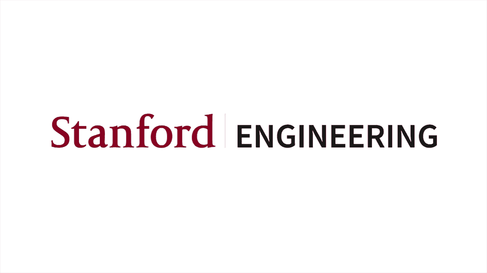


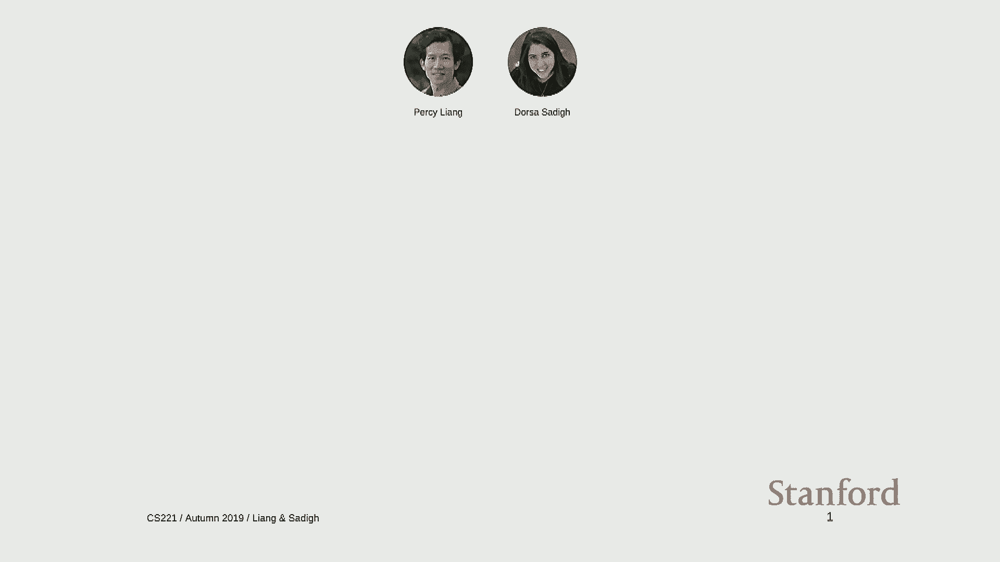


在本节课中，我们将一起了解人工智能（AI）的广阔领域。我们将回顾其发展历史，探讨其核心目标，并介绍本课程将采用的核心学习范式。课程内容旨在为初学者提供一个清晰、全面的入门视角。

---

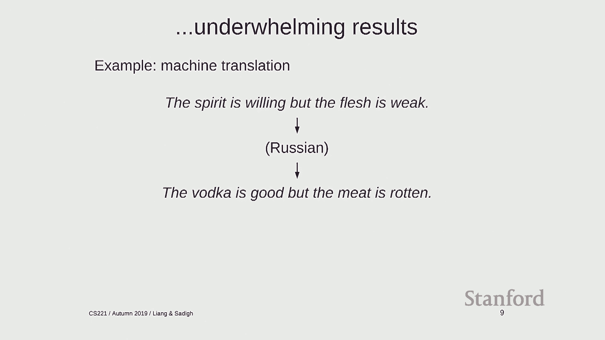

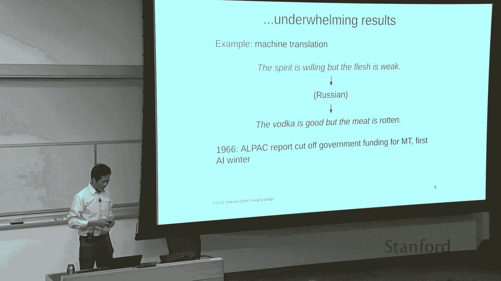

## 📜 人工智能简史

人工智能的故事始于1956年达特茅斯学院的夏季研讨会。当时，约翰·麦卡锡等先驱者提出了一个宏伟的目标：精确地描述学习的各个方面或智能的任何特征，以便机器能够进行模拟。

然而，早期的乐观情绪很快遇到了挑战。例如，在机器翻译领域，将英文句子“The spirit is willing but the flesh is weak”翻译成俄语后再译回英文，却得到了“The vodka is good but the meat is rotten”这样荒谬的结果。这导致了资金削减和第一个“AI寒冬”的到来。

早期失败的原因主要有两点：
1.  **计算能力不足**：当时的计算能力远不及现在。
2.  **问题建模的局限性**：许多方法本质上依赖于指数级搜索，并且缺乏从数据中学习的能力。

尽管如此，这个时期为计算机科学贡献了许多重要思想，如LISP语言、垃圾回收和时间共享。

到了20世纪80年代，研究重点转向了**知识**。专家系统通过编码人类专家的规则知识来解决特定领域问题（如疾病诊断），并首次在工业界产生了实际影响。然而，基于确定性规则的系统难以捕捉世界的所有细微差别，维护成本高昂，最终导致了第二个“AI寒冬”。

与此同时，另一条研究脉络——**人工神经网络**——也在悄然发展。1943年，McCulloch和Pitts提出了人工神经网络的理论。1969年，Minsky和Papert的著作《Perceptrons》指出线性分类器无法解决异或（XOR）问题，这在一定程度上抑制了神经网络的研究。

直到20世纪80年代，**反向传播算法**的（重新）发现使得训练多层神经网络成为可能。1989年，Yann LeCun应用卷积神经网络成功识别手写数字，并将其部署于美国邮政系统。但神经网络，特别是**深度学习**，真正迎来爆发是在2010年代，以2012年AlexNet在ImageNet竞赛中的突破性表现为标志。

人工智能领域汲取了来自**逻辑、神经科学、统计学、经济学和优化理论**等多个学科的养分。它就像一个“大熔炉”，将各种技术融合并应用于解决有趣的问题。

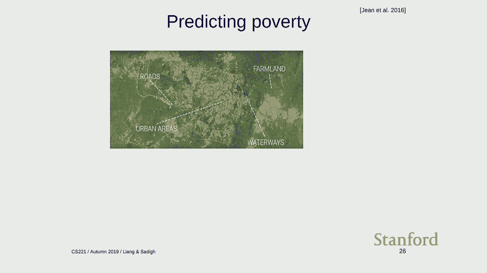

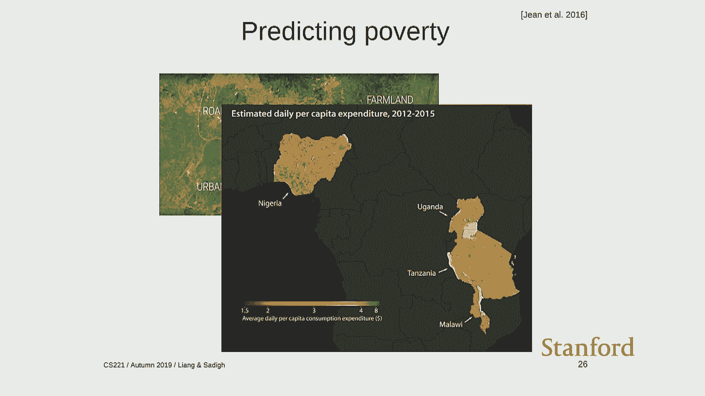

---

## 🎯 人工智能的目标：智能体与工具

关于人工智能的目标，存在两种主要视角，区分它们有助于避免混淆。

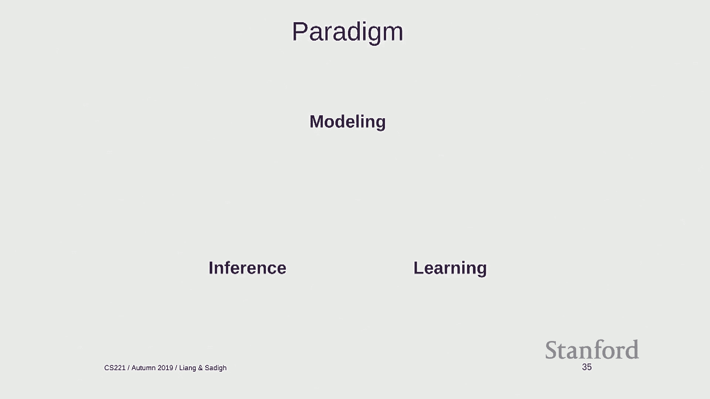

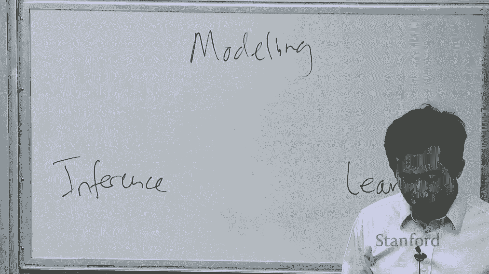

**第一种视角：AI 即智能体**
这个视角关注如何**创造或重现智能**。它审视人类令人惊叹的能力：感知世界、操纵物体、使用语言、拥有知识、进行推理，以及最重要的——**通过经验进行学习**。当前AI的成功大多局限于特定任务，并且需要海量数据，而人类则能从少量样本中学习，并处理多样化的任务。如何让机器具备人类这种通用学习能力，仍然是一个巨大的挑战。

**第二种视角：AI 即工具**
这个视角更关注如何**利用技术造福社会**，而不一定非要制造类人的智能。许多成功的AI应用都属于此类，它们解决的是对人类而言并不自然，但对社会有重大价值的问题。例如：
*   利用卫星图像和计算机视觉预测地区GDP。
*   优化数据中心冷却以节约能源。

然而，当AI被部署到自动驾驶、身份认证等关键任务中时，也带来了新的挑战：
1.  **安全性问题**：例如对抗性样本，可以欺骗图像识别系统。
2.  **偏见问题**：机器学习模型可能从训练数据中学习并放大社会现有的偏见（例如，在翻译中体现性别职业偏见）。
3.  **公平性难题**：不同的公平性定义在数学上可能是互斥的（例如在风险评估系统中），这需要社会和技术共同解决。

**总结**：智能体的视角激励我们探索更通用、更高效的学习机制；而工具的视角则要求我们认真思考AI系统在现实世界中部署时带来的伦理、安全和社会影响。

---

## 🏗️ 课程核心范式：建模、推断与学习

面对复杂的现实世界问题，我们需要一个系统化的解决框架。本课程将围绕 **“建模、推断与学习”** 这一核心范式展开。

**1. 建模**
建模是将复杂的现实世界**简化**为一个数学上精确、可供计算机处理的模型的过程。关键在于决定关注哪些信息，忽略哪些信息。例如，将城市导航问题建模为一个**图**，其中节点是地点，边代表可通行路径及其代价。

**2. 推断**
在获得模型后，推断是指**针对模型提出问题并计算答案**。例如，在图模型中，询问“从A点到B点的最短路径是什么？”。

**3. 学习**
学习解决的是“模型从何而来”的问题。我们通常先定义一个带参数的模型骨架，然后利用**数据**来自动学习这些参数。例如，在导航模型中，我们不知道每条边的实际通行时间（代价），但我们可以从大量“从x到y花了z分钟”的历史数据中，学习出各条边的代价参数。

这个范式的流程是：定义模型骨架 -> 用数据学习参数 -> 对带参数的模型进行推断。**学习**在这里不是指某个特定算法，而是一种通过数据来填充模型细节的哲学。

---

## 📚 课程内容路线图

本课程将按照模型智能的层次，从低到高进行讲解：

**1. 机器学习**
机器学习是AI的基础构建块，其核心思想是将复杂性从代码转移到数据。它依赖于从有限数据到未知情况的**泛化**能力。

**2. 反射模型**
这类模型像条件反射一样，接收输入后经过固定计算直接产生输出，没有内部状态或“思考”过程。例如线性分类器、深度神经网络。它们速度快，适合感知类任务。

**3. 基于状态的模型**
对于下棋、机器人规划等需要“前瞻”和决策的问题，我们使用基于状态的模型。它将世界描述为一系列**状态**，并通过**动作**进行状态转移。主要包括三类：
*   **搜索问题**：在确定性的环境中寻找最优路径。
*   **马尔可夫决策过程**：在具有随机性的环境中进行决策。
*   **对抗性游戏**：在与对手的对抗中制定策略。

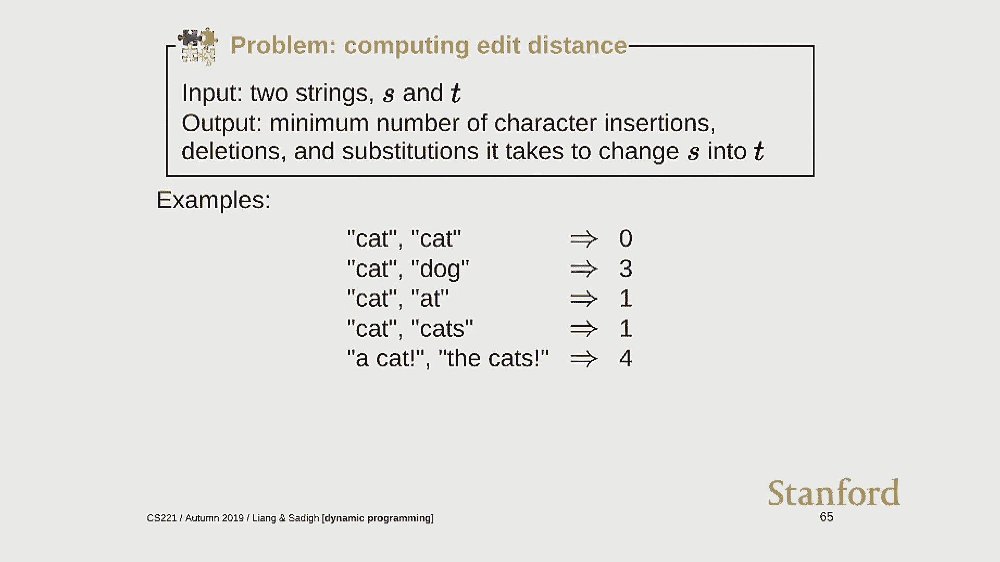

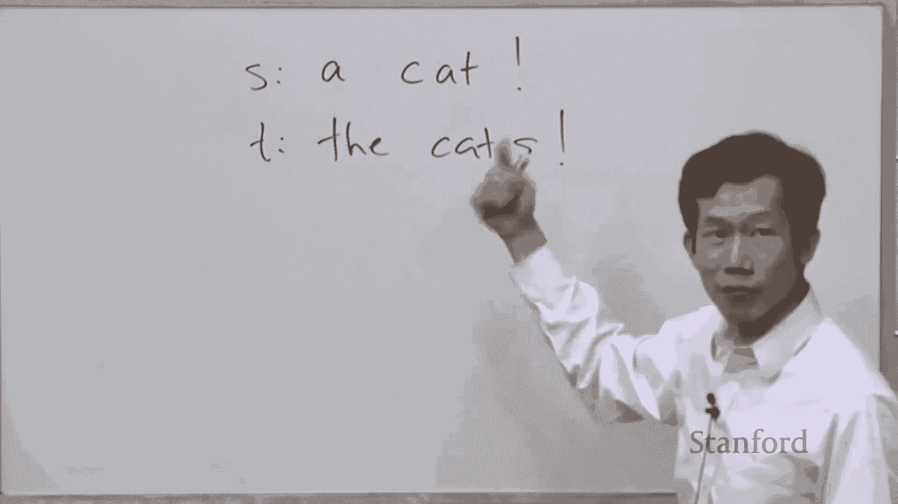

**4. 基于变量的模型**
对于像数独这样受多种约束同时影响的问题，我们使用基于变量的模型。它将解决方案视为满足一系列约束的变量赋值。主要包括：
*   **约束满足问题**：处理硬约束（如一个人不能同时在两个地方）。
*   **贝叶斯网络**：处理变量间的软概率依赖（如基于传感器数据追踪汽车位置）。

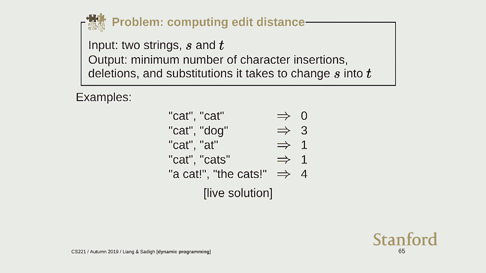

**5. 逻辑**
逻辑系统致力于实现高层次的推理能力。它能够处理异构信息，并进行深度的逻辑推理。例如，一个基于逻辑的系统可以理解“学生都是人”、“爱丽丝是学生”、“爱丽丝不是人”这几条陈述之间存在矛盾。

---

## ⚙️ 课程优化基础：动态规划与梯度下降

在课程的技术开端，我们将通过两个经典问题，介绍支撑“推断”和“学习”的两大优化工具。

**1. 离散优化：编辑距离与动态规划**
**问题**：计算将字符串S转换为字符串T所需的最少编辑次数（插入、删除、替换）。

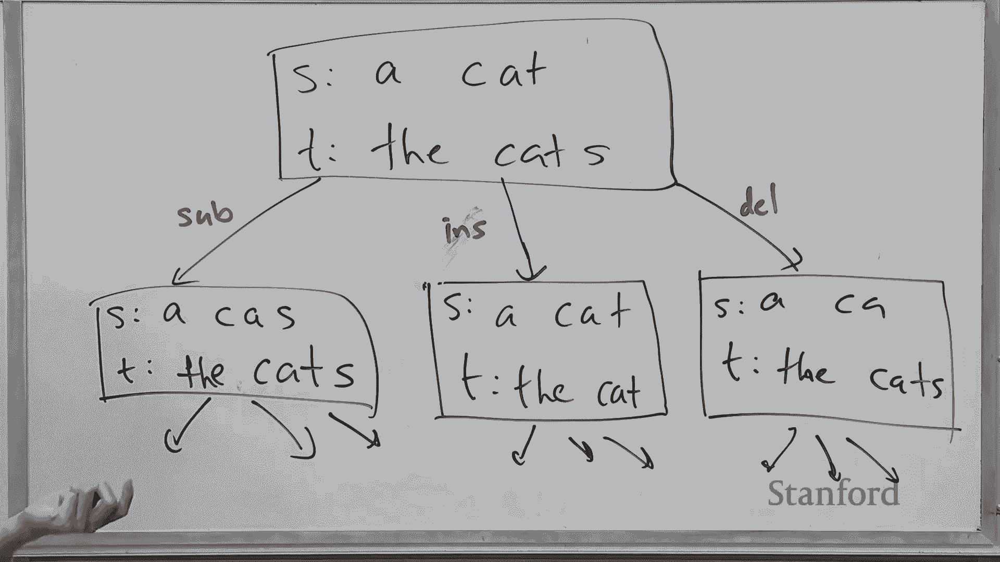

**挑战**：直接枚举所有可能的编辑序列是指数级的，不可行。

**解决方案：动态规划**
核心思想是将复杂问题分解为更简单的子问题，并避免重复计算。
*   **定义子问题**：设 `dp(m, n)` 为S前m个字符与T前n个字符的编辑距离。
*   **建立递推关系**：
    *   若 `S[m] == T[n]`：`dp(m, n) = dp(m-1, n-1)`。
    *   否则：`dp(m, n) = 1 + min(dp(m-1, n-1),  // 替换
                                     dp(m-1, n),    // 删除S[m]
                                     dp(m, n-1))`   // 在S插入T[n]（等价于删除T[n]）
*   **使用记忆化**：存储已计算的`dp(m, n)`结果，避免重复递归。

```python
def edit_distance(s, t):
    memo = {}
    def dp(m, n):
        if (m, n) in memo:
            return memo[(m, n)]
        if m == 0:
            result = n
        elif n == 0:
            result = m
        elif s[m-1] == t[n-1]:
            result = dp(m-1, n-1)
        else:
            result = 1 + min(dp(m-1, n-1),  # 替换
                             dp(m-1, n),    # 删除
                             dp(m, n-1))    # 插入
        memo[(m, n)] = result
        return result
    return dp(len(s), len(t))
```

**2. 连续优化：线性回归与梯度下降**
**问题**：给定一组数据点 `(x_i, y_i)`，拟合一条形如 `y = w * x` （假设过原点）的直线，使得预测值与真实值的误差平方和最小。

**形式化**：最小化目标函数 `F(w) = Σ_i (w * x_i - y_i)^2`。

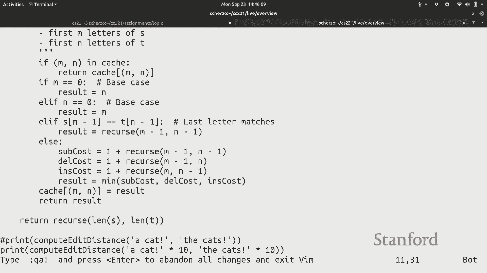

**解决方案：梯度下降**
当无法直接求解解析解时，梯度下降提供了一种迭代逼近的方法。
*   **核心思想**：函数值下降最快的方向是其梯度的反方向。
*   **算法步骤**：
    1.  初始化参数 `w`。
    2.  重复直到收敛：
        *   计算当前 `w` 处的梯度（导数）`∇F(w)`。
        *   沿梯度反方向更新：`w = w - η * ∇F(w)`，其中 `η` 为学习率（步长）。

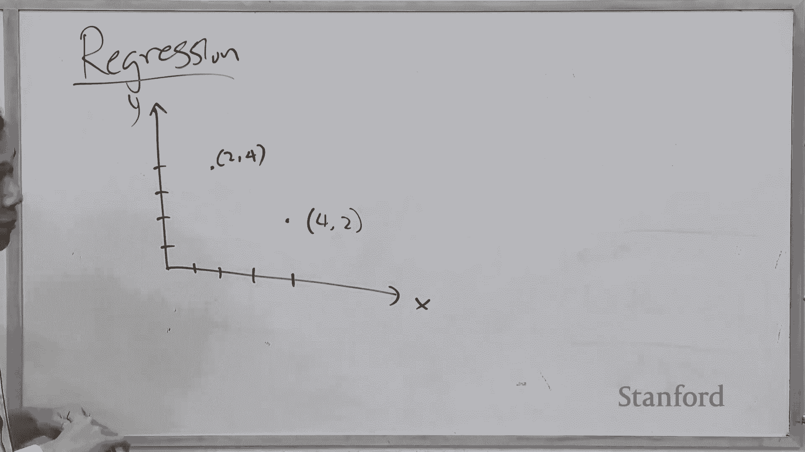

对于本例，导数 `dF/dw = 2 * Σ_i (w * x_i - y_i) * x_i`。

```python
def gradient_descent(points, steps=100, learning_rate=0.1):
    w = 0.0  # 初始化参数
    for _ in range(steps):
        grad = 0.0
        loss = 0.0
        for x, y in points:
            error = w * x - y
            grad += 2 * error * x  # 计算梯度
            loss += error ** 2     # 计算损失
        w = w - learning_rate * grad  # 沿负梯度方向更新
        print(f"w: {w:.4f}, Loss: {loss:.4f}")
    return w
```

---

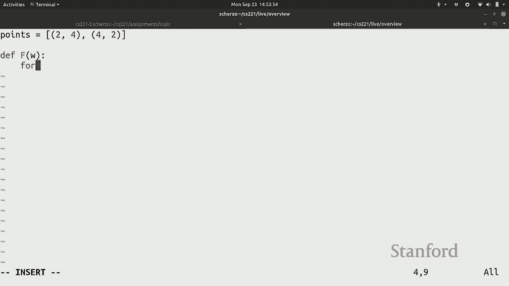

## 🏁 总结

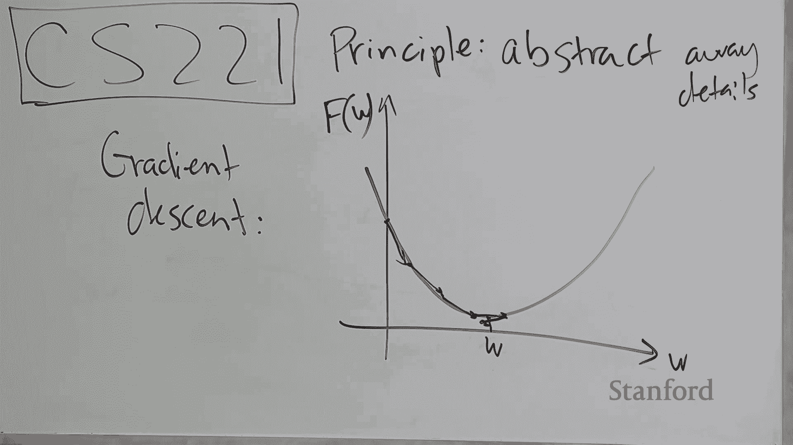

本节课我们一起学习了：
1.  **人工智能的发展历程**，从早期的逻辑推理、专家系统到如今的深度学习，是一个多学科融合、不断迭代的过程。
2.  **人工智能的双重目标**：既是创造类人智能体的科学探索，也是构建造福社会工具的技术实践。
3.  **本课程的核心范式**——“建模、推断与学习”，为我们提供了解决复杂AI问题的系统化框架。
4.  **课程的知识路线图**，将从机器学习基础，逐步深入到反射模型、状态模型、变量模型和逻辑推理。
5.  **两大基础优化技术**：用于离散优化的**动态规划**和用于连续优化的**梯度下降**，它们是实现高效推断和有效学习的数学工具。

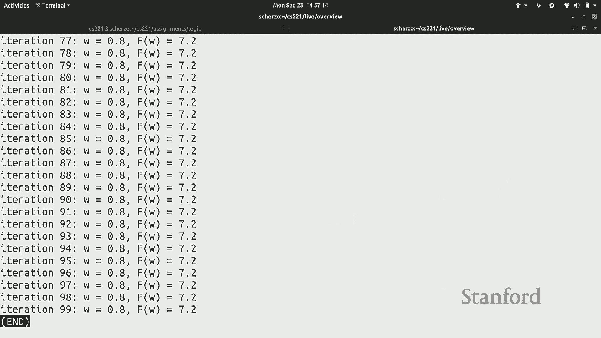


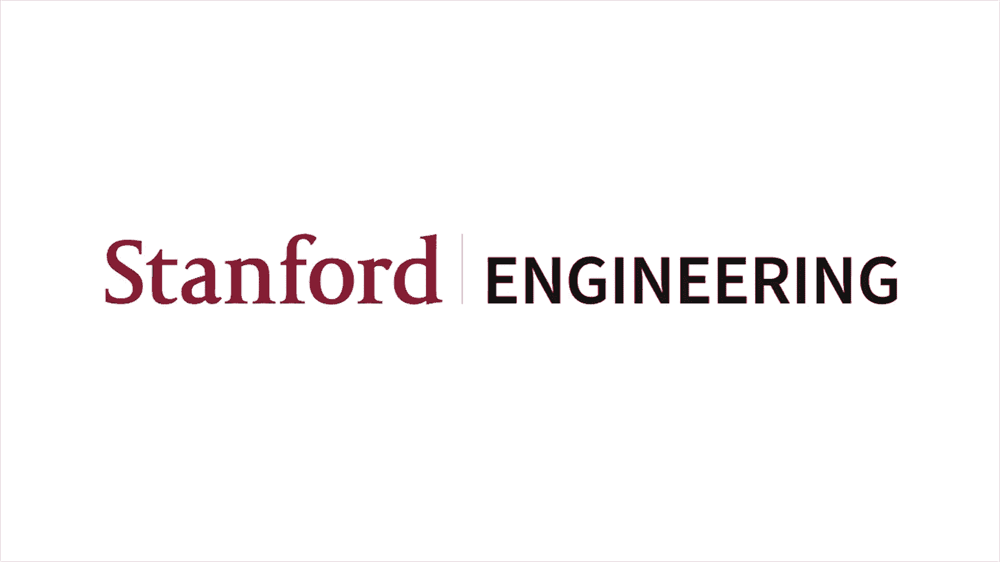

希望这节课能为你打开人工智能世界的大门，在接下来的课程中，我们将深入探索这个激动人心的领域的每一个组成部分。