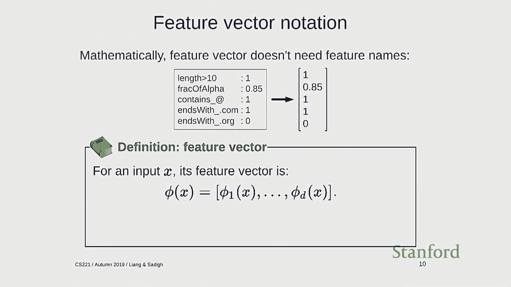
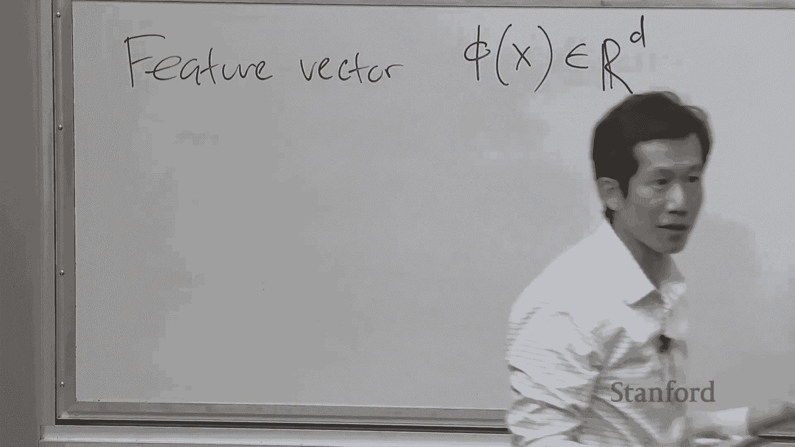
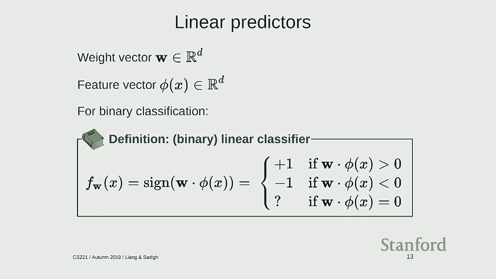
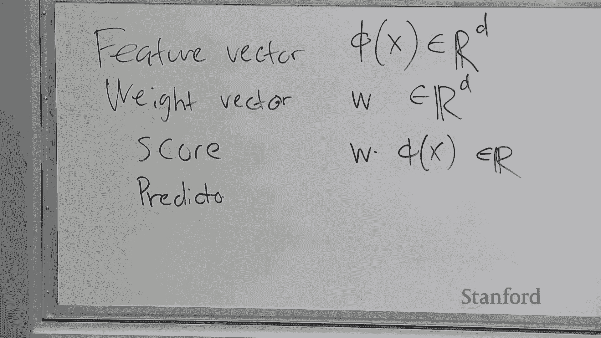
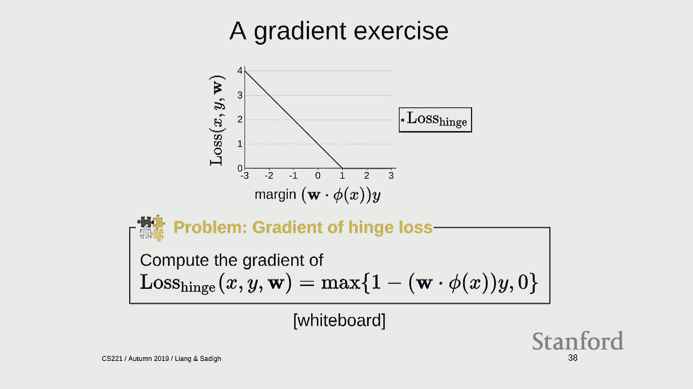
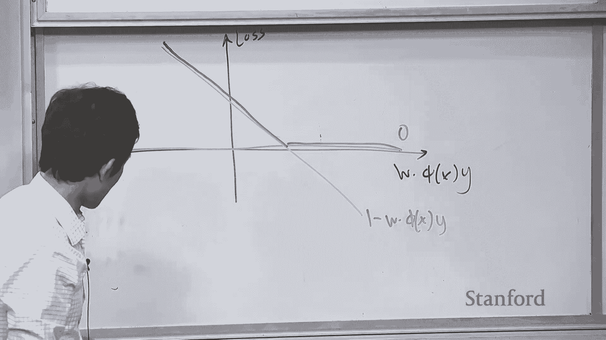

# 2：机器学习 1 - 线性分类器与随机梯度下降 🧠

在本节课中，我们将学习机器学习的基础知识，特别是线性分类器。我们将从最简单的反射模型入手，探讨如何利用数据来调整模型参数，从而避免手动设计模型的复杂性。课程将分为三个主要部分：线性预测器、损失最小化以及随机梯度下降算法。

---

## 概述 📋

机器学习允许我们利用数据来调整模型参数。本节课将从最简单的反射模型——线性分类器开始，展示如何将机器学习应用于此类模型。我们将介绍线性预测器（包括分类和回归）、损失最小化（定义训练目标）以及随机梯度下降（实现优化的算法）。

---

## 第一部分：线性预测器

上一节我们概述了课程框架，本节中我们来看看具体的线性预测器。

预测器的目标是建立一个函数 **f**，将输入 **x** 映射到输出 **y**。例如，在垃圾邮件分类中，输入 **x** 是电子邮件，输出 **y** 是“垃圾邮件”或“非垃圾邮件”。这是一个**二元分类**问题，输出通常标记为 **+1** 或 **-1**。

机器学习的第一步是获取数据。一个**样本**是一个 **(x, y)** 对，它指定了给定输入 **x** 时应有的输出 **y**。**训练集** 是样本的集合，它部分地定义了模型应有的行为。

### 特征提取

线性预测的第一步是**特征提取**。我们需要思考输入 **x** 的哪些属性可能与预测输出 **y** 相关。特征提取器 **φ** 将输入 **x** 转换为一个**特征向量**，即一组（特征名，特征值）对。实际上，对于学习算法而言，特征向量就是一个数字列表。

例如，对于字符串 "abc@gmail.com"，其特征向量可能包括：
*   长度 > 10: 1 (是)
*   字母数字字符比例: 0.85
*   包含 '@': 1 (是)
*   以 ".com" 结尾: 1 (是)
*   以 ".org" 结尾: 0 (否)

因此，特征向量 **φ(x)** 可以表示为 `[1, 0.85, 1, 1, 0]`。特征提取将复杂对象（如字符串、图像）提炼为数字列表，这是机器学习算法的通用语言。

**公式**：特征向量表示为 **φ(x) ∈ ℝ^D**，其中 **D** 是特征维度。其分量是 **φ₁(x), φ₂(x), ..., φ_D(x)**。

### 权重向量与得分

与特征向量对应的是**权重向量 **w**，它也是一个 **D** 维向量。权重 **w_j** 表示第 **j** 个特征对预测的贡献程度。权重可正可负，其大小表示该特征的重要性。

预测的**得分**是权重向量与特征向量的点积：

**公式**：`score = w · φ(x) = Σ_{j=1}^{D} w_j * φ_j(x)`

可以将每个特征视为一个“投票者”，权重决定了其投票的方向（正/负）和力度。

### 线性分类器

对于二元分类，线性分类器 **f_w** 根据得分的符号进行预测：

**公式**：`f_w(x) = sign( w · φ(x) )`

其中，`sign(a) = +1 if a > 0, else -1`。

得分是一个实数，其符号决定了分类结果。从几何角度看，权重向量 **w** 定义了一个决策边界（一个超平面），将特征空间划分为正负两个区域。决策边界是满足 `w · φ(x) = 0` 的所有点的集合。

---

## 第二部分：损失最小化

上一节我们定义了线性预测器，但尚未涉及如何从数据中学习。本节中我们来看看如何通过定义损失函数来指导学习。

**损失函数** **Loss(x, y, w)** 衡量当使用权重 **w** 对应的预测器对样本 **(x, y)** 进行预测时，我们的“不满程度”。损失值高意味着预测效果差，损失值低（理想情况为0）意味着预测效果好。

### 分类损失：间隔与 0-1 损失

对于分类，我们引入**间隔**的概念。

**公式**：`margin = (w · φ(x)) * y`，其中 **y ∈ {+1, -1}**。

间隔衡量预测的正确程度。正间隔表示分类正确，且值越大表示越确信；负间隔表示分类错误。

最直接的损失函数是**0-1损失**，它只关心是否犯错：

**公式**：`Loss_{0-1}(x, y, w) = 1 [ f_w(x) ≠ y ] = 1 [ margin ≤ 0 ]`

其中 `1[条件]` 是指示函数，条件为真时值为1，否则为0。

然而，0-1损失在绝大多数点上的梯度为零，无法用基于梯度的方法进行优化。

### 回归损失：残差与平方损失

对于回归问题，预测值就是得分 `ŷ = w · φ(x)`。我们定义**残差**为预测值与真实值的差：`residual = ŷ - y`。

常用的损失函数是**平方损失**：

**公式**：`Loss_{square}(x, y, w) = (ŷ - y)² = (w · φ(x) - y)²`

平方损失对大的误差给予更重的惩罚。

### 训练损失

机器学习的目标不是完美拟合单个样本，而是用一组权重 **w** 同时拟合所有训练样本。因此，我们定义**训练损失**为所有样本损失的平均值：

**公式**：`TrainLoss(w) = (1/|D_train|) * Σ_{(x,y)∈D_train} Loss(x, y, w)`

学习算法的目标就是找到最小化训练损失的权重 **w**。

---

## 第三部分：优化与随机梯度下降

上一节我们定义了需要最小化的目标（训练损失），本节中我们来看看如何通过优化算法来求解。

### 梯度下降

梯度下降是一种迭代优化算法。从初始权重（如全零）开始，反复计算训练损失函数的梯度，并向梯度反方向更新权重，以减小损失值。

**算法步骤**：
1.  初始化权重 **w = 0**。
2.  循环多次迭代：
    *   计算梯度 **g = ∇_w TrainLoss(w)**。
    *   更新权重 **w ← w - η * g**，其中 **η** 是**步长**（学习率）。

对于平方损失，其梯度有一个直观形式：`∇_w Loss_{square} = 2 * (ŷ - y) * φ(x)`。梯度由残差驱动，如果预测正确（残差为0），则梯度为零，无需更新。

然而，梯度下降的缺点在于每次迭代都需要计算整个训练集上损失的平均梯度，当数据量很大时计算成本高昂。

### 随机梯度下降

**随机梯度下降** 的核心思想是：每次迭代只使用一个（或一小批）样本来估计梯度，并立即更新权重。

**算法步骤**：
1.  初始化权重 **w = 0**。
2.  循环遍历训练集（或随机采样样本）：
    *   对于样本 **(x_i, y_i)**，计算其损失梯度 **g_i = ∇_w Loss(x_i, y_i, w)**。
    *   更新权重 **w ← w - η_i * g_i**。

由于数据通常存在冗余，基于单个样本的更新方向虽然嘈杂，但平均来看是正确的，并且更新频率大大增加，使得SGD通常比标准的梯度下降收敛快得多。

**步长 η** 的选择很重要：步长太小收敛慢；步长太大可能不稳定。实践中常使用随时间衰减的步长，例如 `η_t = 1 / t`。

### 应用于分类：合页损失

由于0-1损失无法优化，我们为分类问题引入**合页损失**作为替代：

**公式**：`Loss_{hinge}(x, y, w) = max(0, 1 - margin) = max(0, 1 - (w · φ(x)) * y)`

当间隔大于等于1时，损失为0；当间隔小于1时，损失线性增长。合页损失是0-1损失的一个凸上界，且其梯度在多数区域非零。

其梯度为：
*   若 `margin ≥ 1`：`∇_w Loss_{hinge} = 0`
*   否则：`∇_w Loss_{hinge} = -φ(x) * y`

这个梯度具有直观解释：如果分类正确且足够自信，则不更新；如果分类错误或自信不足，则沿着 `φ(x) * y` 的方向更新权重，以增大当前样本的间隔。

---

## 总结 🎯

本节课我们一起学习了机器学习的基础构建模块：
1.  **线性预测器**：通过特征提取将输入转化为特征向量，利用权重向量计算得分，并通过符号函数（分类）或直接输出（回归）进行预测。
2.  **损失最小化**：定义了0-1损失、合页损失、平方损失等函数，用以量化预测器在数据上的表现。训练目标是最小化平均训练损失。
3.  **随机梯度下降**：一种高效的优化算法，通过使用单个或小批样本的梯度来近似整体梯度，从而快速找到最小化损失的模型参数。

通过将模型（线性预测器）、目标（损失最小化）和算法（SGD）分离，我们获得了一个灵活而强大的机器学习框架。下一节课，我们将深入探讨特征工程，并思考机器学习的真正目标是否仅仅是最小化训练损失。