# 4：泛化与K-means聚类 🧠


在本节课中，我们将要学习机器学习中的两个核心概念：**泛化**与**无监督学习**。我们将探讨如何避免模型在训练数据上“学得太好”而失去预测新数据的能力，并介绍一种经典的无监督学习方法——K-means聚类算法。

---

## 泛化：我们真正关心的是什么？🎯

上一节我们介绍了如何通过优化训练损失来学习模型。本节中我们来看看，仅仅最小化训练误差是否真的是我们的目标。

什么是机器学习的真正目标？是**最小化未来未见数据的误差**。我们训练模型，最终是为了将其部署到系统中，处理未来的、未见过的数据。

那么，训练误差、正则化和测试集在其中扮演什么角色呢？

### 过拟合的极端例子

如果我们真的只想最小化训练损失，可以设计一个算法：存储所有训练样本。当遇到训练集中见过的样本时，直接输出其标签；遇到未见过的样本时，则输出一个默认值或报错。这个算法在训练集上的误差为零，但它显然是一个糟糕的主意，因为它完全无法处理新数据。

这就是**过拟合**的极端例子。过拟合是指模型过于紧密地拟合训练数据（包括其中的噪声），而忽略了数据背后更一般的规律，导致在新数据上表现不佳。


### 如何评估预测器的好坏？

我们关心的是未来未见数据的误差，但无法直接优化它。通常的做法是收集一个**测试集**，它应该能代表未来可能遇到的数据类型。我们必须谨慎地保护测试集，避免在模型开发过程中过度使用它，否则它将失去作为未来数据“替身”的意义。

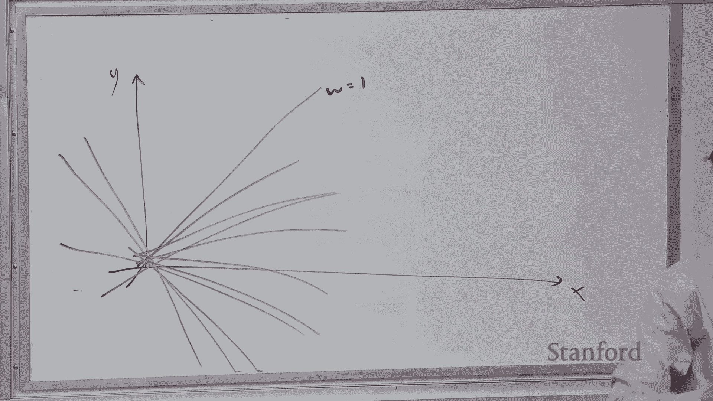

机器学习中有一个“信念的飞跃”：学习算法只在训练集上运行，但我们期望它在未见过的测试集上也能表现良好。为什么会这样呢？

### 假设空间与误差分解

我们可以从假设空间的角度来理解这种“飞跃”。假设 `F*` 是能永远给出正确答案的“真实预测器”。我们定义的模型（如特定的特征提取器或神经网络结构）实际上划定了一个**假设类 F**，这是我们愿意考虑的所有函数的集合。

学习的目标是在 `F` 中找到最好的函数 `f`。我们可以将总误差分解为两部分：
*   **近似误差**：`F` 中最好的函数 `g` 与真实预测器 `F*` 之间的误差。这衡量了你的假设类本身的表现力。
*   **估计误差**：你的学习算法实际找到的函数 `f_hat` 与 `F` 中最好的函数 `g` 之间的误差。这衡量了基于有限数据，你的学习效果与假设类潜力之间的差距。

总误差可以公式化为：
`误差(f_hat) - 误差(F*) = [误差(f_hat) - 误差(g)] + [误差(g) - 误差(F*)]`

这个分解有助于我们理解其中的权衡。**增大假设类**（例如添加更多特征、增大神经网络）会降低近似误差（因为搜索空间更大，可能找到更好的解），但会增大估计误差（因为更复杂的模型需要更多数据来准确估计）。

### 控制假设类大小的方法

我们如何控制假设类的大小，从而在近似能力和估计难度之间取得平衡呢？以下是两种主要策略：

**1. 控制维度 (Dimensionality)**
对于线性分类器，预测器由权重向量 `w` 指定，它有 `d` 个维度。我们可以通过添加或删除特征来改变 `d`。减少维度相当于缩小了假设类的范围。

**2. 控制权重向量的范数 (Norm)**
同样对于线性预测器，我们可以限制权重向量 `w` 的长度（例如它的 L2 范数 `||w||`）。限制范数意味着我们只考虑那些“更平滑”、“更简单”的函数（例如斜率较小的线性函数），这同样缩小了考虑的假设类范围。

### 实现：正则化与早停

我们如何在优化中实现“保持假设类较小”的理念呢？最流行的方法是**正则化**。

具体做法是在原始目标函数（训练损失）中添加一个惩罚项。例如，对于 L2 正则化（也称为权重衰减），新的目标函数是：
`目标(w) = 训练损失(w) + λ * ||w||^2`
其中 `λ` 是**正则化强度**，是一个正数。优化器现在需要同时尝试减小训练损失和权重向量的范数，这鼓励它找到能拟合数据但又不复杂的简单解。

另一种更直观但相对粗糙的策略是**早停**。我们不是一直训练到损失不再下降，而是在训练早期就停止迭代。直觉是，权重通常从接近零的小值开始增长，更少的更新迭代通常意味着更小的权重范数。

**核心思想是：努力最小化训练误差，但不要过于努力。**

### 超参数调优

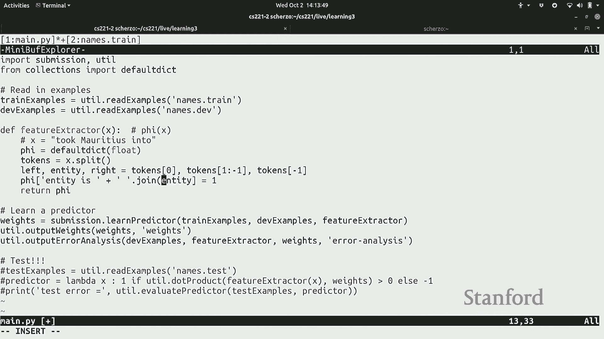

学习算法中有许多需要预先设定的参数，如正则化强度 `λ`、迭代次数 `T`、学习率等，这些称为**超参数**。我们如何设置它们？

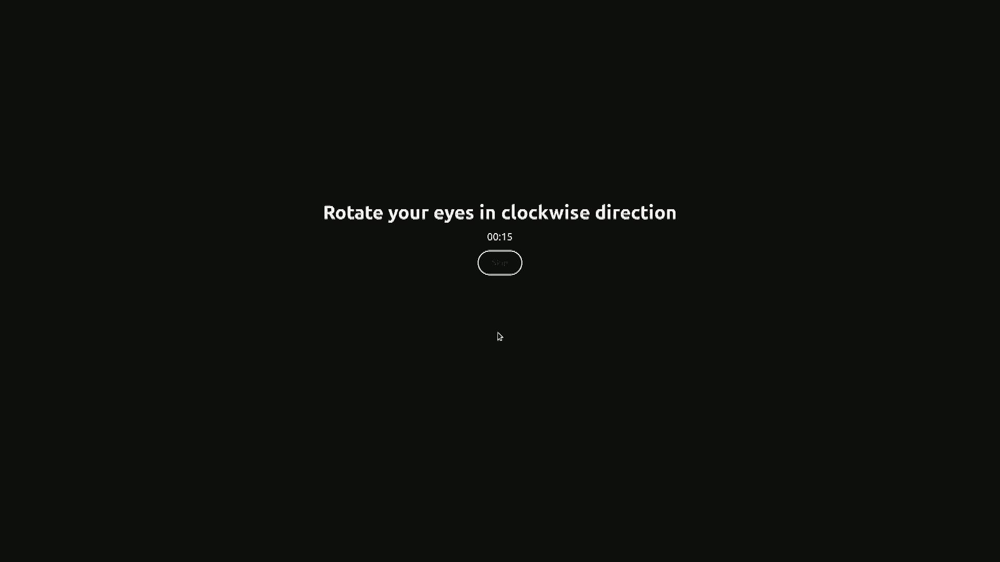

*   **不能根据训练误差选择**：这会导致过拟合（例如，将 `λ` 设为 0）。
*   **不能根据测试误差选择**：这会使测试集失去作为未来数据估计的意义。
*   **正确方法：使用验证集**
    我们从训练集中划出一部分（例如 10%-20%）作为**验证集**。测试集被严格保留，用于最终评估。我们使用验证集上的表现来指导超参数的选择和模型开发。

以下是选择超参数的典型流程：
```
for 每个超参数组合 (如 λ=0.01, 0.1, 1):
    在（训练集 - 验证集）上训练模型
    在验证集上评估模型性能
选择在验证集上性能最好的超参数组合
```

---

## 实践演练：命名实体识别示例 🔍

理论是基础，但机器学习的实践往往涉及不同的思考。让我们通过一个简化的命名实体识别（判断一个词是否为人名）问题，走一遍典型的开发流程。

**核心流程如下：**
1.  **观察数据**：理解数据格式和内容。
2.  **划分数据**：分为训练集、验证集、测试集。
3.  **迭代开发**：
    *   实现特征或改变模型结构。
    *   设置超参数并运行学习算法。
    *   观察训练和验证误差，判断是欠拟合还是过拟合。
    *   （对于线性模型）查看权重以理解模型。
    *   查看模型的预测结果，进行错误分析。
    *   基于分析 brainstorm 改进方法。
4.  **最终评估**：在锁定的测试集上运行最终模型，报告结果。

**特征工程示例（从简单到复杂）：**
1.  **初始**：无特征，准确率很低（~72% 错误率）。
2.  **添加实体特征**：`feature(“entity= Mauritius”)`。训练误差很低，但验证误差仍高（~20%），因为无法泛化到未见过的实体。
3.  **添加上下文特征**：`feature(“left= governor”)`, `feature(“right= said”)`。验证错误率下降（~17%）。
4.  **添加实体词特征**：`feature(“entity-contains-word= Felix”)`。验证错误率显著下降（~6%）。
5.  **添加词缀特征**：`feature(“entity-contains-prefix= Curt”)`, `feature(“entity-contains-suffix= is”)`。验证错误率进一步下降（~4%）。

这个例子展示了一个“顺利”的路径。在实践中，更多时候新特征可能不会带来提升，甚至可能使性能下降。关键在于持续尝试、分析错误并调整思路。

---

## 无监督学习：K-means 聚类 📊

到目前为止，我们讨论的都是**监督学习**，即训练数据包含输入/输出对。然而，获取大量标注数据通常非常昂贵。**无监督学习**则利用没有标签的数据，这些数据往往更容易大量获取（如互联网文本、图片、视频）。

无监督学习的核心思想是：数据中蕴含着丰富的**潜在结构**，我们的目标是开发能自动发现这些结构的方法。聚类是其中一种主要技术。

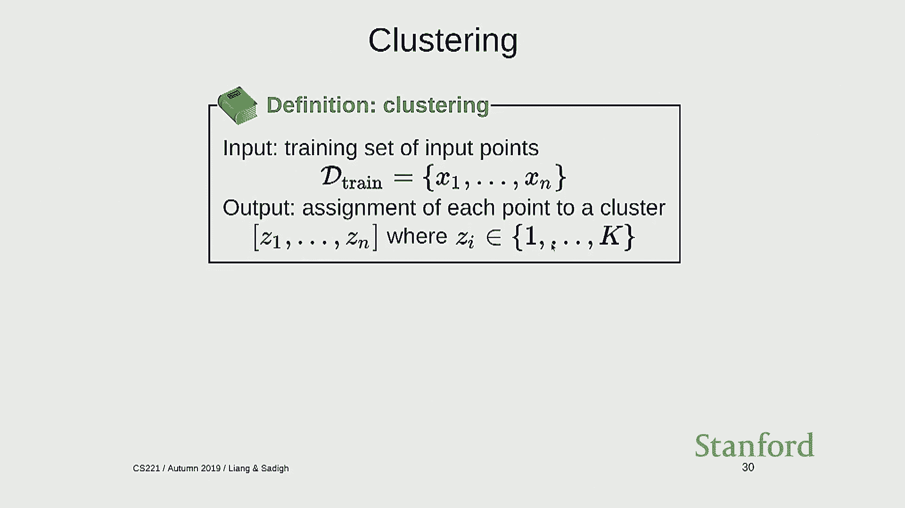

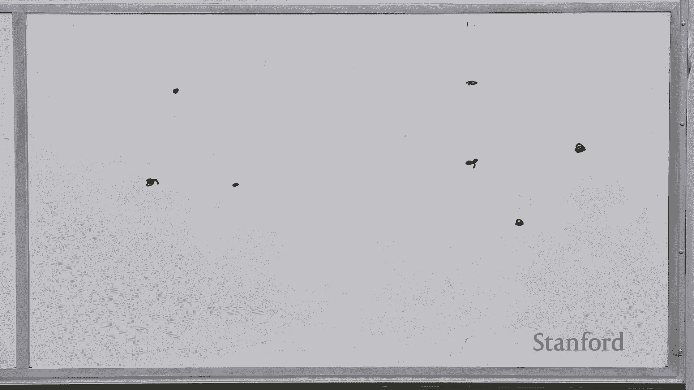

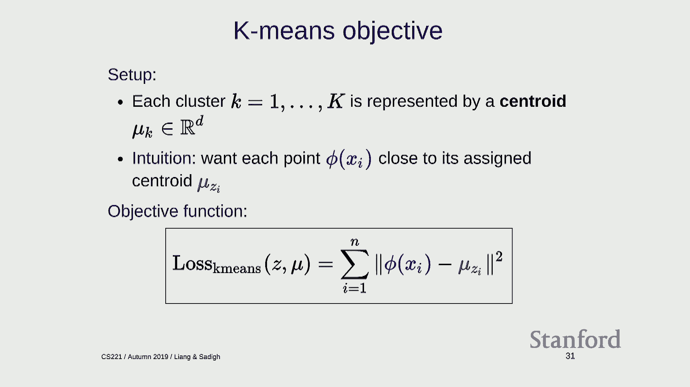

### 聚类定义

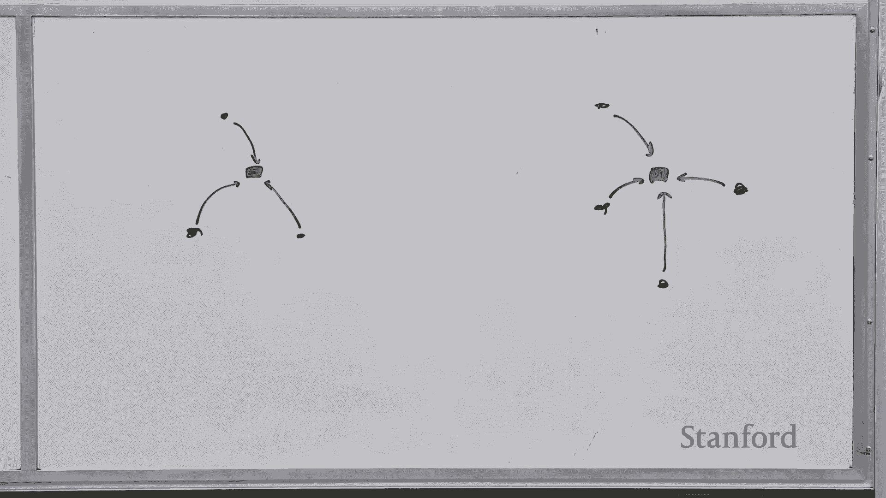

给定一组点 `{x1, ..., xn}`，聚类算法需要为每个点分配一个**簇标签** `{z1, ..., zn}`，其中 `zi ∈ {1, ..., k}`，`k` 是预先设定的簇数量。

### K-means 目标函数

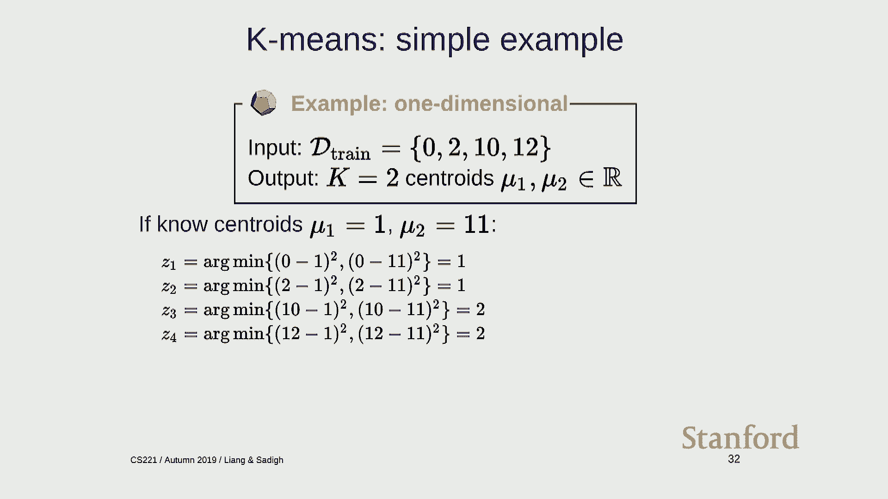

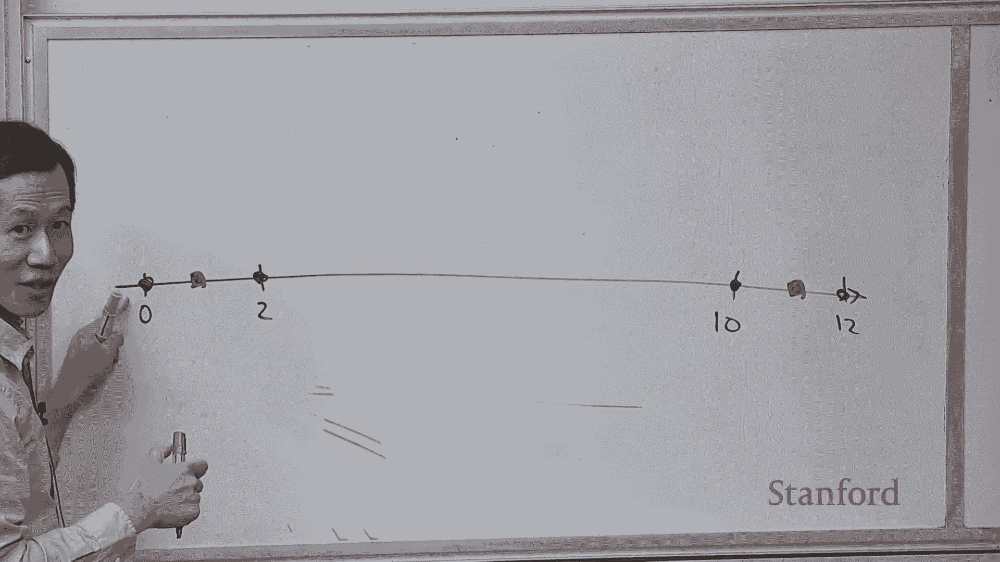

K-means 算法的原理是：每个簇都与一个**中心点（质心）** 相关联。我们希望每个点都离它所属簇的质心尽可能近。

这转化为以下优化目标（重构损失）：
`最小化 Σ_i || x_i - μ_{z_i} ||^2`
其中：
*   `μ_k` 是第 `k` 个簇的质心（一个与数据点同维度的向量）。
*   `z_i` 是数据点 `x_i` 被分配到的簇的索引。
我们需要同时优化所有质心 `{μ_k}` 和所有分配 `{z_i}`。

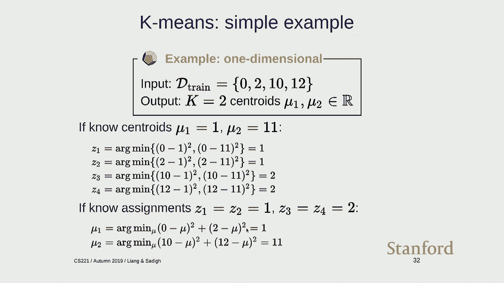


### K-means 算法：交替最小化

这是一个“鸡生蛋蛋生鸡”的问题。解决方案是**交替最小化**：

1.  **分配步骤（固定质心）**：给定质心 `{μ_1, ..., μ_k}`，将每个点 `x_i` 分配给离它最近的质心所在的簇。
    `z_i = argmin_j || x_i - μ_j ||^2`
2.  **更新步骤（固定分配）**：给定簇分配 `{z_i}`，将每个簇的质心 `μ_k` 更新为该簇所有点的平均值。
    `μ_k = (1 / |{i: z_i = k}|) * Σ_{i: z_i = k} x_i`

**完整算法流程：**
*   随机初始化 `k` 个质心 `{μ_1, ..., μ_k}`。
*   重复以下步骤直到收敛（例如，分配不再变化或达到最大迭代次数）：
    1.  执行**分配步骤**。
    2.  执行**更新步骤**。

### K-means 的特性与注意事项

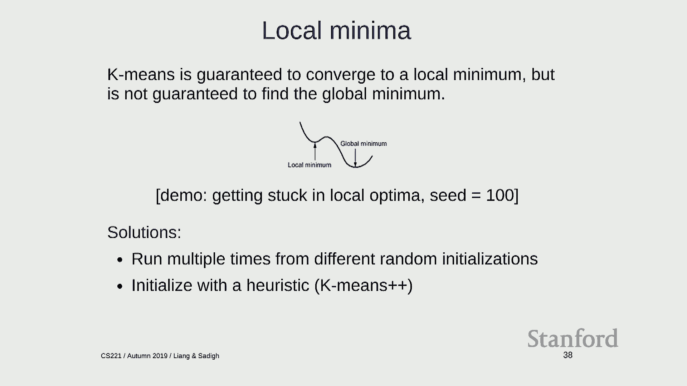

*   **收敛性**：K-means 保证收敛到一个**局部最优解**，但不一定是全局最优。不同的初始质心可能导致不同的结果。
*   **初始化**：实践中，常使用多次随机初始化并选择结果最好的一次。更高级的方法如 **K-means++** 通过智能选择初始点来提升效果。
*   **选择 K 值**：簇的数量 `k` 是一个超参数。可以通过绘制不同 `k` 值对应的重构损失曲线，寻找损失下降的“拐点”；也可以在验证集上评估聚类质量（如果下游任务有标签）来选择。

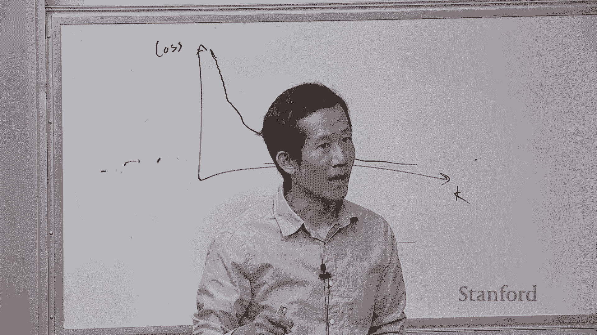

---

## 总结与展望 🌟

本节课中我们一起学习了：
1.  **泛化**是机器学习的核心目标，即模型在未见数据上的表现。我们通过**验证集**来估计泛化能力并调优模型，同时严格保留**测试集**用于最终评估。
2.  通过**控制模型复杂度**（如特征数量、权重范数）和使用**正则化**、**早停**等技术，可以在拟合训练数据和保持泛化能力之间取得平衡。
3.  **无监督学习**利用未标注数据发现内在结构。**K-means 聚类**是一种经典方法，它通过交替优化数据点分配和簇中心位置，将数据划分为 `k` 个簇。


机器学习不仅仅是优化训练损失，更是一门关于从经验中学习并泛化到新情况的科学。在接下来的课程中，我们将看到学习如何应用于更复杂的模型，如基于状态的模型和基于概率的模型。