# 5：搜索1 - 动态规划与一致代价搜索 🧭


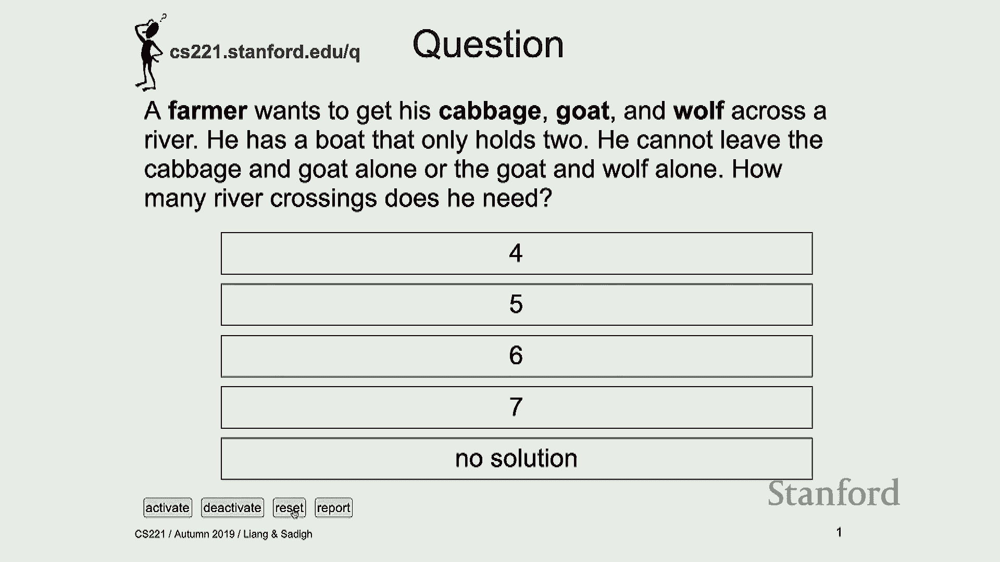

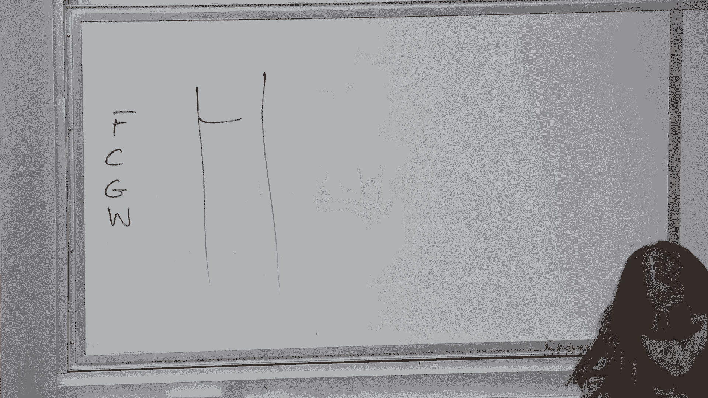

在本节课中，我们将学习基于状态的模型，特别是搜索问题。我们将从搜索问题的基本概念开始，介绍几种树搜索算法，并深入探讨如何利用动态规划和一致代价搜索来高效解决这些问题。

---

## 什么是搜索问题？🤔

上一节我们介绍了基于反射的模型，本节中我们来看看基于状态的模型，特别是搜索问题。搜索问题涉及寻找一系列动作，以达到某个目标状态，同时需要考虑当前动作对未来状态的影响。

以下是几个搜索问题的例子：
*   **路线规划**：在地图上从A点前往B点，目标是找到最短、最快或风景最美的路径。答案是一系列动作指令（例如，直行、左转、右转）。
*   **机器人运动规划**：让机器人从A点移动到B点，目标可能是最快、最节能或最安全的方式。动作是机器人各个关节的平移和旋转。
*   **游戏解谜**：例如魔方或15拼图，目标是将混乱的方块排列成特定顺序。答案是一系列移动方块的动作。
*   **机器翻译**：将一种语言的句子翻译成英语。目标是将源语言的意思流畅、准确地转化为英语。动作是逐个添加单词到目标句子中。

**搜索问题与反射模型的关键区别**在于：在搜索问题中，输出的动作会直接影响未来的状态和后续决策，因此必须考虑动作的**未来后果**。

---

## 搜索问题的形式化定义 📝

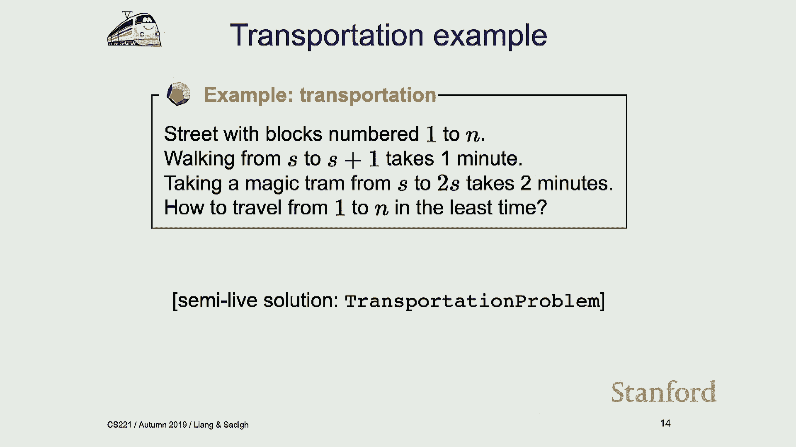

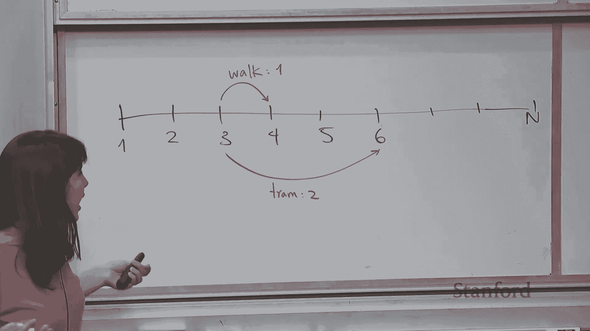

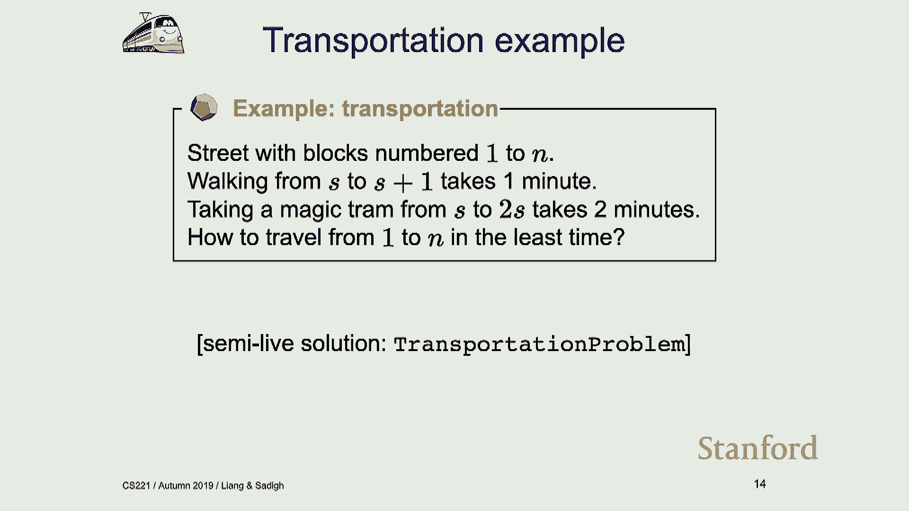

为了系统地解决搜索问题，我们首先需要将其形式化。一个搜索问题通常由以下几个部分组成：

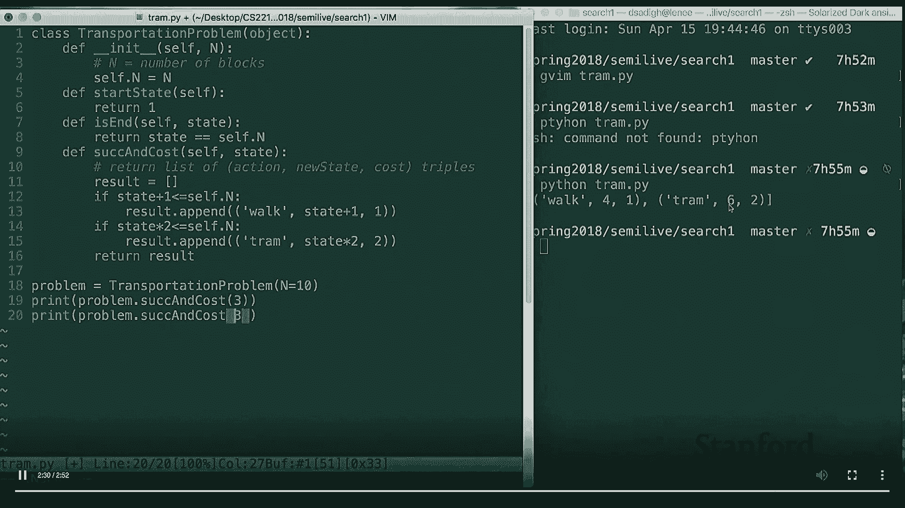

*   **起始状态**：`start`
*   **动作函数**：`actions(s)`，返回在状态 `s` 下所有可能的动作。
*   **成本函数**：`cost(s, a)`，返回在状态 `s` 下执行动作 `a` 所需的成本。
*   **后继函数**：`succ(s, a)`，返回在状态 `s` 下执行动作 `a` 后到达的新状态。
*   **终止判断函数**：`is_end(s)`，检查状态 `s` 是否是目标（终止）状态。

**一个简单的例子：运输问题**
假设有N个街区（1到N），我们从街区1出发，目标是到达街区N。有两种移动方式：
1.  **步行**：从街区 `s` 移动到 `s+1`，耗时1分钟。`cost = 1`
2.  **乘坐电车**：从街区 `s` 移动到 `2*s`，耗时2分钟。`cost = 2`

我们需要找到从1到N耗时最短的路径序列。

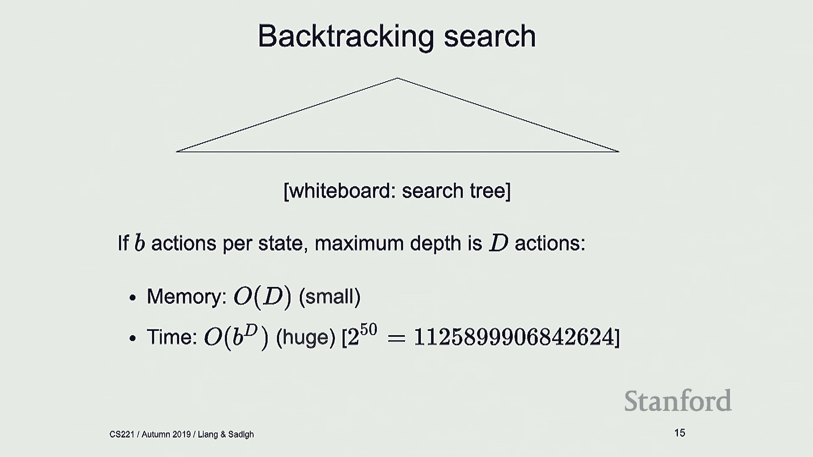

---

## 树搜索算法 🌳

在深入更高效的算法之前，我们先看看几种基础的树搜索算法。它们通过构建和探索“如果...那么...”树来寻找解决方案。

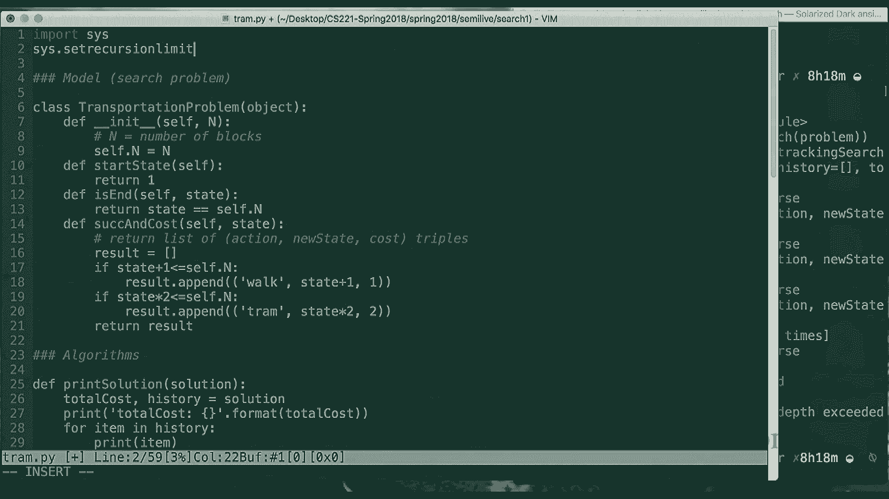

以下是几种树搜索算法的比较：

| 算法 | 允许的成本 | 时间复杂度 | 空间复杂度 | 说明 |
| :--- | :--- | :--- | :--- | :--- |
| **回溯搜索** | 任意成本 | `O(b^d)` | `O(d)` | 探索所有可能的路径，返回最优解。需要记录当前路径的父节点。 |
| **深度优先搜索** | 零成本 | `O(b^d)` | `O(d)` | 找到**第一个**解即停止，因为所有解成本相同（零）。 |
| **广度优先搜索** | 正常数成本 | `O(b^d)` | `O(b^d)` | 逐层搜索，找到的第一个解即为最优（因成本恒定）。需要存储整层节点信息。 |
| **迭代加深DFS** | 正常数成本 | `O(b^d)` | `O(d)` | 结合BFS和DFS优点。逐层增加深度限制并运行DFS，空间需求小，适用于解在浅层的问题。 |

> 其中，`b` 是分支因子（每个状态的平均动作数），`d` 是搜索树深度，`d'` 是最浅解所在的深度。

这些树搜索算法在最坏情况下时间都是指数级的 `O(b^d)`。接下来，我们将介绍两种能将时间复杂度降至多项式级别的算法：动态规划和一致代价搜索。

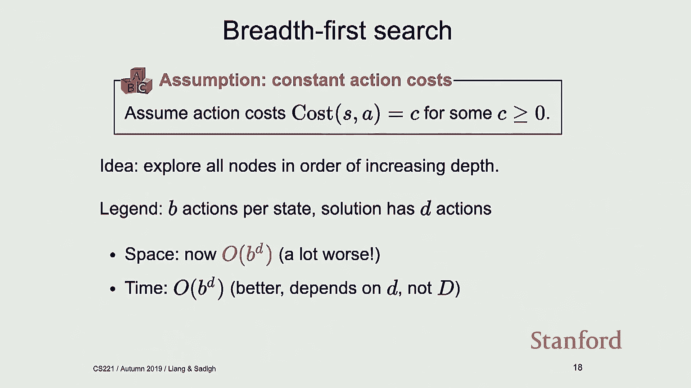

---

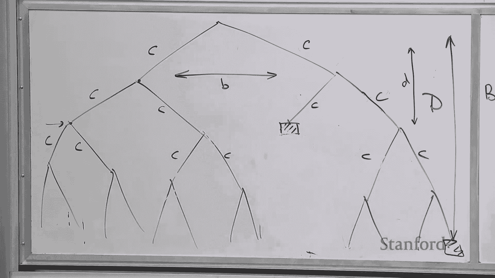

## 动态规划 🧠

动态规划的核心思想是利用“状态”的概念，避免重复计算子问题，从而将指数级问题转化为多项式级问题。

**状态**：是过去所有动作的**摘要**，它包含了为未来做出最优决策所需的全部信息。
**关键公式**：动态规划通过以下递归关系计算从状态 `s` 出发的**未来成本** `future_cost(s)`：
```math
future\_cost(s) = \begin{cases} 
0 & \text{if } is\_end(s) \\
\min_{a \in actions(s)} [cost(s, a) + future\_cost(succ(s, a))] & \text{otherwise}
\end{cases}
```

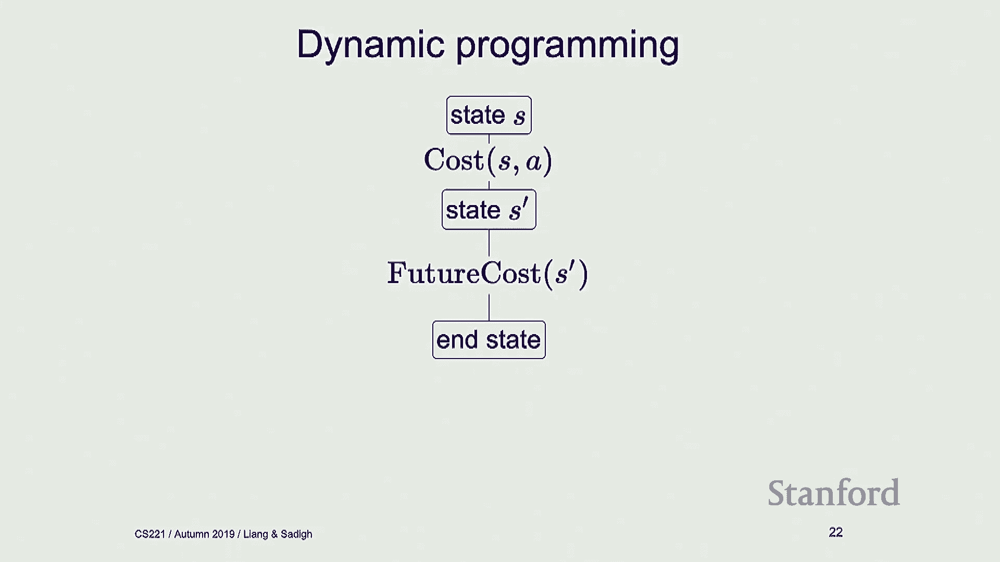

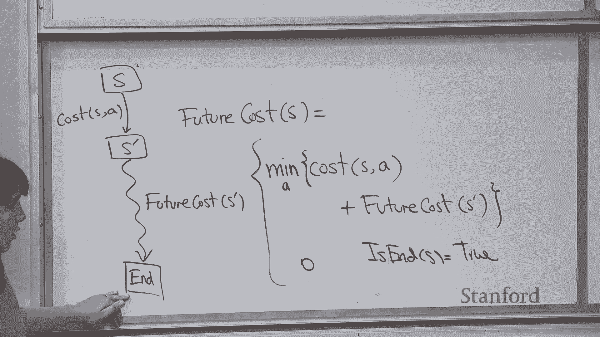

**实现要点**：
1.  **记忆化**：存储已计算过的 `future_cost(s)`，避免重复计算。
2.  **无环假设**：动态规划要求状态图是**有向无环图**，这样才能确定计算状态的顺序（例如，从目标状态倒推）。

**状态空间的设计**：动态规划的效率很大程度上取决于状态的定义。状态应尽可能小，但必须包含做出未来决策所需的所有历史信息。
*   **示例**：在“运输问题”中，状态只需是`当前街区`。
*   **增加约束**：如果增加“不能连续访问三个奇数街区”的约束，状态就需要包含`当前街区`和`已连续访问的奇数街区计数`。为了最小化状态空间，计数只需记录“0，1，2，≥3”四种情况即可。

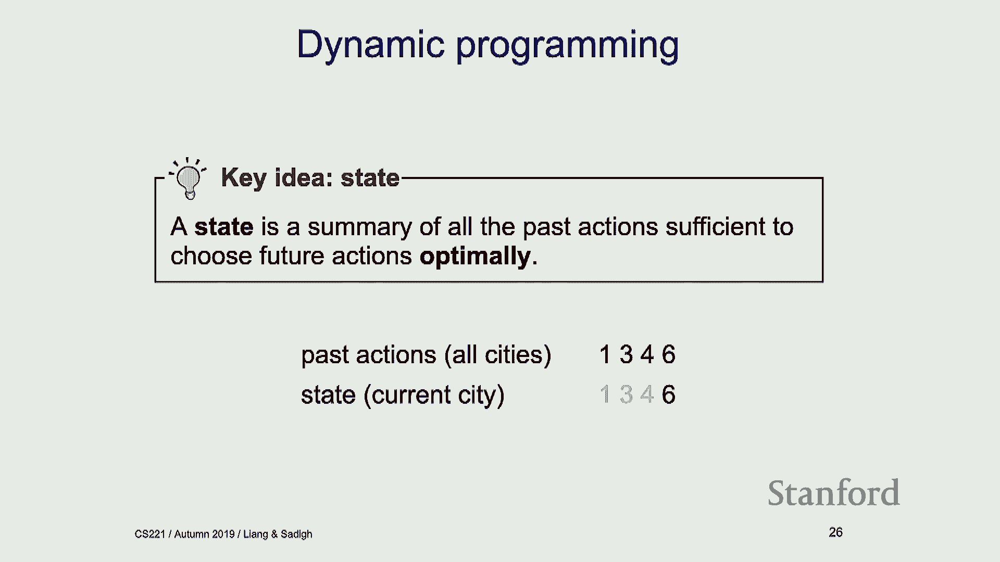

---

## 一致代价搜索 ⚖️

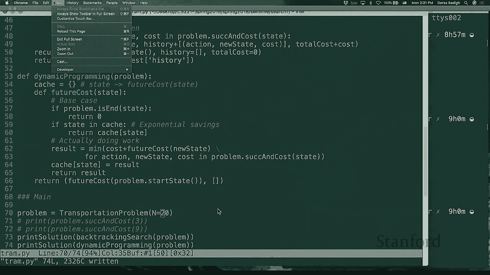

动态规划不能处理带环的图。一致代价搜索（本质上是Dijkstra算法）可以解决这个问题，它适用于所有边成本**非负**的搜索问题。

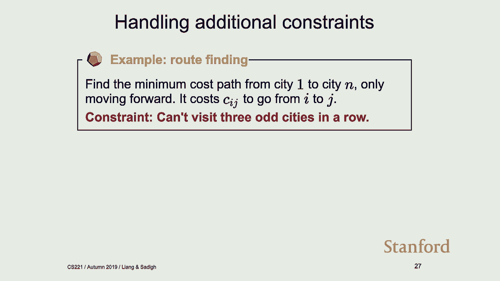

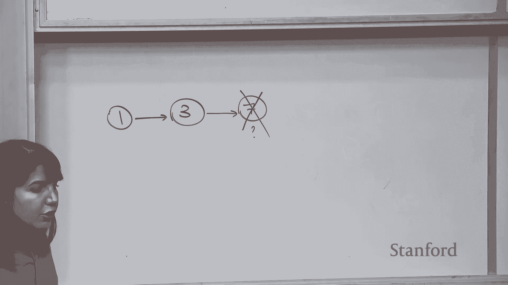

**核心思想**：按照从起点到该状态的**已知最小成本**的递增顺序来探索状态。

**算法维护三个集合**：
1.  **已探索**：我们已确定找到最优路径的状态。
2.  **边界**：我们已发现但尚未确定其路径是否最优的状态。每个边界状态都有一个“临时成本”。
3.  **未探索**：尚未被发现的状态。

**算法步骤**：
1.  将起始状态放入边界，成本为0。
2.  从边界中取出成本最小的状态 `s`。
3.  将 `s` 移至已探索集合。此时，到达 `s` 的成本已是最优。
4.  对于从 `s` 出发的每个动作，生成后继状态 `s'` 及其总成本（`s`的成本 + 动作成本）。
    *   如果 `s'` 是未探索状态，将其加入边界。
    *   如果 `s'` 已在边界，且新路径成本更低，则更新其在边界中的成本。
5.  重复步骤2-4，直到目标状态被取出边界（加入已探索），或边界为空。

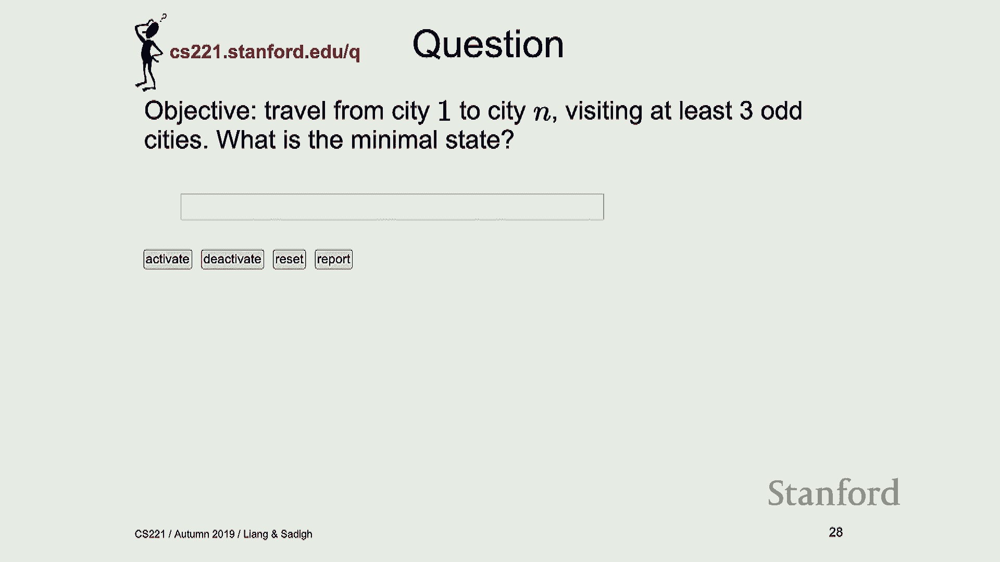

**示例**：寻找下图中从A到D的最短路径。
```
A --1--> B --100--> D
|        |
100      1
|        |
C --1--> D
```
*   首先探索A（成本0）。
*   然后探索B（成本1），更新C的成本为2（经B），D的成本为101（经B）。
*   接着探索C（成本2），发现经C到D的成本为3，优于之前的101，更新D。
*   最后探索D（成本3），找到最优路径 A->B->C->D。

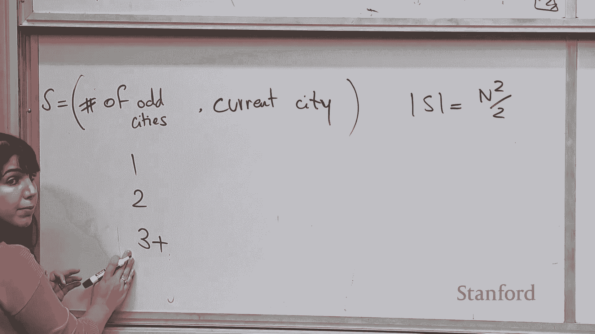

---

## 总结 📚

本节课中我们一起学习了基于状态的模型中的搜索问题。
1.  我们首先了解了搜索问题的定义和几个实例。
2.  然后，我们探讨了几种基础的树搜索算法（回溯、DFS、BFS、迭代加深DFS），并分析了它们的时间和空间复杂度。
3.  接着，我们引入了强大的**动态规划**方法，它通过定义“状态”和记忆化，将指数级搜索转化为多项式时间问题。我们重点讨论了**状态设计**的重要性。
4.  最后，为了处理带环的图，我们介绍了**一致代价搜索**，它按照成本递增的顺序探索状态，能够保证找到最优解。

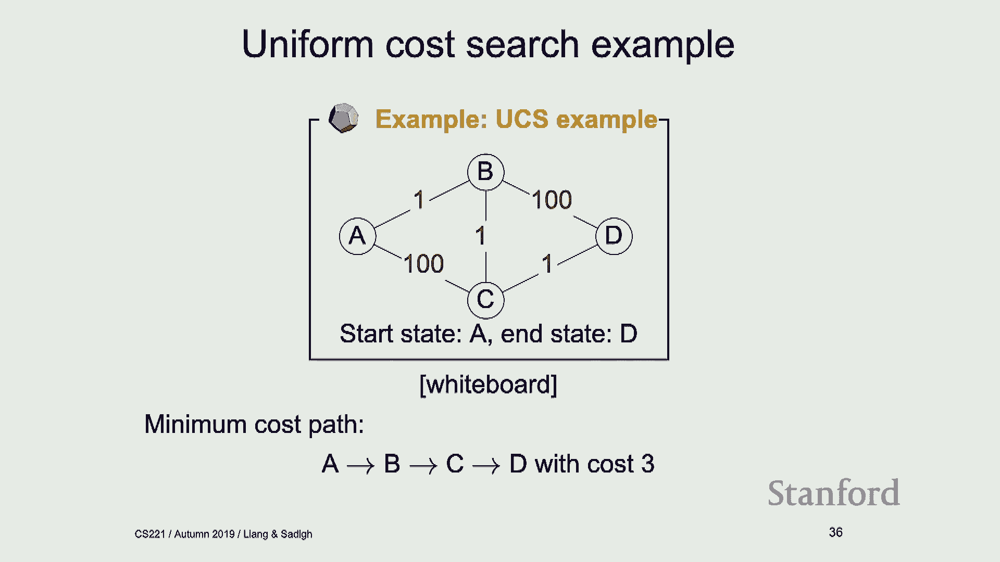


下节课我们将继续深入搜索问题的学习。