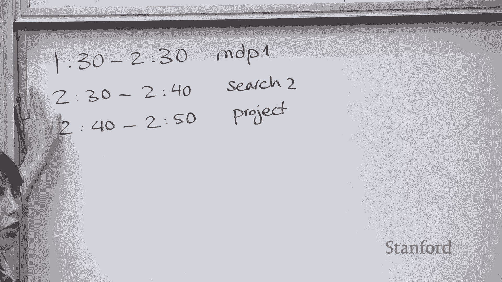

# 7：马尔可夫决策过程与价值迭代 🧠

在本节课中，我们将学习马尔可夫决策过程的基本概念，并重点介绍价值迭代算法。我们将从确定性搜索问题过渡到包含不确定性的决策问题，理解如何通过定义策略和价值函数来寻找最优决策方案。

---

## 从搜索问题到MDP 🔄

上一节我们讨论了确定性的搜索问题。在本节中，我们将引入不确定性，进入马尔可夫决策过程的世界。

在搜索问题中，我们从状态 `S` 采取行动 `A`，会确定性地转移到新状态 `S'`。其解决方案是一条确定的行动路径。

然而，现实世界充满不确定性。例如，选择交通方式时，可能会遇到堵车、延误等意外情况。MDP 正是为了对这种不确定性进行建模。

在 MDP 中，从状态 `S` 采取行动 `A` 后，会以一定的**转移概率** `T(s, a, s')` 随机进入多个可能的新状态 `S'` 之一。同时，每次转移会获得一个**即时奖励** `R(s, a, s')`。

MDP 的形式化定义包含以下要素：
*   **状态集合** `S`
*   **起始状态** `s_start`
*   **行动函数** `Actions(s)`，返回在状态 `s` 下可采取的行动
*   **转移概率** `T(s, a, s')`，表示在状态 `s` 采取行动 `a` 后转移到状态 `s'` 的概率
*   **奖励函数** `R(s, a, s')`，表示上述转移获得的即时奖励
*   **终止状态判断** `IsEnd(s)`
*   **折扣因子** `γ` (0 ≤ γ ≤ 1)，用于权衡当前奖励与未来奖励的重要性

与搜索问题的核心区别在于，我们用**概率性的转移**和**奖励**取代了确定性的后继函数和成本。

---

## MDP的解决方案：策略 📜

在确定性搜索中，解决方案是一条行动序列。但在MDP中，由于状态转移是随机的，我们无法预先确定一条固定路径。

MDP的解决方案是一个**策略** `π`。策略是一个函数，它为每个状态 `s` 指定一个应采取的行动 `a`。
`π(s) = a`

策略定义了在任何可能遇到的情况下，智能体应该怎么做。

---

## 评估策略：策略评估 📊

在寻找最优策略之前，我们先学习如何评估一个给定策略的好坏。

当我们遵循一个策略 `π` 时，会产生许多随机的状态路径。每条路径会获得一个**效用**，即该路径上所有奖励的（折扣）总和。
`Utility = R_1 + γ * R_2 + γ^2 * R_3 + ...`

由于路径是随机的，效用也是一个随机变量。因此，我们更关心其期望值，即**价值**。
`V^π(s)` 表示从状态 `s` 开始，遵循策略 `π` 所能获得的**期望效用**。

我们还可以定义 **Q 价值** `Q^π(s, a)`，表示在状态 `s` **采取行动 a**，然后遵循策略 `π` 所能获得的期望效用。

价值函数满足著名的 **贝尔曼期望方程**：

对于终止状态：
`V^π(s) = 0`，若 `IsEnd(s)` 为真。

对于非终止状态：
`V^π(s) = Q^π(s, π(s))`
`Q^π(s, a) = Σ_{s'} T(s, a, s') * [ R(s, a, s') + γ * V^π(s') ]`

合并后得到：
`V^π(s) = Σ_{s'} T(s, π(s), s') * [ R(s, π(s), s') + γ * V^π(s') ]`

这个方程表明，一个状态的价值等于“即时奖励的期望”加上“折扣后的未来状态价值的期望”。

我们可以通过**迭代策略评估**算法来求解 `V^π(s)`：

1.  将所有状态的价值 `V(s)` 初始化为 0。
2.  重复以下步骤直到收敛（例如，价值变化很小）：
    *   对于每个状态 `s`：
        *   如果 `s` 是终止状态：`V_new(s) = 0`
        *   否则：`V_new(s) = Σ_{s'} T(s, π(s), s') * [ R(s, π(s), s') + γ * V_old(s') ]`
3.  用 `V_new` 更新 `V_old`。

该算法会逐步将价值信息从终止状态向后传播，最终收敛到策略 `π` 的真实价值函数。

---

## 寻找最优策略：价值迭代 ⚡

上一节我们学会了如何评估一个给定策略。本节中，我们将主动寻找那个能获得最大期望效用的最优策略。

我们定义**最优价值函数** `V^*(s)`，它表示从状态 `s` 出发，**所有可能策略**中能获得的最大期望效用。
`V^*(s) = max_π V^π(s)`

相应地，定义**最优 Q 价值函数**：
`Q^*(s, a) = Σ_{s'} T(s, a, s') * [ R(s, a, s') + γ * V^*(s') ]`

最优价值函数满足 **贝尔曼最优方程**：

对于终止状态：
`V^*(s) = 0`，若 `IsEnd(s)` 为真。

对于非终止状态：
`V^*(s) = max_{a ∈ Actions(s)} Q^*(s, a)`
`Q^*(s, a) = Σ_{s'} T(s, a, s') * [ R(s, a, s') + γ * V^*(s') ]`

合并后得到：
`V^*(s) = max_{a ∈ Actions(s)} { Σ_{s'} T(s, a, s') * [ R(s, a, s') + γ * V^*(s') ] }`

一旦我们计算出 `V^*(s)`，**最优策略** `π^*(s)` 就是选择能最大化 Q 价值的行动：
`π^*(s) = argmax_{a ∈ Actions(s)} Q^*(s, a)`

**价值迭代**算法通过迭代方式求解贝尔曼最优方程：

1.  将所有状态的价值 `V(s)` 初始化为 0。
2.  重复以下步骤直到收敛：
    *   对于每个状态 `s`：
        *   如果 `s` 是终止状态：`V_new(s) = 0`
        *   否则：
            `V_new(s) = max_{a ∈ Actions(s)} { Σ_{s'} T(s, a, s') * [ R(s, a, s') + γ * V_old(s') ] }`
3.  用 `V_new` 更新 `V_old`。

算法收敛后，根据最优价值提取最优策略：
`π^*(s) = argmax_{a ∈ Actions(s)} { Σ_{s'} T(s, a, s') * [ R(s, a, s') + γ * V(s') ] }`

**价值迭代的核心思想**：通过不断迭代，将“未来最优可能回报”的信息从后往前传播，最终每个状态都能知晓选择哪个行动能导向期望回报最高的未来。

---

## 关于折扣因子与收敛性 ⚖️

**折扣因子 `γ`** 是一个介于 0 和 1 之间的数，它决定了我们对未来奖励的重视程度。
*   `γ = 0`：只关心即时奖励，完全“短视”。
*   `γ = 1`：未来奖励与当前奖励同等重要。
*   `0 < γ < 1`：未来奖励有价值，但距离越远，其现值越低。这是一种常见且合理的设定。

**收敛性保证**：
*   如果 MDP 的状态转移图是**无环**的，价值迭代保证收敛。
*   如果 MDP 包含循环，则需要**折扣因子 `γ < 1`** 来保证价值迭代收敛。`γ < 1` 可以防止无限循环中的奖励总和趋于无穷，确保计算稳定性。

---

## 总结 🎯

本节课中我们一起学习了：
1.  **马尔可夫决策过程**：对具有不确定性的序列决策问题进行建模，核心要素是状态、行动、转移概率和奖励。
2.  **策略**：MDP 的解决方案，是状态到行动的映射。
3.  **策略评估**：计算给定策略的价值函数（期望效用）的迭代方法。
4.  **价值迭代**：通过迭代求解贝尔曼最优方程，直接计算最优价值函数，并从中提取最优策略的算法。

我们从确定性搜索过渡到概率性决策，理解了在不确定性下如何通过衡量期望效用来做出理性选择。价值迭代为我们提供了一种计算最优策略的有效方法。

下一讲我们将进入**强化学习**，探讨当转移概率和奖励函数未知时，如何通过与环境的交互来学习最优策略。