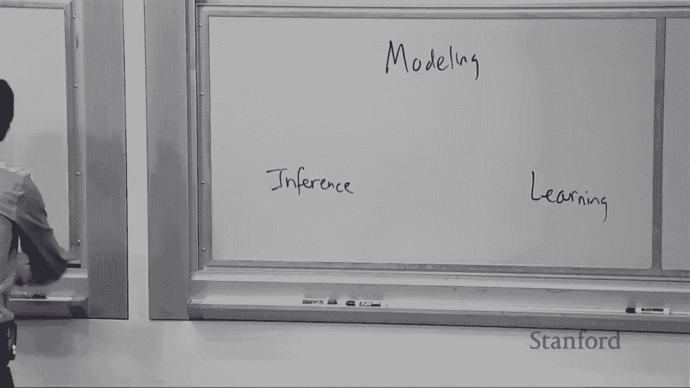
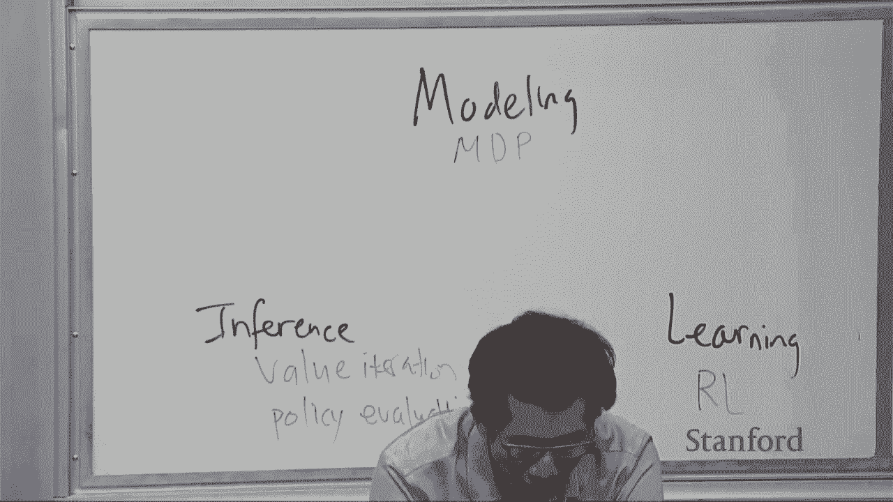
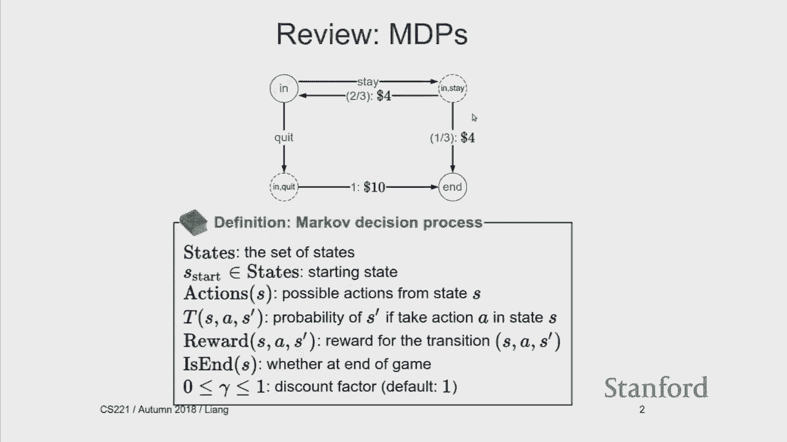
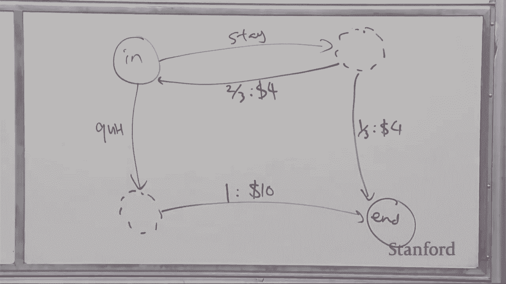

# 8：强化学习入门 🎓 

在本节课中，我们将学习强化学习的基本概念和核心算法。强化学习是机器学习的一个重要分支，它关注智能体如何在与环境的交互中，通过试错来学习最优策略，以最大化累积奖励。

---

## 🔍 强化学习概览

上一节课我们介绍了马尔可夫决策过程，它是一种建模框架。本节课我们将探讨如何学习这些模型，即强化学习。

强化学习与之前学习的模型不同，它不直接提供环境的完整模型（如转移概率和奖励函数），而是要求智能体通过与环境交互来学习。

---

## 📊 马尔可夫决策过程回顾

在深入强化学习之前，我们先回顾一下马尔可夫决策过程的核心概念。

一个MDP由以下部分组成：
*   **状态集合**：例如，在骰子游戏中，状态可以是“游戏中”或“结束”。
*   **动作集合**：从每个状态可以执行的动作，例如“继续”或“退出”。
*   **转移概率**：执行动作后，从一个状态转移到另一个状态的概率。
*   **奖励函数**：在状态转移过程中获得的即时奖励。
*   **折扣因子**：一个介于0和1之间的数，表示对未来奖励的重视程度，通常用 `γ` 表示。

策略 `π` 是一个从状态到动作的映射，它告诉智能体在每个状态下应该采取什么行动。遵循一个策略会产生一个**回合**，即一系列状态、动作和奖励的序列。

我们关注两个核心价值函数：
*   **状态价值函数 `V^π(s)`**：从状态 `s` 开始，遵循策略 `π` 所能获得的期望累积奖励。
*   **动作价值函数 `Q^π(s, a)`**：从状态 `s` 开始，先执行动作 `a`，然后遵循策略 `π` 所能获得的期望累积奖励。

它们之间的关系可以通过贝尔曼方程来描述：
`V^π(s) = Q^π(s, π(s))`
`Q^π(s, a) = Σ_{s'} T(s, a, s') [ R(s, a, s') + γ * V^π(s') ]`

---

## 🤖 强化学习范式

在强化学习中，智能体与环境不断交互：
1.  智能体观察当前状态 `s`。
2.  智能体根据某种策略选择一个动作 `a` 并执行。
3.  环境返回一个即时奖励 `r` 和新的状态 `s'`。
4.  智能体根据这个经验 `(s, a, r, s')` 更新其对世界的认知（模型或价值估计）。

这引出了两个核心问题：
1.  **行为策略**：在当前状态下，我应该选择哪个动作？（探索与利用的权衡）
2.  **参数更新**：如何根据新的经验更新我的模型或价值估计？

---

## 📈 强化学习算法

我们将介绍四类主要的强化学习算法，它们从不同角度解决学习问题。

### 1. 基于模型的蒙特卡洛方法

这种方法的核心思想是：通过交互数据直接估计MDP的模型参数（转移概率 `T` 和奖励 `R`），然后利用上节课的规划算法（如价值迭代）求解最优策略。

以下是具体步骤：
*   **估计转移概率**：对于每个 `(s, a, s')`，统计从 `(s, a)` 转移到 `s'` 的次数，除以执行 `(s, a)` 的总次数。
    `T̂(s, a, s') = Count(s, a, s') / Σ_{s''} Count(s, a, s'')`
*   **估计奖励**：对于每个 `(s, a, s')`，记录观察到的奖励，可以直接使用或取平均。
*   **求解MDP**：使用估计出的 `T̂` 和 `R̂` 构建MDP，然后运行价值迭代等算法得到最优策略。

**局限性**：如果行为策略没有充分探索所有状态-动作对，那么某些部分的模型将永远无法被准确估计，可能导致错过潜在的高奖励区域。

---

### 2. 免模型的蒙特卡洛方法

我们不一定需要估计完整的MDP模型。如果我们能直接估计出最优策略的动作价值函数 `Q*`，那么最优策略就是选择每个状态下 `Q*` 值最大的动作。

作为热身，我们先学习如何估计一个给定策略 `π` 的动作价值函数 `Q^π`。免模型蒙特卡洛法的思想很简单：对于每个状态-动作对 `(s, a)`，只考虑那些在回合中首次访问到 `(s, a)` 的时间点，然后计算从该时间点开始直到回合结束所获得的实际累积奖励（即回报 `G_t`），最后对所有这样的回报取平均值。

更新公式可以写作增量平均的形式：
`Q^π(s, a) ← Q^π(s, a) + α * (G_t - Q^π(s, a))`
其中 `α` 是学习率，`G_t` 是实际观测到的回报。

**特点**：
*   **同策略**：评估的策略就是产生数据的策略。
*   **无偏**：估计值收敛于真实的 `Q^π`。
*   **高方差**：因为依赖于单个回合的完整回报，波动可能很大。
*   **必须等待回合结束**：需要完整的轨迹才能计算 `G_t`。

---

### 3. 时序差分学习：Sarsa

为了降低方差并实现单步更新，我们引入**自举**的思想。Sarsa算法使用当前的估计值 `Q^π` 来构造更新目标，而不是等待完整的实际回报。

其更新基于五元组 `(s, a, r, s', a')`，其中 `a'` 是下一时间步根据当前策略 `π` 选择的动作。更新公式为：
`Q^π(s, a) ← Q^π(s, a) + α * [ r + γ * Q^π(s', a') - Q^π(s, a) ]`
目标值 `r + γ * Q^π(s', a')` 被称为**时序差分目标**。

**与蒙特卡洛法的对比**：
*   **方差更低**：目标值基于现有估计，而非单一路径的随机回报。
*   **可在线更新**：每得到一个 `(s, a, r, s', a')` 就可以立即更新，无需等待回合结束。
*   **有偏**：因为目标值依赖于估计值 `Q^π`，而 `Q^π` 本身可能不准确。
*   **同策略**：评估和行动是同一个策略。

---

### 4. Q学习

Sarsa评估的是给定策略的价值，而Q学习直接学习**最优**动作价值函数 `Q*`。它是强化学习中最著名的算法之一。

Q学习的更新公式与Sarsa类似，但目标值的计算不同：
`Q*(s, a) ← Q*(s, a) + α * [ r + γ * max_{a'} Q*(s', a') - Q*(s, a) ]`
注意，这里我们使用了下一状态 `s'` 下所有可能动作的最大 `Q*` 值，而不是根据某个策略选出的具体动作 `a'` 的值。

**与Sarsa的对比**：
*   **异策略**：Q学习评估的是最优策略的价值，而用于生成数据的行动策略可以是任何探索性策略（如ε-贪心策略）。这使得它能够“离线”学习最优行为。
*   **直接学习最优值**：更新目标模拟了贝尔曼最优方程。

---

## ⚖️ 探索与利用的权衡

上述算法假设我们能够获得覆盖所有状态-动作对的数据。但在实践中，智能体必须自己决定如何行动以收集数据，这就引出了**探索-利用困境**。

*   **纯利用**：总是选择当前估计价值最高的动作。风险是可能陷入局部最优，永远发现不了真正更好的动作。
*   **纯探索**：总是随机选择动作。可以充分了解环境，但无法获得高累积奖励。

**ε-贪心策略**是一种简单有效的平衡方法：
*   以 `1 - ε` 的概率选择当前认为最好的动作（利用）。
*   以 `ε` 的概率随机选择一个动作（探索）。

通常，ε 会随着时间衰减，初期侧重探索，后期侧重利用。

---

## 🧠 大规模状态空间与函数近似

当状态空间非常庞大时（例如围棋棋盘状态、游戏像素画面），不可能遍历所有状态-动作对。此时，我们需要让智能体能够**泛化**，即对未见过但相似的状态做出合理估计。

解决方案是使用**函数近似**，例如线性函数或神经网络，来参数化 `Q` 函数：
`Q(s, a; w) ≈ w · φ(s, a)`
其中 `φ(s, a)` 是状态-动作对的特征向量，`w` 是权重参数。

以Q学习为例，更新规则变为对权重 `w` 的更新：
`w ← w + α * [ r + γ * max_{a'} Q(s', a'; w) - Q(s, a; w) ] * ∇_w Q(s, a; w)`
对于线性函数近似，`∇_w Q(s, a; w) = φ(s, a)`，因此更新简化为：
`w ← w + α * [ r + γ * max_{a'} Q(s', a'; w) - Q(s, a; w) ] * φ(s, a)`
这非常类似于线性回归中的随机梯度下降。

---

## 📚 总结与拓展

本节课我们一起学习了强化学习的基础。我们从MDP的回顾开始，理解了强化学习智能体与环境交互的范式。接着，我们系统学习了四种核心算法：
1.  **基于模型的蒙特卡洛法**：通过数据估计MDP，然后进行规划。
2.  **免模型蒙特卡洛法**：直接通过平均回报来评估策略价值。
3.  **Sarsa**：使用时序差分自举进行同策略的策略评估。
4.  **Q学习**：使用时序差分自举进行异策略的最优价值函数学习。

我们还探讨了强化学习中的两大关键挑战：
*   **探索与利用**：通过ε-贪心等策略进行平衡。
*   **大规模状态空间**：通过函数近似（如线性模型、深度学习）实现泛化。

强化学习的核心思想可以概括为**蒙特卡洛**（从经验中平均学习）和**自举**（用自身估计更新自身）。它处于监督学习（全反馈、无状态）和更复杂序列决策问题的交叉点。深度强化学习（如DQN）将深度学习与Q学习结合，在Atari游戏、围棋等领域取得了突破性进展。其他高级方法还包括直接优化策略的**策略梯度**方法，以及结合价值与策略学习的**Actor-Critic**框架。

强化学习因其处理序列决策、延迟奖励和探索挑战的能力，成为人工智能迈向通用智能的关键路径之一。