# 9：游戏博弈1 - Minimax与Alpha-beta剪枝 🎮 


在本节课中，我们将学习如何为双人、零和、回合制、完全可观察的游戏（如国际象棋）进行建模和求解。我们将介绍游戏树、Minimax算法及其变体，并探讨如何通过评估函数和Alpha-beta剪枝来提高计算效率。

---

## 📝 游戏的形式化定义

上一节我们通过一个“选桶”的例子引入了游戏的概念。本节中，我们将正式定义游戏所需的组件。

一个双人零和游戏可以形式化为以下元素：
*   **玩家**：包括**智能体**（我们控制的角色）和**对手**。
*   **状态 `S`**：包含游戏的所有信息，例如棋盘布局和当前轮到哪位玩家。
*   **起始状态 `START`**：游戏的初始状态。
*   **动作函数 `ACTIONS(s)`**：在状态 `s` 下，当前玩家可以执行的所有合法动作。
*   **后继函数 `SUCCESSOR(s, a)`**：执行动作 `a` 后到达的新状态。
*   **终止判断 `IS_END(s)`**：检查状态 `s` 是否为游戏结束状态。
*   **效用函数 `UTILITY(s)`**：在终止状态 `s` 下，智能体获得的收益（对手的收益是此值的相反数）。
*   **玩家函数 `PLAYER(s)`**：返回在状态 `s` 下该行动的玩家。

以国际象棋为例：
*   状态 `S` 编码了所有棋子的位置和当前回合的玩家。
*   动作是所有合法的走子。
*   终止状态是将军或和棋。
*   效用函数可以是：智能体（白方）赢为 `+∞`，和棋为 `0`，输为 `-∞`。

游戏有两个关键特征：
1.  效用只在游戏终止时获得。
2.  不同玩家在不同状态下拥有控制权。


---

## 🤖 策略与评估

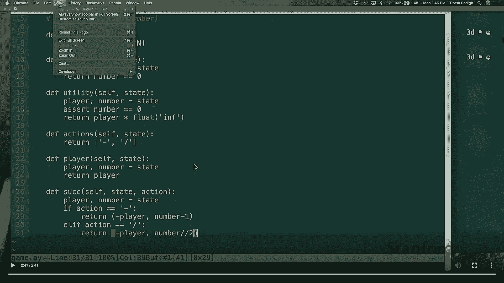

在马尔可夫决策过程中，解决方案是一个策略。在游戏中，由于有两位玩家，我们需要为每位玩家定义策略。

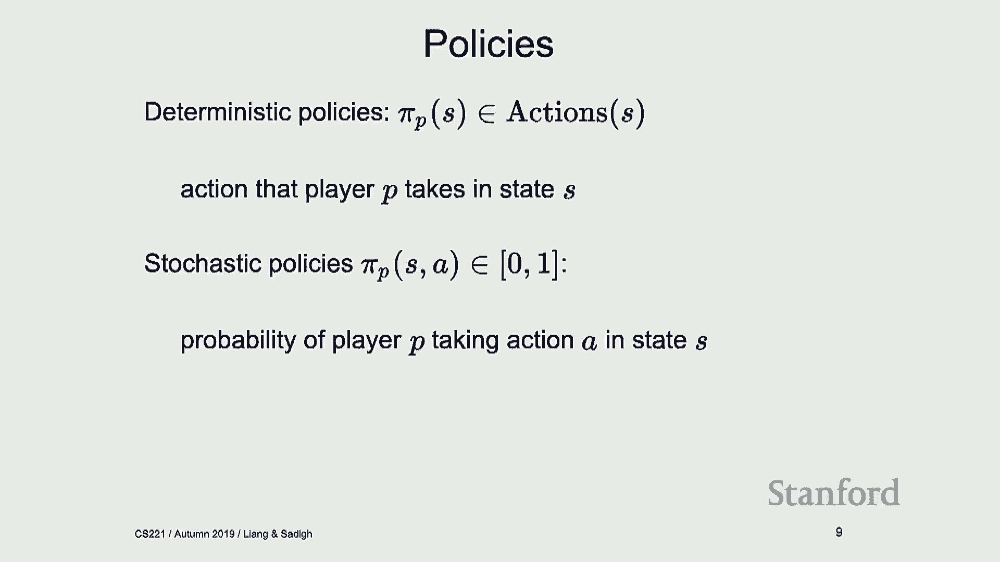

策略 `π` 可以是确定性的，给定状态返回一个动作；也可以是随机性的，给定状态和动作返回执行该动作的概率。

当我们已知智能体和对手的策略时，我们可以评估从某个状态开始，遵循这些策略所能获得的期望效用。这类似于MDP中的**策略评估**。

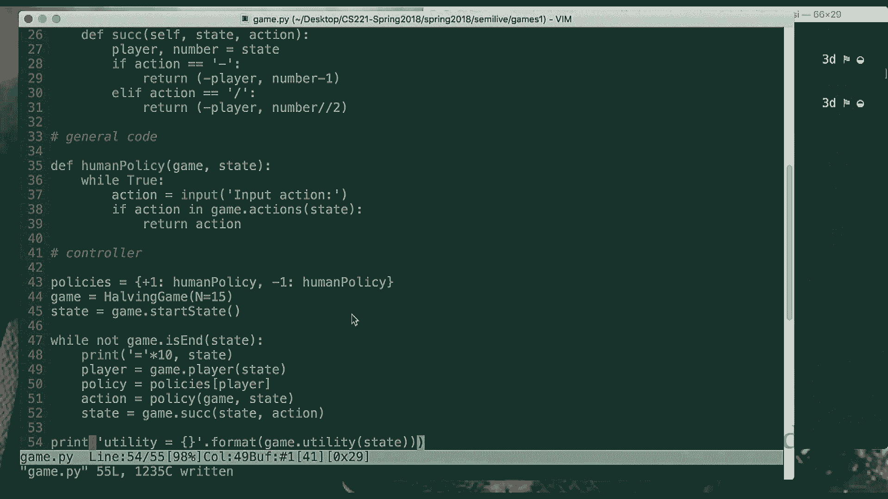

以下是计算给定策略下状态价值 `V_eval(s)` 的递归公式：

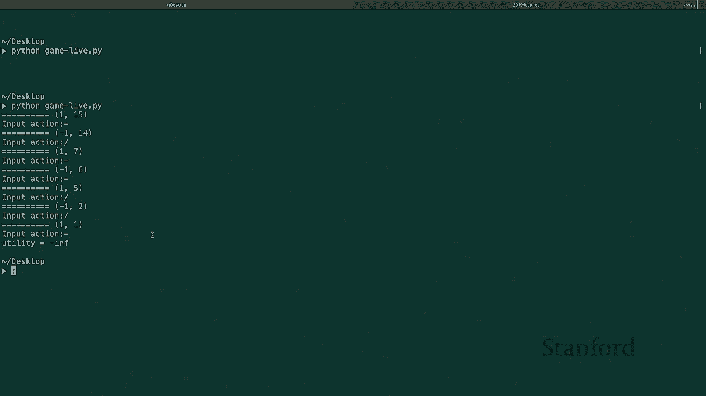

```python
if IS_END(s):
    return UTILITY(s)
if PLAYER(s) == AGENT:
    # 智能体按其策略的期望行动
    return sum_over_actions( π_agent(s, a) * V_eval(SUCCESSOR(s, a)) )
else: # PLAYER(s) == OPPONENT
    # 对手按其策略的期望行动
    return sum_over_actions( π_opponent(s, a) * V_eval(SUCCESSOR(s, a)) )
```

---

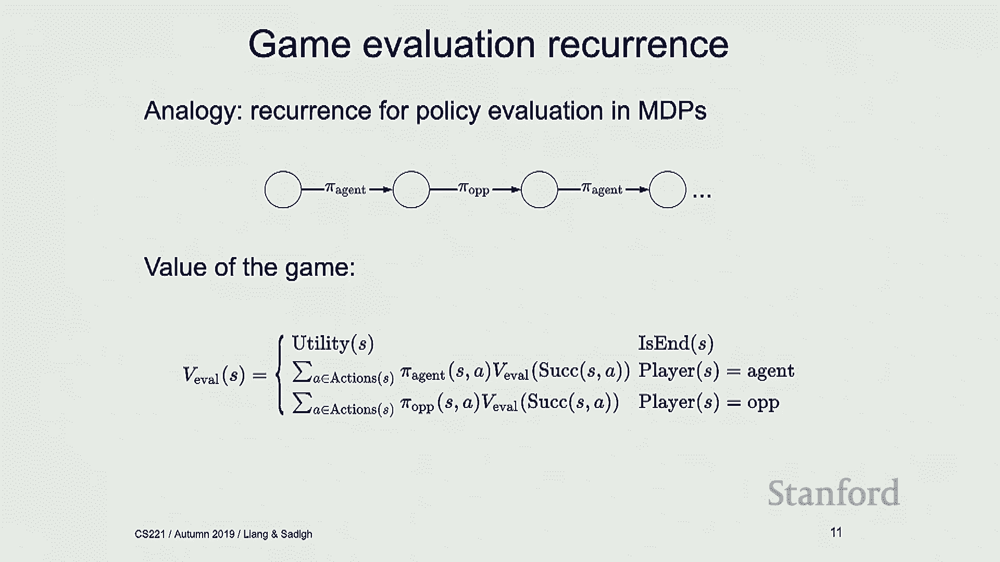

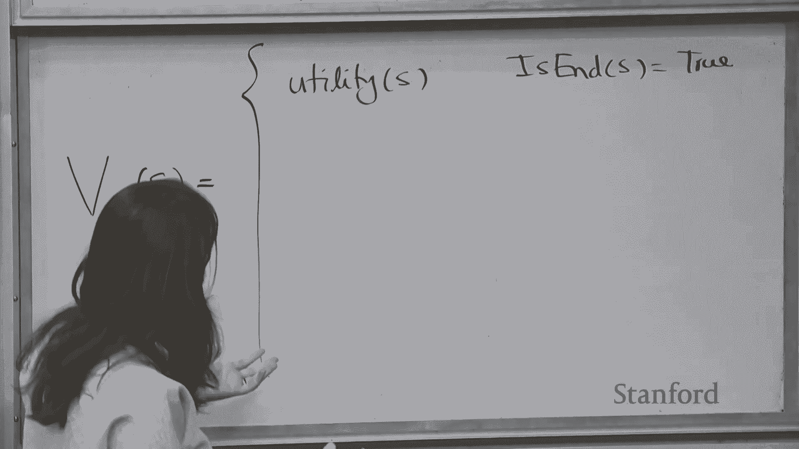

## ⬆️ Expectimax：已知对手策略时的最优应对

然而，通常我们不知道对手的确切策略。一种假设是，我们**知道**对手会遵循某个随机策略 `π_opp`（例如，在“选桶”例子中以50%概率选择左边或右边的数字）。在这种情况下，作为智能体，我们应该选择能最大化自身期望效用的动作。

这引出了 **Expectimax** 算法。其状态价值 `V_expectimax(s)` 的计算如下：

```python
if IS_END(s):
    return UTILITY(s)
if PLAYER(s) == AGENT:
    # 智能体选择最大化期望效用的动作
    return max_over_actions( V_expectimax(SUCCESSOR(s, a)) )
else: # PLAYER(s) == OPPONENT
    # 对手按其已知策略π_opp随机行动
    return sum_over_actions( π_opp(s, a) * V_expectimax(SUCCESSOR(s, a)) )
```

在“选桶”例子中，若已知对手随机选择，则各桶的期望值分别为0、2、5。智能体会选择期望值最大的桶C，此时 `V_expectimax(起始状态) = 5`。

---

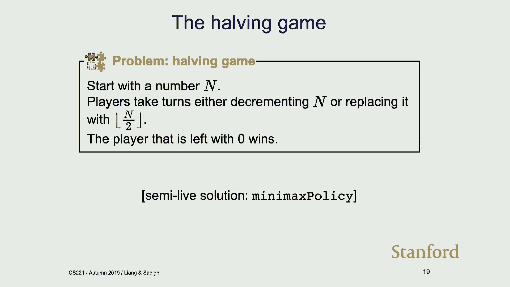

## ⬇️ Minimax：对抗性对手下的最优策略

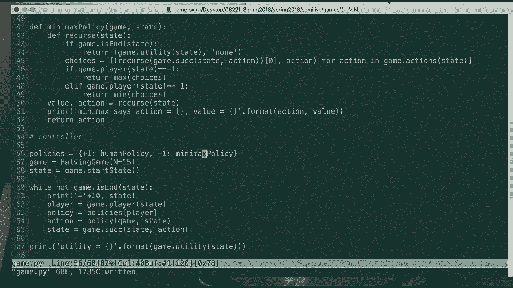

更常见且保守的假设是，对手是**对抗性**的，总是试图最小化智能体的效用。这就是 **Minimax** 算法的核心思想。

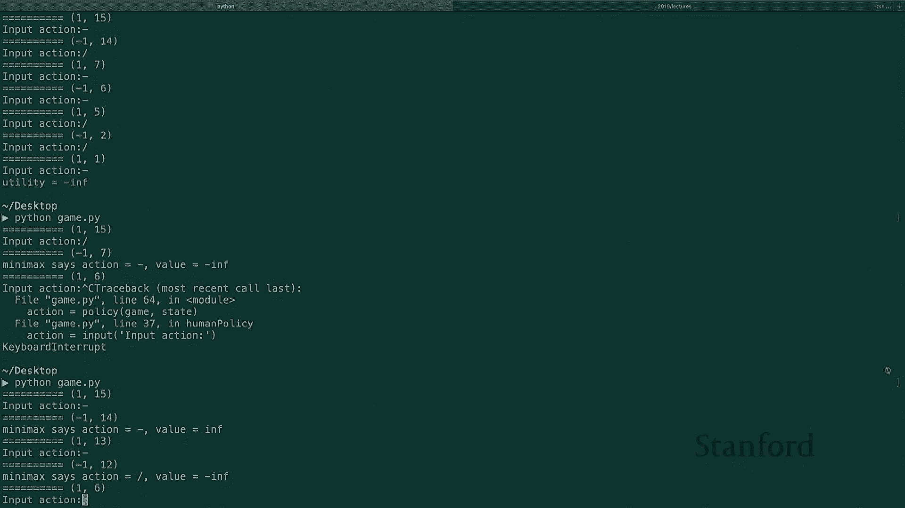

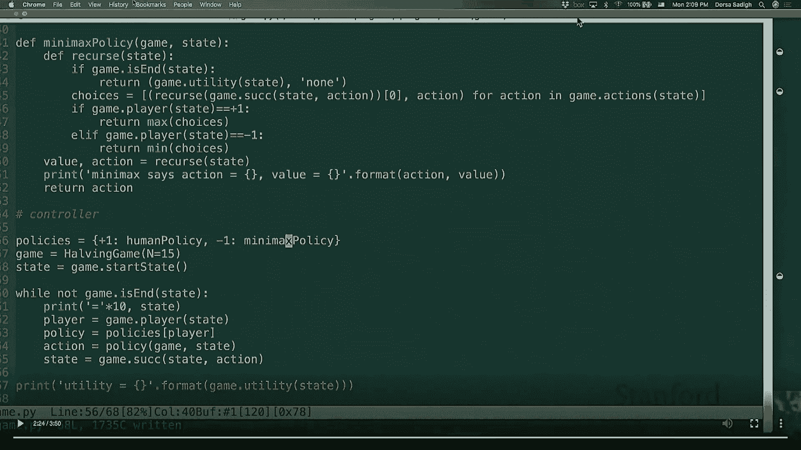

在Minimax中，智能体（最大化方）和对手（最小化方）交替行动，各自优化自己的目标。其状态价值 `V_minimax(s)` 的递归定义为：

```python
if IS_END(s):
    return UTILITY(s)
if PLAYER(s) == AGENT:
    # 智能体（Max方）选择最大化价值的动作
    return max_over_actions( V_minimax(SUCCESSOR(s, a)) )
else: # PLAYER(s) == OPPONENT
    # 对手（Min方）选择最小化价值的动作
    return min_over_actions( V_minimax(SUCCESSOR(s, a)) )
```

智能体的最优策略 `π_max(s)` 就是达到 `V_minimax(s)` 最大值的动作：`argmax_a V_minimax(SUCCESSOR(s, a))`。

在“选桶”例子中，假设对手总是选择桶中最小的数字，则各桶的最小值分别为-50、1、-5。智能体会选择这些最小值中最大的那个，即桶B，此时 `V_minimax(起始状态) = 1`。

---

## 🔄 Minimax 与 Expectimax 的性质比较

我们可以比较在不同策略组合下，从起始状态获得的价值。用 `π_max` 表示智能体的Minimax策略，`π_min` 表示对手的Minimax（最小化）策略，`π_七` 表示某个其他策略（如随机策略）。

以下是几个重要性质（以“选桶”游戏数值为例）：
1.  **上界性质**：`V(π_max, π_min) >= V(π_expectimax(七), π_min)`。即当对手确实是最小化者时，采用Minimax策略是最优的（例：1 >= -5）。
2.  **下界性质**：`V(π_max, π_min) <= V(π_max, π_七)`。即当对手并非最小化者时，采用Minimax策略获得的价值是一个保守下界（例：1 <= 2）。
3.  **先验知识优势**：`V(π_max, π_七) <= V(π_expectimax(七), π_七)`。即如果你知道对手的策略并据此优化（Expectimax），那么当对手确实遵循该策略时，你会获得更好的结果（例：2 <= 5）。

这些性质表明，**如果你拥有关于对手行为的可靠知识，使用Expectimax通常比使用保守的Minimax更好**。

---

## 🎲 引入随机性：Expectiminimax

游戏可能包含随机因素，例如掷骰子。我们可以引入“自然”作为第三方玩家，其策略是固定的（如50%概率）。这形成了 **Expectiminimax** 树，其中包含Max节点、Min节点和Chance（期望）节点。

算法只需在递归中增加对Chance节点的处理分支，计算其期望值即可。核心结构不变。

---

## ⚡ 提升计算效率

对于像国际象棋这样的游戏，博弈树的分支因子 `B` 很大（约35），深度 `D` 也很深（约50）。完整的Minimax搜索时间复杂度为 `O(B^(2D))`，这是不可行的。我们需要方法来加速。

### 方法一：评估函数
我们不搜索到终止状态，而是设置一个深度限制。当达到深度限制时，我们调用一个**评估函数 `EVAL(s)`** 来估计当前状态 `s` 的 `V_minimax(s)` 值。

评估函数利用领域知识，通过加权求和一组特征值来近似状态价值。例如，在国际象棋中，特征可能包括：
*   棋子数量差异（己方-对方）
*   棋子机动性差异
*   王的安全度
*   中心控制力

评估函数类似于搜索问题中的启发式函数，但它没有最优性保证。

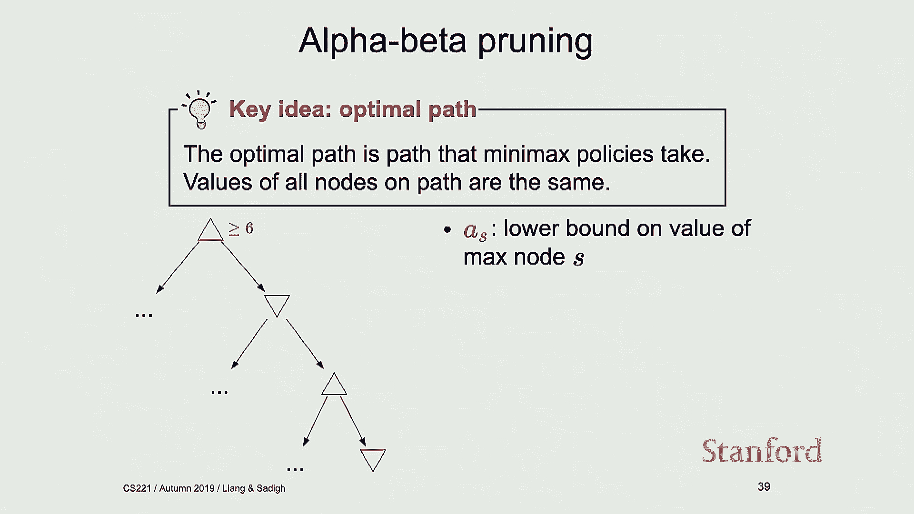

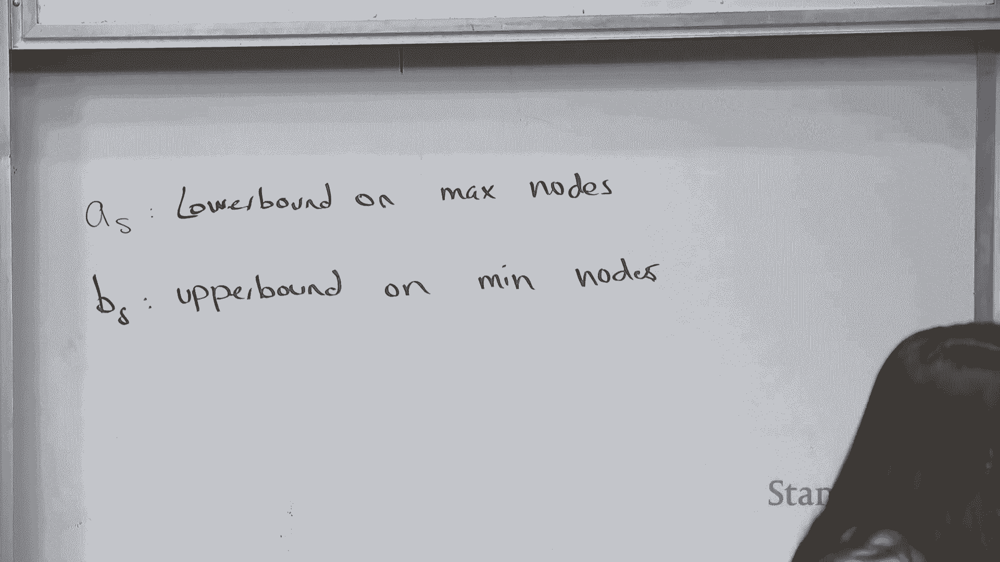

### 方法二：Alpha-beta 剪枝
**Alpha-beta剪枝**是一种通过避免搜索不可能影响最终决策的分支来修剪博弈树的技术。

核心思想是维护两个值：
*   **α**：对于Max节点，是当前搜索路径上已探索到的**效用下界**。Max节点至少能得到α。
*   **β**：对于Min节点，是当前搜索路径上已探索到的**效用上界**。Min节点至多能得到β。

在搜索过程中，如果发现某个节点的 α >= β，就意味着从该节点出发的子树中，不存在任何一条路径的效用值能同时满足Max节点的下界和Min节点的上界，即这条路径不可能成为最优路径的一部分，因此可以**剪枝**——停止探索该节点的其余后继。

**节点顺序至关重要**。最优的节点排序（对于Max节点，按评估值降序探索；对于Min节点，按评估值升序探索）可以将搜索复杂度降至约 `O(B^D)`，相当于搜索深度翻倍。即使随机排序，平均性能也远优于最坏情况。

---

## 📚 总结

本节课中我们一起学习了：
1.  **游戏的形式化**：如何用状态、动作、玩家、效用等组件定义双人零和回合制游戏。
2.  **策略评估**：在给定双方策略时，如何计算状态的期望效用。
3.  **Expectimax算法**：当已知对手策略时，智能体如何通过最大化期望效用来行动。
4.  **Minimax算法**：当假设对手对抗性时，智能体（Max）与对手（Min）交替优化，以及如何计算状态价值和最优策略。
5.  **算法性质**：比较了不同策略假设下的价值边界，强调了利用对手先验知识的好处。
6.  **效率提升**：面对巨大博弈树时，如何使用**评估函数**进行深度限制搜索，以及如何运用**Alpha-beta剪枝**技术来避免不必要的搜索，大幅提升效率。


理解这些基础算法是构建更复杂游戏AI的基石。在下节课中，我们将探讨游戏中的学习问题。