# 11：因子图 1 - 约束满足问题 🧩

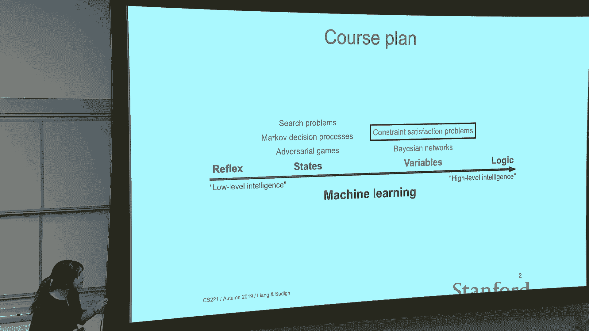

在本节课中，我们将学习一种新的建模框架——**变量模型**，特别是**因子图**和**约束满足问题**。我们将了解它们与之前学过的状态模型有何不同，并学习如何用这种新框架来建模和解决特定类型的问题。

---

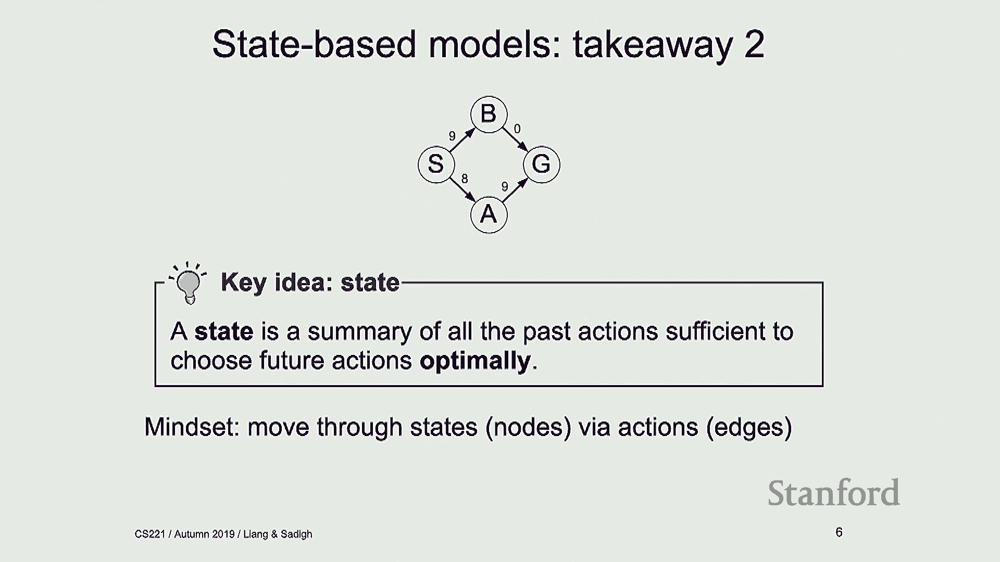

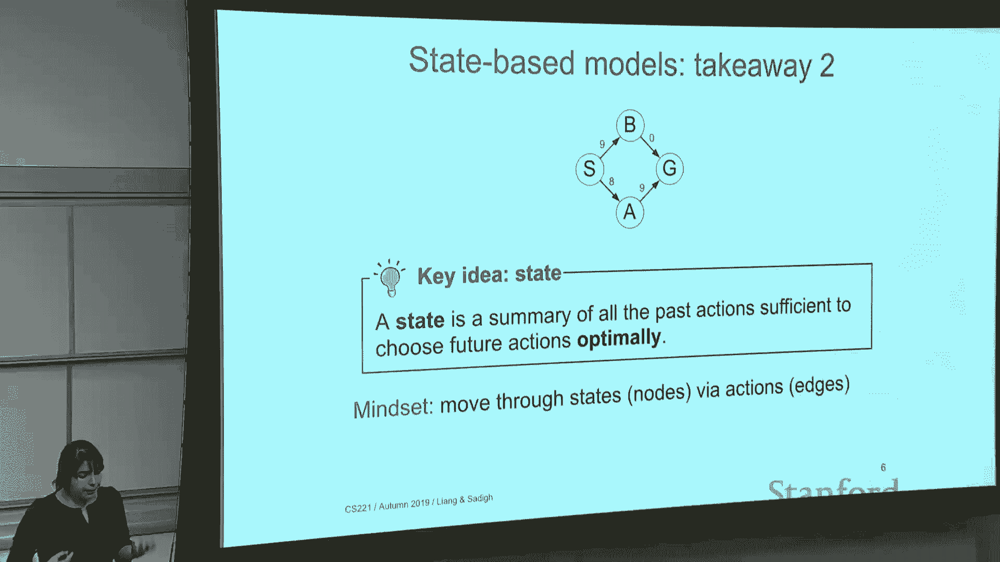

## 概述：从状态模型到变量模型

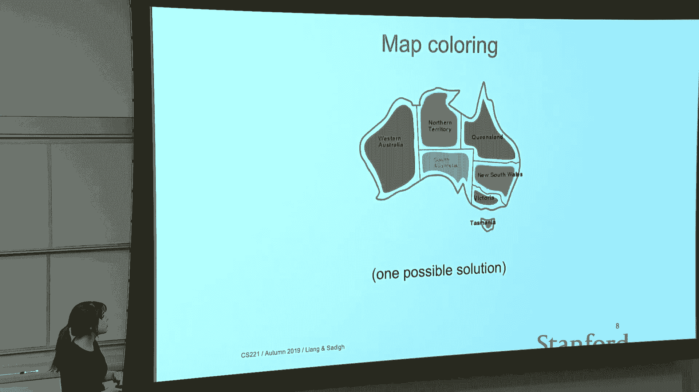

到目前为止，我们讨论的模型（如搜索问题、MDP、对抗游戏）都属于**状态模型**。状态模型的核心是**状态**，它是对过去所有行动的总结，足以让我们为未来做出最优决策。我们通过**行动**在状态之间移动，并寻找最优的行动序列。

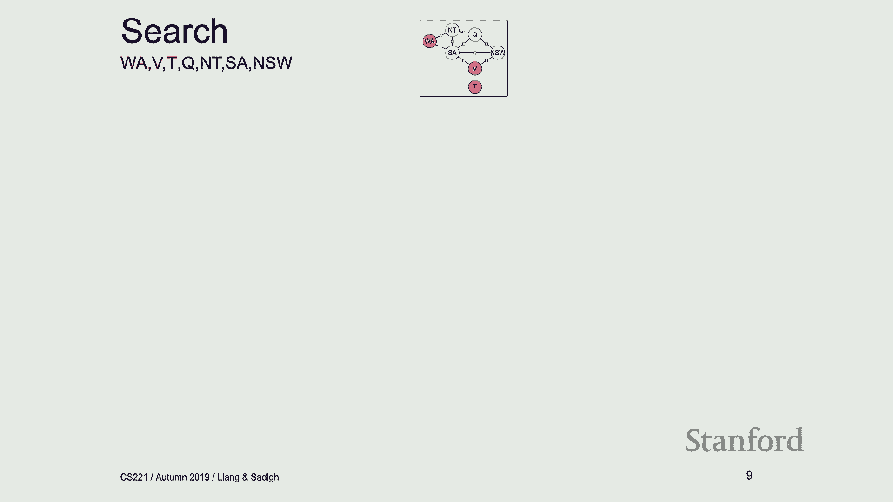

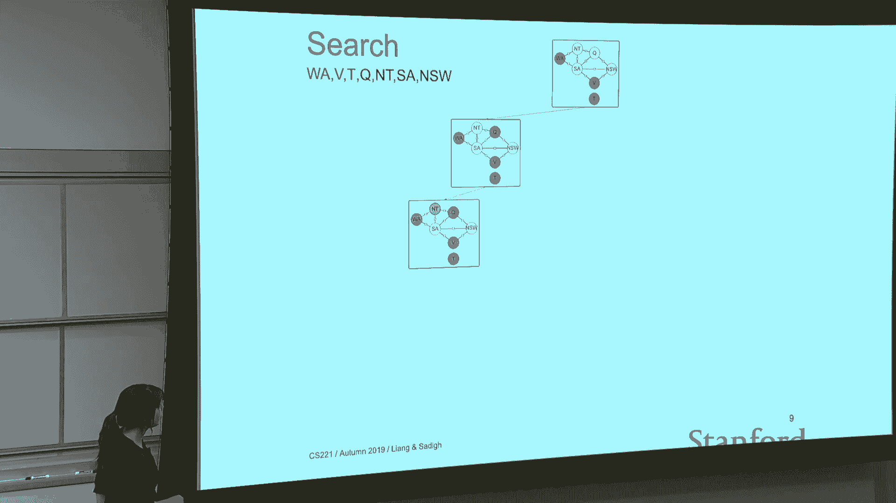

然而，有一类问题，其核心不在于行动的**顺序**，而在于满足一系列**约束**。例如，地图着色问题要求为每个省份分配颜色，并满足相邻省份颜色不同的约束。解决这类问题时，我们并不关心先给哪个省份着色，只关心最终能否满足所有约束。

这种特点促使我们引入**变量模型**。在变量模型中，我们不再关注状态和行动序列，而是直接定义**变量**和它们的**赋值**，并通过**因子**（或**约束**）来描述变量之间的关系。这提供了更高层次的抽象，使建模更简单，而将变量和值的**选择顺序**问题推给了推理算法去处理。

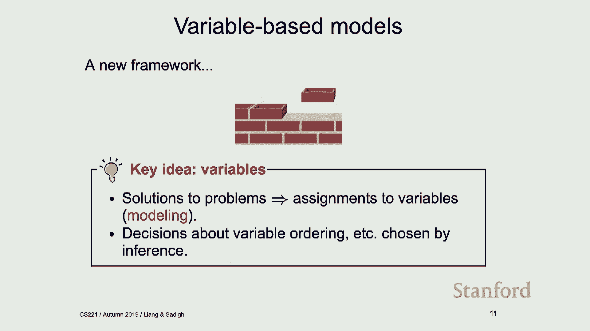

---

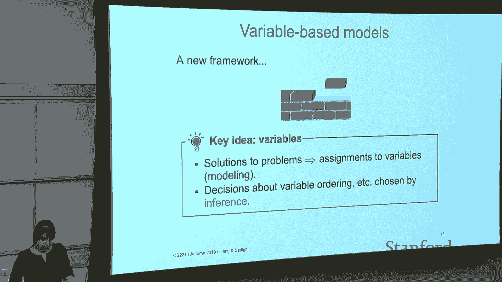

## 什么是因子图？📊

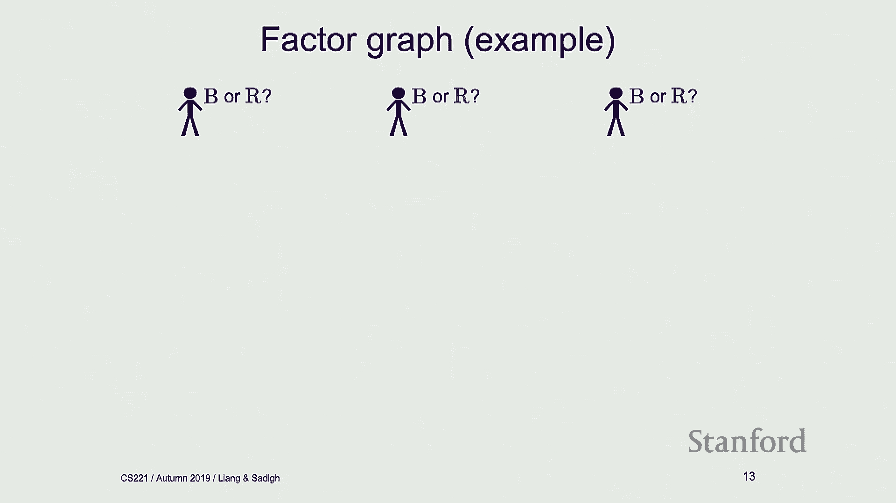

因子图是一种用于表示变量模型的图形化工具。它由两部分组成：**变量**和**因子**。

### 核心定义

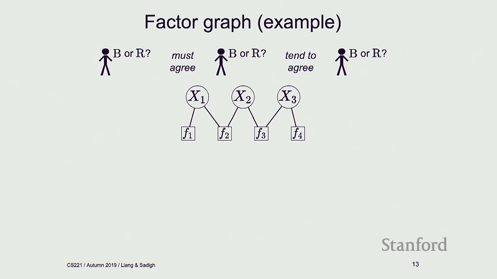

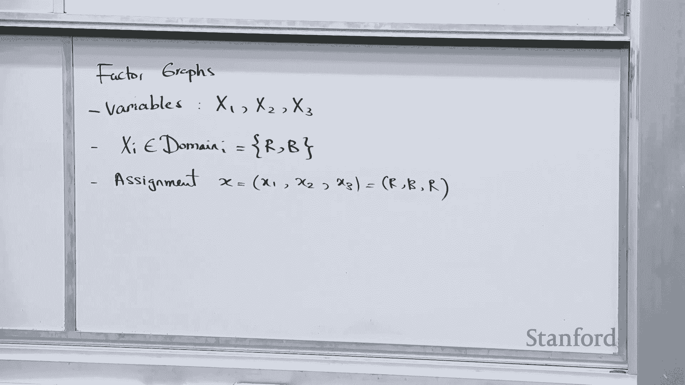

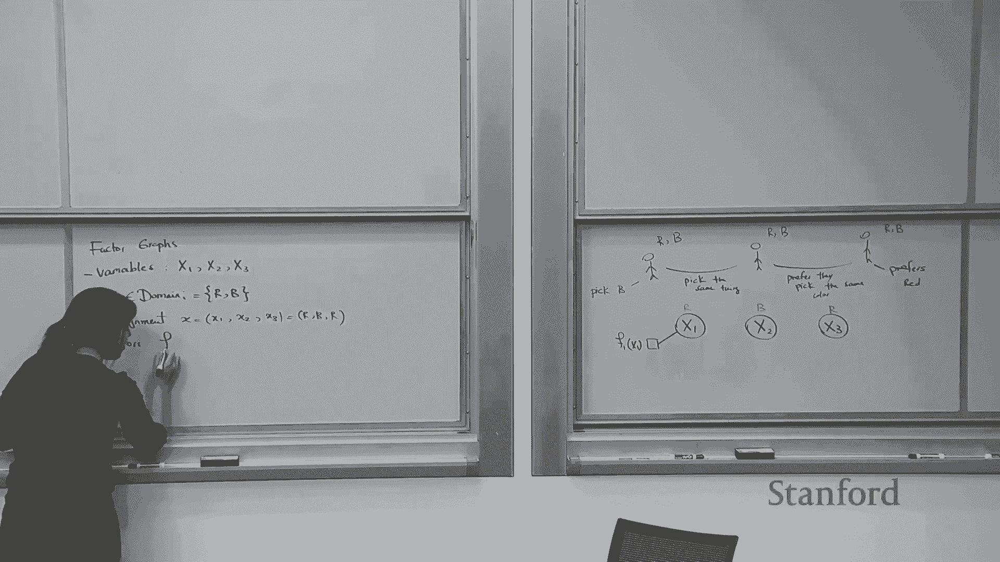

*   **变量**：用大写字母表示，例如 `X1, X2, ...`。每个变量 `Xi` 都有一个**定义域**，即它可以取值的集合。
*   **因子**：用小写字母 `f` 表示，例如 `f1, f2, ...`。每个因子是一个**非负函数**，其输入是它所依赖的一组变量（称为该因子的**作用域**），输出表示该变量组合的“满意度”或“权重”。
*   **赋值**：为所有变量分配具体值的过程。一个完整的赋值用小写 `x` 表示。
*   **赋值的权重**：一个赋值 `x` 的权重是所有因子在该赋值下输出值的**乘积**。我们的目标是找到权重最大的赋值。

**公式**：权重计算
`weight(x) = ∏_{j=1}^{m} f_j(x)`

### 因子图示例

假设有三个人（`X1, X2, X3`）每人选择红色或蓝色，并有以下偏好和约束：
1.  `X1` 强烈希望选蓝色。
2.  `X1` 和 `X2` 必须选相同颜色。
3.  `X2` 和 `X3` 最好选相同颜色。
4.  `X3` 倾向于选红色。

我们可以用因子图表示如下：
*   **变量**：`X1`, `X2`, `X3`，定义域均为 `{红, 蓝}`。
*   **因子**：
    *   `f1(X1)`：若 `X1=蓝` 则输出 1，否则为 0。
    *   `f2(X1, X2)`：若 `X1 = X2` 则输出 1，否则为 0。
    *   `f3(X2, X3)`：若 `X2 = X3` 则输出 3（更满意），否则输出 2。
    *   `f4(X3)`：若 `X3=红` 则输出 2，否则为 1。

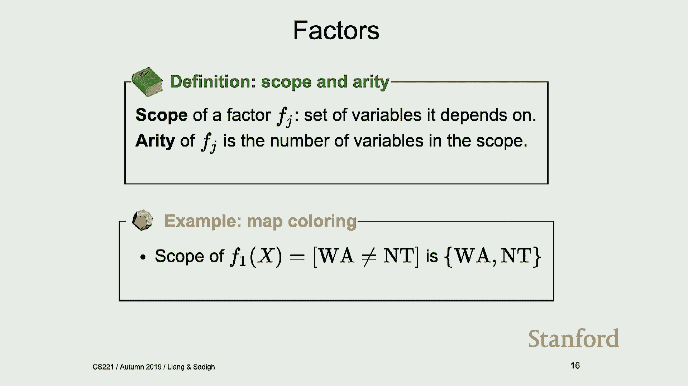

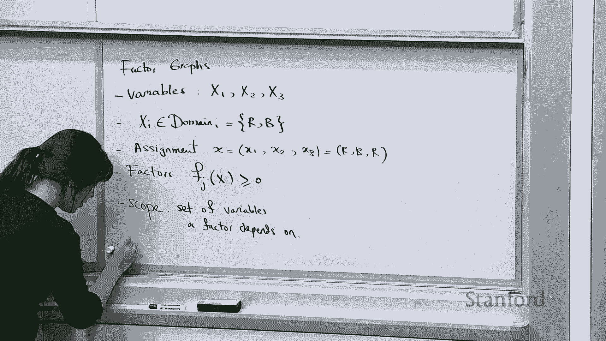

通过计算不同赋值的权重，我们可以找到最令人满意的颜色组合。

---

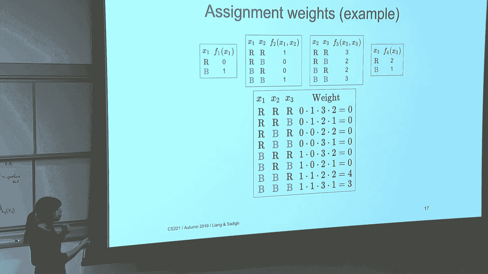

## 约束满足问题：特殊的因子图 ✅

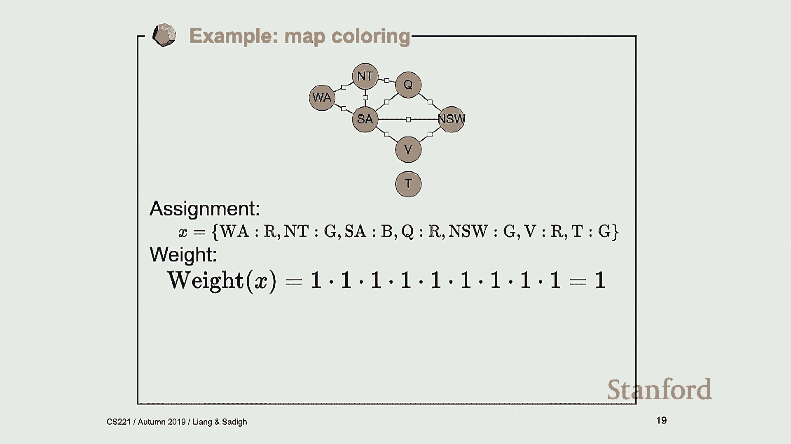

**约束满足问题** 是因子图的一个特例，其中所有因子都是**约束**。约束的输出只能是 **0** 或 **1**：
*   **1** 表示该约束被**满足**。
*   **0** 表示该约束被**违反**。

在 CSP 中，一个赋值的权重是所有约束取值的乘积。因此，权重只能是 **0** 或 **1**：
*   **权重 = 1**：所有约束均被满足，称为**一致赋值**。
*   **权重 = 0**：至少有一个约束被违反，称为**不一致赋值**。

CSP 的目标是找到**任何一个**一致赋值（即权重为 1 的赋值）。

### CSP 示例：地图着色

**问题**：为澳大利亚的七个省份着色，可用颜色为红、绿、蓝，要求相邻省份颜色不同。
*   **变量**：七个省份（如 WA, NT, SA...）。
*   **定义域**：每个变量的定义域都是 `{红, 绿, 蓝}`。
*   **约束（因子）**：对于每对相邻省份，定义一个二元约束 `f_neighbor(Xi, Xj)`，当 `Xi ≠ Xj` 时输出 1，否则输出 0。

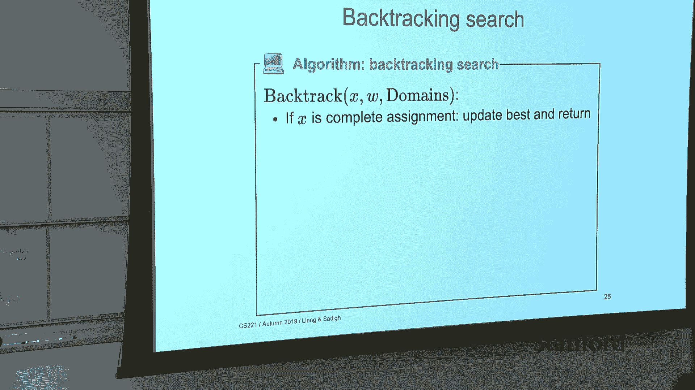

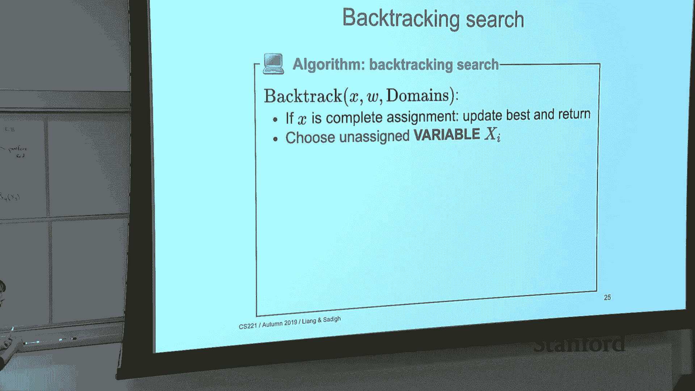

我们的目标就是找到一个满足所有相邻约束的着色方案。

---

## 如何解决 CSP？回溯搜索算法 🔍

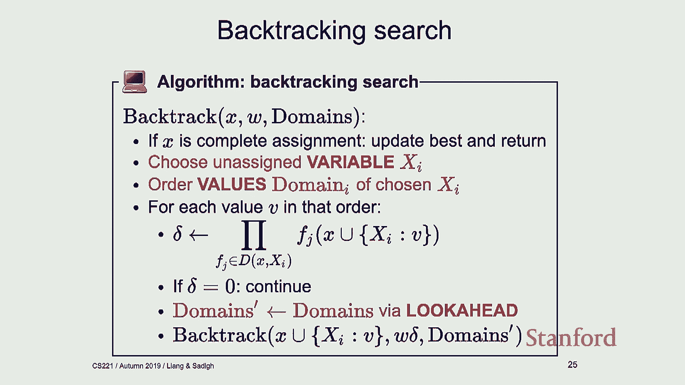

解决 CSP 最直接的方法是**回溯搜索**。其基本思想是逐步构建赋值，并在发现不一致时回溯。

以下是回溯搜索算法的核心步骤：

1.  **选择未赋值的变量**：使用启发式方法决定下一个要赋值的变量。
2.  **为变量选择值**：从该变量的当前定义域中，按某种顺序选择一个值。
3.  **检查一致性**：检查当前部分赋值与新值组合后，相关的约束是否被违反（即因子输出是否为 0）。
4.  **递归搜索**：如果一致，则用新值扩展部分赋值，并递归调用搜索。
5.  **回溯**：如果不一致，或者从该值出发的递归搜索失败，则尝试该变量的下一个值。如果所有值都失败，则回溯到上一个决策点。

### 提升效率的启发式方法

为了让回溯搜索更高效，我们可以在两个关键步骤使用启发式方法：

**1. 变量选择启发式：最受约束变量优先**
*   **策略**：选择当前**定义域最小**（即可选值最少）的未赋值变量。
*   **原因**：“尽早失败”。如果问题无解，定义域最小的变量最可能很快导致矛盾，从而尽早剪枝，避免在无望的分支上浪费搜索时间。

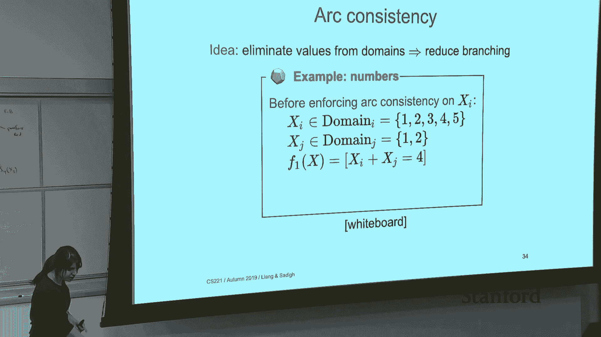

**2. 值选择启发式：最少约束值优先**
*   **策略**：为选定的变量赋值时，优先选择那个能给其他未赋值变量**留下最多选择**的值。
*   **原因**：既然已经决定要给这个变量赋值，就应选择最有可能让后续搜索成功的值，以提高找到解的概率。

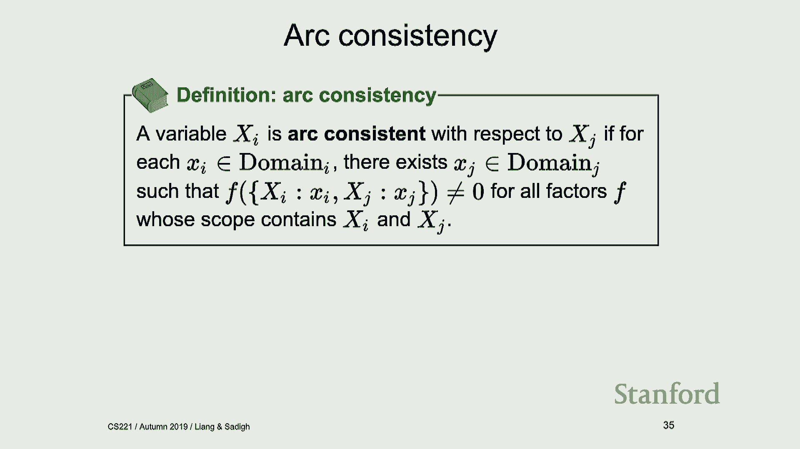

---

## 利用一致性检查进行剪枝 ✂️

在回溯搜索中，我们可以通过主动检查并缩小变量的定义域来提前发现矛盾，这称为**维持一致性**。有两种主要方法：

**1. 前向检查**
*   **做法**：当给变量 `Xi` 赋值后，立即检查 `Xi` 的所有**邻居变量**。从邻居变量的定义域中，删除所有与 `Xi` 的当前值不兼容的值。
*   **效果**：如果任何邻居变量的定义域因此变为空集，则当前部分赋值必然导致失败，可以立即回溯。

**2. 弧相容**
*   **做法**：比前向检查更彻底。它反复检查图中所有变量对 `(Xi, Xj)`。对于 `Xi` 定义域中的每个值，检查 `Xj` 的定义域中是否存在某个值能满足它们之间的约束。如果不存在，则从 `Xi` 的定义域中删除该值。
*   **算法**：常用的弧相容算法是 **AC-3**。它会维护一个需要检查的弧（变量对）的队列，不断传播约束，直到没有定义域可以再被缩小为止。
*   **效果**：能更大幅度地剪枝搜索空间，有时甚至能在开始回溯前就推导出唯一解。但请注意，弧相容是**局部**的，它不能保证一定能检测出所有全局不一致性。

---

## 建模实践：更多 CSP 示例 🏛️

理解如何将实际问题建模为 CSP 至关重要。以下是两个例子：

**示例 1：雕塑展览问题**
*   **问题**：三件雕塑 A, B, C 需放入房间 1 或 2。约束：A 和 B 不能同室；B 和 C 必须同室；房间 2 最多放一件雕塑。
*   **建模**：
    *   **变量**：`A`, `B`, `C`，定义域 `{1, 2}`。
    *   **约束**：
        *   `A ≠ B` （二元约束）
        *   `B = C` （二元约束）
        *   `(A=2) + (B=2) + (C=2) ≤ 1` （三元约束，可转换为二元约束）

**示例 2：课程安排问题**
*   **问题**：将 E 门课程安排到 T 个时间段。约束：每门课必须且只能安排一个时间；每个时间段最多安排一门课；某些课程只能安排在特定时间。
*   **建模（两种方式）**：
    *   **方式一（以课程为变量）**：
        *   变量：每门课程 `Course_i`，定义域 `{1, 2, ..., T}`。
        *   约束1（每时段最多一门课）：对所有课程对 `(i, j)`，添加约束 `Course_i ≠ Course_j`。共有 O(E²) 个二元约束。
        *   约束2（特定时间限制）：对每门课添加一元约束，限制其可取值。
    *   **方式二（以时间为变量）**：
        *   变量：每个时间段 `TimeSlot_t`，定义域 `{课程1, 课程2, ..., 空}`。
        *   约束1（每门课一个时间）：需要一个大约束，确保每门课恰好出现在一个时间段变量的值中。这是一个涉及 T 个变量的高阶约束。
    *   **选择**：根据课程数 `E` 和时间段数 `T` 的相对大小，选择产生约束更少、更简单的建模方式。通常高阶约束可以转换为多个二元约束来处理。

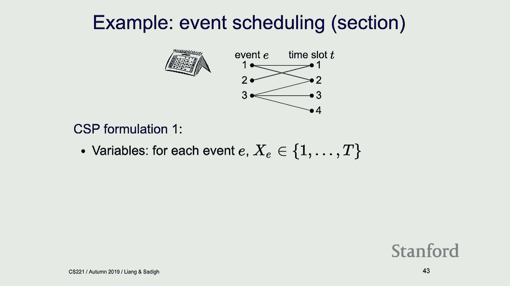

---

## 总结 📝

本节课我们一起学习了变量模型的基础——**因子图**和**约束满足问题**。

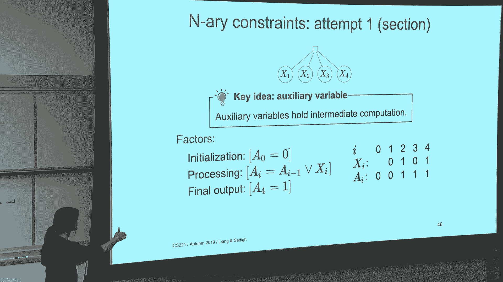

*   **核心思想**：与关注状态和行动序列的状态模型不同，变量模型直接关注**变量**、**赋值**以及变量间的**约束**。它适用于那些**顺序不重要**，但需要满足一系列**局部关系**的问题。
*   **因子图**：由**变量**和**因子**组成。因子是表示变量组合满意度的非负函数。赋值的权重是所有因子值的乘积，目标是最大化权重。
*   **CSP**：是因子图的特例，因子均为输出 0/1 的**约束**。目标是找到权重为 1 的**一致赋值**。
*   **求解方法**：使用**回溯搜索**，并可通过启发式方法（最受约束变量、最少约束值）和一致性检查（前向检查、弧相容）来大幅提升搜索效率。
*   **建模**：将实际问题转化为 CSP 是关键步骤，有时存在多种建模方式，需要根据约束的数量和复杂度进行选择。

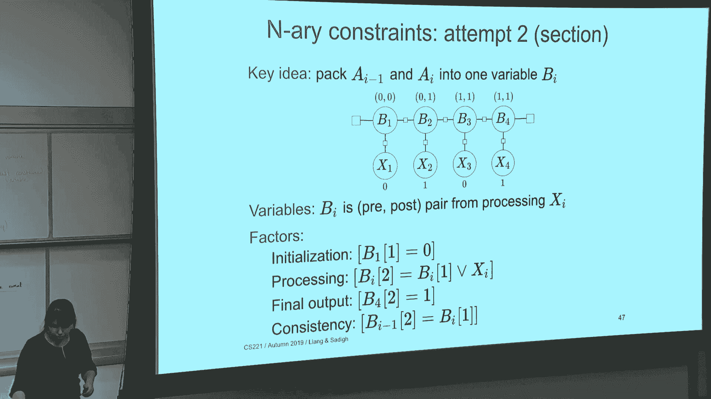

在下一节课中，我们将继续探讨 CSP 的更多推理算法。