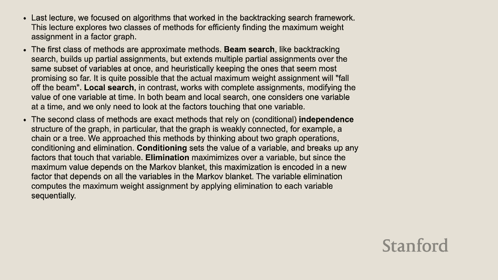

# 12：因子图 2 - 条件独立性 🧩

在本节课中，我们将继续学习约束满足问题，重点探讨如何利用因子图中的条件独立性来更高效地求解。我们将介绍几种关键的算法思想，包括束搜索、局部搜索、条件化和消元法。

---

## 概述

上一节我们介绍了因子图的基本概念和回溯搜索算法。本节我们将看到，当变量之间存在独立性时，问题可以大大简化。我们将学习如何识别和利用这种独立性，并介绍几种更高效的近似和精确求解算法。

---

## 回顾：因子图与CSP

首先，我们快速回顾一下约束满足问题的因子图表示。

*   **变量**：例如 `x1`, `x2`, `x3`，每个变量都有一个离散的**定义域**。
*   **因子**：是作用于一个或多个变量的函数，用于评估对变量赋值的“喜好”程度。因子所作用的变量集合称为其**作用域**。
*   **权重**：一个完整赋值（所有变量都取值）的权重，是**所有因子取值的乘积**。
*   **目标**：找到使总权重最大的变量赋值。

一个简单的例子是人员着色问题：三个人（变量）可以选择红色或蓝色（定义域），因子编码了诸如“两人必须一致”或“倾向于一致”等约束。

---

## 束搜索：在速度与精度间权衡 🔍

回溯搜索虽然能保证找到最优解，但速度很慢（指数时间）。贪心搜索很快（线性时间），但可能错过全局最优解。

**束搜索**是一种折衷方案。以下是其工作原理：

1.  维护一个包含 `k` 个**部分赋值**的列表（称为“束”）。
2.  在每一步，对束中的每一个部分赋值，尝试扩展一个新的变量（测试其定义域中的所有值）。
3.  将所有扩展出的新部分赋值**按权重排序**，只保留权重最高的前 `k` 个，形成新的束。
4.  重复此过程，直到所有变量都被赋值。

**核心思想**：参数 `k` 是一个旋钮。`k=1` 时就是贪心搜索；`k` 很大时，则接近广度优先搜索，探索更多状态空间。它不保证找到最优解，但通常比纯贪心更好，且比完全回溯更快。

---

## 局部搜索：改进现有赋值 ✨

束搜索是从零开始构建赋值。**局部搜索**则从一个完整的（可能是随机的）赋值开始，然后尝试逐步改进它。

### 迭代条件模式

ICM 是一种简单的局部搜索算法：

1.  选择一个变量。
2.  **固定**所有其他变量的当前值（即“条件化”）。
3.  尝试该变量定义域中的所有可能值，计算整个赋值的权重（**只需重新计算与该变量相连的因子**，因为其他因子值不变）。
4.  将该变量的值设置为能产生**最高权重**的那个值。
5.  对下一个变量重复此过程。

**特点**：ICM 会收敛到一个**局部最优解**，但不一定是全局最优。其名称来源于：**迭代**（遍历变量）、**条件**（固定其他变量）、**模式**（选择最优值）。

### 吉布斯采样

吉布斯采样与 ICM 类似，但引入了随机性以帮助跳出局部最优：

1.  选择一个变量。
2.  固定所有其他变量的值。
3.  对于该变量的每个可能值，计算其权重。
4.  **不是直接选择最大权重的值**，而是根据权重**按比例采样**一个值。例如，如果权重为 [1, 2, 2]，则采样概率为 [1/5, 2/5, 2/5]。
5.  用采样到的值更新该变量。

**特点**：长期运行后，高质量赋值出现的频率会更高。理论上，在极限情况下，全局最优解会成为最常出现的状态，但这并非保证，且严重依赖于初始状态。

---

## 条件独立性：图结构的威力 🕸️

现在，我们转向通过改变图结构本身来解决问题的方法。关键在于**独立性**。

### 什么是独立性？

如果两个变量之间**没有路径**相连（在因子图中即没有共享的因子），则它们是独立的。例如，澳大利亚地图着色问题中的塔斯马尼亚岛与其他州是独立的。

**独立性的好处**：独立变量可以**分开单独优化**。例如，有两个独立变量 `x1` 和 `x2`，各自有一个一元因子，那么最优解就是分别选择使各自因子值最大的赋值，时间复杂度是线性的 `O(2)`，而不是穷举的 `O(2^2)`。

### 条件化：创造独立性

如果变量之间不独立，我们可以通过**条件化**来创造独立性。

**条件化操作**：
1.  选择一个变量，并**固定**它的值为某个特定值（例如，`x2 = blue`）。
2.  将这个变量从图中**移除**。
3.  所有与该变量相连的因子，都将其对应的参数替换为这个固定值，从而**简化**为作用于剩余变量的新因子。

**效果**：通过移除某些变量（称为“条件集”），原本相连的组件可能会变得独立。例如，在一个链 `A -- C -- B` 中，`A` 和 `B` 原本通过 `C` 相连。如果条件化 `C`（固定 `C` 的值并移除它），`A` 和 `B` 之间就没有连接了，它们变得**条件独立**。

**数学表示**：`(A ⟂ B | C)` 表示在给定 `C` 的条件下，`A` 和 `B` 独立。

### 马尔可夫毯

一个变量集的**马尔可夫毯**是指，当条件化这个集合后，该变量集与图中其余部分变得独立。它是图中分离该变量集所需的最小节点集合。

---

## 变量消元法：更高效的“条件化” ⚙️

条件化需要为条件变量的每个可能值都求解一次剩余问题。**变量消元法**更聪明：它在移除变量时，会动态地为该变量的每个邻居赋值组合选择最优值。

**消元操作**（以消除变量 `Z` 为例）：
1.  找出 `Z` 的马尔可夫毯（所有与 `Z` 直接相连的变量）。
2.  对于马尔可夫毯变量的每一种可能赋值组合：
    *   计算 `Z` 取不同值时，涉及 `Z` 的所有因子的乘积。
    *   **记录下能产生最大乘积的那个 `Z` 的值**，并将该最大乘积值作为新因子在这个赋值组合下的值。
3.  这样，我们得到了一个**新的因子**，其作用域是 `Z` 的马尔可夫毯（不再包含 `Z`），该因子内部已经“优化”掉了 `Z`。
4.  将 `Z` 和与之相连的旧因子从图中移除，加入这个新因子。

**与条件化的对比**：
*   **条件化**：为 `Z` 选一个固定值（如 `blue`），然后传播。
*   **消元法**：对于邻居的每一种情况，都为 `Z` 选择**局部最优**的值，并将这个选择“编码”进新因子中。

### 消元算法

1.  **顺序**：选择一个变量消除顺序。
2.  **向前过程**：按顺序对每个变量执行上述消元操作，直到图中只剩一个变量。该变量的一元因子值就代表了全局最优权重。
3.  **向后过程**：根据向前过程中记录的信息（“回溯指针”），从最后一个变量开始，反向读出每个被消除变量的最优取值。

**运行时间关键**：消元过程中创建的**最大因子的作用域大小**（即其变量的个数，称为“元数”）。这决定了算法的复杂度，大约是 `O(d^(w+1))`，其中 `d` 是定义域大小，`w` 是消元过程中产生的最大因子元数减一。

### 变量顺序与树宽

*   **变量顺序至关重要**：好的顺序能产生元数小的因子，从而高效。一个启发式策略是**优先消除邻居少的变量**。
*   **树宽**：对于一个图，使用最优消元顺序所能得到的最小 `w` 值，称为该图的**树宽**。树宽衡量了图的“类似树”的程度。
    *   链或树的树宽为 1。
    *   环的树宽为 2。
    *   `n x n` 网格的树宽约为 `n`。
*   计算最小树宽或最优消元顺序本身是 NP 难问题。

---

## 总结 🎯

本节课我们一起学习了多种解决约束满足问题的高级技术：

1.  **束搜索**：通过维护多个候选部分赋值，在搜索速度和解的质量之间取得平衡。
2.  **局部搜索**（ICM 和吉布斯采样）：从完整赋值出发，通过局部修改进行优化。ICM 追求快速收敛，吉布斯采样利用随机性探索空间。
3.  **条件独立性**：理解变量间的独立关系是加速求解的关键。条件化操作通过固定变量值来创造独立性。
4.  **变量消元法**：一种系统性的精确算法，通过逐步消除变量并内部优化其取值，最终高效地找到全局最优解。算法的效率高度依赖于消元顺序和图的树宽。

这些方法为我们提供了从精确到近似、从全局到局部的一整套工具，以应对不同规模和结构的约束满足问题。