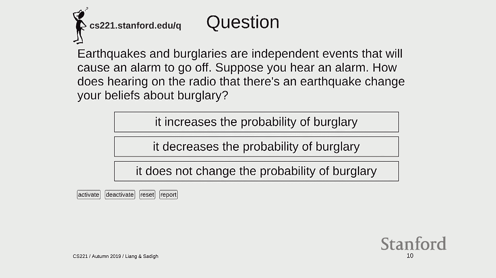
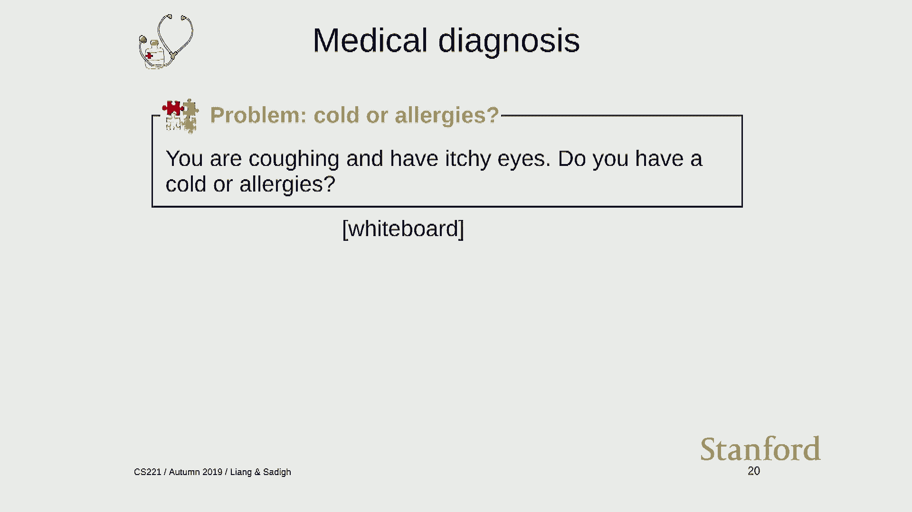
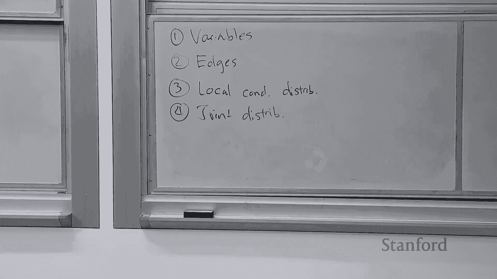
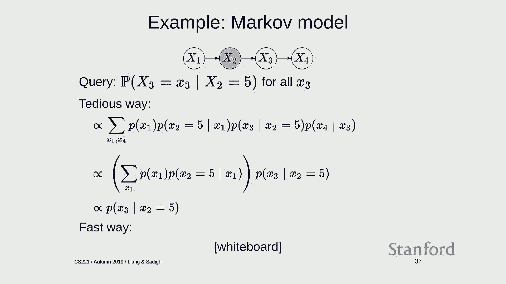

# 13：贝叶斯网络 1 - 推理 🧠


在本节课中，我们将要学习贝叶斯网络的基础知识。贝叶斯网络是一种强大的概率图模型，它允许我们以紧凑的方式表示复杂的联合概率分布，并在此基础上进行概率推理。我们将从概率基础回顾开始，逐步理解贝叶斯网络的定义、构建方法，以及如何将其与因子图联系起来。最后，我们会初步探讨如何进行概率推理。

---

## 概率基础回顾 📊

在深入贝叶斯网络之前，我们需要回顾一些核心的概率概念。这些概念是理解后续内容的基础。

**随机变量** 是值未知的变量。例如，`Sunshine` 和 `Rain` 可以是两个随机变量。

**联合分布** 描述了所有随机变量同时取特定值的概率。我们通常用 `P(S, R)` 表示，它是一个表格，为每个可能的变量赋值组合分配一个概率值。

**边缘分布** 是从联合分布中，通过对我们不关心的变量求和，推导出我们关心的变量子集的分布。例如，从 `P(S, R)` 得到 `P(S)` 的过程称为“边缘化”。

**条件分布** 描述了在已知某些证据（变量取值）的情况下，其他变量的概率分布。例如，`P(S | R=1)` 表示在已知下雨的条件下，天气是晴天的概率。计算时，我们选取联合分布中满足条件的行，然后进行归一化，使其概率和为1。

上一节我们回顾了概率的基本操作，本节中我们来看看如何用更结构化的方式——贝叶斯网络——来定义复杂的联合分布。

---

## 什么是贝叶斯网络？ 🕸️

贝叶斯网络为我们提供了一种紧凑且直观的方式来定义高维联合概率分布，从而避免了直接列出所有可能组合（其数量是指数级的）的麻烦。



一个贝叶斯网络由两部分组成：
1.  **一个有向无环图**：其中节点代表随机变量，有向边代表变量间的依赖或影响关系。
2.  **一组局部条件概率分布**：每个节点都有一个条件概率表，描述在该节点父节点取特定值的条件下，该节点取各个值的概率。


网络的**联合分布**被定义为所有局部条件概率分布的乘积：
`P(X1, X2, ..., Xn) = ∏ P(Xi | Parents(Xi))`

这体现了“局部定义，全局优化”的思想：我们只需定义每个变量与其直接父节点的局部关系，整个系统的全局概率分布便自动生成。

---

## 构建贝叶斯网络：警报网络示例 🚨

让我们通过一个经典的“警报网络”例子，一步步学习如何构建贝叶斯网络。这个网络涉及入室盗窃、地震和警报器。

以下是构建贝叶斯网络的四个步骤：

**步骤一：定义变量**
确定模型中需要包含的随机变量。
*   `B`：入室盗窃发生（是/否）
*   `E`：地震发生（是/否）
*   `A`：警报响起（是/否）

**步骤二：绘制图结构**
根据变量间的因果关系或影响关系绘制有向边。
*   盗窃和地震都可能触发警报，因此 `B` 和 `E` 指向 `A`。
*   盗窃和地震本身被认为是独立的，因此 `B` 和 `E` 之间没有边。

**步骤三：定义局部条件概率分布**
为每个节点给定其父节点的情况指定概率。
*   `P(B)`：盗窃的先验概率，例如 `P(B=1) = ε`（一个很小的数）。
*   `P(E)`：地震的先验概率，例如 `P(E=1) = ε`。
*   `P(A | B, E)`：在已知盗窃和地震是否发生的情况下，警报响起的概率。例如，一个可靠的警报器在两者都不发生时几乎不误报，在任一发生时几乎必响。

**步骤四：形成联合分布**
整个网络的联合概率分布是上述所有局部分布的乘积：
`P(B, E, A) = P(B) * P(E) * P(A | B, E)`

通过这个定义好的联合分布，我们就可以回答各种概率查询。

---





## 贝叶斯网络与因子图 🔗

贝叶斯网络可以自然地转化为因子图，这有助于我们利用上一节课学到的推理算法。

转换规则很简单：**每个局部条件概率分布 `P(Xi | Parents(Xi))` 就对应因子图中的一个因子**。该因子的作用域包含变量 `Xi` 及其所有父节点。

以警报网络为例：
*   变量 `B` 对应因子 `fB(B) = P(B)`
*   变量 `E` 对应因子 `fE(E) = P(E)`
*   变量 `A` 对应因子 `fA(B, E, A) = P(A | B, E)`

因此，贝叶斯网络的联合分布 `P(B, E, A)` 等价于因子图中所有权重因子的乘积。这种联系至关重要，因为它意味着我们可以使用变量消除、采样等因子图算法在贝叶斯网络上进行概率推理。

---

## 概率推理：我们想解决什么问题？ ❓

拥有了贝叶斯网络定义的联合分布后，我们的核心任务就是进行**概率推理**。

概率推理通常遵循以下模式：在观察到一些**证据**（某些变量已知取值）后，计算我们对另一些**查询变量**的信念（概率分布）。

用公式表示就是计算：
`P(查询变量 | 证据变量 = 观测值)`

在警报网络例子中：
*   `P(B)`：没有任何证据时，发生盗窃的概率（先验）。
*   `P(B | A=1)`：听到警报响后，发生盗窃的概率（后验）。直觉上，这个概率应该上升。
*   `P(B | A=1, E=1)`：听到警报响并且从广播得知地震后，发生盗窃的概率。直觉上，因为地震可以“解释”警报，所以盗窃的概率应该比仅听到警报时下降。这种现象称为“解释消除”。

通过精确的模型计算，我们可以验证或修正这些直觉。

---

## 贝叶斯网络的特性与概率程序 🖥️

贝叶斯网络有两个重要特性，源于其局部条件概率是规范的概率分布：
1.  **边缘化的一致性**：如果从网络中边缘化掉一个叶节点（没有子节点的节点），得到的新分布正好对应于从原图中删除该节点及其入边后形成的简化贝叶斯网络。
2.  **条件分布的一致性**：网络中定义的局部条件分布 `P(X | Parents)`，与从整个联合分布通过概率规则推导出的条件分布 `P(X | Parents)` 是相同的。

此外，贝叶斯网络还可以用**概率程序**的思想来理解。概率程序是一段包含随机抽样的代码，每次运行都会根据定义的概率生成变量的一组赋值。多次运行就得到了联合分布的样本。

例如，警报网络可以写成：
```
B = draw from Bernoulli(ε)
E = draw from Bernoulli(ε)
A = B or E (以某种概率，模拟噪声)
```
这种视角有助于我们构思更复杂的模型，如隐马尔可夫模型、朴素贝叶斯分类器等，它们都可以看作是生成观测数据的“故事”。

---



## 推理计算策略 🧮


最后，我们探讨如何进行实际的概率推理计算。直接对联合分布求和或积分在变量多时是不可行的。我们需要利用图结构来简化计算。

一个通用的五步策略如下：
1.  **移除非祖先节点**：查询变量和证据变量的非祖先节点可以提前被边缘化掉（从图中删除），因为它们不影响最终结果。
2.  **转换为因子图**：将贝叶斯网络转化为因子图，便于统一处理。
3.  **处理证据**：将证据（变量取值）代入，修改或固定相关的因子。
4.  **移除断开部分**：删除图中与查询变量不再连接的部分。
5.  **执行计算**：对剩余变量使用变量消除等算法进行求和，得到查询变量的分布。

我们通过马尔可夫链和警报网络中的简单查询例子演示了这个过程。在简单情况下，前四步可能直接给出答案；在复杂情况下，第五步需要系统化的计算。

---

## 总结 📝


本节课中我们一起学习了贝叶斯网络的基础。我们首先回顾了必要的概率知识，然后介绍了贝叶斯网络作为一种用有向图和局部条件概率来紧凑定义联合分布的方法。我们通过警报网络的例子详细讲解了构建步骤，并建立了贝叶斯网络与因子图之间的联系。接着，我们明确了概率推理的核心任务——在证据下计算查询变量的后验分布。我们还了解了贝叶斯网络的重要特性以及概率程序的建模视角。最后，我们初步接触了利用图结构进行有效推理的计算策略。在下一讲中，我们将更深入地探讨自动执行这些推理的算法。