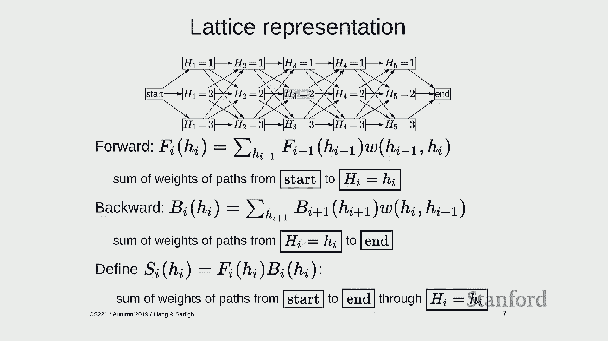
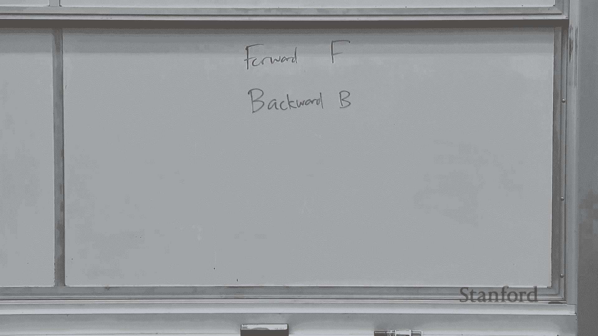
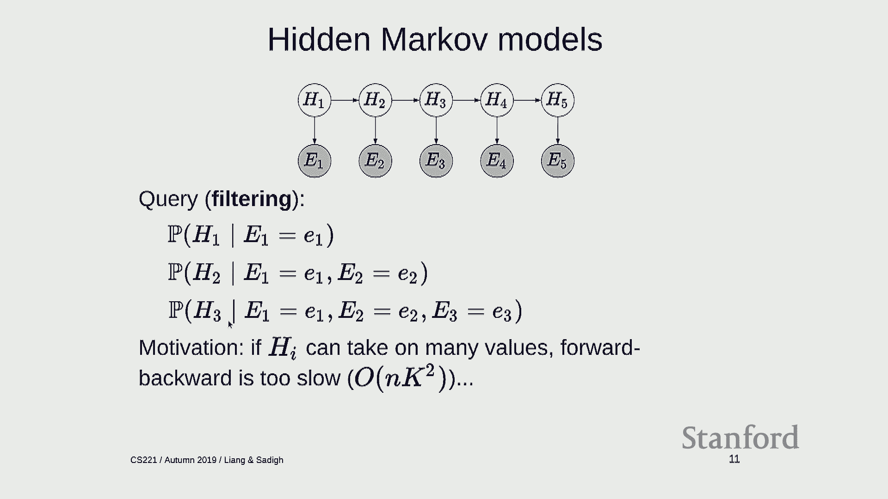
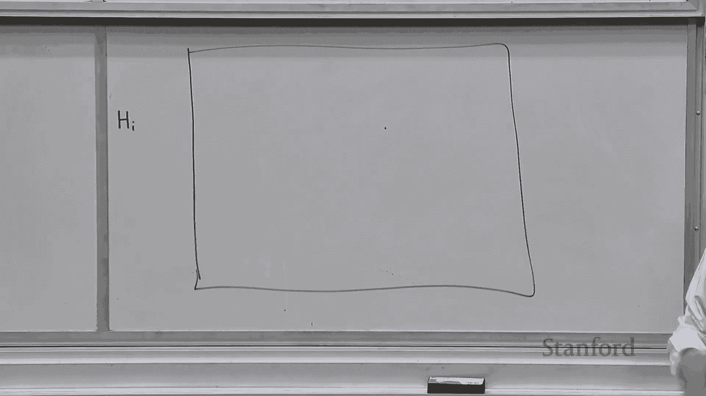
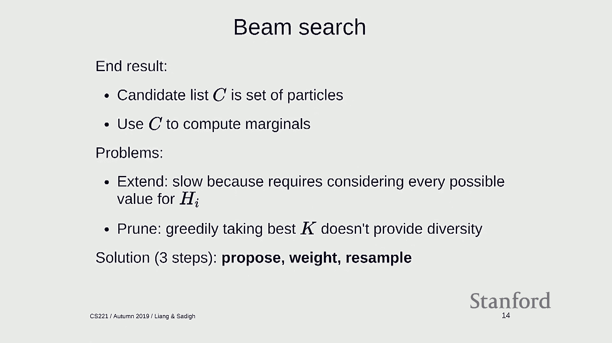
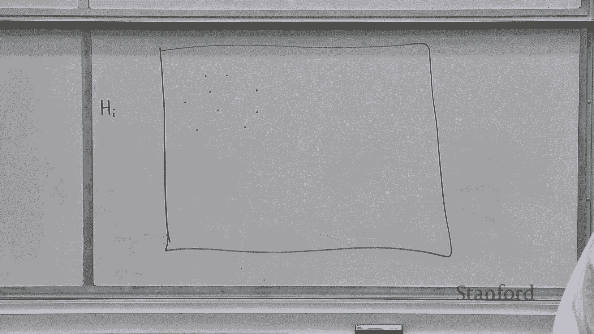
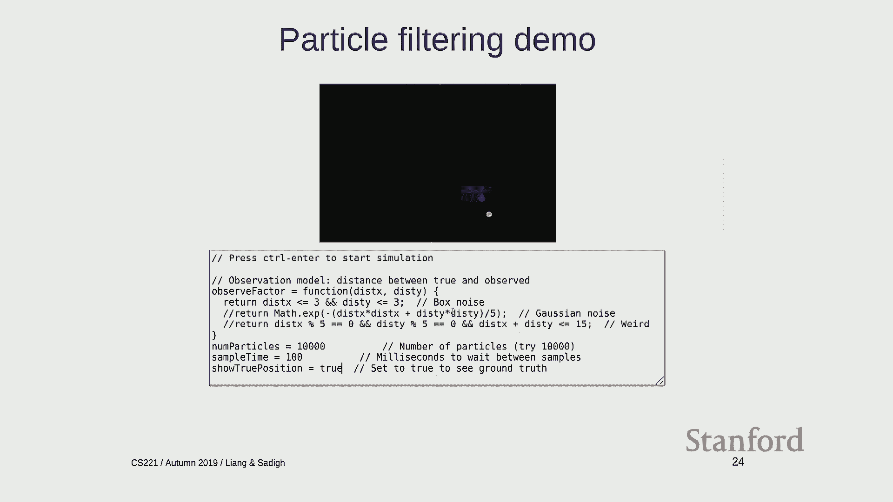
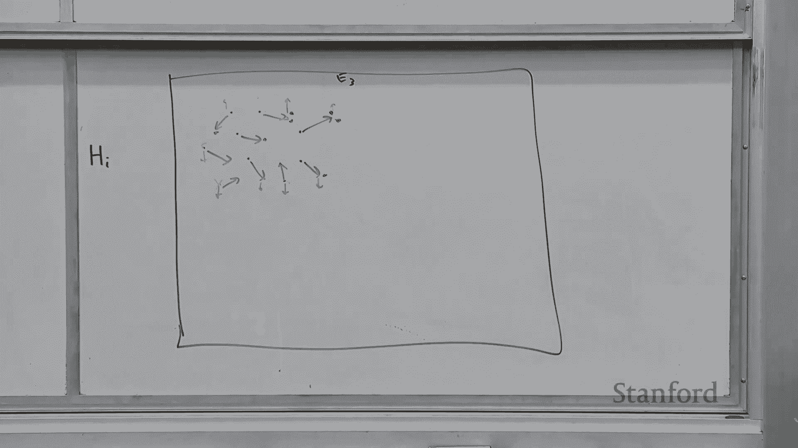

# 14：贝叶斯网络 2 - 前向-后向算法 🧠

在本节课中，我们将继续学习贝叶斯网络，并重点探讨如何高效地进行概率推断。我们将介绍两种核心算法：用于隐马尔可夫模型精确推断的**前向-后向算法**，以及用于大规模或连续状态空间近似推断的**粒子滤波算法**。最后，我们还会从概率推断的角度重新审视**吉布斯采样**。

---

## 贝叶斯网络回顾

上一节我们介绍了贝叶斯网络的基本概念。它是一种通过有向无环图表示变量间依赖关系的概率模型。每个节点代表一个随机变量，每条边表示依赖关系。每个变量都有一个**局部条件概率分布**，给定其父节点的取值。将所有局部条件概率分布相乘，就得到了所有变量的联合概率分布。

贝叶斯网络可以看作**因子图**与**概率**的结合，它允许我们紧凑地定义涉及大量随机变量的复杂联合分布。概率推断的任务是：给定一个贝叶斯网络（即我们对世界的知识模型）和一些观察到的证据，计算我们感兴趣的查询变量在给定证据下的条件概率。

---

## 隐马尔可夫模型

本节中，我们来看看一种特殊的贝叶斯网络——**隐马尔可夫模型**。HMM包含一个隐藏状态变量序列和一个对应的观测变量序列。

**模型定义**：
*   **初始分布**：`P(H_1)`，表示第一个隐藏状态的概率。
*   **转移分布**：`P(H_i | H_{i-1})`，表示当前隐藏状态如何依赖于前一个状态。
*   **发射分布**：`P(E_i | H_i)`，表示当前观测值如何依赖于当前隐藏状态。

所有变量的联合概率分布为这些分布的乘积：
`P(H, E) = P(H_1) * ∏_{i=2}^n P(H_i | H_{i-1}) * ∏_{i=1}^n P(E_i | H_i)`

在HMM中，我们主要关心两类推断问题：
1.  **滤波**：计算 `P(H_t | E_1=e_1, ..., E_t=e_t)`。这相当于实时估计当前状态。
2.  **平滑**：计算 `P(H_t | E_1=e_1, ..., E_n=e_n)`。这相当于利用所有过去和未来的观测数据来估计过去某一时刻的状态。

我们将重点讨论平滑问题，因为一旦能解决平滑问题，滤波问题也可以通过边缘化未来变量来解决。

---

## 格架表示与前向-后向算法

为了高效计算平滑概率，我们引入**格架**表示法。格架的每一列对应一个时间步的隐藏变量 `H_i`，每一行对应 `H_i` 的一个可能取值。从起点到终点的一条路径，就对应隐藏变量序列的一种完整赋值。

**构建加权格架**：
1.  将初始概率 `P(H_1)` 和第一个发射概率 `P(E_1 | H_1)` 的乘积，赋给从起点到第一个状态节点的边。
2.  将转移概率 `P(H_i | H_{i-1})` 和发射概率 `P(E_i | H_i)` 的乘积，赋给连接 `H_{i-1}` 和 `H_i` 的边。
3.  终点边的权重设为1。

这样，任意路径的权重就是路径上所有边权重的乘积，它正比于该路径对应的完整赋值（包含观测证据）的联合概率。

我们的目标是计算所有经过特定节点（例如 `H_t = v`）的路径权重之和，然后除以所有路径的权重之和，从而得到平滑概率 `P(H_t = v | 所有证据)`。直接求和是指数级的，我们需要动态规划。

**前向-后向算法**通过传递两种消息来高效计算：

*   **前向消息 `F_i(v)`**：从起点到节点 `(i, v)` 的所有**部分路径**的权重之和。
    *   计算公式：`F_i(v) = ∑_{u} [F_{i-1}(u) * P(H_i=v | H_{i-1}=u) * P(E_i | H_i=v)]`
*   **后向消息 `B_i(v)`**：从节点 `(i, v)` 到终点的所有**部分路径**的权重之和。
    *   计算公式：`B_i(v) = ∑_{w} [P(H_{i+1}=w | H_i=v) * P(E_{i+1} | H_{i+1}=w) * B_{i+1}(w)]`

对于每个节点 `(i, v)`，经过它的所有完整路径的权重之和 `S_i(v)` 恰好是前向和后向消息的乘积：`S_i(v) = F_i(v) * B_i(v)`。

**算法步骤**：
1.  **前向传递**：从 `i=1` 到 `n`，计算所有 `F_i(v)`。
2.  **后向传递**：从 `i=n` 到 `1`，计算所有 `B_i(v)`。
3.  **计算平滑分布**：对于每个时间步 `i` 和每个值 `v`，计算 `S_i(v)`，然后归一化得到 `P(H_i = v | 所有证据)`。

该算法的时间复杂度为 `O(n * K^2)`，其中 `n` 是时间步数，`K` 是隐藏状态的可能取值数。它一次性计算了所有时间步的平滑分布。

---

## 粒子滤波算法

前向-后向算法在状态空间 `K` 很大时（例如物体跟踪在连续或大网格空间），`K^2` 的计算成本可能过高。此外，许多状态的概率实际接近于零，全部计算是浪费的。**粒子滤波**是一种适用于大规模状态空间的**近似滤波**算法。

粒子滤波维护一组称为**粒子**的样本，每个粒子代表隐藏状态序列的一种可能轨迹（或仅当前状态）。它通过三个步骤迭代更新粒子集：

以下是粒子滤波的三个核心步骤：

1.  **提议**：根据当前粒子的状态 `H_{t-1}`，利用转移模型 `P(H_t | H_{t-1})` **采样**出下一个状态 `H_t`，从而将每个粒子向前扩展一步。
2.  **加权**：获得新的观测 `E_t` 后，根据发射模型 `P(E_t | H_t)` 为每个粒子计算一个权重。权重反映了该粒子与当前观测的吻合程度。
3.  **重采样**：根据粒子的权重进行**有放回地采样**，生成一个新的粒子集合。权重高的粒子更可能被多次选中，权重低的粒子可能被淘汰。这确保了粒子群集中在高概率区域。

粒子滤波直观上就像用一群“粒子”来模拟和追踪物体的可能位置。随着时间推进和观测更新，粒子群会逐渐聚集到物体最可能出现的区域。

与束搜索相比，粒子滤波的**采样**步骤引入了随机性，有助于维持假设的多样性，避免过早陷入局部最优。

---

## 吉布斯采样用于概率推断

现在，让我们从概率推断的角度重新审视**吉布斯采样**。之前我们将其用于在因子图中寻找高分赋值。实际上，如果我们将因子图的权重归一化为一个概率分布，吉布斯采样可以用于从该分布中**生成样本**。

**算法流程**：
1.  随机初始化所有变量的赋值。
2.  循环多次：
    *   依次选取每个变量 `X_i`。
    *   固定其他所有变量的当前取值，计算 `X_i` 取每一个可能值的**条件概率**：`P(X_i | 所有其他变量)`。这个概率正比于所有涉及 `X_i` 的因子在其邻居变量当前取值下的乘积。
    *   根据这个条件概率分布，为 `X_i` 采样一个新值。

在满足一定条件（如遍历性）下，经过足够次数的迭代后，吉布斯采样产生的样本会近似服从目标联合概率分布。通过收集大量样本，我们可以近似计算任意变量的边际分布或期望。

**应用示例：图像去噪**
*   **模型**：将图像像素建模为二值变量网格。相邻像素间有一个因子，鼓励它们取值相同（平滑先验）。部分像素被观测（噪声图像），这些观测作为固定值的因子。
*   **推断**：对未观测像素运行吉布斯采样。每次迭代，根据相邻像素的当前值和观测（如果有），更新一个像素的值。经过多次迭代后，采样结果或像素的边际概率（取平均）可以给出一个去噪后的图像。

---

## 总结

本节课我们一起学习了贝叶斯网络中的概率推断算法。

*   对于具有链式结构的**隐马尔可夫模型**，**前向-后向算法**能提供精确且高效的平滑推断。
*   当状态空间很大时，**粒子滤波**通过维护一组加权样本进行近似滤波，特别适用于跟踪等问题。
*   对于一般的图模型，**吉布斯采样**是一种通用的近似推断方法，通过从条件分布中采样来逼近联合分布。

这些算法与我们之前学过的概念有紧密联系：前向-后向类似于变量消除，粒子滤波类似于束搜索，而吉布斯采样则是其随机优化版本的直接应用。下一节课，我们将探讨如何从数据中**学习**贝叶斯网络的参数。