# 16：第 16 讲 逻辑 1 - 命题逻辑 🧠


在本节课中，我们将要学习逻辑的基础知识，特别是命题逻辑。我们将从定义逻辑的基本组成部分开始，包括语法、语义和推理规则，并探讨如何利用逻辑进行知识表示和推理。

---

## 概述 📖

逻辑是人工智能中一个强大的建模范式，它允许我们以精确和简洁的方式表达复杂知识。本节课将系统性地介绍命题逻辑，这是一种基于命题符号及其连接词的形式化语言。我们将学习如何构建逻辑公式，如何为这些公式赋予含义，以及如何利用推理规则从已知知识中推导出新结论。

---

## 逻辑的动机与背景

在课程开始时，我们回顾了本课程所涵盖的建模范式。我们学习了基于状态的模型（如搜索问题、MDP和博弈）和基于变量的模型（如约束满足问题和贝叶斯网络）。本节课，我们将转向基于逻辑的模型。

历史上，逻辑在20世纪90年代之前是人工智能的主导范式。虽然现代AI更侧重于处理不确定性和从数据中学习，但逻辑在表达复杂概念方面的简洁性和精确性是其独特优势。逻辑允许我们构建能够进行深度推理的系统，而不仅仅是进行模式匹配。

---

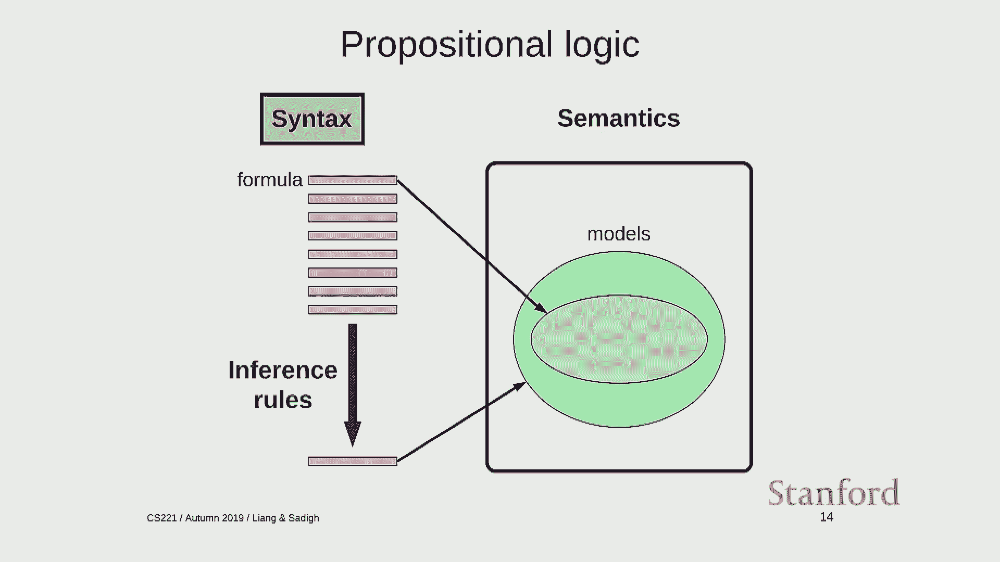

## 逻辑语言：语法与语义

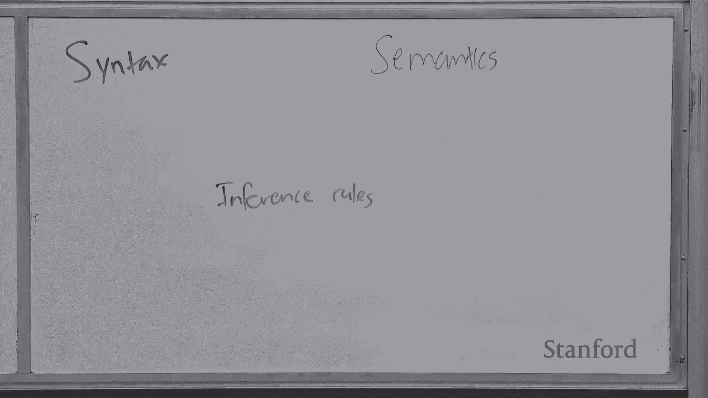

要定义一个逻辑语言，我们需要明确三个核心组成部分：**语法**、**语义**和**推理规则**。

### 语法：定义有效的表达式

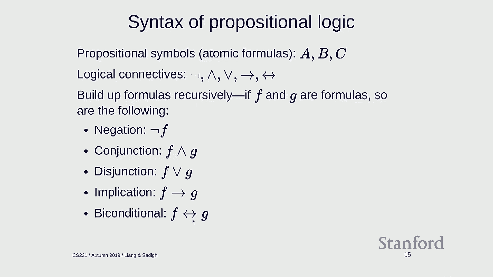

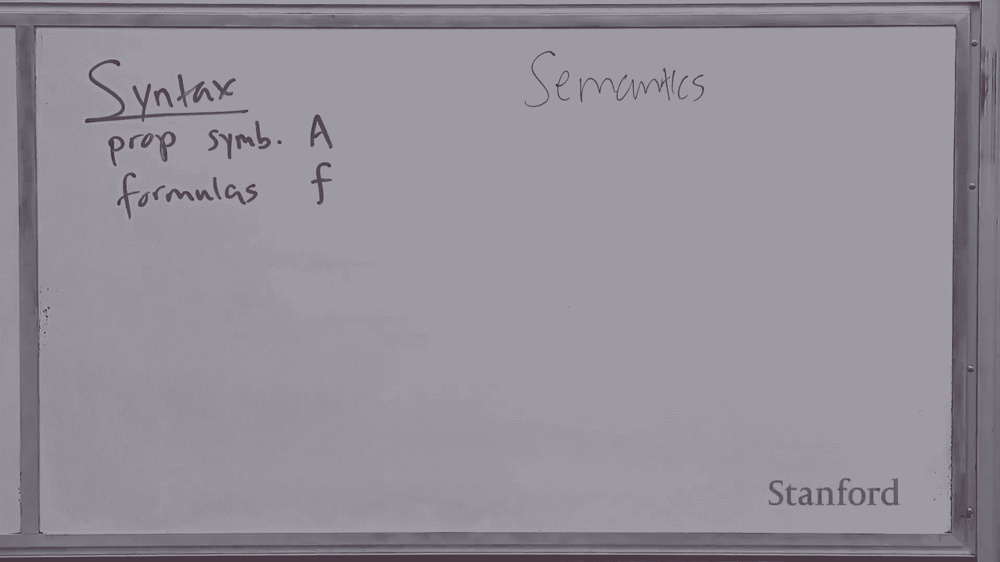

语法规定了在逻辑语言中，哪些表达式是有效的或合乎语法的。

在命题逻辑中，我们有以下基本元素：
*   **命题符号**：通常是大写字母或单词，如 `A`、`Rain`、`Wet`。它们是**原子公式**，不可再分。
*   **逻辑连接词**：包括 `¬`（非）、`∧`（与）、`∨`（或）、`⇒`（蕴含）、`⇔`（双向蕴含）。
*   **公式**：通过递归方式构建。如果 `F` 和 `G` 是公式，那么以下也是公式：
    *   `¬F`
    *   `F ∧ G`
    *   `F ∨ G`
    *   `F ⇒ G`
    *   `F ⇔ G`

**示例：**
*   `A` 是公式。
*   `¬A` 是公式。
*   `(¬B) ⇒ C` 是公式。
*   `A ∧ ¬B` 不是公式（缺少连接词）。
*   `A + B` 不是公式（`+` 不是有效连接词）。

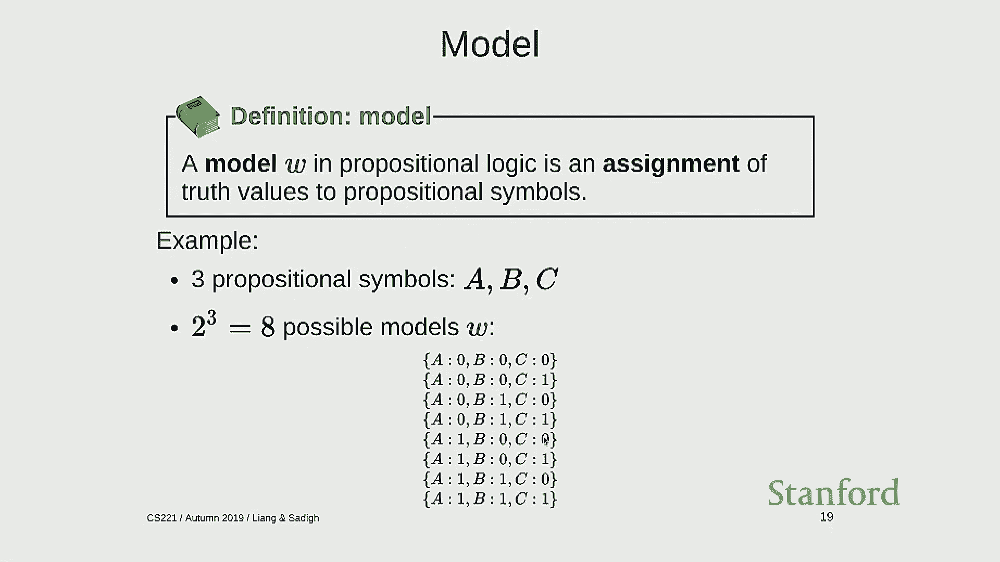

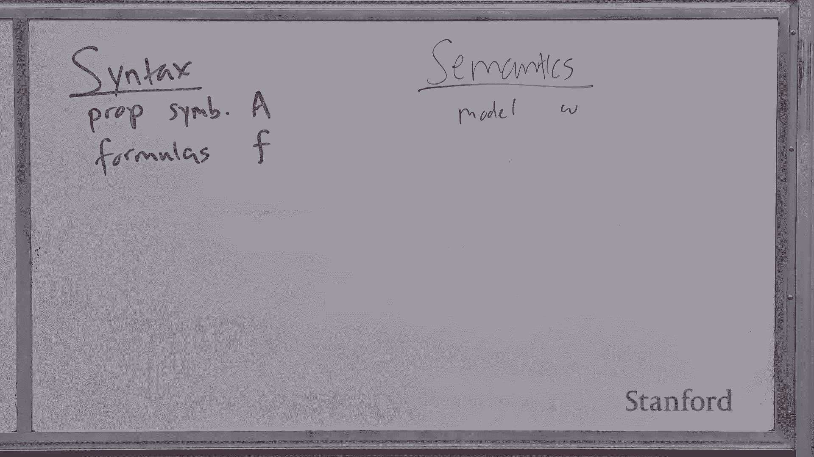

### 语义：为表达式赋予含义

语义定义了每个公式在特定情境下的意义。这通过**解释函数**来实现。

首先，我们定义**模型**（在逻辑文献中，也称为“世界”）。在命题逻辑中，模型是对所有命题符号的真值赋值。例如，对于命题符号 `A`、`B`、`C`，一个可能的模型是 `{A: 真, B: 假, C: 假}`。

解释函数 `I(F, w)` 接收一个公式 `F` 和一个模型 `w`，返回 `真` 或 `假`，表示公式 `F` 在模型 `w` 下是否为真。

解释函数的定义是递归的：
*   **原子公式**：`I(P, w)` 就是查找模型 `w` 中命题符号 `P` 的值。
*   **复合公式**：基于子公式的解释，通过真值表定义。
    *   `I(F ∧ G, w) = 真` 当且仅当 `I(F, w) = 真` 且 `I(G, w) = 真`。
    *   `I(F ∨ G, w) = 真` 当且仅当 `I(F, w) = 真` 或 `I(G, w) = 真`。
    *   `I(F ⇒ G, w) = 真` 当且仅当 `I(F, w) = 假` 或 `I(G, w) = 真`。
    *   `I(F ⇔ G, w) = 真` 当且仅当 `I(F, w) = I(G, w)`。
    *   `I(¬F, w) = 真` 当且仅当 `I(F, w) = 假`。

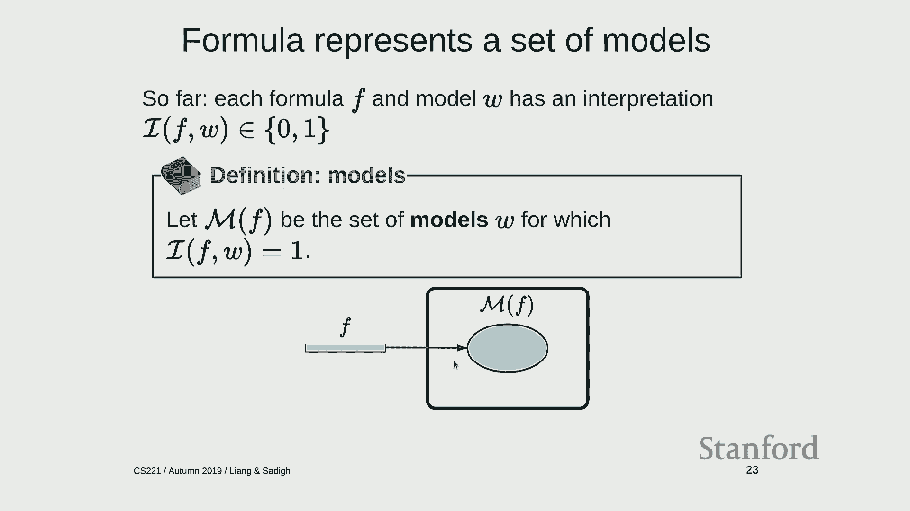

**示例：**
对于公式 `(¬A ∧ B) ⇔ C` 和模型 `{A: 真, B: 真, C: 假}`：
1.  `I(A, w) = 真`
2.  `I(¬A, w) = 假`
3.  `I(B, w) = 真`
4.  `I(¬A ∧ B, w) = 假`
5.  `I(C, w) = 假`
6.  `I((¬A ∧ B) ⇔ C, w) = 真` （因为 `假 ⇔ 假` 为真）

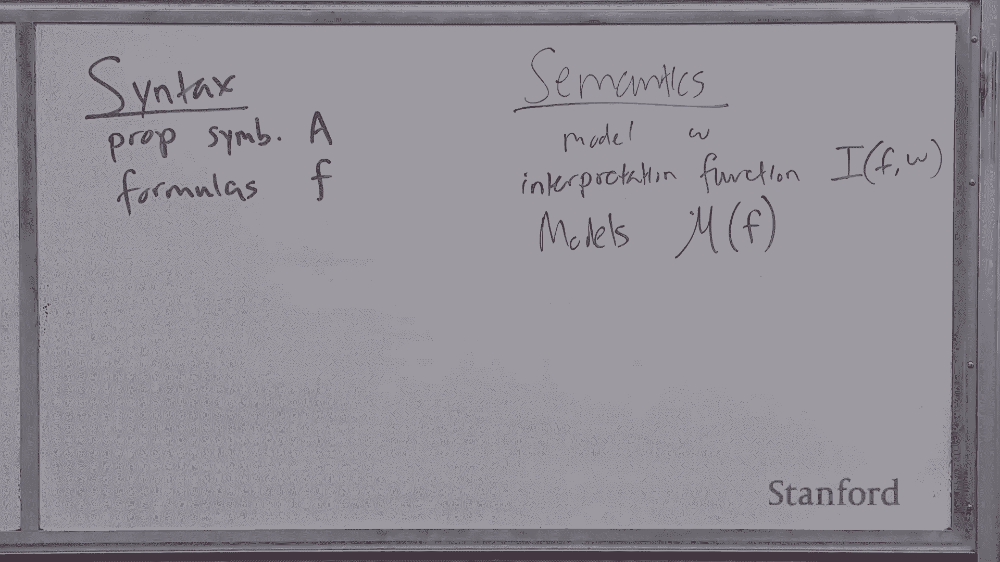

---

## 知识库与模型集合

一个有用的视角是将一个公式 `F` 视为其所有为真的模型所构成的集合，记作 `M(F)`。公式的含义就是它在所有可能世界（模型）中划出的一个子集。

**知识库** 是一组公式的集合，代表已知的事实。知识库 `KB` 所表示的模型集合 `M(KB)`，是其中所有公式模型集合的交集。随着你向知识库中添加新公式，可能的模型集合会不断缩小，这代表你的知识越来越精确。

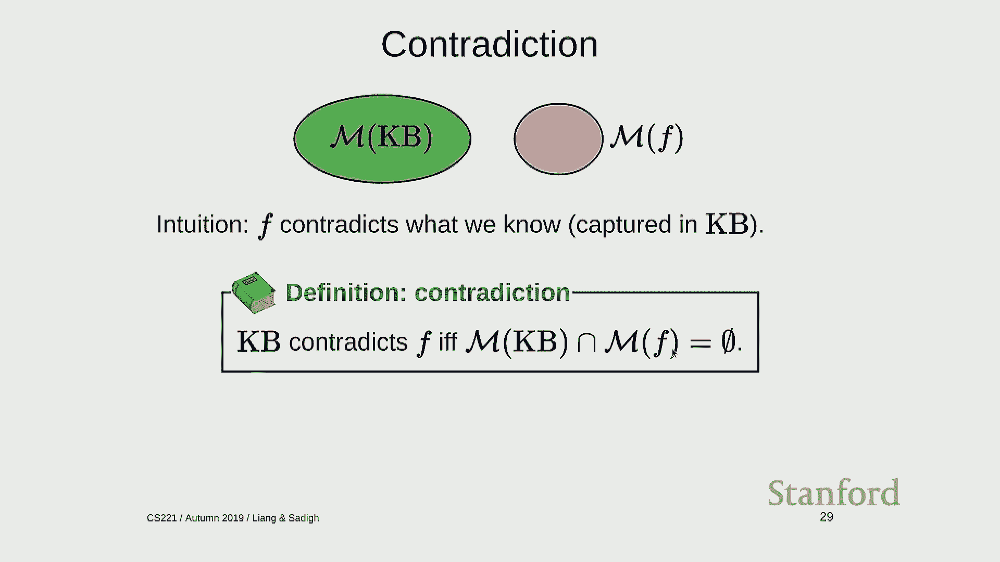

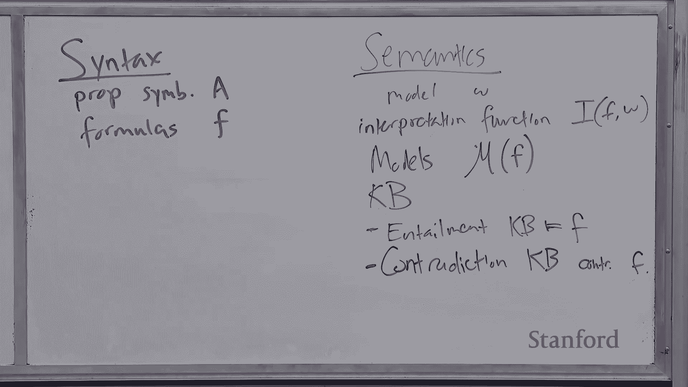

---

## 知识操作：告知与询问

给定一个知识库 `KB` 和一个新公式 `F`，它们之间的关系有三种可能：

1.  **蕴含**：`KB ⊨ F`。这意味着 `M(KB)` 是 `M(F)` 的子集。`F` 没有提供新信息。例如，已知“下雨且下雪”，再被告知“下雪”。
2.  **矛盾**：`KB` 和 `F` 矛盾。这意味着 `M(KB) ∩ M(F) = ∅`。`F` 与现有知识冲突。例如，已知“下雨且下雪”，再被告知“没下雪”。
3.  **偶然性**：`F` 为知识库增加了非平凡的新信息。`M(KB) ∩ M(F)` 既非空集，也非 `M(KB)` 本身。例如，已知“下雨”，再被告知“也下雪”。

基于这些关系，我们可以定义虚拟助理的两种基本操作：
*   **告知**：当用户陈述一个事实 `F` 时，系统根据关系做出响应（“已知”、“不信”或“学习到新知识”）。
*   **询问**：当用户提出一个是否问题 `F` 时，系统根据关系回答（“是”、“否”或“不知道”）。

---

## 可满足性与模型检验

**可满足性** 是一个关键概念：一个知识库 `KB` 是可满足的，当且仅当 `M(KB)` 非空（即不存在内部矛盾）。

我们可以将“询问”和“告知”操作都归结为检查可满足性问题。例如，要判断 `KB ⊨ F`（蕴含）是否成立，只需检查 `KB ∪ {¬F}` 是否**不可满足**。因为 `KB ⊨ F` 等价于 `KB` 与 `¬F` 矛盾。

在命题逻辑中，检查可满足性（SAT问题）本质上是一个约束满足问题：命题符号对应变量，公式对应约束。我们可以使用回溯搜索（如DPLL算法）或随机局部搜索（如WalkSAT算法）来寻找一个满足所有约束的赋值（模型），这个过程称为**模型检验**。

---

## 推理规则：在语法层面操作

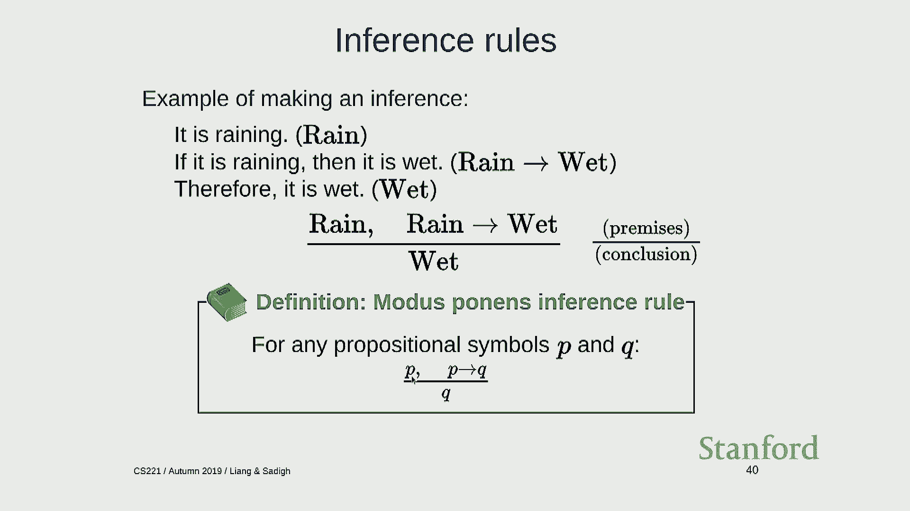

上一节我们介绍了在语义层面通过模型检验进行推理。本节我们来看看如何在语法层面，通过应用**推理规则**来直接操作公式，从而推导出新知识。


推理规则的形式为：`前提1, 前提2, ..., 前提k / 结论`。如果知识库中包含所有前提，就可以将结论添加到知识库中。

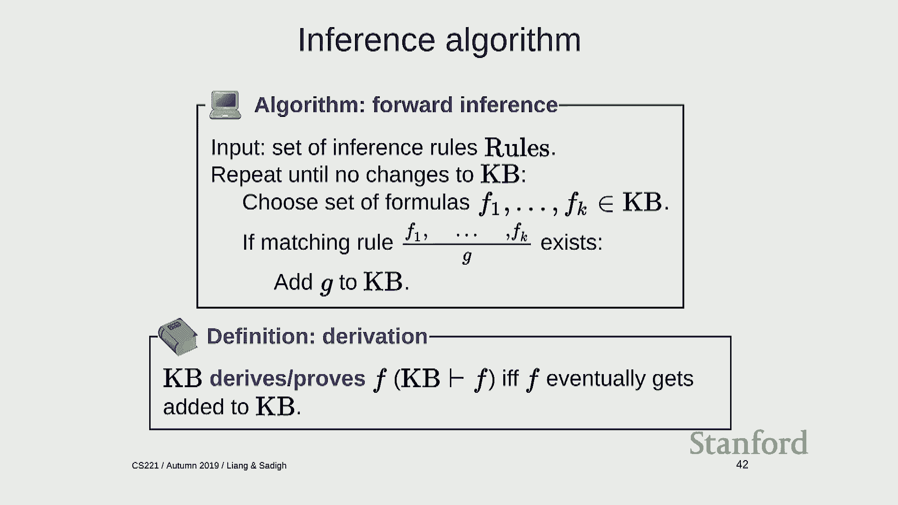

最著名的推理规则是**肯定前件**：
```
    P,  P ⇒ Q
    ---------
        Q
```
例如，从“下雨”和“如果下雨则地湿”，可以推出“地湿”。

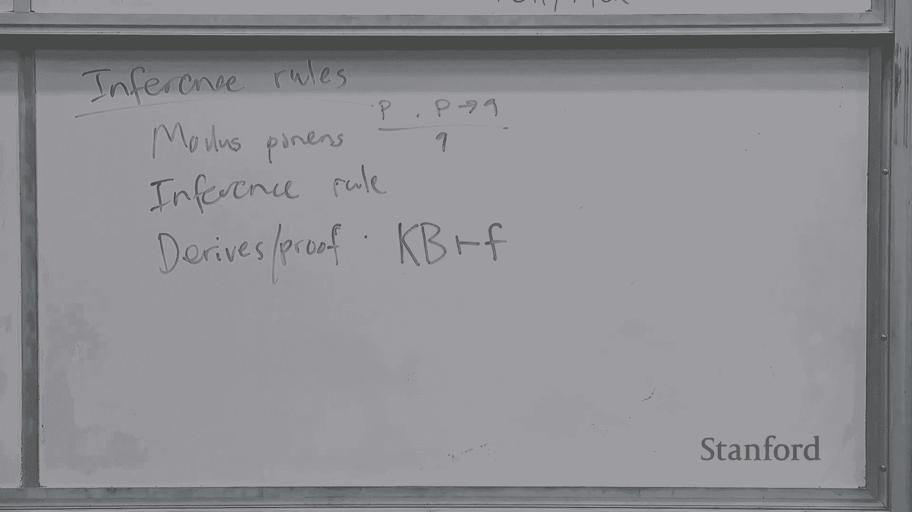

应用一组推理规则不断推导新公式的过程，称为**证明**。如果从知识库 `KB` 能通过推理规则推导出公式 `F`，我们记作 `KB ⊢ F`。

这里出现了两个关键概念：
*   `KB ⊨ F` （**语义蕴含**）：由模型关系定义，关注含义。
*   `KB ⊢ F` （**语法证明**）：由推理规则定义，关注符号操作。

理想情况下，我们希望推理规则既是**可靠的**（Sound），又是**完备的**（Complete）。
*   **可靠性**：如果 `KB ⊢ F`，那么 `KB ⊨ F`。即推导出的结论都是语义上正确的（“只包含真理”）。
*   **完备性**：如果 `KB ⊨ F`，那么 `KB ⊢ F`。即所有语义上正确的结论都能被推导出来（“包含所有真理”）。

肯定前件规则是可靠的，但对于完整的命题逻辑来说，它并不完备。

---

## 霍恩子句与肯定前件的完备性

为了使肯定前件规则变得完备，我们需要对逻辑公式的形式加以限制。我们引入**霍恩子句**。

**定式子句** 是形如 `(P₁ ∧ P₂ ∧ ... ∧ Pₖ) ⇒ Q` 的公式，其中右边是单个命题符号。
**目标子句** 是形如 `(P₁ ∧ P₂ ∧ ... ∧ Pₖ) ⇒ False` 的公式，等价于 `¬(P₁ ∧ P₂ ∧ ... ∧ Pₖ)`。

霍恩子句就是定式子句或目标子句。

对于只包含霍恩子句的知识库，**肯定前件规则是可靠且完备的**。这意味着，如果一个命题符号 `Q` 在语义上被知识库蕴含（`KB ⊨ Q`），那么通过反复应用肯定前件规则，一定能在语法上证明它（`KB ⊢ Q`）。

**示例推理过程：**
知识库：`{Rain, Rain ⇒ Wet, (Wet ∧ Weekday) ⇒ Traffic, Weekday}`
询问：`Traffic?`
1.  匹配 `Rain` 和 `Rain ⇒ Wet`，推出 `Wet`。
2.  匹配 `Wet`、`Weekday` 和 `(Wet ∧ Weekday) ⇒ Traffic`，推出 `Traffic`。
推导成功，回答“是”。

---

## 总结 🎯

本节课我们一起学习了命题逻辑的基础。
*   我们介绍了逻辑的三大要素：**语法**（定义公式）、**语义**（通过模型和解释函数赋予含义）和**推理规则**（进行语法推导）。
*   我们学习了如何用公式表示知识，以及知识库与公式之间的**蕴含**、**矛盾**和**偶然性**关系。
*   我们探讨了通过**可满足性检查**（模型检验）进行语义推理，以及通过**推理规则**（如肯定前件）进行语法推理这两种途径。
*   最后，我们看到了在**霍恩子句**这一受限但有用的语言片段中，肯定前件规则既能保证可靠性，又能保证完备性，实现了语义与语法推理的等价。


逻辑为我们提供了一种强大而精确的知识表示和推理工具。在下节课中，我们将学习更强大的推理规则（如归结原理），以处理更一般的命题逻辑公式。