# 17：一阶逻辑 🧠


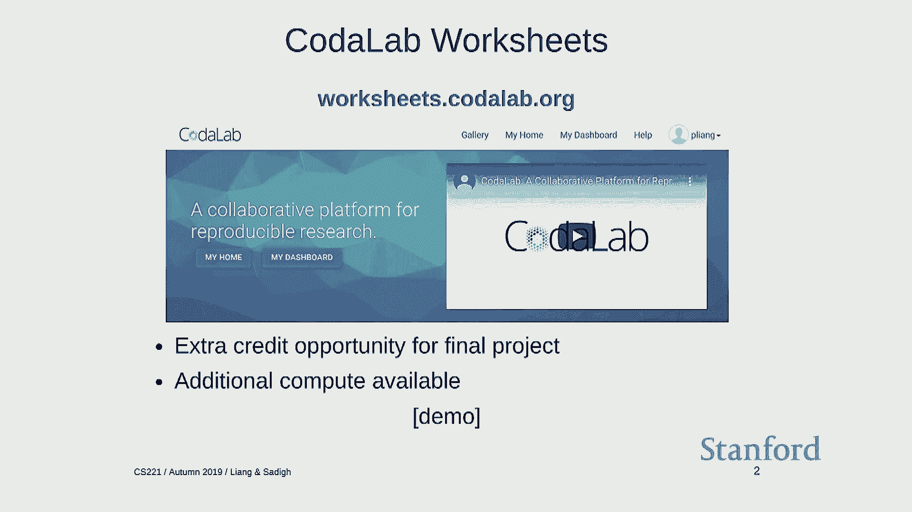


在本节课中，我们将学习一阶逻辑。我们将首先回顾命题逻辑，特别是归结推理规则，然后深入探讨一阶逻辑的语法、语义和推理规则。一阶逻辑通过引入对象、谓词和量词，极大地增强了我们表达和推理世界知识的能力。

## 公告与工具介绍 📢

在进入逻辑主题之前，有一些课程相关的公告。考试将在明天进行。下周是感恩节假期，因此没有课程和讨论课。假期结束后的周一，将有一个海报展示环节。

此外，我想花几分钟介绍一个名为 Codal Lab Worksheets 的平台。这是一个旨在帮助人们以更高效、可复现的方式进行研究的工具。对于本课程，使用该平台可以获得额外学分，并且它还能提供额外的计算资源。

Codal Lab 的工作表类似于 Jupyter Notebook。你可以在其中编写文本、上传代码或数据。每个资源（数据或代码）在 Codal Lab 中被称为一个“包”。你可以运行命令、指定依赖项、监控作业进度，并将所有实验资产（数据、代码、结果）以可追溯的方式记录下来。

## 回顾：命题逻辑与推理 🔙

上一节我们介绍了逻辑。任何逻辑系统都包含三个要素：语法、语义和推理规则。

*   **语法**：定义一组有效的公式。例如，在命题逻辑中，`rain ∧ wet` 是一个公式。公式本身只是符号，没有内在含义。
*   **语义**：通过解释函数为公式赋予含义。它将一个公式和一个代表世界状态的模型映射为真或假。更一般地说，一个公式划定了一组使其为真的模型集合。
*   **推理规则**：给定一个知识库（一组公式），可以推导出哪些新公式。

我们讨论了**蕴涵**和**推导**这两个概念。蕴涵是语义上的关系：知识库 KB 蕴涵公式 F，当且仅当所有使 KB 为真的模型也使 F 为真。推导则是符号操作：使用一组推理规则从 KB 产生 F。

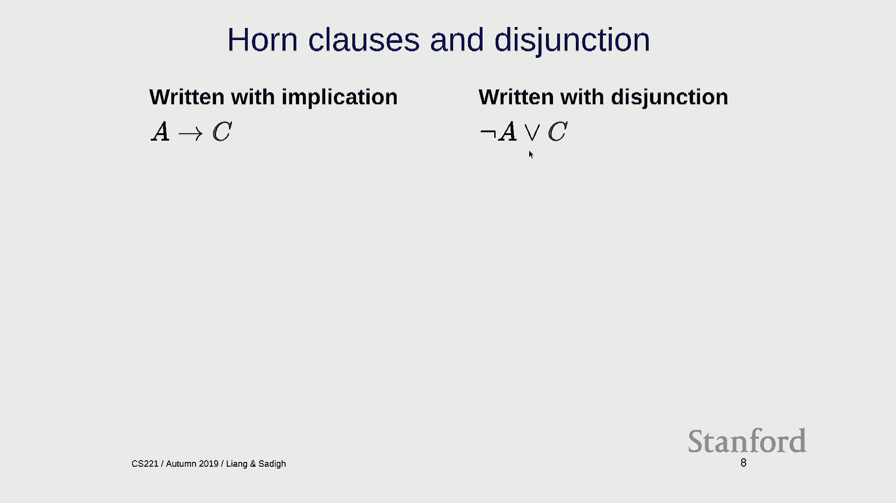

推理规则的关键属性是**可靠性**和**完备性**。
*   **可靠性**：所有能推导出的公式都是被蕴涵的（推导不会出错）。
*   **完备性**：所有被蕴涵的公式都能被推导出来（推导能力足够强）。

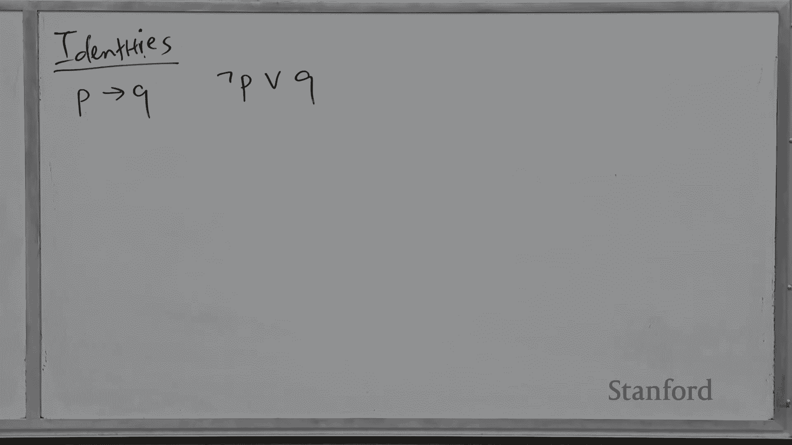

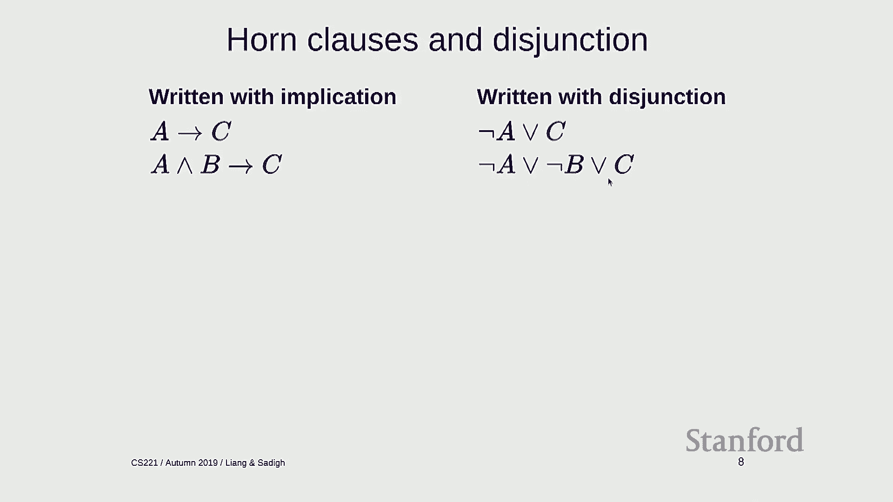

我们之前看过的**肯定前件**推理规则如下：
```
如果已知 `A` 和 `A → B`，则可以推导出 `B`。
```
在命题逻辑中，仅使用肯定前件规则是可靠的，但对于完整的命题逻辑来说并不完备。

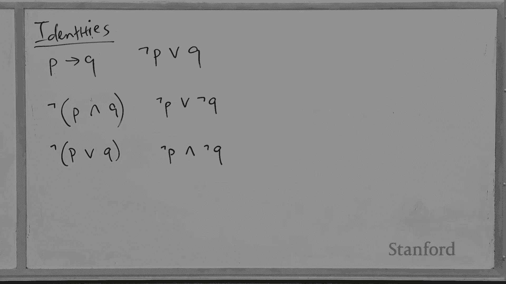

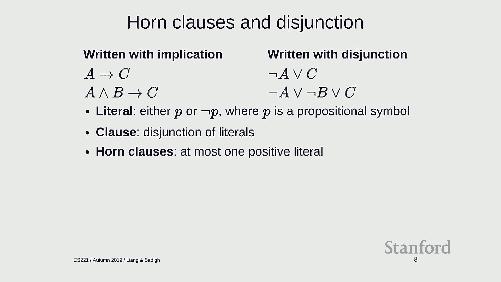

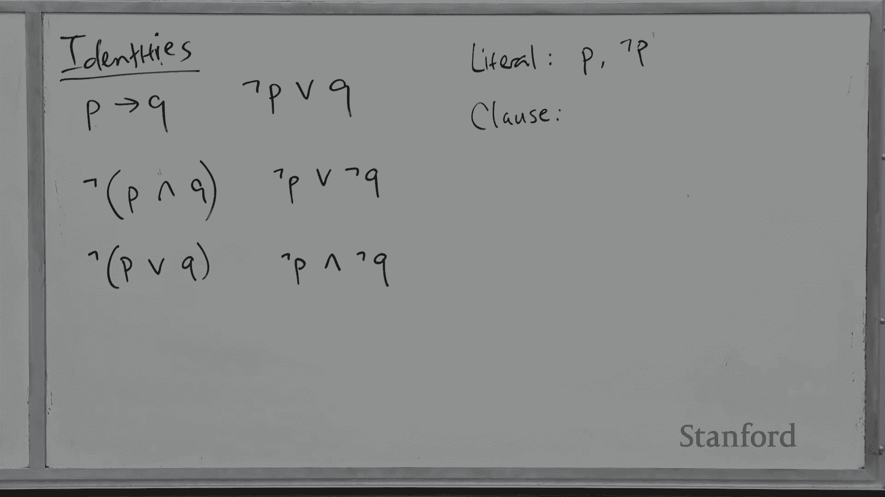

## 归结推理规则 ⚙️

为了处理完整的命题逻辑，我们需要更强大的推理规则。本节我们将介绍**归结**规则。

首先，我们回顾一些概念和恒等式，它们有助于将公式转化为更适合归结的形式。
*   **文字**：一个命题符号或其否定。
*   **子句**：文字的析取（用 `∨` 连接）。
*   **霍恩子句**：至多含有一个正文字的子句。

利用恒等式 `p → q ≡ ¬p ∨ q`，我们可以将蕴含式写为子句形式。例如，`A → C` 等价于 `¬A ∨ C`。

**归结规则**是命题逻辑中一个强大且完备的推理规则。它的基本形式是：如果两个子句中包含互补的文字，就可以消去它们，并将其余部分合并。
```
已知：`P ∨ A1 ∨ ... ∨ Am`
已知：`¬P ∨ B1 ∨ ... ∨ Bn`
可推导：`A1 ∨ ... ∨ Am ∨ B1 ∨ ... ∨ Bn`
```
**直观理解**：你知道 `P` 或一些其他事实成立，同时你也知道 `¬P` 或另一些事实成立。那么，`P` 和 `¬P` 不可能同时为假，因此 `A1...` 或 `B1...` 中至少有一组必须成立。

为了对任意命题逻辑公式使用归结，我们需要先将所有公式转换为**合取范式**。
*   **CNF**：子句的合取（用 `∧` 连接）。每个子句是文字的析取。

转换到 CNF 的一般步骤如下：
1.  消去双向蕴含 `↔` 和蕴含 `→`。
2.  将否定 `¬` 向内移动，直至只作用于命题符号（使用德摩根定律）。
3.  消除双重否定。
4.  必要时，使用分配律将析取 `∨` 分配到合取 `∧` 内部。

**归结算法**通常采用反证法。要证明 `KB ⊨ F`：
1.  将 `¬F` 加入知识库 `KB`。
2.  将 `KB ∪ {¬F}` 中的所有公式转换为 CNF。
3.  反复应用归结规则。
4.  如果能推导出空子句（代表 `False`），则说明 `KB ∪ {¬F}` 不可满足，从而证明 `KB ⊨ F`。

需要注意的是，虽然归结对于命题逻辑是完备的，但其时间复杂度在最坏情况下是指数级的。相比之下，仅用于霍恩子句的肯定前件推理是线性时间的，但表达能力受限。

## 引入一阶逻辑 🚀

命题逻辑有什么问题？它对于表达丰富的世界知识可能显得笨拙或力不从心。例如：
*   “Alice 和 Bob 都懂算术” 尚可表示为 `Knows(Alice, Arithmetic) ∧ Knows(Bob, Arithmetic)`。
*   “所有学生都懂算术” 在命题逻辑中就需要为每个学生写一条规则，无法简洁表达。
*   “每个大于2的偶数都可以写成两个素数之和” 这类涉及无穷域和存在性断言的陈述，命题逻辑几乎无法处理。

问题的核心在于，命题逻辑将每个原子事实视为不可分割的符号。而一阶逻辑引入了**内部结构**：
*   **对象**：如 Alice, Arithmetic。
*   **谓词**：描述对象间的关系或属性，如 `Knows(x, y)`。
*   **量词**：如 `∀`（对所有）和 `∃`（存在）。

这使得我们可以简洁地表达通用规则，例如：
`∀x (Student(x) → Knows(x, Arithmetic))`

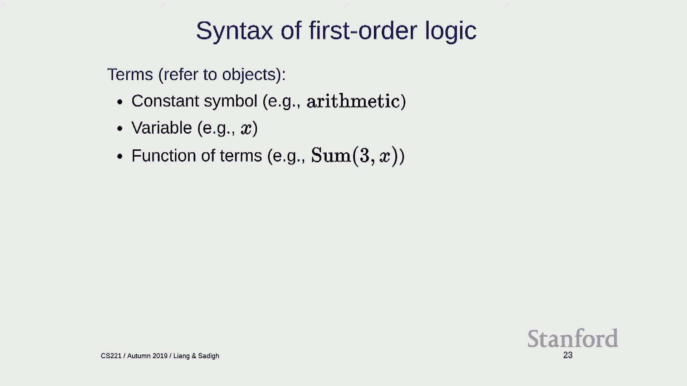

## 一阶逻辑：语法与语义 📖


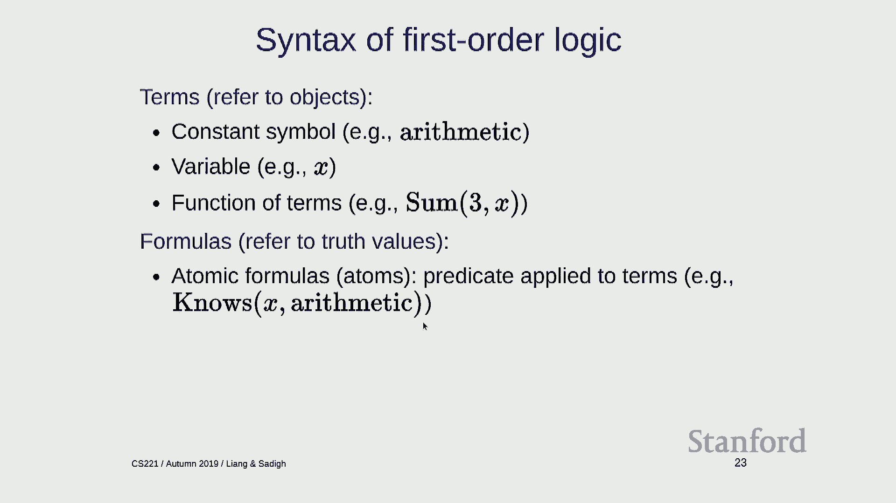

一阶逻辑的语法包含两种类型的表达式：**项**和**公式**。


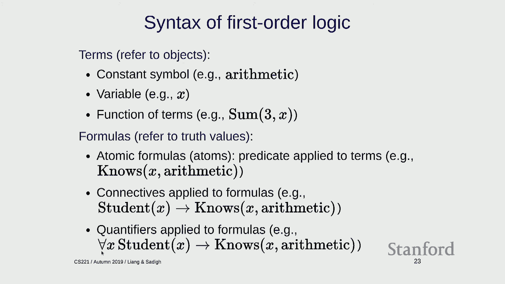

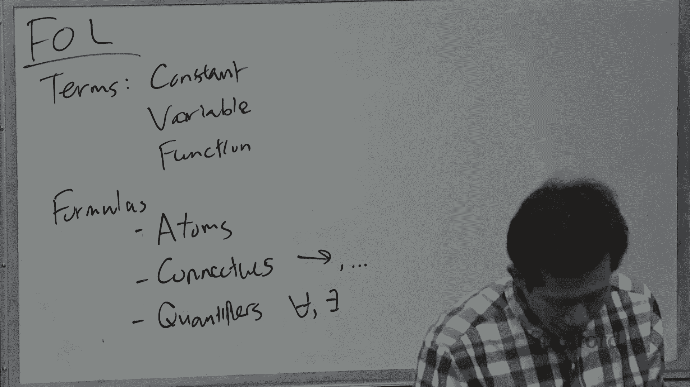

**项**指代对象：
*   常元符号：如 `Alice`。
*   变量：如 `x`。
*   函数作用于项：如 `fatherOf(John)`。

**公式**具有真值：
*   **原子公式**：谓词作用于项，如 `Knows(x, Arithmetic)`。它是构成更复杂公式的基本单位。
*   **复合公式**：使用连接词 `¬`、`∧`、`∨`、`→`、`↔` 连接原子公式构成，就像在命题逻辑中一样。
*   **量化公式**：在公式前加上量词，如 `∀x P(x)` 或 `∃y Q(y)`。

**量词**是一阶逻辑的核心：
*   `∀x P(x)`：对所有 `x`，`P(x)` 为真。可视为一个巨大的合取。
*   `∃x P(x)`：存在某个 `x`，使得 `P(x)` 为真。可视为一个巨大的析取。
*   量词的顺序很重要：`∀x ∃y Loves(x, y)` 与 `∃y ∀x Loves(x, y)` 含义不同。
*   否定穿过量词时遵循规则：`¬∀x P(x) ≡ ∃x ¬P(x)`，`¬∃x P(x) ≡ ∀x ¬P(x)`。

将自然语言翻译为一阶逻辑时，一个经验法则是：`∀` 通常与 `→` 搭配，`∃` 通常与 `∧` 搭配。
*   “每个学生都懂算术”：`∀x (Student(x) → Knows(x, Arithmetic))`
*   “某个学生懂算术”：`∃x (Student(x) ∧ Knows(x, Arithmetic))`

一阶逻辑的**语义**（模型）比命题逻辑复杂。一个模型需要：
1.  定义一个**论域**（所有可能对象的集合）。
2.  为每个常元符号指定论域中的一个对象。
3.  为每个谓词符号指定其在论域上的一组关系（哪些对象元组使该谓词为真）。
4.  为每个函数符号指定论域上的一个函数。

为了简化，有时会做两个假设：**唯一命名假设**（不同名称指代不同对象）和**域封闭假设**（每个对象都有一个名称）。在此假设下，如果论域有限，一阶逻辑知识库可以通过**命题化**转换为一个等价的（可能很大的）命题逻辑知识库，从而可以使用命题逻辑的推理方法。

## 一阶逻辑中的推理 🧩

本节我们探讨一阶逻辑中的推理规则。我们将看到，核心思想是通过**替换**和**合一**来处
理变量。

首先看**一阶霍恩子句**和**肯定前件**的推广。一阶霍恩子句（或称定子句）形式如下：
`∀x1,...,xk (A1 ∧ ... ∧ An → B)`
其中 `Ai` 和 `B` 是原子公式。

简单的肯定前件规则 `A, A→B ⊢ B` 在一阶逻辑中不能直接应用，因为 `A` 和规则中的前件可能形式不完全匹配。例如，已知 `Knows(Alice, Arithmetic)` 和规则 `∀x (Knows(x, Arithmetic) → GoodAtMath(x))`，我们需要将规则中的变量 `x` **替换**为 `Alice` 才能应用。

这引出了两个关键操作：
*   **替换**：将公式中的变量映射到项。记作 `θ = {x/Alice, y/z}`，应用 `θ` 到公式 `F` 得到 `Fθ`。
*   **合一**：找到一种替换，使两个公式变得相同。例如，合一 `Knows(Alice, y)` 和 `Knows(x, Arithmetic)` 得到替换 `{x/Alice, y/Arithmetic}`。

现在，一阶肯定前件规则可以表述为：
```
已知：`A1'`, ..., `Ak'` (具体事实)
已知：`∀x1,...,xm (A1 ∧ ... ∧ Ak → B)` (通用规则)
如果存在替换 `θ` 使得对于每个 `i`，`Aiθ = Ai'`，则可推导出 `Bθ`。
```
**直观理解**：用具体事实去匹配通用规则的前件，找到变量应该如何实例化，然后得到相应的结论。

如果没有函数符号，且常元数量有限，这种推理可能在有限步内终止（尽管可能产生大量公式）。但如果存在函数符号，可能产生无限多的新原子公式，导致推理过程是**半可判定的**：如果公式被蕴涵，算法最终能证明它；如果不被蕴涵，算法可能永远运行下去。

对于完整的一阶逻辑（包含非霍恩子句），我们需要使用**一阶归结**。策略与命题逻辑类似：
1.  将所有公式（包括待证公式的否定）转换为 **CNF**。这个转换过程更复杂，需要处理量词，特别是要将存在量词 `∃` 通过引入**斯柯伦函数**来消除。
2.  反复应用**归结规则**，并配合**合一**操作。

一阶归结规则如下：
```
已知子句：`L1 ∨ ... ∨ Lm`，其中包含文字 `P`
已知子句：`M1 ∨ ... ∨ Mn`，其中包含文字 `¬Q`
如果 `P` 和 `Q` 可以合一，即存在替换 `θ` 使得 `Pθ = Qθ`，
则可推导出：`(L1 ∨ ... ∨ Li-1 ∨ Li+1 ∨ ... ∨ Lm ∨ M1 ∨ ... ∨ Mj-1 ∨ Mj+1 ∨ ... ∨ Mn)θ`
```
**直观理解**：找到两个子句中可合一的一对互补文字，消去它们，并将替换应用于合并后的剩余部分。

## 总结与回顾 🎯

本节课我们一起学习了从命题逻辑到一阶逻辑的进阶。

我们首先回顾了命题逻辑中的**归结**规则，它是一种强大且完备的推理方法，但计算成本较高。作为对比，**肯定前件**规则在**霍恩子句**片段上是高效且完备的，但表达能力有限。

然后，我们探讨了**一阶逻辑**，它通过引入**项**、**谓词**和**量词**，极大地提升了知识表示的简洁性和表达能力。一阶逻辑的公式具有丰富的内部结构。

在一阶逻辑推理中，我们介绍了处理变量的关键技术：**替换**和**合一**。基于此，我们推广了肯定前件规则用于一阶霍恩子句，并介绍了一阶归结规则用于完整的一阶逻辑。

关键的要点是：
*   逻辑提供了表达复杂知识的严谨语言。
*   一阶逻辑中的**变量**和**量词**是实现简洁而强大表达的核心。
*   尽管一阶逻辑的推理（特别是包含函数符号时）是半可判定的，但其理论框架和算法（如归结）为自动化推理奠定了基础。

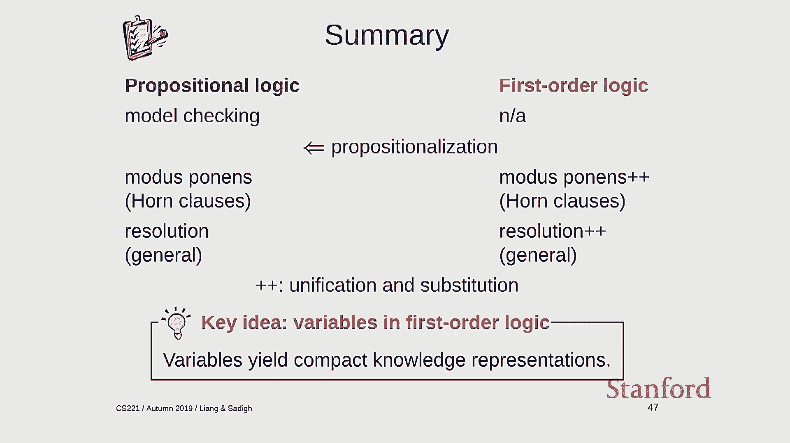

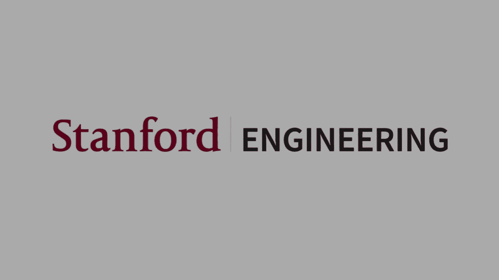

从实践角度看，可以根据需求选择不同的逻辑“套餐”：追求效率可选择霍恩子片段的肯定前件推理；需要更强表达能力时，则需承担归结等更复杂推理机制的计算成本。