# 18：深度学习入门 🧠

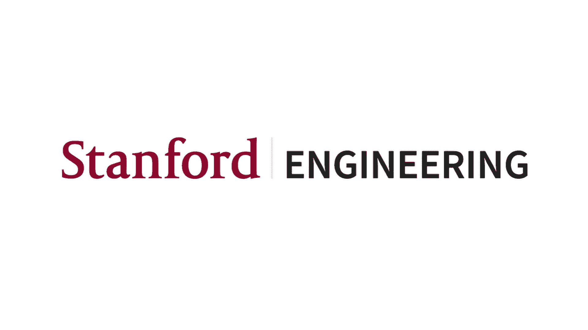

在本节课中，我们将学习深度学习的基础知识。我们将从历史背景开始，了解其发展脉络，然后深入探讨前馈神经网络、卷积神经网络、循环神经网络以及无监督学习等核心概念。课程旨在为初学者提供一个全面而浅显的概览，为后续深入学习打下基础。

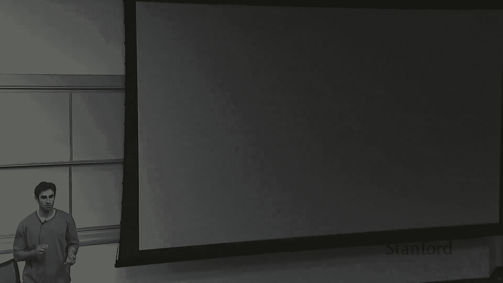

## 历史背景 📜

上一节我们介绍了课程概述，本节中我们来看看深度学习的发展历史。深度学习近年来非常流行，但其历史可以追溯到很久以前。

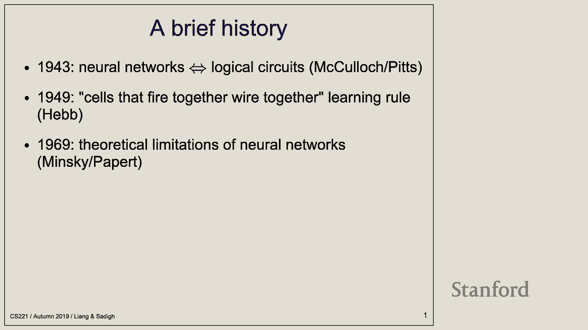

早在20世纪40年代，人们就开始尝试构建计算神经科学模型。他们注意到大脑中的神经元以网络形式排列，并认为智能源于这些微小的部分。因此，他们非常希望对此进行建模。

*   **McCulloch 和 Pitts** 是真正开始这项工作的人。Pitts是一位逻辑学家，他们关注的是用网络拓扑结构构建逻辑电路，研究网络能实现何种逻辑表达式。
*   当时这只是一个数学模型，没有反向传播，没有参数，也没有推理，主要是尝试撰写关于这些结构能解决何种问题的定理和证明。
*   大约十年后，**Hebb** 出现，并开始将研究方向引向训练这些网络。他注意到，如果两个细胞经常一起激活，那么它们之间应该存在某种强连接。这是受观察启发，当时并没有正式的数学理论支持，很多只是非常聪明的人的猜想。
*   直到20世纪60年代，神经网络可以说进入了主流，很多人都在思考并对此感到兴奋。但在1969年，**Minsky 和 Papert** 出版了著名的《Perceptrons》一书，其中包含大量证明。他们基本上证明了浅层神经网络的局限性。
*   当时，这对神经网络研究是一个不小的打击。主流AI变得更加偏向逻辑，而神经网络则被推向了少数派群体。虽然仍有人在思考和研究，但主流AI无疑转向了Percy过去几周讨论的基于符号逻辑的方法。
*   尽管如此，仍有人在幕后继续工作。例如，1974年，**Werbos** 提出了反向传播的思想，即使用链式法则自动更新权重以改进预测。
*   后来，**Hinton、Rumelhart 和 Williams** 普及了这一方法。他们重新发现了Werbos的成果，并告诉大家可以使用反向传播，这是一种数学上合理、理论基础良好的训练深度神经网络的方法。
*   在20世纪80年代，卷积神经网络可以追溯到这一时期。日本的**Fukushima**发明了“Neocognitron”，为CNN架构奠定了基础，但当时没有训练方法。在论文中，他们使用了手动调整的权重。
*   大约十年后，**LeCun** 出现，他将反向传播的思想应用于CNN。LeCun提出了著名的LeNet网络，这是一个非常著名的支票识别系统，也是深度学习最早的大规模工业应用之一。
*   后来，循环神经网络在20世纪90年代出现。**Elman** 提出了它。随后出现了训练问题，我们稍后会讨论，即梯度爆炸或消失问题。
*   大约十年后，**Hochreiter 和 Schmidhuber** 提出了长短期记忆网络，在某种程度上解决了这些问题。
*   尽管如此，神经网络仍然属于少数派。在80年代，人们使用大量基于规则的AI。在90年代，人们热衷于支持向量机和发明新的核函数。
*   在21世纪初，人们终于取得了进展。Hinton提出了一个很酷的想法：我们可以一次训练这些深度网络的一层。先预训练一层，然后预训练第二层并堆叠上去，第三层再堆叠上去，从而逐步构建起这些连续的表示。
*   深度学习大约在三四年前真正开始兴起，并从此进入主流。作为其主流化的证据，你可以看到它在所有领域的应用。

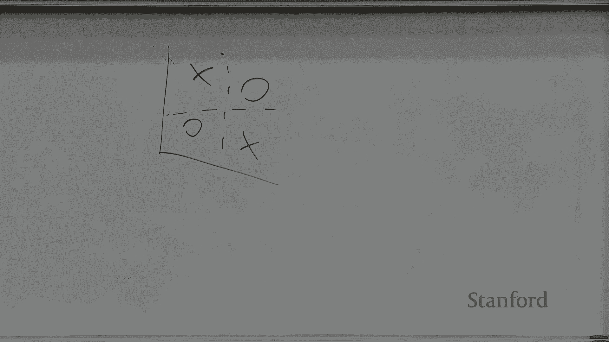

## 深度学习的力量 💪

上一节我们回顾了历史，本节中我们来探讨深度学习为何如此强大。从广义上讲，深度学习是一种学习方式，可以吸收任何类型的数据，无论是序列、图片、向量，甚至是像围棋这样的游戏，并将其转化为一个向量。

这个向量将成为该数据所捕获信息的密集表示。这非常强大，因为这些向量具有组合性。你可以使用深度学习系统的这些组件，像乐高积木一样，连接向量、将它们相加，并利用它们来修改模型。正是这种组合性使其非常灵活。

今天我们将讨论前馈网络、适用于图像或任何具有重复结构信息的卷积网络、处理序列的循环网络，以及如果有时间，还会涉及一些无监督学习主题。

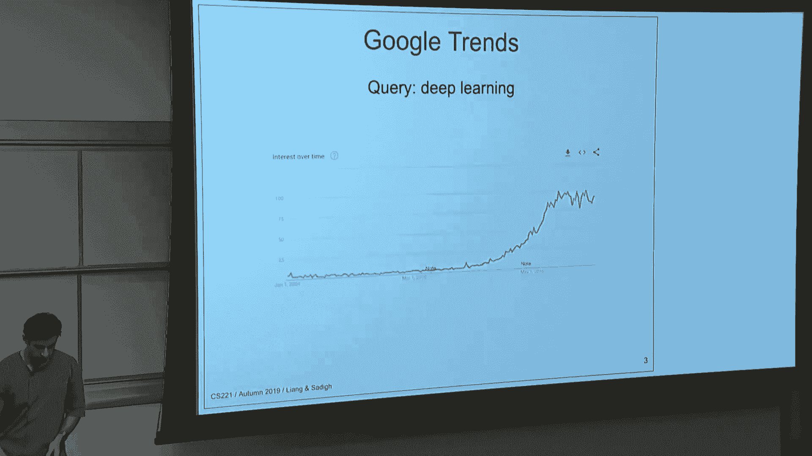

## 前馈神经网络 🔄

在课程最开始，我们讨论过线性预测器。线性预测器基本上就是定义一个权重向量 **W**，然后将其与输入点乘，得到输出。

神经网络的定义非常相似。你可以将每个隐藏单元视为某种线性预测器的结果。反向推导，你定义一个向量 **W**，用某个激活函数（或一些隐藏输入）与其点乘，得到输出。然后，通过定义一个向量并用输入计算隐藏数，再用隐藏数计算最终输出，从而得到隐藏层。

在某种程度上，你像是在堆叠线性预测器。每个数字，比如 h1, h2 和 f(θ)，都可以看作是一个小型线性预测器的结果，它们以某种方式连接在一起。

为了可视化，如果我们想加深网络，只需重复这个过程。

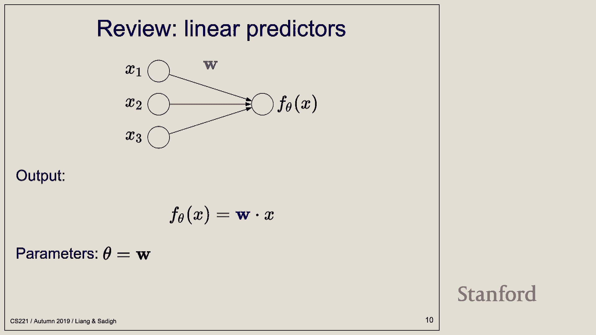

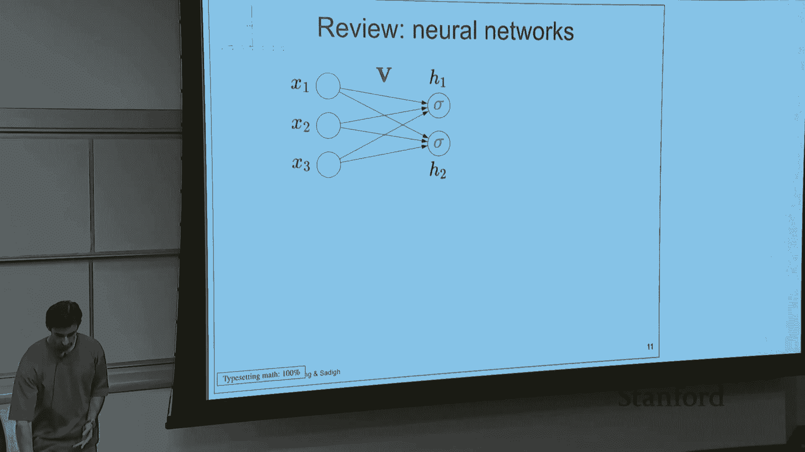

*   这可以称为单层神经网络，也就是我们之前讨论的线性预测器。你有一个权重向量，并将其应用于输入。
*   对于两层网络，你不是将向量应用于输入，而是将矩阵应用于输入，从而得到一个新的向量。然后，将这个中间向量（隐藏向量）与另一组权重点乘，得到最终输出。
*   然后你可以不断重复。通过一个向量，通过一个矩阵得到新向量，再通过另一个矩阵得到新向量，最后在末端与一个向量点乘得到一个数字。

关于深度，这是这些模型真正强大的原因之一。对于为什么深度有帮助以及为什么堆叠这些矩阵效果良好，有很多解释。

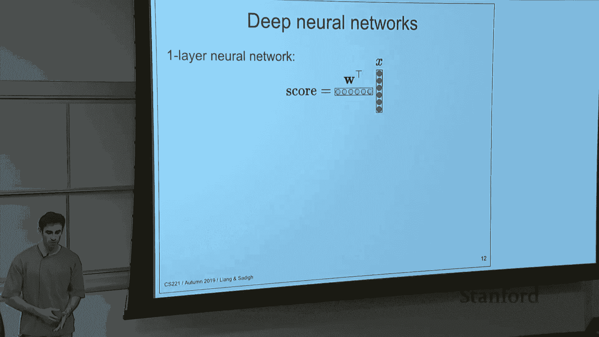

*   一种思考方式是，它学习了输入的分层表示。**H** 将是 **X** 的某种表示，**H‘** 将是 **X** 的更高层次表示。
*   另一种思考方式是，每一层都像是处理中的一个步骤。你可以把它想象成一个 for 循环，迭代次数越多，步骤越多，深度越深，你能对输入执行的处理就越多。
*   最后，网络越深，它能表示的函数种类就越多，因此也具有灵活性。

但总的来说，对于为什么深度有帮助，并没有很好的正式理解。深度学习的理论与实践之间肯定存在差距。

这大致说明了深度为何有帮助。如果你输入像素，也许第一层进行边缘检测，第二层给出小眼睛、鼻子或耳朵，第三层及以上则给出整个物体。

总结一下，我们有这些深度神经网络，它们学习数据的分层表示。你可以用训练线性分类器的相同方式来训练它们，即使用梯度下降。

你定义损失函数，对损失求导，然后传播梯度，朝你认为有益的方向更新。这个优化问题很困难，因为它是非线性且非凸的。但总的来说，我们发现如果你投入大量数据和计算资源，总能设法训练好。

幻灯片顺序似乎有点乱。但基本上，回顾如何训练这些模型，总体上与线性预测器相同。你定义一个损失函数，例如均方误差损失：取真实输出与预测输出之差的平方。目标是最小化这个损失。

方法是：从训练数据中采样数据点，计算损失函数对参数的导数，然后朝梯度相反方向更新，希望这能让你在误差曲面上下降。

问题在于这是一个非凸优化问题。例如，线性分类器因为是线性的，误差曲面看起来像个碗。而这些模型由于非线性激活函数，最终会得到看起来非常混乱的误差曲面。

在21世纪之前，这是阻碍神经网络发展的首要问题，因为它们很难训练成功。基本上，改变现状的因素之一是更快的计算机。我们有了GPU，可以并行化操作，特别是那些大型矩阵乘法。其次，数据也更多了。

但这并不完全正确。我们还发现了许多其他技巧。

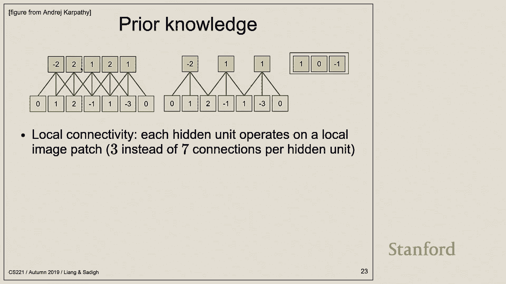

*   例如，拥有大量隐藏单元会有所帮助，因为它提供了优化上的灵活性。如果你的模型容量超过所需，那么你可以学习更灵活的函数。
*   我们有更好的优化器。SGD每次朝相同方向移动相同的步长，而像Adam这样的新优化器则能决定在选定方向后移动多远。
*   我们有**Dropout**，即对每个隐藏单元的输出添加噪声。这使模型对其自身错误更具鲁棒性，并防止过拟合。
*   有更好的初始化策略，例如Xavier初始化。
*   还有像在相关数据集上预训练模型，然后再转移到你真正关心的数据上的技巧。
*   以及像**批归一化**这样的技巧，它确保输入到神经网络单元的数据是正态分布的（均值为0，标准差为1）。这样做基本上允许你使用更大的步长。

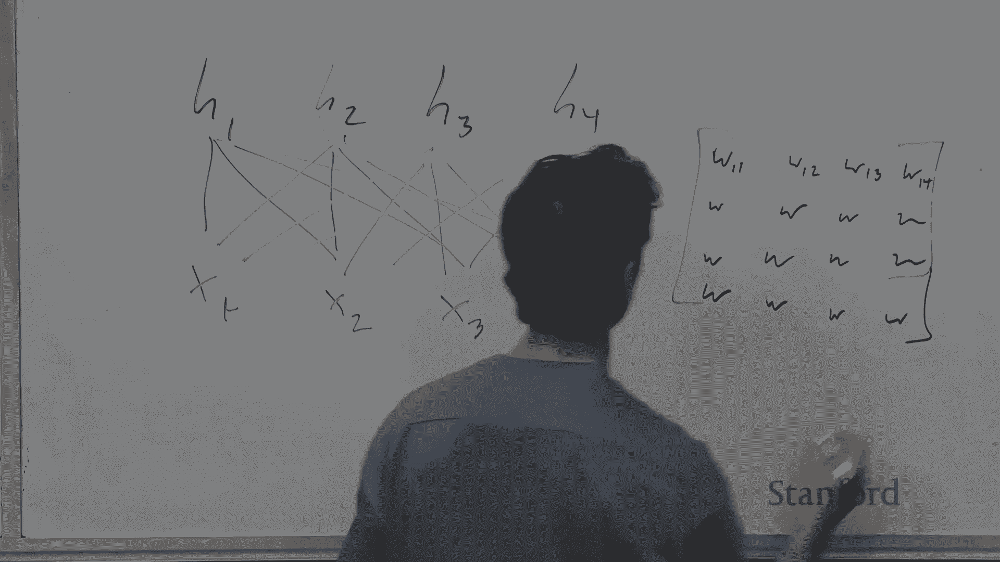

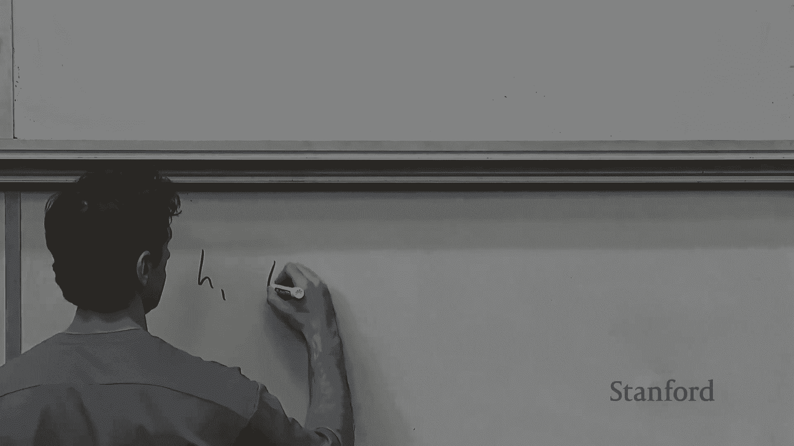

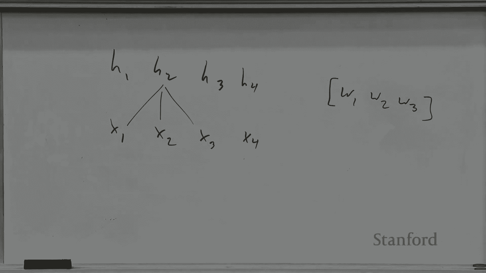

这里的要点是，总的来说，你定义的优化问题和模型架构是紧密耦合的。要找到正确的平衡点有点像黑魔法，我们仍然不太擅长。

## 卷积神经网络 🖼️

现在我们来讨论卷积神经网络。它们处理图像。动机是：我们有一张图片，想对其做一些机器学习处理。我们拥有所需的所有工具。你可以说，每个像素都是一个大长向量中的一个元素，然后直接将其输入矩阵。

但问题是，这并没有真正利用图片中的空间结构。这个像素与那个像素的相似度，比与下面那个像素的相似度更高。但如果你将整个图片通过一个矩阵，那么每个像素都会被独特且不同地对待。因此，我们希望利用这种空间结构。

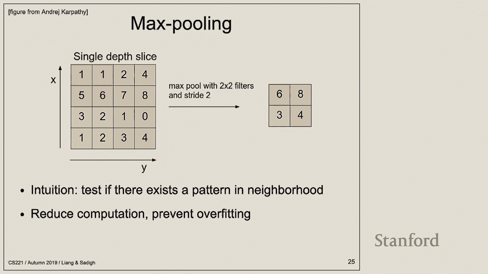

核心思想是卷积。卷积中有一个称为**滤波器**的东西，它是一些参数的集合。你做的就是在输入上滑动这个滤波器，以产生每个输出元素。

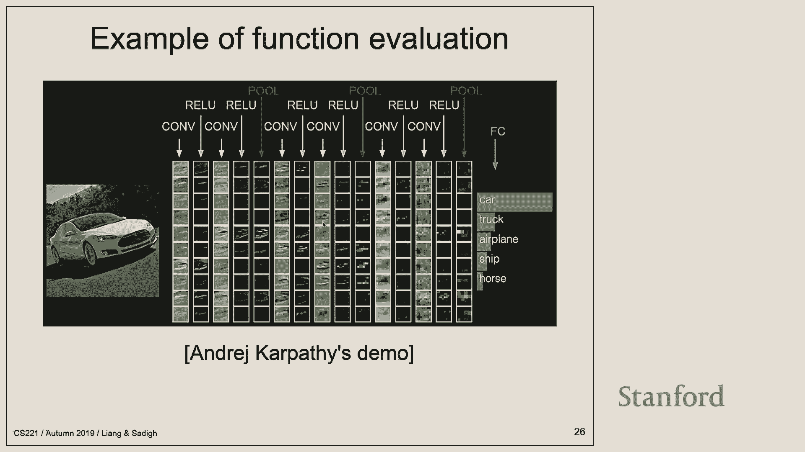

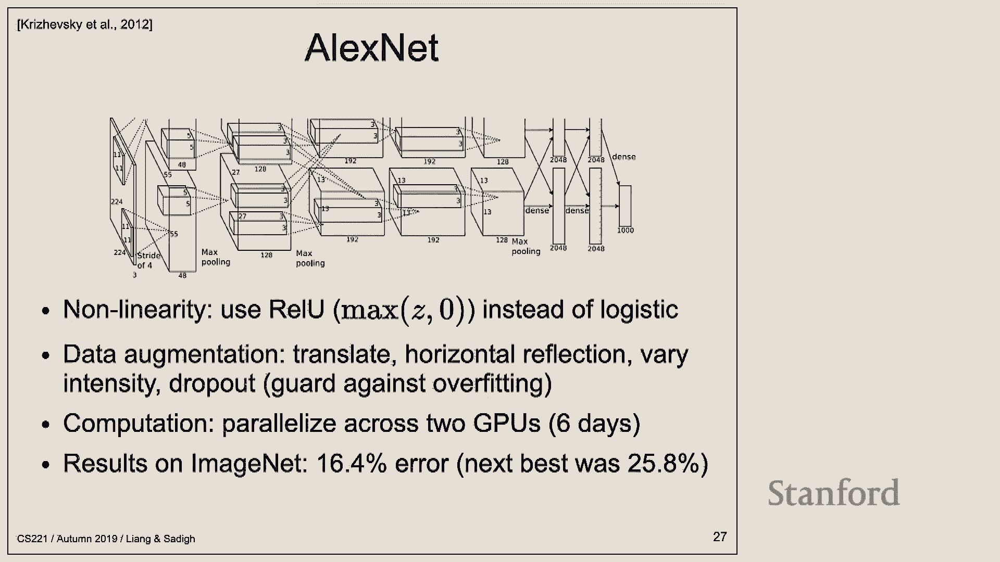

例如，这个滤波器应用于左上角时，产生输出的左上角。滤波器的应用有点像点积，你将所有数字相乘，然后求和。

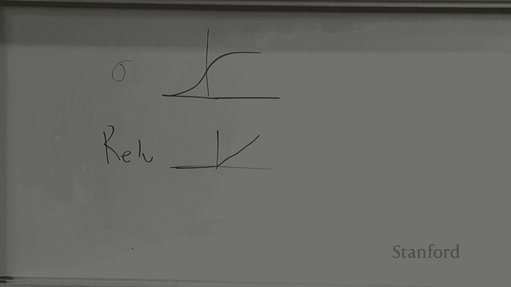

产生这些输出的方法是：取你的滤波器，基本上在输入中滑动它，以在下一层获得输出。

这个例子更具体一些。这里展示的是一维卷积，因为我们有一个一维滤波器，并水平滑动它。

这种方法的优势之一是参数效率。在常规的全连接层中，每个隐藏单元都连接到每个输入单元，参数会形成一个庞大的矩阵。而进行卷积时，由于局部连接性的概念，每个隐藏层只连接到其感受野内的输入，并且参数是共享的，因为你在输入的不同位置使用相同的滑动窗口。

这提供了局部连接性，参数效率更高，并且对滤波器有很好的直观解释。总的来说，在实践中，输入和滤波器都是高维体积，滤波器是一个在输入空间中滑动的立方体。输出也是一个体积，因为你有多个滤波器。

人们做的另一件事是**最大池化**。这指的是在输入区域中寻找最大激活值，并将其传递到后续层。直观上，你是在输入区域中搜索模式。这也有助于降低维度，因为最终我们需要将数据压缩到很少的几个数字。

这些网络的工作方式相当直接。基本上，你只是组合层，将它们堆叠起来，加入一些池化，维度不断降低，直到最终得到可能标签上的分布。

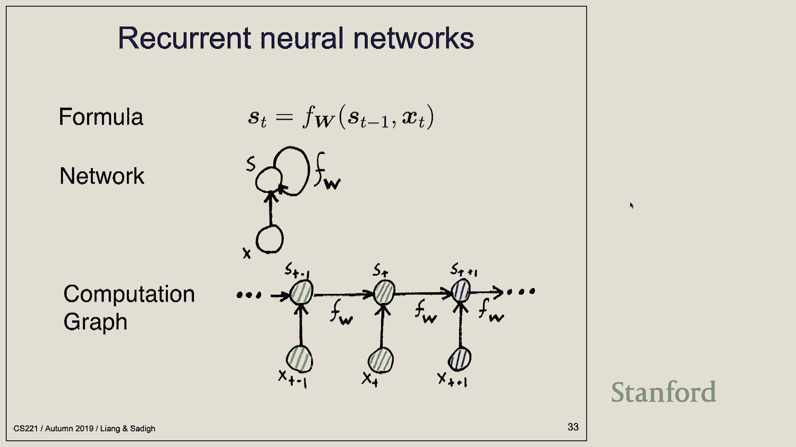

这与之前提到的乐高积木类比有关，因为整个网络是由几种不同的乐高积木块构建而成，基本上只是将它们堆叠在一起，组合起来，形成一个图像分类器。

以下是三个CNN架构的案例研究：

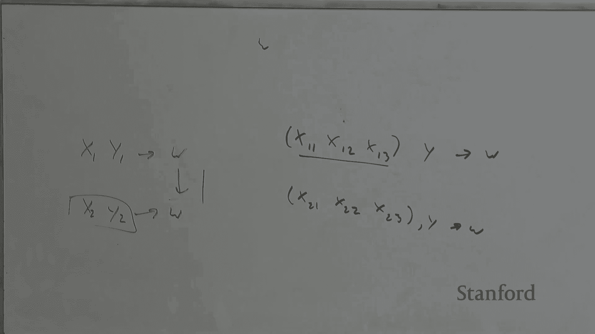

1.  **AlexNet**：这是在ImageNet竞赛中表现出色，真正将CNN带入计算机视觉主流的网络。基本上就是一个非常大的神经网络。他们使用的一个技巧是用ReLU代替Sigmoid激活函数，在实践中发现ReLU更容易训练。
2.  **VGGNet**：几年后出现在ImageNet上。基本上类似，就是一个CNN。值得注意的是它非常均匀，有16层，里面没有什么花哨的东西，只是一堆乐高积木块堆叠起来。它开启了网络更深、更“瘦高”的趋势。
3.  **ResNet（残差网络）**：将深度推向极致。残差网络的思想是，大多数时候你输入通过矩阵得到输出。如果你再次加入你的输入，这会非常有帮助，因为它使模型易于学习恒等函数。因此，你可以给模型提供一百层的能力，但如果你加入这些残差连接，它允许模型在认为最佳时跳过某一层。这也有助于反向传播训练。

总结一下，卷积神经网络通常应用于图像分类。关键思想是拥有这些在输入中滑动的滤波器，这实现了局部连接性的概念，并且参数是共享的。深度对这些网络确实很重要。

## 循环神经网络 🔁

现在我们来讨论循环神经网络。这里的想法是，你对输入序列进行建模。这可以是文本或句子，也可以是时间序列数据或金融数据。循环神经网络是一种将过去的输入反馈到自身的网络，因此它具有时间依赖性。

例如，我们有一个非常简单的循环神经网络。它是一个具有一个矩阵的函数，以过去的隐藏状态和当前输入作为参数，然后预测下一个隐藏状态。

大多数时候，人们从第三种视角讨论，即跨时间展开这个网络。在每个时间步，你有一个输入和一个状态，然后你的函数将你带到下一个状态。

一个更具体的例子是神经网络语言模型。这是一个负责读入句子并预测句子中最可能出现的下一个单词的模型。

我们称每个输入为 **X**，隐藏状态为 **H**。工作方式是：我们有一个函数，接收 **X1** 并将其编码到我们的隐藏状态中。然后我们有第二个函数，接收隐藏状态并将其解码为下一个输入。我们继续取下一个输入 **X2** 和之前的隐藏状态 **H1**，用它们创建一个新的隐藏编码，然后解码成我们的下一个输入。我们不断重复，每次取当前输入和之前的隐藏状态先创建编码，然后预测下一个输入。

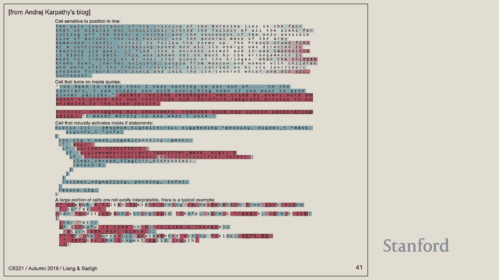

需要注意的一点是，我们现在正在构建这些向量 **H**，这正是我们想要的。它是一个向量，以某种方式捕获了到该时间步为止我们输入的所有 **X** 的含义或摘要。

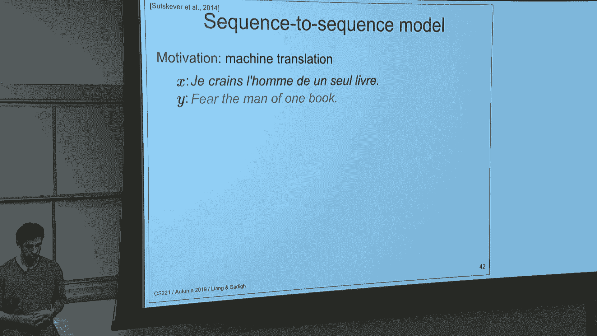

总的来说，循环神经网络存在一个问题。如果存在短依赖，即输出依赖于最近的输入，那么通过网络的路程很短，梯度很容易到达需要到达的地方以正确训练网络。但如果存在很长的依赖，梯度则难以完全传播。

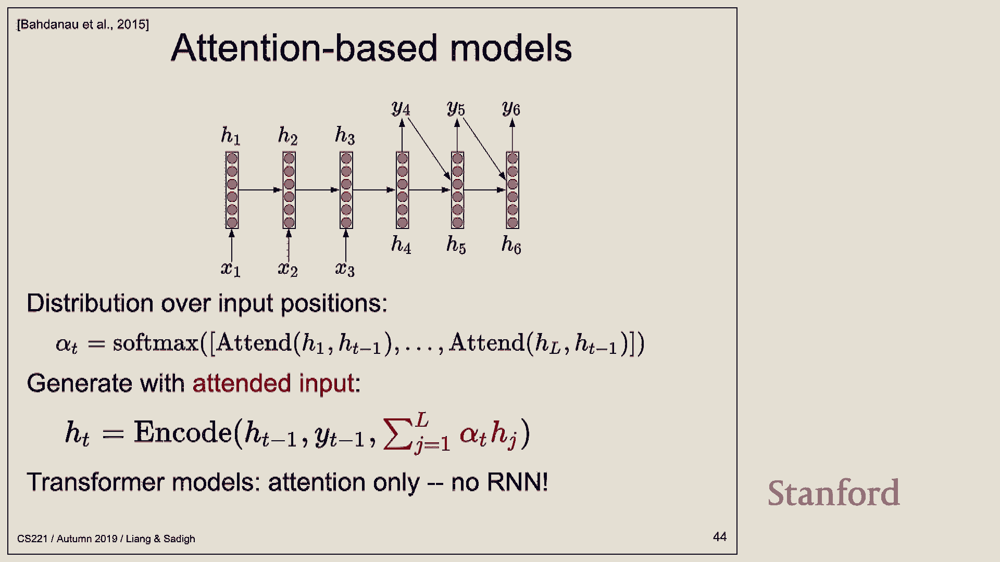

梯度下降可以看作是一个信用分配问题。梯度在某种程度上表示：如果我稍微改变这个输入，输出会改变多少？但如果输入和输出相距甚远，则很难计算输入的小扰动会如何影响输出。

原因在于，要计算梯度，你必须追踪整个依赖路径，查看该路径上所有部分的导数，并将它们相乘。问题是，如果路径很长，你就在乘很多数字。如果数字小于1，乘积会迅速变得非常小；如果数字大于1，乘积会迅速爆炸。这是一个问题，因为这意味着你的梯度要么极小，没有学习信号；要么太大，会冲向某个疯狂的方向。

好消息是，对于梯度爆炸问题，有一个快速的解决方法：**梯度裁剪**。你指定一个范数，任何范数大于该值的梯度都会被截断。但对于梯度消失问题，有一个很酷的想法：**长短期记忆单元**。

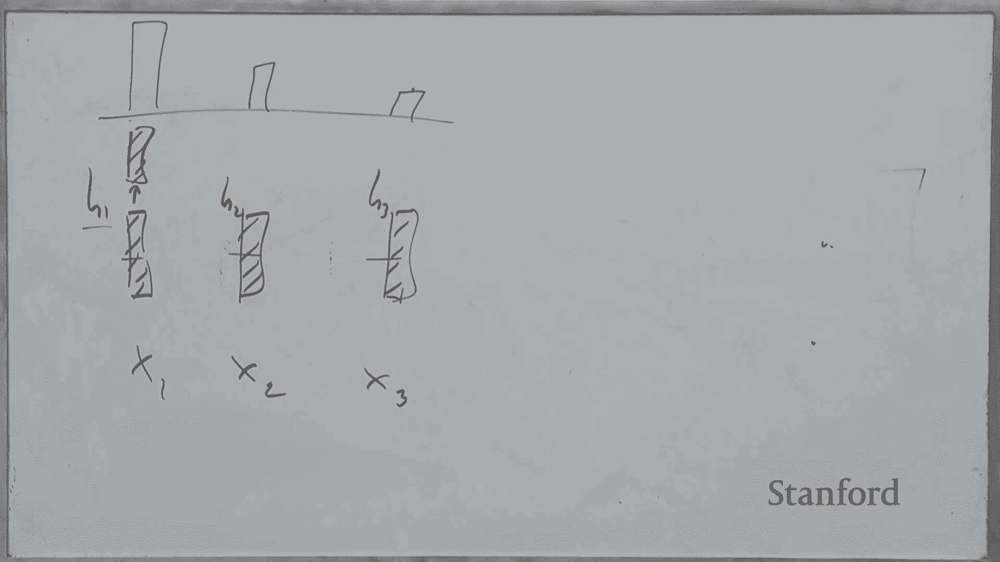

LSTM类似于循环单元，但它有两个隐藏状态。重要的是，你在这里进行的是加法组合，将输入与先前的隐藏状态相加，这与ResNet中的残差连接非常相似。因为加入了先前的状态，这为梯度提供了一条轻松回溯时间的“高速公路”。

LSTM的另一个视角是，它有一个暴露给外部的隐藏状态 **H**，以及一个内部的隐藏状态 **C**。内部状态 **C** 在一个“恒定误差传送带”上循环，包含了对网络在许多时间步长内有用的长期信息。

人们使用循环网络的另一个很酷的想法是**序列到序列模型**，例如机器翻译。你有一个输入序列和一个输出序列，你想读入输入序列然后输出输出序列。你通过编码器-解码器范式来实现。

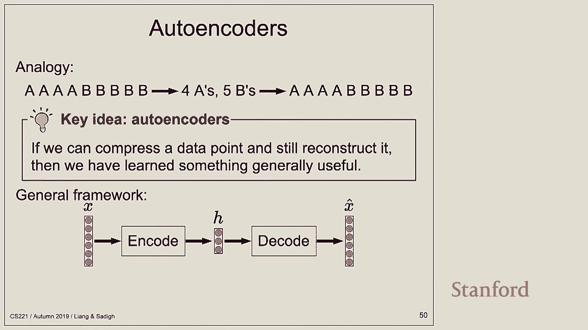

最近，还有基于**注意力**的模型，这在处理长序列时非常有帮助。注意力的思想是回顾输入。在解码时，你将当前的隐藏状态与编码器中所有的状态进行比较，计算一个分数来表示“我有多喜欢这个状态”。然后，你使用这些分数将它们转化为一个概率分布，并计算这些隐藏向量的加权平均，权重来自这个分布。

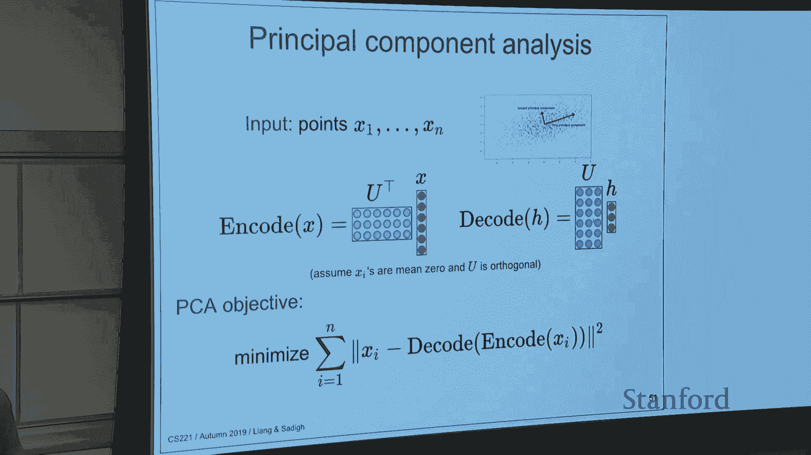

这有两个目的：首先，它提供了一些可解释性，你可以看到在每个时间步它关注输入的哪些部分；其次，它释放了模型必须将整个输入序列压缩到一个向量中的压力，现在它可以动态地回溯并检索所需的信息。

最近，还有所谓的**Transformer模型**，它完全摒弃了RNN部分，只使用注意力。在Transformer中，你取每个隐藏状态，将其与其他所有隐藏状态（包括自身）进行比较，得到一个分数，然后计算所有这些隐藏状态的加权平均，这成为你的下一层。

总结一下，循环神经网络可以处理序列并输出向量。直观上，它们像for循环一样顺序处理输入。但它们在训练上存在问题，梯度要么爆炸，要么变得非常小。LSTM是缓解此问题的一种方法，但它们并不完美，仍然需要将信息塞入一个向量中。因此，人们通过基于注意力的模型来解决这个问题，动态地根据需要回溯输入并检索信息。

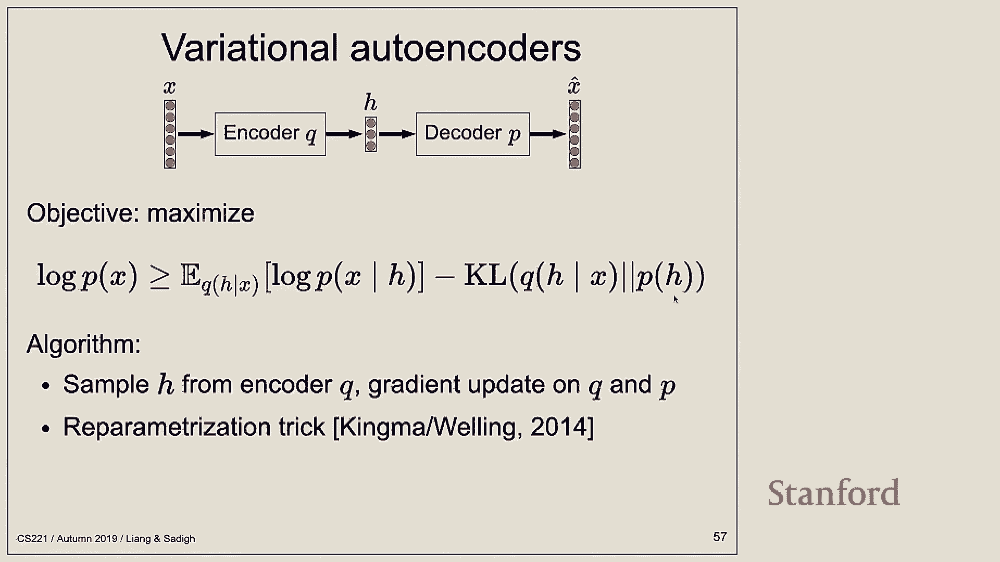

## 无监督学习 🎯

现在我们来讨论无监督学习。如前所述，神经网络最近才得以良好运行，很大程度上是因为它们需要大量数据。但如果你是一个较小的实验室，或者没有足够的资金购买数据集，或者问题本身数据就很少，那么在很多情况下，没有足够的数据来训练这些拥有数百万甚至数十亿参数的巨大模型。

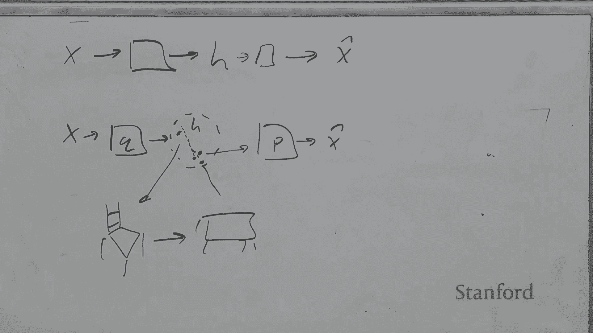

另一方面，周围有大量未标记的数据。你可以下载整个互联网。这有点类似于我们人类的灵感来源。我们从未被给予标记好的数据集来告诉我们什么食物可食，什么不可食。我们从世界中吸收经验，并用这些经验来指导未来的经验，从而能够进行推理和决策。

我们将要讨论的第一件事是**自编码器**。自编码器的思想是，如果你有一些信息，并尝试学习该信息的压缩表示，以便能够重建它，那么你可能就做了一些有用的事情。

在神经网络术语中，工作方式是：你给它某种向量，通过编码器得到隐藏向量，然后通过解码器重建你的输入。大多数情况下隐含的损失是，你希望重建的输入与原始输入非常相似。

为了说明这一点，主成分分析可以被视为一种编码器-解码器。PCA的思想是，你想提出一个矩阵 **U**，它是一个既可用于编码也可用于解码数据的向量。你将 **x** 乘以 **U** 得到一个隐藏向量或数据的新表示，但如果你转置 **U** 并将其乘以你的隐藏向量，那么应该得到尽可能接近原始数据的东西。

但这里有个问题。如果我们有一个包含许多单元的隐藏向量，它可能什么也学不到，只会学习如何将输入复制到输出。因此，许多关于自编码和无监督学习的研究都集中在如何控制复杂性并使模型足够鲁棒，以生成有用的表示，而不是仅仅复制。

第一种尝试可以是使用非线性变换。另一种方法是**破坏输入**，即对输入添加噪声，可能丢弃一些数字，或扰动一些数字，然后通过编码器和解码器传递这个被破坏的输入，最终的重建输出 **x_hat** 应该非常接近原始的未破坏输入。

另一种是**变分自编码器**，它具有很酷的概率解释。你可以将其视为一种贝叶斯网络。变分自编码器将输入映射到可能的 **h** 分布上，然后从这个分布中采样，通过解码器产生重建的输入。这样做的好处是，由于这是一个分布而不是一个向量，你在空间上强加了一些结构。因此，空间中接近的点应该映射到相似的 **x_hat**，并且当你在空间中移动时，应该能够逐渐从一个重建输入过渡到另一个。

我们将讨论的最后一种无监督学习方法是由一个特定任务激发的。有一个名为SQuAD的数据集，包含大约10万个例子，每个例子由一个段落和基于该段落的一系列多项选择题组成。这里的问题是只有10万个例子。

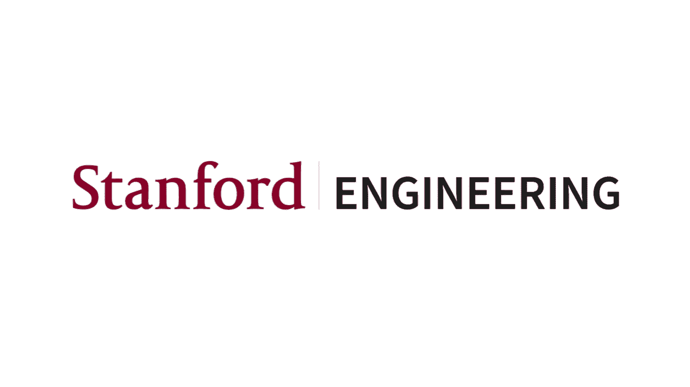

而这个任务试图获取的智能——阅读文本并理解它——是更普遍的，并且被比这10万