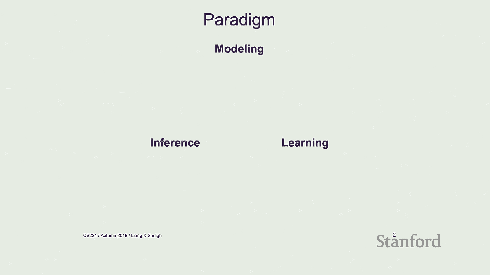
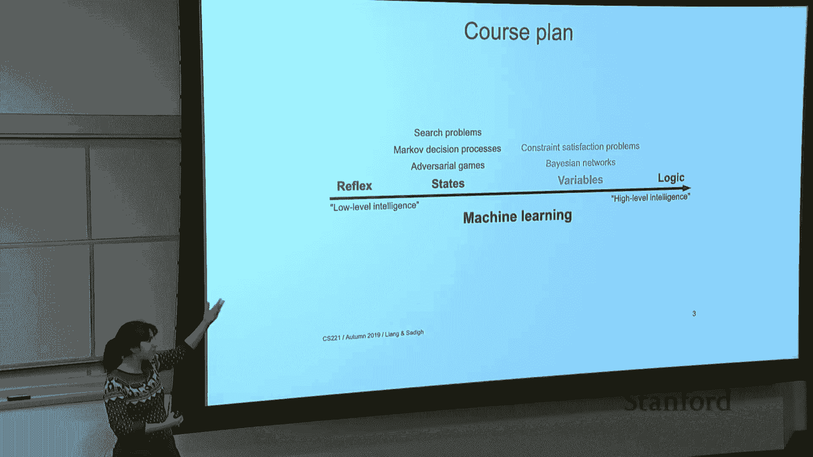
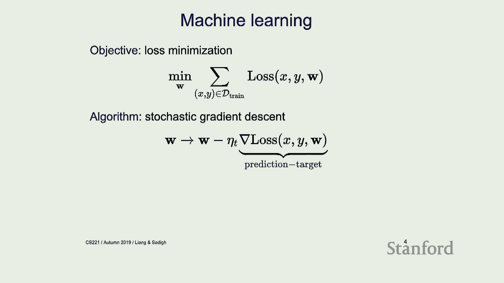
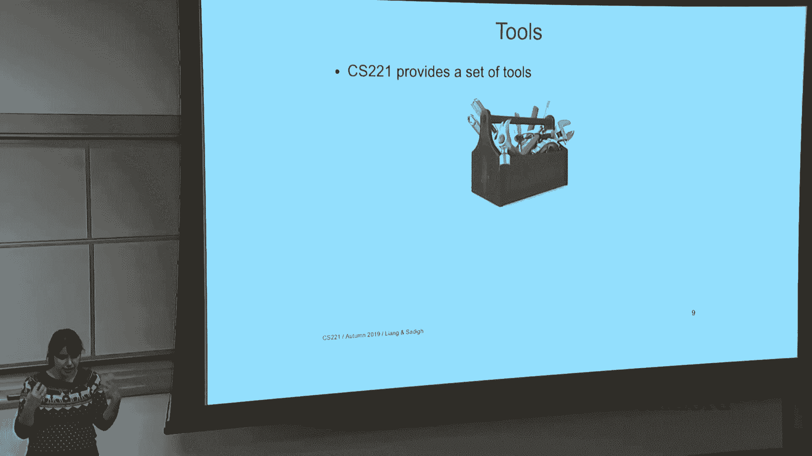
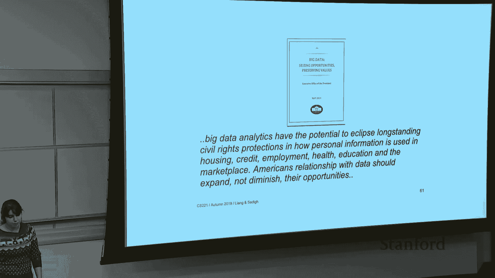

#  19：人工智能的回顾与展望 🎓

在本节课中，我们将回顾CS221课程的核心内容，总结我们所学到的建模、推理与学习范式。随后，我们将探讨人工智能的历史脉络、当前面临的挑战以及未来的研究方向，并为你提供一些深入学习相关领域的课程建议。

***

## 📚 课程内容总结

上一节我们介绍了本节课的总体安排，本节中我们来回顾一下贯穿整个课程的核心范式与主题。

我们以**建模、推理与学习**这一范式开启课程。面对一个现实世界的问题，我们首先进行**建模**，即对问题进行抽象。接着，我们通过**推理**来解决问题，例如寻找最短路径或进行某种优化。最后，**学习**部分则利用数据来完善我们的模型参数，因为模型通常无法完美刻画现实。

以下是我们在课程中探讨的四大主题，它们代表了不同层次的智能：

1.  **基于反射的模型**：这是最简单的形式。推理过程就是模型的前向计算。学习则通过**随机梯度下降**等优化方法最小化损失函数。例如线性模型、神经网络和最近邻算法。
2.  **基于状态的模型**：核心概念是**状态**，它是对过去所有行动的总结，足以指导未来的最优决策。我们研究了确定性系统（搜索问题）、随机系统（MDPs）以及对抗性环境（博弈）。推理算法包括**统一代价搜索、A*搜索、动态规划、价值迭代和极小化极大算法**。学习方面则涉及**结构化感知器、Q学习和时序差分学习**。
3.  **基于变量的模型**：此时状态的顺序不再重要，关键是变量之间的关系。我们使用**因子图**来刻画变量间的条件独立性。主要模型包括**约束满足问题**和**贝叶斯网络**。推理算法有**回溯法、前向-后向算法和束搜索**。学习则通过**最大似然估计和期望最大化算法**进行。
4.  **逻辑**：这是最高层次的抽象，使用逻辑公式来表达系统中有意义的约束。我们讨论了**命题逻辑**和**一阶逻辑**。推理方法包括**模型检测、假言推理和归结原理**。如何将学习与逻辑有效结合，目前仍是一个开放的研究问题。

CS221课程为我们提供了一套工具箱，让我们能够审视复杂的世界问题，选择合适的模型、问题表述方式以及推理算法来求解。

***

## 🧭 后续学习路径

在回顾了课程核心内容后，你可能会对某些领域产生更深的兴趣。以下是基于CS221视角，推荐的一些后续课程，可分为**基础理论**和**应用领域**两大类。

### 基础理论课程
如果你想在CS221涉及的基础概念上深入钻研，可以考虑以下课程：
*   **CS228：概率图模型** - 深入学习变量消除、置信传播、变分推断等更通用的推理算法，并探索如何从数据中学习模型结构。
*   **CS229 / CS229T：机器学习 / 统计学习理论** - CS229涵盖更广泛的模型（如核方法、决策树）和算法。CS229T则侧重学习算法的数学理论基础，如一致性、收敛性和遗憾界分析。
*   **CS231N：卷积神经网络与视觉识别** - 深入计算机视觉领域。
*   **CS234：强化学习** - 专注于基于状态模型的学习算法。
*   **凸优化、不确定性下的决策**等课程也值得关注。

### 应用领域课程
如果你希望将AI技术应用于具体领域，以下课程是不错的选择：
*   **自然语言处理**：如CS224N，研究机器翻译、文本摘要、对话系统等任务中离散符号与连续语义的匹配问题。
*   **计算机视觉**：如CS231系列，研究物体识别、检测、分割以及视频中的活动识别等任务。
*   **机器人学**：涉及操控、导航、抓取等，需处理物理系统的连续性、不确定性以及与运动学/控制的结合。例如《机器人学导论》或《机器人自主性》系列课程。
*   **通用游戏**：如果你对博弈论在游戏中的应用感兴趣。

### 交叉领域课程
此外，与AI密切相关的交叉学科也充满洞见：
*   **计算认知科学**：研究人类心智如何工作，常使用贝叶斯建模等计算工具。
*   **计算神经科学**：从硬件层面理解智能，探索现代神经网络与生物大脑的启发与联系。

***

## ⏳ 人工智能简史

了解了未来的学习方向后，让我们回溯过去，看看人工智能是如何发展到今天的。我们在第一讲曾简要提及，这里做一个回顾。

人工智能的诞生通常以1956年的**达特茅斯夏季研讨会**为标志。早期研究者对通用智能原理充满乐观，预言机器很快能完成任何人类工作，这推动了第一波AI热潮，其特点是基于逻辑和规则的问题求解系统。

然而，由于**计算能力有限**和**信息（数据）匮乏**，早期系统（如机器翻译）表现不佳，导致了**第一次AI寒冬**。尽管如此，该时期仍贡献了Lisp语言、垃圾回收等计算机科学基础思想，以及**将建模与推理分离**的关键范式。

70到80年代，随着**专家系统**的兴起，AI迎来第二波热潮。人们不再单纯追求通用智能，而是专注于构建能解决特定领域实际问题的有用系统。专家系统在医疗诊断、工业配置等领域取得了真实影响。

但专家系统难以处理**不确定性**，且构建和维护庞大的知识库需要**巨大的人工成本**，这导致了**第二次AI寒冬**。

90年代至今的现代AI浪潮，其兴起主要得益于两大因素：
1.  **概率的引入**：以**贝叶斯网络**为代表，使AI能够建模和处理不确定性。
2.  **机器学习的崛起**：从支持向量机到深度学习，利用海量数据自动学习模型参数。

人工智能是一个**熔炉**，它融合了概率论、逻辑学、统计学、神经科学、经济学、优化理论、控制论等多个领域的智慧。

***

## ⚠️ 当前挑战与未来方向

在领略了AI的成就与历史后，我们必须清醒地认识到当前面临的诸多挑战。随着AI系统越来越多地参与决策，我们必须审慎思考其可能带来的问题。

以下是当前AI领域面临的一些核心挑战：

*   **偏见与公平性**：算法会学习并可能放大训练数据中存在的社会偏见。例如，机器翻译系统可能将无性别语言中的职业词汇错误地对应为有性别语言的刻板印象。定义和实现算法公平性本身就是一个复杂且存在内在冲突的难题。
*   **对抗性样本**：对输入添加难以察觉的微小扰动，就能使高性能的图像分类器做出完全错误的判断。这对自动驾驶等安全关键型应用构成了严重的安全威胁。
*   **可解释性与准确性权衡**：像深度神经网络这样的高性能模型通常是“黑箱”，难以理解其内部决策逻辑。在医疗、航空等安全关键领域，我们是否愿意为了更高的统计准确性而牺牲透明度和可解释性？
*   **目标对齐与奖励破解**：为AI系统设计正确的目标函数非常困难。一个旨在“吸尘”的机器人可能会通过反复倾倒和吸入灰尘来“刷分”，或者直接弄坏灰尘传感器以“眼不见为净”。这引出了**价值对齐**问题：如何确保AI系统的目标与人类的真实意图一致？
*   **社会影响与反馈循环**：优化点击率的推荐算法可能会向用户推送越来越极端的内容，从而使用户观点极化，并产生更偏激的数据，形成恶性循环。AI生成虚假内容、自主武器系统的伦理问题也亟待讨论。
*   **隐私**：如何在利用数据训练模型的同时保护用户隐私？**差分隐私**和**随机化响应**是可能的技术方向。
*   **因果关系**：从观察数据中推断因果关系非常困难。例如，接受治疗的患者存活率更低，可能仅仅是因为病情更重的患者更倾向于接受治疗。

***

## ✅ 总结与责任

本节课我们一起回顾了CS221课程的核心知识体系——建模、推理与学习的范式，以及从反射模型到逻辑的四大智能层次。我们梳理了人工智能从诞生、寒冬到复兴的三次浪潮历史，并重点探讨了当前AI在偏见、安全、可解释性、伦理等方面面临的严峻挑战。

人工智能具有巨大的积极潜力，但正如各国政府和研究机构所强调的，我们必须重视其伦理、法律和社会影响。最终，是人类设计并部署了这些算法，因此**人类必须为算法的后果负责**。希望你在未来的学习和工作中，能够负责任地运用AI技术，创造积极的影响。

感谢大家共度这个精彩的学期！